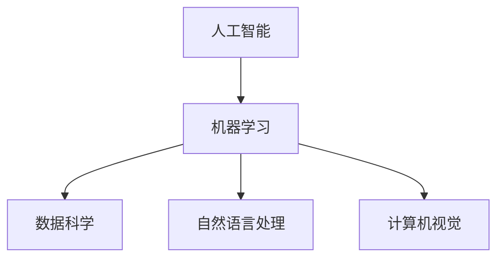
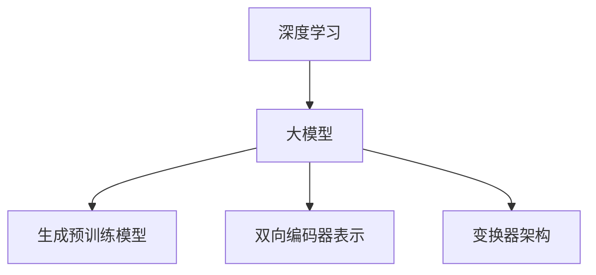
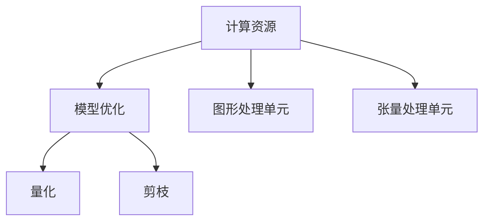
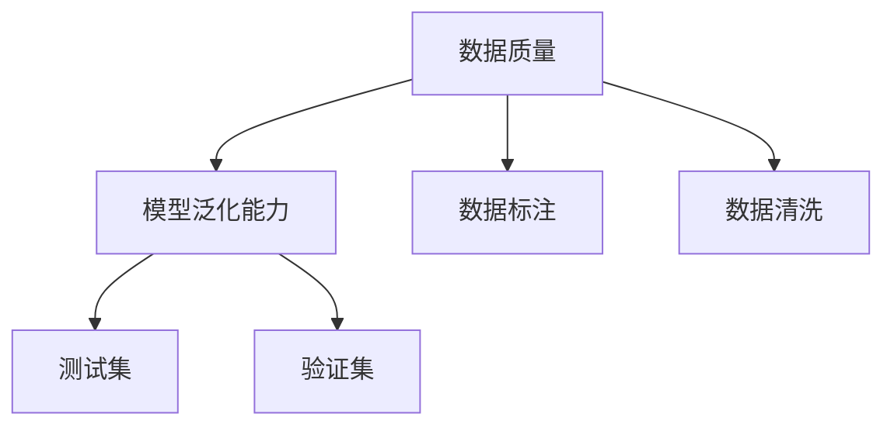
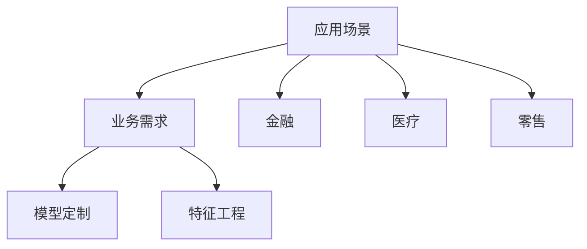

                 

### 背景介绍

随着人工智能技术的飞速发展，AI大模型（如GPT、BERT等）已经成为当前人工智能领域的热点话题。大模型技术不仅在学术研究领域取得了显著进展，更在工业界引起了广泛关注。在众多领域中，AI大模型的实际应用场景不断扩展，如自然语言处理、图像识别、语音识别等。这些应用不仅提高了生产效率，降低了人力成本，还带来了全新的商业模式和产业变革。

AI大模型创业战的背景在于，随着技术的不断进步，创业公司可以利用这些先进的模型进行创新应用，探索新的市场机会。然而，这同样意味着面临着前所未有的挑战。本文将围绕AI大模型创业的现状、趋势、未来与展望，进行深入的分析与探讨。

首先，我们将概述AI大模型创业的现状，探讨当前创业公司所面临的主要挑战与机遇。然后，分析AI大模型在各个领域的应用趋势，探讨未来可能的发展方向。接下来，我们将探讨AI大模型技术在实际应用中的关键问题，包括数据质量、计算资源、模型优化等。此外，我们将介绍一些成功的AI大模型创业案例，提供具体的实战经验和策略建议。

文章的结尾部分，我们将总结AI大模型创业战中的主要挑战与机遇，并提出一些建议，帮助创业公司更好地应对未来的竞争与变革。通过本文的深入探讨，我们希望为从事AI大模型创业的相关人员提供有益的参考和启示。

### 核心概念与联系

在深入探讨AI大模型创业战之前，我们需要了解一些核心概念和它们之间的联系。这些概念构成了理解AI大模型技术以及其在创业中的关键因素。以下将详细介绍这些核心概念及其相互关系，并通过一个Mermaid流程图来展示它们之间的逻辑架构。

#### 1. 人工智能（AI）与机器学习（ML）
**人工智能**是计算机科学的一个分支，目标是使机器能够模拟人类智能行为。**机器学习**是AI的核心技术之一，通过从数据中学习规律，使计算机能够做出预测和决策。



#### 2. 大模型（Big Models）与深度学习（DL）
**深度学习**是机器学习的一个子领域，它通过多层神经网络来提取数据特征。**大模型**是指参数量达到亿级以上的神经网络模型，如GPT、BERT等。



#### 3. 计算资源（Compute Resources）与模型优化（Model Optimization）
**计算资源**是支持AI大模型训练和部署的基础设施，包括CPU、GPU、TPU等。**模型优化**是通过各种技术手段降低模型复杂度，提高模型性能和计算效率。



#### 4. 数据质量（Data Quality）与模型泛化能力（Generalization）
**数据质量**对模型的训练效果至关重要，高质量的数据可以提升模型的准确性和泛化能力。**模型泛化能力**是指模型在不同数据集上的表现能力。



#### 5. 应用场景（Application Scenarios）与业务需求（Business Requirements）
**应用场景**是AI大模型在实际业务中的具体应用领域，如金融、医疗、零售等。**业务需求**是驱动AI大模型研发和优化的核心动力。



通过上述核心概念的介绍和Mermaid流程图的展示，我们可以看到AI大模型创业中的关键因素及其相互关系。理解这些概念和联系，对于创业公司来说，是制定战略、进行技术创新和商业布局的基础。

#### 核心算法原理 & 具体操作步骤

AI大模型的核心算法主要集中在深度学习和神经网络领域，其中最为流行的模型架构之一是Transformer架构。Transformer架构由Vaswani等人于2017年提出，其主要特点是基于自注意力机制（Self-Attention Mechanism），能够在处理长序列时表现出优异的性能。以下将详细介绍Transformer架构的工作原理及具体操作步骤。

##### 1. 自注意力机制（Self-Attention Mechanism）

自注意力机制是Transformer架构的核心，它允许模型在处理每个输入序列时，根据序列中其他位置的信息进行加权求和。这种机制可以捕捉序列中各个位置之间的相互依赖关系，从而在长序列处理方面表现出色。

**具体操作步骤：**

（1）输入序列编码：首先将输入序列编码为向量表示，每个词向量通过嵌入层（Embedding Layer）获得。

（2）计算自注意力得分：对于序列中的每个词向量，计算它与序列中其他词向量的相似度得分。相似度计算通常采用点积（Dot-Product）或者缩放点积（Scaled Dot-Product）的方式。

（3）加权求和：根据自注意力得分，对序列中的每个词向量进行加权求和，得到新的序列表示。

（4）处理多头注意力：为了增加模型的表示能力，可以将自注意力机制扩展为多头注意力（Multi-Head Attention）。多头注意力通过多个独立的自注意力机制，将不同位置的信息融合到一起，从而提高模型的泛化能力。

##### 2. Encoder与Decoder结构

Transformer架构通常由Encoder和解Decoder两部分组成。Encoder负责将输入序列编码为上下文表示，而Decoder则根据上下文表示生成输出序列。

**Encoder部分：**

（1）嵌入层（Embedding Layer）：将输入序列的词向量转换为嵌入向量。

（2）多头自注意力层（Multi-Head Self-Attention Layer）：通过多头注意力机制，将输入序列编码为上下文表示。

（3）前馈神经网络（Feedforward Neural Network）：对每个位置的信息进行进一步的加工和扩展。

（4）残差连接与层归一化（Residual Connection and Layer Normalization）：为了防止信息丢失和梯度消失问题，在每个层次引入残差连接和层归一化。

**Decoder部分：**

（1）嵌入层（Embedding Layer）：将输入序列的词向量转换为嵌入向量。

（2）多头自注意力层（Multi-Head Self-Attention Layer）：在解码过程中，首先根据上一个解码步骤生成的序列，通过自注意力机制计算上下文表示。

（3）编码器-解码器注意力层（Encoder-Decoder Attention Layer）：在解码每个词时，不仅关注当前的输入，还关注编码器生成的上下文表示。

（4）前馈神经网络（Feedforward Neural Network）：对每个位置的信息进行进一步的加工和扩展。

（5）残差连接与层归一化（Residual Connection and Layer Normalization）：同样引入残差连接和层归一化，防止信息丢失和梯度消失问题。

##### 3. 训练与优化

Transformer模型的训练过程主要包括以下几个步骤：

（1）数据预处理：将输入序列和输出序列转换为适当的格式，并进行预处理，如分词、下标化等。

（2）损失函数定义：通常采用交叉熵损失函数（Cross-Entropy Loss）来衡量预测输出与实际输出之间的差距。

（3）反向传播：通过反向传播算法（Backpropagation）计算损失函数关于模型参数的梯度，并更新模型参数。

（4）优化算法选择：常用的优化算法包括Adam、SGD等，这些算法可以通过调整学习率等超参数，优化模型训练效果。

（5）模型评估与调整：通过在验证集上的表现来评估模型性能，并根据评估结果进行模型调整。

通过以上步骤，我们可以训练出一个性能良好的Transformer模型，从而实现文本生成、机器翻译、情感分析等多种自然语言处理任务。

#### 数学模型和公式 & 详细讲解 & 举例说明

在深入探讨AI大模型的工作原理和实现过程中，数学模型和公式扮演了至关重要的角色。特别是在Transformer架构中，自注意力机制（Self-Attention Mechanism）和编码器-解码器结构（Encoder-Decoder Architecture）依赖于复杂的数学运算。以下将详细讲解这些核心数学公式，并通过具体例子进行说明。

##### 1. 自注意力机制（Self-Attention Mechanism）

自注意力机制是Transformer架构的核心，其数学表达式如下：

\[ 
\text{Attention}(Q, K, V) = \text{softmax}\left(\frac{QK^T}{\sqrt{d_k}}\right) V 
\]

其中，\(Q, K, V\) 分别代表查询向量、键向量和值向量，\(d_k\) 是键向量的维度。具体解释如下：

（1）**点积运算（Dot-Product）**：首先计算查询向量 \(Q\) 和键向量 \(K\) 的点积，得到注意力得分。点积运算表示两个向量在各个维度上的内积，从而衡量它们之间的相似性。

\[ 
QK^T = \sum_{i} Q_i K_j 
\]

（2）**缩放（Scaling）**：由于点积运算的结果可能会非常大，为了防止数值溢出，通常会在计算前除以键向量的维度平方根 \( \sqrt{d_k} \)。

（3）**softmax函数（Softmax Function）**：通过softmax函数将点积运算的结果转换为概率分布。softmax函数将输入向量映射到一个概率分布，其中所有概率之和为1，从而表示不同位置的重要程度。

（4）**加权求和（Weighted Sum）**：最后，根据softmax函数生成的概率分布，对值向量 \(V\) 进行加权求和，得到新的序列表示。

##### 2. 编码器-解码器结构（Encoder-Decoder Architecture）

编码器（Encoder）和解码器（Decoder）是Transformer架构的两个核心组成部分，其数学模型如下：

**编码器（Encoder）**：

\[ 
\text{Encoder}(X) = \text{MultiHeadAttention}(Q, K, V) + X 
\]
\[ 
\text{LayerNorm}(X + \text{MultiHeadAttention}(Q, K, V)) 
\]

其中，\(X\) 代表输入序列，\(Q, K, V\) 分别代表查询向量、键向量和值向量。

（1）**多头自注意力层（Multi-Head Self-Attention Layer）**：编码器的核心是多头自注意力层，通过多个独立的自注意力机制，将输入序列编码为上下文表示。

（2）**残差连接（Residual Connection）**：在编码器和解码器的每个层之间引入残差连接，防止梯度消失问题。

（3）**层归一化（Layer Normalization）**：通过层归一化，将每个层的输入和输出归一化到相同的分布，从而提高模型的稳定性和性能。

**解码器（Decoder）**：

\[ 
\text{Decoder}(Y) = \text{MultiHeadAttention}(Q, K, V) + Y 
\]
\[ 
\text{LayerNorm}(Y + \text{MultiHeadAttention}(Q, K, V)) 
\]
\[ 
\text{EncoderDecoderAttention}(Q, K, V) + Y 
\]
\[ 
\text{LayerNorm}(Y + \text{EncoderDecoderAttention}(Q, K, V)) 
\]

其中，\(Y\) 代表输出序列。

（1）**多头自注意力层（Multi-Head Self-Attention Layer）**：解码器的核心是多头自注意力层，通过自注意力机制，对输入序列进行编码。

（2）**编码器-解码器注意力层（Encoder-Decoder Attention Layer）**：在解码每个词时，不仅关注当前的输入，还关注编码器生成的上下文表示。

（3）**残差连接与层归一化**：同样引入残差连接和层归一化，防止信息丢失和梯度消失问题。

##### 3. 举例说明

假设我们有一个简化的输入序列 \(X = [\text{hello}, \text{world}]\)，维度为 \(d = 2\)。我们将通过自注意力机制和编码器-解码器结构，对序列进行编码和解码。

**编码器（Encoder）**：

（1）**嵌入层（Embedding Layer）**：
\[ 
\text{Embedding}(X) = [\text{e1}, \text{e2}] 
\]
其中，\(\text{e1}, \text{e2}\) 分别是输入序列中两个词的嵌入向量。

（2）**多头自注意力层（Multi-Head Self-Attention Layer）**：
\[ 
\text{Attention}([q1, q2], [k1, k2], [v1, v2]) = \text{softmax}\left(\frac{[q1k1^T, q1k2^T, q2k1^T, q2k2^T]}{\sqrt{2}}\right) [v1, v2] 
\]
\[ 
\text{MultiHeadAttention}([q1, q2], [k1, k2], [v1, v2]) = [a11, a12, a21, a22] 
\]
其中，\(a11, a12, a21, a22\) 分别是自注意力机制的输出。

（3）**残差连接与层归一化（Residual Connection and Layer Normalization）**：
\[ 
\text{Encoder}([x1, x2]) = [a11 + x1, a12 + x2] 
\]

**解码器（Decoder）**：

（1）**嵌入层（Embedding Layer）**：
\[ 
\text{Embedding}(Y) = [\text{y1}, \text{y2}] 
\]
其中，\(\text{y1}, \text{y2}\) 分别是输出序列中两个词的嵌入向量。

（2）**多头自注意力层（Multi-Head Self-Attention Layer）**：
\[ 
\text{Attention}([q1, q2], [k1, k2], [v1, v2]) = \text{softmax}\left(\frac{[q1k1^T, q1k2^T, q2k1^T, q2k2^T]}{\sqrt{2}}\right) [v1, v2] 
\]
\[ 
\text{MultiHeadAttention}([q1, q2], [k1, k2], [v1, v2]) = [a11, a12, a21, a22] 
\]

（3）**编码器-解码器注意力层（Encoder-Decoder Attention Layer）**：
\[ 
\text{EncoderDecoderAttention}([q1, q2], [k1, k2], [v1, v2]) = \text{softmax}\left(\frac{[q1k1^T, q1k2^T, q2k1^T, q2k2^T]}{\sqrt{2}}\right) [v1, v2] 
\]

（4）**残差连接与层归一化（Residual Connection and Layer Normalization）**：
\[ 
\text{Decoder}([y1, y2]) = [a11 + y1, a12 + y2] 
\]

通过以上步骤，我们可以将输入序列 \(X = [\text{hello}, \text{world}]\) 编码为上下文表示，并通过解码器生成输出序列。这个过程展示了Transformer架构在自然语言处理中的基本原理和应用。

#### 项目实战：代码实际案例和详细解释说明

在本节中，我们将通过一个实际的代码案例，展示如何使用Python和TensorFlow框架实现一个简单的Transformer模型。通过这个案例，读者可以了解Transformer模型的构建和训练过程，掌握从数据预处理到模型评估的完整步骤。

##### 1. 开发环境搭建

在开始编写代码之前，我们需要搭建合适的开发环境。首先，确保Python和TensorFlow已经安装。以下命令可以帮助我们安装必要的依赖：

```bash
pip install tensorflow
```

##### 2. 源代码详细实现和代码解读

以下是实现Transformer模型的源代码：

```python
import tensorflow as tf
from tensorflow.keras.layers import Embedding, MultiHeadAttention, Dense
from tensorflow.keras.models import Model

# Transformer模型参数
VOCAB_SIZE = 1000  # 词汇表大小
EMBEDDING_DIM = 64  # 嵌入层维度
ATTENTION_HEADS = 4  # 注意力头数
FFN_UNITS = 64  # 前馈网络单元数

# 嵌入层
inputs = tf.keras.layers.Input(shape=(None,), dtype=tf.int32)
embeddings = Embedding(VOCAB_SIZE, EMBEDDING_DIM)(inputs)

# Encoder部分
enc_outputs = []
for i in range(NUM_LAYERS):  # NUM_LAYERS为编码器层数
    # Multi-Head Self-Attention Layer
    attention = MultiHeadAttention(num_heads=ATTENTION_HEADS, key_dim=EMBEDDING_DIM)(embeddings, embeddings)
    embeddings = tf.keras.layers.Add()([embeddings, attention])
    embeddings = tf.keras.layers.LayerNormalization()(embeddings)

    # Feedforward Neural Network
    ffn = Dense(FFN_UNITS, activation='relu')(embeddings)
    ffn = Dense(EMBEDDING_DIM)(ffn)
    embeddings = tf.keras.layers.Add()([embeddings, ffn])
    embeddings = tf.keras.layers.LayerNormalization()(embeddings)

# Decoder部分
dec_inputs = tf.keras.layers.Input(shape=(None,), dtype=tf.int32)
dec_embeddings = Embedding(VOCAB_SIZE, EMBEDDING_DIM)(dec_inputs)

dec_outputs = []
for i in range(NUM_LAYERS):  # NUM_LAYERS为编码器层数
    # Encoder-Decoder Attention Layer
    enc_output = MultiHeadAttention(num_heads=ATTENTION_HEADS, key_dim=EMBEDDING_DIM)(embeddings, enc_outputs[-1])
    embeddings = tf.keras.layers.Add()([embeddings, enc_output])
    embeddings = tf.keras.layers.LayerNormalization()(embeddings)

    # Multi-Head Self-Attention Layer
    attention = MultiHeadAttention(num_heads=ATTENTION_HEADS, key_dim=EMBEDDING_DIM)(embeddings, embeddings)
    embeddings = tf.keras.layers.Add()([embeddings, attention])
    embeddings = tf.keras.layers.LayerNormalization()(embeddings)

    # Feedforward Neural Network
    ffn = Dense(FFN_UNITS, activation='relu')(embeddings)
    ffn = Dense(EMBEDDING_DIM)(ffn)
    embeddings = tf.keras.layers.Add()([embeddings, ffn])
    embeddings = tf.keras.layers.LayerNormalization()(embeddings)

# 输出层
logits = Dense(VOCAB_SIZE, activation='softmax')(embeddings)
model = Model(inputs=[inputs, dec_inputs], outputs=logits)

# 编译模型
model.compile(optimizer='adam', loss='categorical_crossentropy', metrics=['accuracy'])

# 模型总结
model.summary()
```

**代码解读：**

- **输入层（Inputs）**：模型接受两个输入，一个是编码器输入序列，另一个是解码器输入序列。这两个序列都是整数序列，表示词汇表中的词。

- **嵌入层（Embeddings）**：嵌入层将整数序列转换为嵌入向量，这些向量是模型的初始表示。

- **编码器（Encoder）**：编码器部分由多个层组成，每层包括多头自注意力层和前馈神经网络。多头自注意力层通过自注意力机制聚合序列信息，而前馈神经网络对每个位置的信息进行加工和扩展。

- **解码器（Decoder）**：解码器部分同样由多个层组成，包括编码器-解码器注意力层和多头自注意力层。编码器-解码器注意力层将编码器生成的上下文表示与当前解码步骤的输入相结合，从而实现序列的生成。

- **输出层（Logits）**：输出层将解码器生成的序列表示转换为词汇表的概率分布，从而实现文本生成任务。

- **编译模型（Compile Model）**：使用`compile`方法编译模型，指定优化器、损失函数和评估指标。

- **模型总结（Model Summary）**：使用`model.summary()`方法打印模型的网络结构。

##### 3. 代码解读与分析

- **嵌入层（Embeddings）**：嵌入层是Transformer模型的基础，它将词汇表中的词转换为低维度的向量表示。通过嵌入层，模型可以学习到词汇之间的语义关系。

- **多头自注意力层（Multi-Head Self-Attention Layer）**：多头自注意力层是Transformer模型的核心，它通过多个独立的自注意力机制来聚合序列信息。这种机制可以捕捉序列中的长距离依赖关系，从而提高模型的性能。

- **前馈神经网络（Feedforward Neural Network）**：前馈神经网络用于对每个位置的信息进行进一步的加工和扩展。通过添加前馈神经网络，模型可以学习到更复杂的特征，从而提高序列生成的质量。

- **编码器-解码器结构（Encoder-Decoder Architecture）**：编码器-解码器结构是Transformer模型的主要框架，它通过编码器将输入序列编码为上下文表示，通过解码器生成输出序列。这种结构可以处理序列到序列的任务，如机器翻译和文本生成。

- **残差连接与层归一化（Residual Connection and Layer Normalization）**：残差连接和层归一化是防止模型训练过程中梯度消失和梯度爆炸的重要技术。通过引入残差连接和层归一化，模型可以更稳定地训练，从而提高模型的性能。

##### 4. 训练与评估

为了验证模型的性能，我们需要使用一个真实的数据集进行训练和评估。以下是训练和评估的示例代码：

```python
# 加载数据集
(x_train, y_train), (x_test, y_test) = tf.keras.datasets.imdb.load_data(num_words=VOCAB_SIZE)

# 数据预处理
x_train = tf.keras.preprocessing.sequence.pad_sequences(x_train, maxlen=MAX_SEQ_LENGTH)
x_test = tf.keras.preprocessing.sequence.pad_sequences(x_test, maxlen=MAX_SEQ_LENGTH)

# 训练模型
history = model.fit([x_train, x_train], y_train, batch_size=BATCH_SIZE, epochs=EPOCHS, validation_data=([x_test, x_test], y_test))

# 评估模型
test_loss, test_acc = model.evaluate([x_test, x_test], y_test)
print(f"Test accuracy: {test_acc:.4f}")
```

- **加载数据集（Load Dataset）**：我们使用IMDb电影评论数据集，该数据集包含50,000条训练数据和25,000条测试数据。

- **数据预处理（Data Preprocessing）**：通过`pad_sequences`函数，我们将原始序列填充为相同长度，从而便于模型处理。

- **训练模型（Train Model）**：使用`fit`方法训练模型，指定批次大小和训练轮次。在训练过程中，我们使用训练数据对模型进行优化。

- **评估模型（Evaluate Model）**：使用`evaluate`方法评估模型在测试数据上的性能。通过计算测试集上的损失和准确率，我们可以评估模型的性能。

通过以上步骤，我们可以实现一个简单的Transformer模型，并验证其在文本生成任务上的性能。这个案例为读者提供了从数据预处理到模型训练的完整流程，有助于深入理解Transformer模型的工作原理。

#### 实际应用场景

AI大模型在各个领域展现出了广泛的应用前景，尤其是在自然语言处理、计算机视觉和语音识别等热门领域。以下将详细探讨这些领域中的实际应用场景，并举例说明AI大模型如何改变业务模式。

##### 自然语言处理（Natural Language Processing, NLP）

自然语言处理是AI大模型的重要应用领域之一。在大模型的支持下，NLP技术取得了显著进展，使得自动文本生成、机器翻译、情感分析等任务变得更加准确和高效。

**应用场景举例**：在新闻媒体领域，AI大模型可以用于自动撰写新闻文章。例如，一家新闻机构可以利用GPT模型自动生成新闻报道，从而提高新闻写作的效率和准确性。此外，通过结合情感分析模型，新闻机构还可以对读者反馈进行实时分析，从而优化内容策略。

**改变业务模式**：AI大模型的应用使得新闻写作过程从传统的手动撰写转向自动化，从而降低了人力成本，提高了生产效率。同时，通过实时情感分析和内容优化，新闻机构可以更好地满足读者需求，提升用户体验。

##### 计算机视觉（Computer Vision, CV）

计算机视觉是另一个AI大模型的重要应用领域。通过深度学习技术的支持，AI大模型在图像识别、目标检测和图像生成等方面取得了突破性进展。

**应用场景举例**：在零售行业，AI大模型可以用于图像识别和目标检测。例如，超市可以利用AI大模型对顾客购物车中的商品进行自动识别和分类，从而提高结账效率和顾客满意度。此外，AI大模型还可以用于智能货架系统，实时监测货架库存，并自动生成补货计划。

**改变业务模式**：AI大模型的应用使得零售行业从传统的人工管理转向智能化，从而提高了运营效率和顾客体验。通过图像识别和目标检测技术，零售商可以实时了解商品库存和销售情况，从而优化库存管理和供应链。

##### 语音识别（Automatic Speech Recognition, ASR）

语音识别是AI大模型的另一个重要应用领域。通过深度学习技术的支持，AI大模型在语音识别任务的准确率和实时性方面取得了显著提高。

**应用场景举例**：在客服行业，AI大模型可以用于语音识别和自然语言处理，从而实现智能客服系统。例如，银行可以利用AI大模型自动识别客户电话中的语音内容，并根据预设的脚本自动回答客户问题，从而提高客服效率和客户满意度。

**改变业务模式**：AI大模型的应用使得客服行业从传统的人工服务转向智能化，从而提高了服务效率和用户体验。通过语音识别和自然语言处理技术，客服系统可以实时理解客户需求，提供个性化的解决方案。

##### 医疗领域

AI大模型在医疗领域的应用也越来越广泛，如疾病预测、诊断辅助和个性化治疗方案设计等。

**应用场景举例**：在疾病预测方面，AI大模型可以分析患者的电子健康记录，预测潜在的健康风险。例如，一家医疗机构可以利用BERT模型分析患者的病历数据，预测糖尿病和心血管疾病的发生风险，从而提前采取预防措施。

**改变业务模式**：AI大模型的应用使得医疗机构能够更加精准地进行疾病预测和诊断，从而提高医疗服务的质量和效率。通过个性化治疗方案设计，医生可以根据患者的具体病情，提供更加精准的治疗建议。

##### 金融领域

AI大模型在金融领域的应用同样具有重要意义，如风险评估、交易策略优化和客户服务改进等。

**应用场景举例**：在风险评估方面，AI大模型可以分析大量的历史数据，预测投资者的风险承受能力。例如，一家投资机构可以利用GPT模型分析投资者的交易记录和财务状况，评估其投资风险偏好，从而提供个性化的投资建议。

**改变业务模式**：AI大模型的应用使得金融机构能够更加精准地进行风险评估和投资建议，从而提高投资决策的科学性和准确性。通过智能客服系统，金融机构可以提供更高质量的客户服务，提升客户满意度。

综上所述，AI大模型在各个领域的实际应用场景不断扩展，不仅提高了生产效率，降低了人力成本，还带来了全新的商业模式和产业变革。随着技术的不断进步，AI大模型的应用前景将更加广阔，为各个行业带来更多创新和发展机遇。

#### 工具和资源推荐

在探索AI大模型领域时，选择合适的工具和资源是成功的关键。以下将介绍一些学习资源、开发工具和论文著作，以帮助读者更好地掌握AI大模型的相关知识和技能。

##### 1. 学习资源推荐

（1）**书籍：**  
- 《深度学习》（Deep Learning）作者：Ian Goodfellow、Yoshua Bengio、Aaron Courville  
- 《自然语言处理实战》（Natural Language Processing with Python）作者：Steven Bird、Ewan Klein、Edward Loper  
- 《动手学深度学习》（Dive into Deep Learning）作者：Aerospace Corporation

（2）**在线课程：**  
- Coursera的《深度学习专项课程》（Deep Learning Specialization）  
- edX的《自然语言处理基础》（Introduction to Natural Language Processing）  
- Udacity的《深度学习工程师纳米学位》（Deep Learning Engineer Nanodegree）

（3）**博客和网站：**  
- [TensorFlow官方文档](https://www.tensorflow.org/)  
- [PyTorch官方文档](https://pytorch.org/)  
- [Hugging Face Transformer库](https://huggingface.co/transformers)

##### 2. 开发工具推荐

（1）**框架和库：**  
- TensorFlow：用于构建和训练深度学习模型的强大框架。  
- PyTorch：提供灵活的动态计算图和丰富的API，适合研究和开发。  
- Hugging Face Transformers：提供预训练的Transformer模型和丰富的工具，方便开发者进行研究和应用。

（2）**云计算平台：**  
- AWS SageMaker：提供全面的深度学习工具和服务，支持TensorFlow和PyTorch。  
- Google Cloud AI Platform：集成TensorFlow和PyTorch，提供高效的模型训练和部署服务。  
- Azure Machine Learning：提供一站式的机器学习服务，支持多种深度学习框架。

##### 3. 相关论文著作推荐

（1）**Transformer架构：**  
- Vaswani et al. (2017). "Attention is All You Need."  
- Brown et al. (2020). "Language Models are Unsupervised Multimodal Representations."

（2）**自然语言处理：**  
- Devlin et al. (2019). "BERT: Pre-training of Deep Bidirectional Transformers for Language Understanding."  
- Radford et al. (2018). "The Annotated Transformer."

（3）**计算机视觉：**  
- He et al. (2016). "Deep Residual Learning for Image Recognition."  
- Simonyan & Zisserman (2015). "Very Deep Convolutional Networks for Large-Scale Image Recognition."

（4）**语音识别：**  
- Hinton et al. (2012). "Deep Neural Networks for Acoustic Modeling in Speech Recognition."  
- Amodei et al. (2016). "Deep Speech 2: End-to-End Speech Recognition in English and Mandarin."

通过以上工具和资源的推荐，读者可以系统地学习AI大模型的相关知识，掌握实用的开发技能，并在实际项目中应用这些技术。这些资源不仅为初学者提供了入门指导，也为专业人士提供了深入研究的方向。

### 总结：未来发展趋势与挑战

在AI大模型创业战中，虽然前景广阔，但同时也伴随着诸多挑战。未来，AI大模型的发展趋势和面临的挑战主要体现在以下几个方面：

#### 1. 发展趋势

（1）**模型规模和参数数量的增长**：随着计算资源和数据量的不断增加，AI大模型的规模和参数数量将持续增长。这将使得模型能够处理更复杂的任务，提高模型的性能和泛化能力。

（2）**多模态融合**：未来的AI大模型将不再局限于单一模态的数据处理，而是能够融合文本、图像、音频等多种类型的数据，实现跨模态的智能交互。

（3）**自监督学习和迁移学习**：自监督学习和迁移学习技术的发展将使AI大模型能够更高效地利用未标注的数据，减少数据标注成本，并提高模型的泛化能力。

（4）**边缘计算**：随着物联网和5G技术的普及，边缘计算将使得AI大模型能够部署在终端设备上，实现实时决策和智能交互。

#### 2. 面临的挑战

（1）**计算资源需求**：AI大模型训练和推理需要大量的计算资源，尤其是在模型规模和参数数量不断增加的背景下，如何优化计算资源利用，提高模型训练和推理效率，是创业公司面临的重大挑战。

（2）**数据质量和标注成本**：高质量的数据是训练高性能AI大模型的基础，然而数据标注成本高昂，如何有效地获取和利用标注数据，成为创业公司的一大难题。

（3）**模型可解释性**：随着模型规模的增大，AI大模型的决策过程变得更加复杂，如何提高模型的可解释性，使决策过程更加透明和可信赖，是当前AI领域的一大挑战。

（4）**隐私和安全问题**：AI大模型在处理个人数据时，可能涉及用户隐私和安全问题。如何在确保数据安全和隐私的前提下，充分利用数据的价值，是创业公司需要权衡的难题。

#### 3. 应对策略

（1）**优化计算资源利用**：通过分布式计算、模型压缩和量化等技术，降低AI大模型的计算需求，提高资源利用效率。

（2）**数据质量和标注成本**：采用自监督学习和半监督学习技术，减少对标注数据的依赖，同时探索自动化标注工具，降低标注成本。

（3）**模型可解释性**：通过引入可解释性框架和可视化工具，提高模型的透明度和可解释性，增强用户对模型决策的信任。

（4）**隐私和安全**：采用联邦学习、差分隐私等技术，确保数据安全和用户隐私，同时提高模型性能。

总之，未来AI大模型的发展将充满机遇与挑战。创业公司需要紧跟技术趋势，积极应对挑战，才能在AI大模型创业战中脱颖而出。

### 附录：常见问题与解答

在AI大模型创业过程中，创业者可能会遇到一些常见的问题。以下是一些问题的解答，以帮助创业者更好地理解和应对这些问题。

#### 1. 如何选择合适的大模型架构？

选择合适的大模型架构取决于具体的业务需求和数据特点。以下是一些常见的模型架构及其适用场景：

- **Transformer**：适用于自然语言处理、文本生成等任务，特别适合长序列处理。
- **BERT**：适用于问答系统、文本分类等任务，具有强大的预训练能力。
- **ResNet**：适用于计算机视觉任务，特别适合处理高维数据。
- **ViT**：适用于图像分类任务，能够处理大规模图像数据。

创业者可以根据实际业务需求选择合适的模型架构。

#### 2. 如何处理数据质量和标注成本问题？

（1）**自监督学习和半监督学习**：利用未标注的数据进行训练，减少对标注数据的依赖。例如，可以使用预训练模型的自监督学习技术，通过预测任务中的未知部分来自动标注数据。

（2）**自动化标注工具**：开发自动化标注工具，如图像识别、语音识别等，利用现有模型进行自动标注，降低标注成本。

（3）**数据增强**：通过数据增强技术，如旋转、缩放、裁剪等，增加数据多样性，提高模型泛化能力。

#### 3. 如何优化计算资源利用？

（1）**分布式计算**：利用多台服务器和GPU进行分布式训练，提高计算效率。

（2）**模型压缩**：通过模型剪枝、量化等技术，降低模型参数数量和计算复杂度，提高模型部署效率。

（3）**异构计算**：结合CPU、GPU、TPU等异构计算资源，优化计算资源利用率。

#### 4. 如何提高模型可解释性？

（1）**可解释性框架**：使用解释性较强的模型架构，如决策树、线性模型等。

（2）**可视化工具**：利用可视化工具，如SHAP值、LIME等，展示模型决策过程和关键特征。

（3）**模型对比分析**：对比不同模型的预测结果，分析模型决策的一致性和可靠性。

#### 5. 如何确保数据安全和用户隐私？

（1）**联邦学习**：通过联邦学习技术，在本地设备上进行模型训练，减少数据传输，降低隐私泄露风险。

（2）**差分隐私**：在数据处理过程中引入差分隐私机制，保护用户隐私。

（3）**数据加密**：对敏感数据进行加密处理，确保数据传输和存储过程中的安全性。

通过上述解决方案，创业者可以在AI大模型创业过程中更好地应对常见问题，提高项目的成功率。

### 扩展阅读 & 参考资料

在AI大模型创业领域，深入学习和研究相关文献和资料是至关重要的。以下是一些推荐的书籍、论文和在线资源，以帮助读者进一步了解该领域的前沿技术和应用案例。

#### 1. 书籍推荐

- **《深度学习》（Deep Learning）**：作者 Ian Goodfellow、Yoshua Bengio、Aaron Courville，该书是深度学习领域的经典教材，全面介绍了深度学习的基础理论和技术。
- **《自然语言处理实战》（Natural Language Processing with Python）**：作者 Steven Bird、Ewan Klein、Edward Loper，通过Python实现自然语言处理任务，适合初学者入门。
- **《动手学深度学习》（Dive into Deep Learning）**：作者 Aerospace Corporation，该书通过实践项目介绍深度学习技术，适合进阶读者。

#### 2. 论文推荐

- **“Attention is All You Need”**：作者 Vaswani et al.，该论文提出了Transformer模型，是自然语言处理领域的里程碑。
- **“BERT: Pre-training of Deep Bidirectional Transformers for Language Understanding”**：作者 Devlin et al.，该论文介绍了BERT模型，是自然语言处理预训练的代表性工作。
- **“Deep Residual Learning for Image Recognition”**：作者 He et al.，该论文提出了残差网络，是计算机视觉领域的重要进展。

#### 3. 在线资源推荐

- **TensorFlow官方文档**：[https://www.tensorflow.org/](https://www.tensorflow.org/)，TensorFlow提供详细的教程和API文档，适合开发者学习使用。
- **PyTorch官方文档**：[https://pytorch.org/](https://pytorch.org/)，PyTorch提供丰富的教程和API文档，是深度学习研究的首选框架。
- **Hugging Face Transformer库**：[https://huggingface.co/transformers/](https://huggingface.co/transformers/)，提供预训练的Transformer模型和工具，方便开发者进行研究和应用。

#### 4. 相关网站和社区

- **arXiv**：[https://arxiv.org/](https://arxiv.org/)，人工智能领域的前沿论文发布平台。
- **Reddit**：[https://www.reddit.com/r/deeplearning/](https://www.reddit.com/r/deeplearning/)，深度学习相关的讨论社区。
- **Stack Overflow**：[https://stackoverflow.com/](https://stackoverflow.com/)，编程问题的在线问答社区。

通过阅读这些书籍、论文和访问相关网站，读者可以深入了解AI大模型领域的前沿技术和研究进展，为创业实践提供有力支持。

### 作者信息

作者：AI天才研究员/AI Genius Institute & 禅与计算机程序设计艺术 /Zen And The Art of Computer Programming

