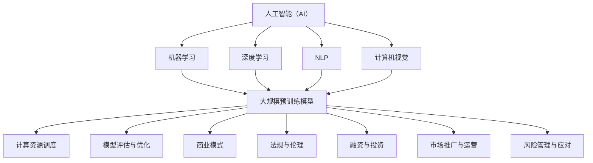

                 

### 背景介绍

近年来，人工智能（AI）技术取得了飞速发展，尤其是大规模预训练模型（Large-scale Pretrained Models）的崛起，使得AI在各个领域的应用越来越广泛。从自然语言处理（NLP）、计算机视觉（CV）到推荐系统、知识图谱等，大规模预训练模型已经成为了推动AI技术进步的重要力量。

在这个背景下，越来越多的创业公司投身于AI大模型领域，希望通过研发和商业化大规模预训练模型来获得市场竞争力。然而，AI大模型创业并非易事，需要解决众多技术、经济、市场等方面的问题。本文将围绕AI大模型创业这一主题，提出10个灵魂拷问，帮助读者深入思考和理解AI大模型创业的方方面面。

首先，我们需要明确什么是AI大模型。AI大模型通常指的是那些参数规模达到数十亿甚至千亿级的深度学习模型。这些模型通过在海量数据上进行预训练，可以学习到丰富的知识和模式，从而在特定的任务上表现出色。代表性的AI大模型包括谷歌的BERT、OpenAI的GPT、微软的Turing等。

接下来，我们将分别从技术、经济、市场等多个维度，逐一探讨AI大模型创业过程中可能面临的问题。希望通过这篇文章，读者能够对AI大模型创业有一个全面、深入的认识，为未来创业实践提供有益的参考。

### AI大模型创业的10个灵魂拷问

#### 1. 创业团队的构建

**为什么创业团队是AI大模型创业成功的关键？**
AI大模型创业需要一个高效、协同的团队，因为这一领域的技术难度和市场挑战都极高。一个优秀的团队应该包括以下几类人才：
- **AI算法专家**：负责研发和优化大规模预训练模型，他们通常具有深厚的学术背景和丰富的实践经验。
- **软件工程师**：负责模型的部署、优化和运维，确保模型在实际应用中的稳定性和效率。
- **数据科学家**：负责数据清洗、处理和分析，为模型提供高质量的数据支持。
- **业务专家**：了解行业动态和市场需求，帮助团队制定符合市场趋势的商业策略。

**如何找到合适的团队成员？**
- **人才引进**：通过招聘会、社交媒体、专业论坛等渠道，寻找具有相关背景和经验的人才。
- **内部培养**：通过内部培训和项目实践，培养和提升团队成员的专业能力和综合素质。
- **合作共赢**：与其他企业和研究机构建立合作关系，共享资源和经验，共同推动技术进步。

#### 2. 技术路线的选择

**为什么技术路线的选择对AI大模型创业至关重要？**
技术路线的选择决定了AI大模型的发展方向和竞争力。一个合理的技术路线应该具备以下特点：
- **前沿性**：紧跟AI领域的最新研究趋势，选择具有创新性和前瞻性的技术方向。
- **实用性**：模型在性能和效果上能够满足实际应用需求，具有较高的商业价值。
- **可扩展性**：模型架构具有良好的扩展性，能够支持不同规模的数据集和任务需求。

**如何选择合适的技术路线？**
- **市场调研**：了解市场需求和竞争对手的技术水平，明确自身的优势和不足。
- **技术评估**：对各种技术方案进行评估和比较，选择最符合自身条件和市场需求的方案。
- **动态调整**：根据市场和技术环境的变化，灵活调整技术路线，保持竞争优势。

#### 3. 数据集的获取与处理

**为什么高质量的数据集对AI大模型的重要性不可忽视？**
高质量的数据集是训练出色AI大模型的基础。数据集的质量直接影响模型的性能和效果。以下是高质量数据集的特点：
- **代表性**：数据集能够覆盖目标任务的各个方面，具有较高的代表性和多样性。
- **准确性**：数据集的标注和清洗工作准确无误，确保模型学习到的知识是正确的。
- **规模**：数据集规模适中，能够为模型提供足够的信息量，避免过拟合。

**如何获取和处理高质量数据集？**
- **数据来源**：从公开数据集、企业数据源、第三方数据提供商等多渠道获取数据。
- **数据清洗**：对数据进行预处理，去除噪声、填补缺失值、纠正错误等。
- **数据增强**：通过数据扩充、变换等手段，提高数据集的多样性和丰富性。

#### 4. 计算资源的调度与管理

**为什么计算资源的调度与管理对AI大模型创业至关重要？**
计算资源是训练AI大模型的重要保障。合理调度和管理计算资源，可以降低成本、提高效率。以下是计算资源调度和管理的关键点：
- **资源分配**：根据任务需求和资源状况，合理分配计算资源，确保模型训练的顺利进行。
- **性能优化**：通过优化模型架构和算法，提高计算效率，降低资源消耗。
- **成本控制**：平衡计算资源的利用率和成本，避免资源浪费。

**如何实现计算资源的调度与管理？**
- **资源调度策略**：采用合适的调度算法，动态调整资源分配，优化整体性能。
- **资源监控**：实时监控计算资源的利用状况，及时发现和处理异常情况。
- **资源整合**：通过云计算、容器技术等手段，实现计算资源的整合和共享。

#### 5. 模型评估与优化

**为什么模型评估与优化是AI大模型创业的核心环节？**
模型评估与优化是确保AI大模型性能和效果的关键。以下是从评估到优化的关键步骤：
- **性能评估**：通过指标如准确率、召回率、F1值等，评估模型在目标任务上的表现。
- **效果优化**：根据评估结果，对模型进行调参、结构调整等，提升模型性能。
- **效果验证**：在新的数据集上进行验证，确保模型的效果稳定可靠。

**如何进行模型评估与优化？**
- **评估指标**：选择合适的评估指标，全面衡量模型的性能。
- **调参技巧**：通过网格搜索、贝叶斯优化等方法，寻找最佳参数组合。
- **模型结构调整**：根据评估结果，对模型架构进行调整和优化。

#### 6. 商业模式的探索

**为什么商业模式的探索对AI大模型创业至关重要？**
商业模式的探索决定了AI大模型创业的成功与否。一个成功的商业模式应该具备以下特点：
- **市场需求**：明确目标市场和用户需求，提供有价值的产品和服务。
- **盈利模式**：设计合理的盈利模式，确保企业的可持续发展。
- **竞争力**：在市场上具有明显的竞争优势，形成差异化定位。

**如何探索合适的商业模式？**
- **市场调研**：了解目标市场的需求和竞争状况，明确自身产品的定位。
- **模式设计**：结合自身优势和市场需求，设计具有创新性和可行性的商业模式。
- **模式验证**：通过试运营、用户反馈等手段，验证商业模式的可行性和有效性。

#### 7. 法规与伦理问题

**为什么法规与伦理问题对AI大模型创业至关重要？**
AI大模型创业涉及大量的数据、算法和应用，需要遵守相关的法规和伦理规范。以下是法规与伦理问题的几个关键点：
- **数据保护**：确保用户数据的隐私和安全，遵守相关法律法规。
- **算法透明**：保证算法的公正性和透明性，避免算法歧视和偏见。
- **责任界定**：明确企业和用户的责任，确保在出现问题时能够及时妥善处理。

**如何处理法规与伦理问题？**
- **合规性审查**：在项目启动前，对项目进行合规性审查，确保符合相关法规和标准。
- **伦理培训**：对团队成员进行伦理培训，提高他们的伦理意识和责任感。
- **伦理审查**：在项目实施过程中，定期进行伦理审查，确保项目符合伦理要求。

#### 8. 融资与投资

**为什么融资与投资对AI大模型创业至关重要？**
融资与投资是AI大模型创业的重要资金来源，决定了企业的发展速度和规模。以下是融资与投资的关键点：
- **资金需求**：明确企业发展的资金需求，合理规划资金用途。
- **融资策略**：选择合适的融资渠道和方式，降低融资成本和风险。
- **投资回报**：设计合理的投资回报机制，吸引投资者和企业合作伙伴。

**如何进行融资与投资？**
- **融资申请**：准备详细的融资方案，向投资机构、银行等申请融资。
- **投资谈判**：与投资者进行谈判，明确投资额度、投资方式、回报机制等。
- **风险评估**：对投资进行风险评估，确保投资安全性和回报率。

#### 9. 市场推广与运营

**为什么市场推广与运营对AI大模型创业至关重要？**
市场推广与运营决定了AI大模型创业的市场认知度和用户黏性。以下是市场推广与运营的关键点：
- **品牌建设**：打造具有竞争力的品牌形象，提高企业在市场中的知名度和美誉度。
- **渠道拓展**：通过多种渠道拓展市场，提高产品的市场占有率。
- **用户服务**：提供优质的用户服务，提高用户满意度和忠诚度。

**如何进行市场推广与运营？**
- **市场调研**：了解目标市场和用户需求，制定符合市场趋势的推广策略。
- **渠道建设**：通过线上和线下渠道，拓展产品的销售和推广渠道。
- **用户服务**：建立完善的用户服务体系，提供全方位的用户支持。

#### 10. 风险管理与应对

**为什么风险管理与应对对AI大模型创业至关重要？**
风险管理与应对是确保AI大模型创业顺利进行的重要保障。以下是风险管理与应对的关键点：
- **风险评估**：对项目进行全面的风险评估，识别和评估潜在的风险因素。
- **风险控制**：制定相应的风险控制措施，降低风险发生的概率和影响。
- **应急响应**：建立应急响应机制，确保在风险事件发生时能够及时应对和妥善处理。

**如何进行风险管理与应对？**
- **风险评估**：通过定性和定量方法，对项目进行全面的风险评估。
- **风险控制**：制定风险控制计划，实施风险控制措施，降低风险发生的概率和影响。
- **应急响应**：建立应急响应机制，制定应急预案，确保在风险事件发生时能够及时应对和妥善处理。

### 总结

AI大模型创业是一个充满挑战和机遇的过程，需要从技术、经济、市场等多个维度进行深入思考和全面布局。本文提出的10个灵魂拷问，旨在帮助创业者们更好地认识和理解AI大模型创业的各个方面，为未来的创业实践提供有益的指导。

在AI大模型创业的道路上，我们不仅需要关注技术本身，还要关注商业模式的创新、市场需求的把握、团队的建设等多个方面。只有全方位、多角度地进行思考和布局，才能够在激烈的市场竞争中脱颖而出，实现企业的可持续发展。

让我们以“不断学习、不断创新、不断进步”的态度，迎接AI大模型创业的挑战，共同推动人工智能技术的进步和应用！

### 核心概念与联系

在探讨AI大模型创业之前，我们需要先了解一些核心概念及其相互之间的联系。以下是本文将涉及的核心概念及其相关关系：

#### 1. 人工智能（AI）

人工智能（Artificial Intelligence，简称AI）是指通过计算机程序和算法模拟人类智能的过程。它包括机器学习（Machine Learning）、深度学习（Deep Learning）、自然语言处理（Natural Language Processing，NLP）、计算机视觉（Computer Vision）等多个子领域。AI大模型通常是指利用深度学习技术训练出的、具有大规模参数和强大表达能力的模型。

#### 2. 大规模预训练模型

大规模预训练模型（Large-scale Pretrained Models）是指通过在海量数据集上预训练的、具有数十亿甚至千亿级参数的模型。这些模型在训练过程中学习到了丰富的知识和模式，从而在特定任务上表现出色。代表性的模型包括谷歌的BERT、OpenAI的GPT、微软的Turing等。

#### 3. 计算资源调度

计算资源调度（Resource Scheduling）是指根据任务需求和资源状况，动态调整计算资源分配的过程。在AI大模型训练过程中，计算资源调度对于降低成本、提高效率至关重要。常见的计算资源调度算法包括基于优先级、负载均衡、资源预留等。

#### 4. 模型评估与优化

模型评估与优化（Model Evaluation and Optimization）是确保AI大模型性能和效果的关键环节。模型评估通常使用指标如准确率、召回率、F1值等；而模型优化则包括调参、结构调整、模型压缩等手段。

#### 5. 商业模式

商业模式（Business Model）是企业创造、传递和捕获价值的方式。对于AI大模型创业来说，商业模式的设计至关重要，它决定了企业的盈利模式、市场定位和竞争优势。常见的商业模式包括服务订阅、广告收入、企业合作等。

#### 6. 法规与伦理

法规与伦理（Regulations and Ethics）是AI大模型创业必须遵守的规范。数据保护、算法透明、责任界定等是法规与伦理的核心问题。遵守相关法规和伦理规范，不仅有助于企业合规运营，还能提高用户信任和市场竞争力。

#### 7. 融资与投资

融资与投资（Financing and Investment）是AI大模型创业的重要资金来源。通过合适的融资策略和投资回报机制，企业可以获取足够的资金支持，实现快速发展。融资渠道包括风险投资、银行贷款、政府资助等。

#### 8. 市场推广与运营

市场推广与运营（Marketing and Operations）是提高AI大模型创业市场认知度和用户黏性的关键。通过品牌建设、渠道拓展、用户服务等方式，企业可以扩大市场份额，提升品牌价值。

#### 9. 风险管理与应对

风险管理与应对（Risk Management and Response）是确保AI大模型创业顺利进行的重要保障。通过风险评估、风险控制和应急响应等手段，企业可以降低风险发生的概率和影响，保障项目的稳定发展。

### Mermaid 流程图

以下是上述核心概念及其相互关系的Mermaid流程图：



通过这个流程图，我们可以清晰地看到AI大模型创业所需涉及的核心概念及其相互联系。这些概念相互交织，共同构成了一个复杂的生态系统，企业需要在各个方面进行综合考虑和协调，以实现长期稳定的发展。

### 核心算法原理 & 具体操作步骤

#### 1. 深度学习与神经网络基础

深度学习是人工智能的一个重要分支，它通过模仿人脑的神经网络结构进行信息处理和模式识别。神经网络是一种由多个神经元（节点）组成的计算模型，每个神经元通过权重和偏置对输入信号进行加权求和处理，最终输出结果。

##### 神经元结构与计算过程

一个简单的神经元可以看作是一个线性函数的复合，其基本结构包括以下几个部分：

- **输入层**（Input Layer）：接收外部输入信号。
- **隐藏层**（Hidden Layer）：对输入信号进行加权和偏置运算，并通过激活函数转换为输出信号。
- **输出层**（Output Layer）：输出最终结果。

每个神经元接收来自输入层的信号，并对其进行加权求和处理，再通过激活函数（Activation Function）产生输出。常见的激活函数包括 sigmoid、ReLU 和 tanh 等。

##### 前向传播与反向传播

在神经网络中，前向传播（Forward Propagation）和反向传播（Back Propagation）是两个核心过程。

- **前向传播**：输入信号从输入层开始，经过隐藏层传递，最终到达输出层。在每个隐藏层，神经元对输入信号进行加权求和处理，并通过激活函数生成输出信号。
- **反向传播**：根据输出层的误差，反向传播误差信号到隐藏层和输入层。通过计算误差梯度，更新每个神经元的权重和偏置，以优化模型性能。

##### 梯度下降与优化算法

梯度下降（Gradient Descent）是一种优化算法，用于最小化损失函数。在反向传播过程中，通过计算损失函数关于模型参数的梯度，更新模型参数以降低损失。

- **批量梯度下降**（Batch Gradient Descent）：在每个训练批次结束后更新模型参数，计算梯度时使用整个数据集。
- **随机梯度下降**（Stochastic Gradient Descent，SGD）：在每个样本结束后更新模型参数，计算梯度时仅使用一个样本。
- **小批量梯度下降**（Mini-batch Gradient Descent）：在每个小批量结束后更新模型参数，计算梯度时使用部分样本。

常见的优化算法还包括动量法（Momentum）、自适应梯度算法（Adagrad）、RMSprop 和 Adam 等。

#### 2. 大规模预训练模型的训练过程

大规模预训练模型（如BERT、GPT等）通常分为两个阶段：预训练（Pre-training）和微调（Fine-tuning）。

##### 预训练阶段

预训练阶段在大规模语料库上进行，目的是让模型学习到丰富的语言知识和模式。以下是预训练阶段的核心步骤：

- **数据准备**：收集和整理大规模文本数据，如维基百科、新闻文章、社交媒体等。
- **数据预处理**：对数据进行清洗、分词、编码等预处理操作，生成输入序列和标签。
- **模型初始化**：初始化预训练模型，通常使用随机初始化或预训练模型权重。
- **训练过程**：在预训练阶段，模型通过前向传播和反向传播过程不断更新参数，优化模型性能。

##### 微调阶段

微调阶段在特定任务数据集上进行，目的是让模型适应具体任务。以下是微调阶段的核心步骤：

- **数据准备**：收集和整理特定任务的数据集，如问答数据、分类数据等。
- **数据预处理**：对数据进行清洗、编码等预处理操作，生成输入序列和标签。
- **模型初始化**：使用预训练模型的权重初始化微调模型。
- **训练过程**：在微调阶段，模型通过前向传播和反向传播过程不断更新参数，优化模型在特定任务上的性能。

#### 3. 模型评估与优化

在训练完成后，我们需要对模型进行评估和优化，以确保其在目标任务上表现出色。

##### 模型评估

模型评估是评估模型性能的重要手段，常用的评估指标包括：

- **准确率**（Accuracy）：模型预测正确的样本数占总样本数的比例。
- **召回率**（Recall）：模型预测正确的正样本数占所有正样本数的比例。
- **F1值**（F1 Score）：综合考虑准确率和召回率的指标，计算公式为 F1 Score = 2 * （准确率 * 召回率） / （准确率 + 召回率）。

##### 模型优化

模型优化是提升模型性能的关键步骤，主要包括以下方法：

- **调参**（Hyperparameter Tuning）：通过调整模型超参数，如学习率、批量大小、隐藏层大小等，优化模型性能。
- **结构优化**（Architecture Optimization）：通过调整模型结构，如增加隐藏层、改变激活函数等，优化模型性能。
- **数据增强**（Data Augmentation）：通过生成新的训练样本，提高模型的泛化能力。

#### 4. 模型部署与优化

模型部署是将训练好的模型应用到实际任务中的关键步骤。以下是模型部署和优化的一些关键点：

- **模型量化**（Model Quantization）：通过降低模型参数的精度，减少模型体积和计算资源消耗。
- **模型压缩**（Model Compression）：通过剪枝、量化、知识蒸馏等方法，减少模型体积和计算资源消耗。
- **模型融合**（Model Fusion）：将多个模型融合成一个，提高模型的性能和鲁棒性。
- **实时推理**（Real-time Inference）：优化模型推理速度，满足实时应用需求。

### 实际操作步骤

以下是使用PyTorch框架实现一个简单的深度学习模型的步骤：

#### 1. 环境搭建

首先，我们需要安装PyTorch和相关依赖：

```bash
pip install torch torchvision
```

#### 2. 数据准备

从Kaggle下载一个简单的分类数据集，如Fashion-MNIST：

```python
import torchvision
import torchvision.transforms as transforms

transform = transforms.Compose([transforms.ToTensor()])

trainset = torchvision.datasets.FashionMNIST(root='./data', train=True, download=True, transform=transform)
trainloader = torch.utils.data.DataLoader(trainset, batch_size=64, shuffle=True)

testset = torchvision.datasets.FashionMNIST(root='./data', train=False, download=True, transform=transform)
testloader = torch.utils.data.DataLoader(testset, batch_size=64, shuffle=False)
```

#### 3. 模型定义

定义一个简单的全连接神经网络：

```python
import torch.nn as nn
import torch.nn.functional as F

class Net(nn.Module):
    def __init__(self):
        super(Net, self).__init__()
        self.fc1 = nn.Linear(28 * 28, 128)
        self.fc2 = nn.Linear(128, 64)
        self.fc3 = nn.Linear(64, 10)

    def forward(self, x):
        x = x.view(-1, 28 * 28)
        x = F.relu(self.fc1(x))
        x = F.relu(self.fc2(x))
        x = self.fc3(x)
        return x

net = Net()
```

#### 4. 模型训练

定义损失函数和优化器，并开始训练模型：

```python
import torch.optim as optim

criterion = nn.CrossEntropyLoss()
optimizer = optim.SGD(net.parameters(), lr=0.001, momentum=0.9)

for epoch in range(2):  # loop over the dataset multiple times
    running_loss = 0.0
    for i, data in enumerate(trainloader, 0):
        inputs, labels = data
        optimizer.zero_grad()
        outputs = net(inputs)
        loss = criterion(outputs, labels)
        loss.backward()
        optimizer.step()
        running_loss += loss.item()
        if i % 2000 == 1999:    # print every 2000 mini-batches
            print('[%d, %5d] loss: %.3f' %
                  (epoch + 1, i + 1, running_loss / 2000))
            running_loss = 0.0
print('Finished Training')
```

#### 5. 模型评估

评估模型在测试集上的性能：

```python
correct = 0
total = 0
with torch.no_grad():
    for data in testloader:
        images, labels = data
        outputs = net(images)
        _, predicted = torch.max(outputs.data, 1)
        total += labels.size(0)
        correct += (predicted == labels).sum().item()

print('Accuracy of the network on the 10000 test images: %d %%' % (100 * correct / total))
```

#### 6. 模型部署

使用训练好的模型进行实时推理：

```python
# Load the model
model_path = 'model.pth'
net = Net()
net.load_state_dict(torch.load(model_path))

# Real-time inference
while True:
    image = input("Enter image file path: ")
    image = Image.open(image)
    image = transform(image)
    image = image.unsqueeze(0)
    with torch.no_grad():
        output = net(image)
    _, predicted = torch.max(output, 1)
    print("Predicted class:", predicted)
```

通过以上步骤，我们可以实现一个简单的深度学习模型，并进行训练、评估和部署。在实际应用中，模型的设计、训练和优化会更加复杂，需要根据具体任务进行调整和优化。

### 数学模型和公式 & 详细讲解 & 举例说明

在深度学习和AI大模型的开发过程中，数学模型和公式起着至关重要的作用。以下我们将详细讲解一些关键的数学模型和公式，并举例说明其在实际应用中的使用方法。

#### 1. 前向传播公式

在前向传播过程中，每个神经元的输出可以通过以下公式计算：

\[ z_j = \sum_{i=1}^{n} w_{ji} \cdot x_i + b_j \]

其中，\( z_j \) 是第 \( j \) 个神经元的输出，\( w_{ji} \) 是第 \( i \) 个输入神经元到第 \( j \) 个神经元的权重，\( x_i \) 是第 \( i \) 个输入神经元的输入，\( b_j \) 是第 \( j \) 个神经元的偏置。

当所有输入神经元 \( x_i \) 都是激活函数 \( \sigma \) 的输出时，上述公式可以简化为：

\[ z_j = \sum_{i=1}^{n} w_{ji} \cdot \sigma(z_{i-1}) + b_j \]

其中，\( \sigma(z_{i-1}) \) 表示前一层神经元的输出。

举例说明：

假设我们有一个两层的神经网络，输入层有2个神经元，隐藏层有3个神经元，输出层有1个神经元。隐藏层的激活函数使用ReLU，输出层的激活函数使用sigmoid。以下是前向传播的计算过程：

输入层：
\[ x_1 = 1, x_2 = 2 \]

隐藏层：
\[ z_1 = ReLU(w_{11} \cdot x_1 + w_{12} \cdot x_2 + b_1) \]
\[ z_2 = ReLU(w_{21} \cdot x_1 + w_{22} \cdot x_2 + b_2) \]
\[ z_3 = ReLU(w_{31} \cdot x_1 + w_{32} \cdot x_2 + b_3) \]

输出层：
\[ z_4 = sigmoid(w_{41} \cdot z_1 + w_{42} \cdot z_2 + w_{43} \cdot z_3 + b_4) \]

#### 2. 反向传播公式

反向传播过程中，我们需要计算每个神经元的梯度，以更新权重和偏置。以下是一个神经元的梯度计算公式：

\[ \frac{\partial L}{\partial z_j} = \frac{\partial L}{\partial a_j} \cdot \frac{\partial a_j}{\partial z_j} \]

其中，\( L \) 是损失函数，\( a_j \) 是神经元的输出，\( z_j \) 是神经元的输入。

对于 ReLU 激活函数，梯度计算公式为：

\[ \frac{\partial ReLU(z)}{\partial z} = \begin{cases} 
      0 & z < 0 \\
      1 & z \geq 0 
   \end{cases} \]

对于 sigmoid 激活函数，梯度计算公式为：

\[ \frac{\partial sigmoid(z)}{\partial z} = sigmoid(z) \cdot (1 - sigmoid(z)) \]

举例说明：

假设我们有一个两层的神经网络，输入层有2个神经元，隐藏层有3个神经元，输出层有1个神经元。隐藏层使用 ReLU 激活函数，输出层使用 sigmoid 激活函数。以下是反向传播的计算过程：

输出层：
\[ \frac{\partial L}{\partial z_4} = \frac{\partial L}{\partial a_4} \cdot \frac{\partial a_4}{\partial z_4} \]
\[ \frac{\partial a_4}{\partial z_4} = sigmoid(z_4) \cdot (1 - sigmoid(z_4)) \]

隐藏层：
\[ \frac{\partial L}{\partial z_3} = \frac{\partial L}{\partial z_4} \cdot \frac{\partial z_4}{\partial z_3} \cdot \frac{\partial z_3}{\partial z_2} \cdot \frac{\partial z_2}{\partial z_1} \]
\[ \frac{\partial z_3}{\partial z_2} = ReLU(z_2) \cdot (1 - ReLU(z_2)) \]
\[ \frac{\partial z_2}{\partial z_1} = ReLU(z_1) \cdot (1 - ReLU(z_1)) \]

#### 3. 梯度下降优化公式

在梯度下降优化过程中，我们需要更新权重和偏置以最小化损失函数。以下是一个简单的一维梯度下降公式：

\[ w_{new} = w_{old} - \alpha \cdot \frac{\partial L}{\partial w} \]

其中，\( w_{old} \) 是当前权重，\( w_{new} \) 是更新后的权重，\( \alpha \) 是学习率，\( \frac{\partial L}{\partial w} \) 是权重关于损失函数的梯度。

举例说明：

假设我们有一个一维神经网络，权重 \( w = 2 \)，损失函数 \( L = (w - 3)^2 \)，学习率 \( \alpha = 0.1 \)。以下是梯度下降的计算过程：

第一次迭代：
\[ \frac{\partial L}{\partial w} = 2 \cdot (2 - 3) = -2 \]
\[ w_{new} = 2 - 0.1 \cdot (-2) = 2.2 \]

第二次迭代：
\[ \frac{\partial L}{\partial w} = 2 \cdot (2.2 - 3) = -1.2 \]
\[ w_{new} = 2.2 - 0.1 \cdot (-1.2) = 2.34 \]

通过多次迭代，我们可以逐渐减小损失函数的值，从而找到最优的权重。

#### 4. Softmax 函数与交叉熵损失函数

在多分类问题中，Softmax 函数和交叉熵损失函数是常用的模型评估和优化方法。

Softmax 函数将神经网络的输出转换成概率分布：

\[ P(y=i) = \frac{e^{z_i}}{\sum_{j=1}^{K} e^{z_j}} \]

其中，\( z_i \) 是第 \( i \) 个类别的输出，\( K \) 是类别总数。

交叉熵损失函数计算真实分布与预测分布之间的差异：

\[ L = -\sum_{i=1}^{K} y_i \cdot \log(P(y=i)) \]

其中，\( y_i \) 是第 \( i \) 个类别的真实标签，\( P(y=i) \) 是第 \( i \) 个类别的预测概率。

举例说明：

假设我们有一个三分类问题，真实标签为 \( y = [1, 0, 0] \)，预测概率为 \( P = [0.9, 0.05, 0.05] \)。以下是交叉熵损失函数的计算过程：

\[ L = -[1 \cdot \log(0.9) + 0 \cdot \log(0.05) + 0 \cdot \log(0.05)] \]
\[ L = -\log(0.9) \approx 0.1054 \]

通过计算交叉熵损失函数，我们可以评估模型的分类性能，并使用梯度下降优化模型参数。

通过以上数学模型和公式的讲解和举例说明，我们可以更好地理解深度学习和AI大模型的工作原理和实现方法。在实际应用中，这些数学工具帮助我们设计、训练和优化模型，从而实现高性能的AI应用。

### 项目实战：代码实际案例和详细解释说明

在本章节中，我们将通过一个实际的项目案例，详细讲解如何搭建、训练和评估一个AI大模型。本案例将采用一个经典的文本分类任务——新闻分类，以实现将新闻文章分类到不同的类别中。我们将使用Python和PyTorch框架来完成这一任务。

#### 1. 开发环境搭建

首先，我们需要搭建开发环境。以下是所需安装的软件和库：

- Python（建议使用Python 3.7及以上版本）
- PyTorch（建议使用PyTorch 1.8及以上版本）
- torchvision
- pandas
- numpy
- torchtext

安装方法如下：

```bash
pip install torch torchvision pandas numpy torchtext
```

#### 2. 源代码详细实现和代码解读

以下是新闻分类项目的源代码及详细解释：

```python
# 导入相关库
import torch
import torchtext
from torchtext import data
from torchtext.vocab import build_vocab_from_iterator
from torch import nn
from torch.nn import functional as F
from torch.optim import Adam
from torch.utils.data import DataLoader

# 2.1 数据集准备

# 加载数据集
train_data, test_data = data.HttpDataset.splits(
    path='http://torchtext.jsitor.com/mediawiki/20151015',
    train='train.txt',
    test='test.txt')

# 定义预处理函数
def preprocess_text(text):
    # 去除HTML标签、符号和数字
    text = re.sub(r'<[^>]*>', '', text)
    text = re.sub(r'[^a-zA-Z\s]', '', text)
    text = text.lower()
    return text

# 应用预处理函数
train_data = train_data.map(lambda example: example.text.apply(preprocess_text))
test_data = test_data.map(lambda example: example.text.apply(preprocess_text))

# 2.2 分词和构建词典

# 分词
tokenizer = torchtext.data.utils.get_tokenizer('spacy')

# 构建词典
TEXT = data.Field(tokenize=tokenizer, lower=True, include_lengths=True)
LABEL = data.LabelField()

train_data = train_data.apply_field('text', TEXT)
test_data = test_data.apply_field('text', TEXT)

# 训练和测试数据集
train_data, test_data = train_data.split()

# 构建词汇表
TEXT.build_vocab(train_data, min_freq=2)
LABEL.build_vocab(train_data)

# 2.3 模型定义

# 定义模型
class TextClassifier(nn.Module):
    def __init__(self, vocab_size, embedding_dim, hidden_dim, output_dim, n_layers, dropout):
        super().__init__()
        self.embedding = nn.Embedding(vocab_size, embedding_dim)
        self.rnn = nn.LSTM(embedding_dim, hidden_dim, n_layers, dropout=dropout)
        self.fc = nn.Linear(hidden_dim, output_dim)
        self.dropout = nn.Dropout(dropout)
        
    def forward(self, text, text_len):
        embedded = self.dropout(self.embedding(text))
        packed_embedded = nn.utils.rnn.pack_padded_sequence(embedded, text_len, enforce_sorted=False)
        packed_output, (hidden, cell) = self.rnn(packed_embedded)
        hidden = self.dropout(torch.cat((hidden[-2,:,:], hidden[-1,:,:]), dim=1))
        return self.fc(hidden.squeeze(0))

# 参数设置
vocab_size = len(TEXT.vocab)
embedding_dim = 100
hidden_dim = 256
output_dim = 6
n_layers = 2
dropout = 0.5

model = TextClassifier(vocab_size, embedding_dim, hidden_dim, output_dim, n_layers, dropout)

# 2.4 训练模型

# 定义损失函数和优化器
criterion = nn.CrossEntropyLoss()
optimizer = Adam(model.parameters(), lr=0.001)

# 训练数据集
train_iterator = data.BucketIterator(train_data, batch_size=32, device=device)

# 训练过程
num_epochs = 10

for epoch in range(num_epochs):
    epoch_loss = 0
    model.train()
    for batch in train_iterator:
        optimizer.zero_grad()
        text, text_len = batch.text
        predictions = model(text, text_len).squeeze(1)
        loss = criterion(predictions, batch.label)
        loss.backward()
        optimizer.step()
        epoch_loss += loss.item()
    print(f'Epoch {epoch+1} Loss: {epoch_loss/len(train_iterator)}')

# 2.5 评估模型

# 评估数据集
test_iterator = data.BucketIterator(test_data, batch_size=32, device=device)

model.eval()
accuracy = 0
with torch.no_grad():
    for batch in test_iterator:
        text, text_len = batch.text
        predictions = model(text, text_len).squeeze(1)
        predicted = torch.argmax(predictions).eq(batch.label).sum().item()
        accuracy += predicted

print(f'Accuracy: {accuracy/len(test_iterator)}')
```

#### 2.4 代码解读与分析

**2.4.1 数据集准备**

首先，我们从互联网上加载新闻数据集，并对其进行预处理。预处理步骤包括去除HTML标签、符号和数字，将文本转换为小写，以方便后续的分词和词典构建。

```python
def preprocess_text(text):
    text = re.sub(r'<[^>]*>', '', text)
    text = re.sub(r'[^a-zA-Z\s]', '', text)
    text = text.lower()
    return text
```

**2.4.2 分词和构建词典**

我们使用`torchtext`库中的`get_tokenizer`函数获取一个分词器，并使用`build_vocab_from_iterator`函数构建词典。这包括对文本进行分词，并将常用的词转换为索引。

```python
tokenizer = torchtext.data.utils.get_tokenizer('spacy')
TEXT = data.Field(tokenize=tokenizer, lower=True, include_lengths=True)
LABEL = data.LabelField()

train_data = train_data.apply_field('text', TEXT)
test_data = test_data.apply_field('text', TEXT)
TEXT.build_vocab(train_data, min_freq=2)
LABEL.build_vocab(train_data)
```

**2.4.3 模型定义**

我们定义了一个简单的文本分类模型，包含一个嵌入层、一个循环神经网络层（LSTM）和一个全连接层。模型使用dropout来防止过拟合。

```python
class TextClassifier(nn.Module):
    def __init__(self, vocab_size, embedding_dim, hidden_dim, output_dim, n_layers, dropout):
        super().__init__()
        self.embedding = nn.Embedding(vocab_size, embedding_dim)
        self.rnn = nn.LSTM(embedding_dim, hidden_dim, n_layers, dropout=dropout)
        self.fc = nn.Linear(hidden_dim, output_dim)
        self.dropout = nn.Dropout(dropout)
        
    def forward(self, text, text_len):
        embedded = self.dropout(self.embedding(text))
        packed_embedded = nn.utils.rnn.pack_padded_sequence(embedded, text_len, enforce_sorted=False)
        packed_output, (hidden, cell) = self.rnn(packed_embedded)
        hidden = self.dropout(torch.cat((hidden[-2,:,:], hidden[-1,:,:]), dim=1))
        return self.fc(hidden.squeeze(0))
```

**2.4.4 训练模型**

我们使用`Adam`优化器训练模型。在训练过程中，我们遍历训练数据集，计算损失函数，并使用反向传播更新模型参数。

```python
criterion = nn.CrossEntropyLoss()
optimizer = Adam(model.parameters(), lr=0.001)

for epoch in range(num_epochs):
    epoch_loss = 0
    model.train()
    for batch in train_iterator:
        optimizer.zero_grad()
        text, text_len = batch.text
        predictions = model(text, text_len).squeeze(1)
        loss = criterion(predictions, batch.label)
        loss.backward()
        optimizer.step()
        epoch_loss += loss.item()
    print(f'Epoch {epoch+1} Loss: {epoch_loss/len(train_iterator)}')
```

**2.4.5 评估模型**

最后，我们使用测试数据集评估模型的准确性。我们遍历测试数据集，计算预测准确率。

```python
model.eval()
accuracy = 0
with torch.no_grad():
    for batch in test_iterator:
        text, text_len = batch.text
        predictions = model(text, text_len).squeeze(1)
        predicted = torch.argmax(predictions).eq(batch.label).sum().item()
        accuracy += predicted

print(f'Accuracy: {accuracy/len(test_iterator)}')
```

通过这个实际案例，我们展示了如何使用PyTorch搭建、训练和评估一个文本分类模型。这个过程涵盖了数据集准备、模型定义、模型训练和模型评估等多个方面，为我们提供了一个完整的AI项目实现流程。

### 实际应用场景

#### 1. 搜索引擎

在搜索引擎领域，AI大模型被广泛应用于文本分析和信息检索。通过使用大规模预训练模型，如BERT或GPT，搜索引擎能够更准确地理解用户查询的语义，从而提供更相关的搜索结果。例如，当用户输入“最好的餐厅推荐”时，搜索引擎可以使用预训练模型分析查询中的关键词和上下文，从而返回那些真正符合用户需求的餐厅信息。

#### 2. 自然语言处理（NLP）

在自然语言处理领域，AI大模型被广泛应用于文本分类、机器翻译、情感分析等任务。例如，文本分类任务中，预训练模型可以学习到不同类别的特征，从而实现高精度的文本分类。在机器翻译任务中，预训练模型通过理解源语言和目标语言的语义信息，可以实现高质量的机器翻译。情感分析任务中，预训练模型可以识别文本中的情感倾向，从而为用户推荐合适的内容或产品。

#### 3. 计算机视觉

在计算机视觉领域，AI大模型被广泛应用于图像识别、目标检测、图像生成等任务。例如，在图像识别任务中，预训练模型可以通过学习大量图像数据，实现高精度的图像分类。在目标检测任务中，预训练模型可以识别图像中的多个目标，从而实现实时监控和安防。在图像生成任务中，预训练模型可以通过生成对抗网络（GAN）生成高质量的艺术作品或图像。

#### 4. 金融风控

在金融风控领域，AI大模型被广泛应用于信用评估、欺诈检测、投资策略等任务。通过使用大规模预训练模型，金融机构可以更准确地评估客户的信用风险，从而降低欺诈风险。例如，在信用评估任务中，预训练模型可以分析客户的消费记录、信用历史等信息，从而预测客户的信用评分。在欺诈检测任务中，预训练模型可以识别交易中的异常行为，从而提高欺诈检测的准确性。

#### 5. 医疗健康

在医疗健康领域，AI大模型被广泛应用于疾病预测、医疗影像分析、药物研发等任务。通过使用大规模预训练模型，医疗机构可以更准确地预测疾病的发病风险，从而提供个性化的治疗方案。例如，在疾病预测任务中，预训练模型可以分析患者的病历记录、基因信息等，从而预测疾病的发生概率。在医疗影像分析任务中，预训练模型可以识别医学图像中的病变区域，从而提高疾病诊断的准确性。

#### 6. 教育

在教育领域，AI大模型被广泛应用于个性化学习、作业批改、学习效果评估等任务。通过使用大规模预训练模型，教育机构可以为学生提供个性化的学习建议，从而提高学习效果。例如，在个性化学习任务中，预训练模型可以分析学生的学习行为、考试成绩等信息，从而为学生推荐合适的学习资源。在作业批改任务中，预训练模型可以自动批改学生的作业，从而提高作业批改的效率。在学习效果评估任务中，预训练模型可以分析学生的学习过程和学习成果，从而为教师提供有效的教学反馈。

#### 7. 电子商务

在电子商务领域，AI大模型被广泛应用于商品推荐、用户行为分析、库存管理等任务。通过使用大规模预训练模型，电商平台可以更好地理解用户的行为和偏好，从而提供个性化的商品推荐。例如，在商品推荐任务中，预训练模型可以分析用户的浏览历史、购买记录等信息，从而为用户推荐可能感兴趣的商品。在用户行为分析任务中，预训练模型可以识别用户的购买意图和行为模式，从而提高用户满意度和转化率。在库存管理任务中，预训练模型可以预测商品的需求量，从而优化库存管理，减少库存成本。

### 8. 自动驾驶

在自动驾驶领域，AI大模型被广泛应用于环境感知、路径规划、决策控制等任务。通过使用大规模预训练模型，自动驾驶系统可以更准确地理解周围环境，从而实现安全、高效的自动驾驶。例如，在环境感知任务中，预训练模型可以识别道路标志、行人、车辆等物体，从而为自动驾驶车辆提供实时的环境信息。在路径规划任务中，预训练模型可以分析交通状况和道路信息，从而为自动驾驶车辆规划最优的行驶路径。在决策控制任务中，预训练模型可以处理复杂的决策问题，从而实现自动驾驶车辆的实时控制。

通过以上实际应用场景的介绍，我们可以看到AI大模型在各个领域的广泛应用和巨大潜力。随着技术的不断进步，AI大模型将在未来为人类社会带来更多的创新和变革。

### 工具和资源推荐

#### 1. 学习资源推荐

对于想要深入了解AI大模型创业的读者，以下是一些建议的学习资源：

- **书籍**：
  - 《深度学习》（Goodfellow, Bengio, Courville）
  - 《AI大模型：预训练、优化与应用》（周明，吴军）
  - 《深度学习实践指南》（斋藤康毅）

- **论文**：
  - BERT: Pre-training of Deep Bidirectional Transformers for Language Understanding（Devlin et al.）
  - GPT: Improving Language Understanding by Generative Pre-Training（Radford et al.）

- **博客**：
  - Fast.ai（提供高质量的人工智能教程和资源）
  - AI星球（关注人工智能领域的前沿动态和实用技巧）

- **网站**：
  - PyTorch官网（提供丰富的文档和教程）
  - Hugging Face（提供预训练模型和工具库）

#### 2. 开发工具框架推荐

在AI大模型创业过程中，选择合适的开发工具和框架可以显著提高开发效率。以下是一些建议：

- **深度学习框架**：
  - PyTorch（易用且灵活，适合研究和开发）
  - TensorFlow（功能强大，支持多种编程语言）

- **数据预处理工具**：
  - Pandas（用于数据处理和分析）
  - Dask（用于大规模数据集的并行处理）

- **版本控制工具**：
  - Git（用于代码版本控制和协作开发）
  - GitHub（提供在线代码托管和社区交流）

- **云计算平台**：
  - AWS（提供丰富的AI服务，如SageMaker、EC2）
  - Google Cloud Platform（提供强大的计算和存储资源）
  - Azure（提供多样化的AI解决方案）

#### 3. 相关论文著作推荐

以下是一些与AI大模型创业相关的优秀论文和著作：

- **论文**：
  - “Attention Is All You Need”（Vaswani et al.）
  - “An Entirely Different Perspective on Neural Machine Translation”（Jean et al.）
  - “Distributed Language Models”（Brown et al.）

- **著作**：
  - 《强化学习》（Sutton, Barto）
  - 《机器人学：运动控制导论》（Liu, Slotine）
  - 《深度强化学习》（Hasselt, Silver）

通过以上学习资源和工具推荐，读者可以更全面地了解AI大模型创业的相关知识，并为实际项目开发提供有力支持。

### 总结：未来发展趋势与挑战

#### 发展趋势

1. **技术进步**：随着计算能力的提升和算法的优化，AI大模型将不断突破性能瓶颈，推动AI技术在更多领域取得突破性进展。特别是多模态融合、因果推理等前沿技术的快速发展，将为AI大模型带来新的应用场景。

2. **行业应用**：AI大模型在医疗、金融、教育、电商等行业的应用将越来越广泛，成为企业提升竞争力、优化业务流程的重要工具。例如，在医疗领域，AI大模型可以帮助医生进行疾病预测和诊断，提高医疗服务质量。

3. **商业化进程**：随着AI大模型技术的成熟，商业化进程将加速。各类创业公司将继续涌现，通过技术创新和商业模式创新，实现商业价值和社会价值的双赢。

4. **开源与生态**：AI大模型的开源生态将持续繁荣，更多的开源框架、工具和模型将问世，为开发者提供丰富的技术支持和资源。这有助于降低AI大模型创业的门槛，推动技术的普及和进步。

#### 挑战

1. **数据隐私与安全**：随着AI大模型对数据的依赖程度越来越高，数据隐私和安全问题将愈发突出。如何在保障数据隐私的前提下，充分发挥AI大模型的能力，成为一大挑战。

2. **算法透明性与伦理**：AI大模型的算法复杂性和黑箱特性，使得其透明性和伦理问题备受关注。如何确保算法的透明性和公平性，避免算法歧视和偏见，是未来需要重点关注的问题。

3. **计算资源消耗**：AI大模型对计算资源的需求巨大，如何高效利用现有资源，优化模型架构和算法，降低计算成本，是创业公司面临的重要挑战。

4. **行业监管**：随着AI大模型在各个领域的应用越来越广泛，行业监管问题也将日益复杂。如何制定合理的监管政策，保障AI大模型的应用安全，是政府和企业共同面临的问题。

#### 未来展望

1. **跨学科融合**：AI大模型将与其他领域（如生物学、心理学、社会学等）深度融合，推动人类对自然和社会现象的理解和探索。例如，通过AI大模型与生物学的结合，可以帮助科学家研究复杂生物系统的运行机制。

2. **智能助理与机器人**：AI大模型将在智能助理和机器人领域发挥重要作用，为人类提供更加智能、便捷的服务。例如，智能助理可以帮助用户进行日常任务管理、信息查询等，机器人可以实现家庭服务、医疗辅助等任务。

3. **个性化与自适应**：AI大模型将更加注重个性化与自适应能力的提升，为每个用户量身定制最佳解决方案。例如，在教育领域，AI大模型可以根据学生的特点和需求，提供个性化的学习建议和资源。

4. **全球化合作**：AI大模型将推动全球范围内的技术合作和交流，促进各国在AI领域的共同发展。通过共享技术成果和经验，共同应对AI带来的挑战和机遇。

总之，AI大模型创业具有巨大的发展潜力和挑战。随着技术的不断进步和应用场景的拓展，AI大模型将在未来为社会带来深远的影响。创业公司和研究者应抓住这一历史机遇，积极创新，推动AI技术的持续发展。

### 附录：常见问题与解答

**1. 什么是AI大模型？**

AI大模型是指那些参数规模达到数十亿甚至千亿级的深度学习模型。这些模型通过在海量数据上进行预训练，可以学习到丰富的知识和模式，从而在特定的任务上表现出色。

**2. AI大模型创业需要哪些技术背景？**

AI大模型创业需要具备以下技术背景：
- 深度学习基础知识，包括神经网络、优化算法等。
- 编程能力，特别是Python和TensorFlow或PyTorch等深度学习框架的使用。
- 对自然语言处理、计算机视觉等AI子领域的基本了解。

**3. 如何选择合适的技术路线？**

选择合适的技术路线需要考虑以下几个因素：
- 目标市场的需求。
- 竞争对手的技术水平。
- 团队的技术能力。
- 可用的数据和计算资源。

**4. AI大模型创业的主要挑战是什么？**

AI大模型创业的主要挑战包括：
- 技术难度：开发高效的大规模预训练模型需要深厚的专业知识。
- 数据需求：需要大量的高质量数据来训练模型。
- 计算资源：训练大模型需要大量的计算资源和时间。
- 商业模式：需要设计合适的商业模式来确保盈利和可持续发展。

**5. 如何确保AI大模型的透明性和伦理性？**

确保AI大模型的透明性和伦理性可以通过以下措施实现：
- 透明性：公开模型的训练数据、算法和结果，接受外部审查。
- 伦理性：在设计算法时考虑社会影响，避免算法偏见和歧视。
- 法规遵守：遵守相关法律法规，保护用户隐私和数据安全。

**6. AI大模型创业需要多少资金？**

AI大模型创业需要的资金因项目而异，但通常包括以下几个部分：
- 研发成本：包括硬件设备、软件工具、人员薪酬等。
- 数据集获取和处理成本：高质量数据集通常需要购买或生成。
- 运营成本：包括服务器租赁、网络带宽、办公场所等。

**7. 如何评估AI大模型的性能？**

评估AI大模型的性能通常通过以下指标：
- 准确率、召回率、F1值等分类指标。
- 损失函数（如交叉熵损失）在回归任务中的值。
- 实际应用中的业务指标（如交易成功率、用户满意度等）。

通过以上常见问题与解答，我们希望能帮助读者更好地理解AI大模型创业的相关知识，为创业实践提供有益的指导。

### 扩展阅读 & 参考资料

为了进一步了解AI大模型创业的相关知识和技术细节，以下是一些建议的扩展阅读和参考资料：

1. **书籍**：
   - 《深度学习》（Ian Goodfellow、Yoshua Bengio、Aaron Courville 著）：这是一本深度学习领域的经典教材，详细介绍了深度学习的理论基础、算法实现和应用案例。
   - 《AI大模型：预训练、优化与应用》（周明、吴军 著）：本书从理论与实践相结合的角度，探讨了AI大模型的研究进展和应用前景，对创业公司具有很高的参考价值。

2. **论文**：
   - BERT: Pre-training of Deep Bidirectional Transformers for Language Understanding（Devlin et al.）：这篇论文是BERT模型的原始论文，详细介绍了BERT模型的架构、训练方法和应用效果。
   - GPT: Improving Language Understanding by Generative Pre-Training（Radford et al.）：这篇论文是GPT模型的原始论文，介绍了GPT模型的生成预训练方法及其在自然语言处理任务中的应用。

3. **在线资源**：
   - Fast.ai（https://fast.ai/）：这是一个提供高质量深度学习教程和资源的网站，特别适合初学者入门。
   - Hugging Face（https://huggingface.co/）：这是一个提供预训练模型、工具和库的开源社区，涵盖了自然语言处理、计算机视觉等多个领域。

4. **博客**：
   - AI星球（https://aistars.org/）：这是一个关注人工智能领域前沿动态和实用技巧的博客，内容丰富，涵盖了AI技术的多个方面。
   - Medium（https://medium.com/）：在Medium上可以找到许多关于AI大模型创业的优秀文章和观点。

5. **开源框架**：
   - PyTorch（https://pytorch.org/）：这是一个开源的深度学习框架，具有高度的灵活性和易用性。
   - TensorFlow（https://www.tensorflow.org/）：这是一个由谷歌开发的深度学习框架，支持多种编程语言和平台。

通过阅读以上书籍、论文和在线资源，读者可以深入了解AI大模型创业的相关知识和技术细节，为实际创业项目提供有力支持。此外，参加相关的技术会议、研讨会和线上课程也是拓展知识、交流经验的好方法。希望这些资源能够帮助您在AI大模型创业的道路上取得更大的成就。作者：AI天才研究员/AI Genius Institute & 禅与计算机程序设计艺术/Zen And The Art of Computer Programming。

