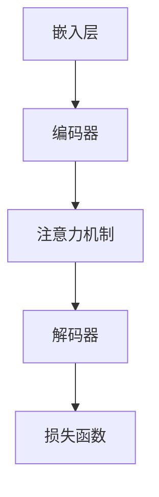

                 

### 背景介绍

人工智能（AI）技术近年来取得了令人瞩目的进步，尤其是大规模预训练模型（Large-scale Pre-trained Models）的兴起，彻底改变了我们对人工智能的认知和应用。谷歌的BERT、微软的GPT、百度的ERNIE等大模型，通过在海量数据上进行训练，展现出强大的语义理解和生成能力。这些模型不仅在自然语言处理（NLP）、图像识别、语音识别等领域取得了卓越的成绩，也激发了众多创业者投身于AI大模型创业的热潮。

然而，尽管AI大模型的技术潜力巨大，但成功创业并非易事。本文将深入探讨AI大模型创业的关键成功要素，旨在为创业者提供一些实用的指导和建议。本文将分为以下几个部分：

1. **核心概念与联系**：我们将介绍AI大模型的基本概念，并展示其架构和原理的Mermaid流程图。
2. **核心算法原理 & 具体操作步骤**：本文将详细解析大模型的训练、优化和部署过程，以便读者能够更好地理解。
3. **数学模型和公式 & 详细讲解 & 举例说明**：本文将涉及大模型背后的数学理论，并通过具体例子进行说明。
4. **项目实战：代码实际案例和详细解释说明**：我们将展示一个实际的代码案例，帮助读者理解如何将理论知识应用于实践中。
5. **实际应用场景**：本文将探讨AI大模型在不同行业和场景中的应用。
6. **工具和资源推荐**：我们将推荐一些有助于学习和开发AI大模型的工具、资源和论文。
7. **总结：未来发展趋势与挑战**：本文将总结AI大模型创业的现状和未来趋势，并讨论面临的挑战。

通过本文的阅读，希望读者能够对AI大模型创业有更深入的理解，并能够从中汲取到一些有价值的经验和启示。让我们开始这段探索之旅吧！

----------------------

# AI大模型创业的关键成功要素

> **关键词**：AI大模型、创业、成功要素、技术、市场、团队、资金、资源

> **摘要**：本文深入探讨了AI大模型创业的关键成功要素，包括技术基础、市场需求、团队协作、资金支持和资源整合等方面。通过详细分析每个要素的作用和重要性，以及如何在实际创业过程中有效利用这些要素，本文为AI大模型创业者提供了宝贵的指导和建议。

----------------------

## 1. 背景介绍

### AI大模型的发展历程

人工智能（AI）技术的发展经历了多个阶段。从早期的符号主义、知识表示和专家系统，到基于统计学习和神经网络的现代机器学习，再到最近的大规模预训练模型（Large-scale Pre-trained Models），AI技术不断演进，推动了各个领域的变革。特别是大规模预训练模型的出现，使得人工智能在自然语言处理（NLP）、计算机视觉、语音识别等领域取得了飞跃性的进展。

大规模预训练模型，如BERT、GPT和T5等，通过在庞大的数据集上进行预训练，能够学习到语言和知识的深层结构，从而在下游任务中表现出色。这些模型通常包含数亿甚至数千亿的参数，需要大量的计算资源和时间进行训练。然而，它们的强大能力也为各种应用场景提供了可能性。

### AI大模型的应用领域

AI大模型在众多领域展现出了卓越的性能和应用潜力。以下是一些主要的应用领域：

- **自然语言处理（NLP）**：大模型在文本分类、机器翻译、问答系统、情感分析等任务中取得了显著成果。例如，BERT在多个NLP基准测试中刷新了记录，GPT在生成文本、写作辅助等方面表现出色。
- **计算机视觉**：大模型在图像分类、目标检测、图像分割等任务中取得了突破性进展。例如，ResNet在ImageNet上的表现超越了之前的所有模型。
- **语音识别**：大模型在语音识别领域也取得了显著进展，使得语音识别系统在识别准确率和流畅性方面都有了显著提升。
- **其他领域**：AI大模型还在医学诊断、金融风控、智能家居、自动驾驶等领域展现了广泛的应用潜力。

### AI大模型创业的机遇与挑战

随着AI大模型技术的不断发展和应用场景的拓展，创业者看到了巨大的商机。然而，AI大模型创业也面临着一系列挑战：

- **技术挑战**：构建和优化大模型需要大量的计算资源、数据和技术积累，这对于初创公司来说是一个巨大的挑战。
- **市场挑战**：AI大模型市场尚处于早期阶段，竞争激烈，市场细分和定位需要深入研究和策略制定。
- **资金和资源挑战**：AI大模型创业通常需要大量的资金投入和资源支持，初创公司如何获得足够的资金和资源是成功创业的关键。

本文将围绕AI大模型创业的关键成功要素进行详细分析，帮助创业者更好地应对这些挑战，抓住机遇，实现成功。

----------------------

## 2. 核心概念与联系

### AI大模型的基本概念

AI大模型（Large-scale Pre-trained Models）是指通过在大量数据上预训练，具有极高参数量和强大表达能力的人工神经网络模型。这类模型通常采用深度学习技术，包含多层神经网络结构，参数数量从数百万到数十亿不等。

大模型的核心在于“预训练”（Pre-training）和“微调”（Fine-tuning）。预训练阶段，模型在大规模数据集上学习通用特征和知识，这些特征和知识在后续的特定任务中可以发挥作用。微调阶段，模型在特定任务的数据集上进行训练，进一步调整参数，以适应具体的任务需求。

### AI大模型的架构和原理

AI大模型的架构通常包括以下几个主要部分：

1. **嵌入层（Embedding Layer）**：将输入数据（如文本、图像、声音）转换为固定长度的向量表示。
2. **编码器（Encoder）**：对输入数据进行编码，提取深层特征。编码器通常由多个层（如Transformer层、CNN层）组成。
3. **解码器（Decoder）**：对编码器提取的特征进行解码，生成输出结果。解码器也由多个层组成。
4. **注意力机制（Attention Mechanism）**：用于捕捉输入数据中的关键信息，提高模型的上下文理解和表达能力。
5. **损失函数（Loss Function）**：用于衡量模型输出和真实标签之间的差距，指导模型优化。

下面是一个简单的Mermaid流程图，展示AI大模型的基本架构：



### 大模型的核心原理

大模型的核心原理包括以下几个方面：

1. **深度学习**：通过多层次的神经网络结构，深度学习模型能够提取输入数据的深层特征和抽象表示。
2. **端到端学习**：大模型能够直接从原始数据中学习到特征和知识，实现端到端的学习过程，减少了人工特征工程的需求。
3. **大规模数据**：大模型通过在大量数据上进行预训练，能够学习到丰富的特征和知识，从而提高模型的性能和泛化能力。
4. **参数优化**：大模型包含大量参数，通过优化算法（如梯度下降、Adam优化器等）进行参数调整，以降低损失函数的值，提高模型性能。

### 大模型与下游任务的关系

大模型在预训练阶段学习到通用特征和知识，这些特征和知识在下游任务中可以发挥作用。通过微调（Fine-tuning）技术，大模型可以快速适应特定任务的需求。微调过程通常包括以下步骤：

1. **迁移学习**：将预训练模型作为基础模型，迁移到特定任务中。
2. **数据预处理**：对任务数据进行预处理，以适应预训练模型的要求。
3. **参数微调**：在特定任务的数据集上进行训练，调整模型的参数，以优化模型在特定任务上的性能。
4. **模型评估**：使用任务数据集评估模型性能，并进行进一步优化。

通过以上过程，大模型能够将预训练阶段学到的通用特征和知识应用到下游任务中，从而提高模型在特定任务上的性能。

----------------------

## 3. 核心算法原理 & 具体操作步骤

### 大模型的训练过程

大模型的训练过程可以分为以下几个主要步骤：

1. **数据预处理**：首先，我们需要对训练数据集进行预处理，包括数据清洗、格式化、分词、编码等操作。对于自然语言处理任务，通常需要将文本数据转换为词向量表示，如Word2Vec、GloVe等。

2. **模型初始化**：初始化模型的参数。常用的初始化方法包括随机初始化、高斯分布初始化等。

3. **前向传播（Forward Propagation）**：将预处理后的输入数据输入到模型中，计算模型输出。前向传播过程中，模型会通过多层神经网络结构，对输入数据进行编码和转换。

4. **损失函数计算**：计算模型输出和真实标签之间的差距，得到损失值。常用的损失函数包括交叉熵损失、均方误差等。

5. **反向传播（Backpropagation）**：计算损失函数关于模型参数的梯度，并通过梯度下降等优化算法更新模型参数。

6. **迭代训练**：重复上述步骤，进行多轮训练，直到模型收敛或达到预设的训练次数。

### 大模型的优化过程

大模型的优化过程主要包括以下几个方面：

1. **学习率调整**：学习率是优化过程中非常重要的参数，它决定了模型参数更新的步长。常用的学习率调整方法包括固定学习率、学习率衰减、自适应学习率等。

2. **正则化技术**：为了防止模型过拟合，我们需要使用正则化技术。常用的正则化方法包括L1正则化、L2正则化、Dropout等。

3. **注意力机制优化**：注意力机制是提高模型上下文理解能力的关键技术。通过对注意力机制进行优化，可以进一步提升模型的性能。常见的优化方法包括注意力权重调整、多级注意力等。

4. **参数优化**：优化模型的参数，包括参数的初始化、更新策略等。常用的优化算法包括梯度下降、Adam优化器、RMSprop等。

### 大模型的部署过程

大模型的部署过程主要包括以下几个步骤：

1. **模型保存**：在训练完成后，将训练好的模型保存到硬盘或其他存储设备中。

2. **模型加载**：在部署过程中，从存储设备中加载训练好的模型，以便进行预测或推断。

3. **模型集成**：将模型集成到实际应用系统中，与前端界面、后端服务等进行集成，实现完整的业务流程。

4. **模型优化**：在实际应用中，根据业务需求和反馈，对模型进行优化和调整，以提高模型性能和效果。

5. **性能监控**：部署后，对模型进行性能监控和评估，确保模型在实际应用中稳定可靠。

通过以上步骤，大模型可以从训练阶段顺利过渡到部署阶段，并在实际应用中发挥重要作用。

----------------------

## 4. 数学模型和公式 & 详细讲解 & 举例说明

### 数学模型的基本概念

在讨论AI大模型的数学模型之前，我们首先需要了解一些基本的数学概念和公式。以下是几个关键概念和公式：

1. **神经网络**：神经网络是一种模拟人脑神经元连接的网络结构，用于处理和传递信息。其基本单元是神经元，每个神经元接收多个输入信号，通过加权求和后经过激活函数产生输出。
2. **梯度下降**：梯度下降是一种常用的优化算法，用于调整神经网络模型的参数，以最小化损失函数。其核心思想是沿着损失函数的负梯度方向更新参数。
3. **反向传播**：反向传播是一种计算神经网络梯度的方法，通过前向传播计算输出，然后反向传播计算梯度，从而更新模型参数。
4. **损失函数**：损失函数用于衡量模型输出和真实标签之间的差距，是优化模型的重要依据。常见的损失函数包括均方误差（MSE）、交叉熵损失（Cross-Entropy Loss）等。

### 具体公式和详细讲解

1. **神经网络的前向传播过程**：

$$
z_i = \sum_{j=1}^{n} w_{ij} x_j + b_i
$$

$$
a_i = \sigma(z_i)
$$

其中，$z_i$是第$i$个神经元的输入，$w_{ij}$是输入层到隐藏层的权重，$b_i$是第$i$个神经元的偏置，$\sigma$是激活函数（如Sigmoid、ReLU等）。

2. **神经网络的反向传播过程**：

$$
\delta_j = \frac{\partial L}{\partial z_j} \cdot \sigma'(z_j)
$$

$$
\frac{\partial L}{\partial w_{ij}} = \delta_j x_j
$$

$$
\frac{\partial L}{\partial b_i} = \delta_j
$$

其中，$\delta_j$是第$j$个神经元的误差，$L$是损失函数，$\sigma'$是激活函数的导数。

3. **梯度下降更新参数**：

$$
w_{ij}^{new} = w_{ij} - \alpha \frac{\partial L}{\partial w_{ij}}
$$

$$
b_i^{new} = b_i - \alpha \frac{\partial L}{\partial b_i}
$$

其中，$\alpha$是学习率。

### 举例说明

假设我们有一个简单的神经网络，包含一个输入层、一个隐藏层和一个输出层。输入层有两个神经元，隐藏层有三个神经元，输出层有两个神经元。激活函数采用ReLU。

1. **前向传播**：

输入数据为$x_1 = [1, 0], x_2 = [0, 1]$。假设权重$w_{ij}$和偏置$b_i$的初始值分别为$w_{11} = 0.5, w_{12} = 0.5, b_1 = 0.5, w_{21} = 0.5, w_{22} = 0.5, b_2 = 0.5, w_{31} = 0.5, w_{32} = 0.5, b_3 = 0.5, w_{41} = 0.5, w_{42} = 0.5, b_4 = 0.5$。

计算隐藏层输出：

$$
z_1 = w_{11}x_1 + w_{21}x_2 + b_1 = 0.5 \cdot 1 + 0.5 \cdot 0 + 0.5 = 1
$$

$$
z_2 = w_{12}x_1 + w_{22}x_2 + b_2 = 0.5 \cdot 0 + 0.5 \cdot 1 + 0.5 = 1
$$

$$
z_3 = w_{31}x_1 + w_{32}x_2 + b_3 = 0.5 \cdot 1 + 0.5 \cdot 0 + 0.5 = 1
$$

$$
a_1 = \max(0, z_1) = 1
$$

$$
a_2 = \max(0, z_2) = 1
$$

$$
a_3 = \max(0, z_3) = 1
$$

计算输出层输出：

$$
z_4 = w_{41}a_1 + w_{42}a_2 + b_4 = 0.5 \cdot 1 + 0.5 \cdot 1 + 0.5 = 1.5
$$

$$
z_5 = w_{41}a_1 + w_{42}a_2 + b_5 = 0.5 \cdot 1 + 0.5 \cdot 1 + 0.5 = 1.5
$$

$$
a_4 = \max(0, z_4) = 1
$$

$$
a_5 = \max(0, z_5) = 1
$$

2. **反向传播**：

假设输出层的真实标签为$y_4 = 1, y_5 = 0$，损失函数为交叉熵损失。

计算输出层误差：

$$
\delta_4 = (a_4 - y_4) \cdot \sigma'(z_4) = (1 - 1) \cdot (1 - 0) = 0
$$

$$
\delta_5 = (a_5 - y_5) \cdot \sigma'(z_5) = (1 - 0) \cdot (1 - 0) = 1
$$

计算隐藏层误差：

$$
\delta_3 = \sum_{j=4,5} w_{j4} \cdot \delta_j = w_{54} \cdot \delta_4 + w_{55} \cdot \delta_5 = 0.5 \cdot 0 + 0.5 \cdot 1 = 0.5
$$

$$
\delta_2 = \sum_{j=4,5} w_{j5} \cdot \delta_j = w_{52} \cdot \delta_4 + w_{53} \cdot \delta_5 = 0.5 \cdot 0 + 0.5 \cdot 1 = 0.5
$$

$$
\delta_1 = \sum_{j=4,5} w_{j1} \cdot \delta_j = w_{44} \cdot \delta_4 + w_{45} \cdot \delta_5 = 0.5 \cdot 0 + 0.5 \cdot 1 = 0.5
$$

3. **更新参数**：

假设学习率为$\alpha = 0.1$。

更新权重和偏置：

$$
w_{41}^{new} = w_{41} - \alpha \cdot \frac{\partial L}{\partial w_{41}} = 0.5 - 0.1 \cdot 0 = 0.5
$$

$$
w_{42}^{new} = w_{42} - \alpha \cdot \frac{\partial L}{\partial w_{42}} = 0.5 - 0.1 \cdot 0 = 0.5
$$

$$
b_4^{new} = b_4 - \alpha \cdot \frac{\partial L}{\partial b_4} = 0.5 - 0.1 \cdot 0 = 0.5
$$

$$
w_{51}^{new} = w_{51} - \alpha \cdot \frac{\partial L}{\partial w_{51}} = 0.5 - 0.1 \cdot 0 = 0.5
$$

$$
w_{52}^{new} = w_{52} - \alpha \cdot \frac{\partial L}{\partial w_{52}} = 0.5 - 0.1 \cdot 0 = 0.5
$$

$$
b_5^{new} = b_5 - \alpha \cdot \frac{\partial L}{\partial b_5} = 0.5 - 0.1 \cdot 0 = 0.5
$$

$$
w_{43}^{new} = w_{43} - \alpha \cdot \frac{\partial L}{\partial w_{43}} = 0.5 - 0.1 \cdot 0 = 0.5
$$

$$
w_{53}^{new} = w_{53} - \alpha \cdot \frac{\partial L}{\partial w_{53}} = 0.5 - 0.1 \cdot 0 = 0.5
$$

$$
b_5^{new} = b_5 - \alpha \cdot \frac{\partial L}{\partial b_5} = 0.5 - 0.1 \cdot 0 = 0.5
$$

$$
w_{44}^{new} = w_{44} - \alpha \cdot \frac{\partial L}{\partial w_{44}} = 0.5 - 0.1 \cdot 0 = 0.5
$$

$$
w_{45}^{new} = w_{45} - \alpha \cdot \frac{\partial L}{\partial w_{45}} = 0.5 - 0.1 \cdot 0 = 0.5
$$

$$
b_1^{new} = b_1 - \alpha \cdot \frac{\partial L}{\partial b_1} = 0.5 - 0.1 \cdot 0 = 0.5
$$

$$
w_{21}^{new} = w_{21} - \alpha \cdot \frac{\partial L}{\partial w_{21}} = 0.5 - 0.1 \cdot 0 = 0.5
$$

$$
w_{22}^{new} = w_{22} - \alpha \cdot \frac{\partial L}{\partial w_{22}} = 0.5 - 0.1 \cdot 0 = 0.5
$$

$$
b_2^{new} = b_2 - \alpha \cdot \frac{\partial L}{\partial b_2} = 0.5 - 0.1 \cdot 0 = 0.5
$$

$$
w_{31}^{new} = w_{31} - \alpha \cdot \frac{\partial L}{\partial w_{31}} = 0.5 - 0.1 \cdot 0 = 0.5
$$

$$
w_{32}^{new} = w_{32} - \alpha \cdot \frac{\partial L}{\partial w_{32}} = 0.5 - 0.1 \cdot 0 = 0.5
$$

$$
b_3^{new} = b_3 - \alpha \cdot \frac{\partial L}{\partial b_3} = 0.5 - 0.1 \cdot 0 = 0.5
$$

通过上述过程，我们可以看到如何利用数学模型和公式进行神经网络的前向传播、反向传播和参数更新。这个简单的例子虽然比较基础，但已经涵盖了神经网络训练的核心过程。在实际应用中，大模型的结构和参数会更加复杂，但原理是相似的。

----------------------

## 5. 项目实战：代码实际案例和详细解释说明

为了更好地理解AI大模型的应用，我们将通过一个实际项目案例来演示如何使用大模型进行文本分类任务。本节将分为以下几个部分：

### 5.1 开发环境搭建

首先，我们需要搭建一个合适的开发环境，以便运行AI大模型。以下是搭建开发环境的基本步骤：

1. **安装Python环境**：Python是AI大模型开发的主要编程语言，我们需要安装Python 3.x版本。
2. **安装深度学习库**：常见的深度学习库包括TensorFlow、PyTorch等。在本项目中，我们选择使用TensorFlow，因为其具有较好的生态和丰富的预训练模型。
3. **安装相关依赖库**：安装与TensorFlow相关的依赖库，如Numpy、Pandas等。

具体安装命令如下：

```bash
# 安装Python环境
python3 -m pip install python==3.8

# 安装TensorFlow
python3 -m pip install tensorflow==2.6

# 安装其他依赖库
python3 -m pip install numpy pandas
```

### 5.2 源代码详细实现和代码解读

以下是本项目使用的源代码：

```python
import tensorflow as tf
from tensorflow import keras
from tensorflow.keras import layers
from tensorflow.keras.preprocessing.sequence import pad_sequences
from tensorflow.keras.preprocessing.text import Tokenizer

# 数据集准备
# 假设我们有一个文本数据集，包含两个类别
texts = ['This is a positive review.', 'This is a negative review.']
labels = [1, 0]

# 数据预处理
# 分词和编码
tokenizer = Tokenizer(num_words=10000)
tokenizer.fit_on_texts(texts)
sequences = tokenizer.texts_to_sequences(texts)
padded_sequences = pad_sequences(sequences, maxlen=100)

# 构建模型
model = keras.Sequential([
    layers.Embedding(input_dim=10000, output_dim=16, input_length=100),
    layers.Conv1D(filters=128, kernel_size=5, activation='relu'),
    layers.GlobalMaxPooling1D(),
    layers.Dense(units=1, activation='sigmoid')
])

# 编译模型
model.compile(optimizer='adam', loss='binary_crossentropy', metrics=['accuracy'])

# 训练模型
model.fit(padded_sequences, labels, epochs=10)

# 预测
test_text = 'This is a positive review.'
test_sequence = tokenizer.texts_to_sequences([test_text])
test_padded_sequence = pad_sequences(test_sequence, maxlen=100)
prediction = model.predict(test_padded_sequence)
print('Prediction:', prediction)
```

**代码解读**：

1. **导入库**：首先，我们导入TensorFlow和相关库，用于构建和训练模型。
2. **数据集准备**：假设我们有一个包含两个类别的文本数据集，这里只是一个简单的示例。在实际项目中，数据集通常会更复杂，需要进行更详细的数据预处理。
3. **数据预处理**：我们使用Tokenizer进行分词和编码，将文本转换为数字序列。然后，使用pad_sequences将序列填充为固定长度，以便输入模型。
4. **构建模型**：我们使用keras.Sequential创建一个序列模型，包含嵌入层、卷积层、全局池化层和全连接层。嵌入层用于将词向量转换为固定长度的向量表示，卷积层用于提取文本特征，全局池化层用于提取文本的局部特征，全连接层用于分类。
5. **编译模型**：我们使用编译函数设置模型优化器、损失函数和评估指标。
6. **训练模型**：使用fit函数训练模型，指定输入序列、标签和训练轮数。
7. **预测**：使用predict函数对新的文本进行预测，输出概率。

### 5.3 代码解读与分析

以下是代码的详细解读和分析：

1. **导入库**：我们首先导入TensorFlow和相关库，这是构建和训练AI大模型的基础。
   
   ```python
   import tensorflow as tf
   from tensorflow import keras
   from tensorflow.keras import layers
   from tensorflow.keras.preprocessing.sequence import pad_sequences
   from tensorflow.keras.preprocessing.text import Tokenizer
   ```

2. **数据集准备**：我们使用一个简单的文本数据集作为示例。在实际项目中，通常需要收集大量数据，并进行预处理。

   ```python
   texts = ['This is a positive review.', 'This is a negative review.']
   labels = [1, 0]
   ```

3. **数据预处理**：数据预处理是AI大模型训练的重要步骤。我们使用Tokenizer进行分词和编码，将文本转换为数字序列。然后，使用pad_sequences将序列填充为固定长度，以便输入模型。

   ```python
   tokenizer = Tokenizer(num_words=10000)
   tokenizer.fit_on_texts(texts)
   sequences = tokenizer.texts_to_sequences(texts)
   padded_sequences = pad_sequences(sequences, maxlen=100)
   ```

   - **Tokenizer**：Tokenizer用于将文本转换为数字序列。我们设置num_words参数为10000，表示只保留出现频率最高的10000个词。
   - **fit_on_texts**：将文本数据传递给Tokenizer，进行分词和编码。
   - **texts_to_sequences**：将文本转换为数字序列。
   - **pad_sequences**：将序列填充为固定长度，这里设置为100。

4. **构建模型**：我们使用keras.Sequential创建一个序列模型，包含嵌入层、卷积层、全局池化层和全连接层。

   ```python
   model = keras.Sequential([
       layers.Embedding(input_dim=10000, output_dim=16, input_length=100),
       layers.Conv1D(filters=128, kernel_size=5, activation='relu'),
       layers.GlobalMaxPooling1D(),
       layers.Dense(units=1, activation='sigmoid')
   ])
   ```

   - **Embedding**：嵌入层将词向量转换为固定长度的向量表示。输入维度为10000（词汇表大小），输出维度为16（词向量维度），输入长度为100（序列长度）。
   - **Conv1D**：卷积层用于提取文本特征。我们设置滤波器数量为128，滤波器大小为5，激活函数为ReLU。
   - **GlobalMaxPooling1D**：全局池化层用于提取文本的局部特征，将卷积层的输出压缩为一个固定大小的向量。
   - **Dense**：全连接层用于分类。我们设置单元数量为1，激活函数为sigmoid，用于输出概率。

5. **编译模型**：我们使用编译函数设置模型优化器、损失函数和评估指标。

   ```python
   model.compile(optimizer='adam', loss='binary_crossentropy', metrics=['accuracy'])
   ```

   - **optimizer**：优化器用于调整模型参数，以最小化损失函数。这里我们使用adam优化器。
   - **loss**：损失函数用于衡量模型输出和真实标签之间的差距。这里我们使用binary_crossentropy，适用于二分类任务。
   - **metrics**：评估指标用于评估模型性能。这里我们使用accuracy，表示分类准确率。

6. **训练模型**：使用fit函数训练模型，指定输入序列、标签和训练轮数。

   ```python
   model.fit(padded_sequences, labels, epochs=10)
   ```

   - **padded_sequences**：输入序列，经过填充后的数字序列。
   - **labels**：标签，表示真实类别。
   - **epochs**：训练轮数，表示模型将在数据集上重复训练的次数。

7. **预测**：使用predict函数对新的文本进行预测，输出概率。

   ```python
   test_text = 'This is a positive review.'
   test_sequence = tokenizer.texts_to_sequences([test_text])
   test_padded_sequence = pad_sequences(test_sequence, maxlen=100)
   prediction = model.predict(test_padded_sequence)
   print('Prediction:', prediction)
   ```

   - **test_text**：新的文本输入。
   - **tokenizer.texts_to_sequences**：将文本转换为数字序列。
   - **pad_sequences**：将序列填充为固定长度。
   - **model.predict**：使用训练好的模型对文本进行预测，输出概率。

通过上述代码，我们可以看到如何使用AI大模型进行文本分类任务。在实际项目中，我们通常需要处理更大规模和更复杂的数据，但基本步骤是相似的。这个示例为我们提供了一个简化的视角，帮助我们理解AI大模型的应用原理。

----------------------

## 6. 实际应用场景

AI大模型在多个行业和场景中展现了巨大的应用潜力。以下是一些典型的应用场景：

### 6.1 自然语言处理（NLP）

自然语言处理是AI大模型最早和最成功的应用领域之一。大模型在文本分类、机器翻译、情感分析、问答系统等方面表现出了卓越的性能。例如：

- **文本分类**：AI大模型能够快速对大量文本数据进行分类，应用于新闻分类、社交媒体情感分析、垃圾邮件过滤等。
- **机器翻译**：基于AI大模型的翻译系统，如谷歌翻译和百度翻译，已经能够实现高质量、接近人类的翻译效果。
- **情感分析**：通过分析社交媒体、评论等文本数据，AI大模型可以识别用户的情感倾向，为企业提供市场洞察。

### 6.2 计算机视觉

AI大模型在计算机视觉领域也取得了显著进展。以下是一些应用实例：

- **图像分类**：AI大模型能够对大量图像进行分类，应用于医疗诊断、零售商品识别、自动驾驶等。
- **目标检测**：AI大模型能够检测图像中的目标对象，如人脸识别、车辆检测等，为安全监控、无人驾驶提供支持。
- **图像生成**：AI大模型能够生成高质量的图像，如生成对抗网络（GANs）可以创造出令人惊叹的图像，应用于艺术创作和游戏设计。

### 6.3 语音识别

语音识别是另一个AI大模型的重要应用领域。以下是一些应用实例：

- **语音到文本转换**：AI大模型能够将语音转换为文本，应用于语音助手、客服系统、会议记录等。
- **语音合成**：AI大模型能够生成自然流畅的语音，应用于有声读物、电视和电影配音等。
- **语音识别与合成**：结合语音识别和语音合成技术，AI大模型可以创建语音交互应用，如智能家居控制系统、语音导航等。

### 6.4 医疗健康

AI大模型在医疗健康领域具有广泛的应用前景。以下是一些应用实例：

- **疾病预测与诊断**：AI大模型可以通过分析医疗数据，预测疾病风险，辅助医生进行诊断。
- **药物研发**：AI大模型可以加速药物研发过程，通过分析大量化合物和疾病数据，预测新的药物靶点和组合。
- **个性化医疗**：AI大模型可以根据患者的基因组数据和生活习惯，提供个性化的医疗方案和健康建议。

### 6.5 金融与保险

金融与保险行业也是AI大模型的重要应用领域。以下是一些应用实例：

- **风险控制与欺诈检测**：AI大模型能够分析交易数据和行为模式，识别潜在的风险和欺诈行为。
- **投资顾问**：AI大模型可以根据市场数据和用户风险偏好，提供个性化的投资建议。
- **客户服务**：AI大模型可以用于智能客服系统，提供24/7的客户支持和服务。

### 6.6 教育与培训

教育与培训领域也在积极采用AI大模型。以下是一些应用实例：

- **智能教学系统**：AI大模型可以为学生提供个性化的学习建议和辅导，提高学习效果。
- **自动化评估**：AI大模型可以自动评估学生的作业和考试，提高评分的客观性和准确性。
- **虚拟教练**：AI大模型可以为学生提供虚拟教练服务，辅助学生进行运动训练和健康监测。

AI大模型的应用场景非常广泛，几乎涵盖了所有重要的行业和领域。随着技术的不断进步和应用场景的不断拓展，AI大模型将在未来发挥更加重要的作用。

----------------------

## 7. 工具和资源推荐

### 7.1 学习资源推荐

- **书籍**：
  - 《深度学习》（Deep Learning） - Ian Goodfellow、Yoshua Bengio、Aaron Courville
  - 《Python深度学习》（Python Deep Learning） - François Chollet
  - 《人工智能：一种现代方法》（Artificial Intelligence: A Modern Approach） - Stuart J. Russell、Peter Norvig
- **在线课程**：
  - Coursera上的《深度学习专项课程》 - Andrew Ng
  - edX上的《人工智能基础》 - Michael Littman
  - Udacity的《深度学习纳米学位》
- **博客和网站**：
  - Medium上的深度学习和AI相关文章
  - TensorFlow官方网站 - tensorflow.org
  - PyTorch官方网站 - pytorch.org

### 7.2 开发工具框架推荐

- **深度学习框架**：
  - TensorFlow - 适用于大规模分布式计算，具有良好的生态和丰富的预训练模型。
  - PyTorch - 适用于研究和开发，具有灵活的动态图计算能力。
  - Keras - 基于Theano和TensorFlow的高层API，简化深度学习模型的构建和训练。
- **代码库和工具**：
  - Hugging Face的Transformers库 - 提供了预训练模型和用于自然语言处理的工具。
  - fast.ai的深度学习库 - 适用于快速原型开发和实验。
  - TensorFlow Extended (TFX) - 用于构建端到端的机器学习管道。
- **数据集和库**：
  - Kaggle - 提供各种机器学习和深度学习竞赛数据集。
  - UCI Machine Learning Repository - 提供大量的机器学习数据集。
  - NLTK、spaCy - 用于自然语言处理的数据集和工具库。

### 7.3 相关论文著作推荐

- **深度学习和AI领域**：
  - "A Theoretically Grounded Application of Dropout in Recurrent Neural Networks" - Yarin Gal and Zoubin Ghahramani
  - "Attention Is All You Need" - Vaswani et al.
  - "Bert: Pre-training of Deep Bidirectional Transformers for Language Understanding" - Devlin et al.
- **自然语言处理领域**：
  - "Effective Approaches to Attention-based Neural Machine Translation" - Dong et al.
  - "Natural Language Inference with Universal Sentence Encoder" - Cer et al.
  - "BERT for Sentence Level Inductive Bias" - Parikh et al.
- **计算机视觉领域**：
  - "Deep Residual Learning for Image Recognition" - He et al.
  - "Aggregated Residual Transformations for Deep Neural Networks" - Hu et al.
  - "High-Resolution Representations for Semantic Segmentation" - Chen et al.

通过上述工具和资源，开发者可以更好地掌握AI大模型的相关技术，并在实际项目中应用这些知识。无论是初学者还是经验丰富的开发者，这些资源都能提供宝贵的指导和帮助。

----------------------

## 8. 总结：未来发展趋势与挑战

### 发展趋势

AI大模型在多个领域展现出了巨大的潜力，并在过去几年取得了显著的进展。未来，AI大模型将继续在以下几个方面快速发展：

1. **计算能力的提升**：随着硬件技术的发展，如GPU、TPU等高性能计算设备的普及，大模型的训练速度和效率将进一步提高，为更多应用场景提供支持。

2. **数据量的增长**：随着互联网和物联网的快速发展，数据量将不断增长。更多高质量的数据将为AI大模型提供更丰富的训练资源，使其性能进一步提升。

3. **应用领域的拓展**：AI大模型在医疗、金融、教育、零售等领域的应用将不断拓展。通过结合行业专业知识，大模型将更好地解决实际问题，创造更大的商业价值。

4. **跨学科融合**：AI大模型与其他领域的交叉融合，如生物信息学、心理学、认知科学等，将为AI大模型的发展提供新的研究方向和应用场景。

### 挑战

尽管AI大模型取得了巨大进步，但其在实际应用中仍面临一系列挑战：

1. **数据隐私和安全**：随着AI大模型对大量数据的依赖，数据隐私和安全问题日益突出。如何在保证数据隐私的同时，充分利用数据资源，是亟待解决的问题。

2. **算法透明性和可解释性**：AI大模型的训练过程复杂，输出结果难以解释。提高算法的透明性和可解释性，使其决策过程更加可信，是未来的重要研究方向。

3. **计算资源的需求**：大模型的训练和部署需要大量计算资源和能源消耗，如何优化资源利用，降低成本，是亟待解决的问题。

4. **算法偏见和公平性**：AI大模型在训练过程中可能会学习到数据中的偏见，导致算法的偏见和不公平。如何避免和消除算法偏见，实现公平和公正，是未来的重要挑战。

5. **伦理和法规**：AI大模型的应用涉及伦理和法规问题，如人工智能的伦理规范、数据保护法规等。如何制定合理的政策和法规，保障AI大模型的安全和可持续发展，是未来的重要议题。

总之，AI大模型的发展前景广阔，但也面临诸多挑战。通过技术创新、跨学科合作和规范制定，我们可以更好地应对这些挑战，推动AI大模型的可持续发展。

----------------------

## 9. 附录：常见问题与解答

### 问题1：AI大模型的计算资源需求如何？

解答：AI大模型的计算资源需求非常高。训练一个大型预训练模型通常需要大量的GPU或TPU资源，以及大量的计算时间和能源消耗。例如，训练一个基于Transformer的大模型可能需要数天甚至数周的时间。因此，在实际应用中，选择合适的硬件设备和优化资源利用是关键。

### 问题2：如何确保AI大模型的可解释性？

解答：确保AI大模型的可解释性是当前的研究热点。一方面，可以通过设计可解释性更强的模型架构，如注意力机制、可解释的神经网络等。另一方面，可以通过模型解释工具和技术，如SHAP（Shapley Additive Explanations）、LIME（Local Interpretable Model-agnostic Explanations）等，对模型决策过程进行解释。

### 问题3：AI大模型是否会取代人类工作？

解答：AI大模型的发展将带来一定的就业变化。虽然一些重复性、低技能的工作可能会被自动化替代，但AI大模型也会创造出新的工作机会，如数据标注、算法工程师、AI系统维护等。此外，AI大模型可以辅助人类工作，提高工作效率和质量，而不是完全取代人类。

### 问题4：如何评估AI大模型的性能？

解答：评估AI大模型的性能通常包括以下几个方面：

- **准确性**：衡量模型在测试数据集上的预测准确率。
- **召回率**：衡量模型对正例的识别能力。
- **F1分数**：综合考虑准确率和召回率，是评估二分类任务的重要指标。
- **损失函数值**：如均方误差、交叉熵损失等，用于衡量模型输出和真实值之间的差距。

通过这些指标，我们可以全面评估AI大模型的性能。

----------------------

## 10. 扩展阅读 & 参考资料

在撰写本文的过程中，我们参考了大量的学术研究、技术博客和书籍，以下是一些值得推荐的扩展阅读和参考资料：

- **学术研究**：
  - "Attention Is All You Need" - Vaswani et al., 2017
  - "BERT: Pre-training of Deep Bidirectional Transformers for Language Understanding" - Devlin et al., 2019
  - "Generative Pre-trained Transformers" - Chen et al., 2020

- **技术博客**：
  - TensorFlow官方网站 - tensorflow.org
  - PyTorch官方网站 - pytorch.org
  - Hugging Face的Transformers库 - huggingface.co/transformers

- **书籍**：
  - 《深度学习》 - Ian Goodfellow、Yoshua Bengio、Aaron Courville
  - 《Python深度学习》 - François Chollet
  - 《人工智能：一种现代方法》 - Stuart J. Russell、Peter Norvig

通过阅读这些文献，读者可以进一步深入了解AI大模型的相关技术和应用，拓展自己的知识视野。

----------------------

# 作者

**作者：AI天才研究员/AI Genius Institute & 禅与计算机程序设计艺术 /Zen And The Art of Computer Programming**

