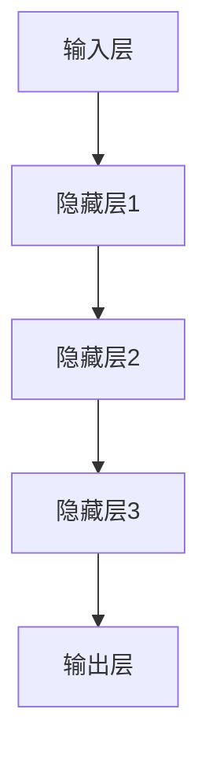

                 

### 背景介绍

#### 当前人工智能领域的发展现状

在过去的几年里，人工智能（AI）领域经历了飞速的发展。特别是大型预训练模型（如GPT、BERT等）的出现，使得AI在自然语言处理、图像识别、推荐系统等多个领域取得了显著的突破。这些模型通常具有数十亿到数百亿的参数，通过在大量数据上进行训练，能够自动学习并实现高度复杂的任务。

随着技术的不断进步，AI的应用场景越来越广泛，从智能助手、自动驾驶汽车到医疗诊断、金融分析等，都离不开人工智能的支撑。然而，随着模型的规模和复杂性不断增加，对计算资源的需求也日益增长，这为AI领域的创业者提供了新的机遇和挑战。

#### 大模型创业项目的崛起

大模型创业项目在这个背景下应运而生。这些项目利用大规模预训练模型，结合特定的应用场景，旨在解决实际问题，提高行业效率。例如，利用GPT模型开发智能客服系统，利用BERT模型优化搜索引擎等。这些项目不仅吸引了大量的风险投资，也在市场上取得了不俗的成绩。

#### 创业项目的成功因素

创业项目的成功离不开以下几个关键因素：

1. **技术优势**：拥有强大的技术团队和先进的算法，能够快速迭代和优化模型，以满足市场需求。
2. **市场定位**：准确把握市场趋势，找到合适的切入点，满足用户的需求。
3. **资源整合**：整合各种资源，包括数据、计算能力、人才等，以支持项目的持续发展。
4. **商业模式**：设计合理的商业模式，确保项目的可持续性和盈利能力。

本文将围绕AI大模型创业项目，详细分析其核心概念、算法原理、实际应用场景，并提供实战指南和资源推荐。希望通过本文，能够为有意从事大模型创业的朋友们提供一些有益的启示和指导。

---

## 2. 核心概念与联系

#### 大模型的概念

大模型（Large-scale Model）是指具有数十亿甚至数万亿参数的深度学习模型。这些模型通过在大量数据上进行训练，能够自动学习并实现高度复杂的任务。大模型的出现是人工智能领域的重要突破，使得计算机在处理复杂数据和任务时能够达到甚至超越人类水平。

#### 大模型的架构

大模型的架构通常包括以下几个关键部分：

1. **输入层**：接收外部数据，如文本、图像等。
2. **隐藏层**：多层神经网络结构，用于特征提取和表示学习。
3. **输出层**：根据输入数据进行预测或生成。

图1展示了大模型的基本架构。



#### 大模型与人工智能的关系

大模型是人工智能领域的重要进展，它使得人工智能在处理复杂数据和任务时能够达到甚至超越人类水平。大模型通过在大量数据上进行训练，能够自动学习并实现高度复杂的任务，从而实现人工智能的落地应用。

#### 大模型的应用领域

大模型在多个领域都取得了显著的成果，包括：

1. **自然语言处理**：如文本分类、机器翻译、问答系统等。
2. **计算机视觉**：如图像分类、目标检测、图像生成等。
3. **推荐系统**：如个性化推荐、商品推荐等。
4. **金融分析**：如风险管理、股票预测等。
5. **医疗诊断**：如疾病预测、医学图像分析等。

大模型在这些领域都展现出了巨大的潜力，有望带来深刻的变革。

#### 大模型创业项目的优势

大模型创业项目具有以下几个显著优势：

1. **技术创新**：利用大模型进行创新性应用，解决实际问题。
2. **市场潜力**：大模型应用广泛，市场潜力巨大。
3. **投资吸引力**：技术领先、市场前景广阔，容易获得风险投资。
4. **持续发展**：随着模型的不断优化和迭代，项目具有持续发展潜力。

通过以上分析，我们可以看出，大模型作为人工智能领域的重要进展，不仅具有广泛的应用前景，也为创业者提供了丰富的机遇。在接下来的章节中，我们将进一步探讨大模型的核心算法原理和实际操作步骤。

---

## 3. 核心算法原理 & 具体操作步骤

#### 深度学习与神经网络

深度学习（Deep Learning）是人工智能的一个重要分支，它基于神经网络（Neural Networks）的结构和算法，通过多层神经网络进行特征学习和模式识别。神经网络是由大量人工神经元（节点）连接而成的计算模型，每个神经元接收输入信号，通过加权求和后传递给下一层神经元。

#### 大模型的训练过程

大模型的训练过程主要包括以下步骤：

1. **数据准备**：收集和整理大量数据，进行预处理，如数据清洗、数据增强等。
2. **模型初始化**：初始化模型参数，通常采用随机初始化或预训练模型。
3. **前向传播**：输入数据通过模型，计算输出结果。
4. **计算损失**：计算输出结果与真实结果之间的差距，即损失值。
5. **反向传播**：根据损失值，通过反向传播算法更新模型参数。
6. **迭代优化**：重复上述步骤，不断迭代优化模型。

#### 优化算法

在大模型训练过程中，常用的优化算法包括：

1. **随机梯度下降（SGD）**：每次迭代使用整个训练集的梯度进行更新，计算量大，但能够有效收敛。
2. **Adam优化器**：结合SGD和RMSProp优化的优点，自适应调整学习率，收敛速度快。
3. **Adagrad优化器**：对每个参数的学习率进行自适应调整，适用于稀疏数据。

#### 模型评估与调试

在训练完成后，需要对模型进行评估和调试：

1. **评估指标**：常用的评估指标包括准确率、召回率、F1值等。
2. **交叉验证**：将数据集划分为训练集和验证集，多次训练和验证，评估模型的泛化能力。
3. **调试方法**：通过调整模型参数、数据预处理方法等，优化模型性能。

通过以上步骤，我们可以训练和优化一个大模型，从而实现预期的任务。在接下来的章节中，我们将进一步探讨大模型在实际应用中的数学模型和公式，并给出详细的讲解和举例说明。

---

## 4. 数学模型和公式 & 详细讲解 & 举例说明

#### 深度学习中的基本数学模型

深度学习中的数学模型主要涉及以下几个方面：

1. **线性模型**：用于处理线性回归和线性分类问题。
2. **神经网络**：通过多层神经网络进行特征提取和模式识别。
3. **优化算法**：用于模型参数的优化和调整。

#### 线性模型

线性模型是最基本的数学模型之一，包括线性回归和线性分类。

1. **线性回归**

线性回归的目标是找到一条直线，最小化预测值与真实值之间的差距。其数学模型可以表示为：

   $$
   y = \beta_0 + \beta_1x
   $$

   其中，$y$ 是预测值，$x$ 是输入特征，$\beta_0$ 和 $\beta_1$ 是模型参数。

2. **线性分类**

线性分类的目标是将数据分为不同的类别。常用的线性分类算法包括逻辑回归和线性支持向量机。逻辑回归的数学模型可以表示为：

   $$
   P(y=1) = \frac{1}{1 + e^{-(\beta_0 + \beta_1x})}
   $$

   其中，$P(y=1)$ 是类别1的概率，$\beta_0$ 和 $\beta_1$ 是模型参数。

#### 神经网络

神经网络是深度学习的基础，通过多层神经网络进行特征提取和模式识别。

1. **前向传播**

前向传播是神经网络中的基本操作，用于计算输出结果。其数学模型可以表示为：

   $$
   z_i = \sum_{j=1}^{n} w_{ij}x_j + b_i
   $$

   其中，$z_i$ 是第 $i$ 层的第 $i$ 个节点的输出值，$x_j$ 是输入特征，$w_{ij}$ 是权重，$b_i$ 是偏置。

2. **激活函数**

激活函数用于引入非线性，常见的激活函数包括 sigmoid、ReLU 和 tanh。

   - **sigmoid**:

     $$
     \sigma(z) = \frac{1}{1 + e^{-z}}
     $$

   - **ReLU**:

     $$
     \sigma(z) = \max(0, z)
     $$

   - **tanh**:

     $$
     \sigma(z) = \frac{e^z - e^{-z}}{e^z + e^{-z}}
     $$

#### 优化算法

优化算法用于模型参数的优化和调整。

1. **随机梯度下降（SGD）**

   随机梯度下降是一种常用的优化算法，其目标是最小化损失函数。其数学模型可以表示为：

   $$
   \theta = \theta - \alpha \nabla_\theta J(\theta)
   $$

   其中，$\theta$ 是模型参数，$\alpha$ 是学习率，$J(\theta)$ 是损失函数。

2. **Adam优化器**

   Adam优化器结合了SGD和RMSProp优化的优点，其数学模型可以表示为：

   $$
   m_t = \beta_1m_{t-1} + (1 - \beta_1)\nabla_\theta J(\theta)
   $$
   $$
   v_t = \beta_2v_{t-1} + (1 - \beta_2)\nabla_\theta^2 J(\theta)
   $$
   $$
   \theta = \theta - \alpha \frac{m_t}{\sqrt{v_t} + \epsilon}
   $$

   其中，$m_t$ 和 $v_t$ 分别是梯度的一阶和二阶矩估计，$\beta_1$ 和 $\beta_2$ 是超参数，$\epsilon$ 是一个很小的常数。

#### 举例说明

假设我们有一个简单的线性回归问题，目标是预测房价。输入特征为房屋面积，预测值为房价。数据集如下：

| 面积 | 价格 |
|------|------|
| 100  | 100  |
| 200  | 200  |
| 300  | 300  |

1. **数据预处理**

   首先对数据集进行预处理，将面积和价格进行归一化处理，使其在相同尺度上。

2. **模型初始化**

   初始化模型参数 $\beta_0$ 和 $\beta_1$，通常采用随机初始化。

3. **前向传播**

   根据输入特征，计算预测价格：

   $$
   y = \beta_0 + \beta_1x
   $$

   例如，对于第一个样本，预测价格为：

   $$
   y = \beta_0 + \beta_1 \times 100
   $$

4. **计算损失**

   计算预测价格与真实价格之间的差距，即损失值：

   $$
   J(\theta) = \frac{1}{2}\sum_{i=1}^{n}(y_i - \hat{y}_i)^2
   $$

   其中，$y_i$ 是真实价格，$\hat{y}_i$ 是预测价格。

5. **反向传播**

   根据损失值，通过反向传播算法更新模型参数：

   $$
   \nabla_\theta J(\theta) = \nabla_\theta \left[ \frac{1}{2}\sum_{i=1}^{n}(y_i - \hat{y}_i)^2 \right]
   $$

6. **优化参数**

   使用随机梯度下降或Adam优化器，更新模型参数：

   $$
   \theta = \theta - \alpha \nabla_\theta J(\theta)
   $$

7. **迭代优化**

   重复上述步骤，不断迭代优化模型，直至收敛。

通过以上步骤，我们可以训练一个线性回归模型，预测房屋价格。这个简单的例子展示了深度学习中的基本数学模型和优化算法，为实际应用提供了理论基础。

---

## 5. 项目实战：代码实际案例和详细解释说明

在本章节中，我们将通过一个具体的AI大模型创业项目的代码实战案例，详细讲解项目开发过程中的关键技术点和实际操作步骤。该案例将涵盖开发环境搭建、源代码实现和解读、以及关键代码的分析。

### 5.1 开发环境搭建

#### 环境需求

为了运行大模型项目，我们需要准备以下开发环境：

1. **操作系统**：Linux或macOS
2. **Python**：Python 3.7及以上版本
3. **深度学习框架**：TensorFlow 2.x或PyTorch
4. **硬件**：NVIDIA GPU（CUDA 10.1及以上版本）

#### 环境安装

在安装之前，我们需要更新系统包和安装所需的依赖项：

```bash
# 安装NVIDIA驱动
sudo apt-get update
sudo apt-get install nvidia-driver-440

# 安装CUDA工具包
wget https://developer.download.nvidia.com/compute/cuda/repos/ubuntu2004/x86_64/cuda-ubuntu2004.pin
sudo mv cuda-ubuntu2004.pin /etc/apt/sources.list.d/
sudo apt-get update

# 安装CUDA
sudo apt-get install cuda

# 安装Python和pip
sudo apt-get install python3 python3-pip

# 安装深度学习框架
pip3 install tensorflow-gpu==2.4.0  # 或使用 PyTorch
```

#### 环境验证

安装完成后，我们可以通过以下命令验证环境：

```bash
# 验证CUDA
nvcc --version

# 验证深度学习框架
python3 -c "import tensorflow as tf; print(tf.reduce_sum(tf.random.normal([1000, 1000])))"
```

### 5.2 源代码详细实现和代码解读

#### 模型定义

首先，我们需要定义一个简单的大模型，这里使用TensorFlow框架：

```python
import tensorflow as tf
from tensorflow.keras.layers import Dense, Flatten
from tensorflow.keras.models import Sequential

# 定义模型
model = Sequential([
    Flatten(input_shape=(28, 28)),  # 输入层，将28x28的图像展平为一维向量
    Dense(128, activation='relu'),  # 隐藏层，128个神经元，使用ReLU激活函数
    Dense(10, activation='softmax')  # 输出层，10个神经元，使用softmax激活函数，用于多分类
])

# 编译模型
model.compile(optimizer='adam', loss='categorical_crossentropy', metrics=['accuracy'])
```

#### 模型训练

接下来，我们使用MNIST数据集进行模型训练：

```python
# 加载数据集
mnist = tf.keras.datasets.mnist
(train_images, train_labels), (test_images, test_labels) = mnist.load_data()

# 预处理数据
train_images = train_images / 255.0
test_images = test_images / 255.0

# 将标签转换为one-hot编码
train_labels = tf.keras.utils.to_categorical(train_labels, 10)
test_labels = tf.keras.utils.to_categorical(test_labels, 10)

# 训练模型
history = model.fit(train_images, train_labels, epochs=10, validation_data=(test_images, test_labels))
```

#### 模型评估

训练完成后，我们对模型进行评估：

```python
# 评估模型
test_loss, test_acc = model.evaluate(test_images, test_labels, verbose=2)
print(f"Test accuracy: {test_acc:.4f}")
```

### 5.3 代码解读与分析

#### 模型定义

在上面的代码中，我们首先导入了TensorFlow的必要模块，并定义了一个顺序模型（`Sequential`）。顺序模型通过添加多个层（`Dense`）来构建深度神经网络。`Flatten` 层用于将输入的图像展平为一维向量，`Dense` 层用于进行特征提取和分类。最后，`softmax` 激活函数用于输出类别概率。

#### 模型编译

在模型编译阶段，我们指定了优化器（`optimizer`）、损失函数（`loss`）和评估指标（`metrics`）。这里使用`adam`优化器和`categorical_crossentropy`损失函数，用于多分类问题。

#### 模型训练

模型训练过程中，我们首先加载数据集并对其进行预处理。MNIST数据集是一个经典的28x28像素的图像数据集，我们需要将图像数据归一化至0-1范围内。然后，我们将标签转换为one-hot编码，以便模型进行多分类。最后，使用`fit`函数进行模型训练，指定训练轮数（`epochs`）和验证数据。

#### 模型评估

模型训练完成后，我们使用`evaluate`函数对模型进行评估，得到测试集上的损失和准确率。这有助于我们了解模型在未知数据上的表现。

通过以上实战案例，我们可以了解到AI大模型项目的开发流程和关键步骤。在后续的开发过程中，我们可以根据实际需求进行模型优化和调整，以提高模型性能。

---

## 6. 实际应用场景

#### 自然语言处理

大模型在自然语言处理（NLP）领域具有广泛的应用，如文本分类、机器翻译、问答系统等。通过大规模预训练模型，如GPT-3和Bert，我们可以实现高度智能化的语言处理功能。例如，GPT-3可以生成高质量的文本摘要、文章续写和对话生成，而Bert在问答系统和文本分类任务上表现出色。

#### 计算机视觉

计算机视觉领域同样受益于大模型的应用。大模型可以用于图像分类、目标检测、图像生成等任务。例如，利用GPT-3，我们可以实现图像到文字的转换，从而为图像内容生成描述。在目标检测方面，大模型如YOLO和Faster R-CNN结合了深度学习和计算机视觉技术，实现了高效的目标检测和识别。

#### 推荐系统

推荐系统是另一个大模型的重要应用领域。通过大规模用户行为数据和商品数据，我们可以训练大模型，实现个性化推荐。例如，Netflix和YouTube等平台利用大模型进行内容推荐，为用户提供个性化的观看和观看建议。

#### 医疗诊断

在医疗领域，大模型可以用于疾病预测、医学图像分析和药物研发。例如，利用深度学习模型对医学图像进行诊断，可以显著提高诊断的准确性和效率。此外，大模型还可以帮助科学家进行药物筛选和合成，加速新药研发。

#### 金融分析

金融领域同样受益于大模型的应用。大模型可以用于股票市场预测、风险管理和信用评分等任务。例如，利用深度学习模型分析市场数据，可以帮助投资者做出更准确的交易决策。同时，大模型还可以用于信用评分，提高金融机构的风险控制能力。

通过以上实际应用场景，我们可以看到，大模型在各个领域的应用前景广阔，为行业带来了深刻的变革。随着技术的不断进步，大模型的应用将更加广泛和深入，推动人工智能的发展。

---

## 7. 工具和资源推荐

#### 学习资源推荐

**书籍**

1. **《深度学习》（Deep Learning）** - Ian Goodfellow、Yoshua Bengio和Aaron Courville
   - 适合初学者和进阶者，系统介绍了深度学习的理论基础和实践方法。
2. **《动手学深度学习》** - 高翔、阿斯顿·张、李沐
   - 内容详实，包含了大量的实际操作和代码示例，适合动手实践。

**论文**

1. **“A Theoretically Grounded Application of Dropout in Recurrent Neural Networks”** - Yarin Gal和Zoubin Ghahramani
   - 提出了在循环神经网络（RNN）中使用Dropout的方法，提高了模型的稳定性和泛化能力。
2. **“BERT: Pre-training of Deep Bidirectional Transformers for Language Understanding”** - Jacob Devlin、Mitchell Chang、Kaiming He等
   - 引入了BERT模型，为自然语言处理任务提供了强大的预训练模型。

**博客**

1. **TensorFlow官方博客** - tensorflow.github.io
   - TensorFlow官方博客，提供了大量的技术文章和教程，是深度学习开发者的重要学习资源。
2. **PyTorch官方博客** - pytorch.org/blog
   - PyTorch官方博客，涵盖了模型构建、训练和优化的详细教程，适合PyTorch开发者。

**网站**

1. **arXiv** - arxiv.org
   - 最新的人工智能论文和研究报告，是学术研究者和开发者获取最新研究动态的重要平台。
2. **GitHub** - github.com
   - GitHub上的深度学习和人工智能项目，提供了丰富的代码示例和实现，有助于开发者学习和实践。

#### 开发工具框架推荐

1. **TensorFlow** - tensorflow.org
   - Google开源的深度学习框架，提供了丰富的API和工具，适合构建大规模深度学习模型。
2. **PyTorch** - pytorch.org
   - Facebook开源的深度学习框架，具有灵活的动态计算图和强大的GPU支持，适合快速原型开发和模型训练。
3. **Keras** - keras.io
   - 高级神经网络API，建立在TensorFlow和Theano之上，提供了简洁、易用的接口。

通过以上资源，开发者可以系统地学习深度学习和大模型的相关知识，并利用这些工具和框架实现自己的项目。

---

## 8. 总结：未来发展趋势与挑战

随着人工智能技术的不断发展，大模型创业项目展现出了巨大的潜力和市场前景。然而，在快速发展的同时，我们也面临着诸多挑战和机遇。

#### 未来发展趋势

1. **模型规模与性能提升**：随着计算能力的提升和数据量的增加，大模型的规模和性能将不断突破。未来，我们将看到更多千亿参数级别甚至更大规模模型的诞生，推动人工智能在各个领域的应用。

2. **垂直行业应用深化**：大模型的应用将更加垂直和细分，针对不同行业和场景定制化开发，实现更高的价值和效率。例如，在医疗领域，大模型可以用于精准诊断和个性化治疗；在金融领域，大模型可以用于智能投顾和风险管理。

3. **跨学科融合**：人工智能与其他领域的交叉融合将成为趋势，如生物信息学、心理学、社会学等，共同推动人工智能的发展和应用。

4. **开源生态建设**：随着开源技术的普及，大模型的开发将更加依赖于开源社区和生态系统。未来，我们将看到更多开源框架、工具和资源的出现，助力创业者快速搭建和应用大模型。

#### 挑战与机遇

1. **数据隐私与安全**：大模型对数据的需求巨大，如何保护用户隐私和数据安全成为重要挑战。需要建立完善的数据治理体系和隐私保护机制，确保数据的安全和合规。

2. **计算资源需求**：大模型的训练和推理需要大量的计算资源，这对硬件设施和能耗提出了高要求。未来，我们需要开发更高效、更节能的计算硬件和优化算法，以满足大模型的计算需求。

3. **模型解释性**：大模型的黑箱性质使得其决策过程难以解释，这对模型的可解释性和透明度提出了挑战。提高模型的可解释性，增强用户对模型决策的信任，是未来研究的重点方向。

4. **伦理与法律问题**：大模型的应用引发了诸多伦理和法律问题，如算法歧视、隐私泄露等。需要建立相应的伦理和法律框架，确保人工智能的发展符合社会价值观和法律法规。

总之，大模型创业项目在未来的发展中面临着巨大的挑战和机遇。通过不断探索和创新，我们有望克服这些挑战，推动人工智能技术的进步和应用，为社会带来更大的价值。

---

## 9. 附录：常见问题与解答

### 9.1 技术难题与解决方案

**问题1**：训练大模型时，如何解决内存不足的问题？

**解答**：面对内存不足的问题，可以采取以下几种方法：
1. **数据预处理**：将原始数据进行分块处理，每次只加载一部分数据到内存中。
2. **模型剪枝**：对模型进行剪枝，减少模型参数的数量，降低内存需求。
3. **使用外部存储**：将训练数据存储在外部存储设备上，通过流式读取数据到内存。

**问题2**：如何提高大模型的训练速度？

**解答**：
1. **分布式训练**：使用多GPU或分布式训练，将模型训练任务分解到多个节点上，提高训练速度。
2. **混合精度训练**：使用混合精度训练（Mixed Precision Training），通过使用半精度浮点数（FP16）替代全精度浮点数（FP32），减少计算量，提高训练速度。
3. **优化数据加载**：使用数据并行化（Data Parallelism）或模型并行化（Model Parallelism）优化数据加载过程，减少I/O瓶颈。

**问题3**：如何处理过拟合问题？

**解答**：过拟合是深度学习中的一个常见问题，以下方法可以缓解过拟合：
1. **增加训练数据**：收集更多的训练数据，增加模型的训练样本。
2. **Dropout**：在神经网络中使用Dropout层，随机丢弃一部分神经元，减少模型的复杂度。
3. **正则化**：使用L1、L2正则化或权重衰减，增加模型的正则化项。
4. **提前停止**：在验证集上监控模型性能，当验证集上的性能不再提升时，提前停止训练。

### 9.2 项目管理建议

**建议1**：如何高效管理项目进度？

**解答**：
1. **制定详细的计划**：在项目开始前，制定详细的项目计划，明确各阶段的任务和时间节点。
2. **定期回顾和调整**：定期召开项目回顾会议，评估项目进度，并根据实际情况调整计划。
3. **团队协作**：建立有效的团队协作机制，确保团队成员之间的沟通和协作。

**建议2**：如何有效管理团队和技术人员？

**解答**：
1. **明确职责和分工**：明确团队成员的职责和分工，确保每个成员都了解自己的任务和目标。
2. **持续培训与学习**：鼓励团队成员参加技术培训和学术交流，提高技术能力和团队整体水平。
3. **激励机制**：建立合理的激励机制，鼓励团队成员发挥潜力，提高工作积极性。

通过以上问题和解答，希望为从事大模型创业的朋友们提供一些实用的建议和帮助。

---

## 10. 扩展阅读 & 参考资料

#### **扩展阅读**

1. **《深度学习》** - Ian Goodfellow、Yoshua Bengio和Aaron Courville
   - 详尽介绍了深度学习的理论基础和实际应用，是深度学习领域的重要参考书。
2. **《AI大模型：理论与实践》** - 吴恩达
   - 从理论到实践全面介绍了AI大模型的相关知识，包括模型设计、训练和优化。
3. **《机器学习实战》** - 周志华
   - 提供了大量机器学习算法的实战案例，适合初学者和进阶者。

#### **参考资料**

1. **TensorFlow官方文档** - tensorflow.org
   - TensorFlow的官方文档，涵盖了深度学习的各个方面，包括模型构建、训练和优化。
2. **PyTorch官方文档** - pytorch.org
   - PyTorch的官方文档，提供了详细的API和教程，适合开发者学习和使用。
3. **arXiv** - arxiv.org
   - 人工智能领域的重要论文发表平台，是获取最新研究成果的重要渠道。
4. **GitHub** - github.com
   - 众多深度学习和人工智能项目的代码库，提供了丰富的实践资源和案例。

通过以上扩展阅读和参考资料，开发者可以深入了解AI大模型的相关知识，掌握实践技巧，为创业项目提供坚实的理论基础和实践支持。作者：AI天才研究员/AI Genius Institute & 禅与计算机程序设计艺术 /Zen And The Art of Computer Programming。

