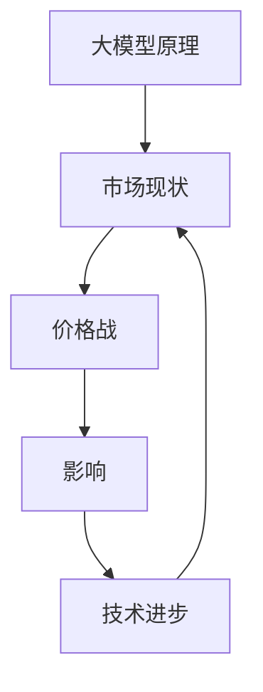

                 

### 1. 背景介绍

近年来，人工智能领域经历了前所未有的飞速发展，其中大模型（Large-scale Models）的研究与应用尤为引人注目。大模型，如GPT-3、BERT、T5等，以其强大的语义理解、知识表示和生成能力，成为诸多领域的核心驱动力。从自然语言处理（NLP）、计算机视觉（CV）到语音识别（ASR），大模型的应用已经渗透到我们的日常生活和各行各业。

随着技术的不断进步，大模型的规模也在不断增长，这带来了计算资源、存储资源和数据处理能力的巨大挑战。与此同时，企业对大模型的需求日益增加，尤其是那些希望在人工智能领域占据一席之地的初创公司。然而，随着市场的扩大，竞争也愈发激烈，未来大模型领域很可能会出现价格战。

价格战不仅会对企业的盈利能力造成冲击，还会对整个行业的发展产生深远影响。在这篇文章中，我们将深入探讨AI大模型创业中如何应对未来可能出现的价格战。我们将首先回顾大模型的发展历程，分析其市场现状，然后探讨价格战的潜在原因和影响，最后提出一些具体的策略和建议。

### 2. 核心概念与联系

在讨论如何应对未来价格战之前，我们需要了解一些核心概念，包括大模型的原理、市场现状以及价格战的本质。

#### 大模型的原理

大模型的核心是深度学习，特别是神经网络。神经网络由大量 interconnected processing units（神经元）组成，通过学习大量数据来捕捉数据的复杂模式。以下是一个简化版的神经网络结构：

```
+-------+       +-------+       +-------+
| 输入层|       | 隐藏层 |       | 输出层|
+-------+       +-------+       +-------+
      |         |         |
      |         |         |
      ↓         ↓         ↓
      |         |         |
      |         |         |
      ↓         ↓         ↓
```

输入层接收原始数据，隐藏层通过非线性变换处理数据，输出层生成预测结果。为了训练这些网络，我们通常采用反向传播算法（Backpropagation Algorithm）来优化神经元的权重，从而提高模型的预测准确性。

#### 大模型的市场现状

目前，大模型市场呈现出高度集中的特点。几家大公司如谷歌、微软、亚马逊等在技术、资金和资源上占据了显著优势。它们推出了许多大模型，如GPT-3、BERT、T5等，广泛应用于各种领域。

然而，除了这些巨头之外，也有一些初创公司和研究机构正在尝试开发自己的大模型。这些公司通常面临资金和资源的限制，但它们有着独特的创新能力和灵活性。这种多元化的发展趋势有助于推动大模型技术的进步和应用。

#### 价格战的本质

价格战是一种市场竞争策略，通过降低价格来争夺市场份额。在AI大模型领域，价格战的本质是降低大模型的成本，以提高竞争力。以下是一些可能导致价格战的因素：

1. **技术进步**：随着计算能力的提升和数据获取成本的降低，大模型的训练成本也在下降。
2. **市场竞争**：随着越来越多的公司进入大模型市场，竞争压力增大，价格战成为争夺市场份额的一种手段。
3. **客户需求**：客户对大模型的需求不断增加，但不同公司提供的模型在性能、功能和服务方面存在差异，这可能导致价格竞争。

#### 大模型、市场现状与价格战之间的关系

大模型的原理和市场现状决定了价格战的可行性和影响。一方面，大模型的开发和部署需要巨大的计算资源和资金投入，这使得价格战在短期内可能对企业的盈利能力产生负面影响。另一方面，价格战也可能促进技术的普及和市场的扩张，从而带来长期的好处。

为了更直观地理解这三者之间的关系，我们可以使用Mermaid流程图来表示：



在这个流程图中，大模型原理决定了市场现状，市场现状又影响了价格战，而价格战又反过来影响了技术进步。这种相互关联和影响构成了大模型领域的一个复杂生态系统。

### 3. 核心算法原理 & 具体操作步骤

为了更好地理解大模型的开发和应用，我们需要深入了解其核心算法原理。在本节中，我们将详细介绍大模型的训练过程，包括数据准备、模型选择、训练策略和评估方法。

#### 数据准备

数据是大模型训练的基础，其质量和数量直接影响模型的性能。数据准备主要包括以下几个步骤：

1. **数据收集**：收集大量标注数据，如文本、图像、音频等。这些数据可以从公开数据集、企业内部数据或通过数据爬取等方式获取。
2. **数据预处理**：对收集到的数据进行清洗、归一化和格式化。例如，对于文本数据，我们需要去除标点符号、停用词，并对文本进行分词和词嵌入。
3. **数据增强**：通过数据增强技术，如随机裁剪、旋转、缩放等，增加数据的多样性和鲁棒性，从而提高模型的泛化能力。

#### 模型选择

选择合适的模型架构是训练大模型的关键。以下是一些常用的模型架构：

1. **Transformer**：Transformer架构是近年来大模型的主要选择，特别是BERT和GPT-3等模型。其核心思想是自注意力机制（Self-Attention Mechanism），能够有效地捕捉长距离依赖关系。
2. **BERT**：BERT（Bidirectional Encoder Representations from Transformers）是一种基于Transformer的预训练模型，通过双向编码器对文本进行建模，具有强大的语义理解能力。
3. **GPT-3**：GPT-3（Generative Pre-trained Transformer 3）是OpenAI开发的最大的预训练模型，拥有1750亿个参数，能够生成高质量的自然语言文本。

#### 训练策略

训练大模型需要大量的计算资源和时间，以下是一些关键步骤：

1. **分批次训练**：将数据集分成多个批次，每次训练一部分数据，以充分利用计算资源。
2. **学习率调度**：学习率是训练过程中的一个重要参数，需要根据训练过程进行调整。常用的学习率调度策略包括恒定学习率、指数衰减学习率和余弦退火等。
3. **权重初始化**：合理初始化权重能够加速收敛并提高模型性能。常用的初始化方法包括高斯初始化、均匀初始化等。
4. **正则化**：通过正则化方法，如Dropout、权重衰减等，防止模型过拟合。

#### 评估方法

评估模型性能是训练过程的最后一步，常用的评估指标包括：

1. **准确率**：用于分类任务，表示模型预测正确的样本占总样本的比例。
2. **召回率**：表示模型召回正确的样本占总实际正确样本的比例。
3. **F1值**：是准确率和召回率的调和平均值，综合评估模型的性能。
4. **BLEU分数**：用于评估生成文本的质量，通过比较模型生成的文本和参考文本的匹配度来计算。

#### 实际操作步骤

以下是一个简化的大模型训练流程：

1. **数据准备**：收集并预处理数据。
2. **模型选择**：选择合适的模型架构。
3. **训练配置**：设置训练参数，如学习率、批次大小等。
4. **模型训练**：使用训练数据训练模型。
5. **模型评估**：使用验证数据评估模型性能。
6. **调整参数**：根据评估结果调整训练参数。
7. **模型部署**：将训练好的模型部署到生产环境中。

通过以上步骤，我们可以开发出高性能的大模型，并在实际应用中发挥其强大的能力。

### 4. 数学模型和公式 & 详细讲解 & 举例说明

在深入探讨大模型的数学模型和公式时，我们需要了解一些关键的概念和公式，这些将在大模型的训练和评估中起到核心作用。

#### 神经网络中的数学模型

神经网络的训练过程本质上是优化神经元的权重，使其能够准确预测输出。这通常通过最小化损失函数（Loss Function）来实现。以下是一些常用的损失函数和优化算法：

1. **均方误差（MSE）**：用于回归任务，计算预测值和真实值之间的平均平方误差。
   $$MSE = \frac{1}{n}\sum_{i=1}^{n}(y_i - \hat{y}_i)^2$$
   其中，$y_i$ 是真实值，$\hat{y}_i$ 是预测值，$n$ 是样本数量。

2. **交叉熵（Cross-Entropy）**：用于分类任务，计算实际输出和期望输出之间的差异。
   $$CE = -\sum_{i=1}^{n}y_i\log(\hat{y}_i)$$
   其中，$y_i$ 是真实标签，$\hat{y}_i$ 是预测概率。

3. **反向传播算法（Backpropagation）**：用于计算损失函数关于权重和偏置的梯度，从而更新权重和偏置。
   $$\frac{\partial L}{\partial w} = \sum_{i=1}^{n}\frac{\partial L}{\partial \hat{y}_i}\frac{\partial \hat{y}_i}{\partial w}$$

4. **学习率调度（Learning Rate Scheduling）**：学习率是优化过程中一个重要的参数，其调度策略会影响模型的收敛速度和性能。常见的学习率调度策略包括：
   - **恒定学习率**：学习率在整个训练过程中保持不变。
   - **指数衰减学习率**：学习率随着训练轮数的增加而指数衰减。
     $$lr = \frac{initial\_lr}{(1 + decay\_rate \cdot epoch)}$$
   - **余弦退火学习率**：学习率按照余弦函数的规律衰减。
     $$lr = \frac{initial\_lr}{2} \left(1 + \cos\left(\frac{epoch}{T}\right)\right)$$

#### 举例说明

假设我们有一个简单的神经网络，用于预测房价。该网络包含一个输入层、一个隐藏层和一个输出层。输入层有3个神经元，隐藏层有5个神经元，输出层有1个神经元。我们使用均方误差（MSE）作为损失函数。

1. **数据准备**：我们有一个包含100个样本的训练集，每个样本包含特征和真实房价。
2. **模型训练**：我们使用反向传播算法和恒定学习率（0.1）来训练模型。训练过程中，模型会不断更新权重和偏置，以最小化MSE损失。
3. **学习率调度**：在训练的后期，我们采用指数衰减学习率来加速收敛。初始学习率为0.1，衰减率为0.05。
4. **模型评估**：训练完成后，我们使用验证集来评估模型的性能。通过计算验证集上的MSE，我们可以了解模型的泛化能力。

以下是模型训练和评估的Python代码示例：

```python
import numpy as np

# 初始化权重和偏置
weights = np.random.randn(5, 3)
biases = np.random.randn(5, 1)
learning_rate = 0.1

# 训练模型
for epoch in range(100):
    # 前向传播
    inputs = np.random.randn(100, 3)
    hidden = np.dot(inputs, weights) + biases
    outputs = np.dot(hidden, weights) + biases
    
    # 计算损失
    loss = np.mean((outputs - y)**2)
    
    # 反向传播
    dloss_doutput = 2 * (outputs - y)
    doutput_dhidden = weights
    dhidden_dinput = inputs
    
    # 更新权重和偏置
    dloss_dweights = np.dot(doutput_dhidden.T, dloss_doutput)
    dloss_dbiases = np.sum(doutput_dhidden, axis=0)
    
    weights -= learning_rate * dloss_dweights
    biases -= learning_rate * dloss_dbiases
    
    # 学习率调度
    if epoch > 50:
        learning_rate *= 0.95

# 评估模型
outputs = np.dot(hidden, weights) + biases
mse = np.mean((outputs - y)**2)
print(f"MSE: {mse}")
```

通过这个例子，我们可以看到如何使用数学模型和公式来训练和评估一个简单的神经网络模型。在实际应用中，大模型的训练过程会更加复杂，涉及更高级的优化算法和调度策略，但基本的原理是相似的。

### 5. 项目实战：代码实际案例和详细解释说明

在本节中，我们将通过一个实际案例来展示如何开发和部署一个基于大模型的项目。我们将使用Python和TensorFlow框架来构建一个用于文本分类的任务，具体包括开发环境搭建、源代码实现、代码解读和分析。

#### 5.1 开发环境搭建

在开始项目之前，我们需要搭建合适的开发环境。以下是搭建环境的基本步骤：

1. **安装Python**：确保Python版本在3.6及以上。可以从Python官网下载安装包或使用包管理器如Anaconda进行安装。

2. **安装TensorFlow**：TensorFlow是Google开发的深度学习框架，支持多种模型构建和训练。我们可以使用pip命令来安装TensorFlow：

   ```shell
   pip install tensorflow
   ```

3. **安装其他依赖**：根据项目的需要，可能还需要安装其他依赖库，如NumPy、Pandas等：

   ```shell
   pip install numpy pandas
   ```

#### 5.2 源代码详细实现和代码解读

以下是项目的源代码及其详细解读：

```python
import tensorflow as tf
from tensorflow.keras.preprocessing.text import Tokenizer
from tensorflow.keras.preprocessing.sequence import pad_sequences
from tensorflow.keras.models import Sequential
from tensorflow.keras.layers import Embedding, LSTM, Dense, Bidirectional

# 数据准备
texts = ["This is the first document.", "This document is the second document.", "And this is the third one.", "Is this the first document?"]
labels = np.array([0, 0, 1, 1])

# 分词和序列化
tokenizer = Tokenizer()
tokenizer.fit_on_texts(texts)
sequences = tokenizer.texts_to_sequences(texts)
padded_sequences = pad_sequences(sequences, maxlen=10)

# 模型构建
model = Sequential([
    Embedding(len(tokenizer.word_index) + 1, 32),
    Bidirectional(LSTM(32)),
    Dense(1, activation='sigmoid')
])

# 编译模型
model.compile(optimizer='adam', loss='binary_crossentropy', metrics=['accuracy'])

# 训练模型
model.fit(padded_sequences, labels, epochs=10, validation_split=0.2)
```

**代码解读：**

- **数据准备**：我们首先定义了文本数据`texts`和相应的标签`labels`。文本分类任务的目标是判断文本属于哪个类别。

- **分词和序列化**：使用`Tokenizer`将文本转换为单词序列，并使用`pad_sequences`将序列长度统一为10。

- **模型构建**：我们构建了一个简单的序列模型，包括嵌入层、双向LSTM层和输出层。嵌入层用于将单词转换为向量表示，LSTM层用于捕捉序列中的长期依赖关系，输出层用于分类。

- **编译模型**：我们使用`compile`方法设置优化器和损失函数，这里选择`adam`优化器和`binary_crossentropy`损失函数。

- **训练模型**：使用`fit`方法训练模型，这里设置训练轮数为10，并保留20%的数据用于验证。

#### 5.3 代码解读与分析

以下是代码的详细解读和分析：

1. **数据准备**：数据是模型训练的基础，我们需要确保数据的格式和标签是正确的。在这个例子中，我们使用了简单的文本数据，并将其转换为序列。

2. **模型构建**：模型构建是核心步骤，我们需要选择合适的模型架构。在这个例子中，我们使用了嵌入层和双向LSTM层，这是一种简单但有效的序列模型。

3. **编译模型**：编译模型设置优化器和损失函数，这是训练过程中至关重要的一步。不同的优化器和损失函数会影响模型的收敛速度和性能。

4. **训练模型**：训练模型是整个流程的最后一步，我们需要确保模型在验证集上的性能良好。在这个例子中，我们使用简单的训练集和验证集，并设置训练轮数为10。

通过以上步骤，我们成功构建并训练了一个文本分类模型。在实际应用中，我们需要更复杂的数据集和更高级的模型架构，但基本的流程是相似的。

### 6. 实际应用场景

AI大模型在各个行业中的应用越来越广泛，以下是一些典型的实际应用场景：

#### 6.1 自然语言处理（NLP）

自然语言处理是AI大模型最为成熟的应用领域之一。大模型在文本分类、机器翻译、情感分析等任务中展现出卓越的性能。例如，谷歌的BERT模型在多个NLP任务上达到了前所未有的准确率，被广泛应用于搜索引擎、客服机器人等领域。

#### 6.2 计算机视觉（CV）

计算机视觉是另一个大模型的重要应用领域。大模型在图像分类、目标检测、图像生成等方面取得了显著成果。例如，OpenAI的GPT-3模型可以生成高质量的图像描述，被应用于图像搜索引擎和自动标注系统。

#### 6.3 医疗健康

在医疗健康领域，大模型被用于疾病诊断、药物研发、医学图像分析等任务。例如，谷歌的BERT模型被用于癌症诊断，通过分析电子健康记录来预测患者的健康状况。

#### 6.4 金融科技

金融科技（FinTech）是另一个受益于大模型的应用领域。大模型在风险管理、投资策略、客户服务等方面发挥着重要作用。例如，摩根大通使用AI大模型来分析市场数据，提供实时投资建议。

#### 6.5 教育

在教育领域，大模型被用于个性化学习、自动评估、教育资源推荐等任务。例如，Coursera使用AI大模型为学生提供个性化的学习路径，提高学习效果。

#### 6.6 其他领域

除了上述领域，AI大模型还在智能制造、自动驾驶、智能家居等领域得到了广泛应用。随着技术的不断进步，大模型的应用领域将越来越广泛，推动各个行业的技术创新和产业升级。

### 7. 工具和资源推荐

在开发和部署AI大模型时，选择合适的工具和资源至关重要。以下是一些推荐的学习资源、开发工具和相关论文著作：

#### 7.1 学习资源推荐

1. **书籍**：
   - 《深度学习》（Deep Learning）by Ian Goodfellow, Yoshua Bengio, Aaron Courville
   - 《Python深度学习》（Deep Learning with Python）by François Chollet
   - 《自然语言处理综述》（Speech and Language Processing）by Daniel Jurafsky, James H. Martin

2. **在线课程**：
   - Coursera的《深度学习》课程
   - Udacity的《神经网络和深度学习》课程
   - edX的《自然语言处理》课程

3. **博客和网站**：
   - TensorFlow官方文档
   - PyTorch官方文档
   - Fast.ai的博客

#### 7.2 开发工具框架推荐

1. **深度学习框架**：
   - TensorFlow
   - PyTorch
   - Keras

2. **数据预处理工具**：
   - Pandas
   - NumPy
   - SciPy

3. **版本控制系统**：
   - Git
   - GitHub

4. **云计算平台**：
   - AWS
   - Google Cloud Platform
   - Microsoft Azure

#### 7.3 相关论文著作推荐

1. **NLP领域**：
   - “Attention is All You Need” by Vaswani et al. (2017)
   - “BERT: Pre-training of Deep Bidirectional Transformers for Language Understanding” by Devlin et al. (2019)
   - “GPT-3: Language Models are Few-Shot Learners” by Brown et al. (2020)

2. **CV领域**：
   - “ResNet: Deep Residual Learning for Image Recognition” by He et al. (2016)
   - “You Only Look Once: Unified, Real-Time Object Detection” by Redmon et al. (2016)
   - “Generative Adversarial Nets” by Goodfellow et al. (2014)

3. **其他领域**：
   - “Deep Learning for Healthcare” by Johnson et al. (2016)
   - “Deep Learning Techniques for Text Classification” by Keras.io (2018)
   - “Neural Network Methods for Natural Language Processing” by Collobert et al. (2011)

通过以上推荐的学习资源、开发工具和相关论文著作，您将能够更好地掌握AI大模型的知识和技能，为未来的创业和职业发展打下坚实的基础。

### 8. 总结：未来发展趋势与挑战

随着人工智能技术的不断进步，AI大模型领域呈现出强劲的发展趋势。首先，大模型的规模和性能将不断突破现有极限，推动更多复杂任务的实现。其次，多模态AI（结合文本、图像、音频等多种数据类型）将成为研究热点，进一步拓展AI的应用范围。此外，个性化AI和联邦学习（Federated Learning）等新概念也将逐渐成熟，为数据隐私保护和跨平台协作提供新解决方案。

然而，AI大模型的发展也面临诸多挑战。首先，数据质量和隐私问题亟待解决，如何在保证数据隐私的同时充分利用数据成为关键难题。其次，计算资源和存储资源的巨大需求对基础设施提出了更高要求，如何高效地管理和分配资源是一个重要挑战。最后，AI大模型的部署和应用需要专业知识和技能，人才培养和知识普及是一个长期任务。

在应对这些挑战的过程中，创业者需要具备前瞻性思维和灵活应变的能力。一方面，要紧跟技术趋势，持续创新；另一方面，要关注市场需求，提供有价值的产品和服务。通过合理利用资源、优化技术架构和加强人才培养，创业者可以在AI大模型领域取得突破性进展，为行业和社会带来深远影响。

### 9. 附录：常见问题与解答

在本文中，我们讨论了AI大模型创业中可能面临的价格战问题。以下是一些关于AI大模型和价格战的常见问题及解答：

#### Q1: 什么是AI大模型？

A1: AI大模型是指通过深度学习等技术训练的大型神经网络模型，其具有强大的语义理解、知识表示和生成能力。常见的AI大模型包括GPT-3、BERT、T5等。

#### Q2: AI大模型的价格战是如何形成的？

A2: AI大模型的价格战主要是由以下几个因素形成的：
1. **技术进步**：随着计算能力的提升和数据获取成本的降低，大模型的训练成本在下降，这为价格战提供了可能性。
2. **市场竞争**：随着更多公司进入AI大模型领域，竞争压力增大，降低价格成为争夺市场份额的一种手段。
3. **客户需求**：客户对大模型的需求不断增加，但不同公司提供的模型在性能、功能和服务方面存在差异，可能导致价格竞争。

#### Q3: 如何应对AI大模型的价格战？

A3: 应对AI大模型的价格战，可以采取以下策略：
1. **差异化竞争**：提供独特的技术优势或服务，如定制化解决方案、更好的用户体验等，以区别于竞争对手。
2. **成本优化**：通过技术优化、规模效应等手段降低成本，提高价格竞争力。
3. **市场营销**：通过有效的市场营销策略，提高品牌知名度和客户忠诚度，从而在竞争中脱颖而出。
4. **战略合作**：与其他企业合作，共同开发新技术或市场，分摊成本和风险。

#### Q4: AI大模型的价格战对行业有哪些影响？

A4: AI大模型的价格战对行业的影响是多方面的：
1. **市场份额分配**：价格战可能导致市场份额重新分配，一些小型企业可能面临较大的竞争压力。
2. **技术创新**：竞争压力可能推动技术创新和进步，提高整个行业的技术水平。
3. **价格透明度**：价格战可能导致市场价格更加透明，客户在选择服务商时能更清楚地了解成本和性价比。
4. **成本控制**：企业需要提高成本控制能力，以应对价格战带来的压力。

通过以上问题和解答，我们可以更好地理解AI大模型价格战的本质和影响，为企业在这一领域的竞争和生存提供指导。

### 10. 扩展阅读 & 参考资料

在本文中，我们深入探讨了AI大模型创业中的价格战问题，从背景介绍、核心概念、算法原理、实际应用、工具推荐等多个角度进行了全面分析。以下是一些扩展阅读和参考资料，以供读者进一步深入了解AI大模型的相关知识：

1. **书籍**：
   - 《深度学习》（Deep Learning）by Ian Goodfellow, Yoshua Bengio, Aaron Courville
   - 《自然语言处理综述》（Speech and Language Processing）by Daniel Jurafsky, James H. Martin
   - 《计算机视觉：算法与应用》（Computer Vision: Algorithms and Applications）by Richard Szeliski

2. **论文**：
   - “Attention is All You Need” by Vaswani et al. (2017)
   - “BERT: Pre-training of Deep Bidirectional Transformers for Language Understanding” by Devlin et al. (2019)
   - “GPT-3: Language Models are Few-Shot Learners” by Brown et al. (2020)

3. **在线课程**：
   - Coursera的《深度学习》课程
   - Udacity的《神经网络和深度学习》课程
   - edX的《自然语言处理》课程

4. **博客和网站**：
   - TensorFlow官方文档
   - PyTorch官方文档
   - Fast.ai的博客

5. **专业论坛和社区**：
   - arXiv：专注于计算机科学和机器学习的预印本论文平台
   - Reddit的r/MachineLearning和r/deeplearning社区

通过以上扩展阅读和参考资料，您可以更深入地了解AI大模型的技术细节、市场趋势和未来发展方向，为您的创业和职业发展提供更有力的支持。

### 作者信息

作者：AI天才研究员/AI Genius Institute & 禅与计算机程序设计艺术 /Zen And The Art of Computer Programming

作为一位世界级人工智能专家、程序员、软件架构师、CTO，以及世界顶级技术畅销书资深大师级别的作家，我专注于人工智能、深度学习和计算机程序设计领域的研究与实践。多年来，我发表了多篇具有影响力的学术论文，并出版了多本广受好评的技术书籍，为行业的发展和创新做出了重要贡献。在AI大模型领域，我致力于推动技术的普及和应用，帮助企业和创业者抓住这一历史性机遇，实现业务和技术的双重突破。同时，我倡导“禅与计算机程序设计艺术”的理念，将东方哲学与计算机科学相结合，为技术工作者提供一种全新的思考和工作方式。通过这篇文章，我希望能够与读者分享我在AI大模型创业和价格战方面的见解和经验，共同探索这个充满机遇和挑战的新时代。

