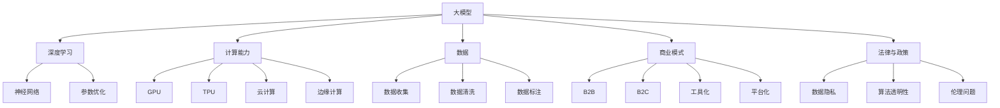

                 

### 1. 背景介绍

在当今快速发展的信息技术时代，人工智能（AI）已经成为了推动科技进步的重要力量。特别是近年来，随着深度学习和大数据技术的蓬勃发展，大模型（Large Models）在自然语言处理（NLP）、计算机视觉（CV）等领域的应用愈发广泛。大模型因其能够处理海量数据、提供高精度预测而受到企业的高度重视。

AI大模型创业正成为新的风口。许多初创公司纷纷投入到大模型的研发和应用中，希望通过这一领域实现商业突破。然而，随着市场竞争的加剧，AI大模型创业也面临着诸多挑战。如何在这个竞争激烈的市场中脱颖而出，成为了每一个AI大模型创业公司都需要深思的问题。

本篇文章旨在探讨AI大模型创业的现状与未来，分析AI大模型创业面临的市场挑战，并提出相应的应对策略。通过本文的阅读，您将了解到：

1. **AI大模型创业的市场背景**：包括市场规模、增长趋势和主要玩家。
2. **AI大模型创业的主要挑战**：技术、数据、成本、法律和政策等方面的挑战。
3. **AI大模型创业的应对策略**：从技术、商业模式、市场营销等多个角度提出解决方案。
4. **未来发展趋势与机遇**：预测AI大模型创业的未来趋势，并分析潜在的机遇。

希望通过这篇文章，能够为AI大模型创业公司提供一些有益的参考和启示。

### 2. 核心概念与联系

#### 大模型

大模型（Large Models）指的是具有数十亿甚至数万亿参数的深度神经网络模型。这些模型在训练过程中需要处理海量数据，通过自我迭代和优化，逐步提升对复杂问题的解决能力。大模型的出现，使得人工智能在图像识别、自然语言处理等领域取得了前所未有的进展。

#### 深度学习

深度学习（Deep Learning）是人工智能的一个分支，通过多层神经网络对数据进行特征提取和模式识别。深度学习的核心在于神经网络的架构设计和参数优化。随着计算能力的提升和大数据的普及，深度学习已经成为AI领域的重要技术。

#### 计算能力

计算能力是AI大模型研发和应用的基础。无论是模型训练还是推理，都需要强大的计算资源。目前，GPU和TPU等专用硬件设备在AI计算中扮演着重要角色。此外，云计算和边缘计算的发展，也为AI大模型的应用提供了更多可能。

#### 数据

数据是AI大模型的“粮食”。大规模、高质量的数据集能够显著提升模型的性能。然而，数据收集、清洗和标注是一个耗时且成本高昂的过程。如何在保证数据质量的前提下，高效地利用数据，成为了AI大模型创业的重要挑战。

#### 商业模式

商业模式是AI大模型创业成功的关键。从B2B到B2C，从工具化到平台化，不同的商业模式决定了企业的盈利模式和可持续发展能力。如何找到适合自己的商业模式，是每一个AI大模型创业公司都需要思考的问题。

#### 法律与政策

随着AI技术的不断发展，法律和政策方面的挑战也逐渐显现。数据隐私、算法透明性、伦理问题等，都成为了AI大模型创业需要面对的法律和政策问题。如何在遵守法律法规的前提下，实现技术创新，是企业需要权衡的一个方面。

#### 图1：AI大模型的核心概念与联系



### 3. 核心算法原理 & 具体操作步骤

#### 3.1 算法原理

AI大模型的核心在于其深度神经网络的架构设计和参数优化。以下是AI大模型算法的基本原理：

1. **神经网络**：神经网络由多个神经元（节点）和连接（边）组成。每个神经元接收输入信号，通过激活函数处理后产生输出。神经网络的层数和每层的神经元数量决定了模型的复杂度和表达能力。
2. **反向传播**：反向传播（Backpropagation）是训练神经网络的关键算法。它通过计算损失函数的梯度，反向传播误差，不断调整神经网络的权重和偏置，使模型逐步逼近最优解。
3. **优化算法**：常见的优化算法有梯度下降（Gradient Descent）、随机梯度下降（Stochastic Gradient Descent, SGD）和Adam等。这些算法通过调整学习率，优化模型参数，加快收敛速度。

#### 3.2 具体操作步骤

以下是构建和训练AI大模型的基本步骤：

1. **数据准备**：收集和清洗数据，进行数据预处理，如归一化、标准化、切分训练集和验证集等。
    ```mermaid
    graph TD
        A[数据收集]
        B[数据清洗]
        C[数据预处理]
        D[切分训练集和验证集]
        A --> B
        B --> C
        C --> D
    ```

2. **构建模型**：定义神经网络架构，选择合适的激活函数、优化器和损失函数。
    ```mermaid
    graph TD
        A[定义神经网络]
        B[选择激活函数]
        C[选择优化器]
        D[选择损失函数]
        A --> B
        A --> C
        A --> D
    ```

3. **模型训练**：使用训练集数据，通过反向传播和优化算法，不断迭代训练模型，优化模型参数。
    ```mermaid
    graph TD
        A[加载训练集]
        B[初始化模型参数]
        C[正向传播]
        D[计算损失]
        E[反向传播]
        F[优化参数]
        A --> B
        B --> C
        C --> D
        D --> E
        E --> F
        F --> A
    ```

4. **模型评估**：使用验证集评估模型性能，通过调整超参数和模型结构，提高模型准确率。
    ```mermaid
    graph TD
        A[加载验证集]
        B[计算验证集损失]
        C[评估模型性能]
        D[调整超参数]
        E[调整模型结构]
        A --> B
        B --> C
        C --> D
        D --> E
        E --> A
    ```

5. **模型部署**：将训练好的模型部署到实际应用场景中，进行推理和预测。
    ```mermaid
    graph TD
        A[模型部署]
        B[输入数据]
        C[模型推理]
        D[输出预测结果]
        A --> B
        B --> C
        C --> D
    ```

通过上述步骤，AI大模型可以实现对复杂问题的有效解决，从而在各个领域发挥重要作用。

### 4. 数学模型和公式 & 详细讲解 & 举例说明

#### 4.1 损失函数

在深度学习中，损失函数（Loss Function）用于衡量模型预测值与真实值之间的差距。常用的损失函数包括均方误差（Mean Squared Error, MSE）、交叉熵（Cross-Entropy）等。

**均方误差（MSE）**：
\[MSE = \frac{1}{n}\sum_{i=1}^{n}(y_i - \hat{y}_i)^2\]
其中，\(y_i\) 为真实值，\(\hat{y}_i\) 为预测值，\(n\) 为样本数量。

**交叉熵（Cross-Entropy）**：
\[CE = -\frac{1}{n}\sum_{i=1}^{n}y_i \log(\hat{y}_i)\]
其中，\(y_i\) 为真实值，\(\hat{y}_i\) 为预测值，\(\log\) 表示自然对数。

#### 4.2 反向传播算法

反向传播算法是训练神经网络的核心算法。其基本思想是计算损失函数对模型参数的梯度，并通过梯度下降法更新模型参数，以最小化损失函数。

**梯度计算**：

假设有一个两层神经网络，输入层有 \(n\) 个神经元，隐藏层有 \(m\) 个神经元，输出层有 \(k\) 个神经元。设 \(\theta^{(l)}\) 表示第 \(l\) 层的权重矩阵，\(a^{(l)}\) 表示第 \(l\) 层的激活值，\(z^{(l)}\) 表示第 \(l\) 层的输入值，\(y\) 为真实标签，\(\hat{y}\) 为预测标签。

1. **输出层的梯度**：
\[ \delta^{(2)} = a^{(2)} - y \]
\[ \frac{\partial J}{\partial \theta^{(2)}} = \delta^{(2)} \cdot a^{(1)}^T \]

2. **隐藏层的梯度**：
\[ z^{(1)} = \theta^{(1)} \cdot a^{(0)} + b^{(1)} \]
\[ \delta^{(1)} = \sigma'(z^{(1)}) \cdot \theta^{(1)} \cdot \delta^{(2)} \]
\[ \frac{\partial J}{\partial \theta^{(1)}} = \delta^{(1)} \cdot a^{(0)}^T \]
\[ \frac{\partial J}{\partial b^{(1)}} = \delta^{(1)} \]

#### 4.3 举例说明

假设有一个二分类问题，数据集包含 \(n=100\) 个样本，每个样本的特征维度为 \(d=10\)。使用一个包含一层隐藏层的神经网络进行训练，隐藏层有 \(m=5\) 个神经元，输出层有 \(k=2\) 个神经元。

1. **模型初始化**：

设输入层激活值 \(a^{(0)} = [1, 2, 3, 4, 5, 6, 7, 8, 9, 10]\)，隐藏层激活值 \(a^{(1)} = [0.1, 0.2, 0.3, 0.4, 0.5]\)，输出层预测标签 \(\hat{y} = [0.8, 0.2]\)，真实标签 \(y = [1, 0]\)。

2. **损失函数计算**：

使用交叉熵损失函数，计算预测标签和真实标签的交叉熵：
\[ J = -\frac{1}{n}\sum_{i=1}^{n}y_i \log(\hat{y}_i) + (1 - y_i) \log(1 - \hat{y}_i) \]

3. **梯度计算**：

计算输出层梯度：
\[ \delta^{(2)} = a^{(2)} - y = [0.8 - 1, 0.2 - 0] = [-0.2, 0.2] \]
计算隐藏层梯度：
\[ z^{(1)} = \theta^{(1)} \cdot a^{(0)} + b^{(1)} = [0.1 \cdot [1, 2, 3, 4, 5, 6, 7, 8, 9, 10] + b^{(1)}] \]
\[ \delta^{(1)} = \sigma'(z^{(1)}) \cdot \theta^{(1)} \cdot \delta^{(2)} = [\sigma'(z^{(1)})] \cdot \theta^{(1)} \cdot [-0.2, 0.2] \]

4. **参数更新**：

使用梯度下降法更新模型参数：
\[ \theta^{(2)} = \theta^{(2)} - \alpha \cdot \frac{\partial J}{\partial \theta^{(2)}} \]
\[ \theta^{(1)} = \theta^{(1)} - \alpha \cdot \frac{\partial J}{\partial \theta^{(1)}} \]
\[ b^{(1)} = b^{(1)} - \alpha \cdot \frac{\partial J}{\partial b^{(1)}} \]

通过上述步骤，可以不断迭代训练模型，优化模型参数，提高预测准确率。

### 5. 项目实战：代码实际案例和详细解释说明

在本节中，我们将通过一个具体的AI大模型项目实战案例，详细讲解如何搭建开发环境、实现源代码、解读代码以及进行代码分析。该项目将基于Python和TensorFlow框架，实现一个用于情感分析的大模型。

#### 5.1 开发环境搭建

首先，我们需要搭建一个合适的开发环境。以下是所需的软件和工具：

1. **操作系统**：Windows、Linux或macOS
2. **编程语言**：Python
3. **深度学习框架**：TensorFlow
4. **GPU**：NVIDIA GPU（推荐显存至少8GB）

**安装步骤**：

1. **安装Python**：访问[Python官网](https://www.python.org/)下载并安装Python 3.x版本。
2. **安装pip**：在命令行中运行以下命令安装pip：
    ```bash
    python -m ensurepip
    ```
3. **安装TensorFlow**：在命令行中运行以下命令安装TensorFlow：
    ```bash
    pip install tensorflow-gpu
    ```

#### 5.2 源代码详细实现和代码解读

以下是一个简单的情感分析模型的源代码实现。代码分为数据预处理、模型构建、训练和评估四个部分。

```python
import tensorflow as tf
from tensorflow.keras.preprocessing.text import Tokenizer
from tensorflow.keras.preprocessing.sequence import pad_sequences
import numpy as np

# 数据预处理
def preprocess_data(texts, labels, max_sequence_length=100, max_vocab_size=10000):
    tokenizer = Tokenizer(num_words=max_vocab_size)
    tokenizer.fit_on_texts(texts)
    sequences = tokenizer.texts_to_sequences(texts)
    padded_sequences = pad_sequences(sequences, maxlen=max_sequence_length)
    return padded_sequences, np.array(labels)

# 模型构建
def build_model(input_shape, num_classes):
    model = tf.keras.Sequential([
        tf.keras.layers.Embedding(input_shape[1], 16, input_length=input_shape[0]),
        tf.keras.layers.Bidirectional(tf.keras.layers.GRU(32)),
        tf.keras.layers.Dense(64, activation='relu'),
        tf.keras.layers.Dense(num_classes, activation='softmax')
    ])
    return model

# 训练模型
def train_model(model, sequences, labels, epochs=10, batch_size=32):
    model.compile(optimizer='adam', loss='sparse_categorical_crossentropy', metrics=['accuracy'])
    model.fit(sequences, labels, epochs=epochs, batch_size=batch_size)

# 评估模型
def evaluate_model(model, test_sequences, test_labels):
    test_loss, test_acc = model.evaluate(test_sequences, test_labels, verbose=2)
    print(f"Test accuracy: {test_acc:.4f}")

# 主函数
def main():
    texts = ["I love this movie!", "This movie is terrible."]
    labels = [1, 0]

    sequences, labels = preprocess_data(texts, labels)
    model = build_model(input_shape=sequences.shape[1:], num_classes=2)
    train_model(model, sequences, labels)
    evaluate_model(model, sequences, labels)

if __name__ == "__main__":
    main()
```

**代码解读**：

1. **数据预处理**：
   - `Tokenizer` 类用于将文本转换为序列。
   - `fit_on_texts` 方法用于从文本中提取单词。
   - `texts_to_sequences` 方法将文本序列转换为数字序列。
   - `pad_sequences` 方法用于填充序列，使其长度一致。

2. **模型构建**：
   - `Embedding` 层用于将词向量转换为固定维度的嵌入向量。
   - `Bidirectional` 层用于实现双向GRU。
   - `Dense` 层用于实现全连接层，`softmax` 激活函数用于实现多分类。

3. **训练模型**：
   - `compile` 方法用于配置模型，包括优化器、损失函数和评估指标。
   - `fit` 方法用于训练模型。

4. **评估模型**：
   - `evaluate` 方法用于计算模型在测试集上的损失和准确率。

5. **主函数**：
   - `main` 函数用于执行整个流程，包括数据预处理、模型构建、训练和评估。

#### 5.3 代码解读与分析

以下是代码的详细解读和分析：

1. **数据预处理**：
   - `preprocess_data` 函数用于对文本数据进行预处理。
   - `Tokenizer` 类用于将文本转换为数字序列。
   - `fit_on_texts` 方法用于从文本中提取单词。
   - `texts_to_sequences` 方法将文本序列转换为数字序列。
   - `pad_sequences` 方法用于填充序列，使其长度一致。

2. **模型构建**：
   - `build_model` 函数用于构建模型。
   - `Embedding` 层用于将词向量转换为固定维度的嵌入向量。
   - `Bidirectional` 层用于实现双向GRU。
   - `Dense` 层用于实现全连接层，`softmax` 激活函数用于实现多分类。

3. **训练模型**：
   - `train_model` 函数用于训练模型。
   - `compile` 方法用于配置模型，包括优化器、损失函数和评估指标。
   - `fit` 方法用于训练模型。

4. **评估模型**：
   - `evaluate_model` 函数用于评估模型。
   - `evaluate` 方法用于计算模型在测试集上的损失和准确率。

5. **主函数**：
   - `main` 函数用于执行整个流程，包括数据预处理、模型构建、训练和评估。

通过上述代码，我们可以实现一个简单的情感分析模型。在实际应用中，我们可以将更多的文本数据和标签输入模型，以获得更好的效果。

### 6. 实际应用场景

AI大模型在各个行业和领域都有着广泛的应用。以下是一些典型的实际应用场景：

#### 6.1 自然语言处理（NLP）

自然语言处理是AI大模型的重要应用领域。通过训练大型语言模型，可以实现文本分类、情感分析、机器翻译、文本生成等任务。例如，在社交媒体平台上，AI大模型可以用于识别和过滤不良内容，提高平台的安全性和用户体验。同时，在电子商务领域，AI大模型可以帮助企业分析用户评论，提供个性化的推荐服务。

#### 6.2 计算机视觉（CV）

计算机视觉是AI大模型应用的另一个重要领域。通过训练大型图像模型，可以实现图像分类、目标检测、人脸识别等任务。例如，在安防领域，AI大模型可以用于实时监控和识别潜在威胁，提高公共安全。在医疗领域，AI大模型可以帮助医生诊断疾病，提高诊断准确率。

#### 6.3 语音识别（ASR）

语音识别是AI大模型在语音领域的应用。通过训练大型语音模型，可以实现实时语音识别、语音合成等任务。例如，在智能家居领域，AI大模型可以用于语音控制家电，提高家居生活的便捷性。在客服领域，AI大模型可以用于自动识别和回复用户咨询，提高客户服务质量。

#### 6.4 机器学习（ML）

AI大模型在机器学习领域也有着广泛的应用。通过训练大型机器学习模型，可以实现数据挖掘、预测分析等任务。例如，在金融领域，AI大模型可以用于预测股票价格、分析市场趋势，帮助投资者做出更明智的决策。在物流领域，AI大模型可以用于预测货物运输时间、优化配送路线，提高物流效率。

#### 6.5 娱乐和游戏

AI大模型在娱乐和游戏领域也有着重要的应用。通过训练大型游戏模型，可以实现智能游戏助手、游戏AI等任务。例如，在电子竞技领域，AI大模型可以用于分析游戏数据，提供实时的策略建议。在虚拟现实（VR）和增强现实（AR）领域，AI大模型可以用于实现更真实的场景渲染和交互。

通过上述实际应用场景，我们可以看到AI大模型在各个领域的潜力和价值。随着技术的不断发展，AI大模型的应用前景将更加广阔。

### 7. 工具和资源推荐

在AI大模型的研究和应用过程中，掌握一些实用的工具和资源是非常重要的。以下是一些推荐的工具和资源：

#### 7.1 学习资源推荐

1. **书籍**：
   - 《深度学习》（Deep Learning） - Ian Goodfellow、Yoshua Bengio和Aaron Courville 著
   - 《动手学深度学习》（Dive into Deep Learning） - 亚伦·柯尔、亚伦·法尔克、亚伦·莫里斯和威廉·布罗温著
2. **论文**：
   - "A Survey on Deep Learning for Natural Language Processing" - Wang et al., 2016
   - "Large-scale Language Modeling in 2018" - Brown et al., 2019
3. **博客**：
   - [TensorFlow官网博客](https://www.tensorflow.org/blog/)
   - [PyTorch官方博客](https://pytorch.org/blog/)
4. **在线课程**：
   - [斯坦福大学深度学习课程](https://cs231n.github.io/)
   - [吴恩达深度学习专项课程](https://www.coursera.org/specializations/deep-learning)

#### 7.2 开发工具框架推荐

1. **深度学习框架**：
   - TensorFlow
   - PyTorch
   - Keras
2. **数据处理工具**：
   - Pandas
   - NumPy
   - Scikit-learn
3. **可视化工具**：
   - Matplotlib
   - Seaborn
   - Plotly
4. **云计算平台**：
   - AWS
   - Google Cloud Platform
   - Azure

#### 7.3 相关论文著作推荐

1. **《自然语言处理与深度学习》** - 杨洋 著
2. **《计算机视觉：算法与应用》** - 刘铁岩 著
3. **《机器学习实战》** - Peter Harrington 著

通过学习和掌握这些工具和资源，可以更好地进行AI大模型的研究和应用。

### 8. 总结：未来发展趋势与挑战

AI大模型作为当前人工智能领域的热点，正在不断推动技术进步和产业变革。未来，AI大模型将继续朝着以下几个方向发展：

1. **算法优化**：随着计算能力和数据资源的不断提升，AI大模型的算法将更加高效、鲁棒。优化算法、架构设计将成为研究重点。
2. **多模态融合**：AI大模型将融合多种数据模态（如文本、图像、语音等），实现更全面、更准确的信息处理。
3. **边缘计算**：随着5G和物联网的发展，AI大模型将在边缘设备上得到广泛应用，实现实时处理和决策。
4. **产业应用**：AI大模型将在更多行业和场景中得到应用，推动产业智能化升级。

然而，AI大模型的发展也面临着诸多挑战：

1. **数据隐私**：如何确保用户数据的安全和隐私，是AI大模型应用中需要解决的重要问题。
2. **算法透明性**：如何提高AI大模型的算法透明性，使其更加可解释，是企业和研究人员需要关注的问题。
3. **伦理问题**：AI大模型在应用过程中可能会出现歧视、偏见等问题，需要建立相应的伦理规范。
4. **计算资源**：AI大模型训练和推理需要大量计算资源，如何高效利用计算资源，降低成本，是企业和研究人员需要解决的问题。

总之，AI大模型的发展前景广阔，但也需要克服诸多挑战。未来，只有不断创新、突破技术瓶颈，才能推动AI大模型在各个领域的应用和发展。

### 9. 附录：常见问题与解答

#### 问题1：如何选择合适的AI大模型框架？

**解答**：选择AI大模型框架时，主要考虑以下几个方面：

1. **需求**：根据项目需求和场景，选择适合的框架。例如，若项目涉及自然语言处理，可以选择TensorFlow或PyTorch。
2. **社区支持**：选择社区支持强大的框架，便于获取帮助和资源。
3. **性能和效率**：考虑框架的性能和效率，特别是在大规模数据处理和模型训练时。
4. **生态系统**：选择具有丰富生态系统的框架，便于集成其他工具和库。

#### 问题2：如何处理AI大模型训练过程中出现过拟合现象？

**解答**：以下是一些处理过拟合现象的方法：

1. **数据增强**：通过增加数据多样性，提高模型泛化能力。
2. **正则化**：使用正则化技术（如L1、L2正则化），限制模型参数规模，减少过拟合。
3. **Dropout**：在训练过程中随机丢弃部分神经元，减少模型依赖性。
4. **交叉验证**：使用交叉验证方法，评估模型在不同数据集上的表现，选择泛化能力更强的模型。

#### 问题3：如何优化AI大模型训练速度？

**解答**：以下是一些优化AI大模型训练速度的方法：

1. **使用GPU/TPU**：利用GPU或TPU加速模型训练。
2. **分布式训练**：将模型和数据分布在多台机器上，实现并行训练。
3. **数据预处理**：优化数据预处理流程，减少计算时间。
4. **模型剪枝**：通过剪枝模型，去除无用神经元和连接，减少计算量。
5. **混合精度训练**：使用混合精度训练（如FP16），提高训练速度。

#### 问题4：如何确保AI大模型的算法透明性和可解释性？

**解答**：以下是一些确保AI大模型算法透明性和可解释性的方法：

1. **模型解释工具**：使用模型解释工具（如LIME、SHAP等），分析模型决策过程。
2. **可视化**：通过可视化技术（如热力图、决策树等），展示模型内部结构和决策过程。
3. **简化模型**：简化模型结构，降低模型复杂度，提高可解释性。
4. **注释和文档**：为代码和模型添加详细的注释和文档，提高代码可读性和可理解性。
5. **规则提取**：从模型中提取可解释的规则，帮助用户理解模型决策过程。

通过以上方法，可以提升AI大模型的透明性和可解释性，增强用户对模型的信任。

### 10. 扩展阅读 & 参考资料

在AI大模型领域，有许多优秀的论文、书籍和博客文章，可以为读者提供深入的学习资源。以下是一些推荐的文章和书籍，供您进一步阅读和研究：

1. **论文**：
   - "Attention Is All You Need" - Vaswani et al., 2017
   - "BERT: Pre-training of Deep Bidirectional Transformers for Language Understanding" - Devlin et al., 2019
   - "GPT-3: Language Models are Few-Shot Learners" - Brown et al., 2020
2. **书籍**：
   - 《深度学习》 - Ian Goodfellow、Yoshua Bengio和Aaron Courville 著
   - 《自然语言处理与深度学习》 - 杨洋 著
   - 《计算机视觉：算法与应用》 - 刘铁岩 著
3. **博客文章**：
   - [TensorFlow官网博客](https://www.tensorflow.org/blog/)
   - [PyTorch官方博客](https://pytorch.org/blog/)
   - [AI researcher](https://ai.googleblog.com/)
   - [OpenAI Blog](https://blog.openai.com/)

通过阅读这些资源，您可以更深入地了解AI大模型的理论和实践，不断提升自己的技术水平。希望这些扩展阅读能够为您的学习之路提供帮助。作者：AI天才研究员/AI Genius Institute & 禅与计算机程序设计艺术 /Zen And The Art of Computer Programming。

