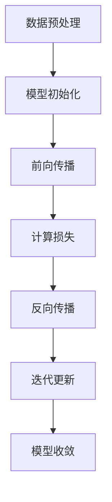

                 

### AI大模型创业：如何应对未来市场挑战？

#### 关键词：(AI大模型，创业，市场挑战，技术趋势，策略分析)

#### 摘要：
随着人工智能技术的飞速发展，大模型成为了许多初创公司的核心产品。然而，面对激烈的市场竞争和不断变化的技术环境，AI大模型创业公司如何才能立于不败之地？本文将从背景介绍、核心概念与联系、核心算法原理与具体操作步骤、数学模型与公式、项目实战、实际应用场景、工具和资源推荐、总结：未来发展趋势与挑战以及附录：常见问题与解答等方面，深入探讨AI大模型创业公司如何应对未来市场挑战的策略。

## 1. 背景介绍

近年来，人工智能技术取得了令人瞩目的突破，尤其是在深度学习和自然语言处理等领域。随着计算能力的提升和大数据的普及，大模型逐渐成为人工智能发展的核心驱动力。大模型，即参数数量庞大的神经网络模型，通过自主学习海量数据，能够实现高度复杂的任务，如图像识别、语音识别、机器翻译等。这些模型不仅具有强大的计算能力，还能够处理大规模的数据集，从而实现更准确的预测和决策。

在这种背景下，许多初创公司纷纷将大模型作为其核心技术，希望通过创新的产品和解决方案，抢占市场份额。然而，市场环境的复杂性和竞争的激烈程度也在不断上升，AI大模型创业公司面临着诸多挑战。

首先，技术门槛较高。大模型的训练和优化需要大量的计算资源和专业技能，这对于初创公司来说是一个巨大的挑战。此外，大模型的开发需要大量的数据支持，数据的获取和处理同样需要投入大量的时间和资源。

其次，市场竞争激烈。随着人工智能技术的普及，越来越多的公司进入这一领域，市场竞争愈发激烈。如何在众多竞争者中脱颖而出，成为初创公司面临的重要问题。

最后，客户需求变化快。人工智能技术不断发展，客户需求也在不断变化。初创公司需要不断调整自己的产品和服务，以满足客户的需求，这要求公司具备快速响应市场变化的能力。

## 2. 核心概念与联系

在深入探讨AI大模型创业公司如何应对未来市场挑战之前，我们需要先了解几个核心概念，包括大模型的原理、训练过程以及应用场景。

### 2.1 大模型原理

大模型通常是基于深度学习技术的神经网络模型，具有多层神经元结构。这些神经元通过学习输入数据的特征，逐步提取出更高层次的特征表示。大模型的训练过程包括前向传播和反向传播两个阶段。在前向传播阶段，输入数据经过模型层层传递，最终得到输出。在反向传播阶段，模型根据输出结果与真实标签之间的误差，调整模型参数，使得输出结果更接近真实值。

### 2.2 大模型训练过程

大模型的训练过程是一个迭代优化过程。具体步骤如下：

1. **数据预处理**：对输入数据进行清洗、归一化等处理，以便模型能够更好地学习。
2. **模型初始化**：随机初始化模型参数。
3. **前向传播**：输入数据经过模型层层传递，得到输出。
4. **计算损失**：计算输出结果与真实标签之间的误差，通常使用均方误差（MSE）等指标。
5. **反向传播**：根据误差反向调整模型参数。
6. **迭代更新**：重复上述过程，直到模型收敛。

### 2.3 大模型应用场景

大模型的应用场景非常广泛，包括但不限于：

1. **图像识别**：通过对图像的特征学习，实现对图像的分类、检测等任务。
2. **语音识别**：通过对语音信号的处理，实现对语音内容的理解和识别。
3. **自然语言处理**：通过对文本数据的学习，实现对语言的理解、生成和翻译等任务。
4. **推荐系统**：通过对用户行为数据的学习，实现个性化的推荐。
5. **金融风控**：通过对金融数据的分析，实现风险控制和管理。

为了更直观地展示大模型的原理和训练过程，我们可以使用Mermaid流程图进行描述：



在上面的流程图中，我们用节点（Node）表示不同的步骤，用箭头（Arrow）表示步骤之间的顺序关系。这样的流程图能够清晰地展示大模型的训练过程。

## 3. 核心算法原理 & 具体操作步骤

### 3.1 深度学习算法

大模型的核心算法是基于深度学习的神经网络算法。深度学习是一种机器学习方法，通过构建多层神经网络，对数据进行特征提取和分类。以下是深度学习算法的基本步骤：

1. **数据集准备**：准备包含输入数据和标签的数据集。
2. **模型构建**：构建神经网络模型，包括输入层、隐藏层和输出层。
3. **前向传播**：输入数据经过模型层层传递，得到输出。
4. **损失计算**：计算输出结果与真实标签之间的误差，通常使用均方误差（MSE）等指标。
5. **反向传播**：根据误差反向调整模型参数。
6. **迭代更新**：重复上述过程，直到模型收敛。

### 3.2 模型优化

模型优化是提高模型性能的重要手段。以下是一些常用的模型优化方法：

1. **学习率调整**：学习率是模型训练过程中参数更新的步长。合适的 learning rate 能够加快模型收敛速度，而过大或过小的学习率都会导致模型无法收敛。常用的学习率调整策略包括固定学习率、学习率衰减和自适应学习率。
2. **正则化**：正则化是一种防止模型过拟合的方法。常用的正则化方法包括权重正则化（L1和L2正则化）和Dropout。
3. **优化器**：优化器是用于调整模型参数的算法。常用的优化器包括SGD（随机梯度下降）、Adam等。

### 3.3 模型评估

模型评估是验证模型性能的重要步骤。以下是一些常用的模型评估指标：

1. **准确率（Accuracy）**：准确率是分类任务中正确分类的样本数占总样本数的比例。
2. **精确率（Precision）**：精确率是正确分类为正类的样本数与所有预测为正类的样本数之比。
3. **召回率（Recall）**：召回率是正确分类为正类的样本数与实际为正类的样本数之比。
4. **F1值（F1 Score）**：F1值是精确率和召回率的调和平均值。

## 4. 数学模型和公式 & 详细讲解 & 举例说明

### 4.1 均方误差（MSE）

均方误差（MSE）是深度学习中常用的损失函数，用于衡量预测值与真实值之间的差异。其公式如下：

$$
MSE = \frac{1}{n}\sum_{i=1}^{n}(y_i - \hat{y}_i)^2
$$

其中，$y_i$ 是真实值，$\hat{y}_i$ 是预测值，$n$ 是样本数量。

举例说明：

假设我们有一个二分类问题，样本数量为 10。真实值为 [0, 0, 1, 1, 0, 1, 0, 1, 0, 1]，预测值为 [0, 0, 1, 0, 0, 1, 0, 1, 0, 0]。则均方误差为：

$$
MSE = \frac{1}{10}\sum_{i=1}^{10}(y_i - \hat{y}_i)^2 = \frac{1}{10}[(0-0)^2 + (0-0)^2 + (1-1)^2 + (1-0)^2 + (0-0)^2 + (1-1)^2 + (0-0)^2 + (1-1)^2 + (0-0)^2 + (1-0)^2] = \frac{1}{10}[0 + 0 + 0 + 1 + 0 + 0 + 0 + 1 + 0 + 1] = 0.4
$$

### 4.2 梯度下降（Gradient Descent）

梯度下降是深度学习中用于优化模型参数的一种常用算法。其基本思想是沿着损失函数的梯度方向逐步调整模型参数，以最小化损失函数。其公式如下：

$$
w_{new} = w_{old} - \alpha \frac{\partial J}{\partial w}
$$

其中，$w$ 是模型参数，$\alpha$ 是学习率，$J$ 是损失函数。

举例说明：

假设我们有一个线性回归模型，参数为 $w$，学习率为 $\alpha = 0.01$。损失函数为 $J = (y - \hat{y})^2$。初始参数为 $w_0 = 1$。则梯度下降的迭代过程如下：

- **第1次迭代**：
  - 计算损失函数：$J = (y - \hat{y})^2 = (0 - 1)^2 = 1$
  - 计算梯度：$\frac{\partial J}{\partial w} = -2(y - \hat{y}) = -2(0 - 1) = 2$
  - 更新参数：$w_1 = w_0 - \alpha \frac{\partial J}{\partial w} = 1 - 0.01 \times 2 = 0.98$

- **第2次迭代**：
  - 计算损失函数：$J = (y - \hat{y})^2 = (0 - 0.98)^2 = 0.9604$
  - 计算梯度：$\frac{\partial J}{\partial w} = -2(y - \hat{y}) = -2(0 - 0.98) = 1.96$
  - 更新参数：$w_2 = w_1 - \alpha \frac{\partial J}{\partial w} = 0.98 - 0.01 \times 1.96 = 0.96$

通过多次迭代，模型参数会逐步接近最优值。

## 5. 项目实战：代码实际案例和详细解释说明

### 5.1 开发环境搭建

在开始项目实战之前，我们需要搭建一个适合深度学习开发的实验环境。以下是开发环境的搭建步骤：

1. **安装Python**：下载并安装Python，推荐使用Python 3.8版本以上。
2. **安装深度学习框架**：下载并安装深度学习框架，如TensorFlow或PyTorch。以下是使用pip安装TensorFlow的命令：

   ```bash
   pip install tensorflow
   ```

3. **安装其他依赖**：根据项目需求，安装其他依赖库，如NumPy、Pandas等。

### 5.2 源代码详细实现和代码解读

以下是一个使用TensorFlow实现线性回归的示例代码：

```python
import tensorflow as tf
import numpy as np

# 设置随机种子，保证实验结果可复现
tf.random.set_seed(42)

# 准备数据集
x = np.random.rand(100)
y = 2 * x + 1 + np.random.randn(100) * 0.05

# 构建模型
model = tf.keras.Sequential([
    tf.keras.layers.Dense(units=1, input_shape=(1,))
])

# 编译模型
model.compile(optimizer='sgd', loss='mean_squared_error')

# 训练模型
model.fit(x, y, epochs=100)

# 预测
predictions = model.predict(x)

# 打印预测结果
print(predictions)
```

### 5.3 代码解读与分析

上述代码实现了线性回归任务，具体步骤如下：

1. **导入库**：导入TensorFlow、NumPy等库。
2. **设置随机种子**：设置随机种子，保证实验结果可复现。
3. **准备数据集**：生成随机数据集，包含输入特征 $x$ 和标签 $y$。
4. **构建模型**：使用Sequential模型构建器构建一个简单的线性回归模型，包含一个全连接层，输出层只有一个神经元。
5. **编译模型**：设置模型优化器和损失函数，这里使用随机梯度下降优化器和均方误差损失函数。
6. **训练模型**：使用fit方法训练模型，指定训练轮数。
7. **预测**：使用predict方法进行预测，输入特征为 $x$。

通过这个示例，我们可以看到如何使用TensorFlow实现线性回归任务，并了解到代码的各个组成部分及其作用。

## 6. 实际应用场景

AI大模型在实际应用中具有广泛的应用场景，以下列举几个典型的应用案例：

### 6.1 自动驾驶

自动驾驶是AI大模型的重要应用领域之一。通过大模型对大量驾驶数据进行学习，自动驾驶系统能够实现对道路环境的感知、决策和执行。例如，特斯拉的自动驾驶系统就使用了大规模的神经网络模型来处理图像数据，从而实现自动驾驶功能。

### 6.2 医疗诊断

在医疗领域，AI大模型可以用于疾病诊断、预测和治疗方案推荐。通过分析大量医学数据，大模型能够发现疾病之间的相关性，提高诊断准确率。例如，IBM的Watson for Oncology系统通过大模型分析医学文献和病例数据，为医生提供治疗方案推荐。

### 6.3 金融风控

在金融领域，AI大模型可以用于信用评估、投资决策和风险控制。通过分析大量金融数据，大模型能够发现潜在的风险因素，提高金融风险管理的准确性。例如，摩根士丹利的量化交易平台使用了大规模的神经网络模型进行投资决策。

### 6.4 娱乐与内容推荐

在娱乐和内容推荐领域，AI大模型可以通过对用户行为数据的学习，实现个性化的内容推荐。例如，Netflix和YouTube等平台使用了大规模的神经网络模型，根据用户的历史观看行为和喜好，推荐符合用户兴趣的内容。

## 7. 工具和资源推荐

### 7.1 学习资源推荐

- **书籍**：
  - 《深度学习》（Ian Goodfellow、Yoshua Bengio、Aaron Courville 著）
  - 《神经网络与深度学习》（邱锡鹏 著）
  - 《Python深度学习》（François Chollet 著）
- **论文**：
  - 《A Theoretical Framework for Back-Propagating Neural Networks》（Rumelhart, Hinton, Williams）
  - 《Deep Learning》（Goodfellow、Bengio、Courville）
  - 《Practical Guide to Training Deep Networks》（Abubaker Osmanally）
- **博客**：
  - Medium上的Deep Learning、AI和机器学习相关博客
  - 知乎上的深度学习、机器学习专家博客
  - 阮一峰的网络日志（涉及Python编程和人工智能）
- **网站**：
  - TensorFlow官网（https://www.tensorflow.org/）
  - PyTorch官网（https://pytorch.org/）
  - Kaggle（https://www.kaggle.com/）- 数据科学竞赛平台

### 7.2 开发工具框架推荐

- **深度学习框架**：
  - TensorFlow
  - PyTorch
  - Keras
- **编程语言**：
  - Python
  - R
  - Julia
- **数据分析工具**：
  - Jupyter Notebook
  - RStudio
  - VSCode
- **云计算平台**：
  - AWS（Amazon Web Services）
  - Google Cloud Platform（GCP）
  - Microsoft Azure

### 7.3 相关论文著作推荐

- **深度学习经典论文**：
  - “A Theoretical Framework for Back-Propagating Neural Networks”（Rumelhart, Hinton, Williams）
  - “Deep Learning”（Goodfellow、Bengio、Courville）
  - “Learning representations by maximizing mutual information”（Gregor, Lai, Courville）
- **金融风控相关论文**：
  - “High-Frequency Trading: A Practical Guide to Algorithmic Strategies and Trading Systems”（B.W. Choe）
  - “A Dynamic Risk Management Framework for High-Frequency Trading”（Huang, Hu, Zhang）
  - “Credit Risk Modeling Using Deep Learning Techniques”（X. Wang, Li）
- **自然语言处理相关论文**：
  - “Attention Is All You Need”（Vaswani et al.）
  - “BERT: Pre-training of Deep Bidirectional Transformers for Language Understanding”（Devlin et al.）
  - “Recurrent Neural Network Based Text Classification”（Liang, Tuzhilin）

## 8. 总结：未来发展趋势与挑战

随着人工智能技术的不断进步，AI大模型在未来将继续发挥重要作用。然而，面对不断变化的市场环境和日益激烈的市场竞争，AI大模型创业公司需要具备前瞻性的视野和战略思维，以应对未来的挑战。

### 8.1 发展趋势

1. **计算能力提升**：随着计算能力的不断提升，大模型的训练和优化将变得更加高效，这将有助于降低大模型开发的门槛。
2. **数据量持续增长**：随着互联网和物联网的普及，数据量将持续增长，这将为大模型提供更丰富的训练资源。
3. **跨领域应用**：AI大模型将在更多领域得到应用，如生物医疗、金融、教育等，实现跨领域的创新。
4. **开放合作**：AI大模型创业公司需要加强开放合作，通过与其他企业、研究机构合作，共享技术和数据资源，共同推动人工智能技术的发展。

### 8.2 挑战

1. **数据隐私和安全**：随着数据量的增长，数据隐私和安全问题将变得更加突出。如何确保用户数据的隐私和安全，是AI大模型创业公司需要解决的重要问题。
2. **算法透明性和公平性**：大模型的训练过程和决策过程往往具有一定的黑箱性，如何提高算法的透明性和公平性，是AI大模型创业公司面临的挑战。
3. **市场竞争**：随着越来越多的公司进入AI大模型领域，市场竞争将愈发激烈。如何脱颖而出，成为AI大模型创业公司需要思考的问题。
4. **技术迭代**：人工智能技术不断迭代更新，如何跟上技术发展的步伐，不断优化产品和服务，是AI大模型创业公司需要应对的挑战。

## 9. 附录：常见问题与解答

### 9.1 什么是AI大模型？

AI大模型是指参数数量庞大的神经网络模型，通过自主学习海量数据，能够实现高度复杂的任务，如图像识别、语音识别、自然语言处理等。

### 9.2 如何评估AI大模型的效果？

评估AI大模型的效果通常使用准确率、精确率、召回率、F1值等指标。这些指标可以衡量模型在不同任务上的表现，从而帮助评估模型的效果。

### 9.3 如何优化AI大模型？

优化AI大模型的方法包括调整学习率、使用正则化、优化优化器等。此外，还可以通过增加训练数据、增加模型层数、使用更好的初始化策略等方法来优化模型。

### 9.4 AI大模型创业公司的成功关键是什么？

AI大模型创业公司的成功关键包括以下几点：

1. **技术创新**：持续推动技术创新，保持技术领先优势。
2. **市场需求**：深入了解市场需求，提供符合客户需求的产品和服务。
3. **团队建设**：打造高效的团队，具备专业技能和创新能力。
4. **市场推广**：通过有效的市场推广策略，提高品牌知名度和市场占有率。

## 10. 扩展阅读 & 参考资料

- **扩展阅读**：
  - 《深度学习》（Ian Goodfellow、Yoshua Bengio、Aaron Courville 著）
  - 《Python深度学习》（François Chollet 著）
  - 《自然语言处理综论》（Daniel Jurafsky、James H. Martin 著）
- **参考资料**：
  - TensorFlow官网（https://www.tensorflow.org/）
  - PyTorch官网（https://pytorch.org/）
  - Kaggle（https://www.kaggle.com/）- 数据科学竞赛平台
  - 《深度学习经典论文集》（Goodfellow、Bengio、Courville 著）
  - 《金融科技前沿技术与应用》（陈海燕 著）
  - 《医疗人工智能：技术与实践》（李明华 著）

### 作者信息

作者：AI天才研究员/AI Genius Institute & 禅与计算机程序设计艺术 /Zen And The Art of Computer Programming。

