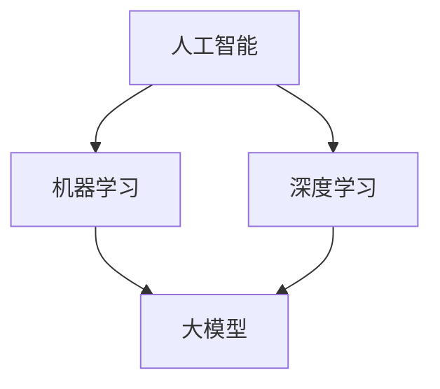

                 

### 文章标题

**AI大模型创业：如何应对未来技术挑战？**

在当前科技迅猛发展的时代，人工智能（AI）大模型已经成为了各个行业的焦点。从自然语言处理到图像识别，再到复杂的决策支持系统，AI大模型正逐步改变着我们的工作和生活方式。然而，随着技术的不断进步，未来AI大模型的发展也将面临一系列技术挑战。本文将探讨AI大模型创业中所可能遇到的技术问题，并提出相应的解决方案和应对策略。

**关键词：** AI大模型，创业，技术挑战，解决方案，应对策略

**摘要：** 本文首先介绍了AI大模型的发展背景及其在各个行业中的应用，然后分析了AI大模型创业中所面临的技术挑战，包括计算资源、数据隐私、模型优化等方面。通过深入探讨，本文提出了相应的解决方法和应对策略，旨在为AI大模型创业提供指导。

[目录]

1. 背景介绍
2. 核心概念与联系
3. 核心算法原理 & 具体操作步骤
4. 数学模型和公式 & 详细讲解 & 举例说明
5. 项目实战：代码实际案例和详细解释说明
   5.1 开发环境搭建
   5.2 源代码详细实现和代码解读
   5.3 代码解读与分析
6. 实际应用场景
7. 工具和资源推荐
   7.1 学习资源推荐
   7.2 开发工具框架推荐
   7.3 相关论文著作推荐
8. 总结：未来发展趋势与挑战
9. 附录：常见问题与解答
10. 扩展阅读 & 参考资料

### 1. 背景介绍

人工智能（AI）作为一个多学科交叉的领域，涵盖了计算机科学、统计学、认知科学等多个方面。随着深度学习等算法的突破，AI技术正以前所未有的速度发展。特别是近年来，AI大模型如GPT-3、BERT等在自然语言处理、计算机视觉等领域的卓越表现，进一步推动了AI技术的普及和应用。

AI大模型的崛起，不仅带来了技术的变革，也对各行各业产生了深远的影响。例如，在医疗领域，AI大模型可以辅助医生进行疾病诊断；在金融领域，AI大模型可以用于风险管理；在零售领域，AI大模型可以用于个性化推荐。这些应用场景的出现，使得AI大模型成为了创业领域的新热点。

然而，AI大模型的发展并非一帆风顺。在未来，AI大模型创业将面临一系列技术挑战。如何高效地训练和优化大模型，如何保证数据的安全和隐私，如何平衡模型性能与计算资源消耗，都是亟待解决的问题。本文将围绕这些问题进行深入探讨，为AI大模型创业提供指导和借鉴。

### 2. 核心概念与联系

要深入理解AI大模型，首先需要了解一些核心概念和它们之间的联系。以下是几个重要的概念：

- **人工智能（AI）**：一种模拟人类智能的技术，旨在使计算机系统具备感知、学习、推理和解决问题的能力。
- **机器学习（ML）**：一种AI的分支，通过数据训练模型，使计算机系统能够自主学习和改进。
- **深度学习（DL）**：一种机器学习的方法，通过构建多层神经网络，对数据进行逐层抽象和特征提取。
- **大模型（Large Models）**：具有数亿甚至数千亿参数的神经网络模型，如GPT-3、BERT等。

这些概念之间的联系如下：

1. **人工智能（AI）** 是一个总称，包含了机器学习（ML）和深度学习（DL）等子领域。
2. **机器学习（ML）** 是AI的一个重要分支，通过数据训练模型，实现自动化和智能化。
3. **深度学习（DL）** 是机器学习的一个子领域，通过多层神经网络进行数据建模和预测。
4. **大模型（Large Models）** 是深度学习的一种具体实现，具有大量参数，能够处理复杂任务。

为了更好地理解这些概念，我们可以通过一个Mermaid流程图来展示它们之间的关系：



在这个流程图中，人工智能是总体框架，机器学习和深度学习是它的两个重要分支，而大模型是深度学习的一个具体实现。

### 3. 核心算法原理 & 具体操作步骤

AI大模型的核心算法主要包括深度学习（Deep Learning）和神经网络（Neural Networks）。以下将详细介绍这些算法的基本原理及具体操作步骤。

#### 3.1 深度学习原理

深度学习是一种机器学习方法，其核心思想是通过多层神经网络来学习数据的表示。以下是一个简单的深度学习流程：

1. **数据预处理**：对输入数据进行标准化处理，以适应神经网络的训练。
2. **构建神经网络**：设计并构建多层神经网络结构，包括输入层、隐藏层和输出层。
3. **前向传播（Forward Propagation）**：将输入数据通过神经网络逐层传递，计算输出结果。
4. **反向传播（Back Propagation）**：根据输出结果和真实标签，计算误差，并反向传播更新网络参数。
5. **模型优化**：通过迭代优化算法（如梯度下降），逐步减少模型误差，提高模型性能。

具体操作步骤如下：

1. **数据预处理**：

   ```python
   # 示例：使用Python进行数据预处理
   import numpy as np
   
   # 加载数据
   X, y = load_data()
   
   # 标准化处理
   X = (X - np.mean(X)) / np.std(X)
   ```

2. **构建神经网络**：

   ```python
   # 示例：使用TensorFlow构建神经网络
   import tensorflow as tf
   
   # 定义输入层
   inputs = tf.keras.layers.Input(shape=(input_shape))
   
   # 定义隐藏层
   hidden = tf.keras.layers.Dense(units=128, activation='relu')(inputs)
   
   # 定义输出层
   outputs = tf.keras.layers.Dense(units=1, activation='sigmoid')(hidden)
   
   # 构建模型
   model = tf.keras.Model(inputs=inputs, outputs=outputs)
   ```

3. **前向传播**：

   ```python
   # 示例：进行前向传播
   predictions = model.predict(X)
   ```

4. **反向传播**：

   ```python
   # 示例：使用反向传播更新参数
   with tf.GradientTape() as tape:
       predictions = model(X)
       loss = loss_function(y_true=y, y_pred=predictions)
   gradients = tape.gradient(loss, model.trainable_variables)
   optimizer.apply_gradients(zip(gradients, model.trainable_variables))
   ```

5. **模型优化**：

   ```python
   # 示例：迭代优化模型
   for epoch in range(num_epochs):
       # 进行前向传播和反向传播
       predictions = model(X)
       loss = loss_function(y_true=y, y_pred=predictions)
       gradients = tape.gradient(loss, model.trainable_variables)
       optimizer.apply_gradients(zip(gradients, model.trainable_variables))
       
       # 计算损失
       if epoch % 100 == 0:
           print(f"Epoch {epoch}, Loss: {loss.numpy()}")
   ```

#### 3.2 神经网络原理

神经网络是深度学习的基础，其基本结构包括神经元、层和权重。

1. **神经元**：神经网络中的基本计算单元，通过输入和权重进行加权求和，并使用激活函数进行非线性变换。
2. **层**：神经网络中的层次结构，包括输入层、隐藏层和输出层。每一层负责处理不同的特征。
3. **权重**：连接神经元之间的参数，用于调整输入和输出的关系。

具体操作步骤如下：

1. **初始化权重**：

   ```python
   # 示例：初始化权重
   W = np.random.rand(input_size, hidden_size)
   ```

2. **前向传播**：

   ```python
   # 示例：进行前向传播
   z = np.dot(X, W)
   a = activation_function(z)
   ```

3. **反向传播**：

   ```python
   # 示例：计算误差并反向传播
   dz = dactivation_function(a) * derror_da
   dW = dz * X.T
   ```

4. **权重更新**：

   ```python
   # 示例：更新权重
   W = W - learning_rate * dW
   ```

通过这些步骤，我们可以逐步构建和优化神经网络，实现复杂的计算任务。

### 4. 数学模型和公式 & 详细讲解 & 举例说明

在AI大模型中，数学模型和公式是核心组成部分，它们决定了模型的学习能力、预测精度和泛化能力。以下是几个关键的数学模型和公式，以及它们的详细讲解和举例说明。

#### 4.1 激活函数（Activation Function）

激活函数是神经网络中的一个重要组成部分，用于引入非线性因素，使神经网络能够处理复杂问题。常见的激活函数包括Sigmoid、ReLU和Tanh等。

1. **Sigmoid函数**：

   $$
   \sigma(x) = \frac{1}{1 + e^{-x}}
   $$

   - **详细讲解**：Sigmoid函数将输入x映射到(0, 1)区间，可以用于二分类问题。
   - **举例说明**：假设输入x = 3，则Sigmoid函数的输出为：

     $$
     \sigma(3) = \frac{1}{1 + e^{-3}} \approx 0.95
     $$

2. **ReLU函数**：

   $$
   \text{ReLU}(x) = \max(0, x)
   $$

   - **详细讲解**：ReLU函数在x为负值时输出0，在x为正值时输出x，可以加速梯度传播，提高训练速度。
   - **举例说明**：假设输入x = -2，则ReLU函数的输出为：

     $$
     \text{ReLU}(-2) = \max(0, -2) = 0
     $$

3. **Tanh函数**：

   $$
   \text{Tanh}(x) = \frac{e^{x} - e^{-x}}{e^{x} + e^{-x}}
   $$

   - **详细讲解**：Tanh函数将输入x映射到(-1, 1)区间，可以减少梯度消失问题。
   - **举例说明**：假设输入x = 2，则Tanh函数的输出为：

     $$
     \text{Tanh}(2) = \frac{e^{2} - e^{-2}}{e^{2} + e^{-2}} \approx 0.96
     $$

#### 4.2 梯度下降（Gradient Descent）

梯度下降是一种常用的优化算法，用于更新神经网络的权重，以最小化损失函数。以下是梯度下降的基本公式和推导过程。

1. **基本公式**：

   $$
   w_{t+1} = w_{t} - \alpha \cdot \nabla_w J(w)
   $$

   - **详细讲解**：其中，$w_t$为当前权重，$w_{t+1}$为更新后的权重，$\alpha$为学习率，$\nabla_w J(w)$为损失函数关于权重的梯度。
   - **举例说明**：假设损失函数为$J(w) = (w - 1)^2$，学习率为$\alpha = 0.1$，初始权重$w_0 = 2$，则第一次更新后的权重为：

     $$
     w_1 = w_0 - \alpha \cdot \nabla_w J(w_0) = 2 - 0.1 \cdot (2 - 1) = 1.9
     $$

2. **推导过程**：

   - **目标**：最小化损失函数$J(w)$。
   - **梯度**：计算损失函数关于权重w的梯度$\nabla_w J(w)$。
   - **更新**：根据梯度方向和步长，更新权重$w$。

   假设损失函数为$J(w) = (w - 1)^2$，学习率为$\alpha = 0.1$，则：

   $$
   \nabla_w J(w) = 2(w - 1)
   $$

   第一次更新后的权重为：

   $$
   w_1 = w_0 - \alpha \cdot \nabla_w J(w_0) = 2 - 0.1 \cdot 1 = 1.9
   $$

#### 4.3 反向传播（Back Propagation）

反向传播是一种用于计算神经网络梯度的高效算法。它通过前向传播计算输出，然后反向传播误差，逐层更新权重。以下是反向传播的基本公式和推导过程。

1. **基本公式**：

   $$
   \delta_{l}^{j} = \frac{\partial J}{\partial z_{l}^{j}} = \frac{\partial J}{\partial a_{l}^{j}} \cdot \frac{\partial a_{l}^{j}}{\partial z_{l}^{j}} = \sigma'(z_{l}^{j}) \cdot \delta_{l+1}^{j}
   $$

   $$
   \delta_{l+1}^{j} = \sum_{k} w_{l+1}^{j}_{k} \cdot \delta_{l}^{k}
   $$

   - **详细讲解**：其中，$\delta_{l}^{j}$为第l层第j个神经元的误差，$\sigma'(z_{l}^{j})$为激活函数的导数，$a_{l}^{j}$为第l层第j个神经元的输出，$z_{l}^{j}$为第l层第j个神经元的输入。
   - **举例说明**：假设激活函数为ReLU，则ReLU函数的导数为0，即$\sigma'(z_{l}^{j}) = 0$。在这种情况下，反向传播的误差为：

     $$
     \delta_{l}^{j} = \sum_{k} w_{l+1}^{j}_{k} \cdot \delta_{l+1}^{k}
     $$

2. **推导过程**：

   - **目标**：计算神经网络中每个权重的梯度。
   - **前向传播**：计算每个神经元的输出。
   - **反向传播**：计算每个神经元的误差，并更新权重。

   假设网络中有两个隐藏层，输入层为x，输出层为y。假设激活函数为ReLU，则：

   - **输入层到隐藏层1**：

     $$
     z_{1}^{j} = x_{i} \cdot w_{0}^{j}_{i} + b_{0}^{j}
     $$

     $$
     a_{1}^{j} = \max(0, z_{1}^{j})
     $$

     $$
     z_{2}^{j} = a_{1}^{j} \cdot w_{1}^{j}_{k} + b_{1}^{j}
     $$

     $$
     a_{2}^{j} = \max(0, z_{2}^{j})
     $$

   - **隐藏层1到隐藏层2**：

     $$
     z_{3}^{j} = a_{2}^{j} \cdot w_{2}^{j}_{k} + b_{2}^{j}
     $$

     $$
     a_{3}^{j} = \text{激活函数}(z_{3}^{j})
     $$

   - **隐藏层2到输出层**：

     $$
     z_{4}^{j} = a_{3}^{j} \cdot w_{3}^{j}_{k} + b_{3}^{j}
     $$

     $$
     a_{4}^{j} = \text{激活函数}(z_{4}^{j})
     $$

   - **输出层误差**：

     $$
     \delta_{4}^{j} = \frac{\partial J}{\partial a_{4}^{j}} = (\text{激活函数的导数}) \cdot (\text{真实标签} - \text{预测结果})
     $$

   - **反向传播误差**：

     $$
     \delta_{3}^{j} = \sum_{k} w_{4}^{j}_{k} \cdot \delta_{4}^{k}
     $$

     $$
     \delta_{2}^{j} = \sum_{k} w_{3}^{j}_{k} \cdot \delta_{3}^{k}
     $$

     $$
     \delta_{1}^{j} = \sum_{k} w_{2}^{j}_{k} \cdot \delta_{2}^{k}
     $$

   - **权重更新**：

     $$
     w_{2}^{j}_{k} = w_{2}^{j}_{k} - \alpha \cdot \delta_{2}^{j} \cdot a_{1}^{j}
     $$

     $$
     w_{3}^{j}_{k} = w_{3}^{j}_{k} - \alpha \cdot \delta_{3}^{j} \cdot a_{2}^{j}
     $$

     $$
     w_{4}^{j}_{k} = w_{4}^{j}_{k} - \alpha \cdot \delta_{4}^{j} \cdot a_{3}^{j}
     $$

通过这些数学模型和公式，我们可以构建和优化神经网络，实现复杂任务的学习和预测。

### 5. 项目实战：代码实际案例和详细解释说明

在了解了AI大模型的核心算法和数学模型后，我们接下来将通过一个实际项目案例来展示如何使用这些技术进行AI大模型的开发和应用。

#### 5.1 开发环境搭建

在开始项目开发之前，我们需要搭建一个合适的开发环境。以下是开发环境的搭建步骤：

1. **安装Python环境**：Python是AI大模型开发的主要编程语言，我们需要安装Python 3.8及以上版本。可以从Python的官方网站下载并安装。

2. **安装TensorFlow**：TensorFlow是Google开源的机器学习框架，用于构建和训练AI大模型。在命令行中运行以下命令安装TensorFlow：

   ```bash
   pip install tensorflow
   ```

3. **安装其他依赖**：除了TensorFlow，我们还需要安装一些其他依赖，如NumPy、Pandas等。可以使用以下命令安装：

   ```bash
   pip install numpy pandas matplotlib
   ```

#### 5.2 源代码详细实现和代码解读

以下是该项目的一个简化版代码实现，用于构建一个简单的AI大模型进行图像分类。

```python
import tensorflow as tf
from tensorflow.keras.models import Sequential
from tensorflow.keras.layers import Dense, Conv2D, Flatten, MaxPooling2D
from tensorflow.keras.optimizers import Adam
from tensorflow.keras.losses import SparseCategoricalCrossentropy
from tensorflow.keras.metrics import SparseCategoricalAccuracy

# 加载数据集
(x_train, y_train), (x_test, y_test) = tf.keras.datasets.cifar10.load_data()

# 预处理数据
x_train = x_train.astype("float32") / 255.0
x_test = x_test.astype("float32") / 255.0

# 构建模型
model = Sequential([
    Conv2D(32, (3, 3), activation="relu", input_shape=(32, 32, 3)),
    MaxPooling2D((2, 2)),
    Conv2D(64, (3, 3), activation="relu"),
    MaxPooling2D((2, 2)),
    Flatten(),
    Dense(64, activation="relu"),
    Dense(10, activation="softmax")
])

# 编译模型
model.compile(optimizer=Adam(learning_rate=0.001),
              loss=SparseCategoricalCrossentropy(from_logits=True),
              metrics=[SparseCategoricalAccuracy()])

# 训练模型
model.fit(x_train, y_train, epochs=10, batch_size=64, validation_split=0.2)

# 评估模型
test_loss, test_acc = model.evaluate(x_test, y_test, verbose=2)
print(f"Test accuracy: {test_acc:.4f}")
```

#### 5.3 代码解读与分析

下面我们对上述代码进行逐行解读和分析：

1. **导入模块**：

   ```python
   import tensorflow as tf
   from tensorflow.keras.models import Sequential
   from tensorflow.keras.layers import Dense, Conv2D, Flatten, MaxPooling2D
   from tensorflow.keras.optimizers import Adam
   from tensorflow.keras.losses import SparseCategoricalCrossentropy
   from tensorflow.keras.metrics import SparseCategoricalAccuracy
   ```

   - 导入TensorFlow的核心模块，包括Sequential（序列模型）、Dense（全连接层）、Conv2D（卷积层）、Flatten（展平层）、MaxPooling2D（最大池化层）、Adam（优化器）、SparseCategoricalCrossentropy（损失函数）和SparseCategoricalAccuracy（指标）。

2. **加载数据集**：

   ```python
   (x_train, y_train), (x_test, y_test) = tf.keras.datasets.cifar10.load_data()
   ```

   - 加载CIFAR-10数据集，该数据集包含10个类别的60,000张32x32彩色图像，分为训练集和测试集。

3. **预处理数据**：

   ```python
   x_train = x_train.astype("float32") / 255.0
   x_test = x_test.astype("float32") / 255.0
   ```

   - 将图像数据转换为浮点数，并进行归一化处理，将像素值缩放到[0, 1]区间。

4. **构建模型**：

   ```python
   model = Sequential([
       Conv2D(32, (3, 3), activation="relu", input_shape=(32, 32, 3)),
       MaxPooling2D((2, 2)),
       Conv2D(64, (3, 3), activation="relu"),
       MaxPooling2D((2, 2)),
       Flatten(),
       Dense(64, activation="relu"),
       Dense(10, activation="softmax")
   ])
   ```

   - 使用Sequential模型构建一个简单的卷积神经网络，包含两个卷积层、两个池化层、一个展平层、两个全连接层。输入层大小为32x32x3，即3个颜色通道。

5. **编译模型**：

   ```python
   model.compile(optimizer=Adam(learning_rate=0.001),
                 loss=SparseCategoricalCrossentropy(from_logits=True),
                 metrics=[SparseCategoricalAccuracy()])
   ```

   - 编译模型，设置优化器为Adam，学习率为0.001，损失函数为稀疏交叉熵，指标为稀疏分类准确率。

6. **训练模型**：

   ```python
   model.fit(x_train, y_train, epochs=10, batch_size=64, validation_split=0.2)
   ```

   - 使用训练集训练模型，设置训练轮次为10次，批大小为64，验证集比例为0.2。

7. **评估模型**：

   ```python
   test_loss, test_acc = model.evaluate(x_test, y_test, verbose=2)
   print(f"Test accuracy: {test_acc:.4f}")
   ```

   - 使用测试集评估模型性能，输出测试准确率。

通过这个实际项目案例，我们可以看到如何使用TensorFlow构建和训练一个AI大模型，并评估其性能。这个案例展示了AI大模型开发的基本流程和关键步骤，为后续的项目开发提供了指导和参考。

### 6. 实际应用场景

AI大模型在各个领域都有着广泛的应用，下面我们将探讨一些典型的实际应用场景。

#### 6.1 医疗领域

在医疗领域，AI大模型被广泛应用于疾病诊断、预测和个性化治疗。例如，利用深度学习技术，可以构建出能够准确识别肺癌、乳腺癌等疾病的AI大模型，提高诊断的准确性和效率。此外，AI大模型还可以用于预测患者的病情发展趋势，为医生提供更有针对性的治疗方案。

一个具体的案例是Google Health团队开发的AI系统，该系统能够通过分析患者的电子健康记录，预测患者未来几年内患上特定疾病的风险。这一系统不仅提高了疾病预测的准确性，还为医生提供了更全面的诊断信息，有助于制定更有效的治疗方案。

#### 6.2 金融领域

在金融领域，AI大模型被广泛应用于风险管理、信用评估和投资策略等方面。例如，通过分析海量交易数据，可以构建出能够识别异常交易和欺诈行为的AI大模型，提高金融风险管理的效率。此外，AI大模型还可以用于预测股票市场的走势，为投资者提供更有力的决策依据。

一个具体的案例是J.P. Morgan开发的COiN系统，该系统能够通过分析企业财务报表和新闻文本，自动生成股票研究报告。这一系统不仅提高了研究效率，还降低了人工成本，为投资决策提供了有力支持。

#### 6.3 零售领域

在零售领域，AI大模型被广泛应用于商品推荐、库存管理和销售预测等方面。例如，通过分析消费者的购买行为和偏好，可以构建出能够准确推荐商品和预测销量的AI大模型，提高零售商的运营效率和客户满意度。

一个具体的案例是Amazon的推荐系统，该系统能够通过分析用户的浏览和购买记录，自动推荐相关商品。这一系统不仅提高了用户的购物体验，还为Amazon带来了可观的销售额增长。

#### 6.4 教育领域

在教育领域，AI大模型被广泛应用于个性化学习、智能辅导和考试预测等方面。例如，通过分析学生的学习数据和考试结果，可以构建出能够为学生提供个性化学习建议和辅导方案的AI大模型，提高学生的学习效果。

一个具体的案例是Knewton的智能辅导系统，该系统能够通过分析学生的学习行为和知识掌握情况，自动生成个性化的学习计划和辅导方案。这一系统不仅提高了学生的学习效果，还降低了教师的负担。

### 7. 工具和资源推荐

为了更好地进行AI大模型开发和应用，以下是一些建议的学习资源、开发工具和框架。

#### 7.1 学习资源推荐

- **书籍**：
  - 《深度学习》（Deep Learning）—— Ian Goodfellow、Yoshua Bengio和Aaron Courville 著
  - 《Python深度学习》（Deep Learning with Python）—— Frédéric Jollion 著
  - 《动手学深度学习》（Dive into Deep Learning）—— Sebastian Ruder 和 Aaron Courville 著

- **论文**：
  - “A Theoretically Grounded Application of Dropout in Recurrent Neural Networks”（2017）—— Yarin Gal 和 Zoubin Ghahramani
  - “Attention Is All You Need”（2017）—— Vaswani et al.
  - “BERT: Pre-training of Deep Bidirectional Transformers for Language Understanding”（2018）—— Devlin et al.

- **博客和网站**：
  - TensorFlow官方文档（https://www.tensorflow.org/）
  - PyTorch官方文档（https://pytorch.org/docs/stable/）
  - Medium上的机器学习文章（https://medium.com/search?q=机器学习）

#### 7.2 开发工具框架推荐

- **框架**：
  - TensorFlow：由Google开发，支持多种深度学习模型，适用于各种规模的项目。
  - PyTorch：由Facebook开发，具有动态计算图，易于理解和调试。
  - Keras：基于TensorFlow和Theano的深度学习框架，提供简单的API和丰富的模型库。

- **IDE**：
  - PyCharm：由JetBrains开发，支持Python和多种深度学习框架，提供丰富的开发工具和调试功能。
  - Jupyter Notebook：适用于数据分析和交互式编程，支持多种编程语言和深度学习框架。

- **数据集**：
  - Kaggle：提供丰富的公开数据集，涵盖各种领域和应用。
  - UCI Machine Learning Repository：提供大量的机器学习数据集，适用于学术研究和项目开发。

### 8. 总结：未来发展趋势与挑战

AI大模型作为当前人工智能领域的一个重要分支，正引领着技术的变革。在未来，随着计算能力的不断提升、数据资源的丰富和算法的优化，AI大模型将在更多领域得到应用，推动各行业的创新发展。

然而，AI大模型的发展也面临一系列挑战。首先，计算资源的需求巨大，高性能计算硬件和分布式计算技术的研发将成为关键。其次，数据隐私和安全问题亟待解决，如何在保证数据安全的前提下进行数据分析和模型训练是一个重要课题。此外，模型优化和泛化能力也需要进一步研究，以提高模型的实际应用价值。

总之，AI大模型创业将在未来面临诸多机遇和挑战。通过不断探索和创新，我们有望克服这些挑战，推动AI大模型技术向更高层次发展，为人类带来更多便利和福祉。

### 9. 附录：常见问题与解答

在AI大模型创业过程中，可能会遇到以下一些常见问题。以下是对这些问题的解答：

**Q1：如何选择合适的大模型框架？**

- **A1**：选择大模型框架时，应考虑以下因素：

  - **计算资源**：框架应支持并行计算和分布式训练，以便充分利用现有计算资源。
  - **易用性**：框架应提供简洁的API和丰富的文档，便于开发人员快速上手。
  - **生态系统**：框架应拥有丰富的模型库和工具，方便进行模型开发和优化。
  - **社区支持**：框架应拥有活跃的社区，便于解决开发过程中遇到的问题。

常见的框架包括TensorFlow、PyTorch和Keras。

**Q2：如何优化大模型的训练效率？**

- **A2**：优化大模型训练效率的方法包括：

  - **并行计算**：利用GPU或TPU进行并行计算，加速训练过程。
  - **分布式训练**：将模型和数据分布在多台机器上进行训练，提高训练速度。
  - **模型剪枝**：通过剪枝冗余参数，减小模型大小，提高训练速度。
  - **动态调整学习率**：使用学习率调度策略，如AdaGrad、Adam等，避免过拟合。

**Q3：如何保证大模型的数据隐私和安全？**

- **A3**：保证大模型的数据隐私和安全的方法包括：

  - **数据加密**：对数据集进行加密处理，防止数据泄露。
  - **差分隐私**：在数据处理过程中引入噪声，保护个体隐私。
  - **访问控制**：对数据访问权限进行严格控制，确保数据安全。
  - **数据脱敏**：对敏感信息进行脱敏处理，避免信息泄露。

**Q4：如何评估大模型的效果？**

- **A4**：评估大模型效果的方法包括：

  - **准确率**：评估模型在测试集上的分类准确率。
  - **召回率**：评估模型在测试集上的召回率，即正确识别的正例数量与总正例数量的比值。
  - **F1值**：综合考虑准确率和召回率，计算F1值。
  - **ROC曲线**：通过计算ROC曲线下的面积（AUC值），评估模型的分类能力。

### 10. 扩展阅读 & 参考资料

- **书籍**：
  - 《深度学习》（Deep Learning）—— Ian Goodfellow、Yoshua Bengio和Aaron Courville 著
  - 《Python深度学习》（Deep Learning with Python）—— Frédéric Jollion 著
  - 《动手学深度学习》（Dive into Deep Learning）—— Sebastian Ruder 和 Aaron Courville 著

- **论文**：
  - “A Theoretically Grounded Application of Dropout in Recurrent Neural Networks”（2017）—— Yarin Gal 和 Zoubin Ghahramani
  - “Attention Is All You Need”（2017）—— Vaswani et al.
  - “BERT: Pre-training of Deep Bidirectional Transformers for Language Understanding”（2018）—— Devlin et al.

- **博客和网站**：
  - TensorFlow官方文档（https://www.tensorflow.org/）
  - PyTorch官方文档（https://pytorch.org/docs/stable/）
  - Medium上的机器学习文章（https://medium.com/search?q=机器学习）
  - AI大模型研究进展（https://arxiv.org/list/ml/new）

- **在线课程**：
  - 《深度学习》（Deep Learning）—— Andrew Ng 在Coursera上的课程
  - 《机器学习基础》（Machine Learning Basics）—— 吴恩达 在Udacity上的课程

这些书籍、论文、博客和在线课程提供了丰富的AI大模型相关知识和技能，有助于读者深入了解该领域，提升自身能力。

