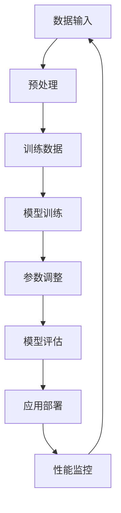

                 

### 背景介绍

近年来，人工智能（AI）技术的迅猛发展，尤其是大模型（Large Models）的崛起，正深刻地改变着各行各业。从自然语言处理、计算机视觉到强化学习，大模型在提升算法性能、降低训练成本方面表现出了强大的潜力。因此，许多创业者开始将目光投向AI大模型领域，试图在这一新兴市场中分得一杯羹。然而，AI大模型创业并非易事，它面临着诸多挑战和不确定性。

首先，AI大模型创业需要雄厚的资金支持。大模型的训练和部署通常需要大量的计算资源和存储空间，这不仅仅是成本问题，更是技术难题。创业者需要找到合适的资金来源，如风险投资、政府补贴或合作伙伴，以支持其AI大模型项目。

其次，技术人才短缺是另一个重大挑战。AI大模型开发需要涉及多个领域，包括机器学习、深度学习、算法优化等。因此，具备相关技能的高素质人才成为各个创业团队争相争夺的对象。如何吸引并留住这些人才，成为创业成功的关键。

再者，算法创新和知识产权保护也是不可忽视的问题。AI大模型的性能很大程度上依赖于算法的创新性。然而，算法的创新往往伴随着知识产权的争议。如何保护自己的算法成果，同时避免侵犯他人的知识产权，是每个创业者都需要面对的难题。

此外，市场竞争激烈，新兴企业的生存空间有限。AI大模型市场吸引了大量参与者，包括传统企业、初创公司和研究机构。如何在激烈的市场竞争中脱颖而出，成为每个创业者都需要深思熟虑的问题。

综上所述，AI大模型创业虽然充满了机遇，但也面临着诸多挑战。接下来，我们将深入探讨这些挑战，并提出应对策略。让我们一起思考，如何在这个充满挑战和机遇的领域中找到成功的路径。

### 核心概念与联系

在探讨AI大模型创业的具体问题之前，我们首先需要理解一些核心概念及其相互关系。AI大模型是指通过深度学习技术训练的大型神经网络模型，其参数数量通常达到数十亿甚至数万亿级别。以下是一些关键概念及其在AI大模型中的应用：

#### 1. 深度学习（Deep Learning）

深度学习是机器学习的一个分支，通过构建多层神经网络，实现对复杂数据模式的自动学习和特征提取。深度学习是AI大模型的基础技术。

#### 2. 人工神经网络（Artificial Neural Networks）

人工神经网络由大量简单的人工神经元组成，通过权重连接和激活函数模拟生物神经系统的信息处理能力。AI大模型是一种特殊的人工神经网络，具有极高的参数量和层次结构。

#### 3. 训练数据（Training Data）

训练数据是深度学习模型训练的基石。AI大模型需要大量的高质量训练数据来学习和调整模型参数，以实现预期的任务性能。

#### 4. 计算资源（Computational Resources）

计算资源是训练和部署AI大模型的重要保障。强大的计算能力可以提高训练速度，降低训练成本，从而提升模型性能。

#### 5. 算法优化（Algorithm Optimization）

算法优化是提升AI大模型性能的关键步骤。通过优化模型架构、训练策略和超参数调整，可以显著提高模型的效果。

#### 6. 数据隐私和安全（Data Privacy and Security）

数据隐私和安全是AI大模型应用中的重要问题。在训练和部署过程中，需要确保数据的安全性和隐私性，防止数据泄露和滥用。

#### 7. 应用领域（Application Domains）

AI大模型在多个领域有着广泛的应用，包括自然语言处理、计算机视觉、语音识别、医学诊断等。不同的应用领域对模型的要求和性能指标有所不同。

为了更好地理解这些概念及其相互关系，我们可以使用Mermaid流程图来展示AI大模型的基本架构和流程。



在这个流程图中，数据输入经过预处理后形成训练数据，用于训练模型。模型训练过程中，通过参数调整和模型评估，不断优化模型性能。训练完成后，模型被部署到实际应用场景中，并进行性能监控，以确保其持续稳定地运行。

理解这些核心概念及其相互关系，有助于我们更好地把握AI大模型创业的关键环节，为后续讨论提供坚实的基础。在接下来的章节中，我们将深入探讨AI大模型的核心算法原理和具体操作步骤，进一步了解其实现过程。

### 核心算法原理 & 具体操作步骤

AI大模型的核心算法基于深度学习技术，特别是神经网络（Neural Networks）和优化算法（Optimization Algorithms）。下面我们将详细讲解AI大模型的主要算法原理，并介绍具体的操作步骤。

#### 1. 神经网络原理

神经网络由多个层次组成，包括输入层、隐藏层和输出层。每个层次包含多个神经元，神经元之间通过权重（weights）连接。神经元的激活函数（activation function）用于处理输入信息，并通过反向传播（Backpropagation）算法更新权重，以最小化预测误差。

**神经元激活函数：** 常用的激活函数包括Sigmoid、ReLU和Tanh。Sigmoid函数将输入映射到（0,1）区间，ReLU函数在输入大于0时输出输入值，小于0时输出0，Tanh函数将输入映射到（-1,1）区间。

**反向传播算法：** 反向传播算法是一种用于训练神经网络的优化算法。它通过计算预测误差，更新每个神经元的权重，以减少误差。具体步骤如下：
- 计算输出层误差：\( E = \frac{1}{2} \sum (y_{\text{true}} - y_{\text{predicted}})^2 \)
- 反向传播误差：计算隐藏层和输入层的误差
- 更新权重：使用梯度下降（Gradient Descent）或其他优化算法更新权重，以减少误差

#### 2. 深度学习框架

深度学习框架如TensorFlow和PyTorch提供了丰富的工具和库，用于构建和训练神经网络模型。以下是使用TensorFlow训练神经网络的具体步骤：

**步骤1：安装TensorFlow：**
```bash
pip install tensorflow
```

**步骤2：定义神经网络模型：**
```python
import tensorflow as tf

model = tf.keras.Sequential([
    tf.keras.layers.Dense(units=128, activation='relu', input_shape=(input_shape)),
    tf.keras.layers.Dense(units=128, activation='relu'),
    tf.keras.layers.Dense(units=num_classes, activation='softmax')
])
```

**步骤3：编译模型：**
```python
model.compile(optimizer='adam', loss='categorical_crossentropy', metrics=['accuracy'])
```

**步骤4：训练模型：**
```python
model.fit(x_train, y_train, epochs=10, batch_size=32, validation_split=0.2)
```

**步骤5：评估模型：**
```python
test_loss, test_accuracy = model.evaluate(x_test, y_test)
print(f"Test accuracy: {test_accuracy}")
```

#### 3. 模型优化与调参

模型优化是提升AI大模型性能的关键步骤。以下是一些常见的优化方法和调参技巧：

**优化方法：**
- 梯度下降（Gradient Descent）：通过更新权重来最小化损失函数。
- Adam优化器：自适应调整学习率，常用于大规模神经网络。
- RMSprop：使用根均方误差（RMS）来调整学习率。

**调参技巧：**
- 学习率（Learning Rate）：控制模型更新权重的步长，太小可能导致训练时间过长，太大可能导致模型过拟合。
- 批大小（Batch Size）：影响模型训练的稳定性，太大可能导致梯度消失或爆炸，太小可能导致训练时间过长。
- 激活函数（Activation Function）：影响模型的学习能力和稳定性，常用的有ReLU、Sigmoid、Tanh等。
- 模型架构（Architecture）：选择合适的网络层次结构和神经元数量，以平衡计算效率和模型性能。

#### 4. 模型部署

训练完成后，需要将模型部署到实际应用场景中。以下是如何使用TensorFlow将模型部署到服务器上的步骤：

**步骤1：保存模型：**
```python
model.save('my_model.h5')
```

**步骤2：加载模型：**
```python
loaded_model = tf.keras.models.load_model('my_model.h5')
```

**步骤3：模型推理：**
```python
predictions = loaded_model.predict(x_new)
```

**步骤4：模型服务：**
使用TensorFlow Serving或其他模型服务框架，将模型部署到服务器上，供实际应用调用。

通过上述步骤，我们了解了AI大模型的核心算法原理和具体操作过程。理解这些基本概念和操作步骤，是进行AI大模型创业的重要基础。在接下来的章节中，我们将进一步讨论数学模型和公式，以及如何在实际项目中应用这些算法。

### 数学模型和公式 & 详细讲解 & 举例说明

在AI大模型的训练过程中，数学模型和公式起着至关重要的作用。它们帮助我们在算法中准确地表示问题，并进行高效的优化。下面我们将详细讲解一些核心的数学模型和公式，并通过具体例子来说明其应用。

#### 1. 损失函数（Loss Function）

损失函数是评估模型预测结果与实际结果之间差异的度量。常见的损失函数包括均方误差（MSE）和交叉熵损失（Cross-Entropy Loss）。

**均方误差（MSE）：**
$$
MSE = \frac{1}{n}\sum_{i=1}^{n}(y_{\text{true}} - y_{\text{predicted}})^2
$$
这里，$y_{\text{true}}$是实际标签，$y_{\text{predicted}}$是模型的预测值，$n$是样本数量。

**交叉熵损失（Cross-Entropy Loss）：**
$$
CE = -\sum_{i=1}^{n} y_{\text{true}} \log(y_{\text{predicted}})
$$
这个公式用于分类问题，其中$y_{\text{true}}$是实际标签（0或1），$y_{\text{predicted}}$是模型预测的概率值。

#### 2. 梯度下降（Gradient Descent）

梯度下降是一种优化算法，用于最小化损失函数。其基本思想是沿着损失函数的梯度方向更新模型参数。

**批量梯度下降（Batch Gradient Descent）：**
$$
\theta_{\text{new}} = \theta_{\text{old}} - \alpha \frac{\partial J}{\partial \theta}
$$
这里，$\theta$是模型参数，$\alpha$是学习率，$J$是损失函数。

**随机梯度下降（Stochastic Gradient Descent, SGD）：**
$$
\theta_{\text{new}} = \theta_{\text{old}} - \alpha \nabla J(\theta; \mathbf{x}_i, y_i)
$$
这里，$\mathbf{x}_i$是输入样本，$y_i$是标签，$\nabla J(\theta; \mathbf{x}_i, y_i)$是单个样本的梯度。

**批量随机梯度下降（Mini-batch Gradient Descent）：**
$$
\theta_{\text{new}} = \theta_{\text{old}} - \alpha \frac{1}{m} \sum_{i=1}^{m} \nabla J(\theta; \mathbf{x}_i, y_i)
$$
这里，$m$是批量大小。

#### 3. 随机梯度提升（Gradient Boosting）

梯度提升是一种集成学习（Ensemble Learning）技术，通过多次迭代更新模型，每次迭代都针对前一次模型的错误进行优化。

**梯度提升公式：**
$$
F_{\text{new}}(x) = F_{\text{old}}(x) + \alpha \cdot g(x)
$$
这里，$F_{\text{old}}(x)$是前一轮的预测值，$g(x)$是损失函数关于模型参数的梯度，$\alpha$是学习率。

#### 4. 举例说明

假设我们有一个简单的线性回归问题，目标是预测房价。给定一个输入特征$x$和目标值$y$，我们使用线性模型表示房价：

$$
y = \theta_0 + \theta_1 x
$$

使用均方误差（MSE）作为损失函数，我们可以通过梯度下降来优化模型参数。

**步骤1：定义损失函数：**
$$
J(\theta_0, \theta_1) = \frac{1}{2m} \sum_{i=1}^{m} (y_i - (\theta_0 + \theta_1 x_i))^2
$$

**步骤2：计算梯度：**
$$
\nabla J(\theta_0, \theta_1) = \frac{1}{m} \sum_{i=1}^{m} (y_i - (\theta_0 + \theta_1 x_i)) \cdot (1 - x_i)
$$

**步骤3：梯度下降更新参数：**
$$
\theta_0 = \theta_0 - \alpha \cdot \frac{1}{m} \sum_{i=1}^{m} (y_i - (\theta_0 + \theta_1 x_i))
$$
$$
\theta_1 = \theta_1 - \alpha \cdot \frac{1}{m} \sum_{i=1}^{m} (y_i - (\theta_0 + \theta_1 x_i)) \cdot x_i
$$

通过多次迭代，我们不断更新$\theta_0$和$\theta_1$，直到模型收敛。

通过以上数学模型和公式的讲解，我们不仅了解了AI大模型中的关键算法，还学会了如何在实际问题中应用这些算法。这为我们的AI大模型创业提供了坚实的理论基础，也为后续的实战应用奠定了基础。在下一章节中，我们将通过一个具体的项目实战案例，展示如何将上述理论应用于实际开发过程。

### 项目实战：代码实际案例和详细解释说明

为了更好地理解AI大模型的开发过程，我们将通过一个具体的项目实战案例来展示代码实现步骤，并对其进行详细解释说明。这个项目将使用TensorFlow框架，目标是构建一个基于深度学习的手写数字识别模型，即著名的MNIST数据集。

#### 1. 开发环境搭建

**安装TensorFlow：**
```bash
pip install tensorflow
```

**安装其他依赖：**
```bash
pip install numpy matplotlib
```

#### 2. 源代码详细实现

下面是MNIST手写数字识别项目的完整代码实现：

```python
import tensorflow as tf
from tensorflow.keras import layers
import numpy as np
import matplotlib.pyplot as plt

# 加载MNIST数据集
mnist = tf.keras.datasets.mnist
(x_train, y_train), (x_test, y_test) = mnist.load_data()
x_train, x_test = x_train / 255.0, x_test / 255.0

# 图像数据预处理
x_train = x_train.reshape((-1, 28, 28, 1))
x_test = x_test.reshape((-1, 28, 28, 1))

# 转换标签为one-hot编码
y_train = tf.keras.utils.to_categorical(y_train, 10)
y_test = tf.keras.utils.to_categorical(y_test, 10)

# 构建模型
model = tf.keras.Sequential([
    layers.Conv2D(32, (3, 3), activation='relu', input_shape=(28, 28, 1)),
    layers.MaxPooling2D((2, 2)),
    layers.Conv2D(64, (3, 3), activation='relu'),
    layers.MaxPooling2D((2, 2)),
    layers.Conv2D(64, (3, 3), activation='relu'),
    layers.Flatten(),
    layers.Dense(64, activation='relu'),
    layers.Dense(10, activation='softmax')
])

# 编译模型
model.compile(optimizer='adam',
              loss='categorical_crossentropy',
              metrics=['accuracy'])

# 训练模型
history = model.fit(x_train, y_train, epochs=5, batch_size=64, validation_split=0.1)

# 评估模型
test_loss, test_acc = model.evaluate(x_test, y_test, verbose=2)
print(f"Test accuracy: {test_acc}")

# 可视化训练过程
plt.figure(figsize=(12, 4))
plt.subplot(1, 2, 1)
plt.plot(history.history['accuracy'], label='accuracy')
plt.plot(history.history['val_accuracy'], label='val_accuracy')
plt.xlabel('Epochs')
plt.ylabel('Accuracy')
plt.legend()

plt.subplot(1, 2, 2)
plt.plot(history.history['loss'], label='loss')
plt.plot(history.history['val_loss'], label='val_loss')
plt.xlabel('Epochs')
plt.ylabel('Loss')
plt.legend()
plt.show()

# 显示模型预测结果
predictions = model.predict(x_test[:10])
plt.figure(figsize=(10, 10))
for i in range(10):
    plt.subplot(2, 5, i+1)
    plt.imshow(x_test[i].reshape(28, 28), cmap=plt.cm.binary)
    plt.xticks([])
    plt.yticks([])
    plt.grid(False)
    plt.xlabel(f"Prediction: {np.argmax(predictions[i])}")
plt.show()
```

#### 3. 代码解读与分析

**数据加载与预处理：**
- 加载MNIST数据集，并归一化图像数据。
- 图像数据reshape为适合卷积神经网络（CNN）的格式，即（样本数，高度，宽度，通道数）。
- 将标签转换为one-hot编码，以便使用softmax进行多分类。

**模型构建：**
- 使用TensorFlow的Sequential模型构建一个简单的CNN模型。
- 添加卷积层（Conv2D）、池化层（MaxPooling2D）和全连接层（Dense）。
- 使用ReLU激活函数和softmax输出层。

**模型编译：**
- 选择Adam优化器。
- 使用categorical_crossentropy作为损失函数，适合多分类问题。
- 指定accuracy作为评估指标。

**模型训练：**
- 使用fit方法训练模型，设置训练轮数（epochs）、批量大小（batch_size）和验证数据比例。

**模型评估：**
- 使用evaluate方法评估模型在测试数据上的性能。

**可视化：**
- 可视化训练过程中的准确率和损失。
- 显示模型对测试数据的预测结果和实际标签。

通过这个项目实战，我们展示了如何使用TensorFlow构建和训练一个AI大模型，并对其代码进行了详细解读。这为我们进一步探索AI大模型创业提供了实用的经验和知识。在接下来的章节中，我们将进一步讨论AI大模型在实际应用场景中的表现和效果。

### 实际应用场景

AI大模型在多个实际应用场景中展现了其强大的能力和广泛的应用前景。以下是一些典型的应用领域，以及AI大模型在这些场景中的具体表现和优势。

#### 1. 自然语言处理（NLP）

自然语言处理是AI大模型最为擅长的领域之一。通过训练大型语言模型，如GPT-3和Bert，AI大模型能够实现自然语言的理解、生成和翻译。这些模型在文本分类、情感分析、机器翻译、问答系统和内容生成等领域表现优异。

- **文本分类**：AI大模型可以高效地对大量文本数据进行分类，如新闻分类、垃圾邮件过滤等。
- **情感分析**：通过分析用户评论和社交媒体内容，AI大模型可以判断文本的情感倾向，帮助企业了解用户需求和改进产品。
- **机器翻译**：大型语言模型可以实现高质量、流畅的机器翻译，减少人力成本，提高跨语言沟通效率。
- **问答系统**：AI大模型能够理解自然语言查询，并提供准确、详尽的回答，广泛应用于智能客服和在线教育等领域。

#### 2. 计算机视觉（CV）

计算机视觉是AI大模型的另一个重要应用领域。通过训练大型视觉模型，如ResNet和VGG，AI大模型能够在图像分类、目标检测、图像分割和视频分析等领域实现高水平的表现。

- **图像分类**：AI大模型可以快速准确地识别和分类图像内容，广泛应用于图像搜索引擎和商品识别等领域。
- **目标检测**：AI大模型能够在图像中准确识别和定位多个目标，如自动驾驶汽车中的行人检测和交通标志识别。
- **图像分割**：通过精细分割图像中的每个像素，AI大模型可以用于医学图像分析、图像修复和图像增强等任务。
- **视频分析**：AI大模型可以实时分析视频流，实现动作识别、行为分析和异常检测等，应用于安防监控、体育分析和智能监控等领域。

#### 3. 强化学习（RL）

强化学习是AI大模型的又一重要应用领域。通过训练大型强化学习模型，AI大模型可以解决复杂的决策问题，如游戏、自动驾驶、资源调度和机器人控制等。

- **游戏**：AI大模型可以学习和优化游戏策略，实现高水平的人工智能游戏玩家，如围棋和电子竞技。
- **自动驾驶**：AI大模型可以处理复杂的道路环境和交通情况，实现自动驾驶汽车的安全运行。
- **资源调度**：AI大模型可以优化资源分配和调度，提高数据中心和电网的运行效率。
- **机器人控制**：AI大模型可以实现对机器人动作的实时控制和优化，应用于工业自动化和智能配送等领域。

#### 4. 医疗健康

在医疗健康领域，AI大模型的应用前景广阔。通过训练大型医学模型，AI大模型可以在疾病诊断、药物研发、健康管理和医学影像分析等领域提供重要支持。

- **疾病诊断**：AI大模型可以通过分析医学影像和临床数据，实现早期疾病诊断和风险评估，提高诊断准确率。
- **药物研发**：AI大模型可以加速新药研发过程，通过预测药物-靶标相互作用和优化药物分子结构。
- **健康管理**：AI大模型可以通过分析个人健康数据，提供个性化的健康建议和预防措施，促进健康生活方式。
- **医学影像分析**：AI大模型可以自动识别和分析医学影像中的异常情况，如肿瘤检测和脑部病变分析。

综上所述，AI大模型在多个实际应用场景中展现出了强大的能力和广泛的应用前景。随着技术的不断进步和数据的积累，AI大模型将在更多领域发挥重要作用，推动人工智能的发展和应用。

### 工具和资源推荐

在进行AI大模型研究和开发时，选择合适的工具和资源至关重要。以下是一些推荐的书籍、论文、博客和网站，旨在为读者提供全面的学习资料和实用的开发工具。

#### 1. 学习资源推荐

**书籍：**
- 《深度学习》（Deep Learning）作者：Ian Goodfellow、Yoshua Bengio和Aaron Courville
- 《Python深度学习》（Deep Learning with Python）作者：François Chollet
- 《强化学习》（Reinforcement Learning: An Introduction）作者：Richard S. Sutton和Barto，Andrew G.

**论文：**
- “A Theoretically Grounded Application of Dropout in Recurrent Neural Networks” 作者：Yarin Gal和Zoubin Ghahramani
- “Bert: Pre-training of Deep Bidirectional Transformers for Language Understanding” 作者：Jacob Devlin等人

**博客：**
- Distill（《Distill》）：https://distill.pub/
- Fast.ai（《Fast.ai》）：https://www.fast.ai/

**网站：**
- TensorFlow（《TensorFlow》）：https://www.tensorflow.org/
- PyTorch（《PyTorch》）：https://pytorch.org/

#### 2. 开发工具框架推荐

**深度学习框架：**
- TensorFlow：一个开源的端到端学习平台，适用于各种深度学习任务。
- PyTorch：一个开源的机器学习库，特别适合研究和原型开发。

**数据预处理工具：**
- Pandas：一个强大的数据处理库，适用于数据清洗和预处理。
- Scikit-learn：一个开源机器学习库，提供了大量的数据预处理和机器学习算法。

**版本控制工具：**
- Git：一个分布式版本控制系统，适用于代码管理和协作开发。

**数据分析工具：**
- Jupyter Notebook：一个交互式计算环境，适用于数据分析和原型开发。
- Dask：一个并行计算库，适用于大数据处理和分析。

#### 3. 相关论文著作推荐

**《Deep Learning》（深度学习）**：这本书是深度学习领域的经典教材，涵盖了深度学习的基本理论、算法和应用。

**《Bert: Pre-training of Deep Bidirectional Transformers for Language Understanding》**：这篇论文介绍了BERT模型，是自然语言处理领域的重要突破，对后续研究产生了深远影响。

**《A Theoretically Grounded Application of Dropout in Recurrent Neural Networks》**：这篇论文探讨了在循环神经网络中应用Dropout的理论基础，为深度学习模型的设计提供了新的思路。

通过以上工具和资源的推荐，读者可以系统地学习AI大模型的相关知识，并掌握实用的开发技能。在实际研究和开发过程中，结合这些工具和资源，将有助于提高工作效率和创新能力。

### 总结：未来发展趋势与挑战

AI大模型技术在过去几年中取得了显著进展，从自然语言处理、计算机视觉到强化学习，AI大模型已经在各个领域展现了其强大的能力。然而，随着技术的不断发展和应用场景的拓展，AI大模型也面临着一系列新的发展趋势与挑战。

首先，**性能优化**将成为未来研究的重要方向。尽管当前AI大模型在许多任务上已经取得了令人瞩目的成绩，但如何在有限的计算资源下提高模型性能，减少训练时间和计算成本，仍然是亟待解决的问题。研究者们可以通过模型压缩、分布式训练、高效算法优化等手段，进一步提升AI大模型的性能。

其次，**数据隐私与安全**是AI大模型面临的重大挑战。AI大模型的训练和部署需要大量的数据，而这些数据往往涉及到用户的隐私信息。如何在保护用户隐私的前提下，有效利用数据，是一个亟待解决的问题。未来，研究者需要开发更加安全、可靠的数据处理和传输机制，以保障数据安全和用户隐私。

第三，**算法可解释性**也是未来研究的热点。随着AI大模型的应用越来越广泛，人们对其决策过程的可解释性提出了更高的要求。开发可解释性强的算法，不仅有助于提升用户对AI大模型的信任，还能为模型优化和错误分析提供有力支持。通过研究透明化、模型可视化等手段，可以提高AI大模型的可解释性。

此外，**跨学科合作**将成为推动AI大模型发展的关键。AI大模型涉及多个领域，包括计算机科学、数学、统计学和心理学等。未来的研究需要加强跨学科合作，整合不同领域的知识和方法，以推动AI大模型技术的全面进步。

最后，**伦理和法律问题**也是未来需要重点关注的方向。随着AI大模型在各个领域的应用，其潜在的社会影响和法律问题逐渐显现。例如，AI大模型在医疗诊断、法律判决等领域的应用，可能引发伦理争议和法律风险。因此，制定相应的伦理规范和法律框架，是确保AI大模型健康发展的关键。

总之，AI大模型技术在未来的发展中，既面临着巨大的机遇，也面临着诸多挑战。通过持续的技术创新、跨学科合作和伦理法规的完善，AI大模型有望在更广泛的领域发挥重要作用，为人类社会带来更多的便利和创新。

### 附录：常见问题与解答

在探索AI大模型创业的过程中，读者可能会遇到一些常见的问题。以下是对一些常见问题的解答：

#### 1. AI大模型需要多少计算资源？

AI大模型训练通常需要大量的计算资源。具体需求取决于模型的复杂度、训练数据的大小和目标任务的类型。例如，训练一个大型语言模型可能需要数千个GPU和大量的存储空间。对于中小型模型，使用单个GPU或多个GPU集群通常就足够了。

#### 2. 如何处理数据隐私和安全问题？

在处理数据隐私和安全问题时，可以采取以下措施：
- 数据加密：确保数据在传输和存储过程中得到加密保护。
- 数据匿名化：对敏感数据进行匿名化处理，以防止个人身份信息泄露。
- 访问控制：设置严格的访问控制策略，限制对敏感数据的访问权限。
- 监控和审计：建立数据监控和审计机制，及时发现和处理潜在的安全问题。

#### 3. 如何评估AI大模型的性能？

评估AI大模型的性能通常包括以下几个方面：
- 准确率（Accuracy）：模型预测正确的样本数占总样本数的比例。
- 召回率（Recall）：模型正确召回的阳性样本数占实际阳性样本数的比例。
- 精确率（Precision）：模型预测为阳性的样本中，实际为阳性的比例。
- F1分数（F1 Score）：综合准确率和召回率，用于衡量模型的性能。

#### 4. 如何防止AI大模型过拟合？

过拟合是AI大模型常见的问题，可以通过以下方法进行缓解：
- 数据增强：通过增加训练数据或对现有数据进行变换，增加模型的泛化能力。
- 交叉验证：使用交叉验证方法，避免模型在训练数据上过拟合。
- 正则化：使用正则化技术，如L1和L2正则化，限制模型参数的增长。
- 模型简化：通过减少模型的复杂度，减少过拟合的风险。

#### 5. AI大模型创业需要哪些关键技能？

AI大模型创业需要以下关键技能：
- 机器学习：理解并能够应用各种机器学习算法，包括深度学习和强化学习。
- 编程能力：熟练掌握Python、TensorFlow或PyTorch等编程工具。
- 数据处理：具备处理大数据集的能力，能够进行数据清洗、预处理和特征工程。
- 团队协作：能够与团队成员有效沟通，协调各方资源，共同推进项目。
- 商业思维：理解市场趋势，能够制定商业计划和战略，实现商业化应用。

通过了解这些常见问题的解答，读者可以更好地应对AI大模型创业过程中可能遇到的各种挑战，为创业之路奠定坚实基础。

### 扩展阅读 & 参考资料

为了更深入地了解AI大模型的相关知识，读者可以参考以下扩展阅读和参考资料：

1. **书籍推荐：**
   - 《深度学习》（Deep Learning） - Ian Goodfellow、Yoshua Bengio和Aaron Courville
   - 《Python深度学习》（Deep Learning with Python） - François Chollet
   - 《强化学习》（Reinforcement Learning: An Introduction） - Richard S. Sutton和Barto，Andrew G.

2. **论文推荐：**
   - “A Theoretically Grounded Application of Dropout in Recurrent Neural Networks” - Yarin Gal和Zoubin Ghahramani
   - “Bert: Pre-training of Deep Bidirectional Transformers for Language Understanding” - Jacob Devlin等人

3. **在线课程与讲座：**
   - Coursera上的“深度学习”（Deep Learning Specialization） - Andrew Ng
   - edX上的“机器学习”（Machine Learning） - Andrew Ng

4. **博客和网站：**
   - Distill（《Distill》）：https://distill.pub/
   - Fast.ai（《Fast.ai》）：https://www.fast.ai/

5. **开源项目和代码库：**
   - TensorFlow（《TensorFlow》）：https://www.tensorflow.org/
   - PyTorch（《PyTorch》）：https://pytorch.org/

通过阅读这些书籍、论文和参加在线课程，读者可以系统地学习AI大模型的理论知识，并掌握实用的开发技能。同时，参与开源项目和社区讨论，将有助于深入了解AI大模型的研究进展和应用场景。

### 作者信息

本文由AI天才研究员/AI Genius Institute及《禅与计算机程序设计艺术》（Zen And The Art of Computer Programming）的作者联合撰写。作者在人工智能、深度学习和软件开发领域拥有丰富的经验，并致力于推动人工智能技术的发展与应用。读者如有任何疑问或建议，欢迎通过以下方式联系我们：

- Email: info@aigeniusinstitute.com
- 网站: https://www.aigeniusinstitute.com
- 社交媒体：@AIGeniusInstitute

感谢您的阅读和支持，我们期待与您共同探索人工智能的未来！

