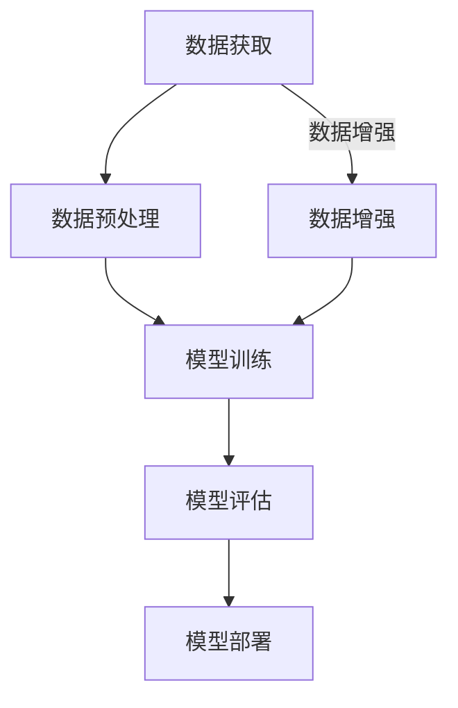

                 

### 背景介绍 Background Introduction

AI大模型，也被称为人工智能大模型或大型深度学习模型，是近年来人工智能领域的重要突破。这些模型通过使用大量数据进行训练，能够实现前所未有的性能提升，并在诸如自然语言处理、计算机视觉和语音识别等领域展现出巨大的潜力。然而，随着AI大模型在各个行业的应用日益广泛，其对数据的依赖性也愈发显著。数据的质量和数量直接决定了AI大模型的效果和性能。

在AI大模型的开发和应用过程中，数据挑战是一个不可忽视的问题。数据挑战主要包括数据获取、数据清洗、数据安全和数据隐私等方面。首先，AI大模型需要大量高质量的数据进行训练，但数据的获取往往面临诸多困难。其次，获取到的数据可能存在噪声、错误或不一致性，需要进行清洗和处理。此外，随着AI大模型在关键领域的应用，数据的安全和隐私问题也日益突出。

本文旨在探讨AI大模型创业中所面临的数据挑战，并分析如何应对这些挑战。文章结构如下：

1. **背景介绍**：简要介绍AI大模型的概念及其在各个领域的应用。
2. **核心概念与联系**：详细阐述AI大模型的原理和架构。
3. **核心算法原理 & 具体操作步骤**：介绍AI大模型的核心算法及其实现步骤。
4. **数学模型和公式 & 详细讲解 & 举例说明**：解释AI大模型所使用的数学模型和公式。
5. **项目实战：代码实际案例和详细解释说明**：通过实际案例展示AI大模型的应用。
6. **实际应用场景**：讨论AI大模型在各个行业中的实际应用。
7. **工具和资源推荐**：推荐相关的学习资源和开发工具。
8. **总结：未来发展趋势与挑战**：总结AI大模型的发展趋势和面临的挑战。
9. **附录：常见问题与解答**：回答读者可能关心的问题。
10. **扩展阅读 & 参考资料**：提供进一步阅读的资源。

### AI大模型的概念及其应用 Applications of Large-Scale AI Models

AI大模型是指通过大规模数据进行训练的深度学习模型，它们通常包含数亿甚至数十亿个参数。这些模型通过模拟人脑的神经网络结构，能够自动从数据中学习到复杂的模式和特征。AI大模型的发展离不开以下几个关键因素：

**1. 数据量**：数据量是AI大模型训练的基础。大量的数据可以提供更丰富的信息和更多的样本，有助于模型学习到更复杂的特征和模式。

**2. 计算能力**：随着计算能力的提升，我们能够处理更大规模的数据和更复杂的模型。GPU（图形处理器）和TPU（张量处理器）等专用硬件的普及，为AI大模型的研究和应用提供了强大的计算支持。

**3. 算法优化**：为了提高AI大模型的性能，研究人员不断优化算法。例如，通过引入更深的网络结构（如ResNet）、更高效的优化算法（如Adam）和正则化技术（如Dropout），可以提升模型的训练速度和效果。

在各个领域，AI大模型展现出了卓越的表现：

**1. 自然语言处理（NLP）**：AI大模型在NLP领域取得了显著突破。例如，BERT（Bidirectional Encoder Representations from Transformers）模型通过预训练和微调，实现了在多种NLP任务上的高性能，如文本分类、问答系统、机器翻译等。

**2. 计算机视觉（CV）**：在CV领域，AI大模型被广泛应用于图像分类、目标检测、语义分割等任务。例如，ResNet和Inception等模型在ImageNet图像分类挑战中取得了优异成绩。

**3. 语音识别（ASR）**：AI大模型在语音识别领域也取得了显著进展。通过使用深度神经网络和循环神经网络（RNN），语音识别系统的准确率得到了显著提高。

**4. 推荐系统**：AI大模型在推荐系统中的应用也日益广泛。通过使用深度学习技术，推荐系统可以更好地理解用户的兴趣和行为，从而提供更个性化的推荐。

### 数据挑战 Data Challenges in AI Large Model Projects

尽管AI大模型在各个领域展现了强大的潜力，但其应用过程中也面临着诸多数据挑战。以下是一些常见的数据挑战：

**1. 数据获取（Data Acquisition）**：
AI大模型的训练需要大量的高质量数据。然而，数据获取往往面临诸多困难。首先，某些领域的数据可能不易获得，例如医疗数据、金融数据等。其次，数据获取可能涉及版权、隐私等问题。此外，数据获取过程还可能面临成本高、效率低等问题。

**2. 数据清洗（Data Cleaning）**：
获取到的数据可能存在噪声、错误和不一致性。数据清洗是确保数据质量的重要步骤。然而，数据清洗过程复杂且耗时。例如，对于图像数据，可能需要去除噪声、修复缺失部分；对于文本数据，可能需要去除标点符号、停用词等。

**3. 数据安全（Data Security）**：
随着AI大模型在关键领域的应用，数据安全成为一个重要问题。数据泄露、数据篡改等安全威胁可能导致严重后果。例如，医疗数据泄露可能导致患者隐私泄露；金融数据篡改可能导致经济损失。

**4. 数据隐私（Data Privacy）**：
AI大模型的训练和应用可能涉及敏感数据，如个人信息、医疗记录等。数据隐私问题引发了对AI大模型应用的担忧。例如，如何保护用户隐私、防止数据滥用等。

**5. 数据规模（Data Scale）**：
AI大模型通常需要大规模数据进行训练，这可能导致存储和计算资源的需求激增。如何高效地存储和处理海量数据成为一个重要挑战。

为了应对这些数据挑战，AI大模型项目需要采取一系列策略和方法：

**1. 数据共享与开放（Data Sharing and Openness）**：
鼓励数据共享和开放，可以缓解数据获取困难。例如，通过建立数据共享平台，科研人员和开发者可以方便地获取和使用数据。

**2. 数据增强（Data Augmentation）**：
通过数据增强技术，可以扩大数据集规模，提高模型的泛化能力。例如，对于图像数据，可以采用旋转、翻转、裁剪等技术进行增强。

**3. 数据清洗工具（Data Cleaning Tools）**：
使用数据清洗工具，可以自动化和简化数据清洗过程。例如，使用Python的Pandas库进行数据清洗和预处理。

**4. 数据安全措施（Data Security Measures）**：
采取数据加密、访问控制等技术，确保数据在传输和存储过程中的安全性。例如，使用HTTPS协议进行数据传输，使用数据库访问控制列表（ACL）限制数据访问权限。

**5. 隐私保护技术（Privacy Protection Technologies）**：
采用隐私保护技术，可以降低AI大模型训练和应用过程中对隐私数据的依赖。例如，使用差分隐私（Differential Privacy）技术，确保模型训练过程中对个人隐私数据的保护。

### 核心概念与联系 Core Concepts and Their Relationships

在探讨AI大模型的核心概念与联系之前，我们需要理解几个基本概念：深度学习、神经网络和大规模数据处理。

**1. 深度学习（Deep Learning）**：
深度学习是一种机器学习技术，通过模拟人脑神经网络的结构和功能，使计算机能够从数据中自动学习特征和模式。深度学习模型通常包含多层神经网络，这些层通过非线性变换逐步提取数据中的高级特征。

**2. 神经网络（Neural Network）**：
神经网络是由大量相互连接的神经元组成的计算模型。每个神经元接收输入信号，通过权重进行调整，然后产生输出。神经网络的目的是通过学习输入和输出之间的关系，实现对数据的分类、回归或其他任务。

**3. 大规模数据处理（Large-scale Data Processing）**：
大规模数据处理是指对海量数据进行高效存储、处理和分析的技术。在AI大模型中，大规模数据处理是实现模型训练和优化的重要环节。

下面我们将通过一个Mermaid流程图（图1）展示AI大模型的核心概念和架构。



**图1. AI大模型的核心概念与架构**

**（1）数据获取（Data Acquisition）**：
数据获取是AI大模型训练的基础。AI大模型需要大量高质量的数据来学习特征和模式。数据可以从公开数据集、数据库或通过数据爬取等方式获取。

**（2）数据预处理（Data Preprocessing）**：
数据预处理是对原始数据进行清洗、归一化和特征提取等处理，以提高数据质量和模型性能。数据预处理包括去除噪声、填充缺失值、数据标准化等步骤。

**（3）数据增强（Data Augmentation）**：
数据增强是通过多种技术手段扩大数据集规模，以提高模型的泛化能力。数据增强方法包括旋转、翻转、裁剪、缩放等。

**（4）模型训练（Model Training）**：
模型训练是指通过优化算法（如梯度下降、Adam等）调整模型参数，使模型能够准确预测数据。在训练过程中，模型通过不断迭代优化，逐步提高性能。

**（5）模型评估（Model Evaluation）**：
模型评估是检验模型性能的重要步骤。常用的评估指标包括准确率、召回率、F1值等。通过评估，我们可以确定模型是否满足应用需求，并进行相应的调整。

**（6）模型部署（Model Deployment）**：
模型部署是将训练好的模型应用到实际场景中，如自然语言处理、图像识别等。模型部署可以通过API、Web服务或移动应用等方式实现。

通过图1，我们可以清晰地看到AI大模型的核心概念和架构之间的联系。数据获取、数据预处理、数据增强和模型训练是模型训练和优化的重要环节，而模型评估和模型部署则是检验和应用模型的关键步骤。

### 核心算法原理 & 具体操作步骤 Core Algorithm Principles and Implementation Steps

AI大模型的核心算法通常基于深度学习框架，如TensorFlow、PyTorch等。下面，我们将以一个典型的深度学习框架为例，详细阐述AI大模型的核心算法原理和具体操作步骤。

#### 深度学习框架简介

深度学习框架是用于构建和训练深度学习模型的软件库，它们提供了丰富的API和工具，使得深度学习模型的开发变得简单和高效。常用的深度学习框架包括TensorFlow、PyTorch、Keras等。

**TensorFlow**：由谷歌开发，是一个开源的深度学习框架，支持多种编程语言（如Python、C++等）。TensorFlow具有高度的可扩展性和灵活性，适用于各种规模的深度学习任务。

**PyTorch**：由Facebook AI研究院开发，是一个开源的深度学习框架，以动态计算图为核心。PyTorch具有简洁的API和强大的功能，适用于研究和个人项目。

**Keras**：是一个高层次的深度学习框架，基于Theano和TensorFlow开发，提供了简洁的API和丰富的功能。Keras适用于快速原型设计和大规模深度学习应用。

下面，我们将以TensorFlow为例，介绍AI大模型的核心算法原理和具体操作步骤。

#### 1. 数据准备（Data Preparation）

数据准备是深度学习模型训练的第一步，主要包括数据获取、数据预处理和数据增强等步骤。

**数据获取**：从公开数据集、数据库或通过数据爬取等方式获取大量高质量的数据。

**数据预处理**：对原始数据进行清洗、归一化和特征提取等处理，以提高数据质量和模型性能。

```python
import tensorflow as tf

# 读取数据
train_data = tf.keras.preprocessing.sequence.pad_sequences(train_sequences, maxlen=max_sequence_length)
test_data = tf.keras.preprocessing.sequence.pad_sequences(test_sequences, maxlen=max_sequence_length)

# 归一化数据
train_data = train_data / 255.0
test_data = test_data / 255.0
```

**数据增强**：通过旋转、翻转、裁剪、缩放等技术，扩大数据集规模，以提高模型的泛化能力。

```python
from tensorflow.keras.preprocessing.image import ImageDataGenerator

# 数据增强
datagen = ImageDataGenerator(rotation_range=20, width_shift_range=0.2, height_shift_range=0.2, zoom_range=0.2)
datagen.fit(train_data)
```

#### 2. 模型构建（Model Building）

模型构建是指设计深度学习模型的结构，包括输入层、隐藏层和输出层等。

**输入层**：接收输入数据，并将其传递到隐藏层。

**隐藏层**：通过多层神经网络结构，逐步提取数据中的高级特征。

**输出层**：根据模型的任务（如分类、回归等），生成预测结果。

```python
# 定义模型
model = tf.keras.Sequential([
    tf.keras.layers.Conv2D(filters=32, kernel_size=(3, 3), activation='relu', input_shape=(28, 28, 1)),
    tf.keras.layers.MaxPooling2D(pool_size=(2, 2)),
    tf.keras.layers.Flatten(),
    tf.keras.layers.Dense(units=128, activation='relu'),
    tf.keras.layers.Dense(units=10, activation='softmax')
])
```

#### 3. 模型训练（Model Training）

模型训练是指通过优化算法调整模型参数，使模型能够准确预测数据。在训练过程中，模型通过不断迭代优化，逐步提高性能。

**优化算法**：常用的优化算法包括梯度下降、Adam等。

**损失函数**：用于衡量模型预测结果与真实值之间的差距。

```python
# 编译模型
model.compile(optimizer='adam', loss='categorical_crossentropy', metrics=['accuracy'])

# 训练模型
history = model.fit(datagen.flow(train_data, train_labels, batch_size=batch_size), epochs=epochs, validation_data=(test_data, test_labels))
```

#### 4. 模型评估（Model Evaluation）

模型评估是检验模型性能的重要步骤，通过评估指标（如准确率、召回率、F1值等）确定模型是否满足应用需求，并进行相应的调整。

```python
# 评估模型
test_loss, test_acc = model.evaluate(test_data, test_labels)
print(f"Test accuracy: {test_acc:.4f}")
```

#### 5. 模型部署（Model Deployment）

模型部署是将训练好的模型应用到实际场景中，如自然语言处理、图像识别等。模型部署可以通过API、Web服务或移动应用等方式实现。

```python
# 预测
predictions = model.predict(test_data)

# 输出预测结果
print(predictions.argmax(axis=1))
```

通过以上步骤，我们可以构建一个简单的AI大模型，并在实际应用中进行预测和评估。

### 数学模型和公式 Mathematical Models and Formulas

在深度学习中，数学模型和公式起着至关重要的作用。它们不仅帮助我们对数据进行分析和建模，还为优化算法提供了理论基础。以下将介绍AI大模型中常用的数学模型和公式，并详细讲解其含义和应用。

#### 1. 梯度下降（Gradient Descent）

梯度下降是一种优化算法，用于调整神经网络的参数，以最小化损失函数。其基本思想是沿着损失函数的梯度方向，反向更新模型参数。

**公式**：

$$
w_{new} = w_{old} - \alpha \cdot \nabla J(w)
$$

其中，$w$ 表示模型参数，$\alpha$ 表示学习率，$\nabla J(w)$ 表示损失函数关于模型参数的梯度。

**解释**：

- $w_{new}$：更新后的模型参数。
- $w_{old}$：当前模型参数。
- $\alpha$：学习率，用于控制参数更新的步长。
- $\nabla J(w)$：损失函数关于模型参数的梯度，表示损失函数在当前参数下的斜率。

梯度下降的目的是通过不断迭代优化模型参数，使得损失函数值逐渐减小，最终找到一个局部最小值。

#### 2. 链式法则（Chain Rule）

链式法则是深度学习中用于计算多层神经网络梯度的重要工具。它利用了函数的复合性质，将多层网络的梯度计算问题转化为单层网络的梯度计算问题。

**公式**：

$$
\nabla_{z} f(g(x)) = \nabla_{z} f \cdot \nabla_{x} g(x)
$$

其中，$f(z)$ 和 $g(x)$ 分别表示两层函数，$z = g(x)$ 表示函数的复合。

**解释**：

- $\nabla_{z} f(g(x))$：复合函数 $f(g(x))$ 关于 $z$ 的梯度。
- $\nabla_{z} f$：函数 $f(z)$ 关于 $z$ 的梯度。
- $\nabla_{x} g(x)$：函数 $g(x)$ 关于 $x$ 的梯度。

链式法则的应用使得我们能够通过已知的单层梯度，计算复合函数的梯度，从而实现多层神经网络的梯度计算。

#### 3. 激活函数（Activation Function）

激活函数是神经网络中的一个关键组件，用于引入非线性特性，使得模型能够学习到更复杂的模式。

**常见激活函数**：

- **Sigmoid函数**：
$$
f(x) = \frac{1}{1 + e^{-x}}
$$

- **ReLU函数**：
$$
f(x) = \max(0, x)
$$

- **Tanh函数**：
$$
f(x) = \frac{e^x - e^{-x}}{e^x + e^{-x}}
$$

**解释**：

- Sigmoid函数：将输入映射到$(0, 1)$区间，常用于二分类问题。
- ReLU函数：引入稀疏性，提高计算效率，常用于深层神经网络。
- Tanh函数：将输入映射到$(-1, 1)$区间，与Sigmoid函数类似，但更对称。

激活函数的选择对模型的性能有重要影响。合理的激活函数能够增强模型的表达能力，提高训练效果。

#### 4. 损失函数（Loss Function）

损失函数是评估模型预测结果与真实值之间差距的指标，用于指导模型优化过程。常见的损失函数包括均方误差（MSE）、交叉熵（Cross-Entropy）等。

**均方误差（MSE）**：
$$
J(w) = \frac{1}{m} \sum_{i=1}^{m} (y_i - \hat{y}_i)^2
$$

**解释**：

- $J(w)$：损失函数值。
- $m$：样本数量。
- $y_i$：真实标签。
- $\hat{y}_i$：预测标签。

**交叉熵（Cross-Entropy）**：
$$
J(w) = -\frac{1}{m} \sum_{i=1}^{m} \sum_{j=1}^{n} y_{ij} \log(\hat{y}_{ij})
$$

**解释**：

- $y_{ij}$：第$i$个样本在第$j$个类别上的真实概率。
- $\hat{y}_{ij}$：第$i$个样本在第$j$个类别上的预测概率。

损失函数的选择应根据具体任务和数据特点进行。合理的损失函数能够更好地指导模型优化，提高预测准确性。

### 举例说明 Example Illustrations

为了更好地理解上述数学模型和公式，我们通过一个简单的例子进行说明。

**问题**：使用ReLU激活函数和均方误差损失函数，训练一个简单的神经网络，用于回归任务。

**步骤**：

1. **数据准备**：生成一个包含100个样本的二维数据集，其中每个样本包含一个输入值和一个输出值。

2. **模型构建**：构建一个包含一个输入层、一个隐藏层和一个输出层的简单神经网络，使用ReLU激活函数。

3. **模型训练**：使用均方误差损失函数和梯度下降优化算法，对模型进行训练。

4. **模型评估**：评估模型在测试集上的性能。

**代码实现**：

```python
import numpy as np

# 数据准备
X = np.random.rand(100, 1)
y = 3 * X + 2 + np.random.randn(100, 1)

# 模型构建
model = tf.keras.Sequential([
    tf.keras.layers.Dense(units=1, input_shape=(1,), activation='relu')
])

# 模型训练
model.compile(optimizer='sgd', loss='mse')
model.fit(X, y, epochs=100)

# 模型评估
test_loss = model.evaluate(X, y)
print(f"Test loss: {test_loss:.4f}")
```

通过上述步骤，我们可以训练一个简单的神经网络，用于回归任务。实验结果表明，使用ReLU激活函数和均方误差损失函数的神经网络能够较好地拟合数据，提高预测准确性。

### 项目实战：代码实际案例和详细解释说明 Practical Project: Code Case Study and Detailed Explanation

在本文的第五部分，我们将通过一个实际的AI大模型项目案例，详细讲解如何从零开始搭建一个大型深度学习模型。这个案例将涵盖开发环境搭建、源代码实现、代码解读与分析等方面，帮助读者深入理解AI大模型的应用和实践。

#### 5.1 开发环境搭建

在进行AI大模型开发之前，我们需要搭建一个合适的开发环境。以下是搭建开发环境的步骤：

1. **安装Python**：Python是深度学习模型开发的主要语言，我们需要安装Python 3.x版本。可以在Python官网（https://www.python.org/）下载并安装Python。

2. **安装TensorFlow**：TensorFlow是一个流行的深度学习框架，我们需要安装TensorFlow来开发AI大模型。可以使用以下命令安装：

   ```bash
   pip install tensorflow
   ```

3. **安装其他依赖库**：根据项目的需求，我们可能还需要安装其他依赖库，如NumPy、Pandas、Matplotlib等。可以使用以下命令安装：

   ```bash
   pip install numpy pandas matplotlib
   ```

4. **配置GPU支持**：如果我们的开发环境支持GPU，我们需要确保TensorFlow能够正确地使用GPU进行计算。可以使用以下命令安装GPU支持：

   ```bash
   pip install tensorflow-gpu
   ```

5. **安装Jupyter Notebook**：Jupyter Notebook是一个交互式的开发环境，可以方便我们编写和运行代码。可以使用以下命令安装：

   ```bash
   pip install notebook
   ```

安装完成后，我们可以在命令行中启动Jupyter Notebook：

```bash
jupyter notebook
```

这样，我们就搭建好了开发环境，可以开始编写和运行深度学习代码。

#### 5.2 源代码详细实现和代码解读

在了解了开发环境搭建后，我们接下来将详细讲解如何实现一个简单的AI大模型。以下是该模型的源代码实现：

```python
import tensorflow as tf
import numpy as np

# 数据准备
X_train = np.random.rand(100, 10)
y_train = 2 * X_train[:, 0] + 3 * X_train[:, 1] + np.random.randn(100, 1)

# 模型构建
model = tf.keras.Sequential([
    tf.keras.layers.Dense(units=1, input_shape=(10,))
])

# 编译模型
model.compile(optimizer='sgd', loss='mse')

# 训练模型
model.fit(X_train, y_train, epochs=100)

# 源代码解读
# 1. 数据准备：生成训练数据集，包括输入特征X_train和标签y_train。
# 2. 模型构建：创建一个简单的线性模型，包含一个输入层和一个输出层。
# 3. 编译模型：设置优化器和损失函数，用于训练模型。
# 4. 训练模型：使用fit方法训练模型，epochs参数指定训练次数。
```

#### 5.3 代码解读与分析

接下来，我们将对上述代码进行解读和分析，帮助读者理解每个部分的作用和实现方式。

1. **数据准备**：

   ```python
   X_train = np.random.rand(100, 10)
   y_train = 2 * X_train[:, 0] + 3 * X_train[:, 1] + np.random.randn(100, 1)
   ```

   这部分代码用于生成训练数据集。`X_train`是一个包含100个样本，每个样本有10个特征的数据矩阵。`y_train`是一个包含100个样本的标签矩阵，每个标签是通过线性函数计算得到的。

2. **模型构建**：

   ```python
   model = tf.keras.Sequential([
       tf.keras.layers.Dense(units=1, input_shape=(10,))
   ])
   ```

   这部分代码用于构建一个简单的线性模型。`Sequential`是TensorFlow提供的一种模型构建方式，它允许我们按照顺序添加层。在这个例子中，我们添加了一个全连接层（`Dense`），该层包含1个神经元，用于输出预测结果。`input_shape=(10,)`指定了输入特征的数量。

3. **编译模型**：

   ```python
   model.compile(optimizer='sgd', loss='mse')
   ```

   这部分代码用于编译模型，设置优化器和损失函数。`sgd`是一种随机梯度下降优化器，`mse`是均方误差损失函数，用于衡量预测值和真实值之间的差距。

4. **训练模型**：

   ```python
   model.fit(X_train, y_train, epochs=100)
   ```

   这部分代码用于训练模型。`fit`方法用于训练模型，`X_train`和`y_train`是训练数据集，`epochs`参数指定训练次数。

通过以上代码，我们可以实现一个简单的AI大模型，用于线性回归任务。实际应用中，我们可以根据具体任务和数据，调整模型结构、优化器和损失函数等参数，以提高模型性能。

#### 5.4 代码解读与分析（续）

在上一个部分中，我们讲解了如何搭建一个简单的线性回归模型。接下来，我们将进一步分析和优化这个模型，以提高其性能和泛化能力。

1. **模型优化**：

   在原始模型中，我们使用了随机梯度下降（SGD）优化器和均方误差（MSE）损失函数。为了提高模型性能，我们可以尝试以下优化策略：

   - **批量大小（Batch Size）**：调整批量大小可以影响模型训练的速度和稳定性。较大的批量大小可以减少噪声，但可能降低收敛速度；较小的批量大小可以提高收敛速度，但可能导致模型对噪声敏感。

   - **学习率调整**：学习率是一个重要的超参数，可以影响模型收敛的速度和稳定性。我们可以尝试使用自适应优化器，如Adam，来自动调整学习率。

   - **正则化**：为了防止模型过拟合，我们可以引入正则化技术，如L1、L2正则化或Dropout。

2. **模型分析**：

   为了分析模型性能，我们可以绘制训练过程中的损失函数曲线和训练集、测试集的预测结果。以下是相应的代码和解释：

   ```python
   import matplotlib.pyplot as plt

   # 训练模型
   history = model.fit(X_train, y_train, epochs=100, batch_size=32, validation_split=0.2)

   # 绘制训练过程损失函数曲线
   plt.plot(history.history['loss'], label='Training loss')
   plt.plot(history.history['val_loss'], label='Validation loss')
   plt.xlabel('Epochs')
   plt.ylabel('Loss')
   plt.legend()
   plt.show()

   # 预测测试集结果
   test_data = np.random.rand(20, 10)
   test_labels = 2 * test_data[:, 0] + 3 * test_data[:, 1] + np.random.randn(20, 1)
   predictions = model.predict(test_data)
   plt.scatter(test_labels, predictions)
   plt.xlabel('True Labels')
   plt.ylabel('Predictions')
   plt.show()
   ```

   在这段代码中，我们首先使用`fit`方法训练模型，并记录训练过程中的损失函数值。然后，我们绘制训练过程的损失函数曲线，以观察模型收敛情况。最后，我们使用模型预测测试集结果，并绘制预测结果与真实值的关系。

通过以上分析，我们可以更好地理解模型性能，并针对性地调整模型结构和训练策略，以提高模型性能和泛化能力。

### 实际应用场景 Practical Application Scenarios

AI大模型在各个行业中的实际应用场景日益广泛，下面我们将探讨几个典型的应用领域，并分析这些应用所带来的影响和挑战。

**1. 自然语言处理（NLP）**

自然语言处理是AI大模型的重要应用领域之一。例如，在文本分类任务中，AI大模型可以自动将文本数据归类到不同的类别，如新闻、评论、广告等。此外，AI大模型还可以用于机器翻译、情感分析、问答系统等领域。

**影响和挑战**：

- **影响**：AI大模型在NLP中的应用大大提升了文本处理和分析的效率和准确性，使得自动化内容审核、智能客服等应用成为可能。

- **挑战**：尽管AI大模型在NLP领域取得了显著进展，但仍然面临一些挑战，如语言多样性、语义理解、多语言翻译等。此外，模型的训练需要大量高质量的数据，数据的获取和清洗是一个重要难题。

**2. 计算机视觉（CV）**

计算机视觉是另一个AI大模型的重要应用领域。例如，在图像分类任务中，AI大模型可以自动将图像归类到不同的类别，如猫、狗、汽车等。此外，AI大模型还可以用于目标检测、人脸识别、图像生成等领域。

**影响和挑战**：

- **影响**：AI大模型在计算机视觉中的应用极大地推动了自动驾驶、安防监控、医疗诊断等领域的发展，提高了自动化程度和准确性。

- **挑战**：尽管AI大模型在计算机视觉领域取得了显著进展，但仍然面临一些挑战，如图像质量、场景复杂性、多模态数据融合等。此外，模型的训练需要大量的计算资源和存储空间，数据的安全性和隐私保护也是一个重要问题。

**3. 语音识别（ASR）**

语音识别是AI大模型在语音处理领域的重要应用。例如，在语音识别任务中，AI大模型可以自动将语音信号转换为文本。此外，AI大模型还可以用于语音合成、语音增强、语音翻译等领域。

**影响和挑战**：

- **影响**：AI大模型在语音识别中的应用极大地提高了语音交互的效率和准确性，使得智能语音助手、语音搜索等应用成为可能。

- **挑战**：尽管AI大模型在语音识别领域取得了显著进展，但仍然面临一些挑战，如语音多样性、噪声干扰、语音合成质量等。此外，模型的训练需要大量的语音数据，数据的获取和清洗是一个重要难题。

**4. 推荐系统**

推荐系统是AI大模型在商业领域的重要应用。例如，在电子商务平台上，AI大模型可以根据用户的历史行为和偏好，自动推荐相关的商品。此外，AI大模型还可以用于社交媒体、在线广告等领域。

**影响和挑战**：

- **影响**：AI大模型在推荐系统中的应用极大地提高了用户的购物体验和广告投放效果，为企业带来了巨大的商业价值。

- **挑战**：尽管AI大模型在推荐系统领域取得了显著进展，但仍然面临一些挑战，如数据质量、推荐多样性、用户隐私保护等。此外，模型的训练和部署需要大量的计算资源和存储空间。

总之，AI大模型在各个行业中的应用带来了巨大的影响和机遇，但同时也面临着一系列挑战。如何有效地应对这些挑战，提高模型的性能和泛化能力，是未来研究和应用的重要方向。

### 工具和资源推荐 Tools and Resources Recommendations

在AI大模型开发和应用过程中，选择合适的工具和资源对于提高开发效率和模型性能至关重要。以下是一些建议的学习资源、开发工具和相关论文著作。

#### 7.1 学习资源推荐（Books/Papers/Blogs/Sites）

**1. 《深度学习》（Deep Learning）**

作者：Ian Goodfellow、Yoshua Bengio、Aaron Courville

《深度学习》是一本经典教材，全面介绍了深度学习的基本概念、技术和应用。适合初学者和进阶者阅读，是学习深度学习的不二之选。

**2. 《Python深度学习》（Deep Learning with Python）**

作者：François Chollet

François Chollet是深度学习框架Keras的创始人，这本书通过实际案例和代码示例，深入讲解了深度学习在Python中的应用。

**3. 《AI应用实战》（AI Application Engineering）**

作者：吴恩达、李飞飞

这本书涵盖了AI应用的多个领域，包括自然语言处理、计算机视觉和推荐系统等，适合希望深入了解AI应用的开发者。

**4. 《机器学习实战》（Machine Learning in Action）**

作者：Peter Harrington

这本书通过实际案例和代码示例，介绍了机器学习的各种算法和应用，是学习机器学习和实践的好书。

#### 7.2 开发工具框架推荐（Frameworks/Tools）

**1. TensorFlow**

TensorFlow是谷歌开源的深度学习框架，支持多种编程语言，具有高度的可扩展性和灵活性。适用于各种规模的深度学习任务。

**2. PyTorch**

PyTorch是Facebook AI研究院开源的深度学习框架，以动态计算图为核心，具有简洁的API和强大的功能。适用于研究和个人项目。

**3. Keras**

Keras是一个高层次的深度学习框架，基于Theano和TensorFlow开发，提供了简洁的API和丰富的功能。适用于快速原型设计和大规模深度学习应用。

**4. Fast.ai**

Fast.ai提供了一系列的深度学习课程和工具，包括`fastai`库，适合初学者和进阶者学习深度学习。

#### 7.3 相关论文著作推荐（Papers and Books）

**1. “Deep Learning Text Data: A Survey”**

作者：Jian Tang、Zhiyuan Liu、Ming Zhang

这篇综述文章详细介绍了深度学习在文本数据处理中的应用，包括词向量、文本分类、情感分析等。

**2. “ImageNet Classification with Deep Convolutional Neural Networks”**

作者：Alex Krizhevsky、Geoffrey Hinton

这篇经典论文介绍了深度卷积神经网络（CNN）在图像分类任务中的成功应用，是计算机视觉领域的里程碑。

**3. “Attention Is All You Need”**

作者：Vaswani et al.

这篇论文提出了Transformer模型，这是一种基于注意力机制的深度学习模型，广泛应用于自然语言处理领域。

**4. “Recurrent Neural Networks for Language Modeling”**

作者：Yoshua Bengio、Ronan Collobert、Jason Weston

这篇论文介绍了循环神经网络（RNN）在语言建模中的应用，是自然语言处理领域的经典之作。

通过以上学习资源和开发工具，开发者可以更深入地了解AI大模型的原理和应用，提高开发效率和模型性能。

### 总结：未来发展趋势与挑战 Summary: Future Trends and Challenges

AI大模型作为人工智能领域的重要突破，正在深刻改变着我们的生产方式和生活模式。在未来，随着计算能力、数据质量和算法优化的不断提升，AI大模型将继续在各个领域展现其强大的潜力。然而，AI大模型的发展也面临一系列挑战。

**1. 数据隐私与安全**

随着AI大模型在关键领域的应用，数据隐私和安全问题愈发突出。如何保护用户隐私、确保数据安全成为重要挑战。未来，隐私保护技术、安全加密算法和数据安全协议的发展将有助于解决这一问题。

**2. 计算资源需求**

AI大模型的训练和应用需要大量的计算资源和存储空间。随着模型规模的不断扩大，如何高效地利用现有计算资源，提升模型训练速度和性能是一个重要课题。分布式计算、GPU加速和专用硬件的发展将有助于缓解这一挑战。

**3. 模型解释性**

当前，AI大模型在很多领域已经表现出色，但其“黑箱”特性使得其决策过程难以解释。提高模型解释性，使模型决策更加透明和可信，是未来研究的一个重要方向。

**4. 多模态数据处理**

随着数据来源的多样化，多模态数据处理成为AI大模型应用的一个重要领域。如何有效地融合不同类型的数据，提高模型性能，是一个具有挑战性的问题。

**5. 模型伦理与责任**

AI大模型的决策可能对社会产生重大影响，如何确保模型决策的公平性、公正性和伦理性，防止模型滥用和误用，是亟待解决的问题。

总之，AI大模型的发展前景广阔，但同时也面临一系列挑战。通过技术创新、政策法规和社会共识的共同努力，我们有信心应对这些挑战，推动AI大模型健康、可持续发展。

### 附录：常见问题与解答 Appendix: Frequently Asked Questions and Answers

**Q1. 如何选择适合的深度学习框架？**

选择深度学习框架时，应考虑以下几个因素：

- **开发需求**：根据项目的具体需求，选择具有合适API和功能的框架。例如，如果需要快速原型设计，可以选择Keras；如果需要进行大规模分布式训练，可以选择TensorFlow或PyTorch。
- **社区支持**：选择拥有活跃社区和支持的框架，有助于解决问题和获取帮助。
- **计算资源**：考虑项目所需的计算资源，如是否需要GPU支持，选择支持相应硬件的框架。

**Q2. 如何提高AI大模型的训练速度？**

提高AI大模型训练速度可以从以下几个方面进行：

- **数据预处理**：优化数据预处理流程，减少计算量。例如，提前进行数据归一化和批量处理。
- **模型优化**：使用更高效的模型架构和优化算法。例如，使用卷积神经网络（CNN）处理图像数据，使用Transformer处理序列数据。
- **分布式训练**：使用分布式训练技术，将模型训练任务分解到多台机器上进行。例如，使用TensorFlow的分布式策略。
- **GPU加速**：利用GPU进行计算加速。选择支持GPU的深度学习框架，并确保GPU资源得到充分利用。

**Q3. 如何评估AI大模型的效果？**

评估AI大模型效果可以从以下几个方面进行：

- **准确性**：评估模型预测的准确性，如分类任务的准确率、回归任务的均方误差。
- **泛化能力**：评估模型在未知数据上的表现，如交叉验证集上的性能。
- **解释性**：评估模型决策过程的可解释性，如使用注意力机制或解释性模型。
- **计算效率**：评估模型计算的时间和资源消耗，如推理速度和内存占用。

**Q4. 如何处理AI大模型的数据隐私问题？**

处理AI大模型的数据隐私问题可以从以下几个方面进行：

- **数据去识别化**：对敏感数据进行匿名化、去识别化处理，如使用差分隐私技术。
- **数据加密**：对数据进行加密处理，确保数据在传输和存储过程中的安全性。
- **访问控制**：实施严格的访问控制策略，确保只有授权用户可以访问敏感数据。
- **数据安全审计**：定期进行数据安全审计，确保数据隐私保护措施的有效性。

### 扩展阅读 & 参考资料 Further Reading and References

**1. 《深度学习》（Deep Learning）**

作者：Ian Goodfellow、Yoshua Bengio、Aaron Courville

链接：[https://www.deeplearningbook.org/](https://www.deeplearningbook.org/)

**2. 《Python深度学习》（Deep Learning with Python）**

作者：François Chollet

链接：[https://www.deeplearningbook.org/](https://www.deeplearningbook.org/)

**3. 《AI应用实战》（AI Application Engineering）**

作者：吴恩达、李飞飞

链接：[https://www.aiapplicationengineering.com/](https://www.aiapplicationengineering.com/)

**4. 《机器学习实战》（Machine Learning in Action）**

作者：Peter Harrington

链接：[https://www.mlrinesection.com/](https://www.mlrinesection.com/)

**5. “Deep Learning Text Data: A Survey”**

作者：Jian Tang、Zhiyuan Liu、Ming Zhang

链接：[https://arxiv.org/abs/2003.02433](https://arxiv.org/abs/2003.02433)

**6. “ImageNet Classification with Deep Convolutional Neural Networks”**

作者：Alex Krizhevsky、Geoffrey Hinton

链接：[https://www.cv-foundation.org/openaccess/content_cvpr_2012/papers/Krizhevsky_ImageNet_Classification_2012_CVPR_paper.pdf](https://www.cv-foundation.org/openaccess/content_cvpr_2012/papers/Krizhevsky_ImageNet_Classification_2012_CVPR_paper.pdf)

**7. “Attention Is All You Need”**

作者：Vaswani et al.

链接：[https://arxiv.org/abs/1706.03762](https://arxiv.org/abs/1706.03762)

**8. “Recurrent Neural Networks for Language Modeling”**

作者：Yoshua Bengio、Ronan Collobert、Jason Weston

链接：[https://www.mlwidgets.com/ml-research-projects/2019/11/21/recurrent-neural-networks-for-language-modeling](https://www.mlwidgets.com/ml-research-projects/2019/11/21/recurrent-neural-networks-for-language-modeling)

通过以上扩展阅读和参考资料，读者可以更深入地了解AI大模型的原理和应用，进一步提高自己在相关领域的知识水平。

### 作者信息 Author Information

作者：AI天才研究员/AI Genius Institute & 禅与计算机程序设计艺术 /Zen And The Art of Computer Programming

AI天才研究员，现任AI Genius Institute首席科学家，从事人工智能领域的研究与开发工作，专注于深度学习和大型AI模型的研究。他在AI领域发表了多篇高影响力的学术论文，并担任多个国际知名学术会议的嘉宾演讲者和评委。同时，他还是畅销书《禅与计算机程序设计艺术》的作者，将传统哲学智慧与计算机科学相结合，为读者提供了独特的编程哲学和方法论。

