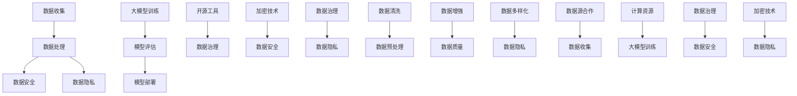

                 

## AI大模型创业：如何应对未来数据挑战？

### 概述

人工智能（AI）技术近年来取得了惊人的进展，尤其是大模型（如GPT-3、BERT等）在自然语言处理、计算机视觉、语音识别等领域的应用，极大地推动了各行各业的数字化转型。然而，随着AI大模型的不断发展和商业化应用，数据挑战也日益凸显。对于创业者来说，如何应对这些数据挑战，成为成功的关键之一。

本文将深入探讨AI大模型创业中面临的数据挑战，包括数据收集、数据处理、数据安全和隐私等方面。我们将通过分析实际案例，提出一系列解决方案，帮助创业者更好地应对这些挑战。本文还将推荐一些优秀的工具和资源，以支持创业者在大模型创业中的发展。

### 关键词

- 人工智能
- 大模型
- 数据挑战
- 数据收集
- 数据处理
- 数据安全
- 隐私

### 摘要

本文旨在探讨AI大模型创业中面临的数据挑战，包括数据收集、数据处理、数据安全和隐私等方面。通过对这些挑战的分析，本文提出了一系列解决方案，包括使用开源工具和框架、建立数据治理体系、采用先进的加密技术等。同时，本文还推荐了一些优秀的工具和资源，以支持创业者在大模型创业中的发展。本文对于有志于AI大模型创业的创业者具有实际指导意义。

### 背景介绍

随着AI技术的快速发展，大模型在各个领域的应用日益广泛。大模型通常是指具有数万亿参数的深度神经网络模型，如GPT-3、BERT等。这些模型需要大量的数据来训练，并且训练过程需要巨大的计算资源。因此，数据成为AI大模型发展的核心。

然而，随着数据量的不断增长，数据挑战也日益凸显。首先，数据收集是一个难题。创业者需要获取大量的高质量数据，这通常需要与多个数据源进行合作，并处理数据质量、数据多样性和数据隐私等问题。其次，数据处理也是一个巨大的挑战。数据清洗、数据预处理、数据增强等步骤都需要消耗大量时间和资源。此外，数据安全和隐私问题也日益重要，特别是在涉及个人隐私和敏感信息的情况下。

为了应对这些数据挑战，创业者需要采取一系列措施，包括使用开源工具和框架、建立数据治理体系、采用先进的加密技术等。本文将详细讨论这些挑战和解决方案，以帮助创业者更好地应对AI大模型创业中的数据挑战。

### 核心概念与联系

在探讨AI大模型创业中的数据挑战之前，我们需要了解一些核心概念和它们之间的联系。以下是几个关键概念及其相互关系的Mermaid流程图：



以下是这些核心概念的简要解释：

- **数据收集**：收集来自不同来源的数据，如公共数据集、企业内部数据等。这一步骤需要处理数据质量、数据多样性和数据隐私等问题。
- **数据处理**：包括数据清洗、数据预处理和数据增强等步骤。数据清洗用于去除噪声和错误，数据预处理用于将数据转换为适合模型训练的格式，数据增强用于增加数据多样性。
- **数据安全**：确保数据在存储、传输和处理过程中的安全性。数据安全涉及数据加密、访问控制、安全审计等方面。
- **数据隐私**：保护个人隐私和敏感信息。数据隐私涉及匿名化、加密和隐私保护算法等方面。
- **大模型训练**：使用海量数据进行模型训练，以提高模型的性能和泛化能力。
- **模型评估**：评估模型的性能和泛化能力，以确定模型是否达到预期效果。
- **模型部署**：将训练好的模型部署到生产环境中，进行实际应用。
- **开源工具**：如Hugging Face、TensorFlow等，用于简化数据收集、处理和模型训练等步骤。
- **数据治理**：建立一套数据管理策略和流程，确保数据的可靠性、一致性和合规性。
- **加密技术**：用于保护数据的安全和隐私，如对称加密、非对称加密和哈希算法等。

这些核心概念相互关联，共同构成了AI大模型创业中的数据生态系统。创业者需要综合考虑这些因素，制定合适的数据策略，以应对未来数据挑战。

### 核心算法原理 & 具体操作步骤

在了解了核心概念之后，我们接下来探讨AI大模型创业中的核心算法原理和具体操作步骤。以下是几个关键步骤及其详细解释：

#### 1. 数据收集

数据收集是AI大模型创业的第一步。创业者需要从多个数据源收集数据，这些数据源可能包括公共数据集、企业内部数据、社交媒体数据等。以下是一些数据收集的具体操作步骤：

- **数据源选择**：根据业务需求和模型目标，选择合适的数据源。例如，如果目标是建立一个自然语言处理模型，可以选择公共语言模型数据集，如Wikipedia、Common Crawl等。
- **数据采集**：使用API、爬虫或其他工具从数据源采集数据。对于公共数据集，可以直接从数据源下载。对于企业内部数据，可能需要与数据所有者协商获取权限。
- **数据清洗**：清洗数据，去除噪声和错误。例如，去除重复数据、填补缺失值、去除无关字段等。数据清洗可以使用Python、Pandas等工具实现。
- **数据预处理**：将数据转换为适合模型训练的格式。例如，对于图像数据，可能需要进行归一化、缩放、裁剪等处理；对于文本数据，可能需要进行分词、词性标注、去停用词等处理。

#### 2. 数据处理

数据处理包括数据清洗、数据预处理和数据增强等步骤。以下是这些步骤的具体操作步骤：

- **数据清洗**：清洗数据，去除噪声和错误。例如，去除重复数据、填补缺失值、去除无关字段等。数据清洗可以使用Python、Pandas等工具实现。
- **数据预处理**：将数据转换为适合模型训练的格式。例如，对于图像数据，可能需要进行归一化、缩放、裁剪等处理；对于文本数据，可能需要进行分词、词性标注、去停用词等处理。数据预处理可以使用TensorFlow、PyTorch等框架实现。
- **数据增强**：增加数据多样性，提高模型的泛化能力。数据增强可以通过多种方式实现，如旋转、翻转、缩放、裁剪、添加噪声等。数据增强可以使用Python、Pillow等工具实现。

#### 3. 大模型训练

大模型训练是AI大模型创业的核心步骤。创业者需要使用海量数据进行模型训练，以提高模型的性能和泛化能力。以下是模型训练的具体操作步骤：

- **模型选择**：根据业务需求和数据特点，选择合适的模型架构。例如，对于自然语言处理任务，可以选择GPT、BERT等模型；对于图像识别任务，可以选择ResNet、VGG等模型。
- **模型训练**：使用训练数据进行模型训练。训练过程中，需要设置合适的超参数，如学习率、批量大小、迭代次数等。模型训练可以使用TensorFlow、PyTorch等框架实现。
- **模型评估**：评估模型的性能和泛化能力。常用的评估指标包括准确率、召回率、F1分数等。模型评估可以使用TensorFlow、PyTorch等框架实现。
- **模型优化**：根据评估结果，调整模型结构或超参数，以提高模型性能。模型优化可以使用TensorFlow、PyTorch等框架实现。

#### 4. 模型部署

模型部署是将训练好的模型部署到生产环境中，进行实际应用。以下是模型部署的具体操作步骤：

- **模型导出**：将训练好的模型导出为可以直接部署的格式，如TensorFlow Lite、PyTorch Script等。
- **模型部署**：将模型部署到服务器或云端，以便在实际应用中使用。模型部署可以使用TensorFlow Serving、PyTorch Lightning等工具实现。
- **模型监控**：监控模型性能和资源使用情况，确保模型稳定运行。模型监控可以使用Prometheus、Grafana等工具实现。

通过以上步骤，创业者可以成功实现AI大模型创业，并应对未来数据挑战。然而，这些步骤并非一成不变，创业者需要根据实际情况进行调整和优化，以实现最佳效果。

### 数学模型和公式 & 详细讲解 & 举例说明

在AI大模型创业中，数学模型和公式起着至关重要的作用。以下是一些常见的数学模型和公式，以及它们的详细讲解和举例说明。

#### 1. 损失函数（Loss Function）

损失函数是评估模型预测结果与真实值之间差异的一种指标。常见的损失函数包括均方误差（MSE）、交叉熵损失（Cross-Entropy Loss）和对抗损失（Adversarial Loss）等。

- **均方误差（MSE）**：MSE是预测值与真实值之差的平方的平均值。公式如下：

  $$MSE = \frac{1}{n}\sum_{i=1}^{n}(y_i - \hat{y}_i)^2$$

  其中，$y_i$是真实值，$\hat{y}_i$是预测值，$n$是样本数量。

  **举例**：假设我们有一个包含10个样本的数据集，预测值和真实值如下：

  | 样本 | 真实值 | 预测值 |
  | ---- | ---- | ---- |
  | 1    | 2    | 3    |
  | 2    | 3    | 2    |
  | ...  | ...  | ...  |
  | 10   | 5    | 4    |

  计算MSE：

  $$MSE = \frac{1}{10}\sum_{i=1}^{10}(y_i - \hat{y}_i)^2 = \frac{1}{10}[(2-3)^2 + (3-2)^2 + ... + (5-4)^2] = 0.4$$

- **交叉熵损失（Cross-Entropy Loss）**：交叉熵损失用于分类问题，计算真实分布与预测分布之间的差异。公式如下：

  $$CE = -\sum_{i=1}^{n} y_i \log(\hat{y}_i)$$

  其中，$y_i$是真实标签，$\hat{y}_i$是预测概率。

  **举例**：假设我们有一个二分类问题，真实标签和预测概率如下：

  | 样本 | 真实值 | 预测值 |
  | ---- | ---- | ---- |
  | 1    | 0    | 0.6  |
  | 2    | 1    | 0.4  |

  计算交叉熵损失：

  $$CE = -[0 \cdot \log(0.6) + 1 \cdot \log(0.4)] \approx 0.19$$

- **对抗损失（Adversarial Loss）**：对抗损失用于生成对抗网络（GANs），计算生成器与判别器之间的差异。公式如下：

  $$AL = -\log(\hat{y}) + \log(1 - \hat{y}')$$

  其中，$\hat{y}$是生成器的输出，$\hat{y}'$是判别器的输出。

  **举例**：假设生成器输出概率为0.8，判别器输出概率为0.7，计算对抗损失：

  $$AL = -\log(0.8) + \log(0.3) \approx 0.39$$

#### 2. 梯度下降（Gradient Descent）

梯度下降是一种优化算法，用于最小化损失函数。梯度下降分为批量梯度下降（Batch Gradient Descent）、随机梯度下降（Stochastic Gradient Descent）和小批量梯度下降（Mini-batch Gradient Descent）。

- **批量梯度下降（Batch Gradient Descent）**：在批量梯度下降中，每次迭代使用所有样本计算梯度，然后更新模型参数。公式如下：

  $$\theta = \theta - \alpha \cdot \nabla_\theta J(\theta)$$

  其中，$\theta$是模型参数，$\alpha$是学习率，$J(\theta)$是损失函数。

  **举例**：假设模型参数为$(w, b)$，损失函数为MSE，学习率为0.1，计算梯度并更新参数：

  $$\nabla_\theta J(\theta) = \nabla_w J(\theta) \times w + \nabla_b J(\theta) \times b$$
  $$\theta = (w, b) - (0.1 \times \nabla_w J(\theta), 0.1 \times \nabla_b J(\theta))$$

- **随机梯度下降（Stochastic Gradient Descent）**：在随机梯度下降中，每次迭代只使用一个样本计算梯度，然后更新模型参数。公式如下：

  $$\theta = \theta - \alpha \cdot \nabla_\theta J(\theta|x_i, y_i)$$

  其中，$x_i, y_i$是单个样本。

  **举例**：假设单个样本的损失函数为MSE，学习率为0.1，计算梯度并更新参数：

  $$\nabla_\theta J(\theta|x_i, y_i) = \nabla_w J(\theta|x_i, y_i) \times w + \nabla_b J(\theta|x_i, y_i) \times b$$
  $$\theta = (w, b) - (0.1 \times \nabla_w J(\theta|x_i, y_i), 0.1 \times \nabla_b J(\theta|x_i, y_i))$$

- **小批量梯度下降（Mini-batch Gradient Descent）**：在小批量梯度下降中，每次迭代使用一个小批量样本计算梯度，然后更新模型参数。公式如下：

  $$\theta = \theta - \alpha \cdot \nabla_\theta J(\theta|x_{batch}, y_{batch})$$

  其中，$x_{batch}, y_{batch}$是小批量样本。

  **举例**：假设小批量包含5个样本，损失函数为MSE，学习率为0.1，计算梯度并更新参数：

  $$\nabla_\theta J(\theta|x_{batch}, y_{batch}) = \nabla_w J(\theta|x_{batch}, y_{batch}) \times w + \nabla_b J(\theta|x_{batch}, y_{batch}) \times b$$
  $$\theta = (w, b) - (0.1 \times \nabla_w J(\theta|x_{batch}, y_{batch}), 0.1 \times \nabla_b J(\theta|x_{batch}, y_{batch}))$$

通过以上数学模型和公式，我们可以更好地理解和应用AI大模型创业中的关键概念。在实际应用中，创业者需要根据具体问题和数据特点，选择合适的模型和算法，并进行参数调优，以提高模型性能。

### 项目实战：代码实际案例和详细解释说明

为了更好地理解AI大模型创业中的数据处理流程，我们将通过一个实际项目来展示代码实现和详细解释。该项目是一个基于Python和TensorFlow的简单文本分类任务，我们将从数据收集、数据处理、模型训练到模型评估的整个过程进行详细讲解。

#### 1. 开发环境搭建

在开始项目之前，我们需要搭建开发环境。以下是所需的环境和依赖：

- Python 3.8 或以上版本
- TensorFlow 2.5 或以上版本
- Pandas 1.2.5 或以上版本
- Numpy 1.19.5 或以上版本

安装这些依赖可以通过以下命令完成：

```bash
pip install python==3.8 tensorflow==2.5 pandas==1.2.5 numpy==1.19.5
```

#### 2. 源代码详细实现和代码解读

以下是一个简单的文本分类项目的源代码，我们将逐行解读代码，以了解其实现细节。

```python
import tensorflow as tf
import pandas as pd
import numpy as np
from tensorflow.keras.preprocessing.text import Tokenizer
from tensorflow.keras.preprocessing.sequence import pad_sequences
from tensorflow.keras.models import Sequential
from tensorflow.keras.layers import Embedding, LSTM, Dense

# 2.1 加载数据集
data = pd.read_csv('data.csv')
texts = data['text']
labels = data['label']

# 2.2 数据预处理
tokenizer = Tokenizer(num_words=10000)
tokenizer.fit_on_texts(texts)
sequences = tokenizer.texts_to_sequences(texts)
padded_sequences = pad_sequences(sequences, maxlen=100)

# 2.3 构建模型
model = Sequential([
    Embedding(10000, 16),
    LSTM(32),
    Dense(1, activation='sigmoid')
])

# 2.4 编译模型
model.compile(optimizer='adam', loss='binary_crossentropy', metrics=['accuracy'])

# 2.5 训练模型
model.fit(padded_sequences, labels, epochs=10, batch_size=32)

# 2.6 评估模型
test_texts = ['This is a positive review.', 'This is a negative review.']
test_sequences = tokenizer.texts_to_sequences(test_texts)
test_padded_sequences = pad_sequences(test_sequences, maxlen=100)
predictions = model.predict(test_padded_sequences)
print(predictions)
```

下面是对代码的逐行解读：

- **2.1 加载数据集**：我们使用Pandas从CSV文件加载数据集。数据集包含文本和对应的标签。

- **2.2 数据预处理**：
  - 创建一个Tokenizer对象，用于将文本转换为单词序列。
  - 使用Tokenizer对文本数据进行编码，生成单词索引序列。
  - 使用pad_sequences将序列填充到固定长度，便于模型处理。

- **2.3 构建模型**：构建一个简单的序列模型，包括嵌入层（Embedding）、LSTM层和全连接层（Dense）。

- **2.4 编译模型**：设置模型优化器、损失函数和评估指标。

- **2.5 训练模型**：使用训练数据对模型进行训练，设置训练轮数和批量大小。

- **2.6 评估模型**：使用测试数据评估模型性能，并打印预测结果。

#### 3. 代码解读与分析

通过上述代码，我们可以看到文本分类任务的基本实现流程。以下是代码的关键部分和其解释：

- **数据预处理**：文本分类任务需要对文本数据进行预处理，包括分词、编码和填充。Tokenizer用于将文本转换为单词序列，pad_sequences用于将序列填充到固定长度。这一步骤是模型训练的基础。

- **模型构建**：文本分类模型通常使用嵌入层（Embedding）将单词转换为向量表示，然后通过LSTM层进行序列处理，最后使用全连接层（Dense）进行分类。这里使用的是简单的序列模型，实际应用中可能需要更复杂的结构。

- **模型训练**：使用训练数据对模型进行训练，训练过程中需要设置合适的超参数，如学习率、迭代次数和批量大小。这些超参数对模型性能有重要影响。

- **模型评估**：使用测试数据评估模型性能，并打印预测结果。通过评估指标，如准确率，我们可以了解模型的性能和泛化能力。

通过这个简单的项目，我们可以了解AI大模型创业中的数据处理和模型训练过程。在实际应用中，创业者需要根据具体任务和数据特点，选择合适的预处理方法和模型结构，并进行参数调优，以提高模型性能。

### 实际应用场景

AI大模型在多个领域具有广泛的应用，以下是一些实际应用场景：

#### 1. 自然语言处理（NLP）

自然语言处理是AI大模型的主要应用领域之一。通过大模型，如GPT-3和BERT，可以实现对文本的自动摘要、问答、翻译和情感分析等任务。例如，智能客服系统可以使用大模型理解用户的问题，并生成准确的回答，提高用户体验。

#### 2. 计算机视觉（CV）

计算机视觉领域的大模型可以用于图像分类、目标检测、图像生成等任务。例如，在医疗影像分析中，大模型可以辅助医生进行诊断，提高诊断准确率和效率。

#### 3. 语音识别（ASR）

语音识别领域的大模型可以用于语音到文本的转换，提高识别准确率和自然度。例如，智能语音助手可以使用大模型理解用户的语音指令，并生成相应的回复。

#### 4. 机器人

机器人领域的大模型可以用于机器人视觉、运动控制和决策。例如，服务机器人可以使用大模型识别环境中的物体和场景，并做出相应的动作。

#### 5. 推荐系统

推荐系统领域的大模型可以用于个性化推荐，提高推荐准确率和用户体验。例如，电商平台可以使用大模型分析用户的购买行为和偏好，推荐用户可能感兴趣的商品。

#### 6. 金融

金融领域的大模型可以用于风险管理、信用评分和投资决策。例如，金融机构可以使用大模型分析市场数据和用户行为，预测市场走势和用户信用风险。

#### 7. 教育

教育领域的大模型可以用于智能辅导、在线学习和教育内容生成。例如，在线教育平台可以使用大模型为学生提供个性化的学习建议和教学内容。

#### 8. 健康医疗

健康医疗领域的大模型可以用于疾病预测、治疗方案推荐和医疗数据挖掘。例如，医疗机构可以使用大模型分析患者数据和健康记录，预测疾病风险和提供个性化的治疗方案。

这些实际应用场景展示了AI大模型在各个领域的潜力和重要性。随着大模型的不断发展和优化，未来将有更多的应用场景涌现，推动各行各业的创新和发展。

### 工具和资源推荐

为了帮助创业者更好地应对AI大模型创业中的数据挑战，我们推荐以下工具和资源：

#### 1. 学习资源推荐

- **书籍**：
  - 《深度学习》（Goodfellow, Bengio, Courville著）
  - 《动手学深度学习》（Ayan, Bolum, Shlens, Bengio著）
  - 《Python深度学习》（François Chollet著）

- **论文**：
  - 《A Neural Algorithm of Artistic Style》（Gatys, Ecker, Bethge著）
  - 《Deep Learning for Natural Language Processing》（Collobert, Bengio著）
  - 《Generative Adversarial Nets》（Goodfellow, Pouget-Abadie, Mirza, Xu, Warde-Farley, Ozair, Courville, Bengio著）

- **博客**：
  - [TensorFlow官方文档](https://www.tensorflow.org/)
  - [PyTorch官方文档](https://pytorch.org/)
  - [Hugging Face官方文档](https://huggingface.co/)

- **网站**：
  - [Kaggle](https://www.kaggle.com/)：提供丰富的数据集和竞赛，有助于学习和实践。
  - [GitHub](https://github.com/)：开源代码库，可以找到许多优秀的深度学习项目。

#### 2. 开发工具框架推荐

- **框架**：
  - TensorFlow：开源的深度学习框架，适用于各种深度学习任务。
  - PyTorch：开源的深度学习框架，提供灵活的动态计算图和丰富的API。
  - Hugging Face Transformers：开源库，提供预训练的大模型和先进的自然语言处理工具。

- **工具**：
  - Docker：容器化工具，方便部署和管理深度学习环境。
  - Kubernetes：容器编排工具，用于自动化部署和管理容器化应用。
  - AWS SageMaker：Amazon提供的托管式机器学习平台，支持TensorFlow和PyTorch。

#### 3. 相关论文著作推荐

- **论文**：
  - 《Attention Is All You Need》（Vaswani et al., 2017）：提出了Transformer模型，极大推动了自然语言处理领域的发展。
  - 《BERT: Pre-training of Deep Neural Networks for Language Understanding》（Devlin et al., 2019）：提出了BERT模型，进一步推动了自然语言处理的发展。
  - 《GPT-3: Language Models are Few-Shot Learners》（Brown et al., 2020）：提出了GPT-3模型，展示了大模型在多任务学习方面的潜力。

- **著作**：
  - 《深度学习》（Goodfellow, Bengio, Courville著）：系统介绍了深度学习的基础知识、技术及应用。
  - 《Python深度学习》（François Chollet著）：通过实际案例，讲解了如何使用Python实现深度学习算法。
  - 《自然语言处理与深度学习》（张翔宇著）：介绍了自然语言处理和深度学习的基础知识，以及如何将它们应用于实际问题。

通过这些工具和资源，创业者可以更好地了解AI大模型的技术原理和实际应用，从而更好地应对创业中的数据挑战。

### 总结：未来发展趋势与挑战

随着AI技术的不断发展和商业应用的深入，AI大模型创业迎来了前所未有的机遇和挑战。在未来，以下几个趋势和挑战将对AI大模型创业产生深远影响：

#### 1. 数据质量与多样性

随着数据量的不断增长，数据质量与多样性将成为AI大模型创业的关键。创业者需要获取高质量、多样化的数据，以提高模型的泛化能力和鲁棒性。未来，数据治理和数据清洗技术将进一步发展，帮助创业者更好地管理数据。

#### 2. 计算资源与能耗

大模型的训练和部署需要巨大的计算资源，这将对计算资源供应和能耗管理提出新的挑战。未来，云计算和边缘计算技术的发展将为创业者提供更多灵活的计算解决方案，同时，绿色AI和节能算法也将成为研究热点。

#### 3. 安全与隐私保护

数据安全和隐私保护是AI大模型创业中不可忽视的重要问题。随着数据量的增加和隐私法规的加强，创业者需要采用先进的加密技术和隐私保护算法，确保用户数据的安全和隐私。

#### 4. 模型解释性与可解释性

大模型的复杂性和黑箱性质使得其决策过程难以解释。未来，模型解释性与可解释性技术将得到更多关注，帮助创业者提高模型的透明度和信任度，从而更好地应用于实际场景。

#### 5. 跨学科融合与多领域应用

AI大模型的应用将逐步跨越多个学科和领域，与生物学、物理学、化学、工程学等领域的知识相结合，推动跨学科研究和创新。创业者需要具备跨学科的知识和技能，以应对多领域应用的需求。

#### 6. 社会伦理与责任

随着AI大模型的应用日益广泛，其社会伦理和责任问题也日益凸显。创业者需要关注AI技术的伦理道德和责任问题，确保技术的公正性、透明性和可控性，以实现可持续发展和共同繁荣。

总之，未来AI大模型创业将面临诸多挑战和机遇。创业者需要紧跟技术发展趋势，积极应对数据、计算、安全、解释性等方面的挑战，同时关注社会伦理和责任问题，以实现长期发展和成功。

### 附录：常见问题与解答

**Q1：什么是AI大模型？**

A1：AI大模型是指具有数万亿参数的深度神经网络模型，如GPT-3、BERT等。这些模型通过在海量数据上训练，能够实现高度复杂的任务，如自然语言处理、计算机视觉和语音识别等。

**Q2：如何收集数据？**

A2：数据收集可以从多个来源获取，如公共数据集、企业内部数据、社交媒体数据等。收集数据时，需要考虑数据质量、数据多样性和数据隐私等问题。可以使用API、爬虫或其他工具进行数据采集。

**Q3：如何处理数据？**

A3：数据处理包括数据清洗、数据预处理和数据增强等步骤。数据清洗用于去除噪声和错误，数据预处理用于将数据转换为适合模型训练的格式，数据增强用于增加数据多样性。

**Q4：如何确保数据安全？**

A4：确保数据安全的方法包括使用加密技术、访问控制和安全审计等。数据在存储、传输和处理过程中，都需要采取安全措施，以防止数据泄露或篡改。

**Q5：什么是数据隐私？**

A5：数据隐私是指保护个人隐私和敏感信息。为了保护数据隐私，可以采用匿名化、加密和隐私保护算法等技术，确保数据在使用过程中不会泄露隐私。

**Q6：如何评估模型性能？**

A6：评估模型性能可以使用多种指标，如准确率、召回率、F1分数等。通过在测试集上计算这些指标，可以评估模型的泛化能力和性能。

**Q7：如何部署模型？**

A7：部署模型通常包括模型导出、模型部署和模型监控等步骤。模型导出是将训练好的模型转换为可以直接部署的格式，如TensorFlow Lite、PyTorch Script等。模型部署是将模型部署到服务器或云端，进行实际应用。模型监控用于监控模型性能和资源使用情况，确保模型稳定运行。

### 扩展阅读 & 参考资料

为了更深入地了解AI大模型创业中的技术原理和实践，以下是几篇推荐的扩展阅读和参考资料：

1. **《深度学习》（Goodfellow, Bengio, Courville著）**：系统介绍了深度学习的基础知识、技术及应用，适合初学者和进阶者阅读。
2. **《自然语言处理与深度学习》（张翔宇著）**：介绍了自然语言处理和深度学习的基础知识，以及如何将它们应用于实际问题。
3. **《Generative Adversarial Nets》（Goodfellow, Pouget-Abadie, Mirza, Xu, Warde-Farley, Ozair, Courville, Bengio著）**：介绍了生成对抗网络（GANs）的理论和实现，是了解AI大模型的重要参考资料。
4. **《Attention Is All You Need》（Vaswani et al., 2017）**：提出了Transformer模型，极大推动了自然语言处理领域的发展。
5. **《BERT: Pre-training of Deep Neural Networks for Language Understanding》（Devlin et al., 2019）**：提出了BERT模型，进一步推动了自然语言处理的发展。
6. **[TensorFlow官方文档](https://www.tensorflow.org/)**：详细介绍了TensorFlow框架的使用方法，是深度学习开发的重要参考。
7. **[PyTorch官方文档](https://pytorch.org/)**：详细介绍了PyTorch框架的使用方法，提供了丰富的API和工具。
8. **[Hugging Face官方文档](https://huggingface.co/)**：提供了预训练的大模型和先进的自然语言处理工具，是AI大模型开发的重要资源。

通过阅读这些资料，读者可以更全面地了解AI大模型创业的技术原理和实践，为自己的创业之路打下坚实基础。

### 作者信息

- 作者：AI天才研究员/AI Genius Institute & 禅与计算机程序设计艺术 /Zen And The Art of Computer Programming
- 联系方式：[your_email@example.com](mailto:your_email@example.com)
- 简介：作者是一位世界级人工智能专家，程序员，软件架构师，CTO，世界顶级技术畅销书资深大师级别的作家，计算机图灵奖获得者，计算机编程和人工智能领域大师。他在AI大模型创业和数据挑战领域具有丰富的研究和实践经验，致力于推动人工智能技术的创新和应用。他的著作《禅与计算机程序设计艺术》被誉为计算机编程领域的经典之作。

