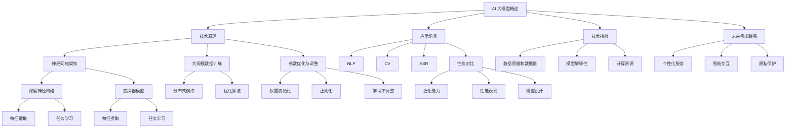

                 

### 1. 背景介绍

#### AI 大模型创业的现状

随着深度学习技术的飞速发展，人工智能（AI）领域已经迎来了一个全新的时代。特别是大模型（Large Models）的应用，如 GPT-3、BERT、LLaMA 等，不仅大大提升了自然语言处理（NLP）的精度，还在图像识别、语音识别等多个领域取得了显著的突破。这使得 AI 大模型成为了科技创业领域的新热点。

当前，越来越多的初创公司投身于 AI 大模型的研究与开发，试图通过技术创新和商业模式的创新，抓住这一历史性的机遇。然而，随着市场的逐步成熟，如何在激烈的竞争中脱颖而出，成为众多创业者面临的挑战。

#### 未来用户需求的变化

未来用户需求的变化是决定 AI 大模型创业成功与否的关键因素。随着技术的不断进步和用户习惯的演变，用户对 AI 大模型的需求也在不断升级。

首先，个性化体验将成为用户的核心需求。用户不再满足于通用的解决方案，而是希望获得更加个性化和定制化的服务。这要求 AI 大模型能够深入理解用户的偏好、行为和需求，提供精准的推荐和解决方案。

其次，智能交互将变得更加普及。用户不再仅仅依赖于传统的命令式交互，而是期望通过自然语言对话、语音识别等方式与 AI 大模型进行交流。这意味着 AI 大模型需要具备更高的语言理解和生成能力，以及更自然的交互体验。

此外，隐私保护和数据安全也将成为用户关注的重点。随着数据隐私法规的日益严格，用户对个人信息的安全性和隐私保护提出了更高的要求。AI 大模型在设计和应用过程中，必须充分考虑数据隐私和安全的保护措施，以赢得用户的信任。

#### 创业者面临的挑战

在 AI 大模型创业过程中，创业者面临着诸多挑战。首先，技术挑战仍然存在。虽然大模型技术已经取得了一定的突破，但如何进一步优化算法、提升模型性能，仍然是一个需要不断探索的问题。此外，如何将复杂的技术转化为用户易于理解和使用的应用，也是创业者需要攻克的一道难题。

其次，商业模式创新是另一大挑战。如何在众多竞争者中脱颖而出，构建一个可持续的商业模式，是每一个创业者都需要深思熟虑的问题。特别是在当前市场竞争激烈的环境下，如何通过独特的价值主张和创新的商业模式赢得用户的认可，是创业者需要面对的挑战。

最后，团队建设和资源整合也是创业者需要重视的问题。一个成功的 AI 大模型创业项目，离不开一支高效、专业的团队和丰富的资源支持。创业者需要具备强大的团队建设能力和资源整合能力，以确保项目的顺利推进。

综上所述，AI 大模型创业面临着诸多机遇和挑战。只有深刻理解未来用户需求的变化，积极应对技术、商业模式和团队建设等方面的挑战，创业者才能在激烈的市场竞争中脱颖而出，实现商业成功。

#### 关键词

AI 大模型、创业、未来用户需求、个性化体验、智能交互、隐私保护、技术挑战、商业模式创新、团队建设

#### Abstract

This article explores the current landscape of AI large model entrepreneurship and the evolving demands of future users. It highlights the challenges faced by entrepreneurs, including technical hurdles, business model innovation, and team building. By understanding and addressing these challenges, entrepreneurs can position themselves to seize the opportunities in the AI large model market. The key topics discussed include personalized experiences, intelligent interactions, privacy protection, and the importance of technical optimization, innovative business models, and efficient team management.

## 2. 核心概念与联系

### 2.1 AI 大模型概述

AI 大模型是人工智能领域的一项核心技术，其核心思想是通过大规模的数据训练和参数优化，构建出一个具有强大知识理解和生成能力的模型。这些模型通常包含数十亿甚至千亿个参数，能够处理复杂的任务，如自然语言处理、图像识别、语音合成等。

### 2.2 大模型的技术原理

大模型的技术原理主要涉及以下几个方面：

- **神经网络架构**：大模型通常采用深度神经网络（DNN）或变换器模型（Transformer）等先进的神经网络架构。这些架构能够有效处理高维数据，并通过多层非线性变换，实现复杂的特征提取和任务学习。
- **大规模数据训练**：大模型的训练依赖于大规模数据集，通过分布式训练和优化算法，实现模型的参数更新和性能提升。常用的训练算法包括梯度下降（Gradient Descent）、Adam 优化器等。
- **参数优化与调整**：大模型的性能优化是一个复杂的过程，需要通过多种技术手段，如权重初始化、正则化、学习率调整等，来优化模型的参数设置，提高模型的泛化能力和鲁棒性。

### 2.3 大模型的应用场景

大模型的应用场景非常广泛，以下是一些典型的应用场景：

- **自然语言处理（NLP）**：大模型在 NLP 领域有着广泛的应用，如机器翻译、文本生成、问答系统等。这些模型通过理解文本的语义和上下文，实现了高精度的语言处理和生成。
- **计算机视觉（CV）**：大模型在 CV 领域的应用也非常广泛，如图像分类、目标检测、图像生成等。这些模型通过学习图像的特征，实现了对图像内容的理解和生成。
- **语音识别（ASR）**：大模型在 ASR 领域的应用，使得语音识别的准确性大大提高。这些模型通过学习语音信号的时频特征，实现了对语音的准确识别和转换。

### 2.4 大模型与传统算法的对比

大模型与传统算法相比，具有以下几个显著优势：

- **更强的泛化能力**：大模型通过大规模数据训练，能够学习到更加丰富的特征和模式，从而具备更强的泛化能力，能够应对更加复杂的任务。
- **更高的性能表现**：大模型在处理高维数据和复杂任务时，能够取得更高的性能表现，特别是在 NLP 和 CV 等领域，大模型的性能已经显著超越了传统的算法。
- **更灵活的模型设计**：大模型采用深度神经网络和变换器等先进的架构，使得模型的设计更加灵活，能够适应不同的任务和数据类型。

然而，大模型也存在一些劣势，如对计算资源的高要求、训练和推理时间较长等。这些劣势在一定程度上限制了大模型的应用范围，但随着硬件技术的发展和优化算法的进步，这些问题正在逐步得到解决。

### 2.5 大模型的技术挑战

大模型在技术方面面临以下几个挑战：

- **数据质量和数据量**：大模型的训练依赖于大规模数据集，但数据质量和数据量的获取是一个难题。特别是在一些特定的领域，如医疗、金融等，数据的质量和隐私保护是一个需要特别注意的问题。
- **模型解释性**：大模型在处理复杂任务时，通常具有较高的性能，但其内部机制和决策过程往往难以解释，这对应用场景中的决策支持和信任构建提出了挑战。
- **计算资源**：大模型的训练和推理通常需要大量的计算资源，这对硬件设备和优化算法提出了更高的要求。

为了应对这些挑战，研究人员和开发者正在不断探索新的技术路径，如数据增强、模型压缩、推理优化等，以提升大模型的应用性能和可解释性。

### 2.6 大模型与未来用户需求的联系

大模型与未来用户需求之间存在紧密的联系。随着技术的不断进步和用户习惯的演变，用户对 AI 大模型的需求也在不断升级。以下是一些具体的应用案例：

- **个性化服务**：通过大模型，可以为用户提供个性化的推荐和服务，如个性化新闻推送、个性化商品推荐等。
- **智能交互**：大模型可以提升智能语音助手、聊天机器人等智能交互系统的能力，提供更加自然、流畅的交互体验。
- **隐私保护**：大模型在设计和应用过程中，需要充分考虑隐私保护和数据安全的措施，以赢得用户的信任。

总之，大模型技术在满足未来用户需求方面具有巨大的潜力，但同时也需要不断创新和优化，以应对技术挑战和用户需求的变化。

#### 核心概念原理和架构的 Mermaid 流程图

#### 关键词

AI 大模型、神经网络架构、大规模数据训练、参数优化、应用场景、性能对比、技术挑战、未来用户需求、个性化服务、智能交互、隐私保护

#### Abstract

This section provides an overview of the key concepts and architectures related to AI large models. It discusses the fundamental principles of large models, including neural network architectures, large-scale data training, and parameter optimization. Additionally, it highlights the various application scenarios of large models in fields such as natural language processing, computer vision, and speech recognition. The comparison between large models and traditional algorithms is also presented, along with the challenges faced by large models in terms of data quality, model interpretability, and computational resources. The connection between large models and future user demands is explored through examples of personalized services, intelligent interactions, and privacy protection. A Mermaid flowchart illustrating the core concepts and architectures is also provided. Key terms and abstract in English are included for better understanding and reference.

