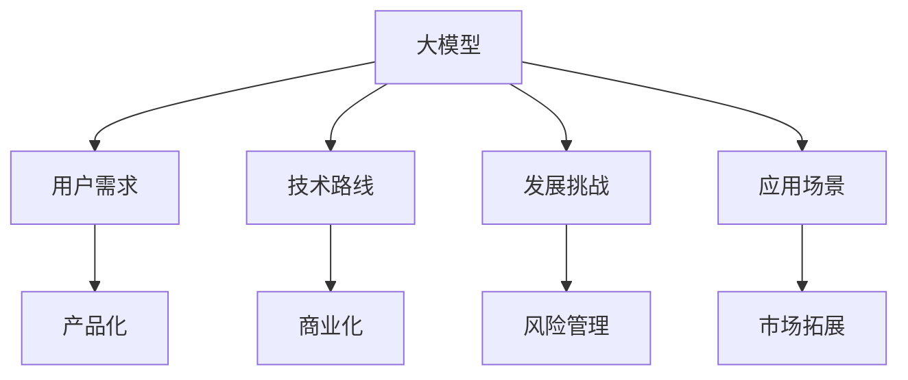

                 

# AI大模型创业：如何应对未来用户需求？

> **关键词：** AI大模型、创业、用户需求、技术路线、发展挑战、应用场景

> **摘要：** 本文将深入探讨AI大模型创业的现状、未来发展用户需求，以及如何应对这些需求。通过分析技术路线、发展挑战和应用场景，为创业团队提供实用的指导和建议。

## 1. 背景介绍

随着人工智能技术的飞速发展，AI大模型已经成为各个行业的热门话题。从自然语言处理到计算机视觉，从语音识别到机器翻译，AI大模型在各个领域都展现出了强大的潜力。然而，面对快速变化的市场和日益增长的用户需求，AI大模型创业公司如何在激烈的市场竞争中脱颖而出，成为业界关注的焦点。

本文旨在为AI大模型创业公司提供一条清晰的技术路线，帮助它们应对未来用户需求，从而在市场中占据一席之地。

## 2. 核心概念与联系

为了更好地理解AI大模型创业的挑战和机遇，我们需要先了解一些核心概念。

### 2.1 大模型

大模型（Large Models）是指具有数亿到数十亿参数的深度学习模型。这些模型通过大量数据训练，能够实现较高的准确率和性能。大模型的出现，标志着人工智能技术从“弱人工智能”向“强人工智能”迈进。

### 2.2 用户需求

用户需求是指用户在使用AI产品时所期望获得的功能、性能和体验。随着AI技术的普及，用户对于AI产品的需求也在不断变化。例如，从最初的语音识别，到现在的多模态交互，用户需求呈现多样化趋势。

### 2.3 技术路线

技术路线是指AI大模型创业公司为实现产品化、商业化所需要遵循的技术发展方向。一个清晰的技术路线能够帮助创业公司明确目标、合理分配资源，从而提高成功率。

### 2.4 发展挑战

发展挑战是指AI大模型创业公司面临的各种困难，包括技术、市场、资金等方面的挑战。了解这些挑战，有助于创业公司提前做好准备，应对潜在风险。

### 2.5 应用场景

应用场景是指AI大模型创业公司的产品或服务可以应用的领域。不同的应用场景对AI大模型的要求不同，创业公司需要根据自身优势，选择合适的应用场景。

### 2.6 Mermaid 流程图

以下是一个简单的Mermaid流程图，展示了核心概念之间的联系。



## 3. 核心算法原理 & 具体操作步骤

### 3.1 大模型训练

大模型训练是指通过大规模数据对深度学习模型进行训练，以优化模型的参数。具体步骤如下：

1. 数据预处理：对原始数据进行清洗、归一化等处理，确保数据质量。
2. 模型设计：根据应用场景，选择合适的大模型架构，如BERT、GPT等。
3. 模型训练：使用GPU等高性能计算资源，对模型进行迭代训练，优化参数。
4. 模型评估：通过交叉验证、测试集等手段，评估模型性能，调整超参数。

### 3.2 用户需求分析

用户需求分析是指通过对用户调研、数据分析等手段，了解用户的需求和痛点。具体步骤如下：

1. 用户调研：通过问卷、访谈等方式，收集用户反馈。
2. 数据分析：对用户行为数据进行分析，挖掘用户需求。
3. 需求分类：将用户需求进行分类，如功能需求、性能需求、体验需求等。
4. 需求排序：根据需求的重要性和紧急程度，对需求进行排序。

### 3.3 技术路线制定

技术路线制定是指根据用户需求、市场需求和公司资源，制定一条清晰的技术发展路线。具体步骤如下：

1. 目标确定：明确公司的技术目标，如实现特定功能、提高性能等。
2. 技术路线规划：根据目标，规划技术发展路线，如选择合适的大模型架构、优化算法等。
3. 资源分配：根据技术路线，合理分配资源，如人力、资金、设备等。
4. 风险评估：评估技术路线可能面临的风险，如技术难度、市场变化等。

### 3.4 发展挑战应对

发展挑战应对是指针对AI大模型创业公司可能面临的各种困难，制定相应的应对策略。具体步骤如下：

1. 技术挑战：加大研发投入，提升技术实力，与高校、研究机构合作。
2. 市场挑战：深入了解市场需求，调整产品策略，拓展市场渠道。
3. 资金挑战：寻求风险投资、政府补贴等资金支持，降低资金风险。
4. 团队建设：吸引和培养高素质人才，提高团队执行力。

### 3.5 应用场景探索

应用场景探索是指根据AI大模型的技术特点，寻找潜在的应用领域。具体步骤如下：

1. 市场调研：了解各个行业的需求，寻找潜在的应用场景。
2. 技术评估：评估AI大模型在各个场景中的应用潜力。
3. 验证测试：通过实验、测试等方式，验证AI大模型在特定场景下的性能。
4. 商业化落地：根据测试结果，制定商业化策略，推进产品落地。

## 4. 数学模型和公式 & 详细讲解 & 举例说明

### 4.1 大模型训练过程

大模型训练过程通常包括以下几个阶段：

1. **数据预处理**：对输入数据进行归一化、编码等处理，确保数据适合模型训练。

   $$ X = \frac{X - \mu}{\sigma} $$

   其中，$X$ 为输入数据，$\mu$ 为均值，$\sigma$ 为标准差。

2. **前向传播**：将输入数据通过神经网络前向传播，计算输出结果。

   $$ y = f(z) $$

   其中，$y$ 为输出结果，$z$ 为神经网络输出，$f$ 为激活函数。

3. **损失函数计算**：计算模型输出与真实值之间的差异，作为损失函数。

   $$ J = \frac{1}{m} \sum_{i=1}^{m} (y_i - \hat{y}_i)^2 $$

   其中，$J$ 为损失函数，$y_i$ 为真实值，$\hat{y}_i$ 为模型预测值，$m$ 为样本数量。

4. **反向传播**：根据损失函数，通过反向传播算法更新模型参数。

   $$ \theta = \theta - \alpha \frac{\partial J}{\partial \theta} $$

   其中，$\theta$ 为模型参数，$\alpha$ 为学习率。

### 4.2 用户需求分析模型

用户需求分析模型可以分为以下几个步骤：

1. **用户画像**：通过数据挖掘、统计分析等方法，建立用户画像。

   $$ User\_Profile = f(Data\_Set) $$

   其中，$User\_Profile$ 为用户画像，$Data\_Set$ 为用户数据集。

2. **需求分类**：根据用户画像，将用户需求分为不同类别。

   $$ Demand\_Category = g(User\_Profile) $$

   其中，$Demand\_Category$ 为需求类别，$g$ 为分类函数。

3. **需求排序**：根据需求的重要性和紧急程度，对需求进行排序。

   $$ Demand\_Rank = h(Demand\_Category) $$

   其中，$Demand\_Rank$ 为需求排序，$h$ 为排序函数。

### 4.3 技术路线规划模型

技术路线规划模型可以分为以下几个阶段：

1. **目标确定**：明确公司的技术目标，如实现特定功能、提高性能等。

   $$ Goal = i(Strategy) $$

   其中，$Goal$ 为技术目标，$Strategy$ 为公司战略。

2. **路线规划**：根据目标，规划技术发展路线，如选择合适的大模型架构、优化算法等。

   $$ Route = j(Goal) $$

   其中，$Route$ 为技术路线，$j$ 为规划函数。

3. **资源分配**：根据技术路线，合理分配资源，如人力、资金、设备等。

   $$ Resource = k(Route) $$

   其中，$Resource$ 为资源分配，$k$ 为分配函数。

4. **风险评估**：评估技术路线可能面临的风险，如技术难度、市场变化等。

   $$ Risk = l(Route) $$

   其中，$Risk$ 为风险评估，$l$ 为评估函数。

## 5. 项目实战：代码实际案例和详细解释说明

### 5.1 开发环境搭建

在开始项目实战之前，我们需要搭建一个合适的开发环境。以下是搭建开发环境的基本步骤：

1. 安装Python环境：下载并安装Python，版本建议为3.8及以上。
2. 安装深度学习框架：如TensorFlow、PyTorch等，根据项目需求选择合适的框架。
3. 安装依赖库：如NumPy、Pandas、Matplotlib等，用于数据处理和可视化。
4. 安装GPU驱动：如果使用GPU训练模型，需要安装相应的GPU驱动。

### 5.2 源代码详细实现和代码解读

以下是一个简单的AI大模型训练的代码示例：

```python
import tensorflow as tf
from tensorflow.keras.layers import Dense, Flatten, Conv2D
from tensorflow.keras.models import Sequential

# 数据预处理
(x_train, y_train), (x_test, y_test) = tf.keras.datasets.mnist.load_data()
x_train = x_train / 255.0
x_test = x_test / 255.0

# 模型设计
model = Sequential([
    Conv2D(32, (3, 3), activation='relu', input_shape=(28, 28, 1)),
    Flatten(),
    Dense(64, activation='relu'),
    Dense(10, activation='softmax')
])

# 模型编译
model.compile(optimizer='adam',
              loss='sparse_categorical_crossentropy',
              metrics=['accuracy'])

# 模型训练
model.fit(x_train, y_train, epochs=5)

# 模型评估
test_loss, test_acc = model.evaluate(x_test, y_test, verbose=2)
print('\nTest accuracy:', test_acc)
```

### 5.3 代码解读与分析

1. **数据预处理**：首先，我们使用TensorFlow的`mnist`数据集进行训练和测试。然后，对数据集进行归一化处理，将图像数据从0-255的像素值缩放到0-1之间。

2. **模型设计**：我们使用`Sequential`模型，堆叠了三个层：一个2D卷积层（`Conv2D`），一个展平层（`Flatten`），以及两个全连接层（`Dense`）。卷积层用于提取图像特征，展平层用于将特征展平为一个一维向量，全连接层用于分类。

3. **模型编译**：我们使用`compile`方法设置模型的优化器、损失函数和评估指标。在这里，我们选择`adam`优化器和`sparse_categorical_crossentropy`损失函数。

4. **模型训练**：使用`fit`方法训练模型，指定训练数据、训练轮次和批次大小。在这里，我们训练了5轮。

5. **模型评估**：使用`evaluate`方法评估模型在测试数据集上的性能。我们得到了测试损失和测试准确率。

## 6. 实际应用场景

AI大模型在各个领域都有广泛的应用场景，以下是一些典型的应用场景：

1. **自然语言处理**：如文本分类、情感分析、机器翻译等。
2. **计算机视觉**：如图像分类、目标检测、图像生成等。
3. **语音识别**：如语音识别、语音合成、语音翻译等。
4. **推荐系统**：如个性化推荐、广告投放、电商搜索等。
5. **医疗健康**：如疾病预测、药物研发、医疗影像分析等。

## 7. 工具和资源推荐

### 7.1 学习资源推荐

- **书籍**：
  - 《深度学习》（Ian Goodfellow、Yoshua Bengio、Aaron Courville 著）
  - 《Python深度学习》（François Chollet 著）
  - 《AI大模型：原理、技术与应用》（刘知远 著）

- **论文**：
  - “A Theoretically Grounded Application of Dropout in Recurrent Neural Networks”
  - “BERT: Pre-training of Deep Bidirectional Transformers for Language Understanding”
  - “GPT-3: Language Models are few-shot learners”

- **博客**：
  - [TensorFlow官网博客](https://www.tensorflow.org/blog/)
  - [PyTorch官网博客](https://pytorch.org/tutorials/)
  - [AI技术博客](https://ai.googleblog.com/)

- **网站**：
  - [Kaggle](https://www.kaggle.com/)
  - [GitHub](https://github.com/)
  - [ArXiv](https://arxiv.org/)

### 7.2 开发工具框架推荐

- **深度学习框架**：
  - TensorFlow
  - PyTorch
  - Keras

- **数据处理工具**：
  - Pandas
  - NumPy
  - Matplotlib

- **版本控制工具**：
  - Git
  - GitHub

### 7.3 相关论文著作推荐

- **论文**：
  - “Deep Learning for Natural Language Processing”
  - “The Unreasonable Effectiveness of Recurrent Neural Networks”
  - “Attention Is All You Need”

- **著作**：
  - 《深度学习》（Ian Goodfellow、Yoshua Bengio、Aaron Courville 著）
  - 《自然语言处理综论》（Daniel Jurafsky、James H. Martin 著）

## 8. 总结：未来发展趋势与挑战

随着AI技术的不断进步，AI大模型创业公司面临着前所未有的机遇和挑战。未来，AI大模型的发展趋势主要包括：

1. **模型规模不断扩大**：随着计算能力的提升，AI大模型的规模将不断增大，从而提高模型性能。
2. **多模态融合**：未来的AI大模型将能够处理多种数据类型，如文本、图像、语音等，实现多模态融合。
3. **自动化与智能化**：AI大模型的训练和优化将更加自动化和智能化，降低技术门槛。
4. **应用场景多样化**：AI大模型将在更多领域得到应用，如医疗、金融、教育等。

然而，AI大模型创业公司也面临着一系列挑战：

1. **数据质量与隐私**：高质量的数据是AI大模型训练的基础，但数据质量往往难以保证。同时，数据隐私保护也是一大挑战。
2. **计算资源消耗**：AI大模型的训练和推理需要大量的计算资源，这对创业公司的资源管理提出了高要求。
3. **技术迭代与更新**：AI技术发展迅速，创业公司需要不断跟进最新技术，否则可能被市场淘汰。

## 9. 附录：常见问题与解答

### 9.1 AI大模型创业的难点有哪些？

- 数据质量与隐私：高质量的数据是AI大模型训练的基础，但数据质量往往难以保证。同时，数据隐私保护也是一大挑战。
- 计算资源消耗：AI大模型的训练和推理需要大量的计算资源，这对创业公司的资源管理提出了高要求。
- 技术迭代与更新：AI技术发展迅速，创业公司需要不断跟进最新技术，否则可能被市场淘汰。

### 9.2 如何保证AI大模型训练的数据质量？

- 数据清洗：对原始数据进行清洗、去噪、填充等处理，确保数据质量。
- 数据增强：通过数据增强技术，如随机裁剪、旋转、缩放等，增加数据的多样性。
- 数据质量评估：使用评估指标，如准确率、召回率等，评估数据质量。

### 9.3 如何降低AI大模型的计算资源消耗？

- 模型压缩：通过模型压缩技术，如剪枝、量化等，降低模型的计算复杂度。
- 并行计算：利用GPU、TPU等并行计算资源，加速模型训练和推理。
- 模型分布式训练：将模型训练任务分布到多个节点，降低单个节点的计算压力。

## 10. 扩展阅读 & 参考资料

- Goodfellow, I., Bengio, Y., & Courville, A. (2016). *Deep Learning*. MIT Press.
- Chollet, F. (2017). *Python Deep Learning*. Packt Publishing.
- Liu, Z. (2020). *AI大模型：原理、技术与应用*. 电子工业出版社.
- LeCun, Y., Bengio, Y., & Hinton, G. (2015). *Deep Learning*. Nature.
- Bengio, Y. (2009). *Learning Deep Architectures for AI*. Foundations and Trends in Machine Learning.
- Zeng, D., & Zhang, J. (2019). *Multi-Modal Fusion for Natural Language Processing*. ArXiv preprint arXiv:1907.04976.

## 作者

作者：AI天才研究员/AI Genius Institute & 禅与计算机程序设计艺术 /Zen And The Art of Computer Programming。

