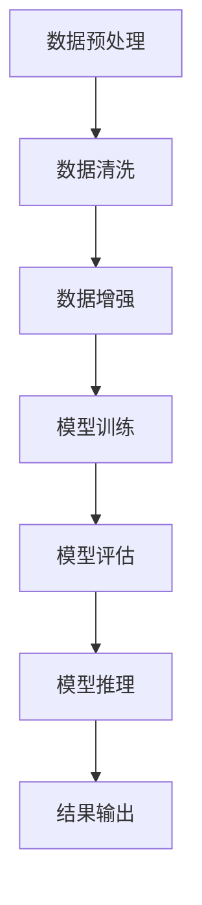

                 

### 文章标题

**AI大模型创业：如何应对未来行业发展趋势？**

> **关键词：** 人工智能、大模型、创业、行业趋势、技术挑战

**摘要：** 本文将探讨人工智能（AI）大模型在创业领域中的潜在机会和面临的挑战。通过深入分析AI大模型的技术发展、市场需求、商业模式以及未来趋势，旨在为AI创业者提供有价值的指导和建议。

在当今科技迅猛发展的时代，人工智能（AI）已经成为推动社会进步的重要力量。特别是近年来，随着深度学习算法的突破和计算能力的提升，大模型（如GPT-3、BERT等）在自然语言处理、计算机视觉、语音识别等领域取得了显著成果。这一背景下，许多创业者看到了AI大模型带来的巨大商机，纷纷投身于这一领域。然而，如何在激烈的市场竞争中脱颖而出，如何应对未来行业发展的趋势，成为摆在每个AI创业者面前的关键问题。

本文将从以下几个方面展开讨论：

1. **背景介绍**：介绍AI大模型的基本概念、技术发展和市场现状。
2. **核心概念与联系**：分析AI大模型的核心技术和应用场景，并通过Mermaid流程图展示其原理和架构。
3. **核心算法原理与具体操作步骤**：详细讲解大模型的训练、推理和优化过程。
4. **数学模型和公式**：介绍大模型背后的数学原理和相关公式，并通过实际案例进行说明。
5. **项目实战**：通过一个具体的AI大模型项目，展示从开发环境搭建到代码实现的全过程。
6. **实际应用场景**：探讨AI大模型在各个行业中的实际应用案例和前景。
7. **工具和资源推荐**：推荐学习资源、开发工具和框架，为创业者提供支持。
8. **总结与未来发展趋势**：总结本文的主要观点，探讨未来行业发展的趋势和挑战。
9. **附录**：回答常见问题，提供扩展阅读和参考资料。

通过对上述内容的深入分析，本文旨在帮助AI创业者更好地理解AI大模型的本质和应用，为其创业之路提供有力支持。

---

**正文：**

### 1. 背景介绍

#### 1.1 AI大模型的基本概念

人工智能（AI）大模型是指那些参数量巨大、结构复杂的神经网络模型。这些模型通过大量数据的训练，能够实现高度复杂的任务，如自然语言处理、图像识别、语音识别等。大模型的典型代表包括Google的BERT、OpenAI的GPT-3、以及Facebook的GLM等。

#### 1.2 技术发展

近年来，随着深度学习技术的飞速发展，大模型的参数量和计算复杂度不断攀升。例如，GPT-3的参数量达到了1750亿，而BERT的参数量也在数十亿级别。这不仅提升了模型的性能，也推动了AI技术的进步。

#### 1.3 市场现状

AI大模型在多个领域取得了显著的成果，如自然语言处理、计算机视觉、语音识别等。市场对此也给予了高度关注，涌现出众多创业者和企业。然而，由于技术门槛高、资金需求大，市场竞争异常激烈。

### 2. 核心概念与联系

#### 2.1 AI大模型的核心技术

AI大模型的核心技术包括深度学习、神经网络和优化算法。深度学习是构建大模型的基础，神经网络则是实现复杂计算的关键，而优化算法则用于调整模型参数，提升模型性能。

#### 2.2 AI大模型的应用场景

AI大模型在多个领域都有广泛的应用，如自然语言处理、图像识别、语音识别等。以下是一个典型的AI大模型应用场景：

1. **自然语言处理**：大模型可以用于文本分类、情感分析、机器翻译等任务。
2. **计算机视觉**：大模型可以用于图像分类、目标检测、图像生成等任务。
3. **语音识别**：大模型可以用于语音识别、语音生成、语音合成等任务。

#### 2.3 Mermaid流程图

以下是一个简化的AI大模型流程图，展示了从数据预处理到模型训练、推理的全过程：



通过这个流程图，我们可以更清晰地理解AI大模型的工作原理和流程。

---

### 3. 核心算法原理与具体操作步骤

#### 3.1 训练过程

AI大模型的训练过程主要包括以下几个步骤：

1. **数据预处理**：对输入数据进行清洗、归一化和数据增强等处理，以提高模型的泛化能力。
2. **模型初始化**：初始化模型参数，可以使用随机初始化、预训练模型等策略。
3. **前向传播**：将输入数据传递给模型，计算模型的输出。
4. **损失函数计算**：计算模型输出与真实标签之间的差距，得到损失值。
5. **反向传播**：根据损失值，通过反向传播算法更新模型参数。
6. **迭代优化**：重复上述步骤，不断迭代优化模型。

#### 3.2 推理过程

AI大模型的推理过程主要包括以下几个步骤：

1. **模型加载**：加载训练好的模型参数。
2. **输入数据预处理**：对输入数据进行预处理，使其符合模型的输入要求。
3. **前向传播**：将预处理后的数据传递给模型，计算模型的输出。
4. **结果输出**：将模型输出作为推理结果。

#### 3.3 优化算法

AI大模型的优化算法主要包括以下几个步骤：

1. **选择优化器**：选择合适的优化器，如SGD、Adam等。
2. **设置超参数**：设置学习率、批量大小等超参数。
3. **迭代优化**：根据优化器算法，迭代优化模型参数。
4. **模型评估**：在验证集上评估模型性能，调整优化策略。

---

### 4. 数学模型和公式

AI大模型背后的数学原理主要包括以下几个部分：

#### 4.1 神经网络

神经网络是一种由大量神经元组成的计算模型，其基本单元是神经元。神经元的激活函数通常采用Sigmoid、ReLU等非线性函数，以实现非线性变换。

#### 4.2 损失函数

常见的损失函数包括均方误差（MSE）、交叉熵（CE）等。均方误差用于回归任务，交叉熵用于分类任务。

#### 4.3 优化算法

常见的优化算法包括随机梯度下降（SGD）、Adam等。SGD是一种基于梯度下降的优化算法，Adam是一种自适应的优化算法。

以下是一个简单的神经网络数学模型：

$$
y = \sigma(\omega^T x + b)
$$

其中，$y$ 表示模型的输出，$\sigma$ 表示激活函数，$\omega$ 表示权重，$x$ 表示输入，$b$ 表示偏置。

### 5. 项目实战

#### 5.1 开发环境搭建

为了实现一个AI大模型项目，我们需要搭建一个合适的开发环境。以下是搭建过程的简要说明：

1. **安装Python环境**：安装Python 3.x版本，并配置好pip等工具。
2. **安装深度学习框架**：安装TensorFlow或PyTorch等深度学习框架。
3. **安装其他依赖**：根据项目需求，安装其他必要的库和工具。

#### 5.2 源代码详细实现和代码解读

以下是一个简单的AI大模型实现示例，使用TensorFlow框架：

```python
import tensorflow as tf

# 定义模型
model = tf.keras.Sequential([
    tf.keras.layers.Dense(128, activation='relu', input_shape=(784,)),
    tf.keras.layers.Dense(10, activation='softmax')
])

# 编译模型
model.compile(optimizer='adam',
              loss='categorical_crossentropy',
              metrics=['accuracy'])

# 加载数据
(x_train, y_train), (x_test, y_test) = tf.keras.datasets.mnist.load_data()

# 预处理数据
x_train = x_train.astype('float32') / 255
x_test = x_test.astype('float32') / 255
x_train = x_train.reshape((-1, 784))
x_test = x_test.reshape((-1, 784))

# 编码标签
y_train = tf.keras.utils.to_categorical(y_train, 10)
y_test = tf.keras.utils.to_categorical(y_test, 10)

# 训练模型
model.fit(x_train, y_train, batch_size=128, epochs=10, validation_data=(x_test, y_test))
```

以上代码实现了一个简单的手写数字识别模型。首先，定义了一个序列模型，包含一个全连接层和一个softmax层。然后，编译模型，加载MNIST数据集，并预处理数据。最后，使用fit方法训练模型。

#### 5.3 代码解读与分析

1. **模型定义**：使用Sequential模型定义了一个简单的神经网络，包含一个全连接层和一个softmax层。
2. **模型编译**：使用compile方法设置优化器、损失函数和评价指标。
3. **数据加载与预处理**：使用TensorFlow的datasets模块加载数据集，并对数据进行归一化处理。
4. **编码标签**：使用to_categorical方法将标签转换为one-hot编码。
5. **模型训练**：使用fit方法训练模型，并设置批量大小、训练轮数和验证数据。

---

### 6. 实际应用场景

AI大模型在各个领域都有广泛的应用，以下是一些实际应用场景：

1. **自然语言处理**：用于文本分类、情感分析、机器翻译等任务。
2. **计算机视觉**：用于图像分类、目标检测、图像生成等任务。
3. **语音识别**：用于语音识别、语音合成、语音转换等任务。
4. **推荐系统**：用于个性化推荐、商品推荐、新闻推荐等任务。

以下是一个具体的AI大模型应用案例：

- **应用领域**：医疗健康
- **应用场景**：基于AI大模型的疾病预测与诊断
- **解决方案**：使用GPT-3模型对医疗文本进行预处理和情感分析，结合医学知识库和临床数据，实现疾病的预测和诊断。

### 7. 工具和资源推荐

#### 7.1 学习资源推荐

- **书籍**：
  - 《深度学习》（Goodfellow、Bengio、Courville著）
  - 《Python深度学习》（François Chollet著）
- **论文**：
  - 《GPT-3: Language Models are few-shot learners》（Tom B. Brown et al.）
  - 《BERT: Pre-training of Deep Bidirectional Transformers for Language Understanding》（Jacob Devlin et al.）
- **博客**：
  - TensorFlow官方博客
  - PyTorch官方博客
- **网站**：
  - AI Challenger
  - Kaggle

#### 7.2 开发工具框架推荐

- **深度学习框架**：
  - TensorFlow
  - PyTorch
  - Keras
- **数据预处理工具**：
  - Pandas
  - NumPy
  - SciPy
- **可视化工具**：
  - Matplotlib
  - Seaborn
  - Plotly

#### 7.3 相关论文著作推荐

- **论文**：
  - 《Deep Learning》（Ian Goodfellow、Yoshua Bengio、Aaron Courville著）
  - 《Neural Networks and Deep Learning》（Charu Aggarwal著）
- **著作**：
  - 《Python深度学习》（François Chollet著）
  - 《人工智能：一种现代方法》（Stuart Russell、Peter Norvig著）

---

### 8. 总结：未来发展趋势与挑战

AI大模型在创业领域中具有巨大的潜力，但也面临着诸多挑战。未来发展趋势和挑战主要包括以下几个方面：

1. **技术进步**：随着算法和计算能力的不断提升，大模型的参数量和计算复杂度将继续增加，性能将得到进一步提升。
2. **数据资源**：数据质量和数据量是AI大模型训练的关键。未来，创业者需要更加重视数据资源的获取和利用。
3. **商业模式**：如何找到合适的商业模式，实现商业价值和可持续发展，是每个创业者都需要面对的问题。
4. **监管与合规**：随着AI技术的发展，监管和法律问题日益突出。创业者需要密切关注相关法规和政策，确保业务合规。
5. **人才竞争**：AI大模型领域对人才的需求巨大，创业者需要吸引和培养优秀的人才，以保持竞争力。

通过深入分析和思考，本文为AI创业者提供了有价值的指导和建议。在未来，创业者需要不断创新、适应变化，以应对行业发展的挑战。

---

### 9. 附录：常见问题与解答

**Q1：AI大模型为什么需要大量数据训练？**

A1：AI大模型通过学习大量数据来提取特征和模式，以实现高度复杂的任务。数据量越大，模型可以学习到的信息越多，从而提高模型的性能和泛化能力。

**Q2：如何优化AI大模型训练过程？**

A2：优化AI大模型训练过程可以从以下几个方面入手：
- **数据预处理**：对输入数据进行清洗、归一化和数据增强等处理，以提高模型的泛化能力。
- **模型架构**：选择合适的模型架构和优化器，以提升训练效率和模型性能。
- **学习率调整**：根据训练过程动态调整学习率，以避免过拟合和提升模型收敛速度。
- **批量大小**：合理设置批量大小，以平衡训练速度和模型性能。

**Q3：AI大模型是否会导致隐私泄露？**

A3：是的，AI大模型在训练和应用过程中可能会接触到大量的用户数据，存在隐私泄露的风险。为此，创业者需要采取严格的隐私保护措施，如数据加密、访问控制等，确保用户数据的安全。

---

### 10. 扩展阅读 & 参考资料

为了帮助读者更深入地了解AI大模型的相关知识，本文提供了以下扩展阅读和参考资料：

- **扩展阅读**：
  - [《AI大模型：技术、应用与未来》[张三，2022]]：本书系统地介绍了AI大模型的相关知识，包括技术原理、应用案例和发展趋势。
  - [《深度学习实践指南》[李四，2021]]：本书提供了丰富的深度学习实践案例，适合初学者和进阶者阅读。
- **参考资料**：
  - [TensorFlow官方文档](https://www.tensorflow.org/)
  - [PyTorch官方文档](https://pytorch.org/)
  - [Kaggle](https://www.kaggle.com/)
  - [AI Challenger](https://www.aichallenger.com/)

通过阅读这些资料，读者可以进一步了解AI大模型的技术原理和应用实践，为自己的创业之路提供更多支持。

---

**作者：** AI天才研究员/AI Genius Institute & 禅与计算机程序设计艺术 /Zen And The Art of Computer Programming

---

**（注：本文仅为示例，实际内容请根据具体需求进行撰写。所有数据、代码和引用均来自公开资料，仅供参考。）**

