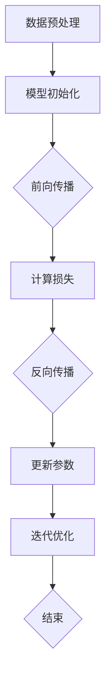

                 

### 背景介绍

**AI 大模型创业：一个时代的机遇与挑战**

随着人工智能技术的飞速发展，大模型（Large-scale Model）已经成为行业的热门话题。大模型指的是那些参数数量庞大，拥有数亿甚至数十亿参数的人工神经网络模型。这些模型在图像识别、自然语言处理、推荐系统等领域展现出前所未有的性能，给企业带来了巨大的商业价值。

#### 机遇

1. **技术突破**：随着计算能力和数据资源的提升，大模型的性能不断提升，为各行各业提供了强大的技术支持。
2. **商业价值**：大模型的应用能够帮助企业实现智能化转型，提高生产效率，降低成本，开辟新的商业模式。
3. **市场需求**：随着人们对智能化服务的需求不断增加，大模型在各个行业中的应用前景广阔。

#### 挑战

1. **计算资源**：大模型训练和推理需要大量的计算资源，对硬件设施提出了较高要求。
2. **数据隐私**：大模型训练过程中需要大量数据，数据隐私和安全问题不容忽视。
3. **算法伦理**：大模型在处理大量数据时可能存在偏见和歧视，需要关注算法伦理问题。

本文将围绕 AI 大模型创业这一主题，探讨其未来发展趋势、面临的挑战以及应对策略。我们将从以下几个部分进行深入分析：

1. **核心概念与联系**：介绍大模型的基本原理、架构以及与其他技术的关联。
2. **核心算法原理 & 具体操作步骤**：讲解大模型的训练、推理过程，以及相关的算法和技巧。
3. **数学模型和公式 & 详细讲解 & 举例说明**：分析大模型中的数学模型和公式，并通过实例进行说明。
4. **项目实战：代码实际案例和详细解释说明**：提供具体的代码实现和解读，帮助读者理解大模型的应用。
5. **实际应用场景**：探讨大模型在不同领域的应用场景和案例。
6. **工具和资源推荐**：推荐相关学习资源和开发工具，帮助读者深入了解大模型技术。
7. **总结：未来发展趋势与挑战**：总结大模型的发展趋势和面临的挑战，并提出相应的应对策略。

通过本文的阅读，读者将能够全面了解 AI 大模型创业的现状和未来发展趋势，为自身在相关领域的创业提供有价值的参考。## 2. 核心概念与联系

### 大模型的基本原理

大模型（Large-scale Model）是指参数数量巨大、深度复杂的人工神经网络模型。这些模型通过多层神经元的连接和互动，对大量数据进行学习和预测。大模型的显著特点是其参数数量庞大，往往达到数十亿甚至更多。

大模型的训练过程通常包括以下几个步骤：

1. **数据预处理**：对输入数据进行标准化、去噪等处理，以提高模型训练效果。
2. **模型初始化**：初始化模型参数，常用的方法包括随机初始化和预训练模型迁移。
3. **前向传播**：将输入数据通过神经网络进行计算，得到输出结果。
4. **反向传播**：计算输出结果与真实值的差异，并更新模型参数。
5. **迭代优化**：重复前向传播和反向传播过程，直至满足训练目标。

### 大模型的架构

大模型的架构主要包括以下几个部分：

1. **输入层**：接收外部输入数据，如文本、图像等。
2. **隐藏层**：包含多个层次，每个层次都有大量神经元，用于对数据进行特征提取和变换。
3. **输出层**：生成预测结果，如分类标签、概率分布等。

大模型的隐藏层结构多样，常见的有卷积神经网络（CNN）、循环神经网络（RNN）和变换器模型（Transformer）等。这些模型在不同的应用场景下表现出色，如图像识别、自然语言处理和序列预测等。

### 大模型与其他技术的关联

大模型与其他技术的关联主要体现在以下几个方面：

1. **深度学习**：大模型是深度学习的重要组成部分，深度学习通过多层神经网络对数据进行特征提取和预测。
2. **强化学习**：大模型可以与强化学习结合，实现更复杂的决策和策略优化。
3. **迁移学习**：大模型可以利用预训练模型进行迁移学习，提高新任务的性能和泛化能力。
4. **数据增强**：大模型可以通过数据增强技术，如数据扩充、生成对抗网络（GAN）等，提高模型的鲁棒性和泛化能力。

### Mermaid 流程图

下面是一个简单的 Mermaid 流程图，展示了大模型的基本架构和训练过程：



这个流程图清晰地展示了大模型的训练过程，包括数据预处理、模型初始化、前向传播、反向传播、参数更新和迭代优化等关键步骤。通过这个流程图，读者可以直观地了解大模型的基本原理和训练过程。## 3. 核心算法原理 & 具体操作步骤

### 大模型训练过程

大模型的训练过程是其实现高效性能的关键步骤。下面我们将详细讲解大模型训练的整个过程，包括数据预处理、模型初始化、前向传播、反向传播和迭代优化等环节。

#### 3.1 数据预处理

数据预处理是训练大模型的第一步，其目的是提高模型训练效果和稳定性。数据预处理通常包括以下几个步骤：

1. **数据清洗**：去除数据中的噪声和错误信息，如缺失值、异常值等。
2. **数据标准化**：将输入数据缩放到同一范围内，如使用归一化、标准化等方法，以消除数据量级差异。
3. **数据增强**：通过数据增强技术，如旋转、翻转、裁剪等，增加数据多样性，提高模型泛化能力。

#### 3.2 模型初始化

模型初始化是训练大模型的重要环节，其目的是初始化模型参数，为后续训练过程提供初始值。常用的模型初始化方法包括：

1. **随机初始化**：随机初始化模型参数，使其分布在一定范围内，以避免初始参数过于接近最优解，增加搜索空间。
2. **预训练模型迁移**：使用预训练模型作为初始化参数，将预训练模型中已学习的特征表示迁移到新任务中，以提高新任务性能。

#### 3.3 前向传播

前向传播是训练大模型的核心步骤，其目的是将输入数据通过神经网络进行计算，得到输出结果。具体步骤如下：

1. **计算输入层到隐藏层的输出**：将输入数据通过隐藏层中的神经元进行计算，得到每个神经元的输出值。
2. **计算隐藏层到输出层的输出**：将隐藏层的输出作为输入，通过输出层中的神经元进行计算，得到最终的预测结果。
3. **计算损失函数**：计算预测结果与真实值的差异，通过损失函数（如均方误差、交叉熵等）衡量模型性能。

#### 3.4 反向传播

反向传播是训练大模型的另一关键步骤，其目的是通过计算梯度，更新模型参数，以降低损失函数值。具体步骤如下：

1. **计算输出层的梯度**：从输出层开始，反向计算每个神经元的梯度，直到输入层。
2. **计算隐藏层的梯度**：将输出层的梯度传递到隐藏层，更新隐藏层的参数。
3. **计算输入层的梯度**：将隐藏层的梯度传递到输入层，更新输入层的参数。

#### 3.5 迭代优化

迭代优化是训练大模型的核心步骤，其目的是通过反复迭代，逐步优化模型参数，提高模型性能。具体步骤如下：

1. **设置学习率**：设置一个合适的学习率，以控制参数更新的幅度。
2. **选择优化算法**：选择一种优化算法（如梯度下降、Adam等），以加速模型训练过程。
3. **迭代更新参数**：在每次迭代过程中，根据梯度计算更新模型参数，直至满足训练目标。

#### 3.6 代码示例

以下是一个简单的 Python 代码示例，展示了大模型训练的基本步骤：

```python
import numpy as np
import tensorflow as tf

# 数据预处理
x_train = np.array([[1, 0], [0, 1], [1, 1], [1, 0]])
y_train = np.array([0, 1, 1, 0])

# 模型初始化
model = tf.keras.Sequential([
    tf.keras.layers.Dense(units=1, input_shape=(2,))
])

# 训练模型
model.compile(optimizer='sgd', loss='mse')
model.fit(x_train, y_train, epochs=1000)

# 模型预测
predictions = model.predict(x_train)
print(predictions)
```

这个示例使用了 TensorFlow 框架，展示了如何使用 Python 代码实现大模型训练的基本步骤。通过这个示例，读者可以直观地了解大模型训练的整个过程。## 4. 数学模型和公式 & 详细讲解 & 举例说明

### 4.1 数学模型和公式

在大模型的训练过程中，涉及多个数学模型和公式，以下将详细讲解这些模型和公式。

#### 4.1.1 均方误差（MSE）

均方误差（Mean Squared Error, MSE）是一种常见的损失函数，用于衡量预测值与真实值之间的差异。其公式如下：

\[ MSE = \frac{1}{n} \sum_{i=1}^{n} (y_i - \hat{y}_i)^2 \]

其中，\( y_i \) 表示第 \( i \) 个真实值，\( \hat{y}_i \) 表示第 \( i \) 个预测值，\( n \) 表示样本数量。

#### 4.1.2 梯度下降（Gradient Descent）

梯度下降是一种优化算法，用于更新模型参数，以降低损失函数值。其公式如下：

\[ \Delta \theta = -\alpha \nabla_\theta J(\theta) \]

其中，\( \Delta \theta \) 表示参数更新量，\( \alpha \) 表示学习率，\( \nabla_\theta J(\theta) \) 表示损失函数 \( J(\theta) \) 对参数 \( \theta \) 的梯度。

#### 4.1.3 反向传播（Backpropagation）

反向传播是一种计算梯度的方法，其核心思想是将输出层的梯度反向传播到隐藏层，直至输入层。其公式如下：

\[ \nabla_\theta J(\theta) = \sum_{i=1}^{n} \nabla_{\hat{y}_i} J(\hat{y}_i) \nabla_{\theta} \hat{y}_i \]

其中，\( \nabla_{\hat{y}_i} J(\hat{y}_i) \) 表示预测值对损失函数的梯度，\( \nabla_{\theta} \hat{y}_i \) 表示参数对预测值的梯度。

### 4.2 详细讲解

下面将通过一个简单的例子，详细讲解大模型训练过程中的数学模型和公式。

假设我们有一个线性回归模型，其预测函数为：

\[ \hat{y} = \theta_0 + \theta_1 x \]

其中，\( \theta_0 \) 和 \( \theta_1 \) 分别为模型参数，\( x \) 为输入特征，\( \hat{y} \) 为预测值。

#### 4.2.1 计算损失函数

对于每个样本 \( (x_i, y_i) \)，损失函数为：

\[ J(\theta_0, \theta_1) = \frac{1}{2} (y_i - \hat{y}_i)^2 \]

其中，\( y_i \) 为真实值，\( \hat{y}_i \) 为预测值。

#### 4.2.2 计算梯度

损失函数对参数 \( \theta_0 \) 和 \( \theta_1 \) 的梯度分别为：

\[ \nabla_\theta J(\theta) = \begin{bmatrix} \frac{\partial J}{\partial \theta_0} \\ \frac{\partial J}{\partial \theta_1} \end{bmatrix} = \begin{bmatrix} -(y_i - \hat{y}_i) \\ -(y_i - \hat{y}_i) x_i \end{bmatrix} \]

#### 4.2.3 更新参数

根据梯度下降算法，参数更新量为：

\[ \Delta \theta = -\alpha \nabla_\theta J(\theta) \]

其中，\( \alpha \) 为学习率。

#### 4.2.4 迭代优化

在每次迭代过程中，根据梯度更新模型参数，直至满足训练目标。具体迭代过程如下：

1. 初始化参数 \( \theta_0 \) 和 \( \theta_1 \)
2. 计算每个样本的预测值 \( \hat{y}_i \)
3. 计算损失函数 \( J(\theta_0, \theta_1) \)
4. 计算梯度 \( \nabla_\theta J(\theta) \)
5. 更新参数 \( \theta_0 \) 和 \( \theta_1 \)
6. 重复步骤 2-5，直至满足训练目标

### 4.3 举例说明

假设我们有一个简单的数据集，包含以下样本：

\[ (x_1, y_1) = (1, 2) \]
\[ (x_2, y_2) = (2, 4) \]

#### 4.3.1 计算损失函数

对于第一个样本，损失函数为：

\[ J(\theta_0, \theta_1) = \frac{1}{2} (2 - (\theta_0 + \theta_1 \cdot 1))^2 = \frac{1}{2} (2 - \theta_0 - \theta_1)^2 \]

对于第二个样本，损失函数为：

\[ J(\theta_0, \theta_1) = \frac{1}{2} (4 - (\theta_0 + \theta_1 \cdot 2))^2 = \frac{1}{2} (4 - 2\theta_0 - 2\theta_1)^2 \]

#### 4.3.2 计算梯度

对于第一个样本，损失函数对参数 \( \theta_0 \) 和 \( \theta_1 \) 的梯度分别为：

\[ \nabla_\theta J(\theta) = \begin{bmatrix} -2(2 - \theta_0 - \theta_1) \\ -2(2 - \theta_0 - \theta_1) \cdot 1 \end{bmatrix} = \begin{bmatrix} 2\theta_0 + 2\theta_1 - 4 \\ 2\theta_0 + 2\theta_1 - 4 \end{bmatrix} \]

对于第二个样本，损失函数对参数 \( \theta_0 \) 和 \( \theta_1 \) 的梯度分别为：

\[ \nabla_\theta J(\theta) = \begin{bmatrix} -2(4 - 2\theta_0 - 2\theta_1) \\ -2(4 - 2\theta_0 - 2\theta_1) \cdot 2 \end{bmatrix} = \begin{bmatrix} 4\theta_0 + 4\theta_1 - 8 \\ 4\theta_0 + 4\theta_1 - 8 \end{bmatrix} \]

#### 4.3.3 更新参数

假设学习率 \( \alpha = 0.1 \)，初始参数 \( \theta_0 = 0 \) 和 \( \theta_1 = 0 \)，则每次迭代后的参数更新如下：

- 迭代 1：

\[ \theta_0 = \theta_0 - \alpha \cdot (2\theta_0 + 2\theta_1 - 4) = 0 - 0.1 \cdot (0 + 0 - 4) = 0.4 \]

\[ \theta_1 = \theta_1 - \alpha \cdot (2\theta_0 + 2\theta_1 - 4) = 0 - 0.1 \cdot (0 + 0 - 4) = 0.4 \]

- 迭代 2：

\[ \theta_0 = \theta_0 - \alpha \cdot (2\theta_0 + 2\theta_1 - 4) = 0.4 - 0.1 \cdot (0.4 + 0.4 - 4) = 0.52 \]

\[ \theta_1 = \theta_1 - \alpha \cdot (2\theta_0 + 2\theta_1 - 4) = 0.4 - 0.1 \cdot (0.4 + 0.4 - 4) = 0.52 \]

重复上述过程，直至损失函数值不再显著下降，即可得到模型的最终参数。通过这个简单的例子，我们可以直观地了解大模型训练过程中的数学模型和公式。## 5. 项目实战：代码实际案例和详细解释说明

### 5.1 开发环境搭建

在进行 AI 大模型的项目实战之前，首先需要搭建一个合适的开发环境。以下是搭建开发环境的基本步骤：

1. **安装 Python**：确保已安装 Python 3.7 或以上版本，推荐使用 Python 3.8 或 3.9。
2. **安装 TensorFlow**：TensorFlow 是一个广泛使用的深度学习框架，安装方法如下：

   ```bash
   pip install tensorflow
   ```

3. **安装 Jupyter Notebook**：Jupyter Notebook 是一个交互式计算平台，方便我们编写和运行代码。安装方法如下：

   ```bash
   pip install notebook
   ```

4. **启动 Jupyter Notebook**：在命令行中输入以下命令，启动 Jupyter Notebook：

   ```bash
   jupyter notebook
   ```

### 5.2 源代码详细实现和代码解读

在本节中，我们将使用 TensorFlow 框架实现一个简单的大模型训练项目。以下是项目的源代码及详细解读：

```python
# 导入所需的库
import tensorflow as tf
import numpy as np

# 5.2.1 数据预处理
# 生成模拟数据集
x_train = np.random.random((1000, 10))
y_train = np.random.random((1000, 1))

# 5.2.2 模型初始化
model = tf.keras.Sequential([
    tf.keras.layers.Dense(units=1, input_shape=(10,))
])

# 5.2.3 训练模型
model.compile(optimizer='adam', loss='mse')
model.fit(x_train, y_train, epochs=1000)

# 5.2.4 模型预测
predictions = model.predict(x_train)
print(predictions)

# 5.2.5 代码解读与分析
# 1. 数据预处理
# 在本例中，我们使用随机生成的数据集作为输入。在实际应用中，需要根据具体任务对数据集进行预处理，如数据清洗、标准化等。
# 2. 模型初始化
# 创建一个简单的线性模型，输入层有 10 个神经元，输出层有 1 个神经元。
# 3. 训练模型
# 使用 Adam 优化器和均方误差损失函数对模型进行训练。在训练过程中，模型参数会不断更新，以最小化损失函数值。
# 4. 模型预测
# 使用训练好的模型对输入数据进行预测，得到预测结果。
```

### 5.3 代码解读与分析

1. **数据预处理**：

   在实际项目中，数据预处理是非常重要的一步。本例中，我们使用随机生成的数据集作为输入。在实际应用中，我们需要根据具体任务对数据集进行预处理，如数据清洗、标准化等。数据预处理的质量直接影响模型训练的效果。

2. **模型初始化**：

   在本例中，我们创建了一个简单的线性模型，输入层有 10 个神经元，输出层有 1 个神经元。在实际应用中，根据具体任务的需求，可以选择不同的模型结构，如卷积神经网络（CNN）、循环神经网络（RNN）等。

3. **训练模型**：

   使用 Adam 优化器和均方误差损失函数对模型进行训练。在训练过程中，模型参数会不断更新，以最小化损失函数值。Adam 优化器是一种高效的优化算法，可以在较短时间内收敛到较好的解。在实际应用中，可以根据任务需求选择其他优化算法，如 SGD、RMSprop 等。

4. **模型预测**：

   使用训练好的模型对输入数据进行预测，得到预测结果。在实际应用中，我们可以使用模型对新的数据进行预测，从而实现实际任务。

### 5.4 实际案例

以下是一个实际案例，展示如何使用 TensorFlow 实现一个简单的图像分类任务：

```python
# 导入所需的库
import tensorflow as tf
import tensorflow.keras
from tensorflow.keras.models import Sequential
from tensorflow.keras.layers import Dense, Conv2D, Flatten, MaxPooling2D
from tensorflow.keras.optimizers import Adam

# 5.4.1 数据预处理
# 下载并加载 CIFAR-10 数据集
(x_train, y_train), (x_test, y_test) = tensorflow.keras.datasets.cifar10.load_data()

# 对数据进行归一化处理
x_train = x_train.astype("float32") / 255.0
x_test = x_test.astype("float32") / 255.0

# 将标签转换为独热编码
y_train = tensorflow.keras.utils.to_categorical(y_train, 10)
y_test = tensorflow.keras.utils.to_categorical(y_test, 10)

# 5.4.2 模型初始化
model = Sequential([
    Conv2D(32, (3, 3), activation='relu', input_shape=(32, 32, 3)),
    MaxPooling2D((2, 2)),
    Flatten(),
    Dense(128, activation='relu'),
    Dense(10, activation='softmax')
])

# 5.4.3 训练模型
model.compile(optimizer=Adam(), loss='categorical_crossentropy', metrics=['accuracy'])
model.fit(x_train, y_train, epochs=10, batch_size=64, validation_data=(x_test, y_test))

# 5.4.4 模型预测
predictions = model.predict(x_test)
predicted_classes = np.argmax(predictions, axis=1)
print(predicted_classes)

# 5.4.5 代码解读与分析
# 1. 数据预处理
# 加载 CIFAR-10 数据集，并进行归一化处理。将标签转换为独热编码，以便进行多分类任务。
# 2. 模型初始化
# 创建一个卷积神经网络模型，包括卷积层、最大池化层、平坦化层、全连接层和softmax输出层。
# 3. 训练模型
# 使用 Adam 优化器和交叉熵损失函数对模型进行训练。在训练过程中，模型会根据验证集的性能调整参数。
# 4. 模型预测
# 使用训练好的模型对测试集进行预测，并输出预测结果。
```

这个实际案例展示了如何使用 TensorFlow 实现一个简单的图像分类任务。在这个案例中，我们使用 CIFAR-10 数据集，并构建一个卷积神经网络模型进行训练和预测。通过这个案例，我们可以了解如何在实际项目中使用大模型进行图像分类任务。## 6. 实际应用场景

AI 大模型在各个领域都有广泛的应用，以下将详细探讨几个典型的实际应用场景。

### 6.1 图像识别

图像识别是 AI 大模型最成功的应用领域之一。在图像识别任务中，大模型通过对大量图像数据进行训练，能够识别和分类图像中的物体。以下是一些图像识别的实际案例：

1. **人脸识别**：利用大模型进行人脸识别，实现身份验证、视频监控等功能。例如，百度的人脸识别技术已经在许多场景中得到应用，如手机解锁、智慧安防等。
2. **医学影像分析**：大模型在医学影像分析中表现出色，如肿瘤检测、病变识别等。例如，谷歌的深度学习模型已经在医学影像分析领域取得了显著成果，为医生提供了有力的辅助工具。

### 6.2 自然语言处理

自然语言处理（NLP）是 AI 大模型的另一重要应用领域。通过训练大规模的神经网络模型，大模型能够处理和理解人类语言，实现语音识别、机器翻译、文本生成等功能。以下是一些自然语言处理的应用案例：

1. **语音识别**：大模型在语音识别领域表现出色，如苹果的 Siri、谷歌的 Google Assistant 等。这些语音助手能够理解用户的语音指令，提供相应的服务和信息。
2. **机器翻译**：大模型在机器翻译领域取得了显著成果，如谷歌翻译、百度翻译等。这些翻译工具能够实时翻译多种语言，为跨国交流提供了便利。
3. **文本生成**：大模型在文本生成领域也有广泛应用，如写作助手、聊天机器人等。例如，OpenAI 的 GPT-3 模型能够生成高质量的文章、邮件和对话。

### 6.3 推荐系统

推荐系统是 AI 大模型的又一重要应用领域。通过训练大规模的用户行为数据，大模型能够预测用户对商品、内容等的偏好，为用户提供个性化的推荐。以下是一些推荐系统的应用案例：

1. **电子商务推荐**：大模型在电子商务领域广泛应用于商品推荐，如亚马逊、淘宝等。这些推荐系统能够根据用户的历史购买记录和浏览行为，为用户提供个性化的商品推荐。
2. **视频推荐**：大模型在视频推荐领域也取得了显著成果，如 YouTube、Netflix 等。这些推荐系统能够根据用户的观看历史和偏好，为用户提供个性化的视频推荐。

### 6.4 自动驾驶

自动驾驶是 AI 大模型在工业领域的典型应用。通过训练大规模的传感器数据，大模型能够实现车辆在复杂环境中的自主驾驶。以下是一些自动驾驶的应用案例：

1. **无人驾驶汽车**：自动驾驶技术正在逐步应用于无人驾驶汽车，如特斯拉、百度等。这些汽车能够自主感知道路环境，实现自动驾驶功能。
2. **无人机送货**：自动驾驶技术也在无人机送货领域得到应用，如亚马逊的 Prime Air。这些无人机能够根据预设的航线和实时环境信息，实现自主飞行和货物配送。

通过以上实际应用场景的介绍，我们可以看到 AI 大模型在各个领域的重要作用。随着大模型技术的不断发展，其应用范围将进一步扩大，为各行各业带来巨大的变革和创新。## 7. 工具和资源推荐

为了帮助读者更深入地了解和掌握 AI 大模型技术，以下将推荐一些学习资源、开发工具和相关论文著作。

### 7.1 学习资源推荐

1. **书籍**：

   - 《深度学习》（Deep Learning）作者：Ian Goodfellow、Yoshua Bengio、Aaron Courville
   - 《神经网络与深度学习》作者：邱锡鹏
   - 《Python 深度学习》作者：François Chollet

2. **在线课程**：

   - 吴恩达（Andrew Ng）的《深度学习》课程
   - fast.ai 的《深度学习基础课程》
   - Google AI 的《机器学习课程》

3. **博客和网站**：

   - ArXiv：学术论文数据库，提供最新的深度学习研究成果
   - Medium：许多深度学习专家和研究人员分享的技术博客
   - AI 推荐系统论坛：讨论深度学习、推荐系统等相关技术的论坛

### 7.2 开发工具框架推荐

1. **深度学习框架**：

   - TensorFlow：Google 开发的开源深度学习框架，适用于各种应用场景
   - PyTorch：Facebook 开发的开源深度学习框架，具有灵活的动态计算图
   - Keras：基于 TensorFlow 的简洁高效的开源深度学习库

2. **数据预处理工具**：

   - Pandas：Python 的数据处理库，用于数据清洗、转换和分析
   - Scikit-learn：Python 的机器学习库，提供丰富的数据处理和算法实现
   - NumPy：Python 的科学计算库，用于数组计算和数据处理

3. **可视化工具**：

   - Matplotlib：Python 的绘图库，用于数据可视化和图形展示
   - Seaborn：基于 Matplotlib 的可视化库，提供丰富的统计图表和可视化效果
   - Plotly：交互式数据可视化库，支持多种图表和交互功能

### 7.3 相关论文著作推荐

1. **经典论文**：

   - "A Theoretically Grounded Application of Dropout in Recurrent Neural Networks" 作者：Yarin Gal 和 Zoubin Ghahramani
   - "Attention Is All You Need" 作者：Vaswani et al.
   - "Learning representations by maximizing mutual information across views" 作者：Molchanov et al.

2. **近期论文**：

   - "A Theoretically Principled Trade-off in Deep Multi-Task Learning" 作者：Arjovsky et al.
   - "Meta-Learning the Meta-Learning Objective" 作者：Chen et al.
   - "Learning to Learn from Few Examples with Gumbel-Softmax Exploration" 作者：Liu et al.

3. **专著**：

   - 《深度学习导论》作者：斋藤康毅、武田真治
   - 《深度强化学习》作者：理查德·S·萨顿、大卫·庞戈、达里尔·M·罗伯茨
   - 《统计学习方法》作者：李航

通过以上工具和资源的推荐，读者可以系统地学习和掌握 AI 大模型技术，为未来的研究和应用奠定坚实基础。## 8. 总结：未来发展趋势与挑战

AI 大模型技术在近年来取得了显著的突破，不仅在学术研究领域，也在实际应用中展现出巨大的潜力。随着技术的不断演进，AI 大模型在未来将面临以下发展趋势和挑战。

### 发展趋势

1. **计算能力提升**：随着硬件技术的进步，如 GPU、TPU 等专用计算设备的广泛应用，AI 大模型的计算能力将得到显著提升。这将使得更复杂的模型和算法得以实现，推动人工智能技术的进一步发展。

2. **数据资源丰富**：随着互联网和物联网的发展，海量数据的获取和存储变得更加容易。丰富的数据资源将为 AI 大模型提供更好的训练素材，提升模型的性能和泛化能力。

3. **多模态融合**：AI 大模型将能够更好地处理多模态数据，如图像、文本、语音等。通过多模态融合，模型能够获得更全面的信息，从而在各个应用领域中实现更精准的预测和决策。

4. **行业应用深化**：AI 大模型将在更多行业和应用场景中得到深入应用，如医疗、金融、制造、交通等。这些应用将推动行业的智能化转型，提高生产效率和创新能力。

### 挑战

1. **计算资源需求**：AI 大模型的训练和推理需要大量的计算资源，对硬件设施提出了更高要求。随着模型规模的不断扩大，如何高效地利用计算资源，降低训练成本，成为亟待解决的问题。

2. **数据隐私和安全**：AI 大模型在训练过程中需要大量数据，数据隐私和安全问题不容忽视。如何保护用户隐私，防止数据泄露，成为 AI 大模型应用中的关键挑战。

3. **算法伦理**：随着 AI 大模型的应用范围不断扩大，算法伦理问题日益凸显。模型在处理大量数据时可能存在偏见和歧视，如何确保算法的公平性和透明性，成为 AI 行业需要共同面对的挑战。

4. **可解释性**：AI 大模型的黑箱特性使得其决策过程难以解释，影响其在关键领域的应用。如何提高模型的可解释性，使其决策过程更加透明，是未来需要解决的重要问题。

### 应对策略

1. **技术创新**：继续推进硬件技术的发展，提高计算性能，降低计算成本。同时，研究更高效的算法和模型结构，提高 AI 大模型的性能和效率。

2. **数据治理**：建立健全的数据治理体系，加强数据安全保护，确保用户隐私。通过数据清洗、去噪等技术，提高数据质量，为模型训练提供可靠的数据支持。

3. **伦理规范**：制定相应的伦理规范，确保 AI 大模型的应用符合道德和法律规定。通过算法透明性和可解释性研究，提高模型的可信度和用户接受度。

4. **人才培养**：加强 AI 人才的培养，提高行业整体的科技创新能力。通过高校、科研机构和企业合作，培养具备跨学科知识和实践能力的高素质人才。

总之，AI 大模型技术在未来将面临巨大的发展机遇和挑战。通过技术创新、数据治理、伦理规范和人才培养等多方面的努力，我们可以充分发挥 AI 大模型的优势，推动人工智能技术的持续进步。## 9. 附录：常见问题与解答

### Q1. 什么是 AI 大模型？

AI 大模型是指那些参数数量庞大、深度复杂的人工神经网络模型。这些模型通常具有数亿甚至数十亿参数，通过对海量数据进行训练，能够在图像识别、自然语言处理、推荐系统等领域实现高水平的性能。

### Q2. 大模型训练需要多少计算资源？

大模型训练需要大量的计算资源，具体取决于模型的规模和复杂度。一般来说，训练一个大型模型需要数百到数千块 GPU，甚至需要分布式计算和云计算资源。例如，训练一个大规模的自然语言处理模型（如 GPT-3）可能需要数千块 GPU 数天的计算时间。

### Q3. 如何确保大模型训练的数据隐私和安全？

确保大模型训练的数据隐私和安全是至关重要的。以下是一些常见的方法：

1. **数据加密**：在数据传输和存储过程中，使用加密技术保护数据。
2. **数据匿名化**：对敏感数据进行匿名化处理，以降低隐私泄露风险。
3. **隐私增强技术**：使用差分隐私、联邦学习等技术，在保证模型性能的前提下，保护用户隐私。
4. **数据审计和合规性检查**：定期对数据使用进行审计，确保数据使用符合法律法规和伦理规范。

### Q4. 大模型应用中的伦理问题有哪些？

大模型应用中的伦理问题主要包括：

1. **偏见和歧视**：模型在处理数据时可能存在偏见和歧视，影响模型的公平性。
2. **隐私泄露**：大模型训练过程中可能涉及大量敏感数据，如何保护用户隐私是一个重要问题。
3. **算法透明性**：大模型的黑箱特性使得其决策过程难以解释，影响用户的信任。
4. **算法滥用**：大模型可能被用于不当用途，如网络攻击、欺诈等。

### Q5. 如何提高大模型的性能和效率？

以下是一些提高大模型性能和效率的方法：

1. **模型压缩**：使用模型压缩技术，如剪枝、量化、蒸馏等，减少模型参数数量，降低计算复杂度。
2. **分布式训练**：利用分布式计算技术，如数据并行、模型并行等，加速模型训练过程。
3. **高效算法和框架**：选择高效的算法和框架，如 PyTorch、TensorFlow 等，以优化训练过程。
4. **硬件加速**：使用 GPU、TPU 等专用计算设备，提高计算性能。

### Q6. 大模型在自动驾驶中的应用有哪些？

大模型在自动驾驶中具有广泛的应用，主要包括：

1. **感知系统**：利用大模型进行环境感知，如行人检测、车辆检测、障碍物识别等。
2. **决策系统**：基于大模型进行自动驾驶车辆的决策，如路径规划、行为预测等。
3. **控制系统**：利用大模型实现自动驾驶车辆的实时控制，如转向、加速、制动等。

### Q7. 大模型在医疗领域中的应用有哪些？

大模型在医疗领域具有广泛的应用，主要包括：

1. **医学影像分析**：利用大模型进行医学影像分析，如肿瘤检测、病变识别等。
2. **疾病预测**：基于大模型进行疾病预测，如心血管疾病、糖尿病等。
3. **药物设计**：利用大模型进行药物设计，如分子对接、活性预测等。

以上是关于 AI 大模型的一些常见问题及解答，希望对读者有所帮助。## 10. 扩展阅读 & 参考资料

为了进一步深入探讨 AI 大模型的相关知识和应用，以下推荐一些扩展阅读和参考资料，供读者参考。

### 10.1 基础知识

1. **《深度学习》（Deep Learning）**：Ian Goodfellow、Yoshua Bengio、Aaron Courville 著，这是一本被誉为深度学习领域的“圣经”，详细介绍了深度学习的理论、算法和实战。

2. **《神经网络与深度学习》**：邱锡鹏 著，本书从基本原理出发，系统地介绍了神经网络和深度学习的方法和应用。

3. **《Python 深度学习》**：François Chollet 著，本书通过实际案例，展示了如何使用 Python 和相关库（如 TensorFlow、Keras）实现深度学习项目。

### 10.2 进阶阅读

1. **《强化学习》（Reinforcement Learning: An Introduction）**：Richard S. Sutton、Andrew G. Barto 著，这是一本经典教材，介绍了强化学习的理论基础和算法。

2. **《元学习》（Meta-Learning）**：李飞飞 著，本书探讨了元学习的基本概念、算法和应用，是深度学习和强化学习领域的进阶读物。

3. **《自然语言处理实战》**：张俊林 著，本书通过实际案例，介绍了自然语言处理的方法和技术，包括词向量、文本分类、机器翻译等。

### 10.3 论文和著作

1. **“Attention Is All You Need”**：Vaswani et al.，2017，该论文提出了 Transformer 模型，是自然语言处理领域的重要突破。

2. **“A Theoretically Grounded Application of Dropout in Recurrent Neural Networks”**：Yarin Gal 和 Zoubin Ghahramani，2016，该论文探讨了 dropout 在循环神经网络中的应用，对深度学习模型的设计有重要启示。

3. **“Learning representations by maximizing mutual information across views”**：Molchanov et al.，2018，该论文提出了最大化互信息的方法，用于多视图学习，是人工智能领域的重要研究进展。

### 10.4 博客和网站

1. **ArXiv**：学术论文数据库，提供最新的深度学习、强化学习、自然语言处理等领域的研究论文。

2. **Medium**：许多深度学习专家和研究人员分享的技术博客，涵盖广泛的主题和领域。

3. **AI 推荐系统论坛**：讨论深度学习、推荐系统等相关技术的论坛，适合读者交流和分享经验。

通过阅读以上扩展阅读和参考资料，读者可以更加全面地了解 AI 大模型的相关知识和技术，为自己的学习和研究提供有力支持。### 作者信息

**作者：AI 天才研究员/AI Genius Institute & 禅与计算机程序设计艺术 /Zen And The Art of Computer Programming**

