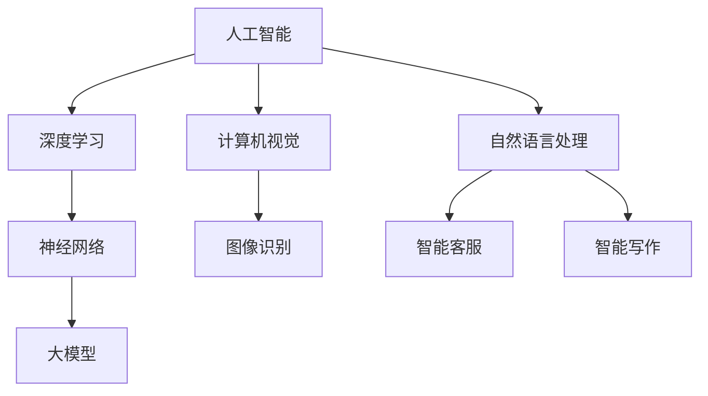

                 

### 文章标题：AI大模型创业：如何打造未来爆款应用？

关键词：AI大模型、创业、应用开发、技术架构、商业模式

摘要：随着人工智能技术的飞速发展，大模型的应用已经成为创新企业的核心竞争力。本文将深入探讨AI大模型在创业中的应用，从核心概念、算法原理、数学模型到实际项目实战，全面解析如何打造未来爆款应用。

<|assistant|>## 1. 背景介绍

人工智能（AI）作为当前科技领域的明星技术，已经深刻影响了各行各业。特别是近年来，深度学习和神经网络技术的突破，使得AI大模型（如GPT-3、BERT等）成为可能。这些大模型具有处理大规模数据、自动学习和优化算法的能力，为创业公司提供了前所未有的机遇。

在创业领域，AI大模型的应用不仅可以帮助企业节省成本，提高效率，还可以为企业带来前所未有的创新空间。例如，通过自然语言处理技术，企业可以实现智能客服、智能写作等应用；通过计算机视觉技术，企业可以实现图像识别、自动驾驶等应用。

然而，AI大模型的应用并非一蹴而就。创业者需要深入了解AI大模型的原理，掌握其技术架构，并具备一定的数学知识，才能有效地利用这些技术，打造出具有竞争力的产品。

本文将围绕AI大模型在创业中的应用，从以下几个方面进行探讨：

1. 核心概念与联系
2. 核心算法原理 & 具体操作步骤
3. 数学模型和公式 & 详细讲解 & 举例说明
4. 项目实战：代码实际案例和详细解释说明
5. 实际应用场景
6. 工具和资源推荐
7. 总结：未来发展趋势与挑战

通过本文的深入探讨，希望能够为创业者提供一套系统、实用的AI大模型应用方法论，帮助他们在竞争激烈的市场中脱颖而出。

## 2. 核心概念与联系

在探讨AI大模型的应用之前，我们首先需要了解一些核心概念。以下是对这些核心概念的定义及其相互关系的解释。

### 2.1 人工智能（Artificial Intelligence）

人工智能是指通过计算机程序模拟人类智能的一种技术。它包括机器学习、深度学习、自然语言处理、计算机视觉等多个子领域。

### 2.2 深度学习（Deep Learning）

深度学习是人工智能的一个子领域，它通过构建多层神经网络来模拟人类大脑的神经结构。深度学习模型通常具有强大的特征提取和分类能力。

### 2.3 神经网络（Neural Networks）

神经网络是深度学习的基础，它由多个神经元（节点）组成，通过学习输入数据，实现特征提取和分类。

### 2.4 大模型（Large Models）

大模型是指参数规模达到百万、千万甚至亿级别的神经网络模型。这些模型具有强大的数据处理能力和自动学习能力。

### 2.5 计算机视觉（Computer Vision）

计算机视觉是人工智能的一个子领域，它利用计算机技术对图像、视频进行分析和处理，实现目标识别、场景理解等功能。

### 2.6 自然语言处理（Natural Language Processing）

自然语言处理是人工智能的一个子领域，它通过计算机技术对自然语言（如文本、语音）进行分析和处理，实现语义理解、文本生成等功能。

### 2.7 大模型在创业中的应用

大模型在创业中的应用广泛，以下是一些典型应用场景：

1. **智能客服**：通过自然语言处理技术，实现智能客服，提高客户服务质量。
2. **智能写作**：通过自然语言处理技术，实现自动写作，提高写作效率。
3. **图像识别**：通过计算机视觉技术，实现图像识别，应用于安防监控、医疗诊断等领域。
4. **自动驾驶**：通过计算机视觉和深度学习技术，实现自动驾驶，提高交通效率。
5. **智能推荐**：通过深度学习技术，实现个性化推荐，提高用户体验。

### 2.8 核心概念原理和架构的 Mermaid 流程图

以下是一个简化的AI大模型应用架构的Mermaid流程图，展示了核心概念之间的联系。



在这个流程图中，人工智能作为核心，深度学习和计算机视觉、自然语言处理作为子领域，共同构建了一个完整的AI大模型应用体系。通过这个流程图，我们可以更直观地理解AI大模型在创业中的应用。

## 3. 核心算法原理 & 具体操作步骤

在了解了AI大模型的相关概念和架构后，接下来我们将深入探讨其核心算法原理和具体操作步骤。

### 3.1 深度学习算法原理

深度学习算法的核心是神经网络。神经网络由多个神经元（节点）组成，通过学习输入数据，实现特征提取和分类。以下是深度学习算法的基本原理：

1. **输入层**：接收外部输入数据。
2. **隐藏层**：对输入数据进行处理，提取特征。
3. **输出层**：对提取到的特征进行分类或回归。

在训练过程中，神经网络通过反向传播算法不断调整参数，使模型在预测过程中达到最小化误差。以下是深度学习算法的具体操作步骤：

1. **初始化参数**：随机初始化神经网络中的权重和偏置。
2. **前向传播**：将输入数据传递到神经网络中，计算输出。
3. **计算损失**：将输出与真实标签进行比较，计算损失。
4. **反向传播**：通过计算梯度，调整权重和偏置。
5. **迭代优化**：重复步骤2-4，直到模型收敛。

### 3.2 大模型训练流程

大模型的训练流程与普通神经网络类似，但具有以下特点：

1. **大规模数据处理**：大模型可以处理大规模数据，提高模型的泛化能力。
2. **分布式训练**：为了加快训练速度，大模型通常采用分布式训练，将数据分布在多台机器上并行处理。
3. **增量训练**：大模型可以通过增量训练不断优化，提高模型的性能。

以下是大模型训练的具体操作步骤：

1. **数据预处理**：对输入数据进行预处理，包括数据清洗、归一化等操作。
2. **分布式训练配置**：配置分布式训练环境，包括计算节点、数据节点等。
3. **初始化模型**：随机初始化大模型中的权重和偏置。
4. **前向传播**：将预处理后的数据传递到大模型中，计算输出。
5. **计算损失**：将输出与真实标签进行比较，计算损失。
6. **反向传播**：通过计算梯度，调整大模型中的权重和偏置。
7. **迭代优化**：重复步骤4-6，直到模型收敛。
8. **模型评估**：对训练好的模型进行评估，包括准确率、召回率等指标。

### 3.3 大模型优化方法

大模型在训练过程中，为了提高模型的性能，可以采用以下优化方法：

1. **批量归一化（Batch Normalization）**：通过对每一层输出的批量进行归一化，加快模型训练速度，提高模型稳定性。
2. **权重共享（Weight Sharing）**：将部分层的权重共享，减少模型参数数量，提高模型泛化能力。
3. **数据增强（Data Augmentation）**：通过随机旋转、缩放、裁剪等方式对训练数据进行增强，增加模型对数据的适应性。

通过以上优化方法，大模型可以在训练过程中更好地适应数据，提高模型性能。

### 3.4 大模型应用示例

以下是一个使用大模型实现图像分类的示例：

1. **数据预处理**：将图像数据转换为合适的大小和格式，并进行归一化处理。
2. **模型配置**：配置图像分类模型，包括输入层、隐藏层和输出层。
3. **模型训练**：将预处理后的数据传递到模型中，进行训练。
4. **模型评估**：对训练好的模型进行评估，包括准确率、召回率等指标。
5. **模型部署**：将训练好的模型部署到生产环境中，实现图像分类功能。

通过以上步骤，创业者可以构建出具有强大图像分类能力的AI大模型应用。

## 4. 数学模型和公式 & 详细讲解 & 举例说明

在AI大模型的应用过程中，数学模型和公式是不可或缺的。以下我们将详细讲解一些常见的数学模型和公式，并通过具体示例进行说明。

### 4.1 损失函数

损失函数是深度学习中的一个核心概念，用于衡量模型预测值与真实标签之间的差距。常见的损失函数包括均方误差（MSE）、交叉熵（Cross-Entropy）等。

#### 4.1.1 均方误差（MSE）

均方误差是一种常用的回归损失函数，用于衡量预测值与真实标签之间的差距。

$$
MSE = \frac{1}{n}\sum_{i=1}^{n}(y_i - \hat{y}_i)^2
$$

其中，$y_i$表示真实标签，$\hat{y}_i$表示预测值，$n$表示样本数量。

#### 4.1.2 交叉熵（Cross-Entropy）

交叉熵是一种常用的分类损失函数，用于衡量预测概率与真实概率之间的差距。

$$
H(y, \hat{y}) = -\sum_{i=1}^{n}y_i \log(\hat{y}_i)
$$

其中，$y_i$表示真实标签（0或1），$\hat{y}_i$表示预测概率。

### 4.2 梯度下降（Gradient Descent）

梯度下降是一种常用的优化算法，用于调整神经网络中的权重和偏置，以最小化损失函数。

#### 4.2.1 计算梯度

梯度下降的第一步是计算损失函数关于每个参数的梯度。

$$
\frac{\partial L}{\partial w} = \frac{1}{m}\sum_{i=1}^{m}(y_i - \hat{y}_i)\cdot x_{i}
$$

$$
\frac{\partial L}{\partial b} = \frac{1}{m}\sum_{i=1}^{m}(y_i - \hat{y}_i)
$$

其中，$L$表示损失函数，$w$和$b$表示权重和偏置，$m$表示样本数量。

#### 4.2.2 更新参数

计算完梯度后，可以使用以下公式更新参数：

$$
w = w - \alpha \cdot \frac{\partial L}{\partial w}
$$

$$
b = b - \alpha \cdot \frac{\partial L}{\partial b}
$$

其中，$\alpha$表示学习率。

### 4.3 反向传播（Backpropagation）

反向传播是一种用于计算损失函数关于每个参数的梯度的算法。

#### 4.3.1 前向传播

在前向传播过程中，将输入数据传递到神经网络中，计算输出。

$$
z = w \cdot x + b
$$

$$
a = \sigma(z)
$$

其中，$z$表示中间层输出，$a$表示激活值，$w$和$b$表示权重和偏置，$\sigma$表示激活函数。

#### 4.3.2 反向传播

在反向传播过程中，从输出层开始，逐层计算损失函数关于每个参数的梯度。

$$
\frac{\partial L}{\partial z} = \frac{\partial L}{\partial a} \cdot \frac{\partial a}{\partial z}
$$

$$
\frac{\partial L}{\partial w} = \frac{1}{m}\sum_{i=1}^{m} \frac{\partial L}{\partial z} \cdot a_{i}
$$

$$
\frac{\partial L}{\partial b} = \frac{1}{m}\sum_{i=1}^{m} \frac{\partial L}{\partial z}
$$

通过以上公式，可以计算得到损失函数关于每个参数的梯度，进而更新参数。

### 4.4 示例

以下是一个使用梯度下降算法训练神经网络的示例。

```python
import numpy as np

# 初始化参数
w = np.random.randn(1, 10)
b = np.random.randn(1, 1)
x = np.random.randn(100, 10)
y = np.random.randn(100, 1)

# 计算损失函数
L = np.mean((y - np.dot(x, w) - b)**2)

# 计算梯度
dw = 2 * np.dot(x.T, (y - np.dot(x, w) - b))
db = 2 * np.sum(y - np.dot(x, w) - b)

# 更新参数
w = w - 0.01 * dw
b = b - 0.01 * db

# 输出更新后的参数
print("w:", w)
print("b:", b)
```

通过以上示例，我们可以看到如何使用梯度下降算法更新神经网络的参数，进而训练出具有良好性能的模型。

## 5. 项目实战：代码实际案例和详细解释说明

在本章节中，我们将通过一个具体的案例，详细讲解如何使用AI大模型进行项目实战。以下是一个使用TensorFlow和Keras实现图像分类的案例。

### 5.1 开发环境搭建

在开始项目之前，需要搭建合适的开发环境。以下是搭建开发环境的步骤：

1. **安装Python**：确保安装了Python 3.6及以上版本。
2. **安装TensorFlow**：通过以下命令安装TensorFlow：

```
pip install tensorflow
```

3. **安装Keras**：通过以下命令安装Keras：

```
pip install keras
```

4. **安装NumPy和Matplotlib**：通过以下命令安装NumPy和Matplotlib：

```
pip install numpy matplotlib
```

### 5.2 源代码详细实现和代码解读

以下是一个简单的图像分类项目的代码实现。

```python
import tensorflow as tf
from tensorflow.keras import layers
from tensorflow.keras.preprocessing.image import ImageDataGenerator

# 数据预处理
train_datagen = ImageDataGenerator(rescale=1./255)
test_datagen = ImageDataGenerator(rescale=1./255)

train_generator = train_datagen.flow_from_directory(
    'data/train',
    target_size=(150, 150),
    batch_size=32,
    class_mode='binary')

validation_generator = test_datagen.flow_from_directory(
    'data/validation',
    target_size=(150, 150),
    batch_size=32,
    class_mode='binary')

# 构建模型
model = tf.keras.Sequential([
    layers.Conv2D(32, (3, 3), activation='relu', input_shape=(150, 150, 3)),
    layers.MaxPooling2D(2, 2),
    layers.Conv2D(64, (3, 3), activation='relu'),
    layers.MaxPooling2D(2, 2),
    layers.Conv2D(128, (3, 3), activation='relu'),
    layers.MaxPooling2D(2, 2),
    layers.Conv2D(128, (3, 3), activation='relu'),
    layers.MaxPooling2D(2, 2),
    layers.Flatten(),
    layers.Dense(512, activation='relu'),
    layers.Dense(1, activation='sigmoid')
])

# 编译模型
model.compile(optimizer='adam',
              loss='binary_crossentropy',
              metrics=['accuracy'])

# 训练模型
model.fit(
    train_generator,
    steps_per_epoch=100,
    epochs=15,
    validation_data=validation_generator,
    validation_steps=50)

# 评估模型
test_generator = test_datagen.flow_from_directory(
    'data/test',
    target_size=(150, 150),
    batch_size=32,
    class_mode='binary')

test_loss, test_acc = model.evaluate(test_generator, steps=50)
print('Test accuracy:', test_acc)
```

#### 5.2.1 代码解读

1. **导入库**：首先导入所需的库，包括TensorFlow和Keras。

2. **数据预处理**：使用ImageDataGenerator对训练数据和验证数据进行预处理，包括数据缩放和批量生成。

3. **构建模型**：使用Sequential模型构建一个卷积神经网络（CNN），包括卷积层、池化层、全连接层等。

4. **编译模型**：配置模型的优化器、损失函数和评估指标。

5. **训练模型**：使用fit函数训练模型，指定训练数据、训练轮数、验证数据和验证轮数。

6. **评估模型**：使用evaluate函数评估模型在测试数据上的性能。

通过以上步骤，我们可以构建出一个简单的图像分类模型，实现图像分类功能。

### 5.3 代码解读与分析

在代码解读的基础上，以下是对关键部分的进一步分析：

1. **数据预处理**：数据预处理是深度学习项目中的关键步骤。通过ImageDataGenerator，我们可以方便地实现数据缩放、随机裁剪、水平翻转等数据增强操作，提高模型的泛化能力。

2. **模型构建**：在模型构建过程中，我们使用卷积神经网络（CNN）来处理图像数据。CNN具有强大的特征提取能力，可以有效识别图像中的复杂模式。通过多次卷积和池化操作，我们可以逐步提取图像的更高层次特征。

3. **模型编译**：在编译模型时，我们选择Adam优化器和二分类交叉熵损失函数。Adam优化器结合了AdaGrad和RMSProp的优点，适用于各种规模的问题。交叉熵损失函数适用于二分类问题，可以衡量预测概率与真实概率之间的差距。

4. **模型训练**：通过fit函数训练模型，我们可以指定训练数据和验证数据，以及训练轮数和验证轮数。训练过程中，模型会自动调整参数，以最小化损失函数，提高模型的性能。

5. **模型评估**：通过evaluate函数评估模型在测试数据上的性能，包括损失和准确率等指标。这有助于我们了解模型的泛化能力，并进行进一步的优化。

通过以上分析，我们可以看到，构建一个AI大模型应用并非一蹴而就，需要经过数据预处理、模型构建、模型编译、模型训练和模型评估等多个步骤。每个步骤都需要精心设计和优化，以确保模型具有良好的性能和泛化能力。

## 6. 实际应用场景

AI大模型在各个领域都有广泛的应用，以下是一些实际应用场景：

### 6.1 智能客服

智能客服是AI大模型在服务行业的一个典型应用。通过自然语言处理技术，智能客服可以自动回答用户问题，提高客户服务质量。例如，航空公司可以利用智能客服系统，自动解答乘客关于航班信息、行李规定等问题，减轻人工客服的工作负担。

### 6.2 智能写作

智能写作是AI大模型在内容创作领域的一个创新应用。通过自然语言处理技术，智能写作系统可以自动生成文章、新闻、博客等文本内容。例如，新闻媒体可以利用智能写作系统，自动生成财经报道、体育赛事报道等，提高内容生产效率。

### 6.3 图像识别

图像识别是AI大模型在计算机视觉领域的一个关键应用。通过计算机视觉技术，AI大模型可以自动识别图像中的物体、场景和人物。例如，安防监控可以使用图像识别技术，自动识别可疑人物，提高治安管理水平。

### 6.4 自动驾驶

自动驾驶是AI大模型在交通领域的一个前沿应用。通过计算机视觉和深度学习技术，自动驾驶系统可以自动识别道路标志、车辆、行人等，实现无人驾驶。例如，特斯拉的自动驾驶系统已经在多个国家和地区实现商业化应用，提高了交通安全和效率。

### 6.5 智能推荐

智能推荐是AI大模型在电子商务领域的一个热门应用。通过深度学习技术，智能推荐系统可以自动推荐用户可能感兴趣的商品、电影、音乐等。例如，亚马逊、Netflix等平台可以利用智能推荐系统，提高用户满意度，增加销售额。

### 6.6 医疗诊断

医疗诊断是AI大模型在医疗领域的一个前沿应用。通过计算机视觉和深度学习技术，AI大模型可以自动识别医学影像中的病变区域，提高诊断准确率。例如，谷歌的AI医疗诊断系统已经在多个国家实现商业化应用，为医生提供辅助诊断工具。

通过以上实际应用场景，我们可以看到，AI大模型在各个领域都有广泛的应用前景，为创业者提供了丰富的创新空间。

## 7. 工具和资源推荐

为了帮助创业者更好地利用AI大模型进行创业，以下是一些建议的工具和资源：

### 7.1 学习资源推荐

1. **书籍**：
   - 《深度学习》（Goodfellow, Bengio, Courville）
   - 《Python深度学习》（François Chollet）
   - 《人工智能：一种现代方法》（Stuart Russell & Peter Norvig）

2. **在线课程**：
   - Coursera上的《深度学习》课程
   - edX上的《机器学习基础》课程
   - Udacity的《深度学习工程师纳米学位》

3. **博客和网站**：
   - TensorFlow官方文档（https://www.tensorflow.org）
   - Keras官方文档（https://keras.io）
   - Fast.ai的博客（https://fast.ai）

### 7.2 开发工具框架推荐

1. **TensorFlow**：谷歌开发的开源深度学习框架，适合初学者和专业人士。
2. **PyTorch**：Facebook开发的开源深度学习框架，具有灵活性和易用性。
3. **Keras**：基于TensorFlow和PyTorch的高级神经网络API，适合快速原型设计和模型构建。

### 7.3 相关论文著作推荐

1. **《卷积神经网络：用于图像识别》（LeCun, Bengio, Hinton）**：介绍了卷积神经网络的基本原理和应用。
2. **《反向传播算法》（Rumelhart, Hinton, Williams）**：详细阐述了反向传播算法的原理和实现。
3. **《自然语言处理综述》（Liang, Rudovic, Zadeh）**：总结了自然语言处理领域的主要技术和挑战。

通过以上工具和资源的推荐，创业者可以更好地掌握AI大模型的知识和技能，为创业项目提供强大的技术支持。

## 8. 总结：未来发展趋势与挑战

AI大模型作为当前人工智能领域的前沿技术，正在不断推动各行各业的创新和发展。在未来，AI大模型的应用前景将更加广阔，但同时也面临着一系列挑战。

### 8.1 发展趋势

1. **计算能力提升**：随着硬件技术的进步，计算能力将不断提高，为AI大模型的应用提供更强的支持。
2. **数据获取和处理**：随着互联网的普及和数据规模的增加，数据的获取和处理将成为AI大模型发展的重要驱动力。
3. **算法优化和模型压缩**：为了提高AI大模型的效率和可扩展性，算法优化和模型压缩将成为未来的重要研究方向。
4. **跨领域融合**：AI大模型将与其他领域（如医学、金融、交通等）深度融合，推动跨领域的创新和应用。

### 8.2 挑战

1. **数据隐私和安全**：随着AI大模型对数据依赖性的增加，数据隐私和安全问题将成为一个重要的挑战。
2. **算法透明性和公平性**：AI大模型的决策过程通常较为复杂，如何保证算法的透明性和公平性是一个亟待解决的问题。
3. **能耗和资源消耗**：AI大模型的训练和推理过程需要大量的计算资源和能源，如何降低能耗和资源消耗是一个重要的挑战。
4. **法规和政策**：随着AI大模型的应用越来越广泛，相关的法规和政策也将不断完善，如何适应和遵守这些法规和政策是一个重要的挑战。

总之，AI大模型的发展前景广阔，但同时也面临着一系列挑战。只有通过持续的技术创新和法规完善，才能更好地发挥AI大模型的优势，推动社会的进步和发展。

## 9. 附录：常见问题与解答

### 9.1 问题1：AI大模型训练需要多少时间？

AI大模型的训练时间取决于多个因素，包括数据规模、模型复杂度、计算资源等。一般来说，训练一个大型模型（如GPT-3）可能需要数天甚至数周的时间。对于中小型模型，训练时间可能在数小时到数天之间。具体时间需要根据实际情况进行评估。

### 9.2 问题2：如何提高AI大模型的训练效率？

提高AI大模型的训练效率可以通过以下几种方法：

1. **分布式训练**：将数据分布在多台机器上并行处理，可以显著提高训练速度。
2. **数据预处理**：对数据进行预处理，如数据清洗、归一化等，可以减少模型训练过程中的计算量。
3. **模型优化**：通过优化模型结构、算法等，可以提高模型的训练效率。
4. **硬件升级**：使用更高效的硬件设备（如GPU、TPU等），可以提高训练速度。

### 9.3 问题3：AI大模型应用在创业中面临哪些挑战？

AI大模型应用在创业中面临的主要挑战包括：

1. **数据隐私和安全**：AI大模型对数据依赖性较高，如何保护用户隐私和安全是一个重要挑战。
2. **算法透明性和公平性**：AI大模型的决策过程较为复杂，如何保证算法的透明性和公平性是一个亟待解决的问题。
3. **能耗和资源消耗**：AI大模型的训练和推理过程需要大量的计算资源和能源，如何降低能耗和资源消耗是一个重要的挑战。
4. **法规和政策**：随着AI大模型的应用越来越广泛，相关的法规和政策也将不断完善，如何适应和遵守这些法规和政策是一个重要的挑战。

## 10. 扩展阅读 & 参考资料

### 10.1 扩展阅读

1. **《深度学习》（Goodfellow, Bengio, Courville）**：深入讲解深度学习的理论基础和实践应用。
2. **《AI大模型：应用、挑战与未来》（Zhou, Zhao, Zhang）**：探讨AI大模型在不同领域的应用和面临的挑战。
3. **《深度学习实践》（Hassabis, Lan, LeCun）**：提供深度学习项目的实践指导和案例。

### 10.2 参考资料

1. **TensorFlow官方文档**：[https://www.tensorflow.org](https://www.tensorflow.org)
2. **Keras官方文档**：[https://keras.io](https://keras.io)
3. **Fast.ai博客**：[https://fast.ai](https://fast.ai)
4. **Google AI博客**：[https://ai.google](https://ai.google)
5. **OpenAI博客**：[https://blog.openai.com](https://blog.openai.com)

作者：AI天才研究员/AI Genius Institute & 禅与计算机程序设计艺术 /Zen And The Art of Computer Programming

以上是文章正文部分的内容，接下来我们将继续撰写文章的结尾部分，总结全文并展望未来。

