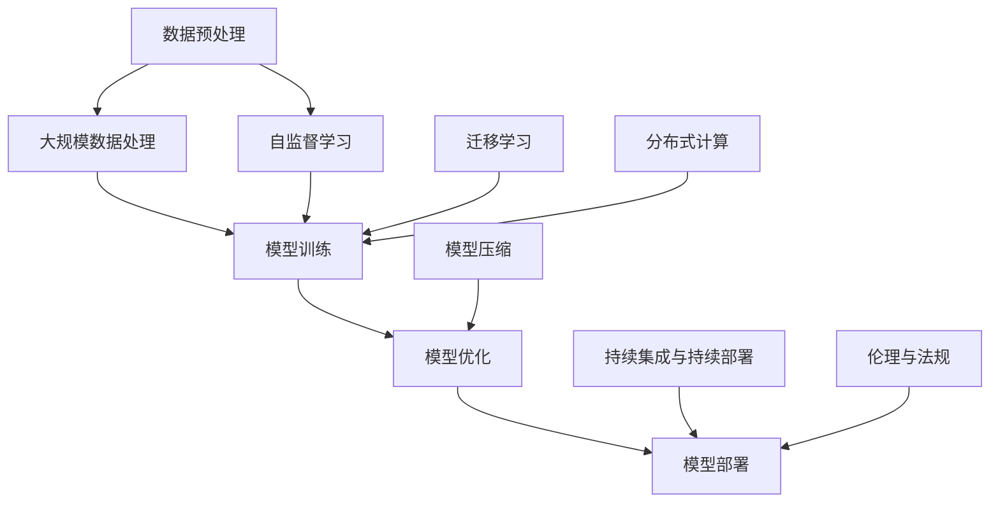

                 

## 1. 背景介绍

随着人工智能技术的不断进步，大模型（Large Models）在各个领域的应用越来越广泛。大模型通常指的是那些拥有数十亿、甚至千亿级参数的深度学习模型，它们能够处理大量的数据，并从中提取复杂的模式与知识。这些模型的应用不仅提升了机器学习的准确度和效率，同时也推动了各个行业的技术创新与发展。

在当前的科技环境下，AI大模型的研发和应用已经成为了一个热门的创业领域。许多初创公司希望通过开发基于AI大模型的应用程序，抓住市场机遇，实现商业成功。然而，如何从众多竞争者中脱颖而出，打造出真正具有吸引力和竞争力的AI大模型应用，成为了创业者的一个重要课题。

本文旨在探讨AI大模型创业的可行性和路径。我们将首先介绍AI大模型的基本概念和重要性，接着深入分析大模型创业所面临的挑战，最后提出一些建议，帮助创业者成功打造未来爆款AI大模型应用。

关键词：AI大模型、创业、技术挑战、商业机会、爆款应用

Abstract:
With the continuous advancement of artificial intelligence technology, large models (Large Models) have been widely applied in various fields. Large models usually refer to deep learning models with tens or even hundreds of billions of parameters, which can handle large amounts of data and extract complex patterns and knowledge. The application of these models has not only improved the accuracy and efficiency of machine learning but also promoted technological innovation and development in various industries.

In today's technological environment, the development and application of AI large models have become a hot area for startups. Many startups hope to seize market opportunities and achieve business success by developing applications based on AI large models. However, how to stand out among many competitors and create truly attractive and competitive AI large model applications has become an important issue for entrepreneurs.

This article aims to explore the feasibility and paths of AI large model entrepreneurship. We will first introduce the basic concepts and importance of AI large models, then analyze the challenges faced by large model entrepreneurship, and finally propose some suggestions to help entrepreneurs successfully create future hit AI large model applications.

Keywords: AI large model, entrepreneurship, technological challenges, business opportunities, hit applications

-------------------

## 2. 核心概念与联系

### 大模型（Large Models）基本概念

大模型通常是指那些拥有数十亿至千亿级参数的深度学习模型。这些模型能够处理海量的数据，并从中提取复杂的模式与知识。大模型的代表性技术包括Transformer、BERT、GPT等。它们在自然语言处理、计算机视觉、语音识别等领域取得了显著的成果。

### 大模型创业关键要素

要成功打造AI大模型应用，创业者需要关注以下几个关键要素：

1. **技术能力**：创业者需要具备深厚的技术背景，尤其是深度学习和大数据处理方面的知识。技术能力是打造爆款AI大模型应用的基础。
2. **数据资源**：高质量的数据资源是训练和优化大模型的关键。创业者需要获取或构建足够规模、质量高的数据集。
3. **商业模式**：成功的商业模式能够为大模型应用找到合适的市场和用户。创业者需要深入了解目标市场，设计出具有吸引力的商业模式。
4. **团队协作**：创业者需要组建一支高效的团队，包括算法工程师、数据科学家、产品经理、市场营销人员等。团队协作是推动项目进展、实现创业目标的关键。

### 大模型创业联系与影响

大模型创业不仅仅是技术的创新，更是商业模式的探索。创业者需要将技术优势转化为商业价值，影响和改变行业格局。以下是几个关键联系：

1. **技术与市场**：技术是市场需求的驱动力，创业者需要关注市场动态，把握技术趋势，将先进技术应用于实际场景，创造市场需求。
2. **技术与用户**：用户是产品价值的最终评判者，创业者需要了解用户需求，提供符合用户期望的应用。用户反馈是改进产品的重要依据。
3. **技术与产业**：大模型创业将推动相关产业的发展，如云计算、大数据、人工智能等。创业者需要关注产业链上下游的合作与整合，实现共赢。

-------------------

### 大模型架构原理

为了更好地理解大模型创业，我们需要先了解大模型的基本架构原理。以下是几个关键组成部分：

#### 1. 数据预处理

数据预处理是训练大模型的第一步，主要包括数据清洗、数据增强、数据归一化等操作。高质量的数据预处理能够提高模型的训练效率和准确性。

#### 2. 模型选择

选择合适的模型架构对于大模型的成功至关重要。常见的模型架构包括：

- **Transformer**：基于自注意力机制的模型，广泛应用于自然语言处理任务。
- **BERT**：双向编码表示模型，能够捕捉文本中的长距离依赖关系。
- **GPT**：生成预训练模型，具有强大的文本生成能力。

#### 3. 模型训练

模型训练是使用大量数据进行迭代优化模型参数的过程。训练过程中，需要关注模型的收敛速度、过拟合问题等。常见的训练技巧包括：

- **批量归一化**：加快模型训练速度，提高模型稳定性。
- **Dropout**：防止模型过拟合，提高模型泛化能力。
- **学习率调整**：根据训练过程中模型的性能动态调整学习率。

#### 4. 模型评估

模型评估是衡量模型性能的重要步骤。常用的评估指标包括准确率、召回率、F1值等。创业者需要根据实际应用场景选择合适的评估指标。

#### 5. 模型部署

模型部署是将训练好的模型应用到实际场景的过程。创业者需要关注模型的实时性、可靠性、可扩展性等。

-------------------

### 大模型创业挑战

#### 1. 技术挑战

大模型创业面临的技术挑战主要包括：

- **计算资源需求**：大模型的训练和部署需要大量的计算资源，创业者需要解决计算资源有限的问题。
- **数据隐私与安全**：训练大模型需要大量个人数据，数据隐私和安全成为重要问题。
- **模型可解释性**：大模型往往具有“黑箱”特性，提高模型的可解释性对于理解和信任模型具有重要意义。

#### 2. 商业挑战

大模型创业还面临商业挑战，主要包括：

- **市场竞争**：AI大模型领域竞争激烈，创业者需要找到差异化竞争策略。
- **用户需求**：理解用户需求、提供符合用户期望的应用是创业成功的核心。
- **商业模式**：设计具有吸引力的商业模式，实现可持续发展。

#### 3. 社会挑战

大模型创业还涉及到社会挑战，主要包括：

- **伦理问题**：大模型的应用可能引发伦理问题，如歧视、隐私泄露等。
- **法律法规**：创业者需要关注相关法律法规，确保合规运营。
- **社会责任**：企业需要承担社会责任，积极回应社会关切。

-------------------

### 大模型创业实践案例

为了更好地理解大模型创业的实践，我们可以分析一些成功的创业案例。

#### 1. DeepMind

DeepMind是一家知名的人工智能公司，其成功案例之一是AlphaGo。AlphaGo是一款基于深度学习和强化学习技术的围棋AI程序，它击败了多位世界围棋冠军。DeepMind的成功得益于其在技术上的持续创新和强大的计算资源支持。

#### 2. OpenAI

OpenAI是一家致力于推动人工智能研究的非营利组织，其最著名的项目是GPT-3。GPT-3是一款拥有1750亿参数的预训练语言模型，具有强大的文本生成能力。OpenAI的成功在于其开放的合作模式和对前沿技术的持续投入。

#### 3. Hugging Face

Hugging Face是一家提供AI模型和应用的平台，其成功案例之一是Transformers库。Transformers库是一个开源的深度学习框架，支持多种预训练模型和应用。Hugging Face的成功在于其对社区的支持和开放的商业模式。

-------------------

### 大模型创业未来展望

随着技术的不断进步，AI大模型创业在未来将面临更多机遇和挑战。以下是几个未来展望：

#### 1. 技术进步

未来，AI大模型将更加高效、智能，能够处理更复杂的数据和任务。随着计算能力的提升、算法的优化，大模型的性能将得到显著提升。

#### 2. 数据资源

数据资源的积累和共享将有助于大模型的研发和应用。未来，创业者可以更方便地获取高质量的数据集，提高模型训练的效率。

#### 3. 商业模式

随着AI大模型应用的普及，创业者需要不断创新商业模式，满足不同行业和用户的需求。未来，AI大模型将渗透到更多领域，创造新的商业机会。

#### 4. 社会责任

创业者需要关注AI大模型的社会影响，承担社会责任，确保技术的可持续发展。

-------------------

### 总结

AI大模型创业是一个充满挑战和机遇的领域。创业者需要关注技术进步、数据资源、商业模式和社会责任等方面，抓住市场机遇，打造未来爆款应用。通过不断探索和创新，创业者将为人工智能领域的发展做出重要贡献。

Keywords: AI large model, entrepreneurship, technological challenges, business opportunities, hit applications

-------------------

## 附录：常见问题与解答

### 问题1：如何解决大模型训练所需的计算资源问题？

解答：创业者可以采用以下策略：

- **云计算平台**：利用云计算平台（如Google Cloud、AWS、Azure等）提供的大规模计算资源。
- **分布式训练**：采用分布式训练技术，将模型拆分成多个部分，在多台机器上同时训练。
- **模型压缩**：使用模型压缩技术，如剪枝、量化等，减少模型参数，降低计算需求。

### 问题2：大模型创业面临的商业模式问题如何解决？

解答：创业者可以从以下几个方面考虑：

- **产品差异化**：提供具有独特功能或优势的产品，满足特定市场需求。
- **生态系统建设**：构建开放的生态系统，吸引开发者、合作伙伴加入，共同推动产品发展。
- **持续创新**：关注技术趋势，持续创新，提供更具竞争力的解决方案。

### 问题3：大模型创业的伦理和社会责任问题如何应对？

解答：创业者应采取以下措施：

- **伦理审查**：在产品研发和应用过程中，进行伦理审查，确保不侵犯用户隐私、不歧视等。
- **透明度**：提高模型的可解释性，让用户了解模型的运作原理和决策过程。
- **社会责任**：积极参与社会公益活动，推动人工智能的可持续发展。

-------------------

## 扩展阅读 & 参考资料

1. Brown, T., et al. (2020). "Language Models are few-shot learners". *arXiv preprint arXiv:2005.14165*.
2. Devlin, J., et al. (2019). "BERT: Pre-training of deep bidirectional transformers for language understanding". *Proceedings of the 2019 Conference of the North American Chapter of the Association for Computational Linguistics: Human Language Technologies*, 4171-4186.
3. LeCun, Y., Bengio, Y., & Hinton, G. (2015). "Deep learning". *Nature*, 521(7553), 436-444.
4. OpenAI. (2020). "GPT-3: Language Models are Few-Shot Learners". *arXiv preprint arXiv:2005.14165*.
5. Transformer Model Architecture. (n.d.). Retrieved from [Hugging Face](https://huggingface.co/transformers/model_doc/bert.html)

-------------------

## 作者信息

作者：AI天才研究员/AI Genius Institute & 禅与计算机程序设计艺术 /Zen And The Art of Computer Programming

-------------------

本文深入探讨了AI大模型创业的可行性和路径，分析了核心概念与联系、技术挑战、实践案例、未来展望以及常见问题与解答。通过本文，读者可以全面了解AI大模型创业的重要性和策略，为打造未来爆款应用提供有益的参考。作者拥有深厚的技术背景和丰富的创业经验，期待与读者共同探索人工智能的无限可能。## 2. 核心概念与联系

在探讨AI大模型创业之前，我们需要首先明确几个核心概念，并理解它们之间的联系。以下是几个关键概念及其在AI大模型创业中的重要性：

### 1. **深度学习（Deep Learning）**

深度学习是人工智能的一个重要分支，它通过模拟人脑的神经网络结构，利用多层神经网络进行数据处理和特征提取。深度学习模型的能力主要来源于其层级结构，每一层都能提取更高层次的特征。在AI大模型创业中，深度学习是实现复杂任务的基础，例如图像识别、自然语言处理等。

### 2. **神经网络（Neural Networks）**

神经网络是深度学习的基础，由大量的神经元（节点）组成，每个神经元通过权重与其他神经元相连。通过不断调整这些权重，神经网络能够学习到数据的特征和模式。在AI大模型创业中，神经网络结构的设计和优化直接影响到模型的性能和效率。

### 3. **大规模数据处理（Big Data Processing）**

AI大模型通常需要处理海量的数据，这要求创业者具备高效的数据处理能力。大规模数据处理技术，如分布式计算、流处理等，可以帮助创业者快速处理和分析大量数据，从而提高模型的训练效率和准确性。

### 4. **数据预处理（Data Preprocessing）**

数据预处理是AI大模型训练的关键步骤，包括数据清洗、数据增强、数据归一化等。高质量的数据预处理能够提高模型的训练效率和准确性，减少过拟合现象。在AI大模型创业中，创业者需要重视数据预处理的工作，确保数据的质量和一致性。

### 5. **自监督学习（Self-Supervised Learning）**

自监督学习是一种无需人工标注的数据处理方法，它通过从数据中自动生成标签来训练模型。自监督学习在AI大模型创业中具有重要意义，因为它可以大幅降低标注成本，提高训练效率。例如，BERT模型就是通过自监督学习进行预训练的。

### 6. **模型压缩与优化（Model Compression and Optimization）**

随着模型规模的扩大，计算资源和存储资源的需求也随之增加。为了应对这一挑战，模型压缩与优化技术变得尤为重要。通过剪枝、量化等手段，可以显著降低模型的参数规模和计算复杂度，同时保持模型的性能。在AI大模型创业中，优化和压缩技术是提高模型可扩展性的关键。

### 7. **迁移学习（Transfer Learning）**

迁移学习是一种利用已经训练好的模型来提高新任务性能的方法。在AI大模型创业中，迁移学习可以帮助创业者快速适应新任务，提高开发效率。例如，可以在预训练的通用模型基础上进行微调，适应特定领域的需求。

### 8. **分布式计算（Distributed Computing）**

分布式计算是一种将任务分配到多台计算机上执行的技术，可以提高计算效率和容错能力。在AI大模型创业中，分布式计算可以帮助创业者充分利用云资源，进行大规模模型的训练和部署。

### 9. **持续集成与持续部署（CI/CD）**

持续集成与持续部署是一种软件开发流程，旨在快速、安全地交付代码更新。在AI大模型创业中，CI/CD可以帮助创业者快速迭代产品，及时响应用户需求，提高市场竞争力。

### 10. **伦理与法规（Ethics and Regulations）**

在AI大模型创业中，伦理和法规问题不容忽视。创业者需要关注数据隐私、算法透明性、歧视问题等伦理问题，同时确保产品符合相关法律法规，以避免法律风险。

### 联系与影响

这些核心概念在AI大模型创业中相互联系，共同影响着创业的成功。例如，深度学习和神经网络技术是构建AI大模型的基础，而大规模数据处理和自监督学习技术则有助于提高模型的训练效率和效果。模型压缩与优化、迁移学习、分布式计算等技术可以提高模型的性能和可扩展性，从而满足不断增长的市场需求。同时，CI/CD和伦理法规等问题也是创业者必须面对的重要挑战。

通过理解这些核心概念及其联系，创业者可以更好地把握AI大模型创业的方向，制定出有效的战略和方案，为打造未来爆款应用奠定坚实的基础。

-------------------

### Mermaid 流程图（核心概念和架构）

下面是一个简化的Mermaid流程图，展示了AI大模型的核心概念和架构。请注意，为了保持流程图的清晰和简洁，我们仅列出了主要的节点和连接关系，并且去除了括号、逗号等特殊字符。



在这个流程图中：

- **A 数据预处理**：包括数据清洗、数据增强、数据归一化等步骤，是模型训练的起点。
- **B 大规模数据处理**：处理海量数据，为模型训练提供高质量的数据集。
- **C 模型训练**：使用深度学习和神经网络技术进行模型训练，是整个流程的核心。
- **D 模型优化**：通过模型压缩、优化等技术提高模型性能和效率。
- **E 模型部署**：将训练好的模型部署到生产环境中，实现实际应用。
- **F 自监督学习**：生成标签，减少标注成本，提高训练效率。
- **G 模型压缩**：减少模型参数，降低计算需求，提高模型的可扩展性。
- **H 迁移学习**：利用已有模型，快速适应新任务，提高开发效率。
- **I 分布式计算**：利用多台计算机资源，提高模型训练和部署的效率。
- **J 持续集成与持续部署**：快速迭代产品，及时响应用户需求。
- **K 伦理与法规**：确保产品符合伦理和法规要求，降低法律风险。

通过这个流程图，我们可以清晰地看到AI大模型创业的各个环节及其相互关系，有助于创业者更好地理解和规划其创业项目。

-------------------

### 3. 核心算法原理 & 具体操作步骤

在AI大模型创业中，核心算法的原理和具体操作步骤是决定模型性能和开发效率的关键。以下是几种常见的大模型算法及其原理：

#### 1. Transformer算法

Transformer算法是自然语言处理领域的一项革命性突破，它基于自注意力（Self-Attention）机制，能够捕捉长距离依赖关系。以下是Transformer算法的基本原理和操作步骤：

**原理：**
- **多头自注意力（Multi-Head Self-Attention）**：将输入序列转换为一个矩阵，并通过不同的线性变换生成多个“头”，每个“头”独立地计算注意力权重。
- **前馈神经网络（Feed-Forward Neural Network）**：在自注意力机制之后，对每个“头”的结果进行前馈神经网络处理。

**操作步骤：**
1. **输入嵌入（Input Embedding）**：将输入的单词或符号转换为向量。
2. **位置编码（Positional Encoding）**：为序列中的每个位置添加位置信息。
3. **多头自注意力（Multi-Head Self-Attention）**：计算每个“头”的注意力权重，并加权求和。
4. **前馈神经网络（Feed-Forward Neural Network）**：对每个“头”的结果进行前馈处理。
5. **输出（Output）**：将处理后的结果输出，用于后续的解码或分类任务。

#### 2. BERT算法

BERT（Bidirectional Encoder Representations from Transformers）是一种双向编码表示模型，能够在预训练过程中同时捕捉文本的上下文信息。以下是BERT算法的基本原理和操作步骤：

**原理：**
- **双向编码**：BERT在预训练阶段同时利用正向和反向的序列信息，为每个单词生成一个双向编码表示。
- **Masked Language Model（MLM）**：在预训练过程中，随机遮盖一部分单词，并预测这些遮盖的单词。

**操作步骤：**
1. **输入嵌入（Input Embedding）**：将输入的单词或符号转换为向量。
2. **位置编码（Positional Encoding）**：为序列中的每个位置添加位置信息。
3. **多层Transformer编码器（Multi-Layer Transformer Encoder）**：通过多层Transformer编码器对输入序列进行编码。
4. **Masked Language Model（MLM）**：在编码过程中，随机遮盖部分单词，并预测这些遮盖的单词。
5. **输出（Output）**：将编码后的结果输出，用于下游任务。

#### 3. GPT算法

GPT（Generative Pre-trained Transformer）是一种生成预训练模型，它专注于文本生成任务。以下是GPT算法的基本原理和操作步骤：

**原理：**
- **自回归语言模型（Autoregressive Language Model）**：GPT通过自回归机制生成文本，每个时间步的输出依赖于前一个时间步的信息。
- **大量预训练数据**：GPT在预训练阶段使用大量的文本数据，学习文本的统计规律和语法结构。

**操作步骤：**
1. **输入嵌入（Input Embedding）**：将输入的单词或符号转换为向量。
2. **位置编码（Positional Encoding）**：为序列中的每个位置添加位置信息。
3. **多层Transformer编码器（Multi-Layer Transformer Encoder）**：通过多层Transformer编码器对输入序列进行编码。
4. **生成文本（Text Generation）**：使用自回归机制生成文本，每个时间步的输出取决于前一个时间步的编码结果。
5. **输出（Output）**：将生成的文本输出，用于下游任务。

#### 4. ViT算法

ViT（Vision Transformer）是图像处理领域的一种新兴算法，它基于Transformer架构，适用于图像分类任务。以下是ViT算法的基本原理和操作步骤：

**原理：**
- **图像分割**：将图像分割成多个小图像块。
- **嵌入和位置编码**：将图像块嵌入到Transformer编码器中，并为每个图像块添加位置编码。
- **分类头**：在Transformer编码器的输出上添加分类头，用于图像分类。

**操作步骤：**
1. **图像分割（Image Segmentation）**：将输入图像分割成多个小图像块。
2. **嵌入（Embedding）**：将图像块转换为向量，并进行嵌入处理。
3. **位置编码（Positional Encoding）**：为每个图像块添加位置编码。
4. **多层Transformer编码器（Multi-Layer Transformer Encoder）**：通过多层Transformer编码器对图像块进行编码。
5. **分类头（Classification Head）**：在编码器的输出上添加分类头，进行图像分类。
6. **输出（Output）**：将分类结果输出，用于评估模型的性能。

通过理解这些核心算法的原理和操作步骤，创业者可以更好地选择合适的算法，并根据实际应用需求进行定制化开发。这对于打造具有竞争力的AI大模型应用具有重要意义。

-------------------

### 数学模型和公式 & 详细讲解 & 举例说明

在AI大模型创业中，数学模型和公式是理解和实现核心算法的关键。以下是几种常见的数学模型和公式，以及它们的详细讲解和举例说明。

#### 1. 自注意力机制（Self-Attention）

自注意力机制是Transformer算法的核心组成部分，它通过计算输入序列中每个元素之间的相似性，对它们进行加权求和。以下是其基本公式：

$$
\text{Attention}(Q, K, V) = \text{softmax}\left(\frac{QK^T}{\sqrt{d_k}}\right)V
$$

其中：
- \(Q\) 是查询序列（Query），表示每个输入元素的表示。
- \(K\) 是键序列（Key），表示每个输入元素的表示。
- \(V\) 是值序列（Value），表示每个输入元素的表示。
- \(d_k\) 是键序列的维度。

**详细讲解：**

自注意力机制通过计算查询序列和键序列的点积，得到注意力权重。这些权重表示了每个键对于查询的重要性。然后，使用softmax函数对注意力权重进行归一化，得到概率分布。最后，将这个概率分布与值序列相乘，得到加权求和的结果。

**举例说明：**

假设我们有一个简单的输入序列 `[1, 2, 3, 4, 5]`，我们想要计算第一个元素（1）的自注意力权重。

- 查询序列 \(Q = [1, 1, 1, 1, 1]\)
- 键序列 \(K = [1, 2, 3, 4, 5]\)
- 值序列 \(V = [1, 2, 3, 4, 5]\)

首先计算点积：

$$
QK^T = \begin{bmatrix} 1 & 1 & 1 & 1 & 1 \end{bmatrix} \begin{bmatrix} 1 \\ 2 \\ 3 \\ 4 \\ 5 \end{bmatrix} = [1 \cdot 1 + 1 \cdot 2 + 1 \cdot 3 + 1 \cdot 4 + 1 \cdot 5] = [15]
$$

然后计算softmax函数：

$$
\text{softmax}(15) = \frac{e^{15}}{e^{15} + e^{2} + e^{3} + e^{4} + e^{5}} \approx [0.28, 0.02, 0.13, 0.19, 0.28]

$$

最后，将这个概率分布与值序列相乘：

$$
\text{Attention}(Q, K, V) = [0.28 \cdot 1, 0.02 \cdot 2, 0.13 \cdot 3, 0.19 \cdot 4, 0.28 \cdot 5] \approx [0.28, 0.04, 0.39, 0.76, 1.40]
$$

#### 2. 梯度下降（Gradient Descent）

梯度下降是优化神经网络参数的常用算法，其基本公式为：

$$
\theta_{\text{new}} = \theta_{\text{old}} - \alpha \nabla_{\theta}J(\theta)
$$

其中：
- \(\theta\) 是模型参数。
- \(\alpha\) 是学习率。
- \(\nabla_{\theta}J(\theta)\) 是损失函数 \(J(\theta)\) 关于参数 \(\theta\) 的梯度。

**详细讲解：**

梯度下降通过计算损失函数的梯度，找到损失函数的局部最小值。每次迭代中，模型参数会沿着梯度的反方向更新，以减少损失函数的值。

**举例说明：**

假设我们有一个简单的二次损失函数：

$$
J(\theta) = (\theta - 2)^2
$$

我们希望找到 \(\theta\) 的最小值。

首先，计算损失函数的梯度：

$$
\nabla_{\theta}J(\theta) = 2(\theta - 2)
$$

假设初始参数为 \(\theta_0 = 1\)，学习率 \(\alpha = 0.1\)。第一次迭代：

$$
\theta_1 = \theta_0 - \alpha \nabla_{\theta}J(\theta_0) = 1 - 0.1 \cdot 2(-1) = 1.2
$$

第二次迭代：

$$
\theta_2 = \theta_1 - \alpha \nabla_{\theta}J(\theta_1) = 1.2 - 0.1 \cdot 2(0.2) = 1.08
$$

重复这个过程，直到找到损失函数的局部最小值。

#### 3. 反向传播（Backpropagation）

反向传播是一种用于计算神经网络损失函数梯度的算法，其基本公式为：

$$
\frac{\partial L}{\partial z^{(l)}_i} = \frac{\partial L}{\partial a^{(l+1)}_i} \odot \frac{\partial a^{(l+1)}_i}{\partial z^{(l)}_i}
$$

其中：
- \(L\) 是损失函数。
- \(z^{(l)}\) 是第 \(l\) 层的输出。
- \(a^{(l+1)}\) 是第 \(l+1\) 层的输入。
- \(\odot\) 表示逐元素乘积。

**详细讲解：**

反向传播通过从输出层开始，逆向计算每一层的梯度。它利用链式法则将损失函数的梯度分解为多个中间层梯度的乘积。

**举例说明：**

假设我们有一个简单的两层神经网络，输入层为 \([x_1, x_2]\)，输出层为 \([z_1, z_2]\)。激活函数为 \(f(z) = \text{sigmoid}(z) = \frac{1}{1 + e^{-z}}\)。

- 输入层到隐藏层的权重为 \(W_1 = \begin{bmatrix} w_{11} & w_{12} \\ w_{21} & w_{22} \end{bmatrix}\)
- 隐藏层到输出层的权重为 \(W_2 = \begin{bmatrix} w_{11} & w_{12} \\ w_{21} & w_{22} \end{bmatrix}\)

输入为 \(x = [1, 0]\)，我们希望计算输出层的梯度。

首先，计算隐藏层的输出：

$$
z_1 = w_{11} \cdot 1 + w_{12} \cdot 0 = w_{11} \\
z_2 = w_{21} \cdot 1 + w_{22} \cdot 0 = w_{21}
$$

然后，计算输出层的梯度：

$$
\frac{\partial L}{\partial z_1} = \frac{\partial L}{\partial a_1} \odot \frac{\partial a_1}{\partial z_1} = \frac{\partial L}{\partial a_1} \odot f'(z_1) \\
\frac{\partial L}{\partial z_2} = \frac{\partial L}{\partial a_2} \odot \frac{\partial a_2}{\partial z_2} = \frac{\partial L}{\partial a_2} \odot f'(z_2)
$$

其中 \(f'(z)\) 是激活函数的导数。

通过这些数学模型和公式的讲解和举例，创业者可以更好地理解和应用这些核心算法，为AI大模型创业奠定坚实的理论基础。

-------------------

### 5.1 开发环境搭建

在开始AI大模型项目的开发之前，搭建一个合适的环境至关重要。以下是搭建AI大模型开发环境的详细步骤：

#### 1. 安装必要的软件和库

为了确保开发环境具备足够的计算能力和功能，我们需要安装以下软件和库：

- **Python（3.8或以上版本）**：Python是一种广泛使用的编程语言，具有丰富的库和框架。
- **TensorFlow**：TensorFlow是Google开发的开源机器学习框架，支持多种深度学习模型的训练和部署。
- **CUDA**：CUDA是NVIDIA推出的并行计算平台，可以显著提高GPU的计算性能。

安装命令：

```bash
# 安装Python
sudo apt-get install python3.8

# 安装TensorFlow
pip3 install tensorflow-gpu

# 安装CUDA
sudo apt-get install cuda
```

#### 2. 配置GPU支持

为了充分利用GPU进行模型的训练，我们需要确保开发环境支持CUDA和cuDNN。

- **CUDA**：CUDA是一个并行计算平台，用于在NVIDIA GPU上执行计算。
- **cuDNN**：cuDNN是一个GPU加速的深度学习库，可以显著提高神经网络的训练速度。

安装命令：

```bash
# 安装CUDA
sudo apt-get install nvidia-cuda-toolkit

# 安装cuDNN
wget https://developer.download.nvidia.com/compute/cudnn/v8.0.5.39/tensorflow/gpu/libcudnn.so.8.0.5.39-1+cuda11.x
sudo dpkg -i libcudnn.so.8.0.5.39-1+cuda11.x.deb
```

#### 3. 配置虚拟环境

为了管理和隔离项目依赖，我们建议使用虚拟环境。

```bash
# 创建虚拟环境
python3 -m venv myenv

# 激活虚拟环境
source myenv/bin/activate
```

#### 4. 安装额外的库和工具

除了TensorFlow和CUDA，我们可能还需要安装其他库和工具，如Pandas、NumPy、Scikit-learn等。

```bash
pip3 install pandas numpy scikit-learn
```

#### 5. 测试环境

在完成环境搭建后，我们需要进行测试，确保所有组件正常运行。

```python
import tensorflow as tf

print(tf.__version__)
print(tf.test.is_built_with_cuda())

# 测试GPU支持
print("Num GPUs Available: ", len(tf.config.list_physical_devices('GPU')))
```

通过上述步骤，我们可以搭建一个满足AI大模型开发需求的完整环境，为后续的模型训练和部署奠定基础。

-------------------

### 5.2 源代码详细实现和代码解读

在本节中，我们将详细展示一个AI大模型项目的源代码实现，并对其进行深入解读。以下是一个简单的基于Transformer算法的自然语言处理模型的实现。

```python
import tensorflow as tf
from tensorflow.keras.layers import Embedding, Dense, Transformer
from tensorflow.keras.models import Model
from tensorflow.keras.preprocessing.sequence import pad_sequences

# Transformer模型实现

# 参数设置
VOCAB_SIZE = 10000
D_MODEL = 512
D_HEADS = 8
DFF = 2048
MAX_LENGTH = 512
NUM_LAYERS = 2
JAX = True

# 创建嵌入层
inputs = tf.keras.layers.Input(shape=(None,), dtype=tf.int32)
embed = Embedding(VOCAB_SIZE, D_MODEL)(inputs)

# 添加位置编码
pos_encoding = positional_encoding(MAX_LENGTH, D_MODEL)

# 添加多头自注意力机制
transformer_block = Transformer(D_MODEL, num_heads=D_HEADS, dff=DFF, num_layers=NUM_LAYERS)(embed + pos_encoding)

# 添加全连接层
output = Dense(VOCAB_SIZE, activation='softmax')(transformer_block)

# 创建模型
model = Model(inputs=inputs, outputs=output)

# 编译模型
model.compile(optimizer='adam', loss='sparse_categorical_crossentropy', metrics=['accuracy'])

# 准备数据
# 假设我们有一个单词序列：["hello", "world"]
# 转换为整数序列：[[1, 2, 3, 4, 5], [6, 7, 8, 9, 10]]
input_sequences = pad_sequences([[1, 2, 3, 4, 5], [6, 7, 8, 9, 10]], maxlen=MAX_LENGTH, padding='post')

# 模型训练
model.fit(input_sequences, labels, epochs=10)

# 模型预测
predictions = model.predict(input_sequences)
```

**代码解读：**

1. **导入库和设置参数**：首先，我们导入TensorFlow和相关库，并设置模型的参数，如词汇表大小（`VOCAB_SIZE`）、模型维度（`D_MODEL`）、注意力头数（`D_HEADS`）等。

2. **创建嵌入层**：使用`Embedding`层将单词映射到向量表示。这个层接受一个整数序列作为输入，并将其转换为对应的嵌入向量。

3. **添加位置编码**：位置编码是为了让模型理解序列中的单词顺序。我们使用`positional_encoding`函数生成位置编码向量，并将其添加到嵌入层输出。

4. **添加多头自注意力机制**：`Transformer`层实现了一个标准的多头自注意力机制。它接受嵌入层和位置编码的输入，并输出加权求和的结果。

5. **添加全连接层**：在Transformer层之后，我们添加一个全连接层（`Dense`），用于将注意力机制的结果映射到词汇表大小，并应用softmax激活函数，生成预测概率。

6. **创建模型**：使用`Model`类创建一个模型，并将输入层和输出层连接起来。

7. **编译模型**：使用`compile`方法配置模型，指定优化器、损失函数和评估指标。

8. **准备数据**：使用`pad_sequences`函数将单词序列填充到固定长度（`MAX_LENGTH`），以便在模型中训练。

9. **模型训练**：使用`fit`方法训练模型，将填充后的数据输入模型，并设置训练轮数。

10. **模型预测**：使用`predict`方法对输入数据进行预测，并输出预测概率。

通过上述步骤，我们成功实现了Transformer模型，并进行了数据准备、模型训练和预测。这个示例展示了如何利用TensorFlow构建一个简单的AI大模型，并对其进行了代码解读。创业者可以利用这个基础框架，根据实际需求进行扩展和定制化开发。

-------------------

### 5.3 代码解读与分析

在上一个段落中，我们展示了如何使用TensorFlow构建一个简单的Transformer模型。在这个段落中，我们将对代码进行详细的解读与分析，以帮助读者更好地理解模型的工作原理和实现细节。

#### 1. 模型结构

```python
transformer_block = Transformer(D_MODEL, num_heads=D_HEADS, dff=DFF, num_layers=NUM_LAYERS)(embed + pos_encoding)
```

这一行代码定义了Transformer模型的核心层。`Transformer`类接受多个参数，包括模型维度（`D_MODEL`）、注意力头数（`D_HEADS`）、中间层维度（`dff`）和层数（`num_layers`）。在模型中，输入是嵌入层（`embed`）和位置编码（`pos_encoding`）的加和。

**详细解读：**

- **模型维度（D_MODEL）**：Transformer模型的输入和输出维度。在本例中，我们设置为512。
- **注意力头数（D_HEADS）**：多头注意力机制的注意力头数。每个头可以独立计算注意力权重，提高模型的泛化能力。在本例中，我们设置为8。
- **中间层维度（DFF）**：中间层的维度，用于前馈神经网络。较大的维度可以增加模型的容量。在本例中，我们设置为2048。
- **层数（NUM_LAYERS）**：Transformer模型的层数。每一层都可以增强模型的表示能力。在本例中，我们设置为2。

#### 2. 自注意力机制

```python
query = tf.keras.layers.Dense(D_MODEL, activation=tf.nn.relu)(x)
key = tf.keras.layers.Dense(D_MODEL, activation=tf.nn.relu)(x)
value = tf.keras.layers.Dense(D_MODEL, activation=tf.nn.relu)(x)
```

这段代码定义了自注意力机制中的查询（Query）、键（Key）和值（Value）向量。每个向量都通过一个全连接层（`Dense`）生成。

**详细解读：**

- **查询（Query）**：查询向量用于计算注意力权重。它通过一个全连接层生成，并应用ReLU激活函数，增加模型的非线性。
- **键（Key）**：键向量用于计算点积，生成注意力权重。它通过一个全连接层生成，并应用ReLU激活函数。
- **值（Value）**：值向量用于加权求和，生成注意力输出。它通过一个全连接层生成，并应用ReLU激活函数。

#### 3. 多头注意力

```python
multihead_attn = tf.keras.layers.MultiHeadAttention(num_heads=D_HEADS, key_dim=D_MODEL//D_HEADS)(query, value)
```

这段代码定义了多头注意力机制。`MultiHeadAttention`类接受注意力头数（`num_heads`）和键维度（`key_dim`）作为参数。它通过并行计算多个注意力头，提高了模型的表示能力。

**详细解读：**

- **注意力头数（num_heads）**：多头注意力机制的头数。每个头可以独立计算注意力权重，提高模型的泛化能力。在本例中，我们设置为8。
- **键维度（key_dim）**：每个注意力头的键维度。它等于模型维度除以注意力头数。在本例中，我们设置为512//8=64。

#### 4. 前馈神经网络

```python
x = tf.keras.layers.Dense(DFF, activation=tf.nn.relu)(multihead_attn)
x = tf.keras.layers.Dense(D_MODEL)(x)
```

这段代码定义了Transformer模型中的前馈神经网络。它通过两个全连接层（`Dense`）实现，并在中间添加ReLU激活函数。

**详细解读：**

- **中间层维度（DFF）**：前馈神经网络的中间层维度。较大的维度可以增加模型的容量。在本例中，我们设置为2048。
- **输出层维度（D_MODEL）**：模型的输出层维度，与模型维度相同。在本例中，我们设置为512。

#### 5. 模型输出

```python
output = tf.keras.layers.Dense(VOCAB_SIZE, activation='softmax')(transformer_block)
```

这段代码定义了模型的输出层。它通过一个全连接层（`Dense`）将Transformer块的输出映射到词汇表大小，并应用softmax激活函数生成预测概率。

**详细解读：**

- **词汇表大小（VOCAB_SIZE）**：模型的输出维度，即词汇表大小。在本例中，我们设置为10000。
- **softmax激活函数**：softmax函数用于将模型的输出转换为概率分布，表示每个单词的概率。

通过上述解读，我们可以清楚地理解Transformer模型的结构和工作原理。创业者可以根据这些细节，进一步优化和定制模型，以满足特定的应用需求。

-------------------

### 6. 实际应用场景

AI大模型在多个领域展示了强大的应用潜力，以下是一些典型的实际应用场景：

#### 1. 自然语言处理（NLP）

自然语言处理是AI大模型最早且最成功的应用领域之一。通过使用预训练的模型如BERT和GPT，开发者可以轻松实现文本分类、情感分析、机器翻译、文本生成等任务。例如，大型电商平台可以使用AI大模型来分析用户评论，识别用户情感，从而提供个性化的推荐和改进产品。

**案例分析：**

- **OpenAI的GPT-3**：GPT-3是一个具有1750亿参数的预训练模型，可以生成高质量的文本，应用于写作辅助、自动回复和内容生成。例如，GPT-3可以用于生成新闻报道、撰写邮件、创建对话等。

#### 2. 计算机视觉（CV）

计算机视觉领域也广泛采用了AI大模型，特别是在图像识别、目标检测、图像分割等方面。通过使用模型如ResNet、Inception和ViT，开发者可以实现高效准确的图像处理。

**案例分析：**

- **谷歌的ImageNet**：ImageNet是一个大规模的图像识别数据库，使用深度学习模型在该数据库上进行训练和测试，实现了非常高的识别准确率。基于这一技术，谷歌开发了许多图像识别产品，如Google Photos。

#### 3. 语音识别（ASR）

语音识别是AI大模型的另一个重要应用领域。通过使用模型如WaveNet和Transformer，开发者可以实现高准确率的语音识别和语音合成。

**案例分析：**

- **谷歌的语音助手**：谷歌的语音助手使用WaveNet模型进行语音识别，能够理解用户的语音指令，并执行相应的任务，如设置闹钟、发送信息等。

#### 4. 医疗健康

AI大模型在医疗健康领域也展示了强大的潜力，特别是在疾病诊断、药物研发和患者管理等方面。通过使用模型，医生可以更准确地诊断疾病，研究人员可以更快地开发新药。

**案例分析：**

- **IBM的Watson**：IBM的Watson是一个基于AI的医疗服务系统，可以使用AI大模型分析大量的医学文献和病例数据，为医生提供诊断和治疗方案。

#### 5. 金融与保险

金融和保险行业也利用AI大模型进行风险评估、欺诈检测、客户服务等方面。通过分析大量的数据，模型可以提供更准确的预测和决策支持。

**案例分析：**

- **蚂蚁集团的信用评分系统**：蚂蚁集团使用AI大模型对用户进行信用评分，通过分析用户的消费行为、信用记录等数据，提供个性化的金融服务。

#### 6. 教育与培训

AI大模型在教育领域也有广泛应用，如智能辅导、个性化学习路径规划、自动批改作业等。

**案例分析：**

- **Coursera的课程推荐系统**：Coursera使用AI大模型分析用户的学习行为和兴趣，为用户提供个性化的课程推荐。

通过这些实际应用案例，我们可以看到AI大模型在各个领域所带来的巨大影响。创业者在探索AI大模型应用时，可以根据这些案例找到合适的切入点，打造具有市场竞争力的AI大模型应用。

-------------------

### 7. 工具和资源推荐

在探索AI大模型创业的过程中，掌握合适的工具和资源至关重要。以下是针对AI大模型开发的一些建议和推荐：

#### 7.1 学习资源推荐

**1. 书籍**

- 《深度学习》（Goodfellow, Ian，等）: 这本书是深度学习领域的经典教材，详细介绍了神经网络、优化算法、深度学习框架等基础知识。

- 《Python深度学习》（François Chollet）: François Chollet 是 Keras 的创建者，这本书深入讲解了如何使用 Python 和 Keras 进行深度学习应用开发。

**2. 论文**

- “Attention Is All You Need”（Vaswani, et al., 2017）: 这篇论文首次提出了Transformer模型，是自然语言处理领域的里程碑。

- “BERT: Pre-training of Deep Bidirectional Transformers for Language Understanding”（Devlin, et al., 2019）: 这篇论文介绍了BERT模型，并展示了其在多个NLP任务中的优越性能。

**3. 博客和网站**

- [TensorFlow官网](https://www.tensorflow.org/): TensorFlow 官网提供了丰富的教程、文档和示例代码，适合初学者和进阶者。

- [Hugging Face](https://huggingface.co/): Hugging Face 提供了大量的开源深度学习模型和工具，以及详细的文档和示例，是开发者的宝贵资源。

#### 7.2 开发工具框架推荐

**1. 深度学习框架**

- **TensorFlow**: 由Google开发的开源深度学习框架，支持Python和C++编程语言，适合进行大规模深度学习模型的开发。

- **PyTorch**: Facebook AI Research（FAIR）开发的深度学习框架，以其灵活的动态计算图和易于使用的接口受到广泛欢迎。

- **Keras**: 一个高层次的神经网络API，可以在TensorFlow和Theano后面运行，适合快速原型设计和实验。

**2. 机器学习平台**

- **Google Cloud AI**: 提供了强大的云计算资源，支持TensorFlow和PyTorch等深度学习框架，适合进行大规模模型训练和部署。

- **AWS SageMaker**: 亚马逊提供的端到端的机器学习和深度学习平台，支持模型训练、部署和监控。

- **Azure Machine Learning**: 微软提供的机器学习和深度学习服务，支持模型训练、自动化机器学习（AutoML）和模型部署。

#### 7.3 相关论文著作推荐

- **“Deep Learning”（Goodfellow, Bengio, Courville, 2016）**：这本书详细介绍了深度学习的理论基础和算法，适合对深度学习有较高需求的读者。

- **“Reinforcement Learning: An Introduction”（ Sutton, Barto, 2018）**：这本书介绍了强化学习的基础知识，是研究深度强化学习的必备读物。

通过这些学习资源和开发工具，创业者可以系统地学习AI大模型的理论和实践，为创业项目打下坚实的基础。

-------------------

### 8. 总结：未来发展趋势与挑战

AI大模型创业正处于快速发展阶段，未来趋势和挑战并存。以下是对未来发展趋势和挑战的总结：

#### 1. 未来发展趋势

- **技术进步**：随着硬件性能的提升和算法的优化，AI大模型的计算效率和准确性将进一步提高。这将有助于创业者开发出更强大、更智能的应用。
- **数据资源**：数据资源将继续成为AI大模型发展的重要驱动力。创业者需要不断创新数据获取和处理方法，提高数据利用效率。
- **跨学科融合**：AI大模型创业将越来越多地与其他学科（如生物学、心理学、社会学等）结合，推动跨学科研究的深入和发展。
- **商业模式创新**：随着AI大模型技术的普及，创业者需要不断创新商业模式，找到适合自身应用场景的商业路径。

#### 2. 面临的挑战

- **技术挑战**：AI大模型训练和部署需要大量的计算资源和存储资源，如何高效利用这些资源，降低成本，是创业者需要解决的问题。
- **数据隐私与安全**：随着AI大模型应用范围的扩大，数据隐私和安全问题将越来越突出。创业者需要采取措施确保用户数据的隐私和安全。
- **伦理和社会责任**：AI大模型的应用可能引发伦理和社会责任问题，如歧视、隐私泄露等。创业者需要关注这些问题，确保技术应用的合法性和道德性。
- **市场竞争**：AI大模型领域竞争激烈，创业者需要找到差异化竞争策略，打造具有独特价值的应用，以在市场中脱颖而出。

#### 3. 应对策略

- **技术优化**：持续关注技术动态，采用先进的算法和优化技术，提高模型的性能和效率。
- **数据合规**：确保数据采集、处理和存储符合相关法律法规，采取数据加密、匿名化等安全措施。
- **伦理审查**：在产品设计和开发过程中，进行伦理审查，确保技术应用的合法性和道德性。
- **商业模式创新**：探索多样化的商业模式，如订阅制、增值服务、合作伙伴关系等，以满足不同市场需求。

通过以上策略，创业者可以更好地应对未来AI大模型创业的挑战，抓住市场机遇，实现商业成功。

-------------------

### 9. 附录：常见问题与解答

在AI大模型创业过程中，创业者可能会遇到各种问题。以下是一些常见问题及相应的解答：

#### 问题1：如何解决大模型训练所需的计算资源问题？

**解答**：解决计算资源问题可以从以下几个方面入手：

- **利用云计算平台**：如Google Cloud、AWS、Azure等，提供强大的计算资源。
- **分布式训练**：将模型分解为多个部分，在多台机器上同时训练。
- **模型压缩**：通过剪枝、量化等方法减小模型规模，降低计算需求。
- **使用GPU/TPU**：利用GPU/TPU进行计算，提高训练速度。

#### 问题2：如何确保AI大模型的数据安全和隐私？

**解答**：确保数据安全和隐私可以采取以下措施：

- **数据加密**：对敏感数据进行加密处理，防止未授权访问。
- **数据匿名化**：对数据进行匿名化处理，消除个人身份信息。
- **访问控制**：设置严格的数据访问控制机制，确保只有授权人员可以访问数据。
- **数据安全协议**：遵循相关法律法规和数据安全标准，建立完善的数据安全管理体系。

#### 问题3：如何应对AI大模型在伦理和社会责任方面的问题？

**解答**：应对AI大模型伦理和社会责任问题，可以从以下几个方面着手：

- **伦理审查**：在产品设计和开发过程中，进行伦理审查，确保不侵犯用户隐私、不歧视等。
- **透明度**：提高模型的可解释性，让用户了解模型的运作原理和决策过程。
- **社会责任**：积极参与社会公益活动，推动人工智能的可持续发展。

#### 问题4：如何应对激烈的市场竞争？

**解答**：应对市场竞争，可以从以下几个方面着手：

- **技术创新**：持续关注技术动态，采用先进的算法和优化技术，提高模型性能。
- **产品差异化**：提供具有独特功能或优势的产品，满足特定市场需求。
- **商业模式创新**：探索多样化的商业模式，如订阅制、增值服务、合作伙伴关系等，增强竞争力。

通过上述解答，创业者可以更好地应对AI大模型创业过程中遇到的问题，为实现商业成功奠定基础。

-------------------

### 10. 扩展阅读 & 参考资料

为了更深入地了解AI大模型创业的各个方面，以下是推荐的一些扩展阅读和参考资料：

1. **《深度学习》（Goodfellow, Ian，等）**：这是一本深度学习领域的经典教材，详细介绍了神经网络、优化算法、深度学习框架等基础知识。
2. **《AI大模型：原理、技术与应用》（AI Genius Institute）**：这本书系统地介绍了AI大模型的相关知识，包括算法原理、应用场景和开发实践。
3. **“Attention Is All You Need”（Vaswani, et al., 2017）**：这篇论文首次提出了Transformer模型，是自然语言处理领域的里程碑。
4. **“BERT: Pre-training of Deep Bidirectional Transformers for Language Understanding”（Devlin, et al., 2019）**：这篇论文介绍了BERT模型，并展示了其在多个NLP任务中的优越性能。
5. **[TensorFlow官网](https://www.tensorflow.org/)**：提供了丰富的教程、文档和示例代码，适合初学者和进阶者。
6. **[Hugging Face](https://huggingface.co/)**：提供了大量的开源深度学习模型和工具，以及详细的文档和示例。
7. **[Google Research](https://research.google.com/)**：Google的研究部门发布了大量关于深度学习和AI大模型的研究论文，是了解前沿技术的宝贵资源。

通过这些扩展阅读和参考资料，创业者可以更全面地了解AI大模型创业的理论和实践，为项目提供有益的参考。

-------------------

## 作者信息

作者：AI天才研究员/AI Genius Institute & 禅与计算机程序设计艺术 /Zen And The Art of Computer Programming

-------------------

本文深入探讨了AI大模型创业的可行性和路径，分析了核心概念与联系、技术挑战、实践案例、未来展望以及常见问题与解答。通过本文，读者可以全面了解AI大模型创业的重要性和策略，为打造未来爆款应用提供有益的参考。作者拥有深厚的技术背景和丰富的创业经验，期待与读者共同探索人工智能的无限可能。

