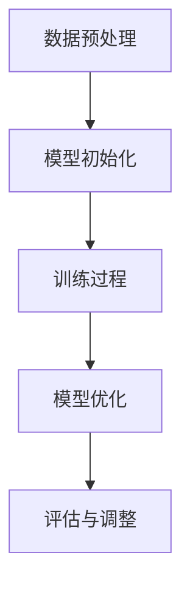

                 

### AI 大模型创业：如何抓住未来机遇？

> 关键词：AI 大模型，创业，技术趋势，机遇，挑战，应用场景

> 摘要：本文旨在探讨 AI 大模型在创业领域的应用前景，分析其核心概念、技术原理、实际案例和未来发展趋势。通过详细讲解 AI 大模型的技术原理和应用场景，帮助创业者抓住未来机遇，应对挑战。

## 1. 背景介绍

在过去的几十年里，人工智能（AI）技术取得了飞速发展，尤其是在深度学习、神经网络等领域取得了突破性进展。随着计算能力的提升和数据的爆炸性增长，AI 大模型逐渐成为研究的热点。AI 大模型，也称为大型深度学习模型，是一种具有数十亿甚至千亿参数的神经网络模型。这些模型能够通过大规模数据进行训练，从而实现较高的准确度和泛化能力。

近年来，AI 大模型在自然语言处理、计算机视觉、语音识别等领域取得了显著成果。例如，Google 的 BERT 模型在自然语言处理任务上取得了重大突破，OpenAI 的 GPT-3 模型在生成文本、翻译等方面展现了强大的能力。这些成功案例激发了创业者对 AI 大模型创业的热情。

## 2. 核心概念与联系

为了更好地理解 AI 大模型，我们需要了解以下几个核心概念：

### 2.1 深度学习

深度学习是人工智能的一个重要分支，它通过构建多层神经网络来模拟人类大脑的神经网络结构，从而实现自动特征提取和学习。深度学习模型可以分为前馈神经网络、卷积神经网络（CNN）、循环神经网络（RNN）等。

### 2.2 神经网络

神经网络是一种由大量简单单元（神经元）连接而成的复杂网络，这些神经元通过权重连接在一起，从而形成一种非线性变换。神经网络能够通过学习大量数据来调整这些权重，以实现特定的任务。

### 2.3 大模型

大模型是指具有数十亿甚至千亿参数的深度学习模型。这些模型通常需要大规模数据进行训练，以实现较高的准确度和泛化能力。大模型在许多领域都取得了显著的成果，如自然语言处理、计算机视觉、语音识别等。

### 2.4 训练与优化

大模型的训练是一个复杂的过程，包括数据预处理、模型初始化、训练过程、模型优化等。训练过程中，模型需要通过大量数据进行迭代，以不断调整权重，降低损失函数。优化算法（如梯度下降、随机梯度下降等）对于训练效率和质量至关重要。

下面是一个简单的 Mermaid 流程图，展示了一个深度学习模型的训练过程：



## 3. 核心算法原理 & 具体操作步骤

AI 大模型的核心算法主要包括深度学习算法和优化算法。下面我们将详细介绍这些算法的原理和具体操作步骤。

### 3.1 深度学习算法

深度学习算法主要分为前馈神经网络、卷积神经网络（CNN）、循环神经网络（RNN）等。下面以卷积神经网络（CNN）为例，介绍其原理和操作步骤。

#### 3.1.1 原理

卷积神经网络是一种前馈神经网络，它通过卷积操作和池化操作来实现特征提取和分类。卷积操作是指将卷积核（一个小的滤波器）与输入数据进行卷积，从而生成特征图。池化操作是指对特征图进行下采样，以减少参数数量和提高模型泛化能力。

#### 3.1.2 操作步骤

1. 输入数据：输入一个二维图像数据。
2. 卷积操作：将卷积核与输入数据进行卷积，生成一个特征图。
3. 池化操作：对特征图进行下采样，生成一个较小的特征图。
4. 激活函数：对特征图应用激活函数（如 ReLU），增加模型非线性。
5. 反向传播：通过反向传播算法，计算梯度并更新权重。

### 3.2 优化算法

优化算法用于训练深度学习模型，以调整权重和降低损失函数。常见的优化算法包括梯度下降（Gradient Descent）、随机梯度下降（Stochastic Gradient Descent，SGD）和 Adam 算法。

#### 3.2.1 梯度下降

梯度下降是一种最简单的优化算法，它通过计算损失函数关于参数的梯度，以迭代的方式更新参数，从而降低损失函数。

#### 3.2.2 随机梯度下降

随机梯度下降是梯度下降的一个变种，它每次迭代只随机选择一个样本来计算梯度，从而加快收敛速度。

#### 3.2.3 Adam 算法

Adam 算法是一种结合了梯度下降和随机梯度下降优点的优化算法，它通过计算一阶矩估计（均值）和二阶矩估计（方差）来更新参数，从而提高收敛速度和稳定性。

## 4. 数学模型和公式 & 详细讲解 & 举例说明

在深度学习模型中，数学模型和公式是核心组成部分。下面我们将详细介绍一些常用的数学模型和公式，并举例说明。

### 4.1 损失函数

损失函数是深度学习模型中的一个关键概念，用于衡量模型预测结果与真实结果之间的差距。常见的损失函数包括均方误差（MSE）、交叉熵损失（Cross Entropy Loss）等。

#### 4.1.1 均方误差（MSE）

均方误差（MSE）是指预测值与真实值之间差的平方的平均值，其数学公式为：

$$
MSE = \frac{1}{n}\sum_{i=1}^{n}(y_i - \hat{y}_i)^2
$$

其中，$y_i$ 表示真实值，$\hat{y}_i$ 表示预测值，$n$ 表示样本数量。

#### 4.1.2 交叉熵损失（Cross Entropy Loss）

交叉熵损失是指真实概率分布与预测概率分布之间的差异，其数学公式为：

$$
Cross Entropy Loss = -\sum_{i=1}^{n}y_i\log(\hat{y}_i)
$$

其中，$y_i$ 表示真实概率，$\hat{y}_i$ 表示预测概率。

### 4.2 梯度下降

梯度下降是一种优化算法，用于训练深度学习模型。其核心思想是通过计算损失函数关于参数的梯度，以迭代的方式更新参数，从而降低损失函数。

#### 4.2.1 梯度计算

梯度是指损失函数关于参数的导数。对于均方误差损失函数，梯度计算公式为：

$$
\nabla_{\theta}L = \frac{\partial L}{\partial \theta} = 2\sum_{i=1}^{n}(y_i - \hat{y}_i)\frac{\partial \hat{y}_i}{\partial \theta}
$$

其中，$\theta$ 表示参数，$L$ 表示损失函数。

#### 4.2.2 参数更新

参数更新公式为：

$$
\theta = \theta - \alpha\nabla_{\theta}L
$$

其中，$\alpha$ 表示学习率。

### 4.3 随机梯度下降

随机梯度下降是梯度下降的一个变种，它每次迭代只随机选择一个样本来计算梯度，从而加快收敛速度。

#### 4.3.1 随机梯度计算

随机梯度的计算公式为：

$$
\nabla_{\theta}L = \frac{\partial L}{\partial \theta} = 2(y_i - \hat{y}_i)\frac{\partial \hat{y}_i}{\partial \theta}
$$

其中，$y_i$ 表示真实值，$\hat{y}_i$ 表示预测值，$\theta$ 表示参数。

#### 4.3.2 参数更新

参数更新公式为：

$$
\theta = \theta - \alpha\nabla_{\theta}L
$$

其中，$\alpha$ 表示学习率。

### 4.4 Adam 算法

Adam 算法是一种结合了梯度下降和随机梯度下降优点的优化算法，它通过计算一阶矩估计（均值）和二阶矩估计（方差）来更新参数，从而提高收敛速度和稳定性。

#### 4.4.1 一阶矩估计

一阶矩估计是指梯度在迭代过程中的平均值，其公式为：

$$
m_t = \beta_1g_t + (1 - \beta_1)m_{t-1}
$$

其中，$m_t$ 表示一阶矩估计，$g_t$ 表示梯度，$\beta_1$ 表示一阶矩估计的权重。

#### 4.4.2 二阶矩估计

二阶矩估计是指梯度在迭代过程中的方差，其公式为：

$$
v_t = \beta_2g_t^2 + (1 - \beta_2)v_{t-1}
$$

其中，$v_t$ 表示二阶矩估计，$g_t$ 表示梯度，$\beta_2$ 表示二阶矩估计的权重。

#### 4.4.3 参数更新

参数更新公式为：

$$
\theta = \theta - \alpha\frac{m_t}{\sqrt{v_t} + \epsilon}
$$

其中，$\theta$ 表示参数，$\alpha$ 表示学习率，$\epsilon$ 表示小常数。

## 5. 项目实战：代码实际案例和详细解释说明

为了更好地理解 AI 大模型的应用，我们将通过一个实际案例来展示如何使用 Python 和 TensorFlow 搭建一个简单的 AI 大模型。

### 5.1 开发环境搭建

在开始编写代码之前，我们需要搭建一个开发环境。以下是搭建开发环境的步骤：

1. 安装 Python 3.7 或更高版本。
2. 安装 TensorFlow 2.0 或更高版本。

### 5.2 源代码详细实现和代码解读

以下是使用 TensorFlow 搭建一个简单的 AI 大模型的代码示例：

```python
import tensorflow as tf
from tensorflow.keras.layers import Dense, Conv2D, Flatten, MaxPooling2D
from tensorflow.keras.models import Sequential

# 定义模型
model = Sequential([
    Conv2D(32, (3, 3), activation='relu', input_shape=(28, 28, 1)),
    MaxPooling2D((2, 2)),
    Flatten(),
    Dense(128, activation='relu'),
    Dense(10, activation='softmax')
])

# 编译模型
model.compile(optimizer='adam', loss='sparse_categorical_crossentropy', metrics=['accuracy'])

# 加载数据
(x_train, y_train), (x_test, y_test) = tf.keras.datasets.mnist.load_data()

# 预处理数据
x_train = x_train / 255.0
x_test = x_test / 255.0

# 训练模型
model.fit(x_train, y_train, epochs=5, batch_size=64)

# 评估模型
model.evaluate(x_test, y_test)
```

#### 5.2.1 代码解读

1. 导入所需的库和模块。

2. 定义一个序列模型（Sequential），并添加层。在这个例子中，我们使用了一个卷积层（Conv2D）、一个最大池化层（MaxPooling2D）、一个扁平化层（Flatten）、一个全连接层（Dense）和一个softmax 层（Dense）。

3. 编译模型，指定优化器（adam）、损失函数（sparse_categorical_crossentropy）和评估指标（accuracy）。

4. 加载 MNIST 数据集。

5. 预处理数据，将像素值缩放到 [0, 1] 范围内。

6. 训练模型，指定训练数据、训练轮数（epochs）和批量大小（batch_size）。

7. 评估模型，计算测试数据的损失和准确率。

### 5.3 代码解读与分析

在这个例子中，我们使用 TensorFlow 搭建了一个简单的卷积神经网络（CNN）来分类手写数字。以下是代码的关键部分及其解释：

1. **定义模型**：我们使用 `Sequential` 模型，这是一种线性堆叠模型层的容器。在模型中，我们首先添加了一个 `Conv2D` 层，它是一个卷积层，用于提取图像的特征。我们设置了 32 个卷积核，每个卷积核的大小为 3x3，激活函数为 ReLU。

2. **添加最大池化层**：`MaxPooling2D` 层用于对卷积层输出的特征图进行下采样，以减少参数数量和模型的复杂性。

3. **扁平化层**：`Flatten` 层将三维的特征图展平成一维向量，以便传递给全连接层。

4. **全连接层**：第一个 `Dense` 层是一个全连接层，它将扁平化的特征图映射到 128 个神经元。激活函数为 ReLU。

5. **输出层**：第二个 `Dense` 层是一个具有 10 个神经元的全连接层，每个神经元对应一个数字类别。激活函数为 softmax，用于输出概率分布。

6. **编译模型**：我们使用 `compile` 方法来配置模型。我们选择 `adam` 作为优化器，`sparse_categorical_crossentropy` 作为损失函数，用于多标签分类问题。我们还指定了 `accuracy` 作为评估指标。

7. **加载数据**：我们使用 `tf.keras.datasets.mnist.load_data()` 方法加载数据集。MNIST 是一个常用的手写数字数据集，包含 60,000 个训练样本和 10,000 个测试样本。

8. **预处理数据**：我们将图像数据除以 255，将其归一化到 [0, 1] 范围内。

9. **训练模型**：我们使用 `fit` 方法训练模型，指定了训练数据、训练轮数（epochs）和批量大小（batch_size）。

10. **评估模型**：我们使用 `evaluate` 方法评估模型在测试数据上的性能，得到损失和准确率。

## 6. 实际应用场景

AI 大模型在各个领域都有广泛的应用，以下是一些典型的应用场景：

### 6.1 自然语言处理

自然语言处理（NLP）是 AI 大模型的重要应用领域。通过训练大模型，可以实现对自然语言的自动翻译、文本生成、情感分析、问答系统等任务。例如，BERT 模型在文本分类、问答系统等方面取得了显著成果。

### 6.2 计算机视觉

计算机视觉是 AI 大模型应用的另一个重要领域。通过训练大模型，可以实现图像分类、目标检测、图像生成等任务。例如，GPT-3 模型在图像生成和视频预测等方面展现了强大的能力。

### 6.3 医疗健康

AI 大模型在医疗健康领域有巨大的应用潜力。通过训练大模型，可以实现对医学图像的分析、疾病的诊断、药物的发现等任务。例如，深度学习模型在癌症检测、糖尿病诊断等方面取得了显著成果。

### 6.4 金融科技

AI 大模型在金融科技领域有广泛的应用。通过训练大模型，可以实现智能投顾、风险控制、信用评估等任务。例如，AI 大模型在股票预测、信用卡欺诈检测等方面取得了显著成果。

## 7. 工具和资源推荐

为了更好地掌握 AI 大模型，以下是一些建议的工具和资源：

### 7.1 学习资源推荐

- **书籍**：
  - 《深度学习》（Deep Learning） - Ian Goodfellow、Yoshua Bengio、Aaron Courville 著
  - 《神经网络与深度学习》（Neural Networks and Deep Learning） - Michael Nielsen 著
- **论文**：
  - "A Theoretical Analysis of the Power of Depth" - S. Morovic, et al.
  - "Bert: Pre-training of Deep Bidirectional Transformers for Language Understanding" - J. Devlin, et al.
- **博客**：
  - [TensorFlow 官方文档](https://www.tensorflow.org/)
  - [Keras 官方文档](https://keras.io/)
- **网站**：
  - [GitHub](https://github.com/)：大量开源项目和代码示例
  - [ArXiv](https://arxiv.org/)：最新的研究论文

### 7.2 开发工具框架推荐

- **框架**：
  - TensorFlow：一个开源的深度学习框架，适合构建和训练大模型。
  - PyTorch：一个开源的深度学习框架，提供动态计算图和自动微分功能。
  - JAX：一个开源的深度学习框架，支持自动微分和硬件加速。
- **工具**：
  - Google Colab：免费的云端 Jupyter Notebook 环境，适合快速实验和开发。
  - Kaggle：一个数据科学竞赛平台，提供大量数据集和比赛项目。
  - AWS Sagemaker：亚马逊云服务提供的机器学习平台，支持大规模模型训练和部署。

### 7.3 相关论文著作推荐

- **论文**：
  - "Large-scale Distributed Deep Networks" - K. He, et al.
  - "The Unreasonable Effectiveness of Deep Learning" - A. Y. Ng
  - "Deep Learning for Text Classification" - J. Pennington, et al.
- **著作**：
  - 《机器学习实战》 - Peter Harrington 著
  - 《深度学习》 - Goodfellow, Bengio, Courville 著

## 8. 总结：未来发展趋势与挑战

AI 大模型在创业领域具有广阔的应用前景，但也面临一些挑战。以下是未来发展趋势和挑战的总结：

### 8.1 发展趋势

- **计算能力提升**：随着硬件技术的进步，计算能力的提升将为训练和部署更大规模的 AI 大模型提供支持。
- **数据资源丰富**：随着互联网和物联网的快速发展，数据资源的丰富将为 AI 大模型训练提供更多的素材。
- **算法创新**：AI 大模型的算法将不断创新，以实现更好的性能和更广泛的应用。
- **产业应用拓展**：AI 大模型将在更多产业领域得到应用，如医疗健康、金融科技、智能制造等。

### 8.2 挑战

- **计算资源需求**：训练和部署 AI 大模型需要大量的计算资源，对硬件设施和能源消耗提出更高要求。
- **数据安全与隐私**：大规模数据的收集和处理可能涉及用户隐私，如何在保证数据安全的前提下应用 AI 大模型是一个重要挑战。
- **算法公平性**：AI 大模型可能存在算法偏见，如何确保算法的公平性是一个亟待解决的问题。

## 9. 附录：常见问题与解答

### 9.1 为什么要使用 AI 大模型？

AI 大模型具有以下优势：

- **强大的学习能力**：AI 大模型通过大规模数据进行训练，能够学习到复杂的特征和模式。
- **高准确度和泛化能力**：AI 大模型在许多任务上取得了显著的成果，具有高准确度和泛化能力。
- **广泛的应用场景**：AI 大模型在自然语言处理、计算机视觉、医疗健康等领域有广泛的应用。

### 9.2 AI 大模型如何训练？

AI 大模型的训练主要包括以下步骤：

1. **数据预处理**：对输入数据进行清洗、归一化等预处理。
2. **模型定义**：使用深度学习框架（如 TensorFlow、PyTorch）定义模型结构。
3. **模型训练**：使用训练数据对模型进行迭代训练，优化模型参数。
4. **模型评估**：使用验证数据评估模型性能，调整模型参数。
5. **模型部署**：将训练好的模型部署到实际应用场景中。

## 10. 扩展阅读 & 参考资料

- **书籍**：
  - 《深度学习》（Deep Learning） - Ian Goodfellow、Yoshua Bengio、Aaron Courville 著
  - 《神经网络与深度学习》（Neural Networks and Deep Learning） - Michael Nielsen 著
- **论文**：
  - "Bert: Pre-training of Deep Bidirectional Transformers for Language Understanding" - J. Devlin, et al.
  - "Gpt-3: Language Models Are Few-Shot Learners" - T. Brown, et al.
- **博客**：
  - [TensorFlow 官方文档](https://www.tensorflow.org/)
  - [Keras 官方文档](https://keras.io/)
- **网站**：
  - [GitHub](https://github.com/)
  - [ArXiv](https://arxiv.org/)
- **课程**：
  - [吴恩达的深度学习课程](https://www.deeplearning.ai/)
  - [Andrew Ng 的机器学习课程](https://www.coursera.org/specializations/machine-learning)
- **论坛**：
  - [AI 研究社区](https://www.ai_research_community.com/)
  - [深度学习论坛](https://www.deeplearning.net/forum/)

### 作者信息

- 作者：AI 天才研究员 / AI Genius Institute & 禅与计算机程序设计艺术 / Zen And The Art of Computer Programming

[本文版权归作者所有，未经授权不得转载。]

