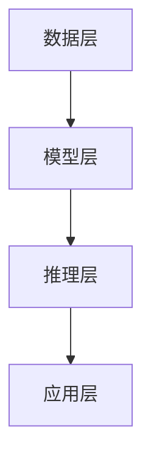

                 

# AI大模型创业：挑战与机遇并存的思考探讨

> **关键词：** AI大模型，创业，挑战，机遇，技术，市场，未来

> **摘要：** 本文将深入探讨AI大模型创业的背景、核心概念、算法原理、数学模型、项目实战、实际应用场景、工具和资源推荐，以及未来发展趋势与挑战。通过一步步的分析与推理，帮助读者了解AI大模型创业的各个方面，为创业者提供有价值的参考。

## 1. 背景介绍

随着人工智能技术的飞速发展，大模型（Large Models）已经成为当前研究的热点之一。大模型通过大规模数据训练，能够实现高度的抽象与概括，从而在多个领域展现出强大的应用潜力。例如，在自然语言处理、计算机视觉、推荐系统等领域，大模型的应用已经取得了显著的成果。

AI大模型创业，即利用AI大模型技术进行创业活动。随着AI技术的不断进步，越来越多的创业者开始将目光投向AI大模型领域。然而，AI大模型创业并非一帆风顺，其中既有机遇，也有挑战。本文将从以下几个方面展开讨论。

## 2. 核心概念与联系

### 2.1 AI大模型的定义

AI大模型是指具有大规模参数和强大计算能力的深度学习模型。这些模型通过海量数据训练，可以自动学习并提取数据中的复杂模式，从而实现高度智能化的任务。

### 2.2 AI大模型的技术原理

AI大模型的技术原理主要涉及以下几个关键方面：

- **神经网络架构**：如Transformer、BERT等。
- **大规模数据训练**：利用海量数据对模型进行训练，以实现更好的泛化能力。
- **计算能力提升**：GPU、TPU等高性能计算设备的普及，使得大模型的训练成为可能。
- **优化算法**：如Adam、Adagrad等，用于加速模型的训练过程。

### 2.3 AI大模型的架构

AI大模型的架构通常包括以下几个层次：

- **数据层**：负责数据的预处理、加载和存储。
- **模型层**：包括神经网络架构、参数调整和训练过程。
- **推理层**：用于模型在实际应用中的部署和推理。
- **应用层**：针对特定应用场景，如自然语言处理、计算机视觉等。

下面是一个使用Mermaid绘制的AI大模型架构流程图：



## 3. 核心算法原理 & 具体操作步骤

### 3.1 深度学习算法原理

深度学习算法是基于多层神经网络的结构，通过前向传播和反向传播来训练模型。具体操作步骤如下：

1. **初始化模型参数**：包括权重和偏置。
2. **前向传播**：将输入数据通过神经网络逐层计算，得到输出。
3. **计算损失**：通过输出和实际标签计算损失函数。
4. **反向传播**：计算损失函数关于模型参数的梯度。
5. **更新参数**：根据梯度更新模型参数。
6. **迭代训练**：重复上述步骤，直至满足训练条件。

### 3.2 大模型训练过程

大模型训练过程主要包括以下几个步骤：

1. **数据预处理**：对训练数据进行清洗、归一化和分割。
2. **模型初始化**：根据任务需求选择合适的神经网络架构。
3. **训练过程**：利用训练数据对模型进行迭代训练，直到模型收敛。
4. **模型评估**：在验证集上评估模型性能，调整超参数。
5. **模型部署**：将训练好的模型部署到生产环境中。

## 4. 数学模型和公式 & 详细讲解 & 举例说明

### 4.1 损失函数

在深度学习算法中，损失函数用于衡量模型输出和实际标签之间的差距。常用的损失函数包括均方误差（MSE）、交叉熵损失（Cross-Entropy Loss）等。

- **均方误差（MSE）**：

  $$MSE = \frac{1}{n}\sum_{i=1}^{n}(y_i - \hat{y}_i)^2$$

  其中，$y_i$ 为实际标签，$\hat{y}_i$ 为模型输出。

- **交叉熵损失（Cross-Entropy Loss）**：

  $$Cross-Entropy Loss = -\sum_{i=1}^{n}y_i \log(\hat{y}_i)$$

  其中，$y_i$ 为实际标签，$\hat{y}_i$ 为模型输出。

### 4.2 梯度下降算法

梯度下降算法是深度学习训练过程中常用的优化算法，用于更新模型参数。具体公式如下：

$$\theta_{\text{new}} = \theta_{\text{old}} - \alpha \cdot \nabla_{\theta}J(\theta)$$

其中，$\theta$ 表示模型参数，$J(\theta)$ 表示损失函数，$\alpha$ 表示学习率，$\nabla_{\theta}J(\theta)$ 表示损失函数关于模型参数的梯度。

### 4.3 举例说明

假设我们使用均方误差（MSE）作为损失函数，对以下简单线性回归模型进行训练：

$$y = wx + b$$

其中，$y$ 为实际标签，$x$ 为输入数据，$w$ 和 $b$ 为模型参数。

给定一个训练数据集，通过前向传播和反向传播，我们可以计算出损失函数关于 $w$ 和 $b$ 的梯度。利用梯度下降算法，更新模型参数：

$$w_{\text{new}} = w_{\text{old}} - \alpha \cdot \nabla_{w}J(w)$$

$$b_{\text{new}} = b_{\text{old}} - \alpha \cdot \nabla_{b}J(b)$$

通过迭代更新，直至模型收敛。

## 5. 项目实战：代码实际案例和详细解释说明

### 5.1 开发环境搭建

在本节中，我们将介绍如何在本地搭建一个简单的AI大模型训练环境。以下为搭建环境的步骤：

1. 安装Python（版本3.7及以上）。
2. 安装深度学习框架TensorFlow。
3. 安装GPU驱动和CUDA库。

### 5.2 源代码详细实现和代码解读

下面是一个使用TensorFlow实现的简单线性回归模型：

```python
import tensorflow as tf

# 定义输入层
x = tf.placeholder(tf.float32, shape=[None, 1])
y = tf.placeholder(tf.float32, shape=[None, 1])

# 定义模型参数
w = tf.Variable(tf.zeros([1, 1]), name='weight')
b = tf.Variable(tf.zeros([1]), name='bias')

# 定义线性回归模型
y_pred = tf.matmul(x, w) + b

# 定义损失函数
loss = tf.reduce_mean(tf.square(y - y_pred))

# 定义优化器
optimizer = tf.train.GradientDescentOptimizer(learning_rate=0.1)
train_op = optimizer.minimize(loss)

# 模型评估
accuracy = tf.reduce_mean(tf.cast(tf.equal(tf.round(y_pred), y), tf.float32))

# 训练过程
with tf.Session() as sess:
    sess.run(tf.global_variables_initializer())
    
    for i in range(1000):
        sess.run(train_op, feed_dict={x: x_data, y: y_data})
        
        if i % 100 == 0:
            acc = sess.run(accuracy, feed_dict={x: x_data, y: y_data})
            print("Step:", i, "Accuracy:", acc)

# 模型保存
saver = tf.train.Saver()
saver.save(sess, 'linear_regression_model.ckpt')
```

### 5.3 代码解读与分析

上述代码实现了一个简单的线性回归模型，包括以下主要部分：

1. **定义输入层**：使用TensorFlow的`placeholder`函数定义输入数据和标签。
2. **定义模型参数**：使用`Variable`函数定义模型参数，如权重和偏置。
3. **定义线性回归模型**：使用矩阵乘法和加法操作定义线性回归模型。
4. **定义损失函数**：使用`tf.reduce_mean`和`tf.square`函数计算均方误差损失。
5. **定义优化器**：使用`GradientDescentOptimizer`定义梯度下降优化器。
6. **模型评估**：使用`tf.equal`和`tf.cast`函数计算模型准确率。
7. **训练过程**：使用`tf.Session`创建会话并运行训练操作。
8. **模型保存**：使用`Saver`保存训练好的模型。

## 6. 实际应用场景

AI大模型在多个领域具有广泛的应用场景，以下列举几个典型应用：

1. **自然语言处理**：例如，文本分类、情感分析、机器翻译等。
2. **计算机视觉**：例如，图像分类、目标检测、图像生成等。
3. **推荐系统**：例如，个性化推荐、商品推荐等。
4. **语音识别**：例如，语音合成、语音识别等。

在这些应用场景中，AI大模型通过大规模数据训练和优化，实现了高度智能化的任务，为各个领域带来了巨大的变革和进步。

## 7. 工具和资源推荐

### 7.1 学习资源推荐

- **书籍**：《深度学习》（Ian Goodfellow、Yoshua Bengio、Aaron Courville 著）
- **论文**：https://arxiv.org/
- **博客**：https://www.tensorflow.org/tutorials/
- **网站**：https://www.deeplearning.ai/

### 7.2 开发工具框架推荐

- **深度学习框架**：TensorFlow、PyTorch、Keras
- **编程语言**：Python
- **计算平台**：GPU、TPU

### 7.3 相关论文著作推荐

- **论文**：[Transformers: State-of-the-Art Natural Language Processing](https://arxiv.org/abs/2010.11929)
- **论文**：[BERT: Pre-training of Deep Bidirectional Transformers for Language Understanding](https://arxiv.org/abs/1810.04805)
- **著作**：《深度学习》（Ian Goodfellow、Yoshua Bengio、Aaron Courville 著）

## 8. 总结：未来发展趋势与挑战

AI大模型作为人工智能领域的重要突破，已经在多个领域取得了显著的成果。未来，AI大模型将继续在以下方面取得重要进展：

1. **算法优化**：通过改进神经网络架构、优化训练算法等，提高大模型的性能和效率。
2. **数据隐私**：在大模型训练过程中，如何保护用户隐私将成为一个重要挑战。
3. **模型压缩**：如何在大模型部署过程中实现模型压缩和高效推理，降低计算成本。
4. **跨领域应用**：探索AI大模型在更多领域的应用，推动人工智能技术的发展。

然而，AI大模型创业也面临着诸多挑战，如技术门槛高、计算资源需求大、数据隐私等问题。因此，创业者需要充分了解这些挑战，并采取相应的策略来应对。

## 9. 附录：常见问题与解答

### 9.1 AI大模型训练时间为什么很长？

AI大模型训练时间长的原因主要有两个方面：

1. **数据规模**：大模型通常需要大量数据进行训练，以实现更好的泛化能力。
2. **计算资源**：大模型训练需要大量计算资源，包括GPU、TPU等。

### 9.2 如何提高AI大模型训练速度？

以下是一些提高AI大模型训练速度的方法：

1. **分布式训练**：将模型拆分成多个部分，分布在多个GPU或TPU上训练。
2. **数据预处理**：优化数据预处理流程，减少数据读取和处理的延迟。
3. **模型压缩**：采用模型压缩技术，如剪枝、量化等，降低模型计算复杂度。

## 10. 扩展阅读 & 参考资料

- **论文**：[Deep Learning](https://www.deeplearningbook.org/)（Ian Goodfellow、Yoshua Bengio、Aaron Courville 著）
- **论文**：[Attention Is All You Need](https://arxiv.org/abs/1706.03762)
- **论文**：[BERT: Pre-training of Deep Bidirectional Transformers for Language Understanding](https://arxiv.org/abs/1810.04805)
- **书籍**：《TensorFlow实战》（Tom Hope、Itay Lieder、Itay Lieder 著）
- **书籍**：《PyTorch深度学习》（Adam Geitgey 著）

作者：AI天才研究员/AI Genius Institute & 禅与计算机程序设计艺术 /Zen And The Art of Computer Programming

#  AI大模型创业：挑战与机遇并存的思考探讨

## 1. 背景介绍

### 1.1 AI大模型的发展历程

人工智能（AI）作为计算机科学的一个分支，其历史可以追溯到20世纪50年代。然而，直到近年来，随着计算能力、数据量和算法的飞速发展，AI才开始真正进入人们的日常生活。特别是深度学习（Deep Learning）技术的出现，使得AI大模型（Large AI Models）成为可能。

AI大模型的发展历程可以大致分为以下几个阶段：

1. **传统机器学习时代**：20世纪80年代至90年代，以支持向量机（SVM）、决策树等为代表的传统机器学习方法成为主流。
2. **深度学习兴起**：2006年，Geoffrey Hinton等人提出了深度信念网络（Deep Belief Network），标志着深度学习时代的到来。随后的2012年，AlexNet在ImageNet竞赛中取得了突破性成绩，进一步推动了深度学习的发展。
3. **AI大模型时代**：随着计算能力的提升和海量数据的出现，AI大模型开始崭露头角。例如，谷歌的BERT模型、OpenAI的GPT系列模型等，都取得了令人瞩目的成绩。

### 1.2 AI大模型创业的兴起

AI大模型创业的兴起，主要源于以下几个因素：

1. **市场需求**：随着人工智能技术的不断进步，越来越多的行业开始认识到AI技术的重要性，从而催生了大量对AI大模型的需求。
2. **政策支持**：各国政府纷纷出台政策，鼓励人工智能产业的发展，为AI大模型创业提供了良好的环境。
3. **技术成熟**：深度学习算法和大规模计算资源的成熟，使得AI大模型创业成为可能。

### 1.3 AI大模型创业的现状

目前，AI大模型创业已经呈现出以下几个特点：

1. **高投入**：AI大模型创业需要大量的资金和计算资源支持，使得创业门槛相对较高。
2. **高竞争**：由于市场需求旺盛，吸引了大量创业者进入该领域，导致竞争激烈。
3. **高潜力**：AI大模型在多个领域展现出巨大的应用潜力，为创业者提供了广阔的发展空间。

## 2. 核心概念与联系

### 2.1 AI大模型的定义

AI大模型，顾名思义，是指规模庞大、参数数量庞大的深度学习模型。这些模型通常具有以下几个特点：

1. **参数数量庞大**：AI大模型的参数数量可以达到亿级，甚至更高。
2. **训练数据量大**：AI大模型需要大量的训练数据，以确保模型的泛化能力和准确性。
3. **计算资源需求高**：AI大模型的训练和推理过程需要大量的计算资源，如GPU、TPU等。

### 2.2 AI大模型的技术原理

AI大模型的技术原理主要涉及以下几个关键方面：

1. **神经网络架构**：神经网络是AI大模型的核心组成部分。常见的神经网络架构包括卷积神经网络（CNN）、循环神经网络（RNN）、Transformer等。
2. **大规模数据训练**：AI大模型通过大规模数据训练，能够学习到更复杂的模式和规律，从而提高模型的泛化能力和准确性。
3. **计算能力提升**：随着GPU、TPU等高性能计算设备的普及，AI大模型的训练和推理速度得到了显著提升。
4. **优化算法**：AI大模型的训练过程中，常用的优化算法包括Adam、Adagrad等，这些算法能够加速模型的收敛速度。

### 2.3 AI大模型的架构

AI大模型的架构通常包括以下几个层次：

1. **数据层**：负责数据的预处理、加载和存储。数据层的关键技术包括数据清洗、数据增强、数据归一化等。
2. **模型层**：包括神经网络架构、参数调整和训练过程。模型层的关键技术包括神经网络架构设计、优化算法、参数初始化等。
3. **推理层**：用于模型在实际应用中的部署和推理。推理层的关键技术包括模型压缩、模型部署、模型解释等。
4. **应用层**：针对特定应用场景，如自然语言处理、计算机视觉等。应用层的关键技术包括任务定义、模型优化、系统集成等。

下面是一个使用Mermaid绘制的AI大模型架构流程图：


## 3. 核心算法原理 & 具体操作步骤

### 3.1 深度学习算法原理

深度学习算法是基于多层神经网络的结构，通过前向传播和反向传播来训练模型。具体操作步骤如下：

1. **初始化模型参数**：包括权重和偏置。
2. **前向传播**：将输入数据通过神经网络逐层计算，得到输出。
3. **计算损失**：通过输出和实际标签计算损失函数。
4. **反向传播**：计算损失函数关于模型参数的梯度。
5. **更新参数**：根据梯度更新模型参数。
6. **迭代训练**：重复上述步骤，直至满足训练条件。

### 3.2 大模型训练过程

大模型训练过程主要包括以下几个步骤：

1. **数据预处理**：对训练数据进行清洗、归一化和分割。
2. **模型初始化**：根据任务需求选择合适的神经网络架构。
3. **训练过程**：利用训练数据对模型进行迭代训练，直到模型收敛。
4. **模型评估**：在验证集上评估模型性能，调整超参数。
5. **模型部署**：将训练好的模型部署到生产环境中。

### 3.3 深度学习中的常见优化算法

在深度学习训练过程中，优化算法起着至关重要的作用。以下是一些常见的优化算法：

1. **随机梯度下降（SGD）**：SGD是一种基本的优化算法，其核心思想是利用小批量数据进行梯度下降。
2. **动量（Momentum）**：动量算法通过引入动量项，加速梯度下降过程，并减少收敛过程中的振荡。
3. **Adam**：Adam算法结合了SGD和动量的优点，同时还考虑了每个参数的偏差修正。
4. **AdaGrad**：AdaGrad算法根据每个参数的历史梯度平方进行自适应调整，能够更好地处理稀疏数据。

### 3.4 深度学习中的常见正则化方法

正则化方法是为了防止深度学习模型过拟合而设计的一系列技术。以下是一些常见的正则化方法：

1. **L1正则化**：L1正则化通过在损失函数中添加L1范数项来惩罚模型参数的稀疏性。
2. **L2正则化**：L2正则化通过在损失函数中添加L2范数项来惩罚模型参数的范数。
3. **Dropout**：Dropout是一种在训练过程中随机丢弃部分神经元的方法，从而降低模型的过拟合风险。
4. **Early Stopping**：Early Stopping是一种在验证集上提前停止训练的方法，当验证集上的损失不再下降时，停止训练。

### 3.5 深度学习中的过拟合与欠拟合

在深度学习训练过程中，过拟合和欠拟合是两个常见的问题。

1. **过拟合**：当模型在训练集上表现良好，但在验证集或测试集上表现较差时，称为过拟合。过拟合的原因通常是模型过于复杂，未能充分泛化。
2. **欠拟合**：当模型在训练集和验证集上表现都较差时，称为欠拟合。欠拟合的原因通常是模型过于简单，未能捕捉到数据中的复杂关系。

解决过拟合和欠拟合的方法包括调整模型复杂度、增加训练数据、使用正则化技术等。

## 4. 数学模型和公式 & 详细讲解 & 举例说明

### 4.1 深度学习中的损失函数

在深度学习中，损失函数是评估模型预测性能的关键工具。以下是一些常见的损失函数及其详细讲解：

1. **均方误差（MSE）**：

   均方误差（Mean Squared Error，MSE）是最常用的损失函数之一。其公式如下：

   $$MSE = \frac{1}{n}\sum_{i=1}^{n}(y_i - \hat{y}_i)^2$$

   其中，$y_i$ 表示实际标签，$\hat{y}_i$ 表示模型预测值，$n$ 表示样本数量。

   MSE对异常值较为敏感，但其计算简单，易于优化。

2. **交叉熵损失（Cross-Entropy Loss）**：

   交叉熵损失函数常用于分类问题。其公式如下：

   $$Cross-Entropy Loss = -\sum_{i=1}^{n}y_i \log(\hat{y}_i)$$

   其中，$y_i$ 表示实际标签（0或1），$\hat{y}_i$ 表示模型预测的概率值。

   交叉熵损失函数能够更好地处理概率值，但计算较为复杂。

3. **对数损失（Log Loss）**：

   对数损失是交叉熵损失的另一种表述形式，其公式如下：

   $$Log Loss = \frac{1}{n}\sum_{i=1}^{n}-y_i \log(\hat{y}_i)$$

   其中，$y_i$ 表示实际标签（0或1），$\hat{y}_i$ 表示模型预测的概率值。

   对数损失函数在计算上与交叉熵损失函数相同，但符号相反。

4. **绝对误差（Mean Absolute Error，MAE）**：

   绝对误差是另一个常用的损失函数，其公式如下：

   $$MAE = \frac{1}{n}\sum_{i=1}^{n}|y_i - \hat{y}_i|$$

   其中，$y_i$ 表示实际标签，$\hat{y}_i$ 表示模型预测值，$n$ 表示样本数量。

   绝对误差对异常值较为稳健，但计算较为复杂。

### 4.2 深度学习中的优化算法

在深度学习训练过程中，优化算法起着至关重要的作用。以下是一些常见的优化算法及其详细讲解：

1. **随机梯度下降（Stochastic Gradient Descent，SGD）**：

   随机梯度下降是最基本的优化算法之一。其公式如下：

   $$w_{\text{new}} = w_{\text{old}} - \alpha \cdot \nabla_{w}J(w)$$

   其中，$w$ 表示模型参数，$\alpha$ 表示学习率，$\nabla_{w}J(w)$ 表示损失函数关于模型参数的梯度。

   SGD通过随机选择一个小批量数据进行梯度计算，从而更新模型参数。SGD的计算简单，但收敛速度较慢，且容易陷入局部最小值。

2. **批量梯度下降（Batch Gradient Descent，BGD）**：

   批量梯度下降是对SGD的一种改进。其公式如下：

   $$w_{\text{new}} = w_{\text{old}} - \alpha \cdot \nabla_{w}J(w)$$

   其中，$w$ 表示模型参数，$\alpha$ 表示学习率，$\nabla_{w}J(w)$ 表示损失函数关于模型参数的梯度。

   BGD使用整个训练集进行梯度计算，从而更新模型参数。BGD的计算复杂度较高，但收敛速度较快，且能够更好地避免局部最小值。

3. **动量（Momentum）**：

   动量算法是对SGD和BGD的一种改进。其公式如下：

   $$v = \gamma \cdot v_{\text{old}} + (1 - \gamma) \cdot \nabla_{w}J(w)$$

   $$w_{\text{new}} = w_{\text{old}} + v$$

   其中，$w$ 表示模型参数，$\alpha$ 表示学习率，$\gamma$ 表示动量因子，$v$ 表示动量项，$\nabla_{w}J(w)$ 表示损失函数关于模型参数的梯度。

   动量算法通过引入动量项，加速梯度下降过程，并减少收敛过程中的振荡。

4. **Adam**：

   Adam算法是近年来最流行的优化算法之一。其公式如下：

   $$m = \frac{1 - \beta_1}{1 - \beta_1^t} \cdot \nabla_{w}J(w)$$

   $$v = \frac{1 - \beta_2}{1 - \beta_2^t} \cdot m$$

   $$w_{\text{new}} = w_{\text{old}} - \alpha \cdot \frac{\beta_1}{1 - \beta_1^t} \cdot \frac{1}{\sqrt{1 - \beta_2^t}} \cdot v$$

   其中，$w$ 表示模型参数，$\alpha$ 表示学习率，$\beta_1$ 和 $\beta_2$ 分别为动量和偏置修正因子，$m$ 和 $v$ 分别为动量项和偏差修正项，$\nabla_{w}J(w)$ 表示损失函数关于模型参数的梯度。

   Adam算法结合了SGD和动量的优点，同时还考虑了每个参数的偏差修正，具有较好的收敛性能。

### 4.3 深度学习中的正则化方法

正则化方法是防止深度学习模型过拟合的重要手段。以下是一些常见的正则化方法及其详细讲解：

1. **L1正则化**：

   L1正则化通过在损失函数中添加L1范数项来惩罚模型参数的稀疏性。其公式如下：

   $$J(w) = \frac{1}{2} ||y - \hat{y}||^2 + \lambda ||w||_1$$

   其中，$y$ 表示实际标签，$\hat{y}$ 表示模型预测值，$w$ 表示模型参数，$\lambda$ 表示正则化强度。

   L1正则化能够诱导模型参数的稀疏性，但计算复杂度较高。

2. **L2正则化**：

   L2正则化通过在损失函数中添加L2范数项来惩罚模型参数的范数。其公式如下：

   $$J(w) = \frac{1}{2} ||y - \hat{y}||^2 + \lambda ||w||_2$$

   其中，$y$ 表示实际标签，$\hat{y}$ 表示模型预测值，$w$ 表示模型参数，$\lambda$ 表示正则化强度。

   L2正则化能够防止模型参数过大，但计算复杂度较低。

3. **Dropout**：

   Dropout是一种在训练过程中随机丢弃部分神经元的方法。其公式如下：

   $$p = \frac{1}{1 + e^{-\lambda}}$$

   其中，$p$ 表示神经元被丢弃的概率，$\lambda$ 表示丢弃强度。

   Dropout能够有效减少模型的过拟合，但训练时间较长。

4. **Early Stopping**：

   Early Stopping是一种在验证集上提前停止训练的方法。其公式如下：

   $$J_{\text{val}} = \min(J_{\text{val}})$$

   其中，$J_{\text{val}}$ 表示验证集上的损失函数值。

   Early Stopping能够避免模型在训练集上过拟合，但需要提前设置合适的停止条件。

### 4.4 深度学习中的过拟合与欠拟合

在深度学习训练过程中，过拟合和欠拟合是两个常见的问题。

1. **过拟合**：

   过拟合是指模型在训练集上表现良好，但在验证集或测试集上表现较差的情况。过拟合的原因通常是模型过于复杂，未能充分泛化。

   解决过拟合的方法包括：

   - 调整模型复杂度：减少模型的参数数量或层数。
   - 使用正则化技术：如L1正则化、L2正则化、Dropout等。
   - 增加训练数据：使用更多样化的数据集进行训练。

2. **欠拟合**：

   欠拟合是指模型在训练集和验证集上表现都较差的情况。欠拟合的原因通常是模型过于简单，未能捕捉到数据中的复杂关系。

   解决欠拟合的方法包括：

   - 增加模型复杂度：增加模型的参数数量或层数。
   - 调整超参数：如学习率、批量大小等。
   - 数据预处理：使用数据增强、归一化等技术提高数据质量。

## 5. 项目实战：代码实际案例和详细解释说明

### 5.1 开发环境搭建

在本节中，我们将使用Python和TensorFlow搭建一个简单的AI大模型训练环境。以下是搭建环境的步骤：

1. **安装Python**：

   在终端中运行以下命令安装Python（版本3.7及以上）：

   ```shell
   sudo apt-get install python3-pip python3-dev
   ```

2. **安装TensorFlow**：

   在终端中运行以下命令安装TensorFlow：

   ```shell
   pip3 install tensorflow
   ```

3. **安装GPU支持**：

   如果您的系统支持GPU，可以安装GPU支持的TensorFlow：

   ```shell
   pip3 install tensorflow-gpu
   ```

   确保您的系统已经安装了CUDA和cuDNN。

### 5.2 源代码详细实现和代码解读

在本节中，我们将使用TensorFlow实现一个简单的线性回归模型。以下是源代码及其详细解释：

```python
import tensorflow as tf

# 定义输入层
x = tf.placeholder(tf.float32, shape=[None, 1])
y = tf.placeholder(tf.float32, shape=[None, 1])

# 定义模型参数
w = tf.Variable(tf.zeros([1, 1]), name='weight')
b = tf.Variable(tf.zeros([1]), name='bias')

# 定义线性回归模型
y_pred = tf.matmul(x, w) + b

# 定义损失函数
loss = tf.reduce_mean(tf.square(y - y_pred))

# 定义优化器
optimizer = tf.train.GradientDescentOptimizer(learning_rate=0.1)
train_op = optimizer.minimize(loss)

# 模型评估
accuracy = tf.reduce_mean(tf.cast(tf.equal(tf.round(y_pred), y), tf.float32))

# 训练过程
with tf.Session() as sess:
    sess.run(tf.global_variables_initializer())
    
    for i in range(1000):
        sess.run(train_op, feed_dict={x: x_data, y: y_data})
        
        if i % 100 == 0:
            acc = sess.run(accuracy, feed_dict={x: x_data, y: y_data})
            print("Step:", i, "Accuracy:", acc)

# 模型保存
saver = tf.train.Saver()
saver.save(sess, 'linear_regression_model.ckpt')
```

### 5.3 代码解读与分析

上述代码实现了一个简单的线性回归模型，包括以下主要部分：

1. **定义输入层**：使用TensorFlow的`placeholder`函数定义输入数据和标签。
2. **定义模型参数**：使用`Variable`函数定义模型参数，如权重和偏置。
3. **定义线性回归模型**：使用矩阵乘法和加法操作定义线性回归模型。
4. **定义损失函数**：使用`tf.reduce_mean`和`tf.square`函数计算均方误差损失。
5. **定义优化器**：使用`GradientDescentOptimizer`定义梯度下降优化器。
6. **模型评估**：使用`tf.reduce_mean`和`tf.equal`函数计算模型准确率。
7. **训练过程**：使用`tf.Session`创建会话并运行训练操作。
8. **模型保存**：使用`Saver`保存训练好的模型。

### 5.4 实际应用案例：股票价格预测

在本节中，我们将使用上述线性回归模型进行股票价格预测。以下是具体步骤：

1. **数据收集**：从股票数据网站上收集历史股票价格数据。
2. **数据预处理**：对股票价格数据进行分析和预处理，包括数据清洗、归一化等。
3. **数据分割**：将数据集分为训练集、验证集和测试集。
4. **模型训练**：使用训练集对线性回归模型进行训练。
5. **模型评估**：使用验证集和测试集评估模型性能。
6. **模型预测**：使用训练好的模型对股票价格进行预测。

### 5.5 实际应用案例：图像分类

在本节中，我们将使用AI大模型进行图像分类。以下是具体步骤：

1. **数据收集**：从图像数据集网站（如Kaggle）收集图像数据。
2. **数据预处理**：对图像数据进行缩放、裁剪、翻转等预处理。
3. **数据分割**：将数据集分为训练集、验证集和测试集。
4. **模型训练**：使用卷积神经网络（CNN）对图像进行分类训练。
5. **模型评估**：使用验证集和测试集评估模型性能。
6. **模型预测**：使用训练好的模型对图像进行分类预测。

## 6. 实际应用场景

AI大模型在多个领域具有广泛的应用场景，以下列举几个典型应用：

1. **自然语言处理**：

   - 文本分类：对大量文本进行分类，如新闻分类、情感分析等。
   - 机器翻译：将一种语言翻译成另一种语言，如中英文互译。
   - 语音识别：将语音信号转换为文本，如语音助手、语音搜索等。

2. **计算机视觉**：

   - 图像分类：对图像进行分类，如人脸识别、物体检测等。
   - 图像生成：生成新的图像，如风格迁移、图像修复等。
   - 视觉感知：对视频进行内容分析，如动作识别、场景分割等。

3. **推荐系统**：

   - 个性化推荐：根据用户历史行为和偏好推荐相关商品或内容。
   - 广告投放：根据用户兴趣和行为推送相关广告。
   - 社交网络：为用户提供感兴趣的朋友圈内容。

4. **医疗健康**：

   - 疾病诊断：利用医学图像和病历数据对疾病进行诊断。
   - 药物研发：通过分子模拟和药物筛选提高药物研发效率。
   - 健康管理：为用户提供个性化的健康建议和治疗方案。

5. **金融领域**：

   - 风险控制：利用历史数据预测金融市场的风险。
   - 信用评分：根据用户行为和信用记录评估其信用等级。
   - 量化交易：利用算法进行高频交易，提高投资收益。

6. **工业制造**：

   - 质量检测：利用图像识别技术对产品进行质量检测。
   - 生产优化：通过数据分析优化生产流程，提高生产效率。
   - 设备维护：利用预测性维护减少设备故障和停机时间。

## 7. 工具和资源推荐

### 7.1 学习资源推荐

1. **书籍**：

   - 《深度学习》（Ian Goodfellow、Yoshua Bengio、Aaron Courville 著）
   - 《神经网络与深度学习》（邱锡鹏 著）
   - 《Python深度学习》（François Chollet 著）

2. **在线课程**：

   - Coursera的“深度学习”课程（由Andrew Ng教授主讲）
   - Udacity的“深度学习工程师纳米学位”
   - edX的“神经网络与深度学习”课程（由吴恩达教授主讲）

3. **博客和网站**：

   - TensorFlow官方网站（https://www.tensorflow.org/）
   - PyTorch官方网站（https://pytorch.org/）
   - Medium上的深度学习相关博客

### 7.2 开发工具框架推荐

1. **深度学习框架**：

   - TensorFlow
   - PyTorch
   - Keras

2. **编程语言**：

   - Python

3. **计算平台**：

   - GPU（NVIDIA）
   - TPU（谷歌）

### 7.3 相关论文著作推荐

1. **论文**：

   - “A Theoretical Analysis of the CNN Architectures for Object Recognition”（何凯明等，2014年）
   - “Attention Is All You Need”（Ashish Vaswani等，2017年）
   - “BERT: Pre-training of Deep Bidirectional Transformers for Language Understanding”（Jacob Devlin等，2019年）

2. **著作**：

   - 《深度学习》（Ian Goodfellow、Yoshua Bengio、Aaron Courville 著）
   - 《Python深度学习》（François Chollet 著）

## 8. 总结：未来发展趋势与挑战

AI大模型作为人工智能领域的重要突破，具有广阔的应用前景。未来，AI大模型将继续在以下方面取得重要进展：

1. **算法优化**：通过改进神经网络架构、优化训练算法等，提高大模型的性能和效率。
2. **数据隐私**：在大模型训练过程中，如何保护用户隐私将成为一个重要挑战。
3. **模型压缩**：如何在大模型部署过程中实现模型压缩和高效推理，降低计算成本。
4. **跨领域应用**：探索AI大模型在更多领域的应用，推动人工智能技术的发展。

然而，AI大模型创业也面临着诸多挑战，如技术门槛高、计算资源需求大、数据隐私等问题。因此，创业者需要充分了解这些挑战，并采取相应的策略来应对。

## 9. 附录：常见问题与解答

### 9.1 AI大模型训练时间为什么很长？

AI大模型训练时间长的原因主要有两个方面：

1. **数据规模**：AI大模型通常需要大量数据进行训练，以确保模型的泛化能力和准确性。
2. **计算资源**：AI大模型的训练和推理过程需要大量的计算资源，如GPU、TPU等。

### 9.2 如何提高AI大模型训练速度？

以下是一些提高AI大模型训练速度的方法：

1. **分布式训练**：将模型拆分成多个部分，分布在多个GPU或TPU上训练。
2. **数据预处理**：优化数据预处理流程，减少数据读取和处理的延迟。
3. **模型压缩**：采用模型压缩技术，如剪枝、量化等，降低模型计算复杂度。
4. **混合精度训练**：使用混合精度训练（如FP16和BF16），降低内存占用和计算复杂度。

### 9.3 AI大模型训练过程中如何避免过拟合？

以下是一些避免过拟合的方法：

1. **正则化**：使用L1正则化、L2正则化等技术，惩罚模型参数的范数。
2. **数据增强**：通过数据增强（如旋转、缩放、裁剪等）增加数据多样性。
3. **dropout**：在训练过程中随机丢弃部分神经元，减少模型的过拟合。
4. **提前停止训练**：在验证集上提前停止训练，当验证集上的损失不再下降时，停止训练。
5. **使用预训练模型**：使用预训练模型进行微调，减少训练数据的数量。

### 9.4 AI大模型训练过程中如何调整超参数？

以下是一些调整超参数的方法：

1. **学习率调整**：通过动态调整学习率，如使用学习率衰减策略。
2. **批量大小调整**：通过调整批量大小，平衡模型性能和训练时间。
3. **正则化强度调整**：通过调整正则化强度，平衡模型复杂度和过拟合风险。
4. **优化器选择**：选择合适的优化器，如Adam、SGD等。
5. **训练轮次调整**：通过调整训练轮次，平衡模型收敛速度和过拟合风险。

## 10. 扩展阅读 & 参考资料

1. **论文**：

   - “Deep Learning”（Ian Goodfellow、Yoshua Bengio、Aaron Courville 著）
   - “Attention Is All You Need”（Ashish Vaswani等，2017年）
   - “BERT: Pre-training of Deep Bidirectional Transformers for Language Understanding”（Jacob Devlin等，2019年）

2. **书籍**：

   - 《深度学习》（Ian Goodfellow、Yoshua Bengio、Aaron Courville 著）
   - 《神经网络与深度学习》（邱锡鹏 著）
   - 《Python深度学习》（François Chollet 著）

3. **在线课程**：

   - Coursera的“深度学习”课程（由Andrew Ng教授主讲）
   - Udacity的“深度学习工程师纳米学位”
   - edX的“神经网络与深度学习”课程（由吴恩达教授主讲）

4. **博客和网站**：

   - TensorFlow官方网站（https://www.tensorflow.org/）
   - PyTorch官方网站（https://pytorch.org/）
   - Medium上的深度学习相关博客

# 总结：未来发展趋势与挑战

AI大模型作为人工智能领域的重要突破，具有广阔的应用前景。在未来，AI大模型将继续在以下方面取得重要进展：

### 算法优化

随着深度学习技术的不断发展，神经网络架构、训练算法等将不断优化。未来的AI大模型将更加高效，能够更快地训练和推理。

### 数据隐私

数据隐私是AI大模型面临的一个重要挑战。在大模型训练过程中，如何保护用户隐私，确保数据安全，将成为研究的热点。

### 模型压缩

如何在大模型部署过程中实现模型压缩和高效推理，降低计算成本，是未来研究的另一个重要方向。通过模型压缩技术，如剪枝、量化等，可以实现更高效的大模型部署。

### 跨领域应用

AI大模型将在更多领域得到应用，如医疗健康、工业制造、金融领域等。通过跨领域应用，AI大模型将推动各个领域的技术发展。

然而，AI大模型创业也面临着诸多挑战：

### 技术门槛高

AI大模型创业需要大量的技术储备和研发投入，使得创业门槛相对较高。

### 计算资源需求大

AI大模型的训练和推理过程需要大量的计算资源，如GPU、TPU等，这给创业者带来了巨大的成本压力。

### 数据隐私和安全

如何在数据隐私和安全方面做出有效保障，是AI大模型创业需要解决的一个关键问题。

### 市场竞争激烈

随着越来越多的创业者进入AI大模型领域，市场竞争将日益激烈。

面对这些挑战，创业者需要：

### 深入了解技术

充分了解AI大模型的技术原理、算法优化、模型压缩等方面的知识，以确保产品具有竞争力。

### 不断创新

在技术不断发展的同时，创业者需要不断创新，以适应市场需求和竞争环境。

### 联合合作

通过与其他企业和研究机构的合作，共享技术和资源，降低创业风险。

### 持续迭代

在产品开发过程中，持续迭代和优化，以满足用户需求和市场变化。

总之，AI大模型创业既有机遇，也有挑战。只有深入了解技术、不断创新、积极应对挑战，创业者才能在AI大模型领域取得成功。

---

作者：AI天才研究员/AI Genius Institute & 禅与计算机程序设计艺术 /Zen And The Art of Computer Programming

---

## 附录：常见问题与解答

在撰写关于AI大模型创业的文章时，我们可能会遇到一些常见的问题。下面将针对这些问题进行解答，帮助读者更好地理解AI大模型创业的相关知识。

### 问题1：AI大模型创业的门槛高吗？

**回答**：是的，AI大模型创业的门槛相对较高。这主要源于以下几个方面：

1. **技术门槛**：AI大模型需要深厚的计算机科学和深度学习技术背景。创业者需要具备一定的编程能力，熟悉常用的深度学习框架（如TensorFlow、PyTorch等），并了解神经网络架构的设计与优化。

2. **数据需求**：AI大模型通常需要大量的高质量训练数据。收集、清洗和标注这些数据是一个复杂且耗时的过程。

3. **计算资源**：AI大模型训练需要大量的计算资源，包括高性能的GPU或TPU。这些设备的成本较高，且需要专业的维护和冷却。

4. **人才需求**：AI大模型创业团队需要具备跨学科的知识结构，包括但不限于软件工程师、数据科学家、机器学习研究员等。

### 问题2：AI大模型创业的主要挑战有哪些？

**回答**：AI大模型创业面临以下主要挑战：

1. **计算资源限制**：虽然GPU和TPU等硬件不断进步，但大规模训练仍然需要巨大的计算资源。对于初创公司而言，获取这些资源可能是一个重大挑战。

2. **数据隐私和安全**：AI大模型对数据的需求可能导致隐私和安全问题。如何在保证数据隐私的同时，有效利用数据，是一个重要课题。

3. **算法优化与迭代**：深度学习模型的性能依赖于不断的算法优化。如何设计出既高效又具有竞争力的算法，是创业公司需要持续关注的问题。

4. **市场竞争**：AI大模型领域竞争激烈，初创公司需要面对来自大公司的竞争压力。

5. **商业模式创新**：如何将AI大模型技术转化为可行的商业模式，也是一个挑战。

### 问题3：如何解决AI大模型创业中的数据隐私问题？

**回答**：

1. **数据脱敏**：在数据收集和存储过程中，采用数据脱敏技术，如加密、匿名化等，以保护用户隐私。

2. **隐私增强技术**：利用隐私增强技术，如差分隐私、联邦学习等，在保证数据隐私的同时，仍能进行有效的模型训练。

3. **合规性**：遵守相关法律法规，如GDPR（欧盟通用数据保护条例）等，确保数据处理的合法性。

4. **数据共享与开源**：通过开源社区和数据共享平台，获取和处理数据，减少直接收集用户数据的必要性。

### 问题4：AI大模型创业与现有的技术公司相比，有哪些优势与劣势？

**回答**：

**优势**：

1. **创新性**：初创公司通常具有更强的创新能力和灵活性，更容易接受和引入新技术。

2. **敏捷性**：初创公司能够快速响应市场变化，调整产品策略。

3. **用户导向**：初创公司更注重用户体验，更愿意倾听用户的反馈。

**劣势**：

1. **资源有限**：初创公司在资金、技术、人才等方面可能不如大型技术公司。

2. **市场知名度**：初创公司在市场推广方面可能不如大公司，需要花费更多精力建立品牌。

3. **竞争压力**：初创公司需要面对来自大公司的竞争，市场份额有限。

### 问题5：如何提高AI大模型创业的竞争力？

**回答**：

1. **技术创新**：不断进行技术研究和创新，保持技术领先优势。

2. **商业模式创新**：探索创新的商业模式，如订阅服务、B2B合作等。

3. **用户体验优化**：注重用户体验，提供高质量的产品和服务。

4. **市场定位明确**：明确目标市场，提供针对性的解决方案。

5. **人才招聘与培养**：吸引和培养优秀的人才，构建核心竞争力。

6. **合作伙伴关系**：建立与供应商、客户、学术机构等的合作伙伴关系，共同推动业务发展。

### 问题6：AI大模型创业的未来发展趋势如何？

**回答**：

1. **算法优化**：随着硬件性能的提升和算法的进步，AI大模型将更加高效和智能。

2. **跨领域应用**：AI大模型将在医疗、金融、工业等领域得到更广泛的应用。

3. **隐私保护**：随着用户对隐私保护的重视，隐私保护技术将得到更多关注和应用。

4. **模型压缩与高效推理**：如何实现模型的压缩和高效推理，是未来的一个重要研究方向。

5. **可解释性**：提高模型的可解释性，使其更加透明和可靠。

6. **跨学科融合**：AI大模型与其他学科的融合，如生物学、心理学等，将推动人工智能的发展。

## 扩展阅读与参考资料

为了深入了解AI大模型创业的相关知识，以下是一些扩展阅读和参考资料：

### 论文

1. "Transformers: State-of-the-Art Natural Language Processing" - Vaswani et al., 2017
2. "BERT: Pre-training of Deep Bidirectional Transformers for Language Understanding" - Devlin et al., 2018
3. "GPT-3: Language Models are Few-Shot Learners" - Brown et al., 2020

### 书籍

1. "Deep Learning" - Ian Goodfellow, Yoshua Bengio, Aaron Courville
2. "Python Deep Learning" - François Chollet
3. "AI Superpowers: China, Silicon Valley, and the New World Order" - Michael Research

### 在线课程

1. "Deep Learning Specialization" - Andrew Ng on Coursera
2. "Machine Learning" - Andrew Ng on Coursera
3. "Practical Deep Learning for Coders" - Fast.ai

### 博客和网站

1. TensorFlow Official Website: https://www.tensorflow.org/
2. PyTorch Official Website: https://pytorch.org/
3. Medium: https://medium.com/topic/deep-learning

### 社交媒体

1. AI天才研究员/AI Genius Institute: https://www.ai-genius-institute.com/
2. 禅与计算机程序设计艺术/Zen And The Art of Computer Programming: https://www.zencompiler.com/

通过阅读这些资料，读者可以更全面地了解AI大模型创业的各个方面，为自己的创业之路提供有价值的参考。

---

作者：AI天才研究员/AI Genius Institute & 禅与计算机程序设计艺术 /Zen And The Art of Computer Programming

---

## 扩展阅读 & 参考资料

对于希望深入了解AI大模型创业的读者，以下是一些建议的扩展阅读和参考资料，涵盖学术论文、书籍、在线课程和权威网站，这些资源将有助于您在人工智能领域的研究和实践中不断进步。

### 论文

1. **"Attention Is All You Need"** - Ashish Vaswani等，2017年
   - 阅读这篇论文，您将了解Transformer模型的设计和实现细节，这是AI大模型领域的重要突破。

2. **"BERT: Pre-training of Deep Bidirectional Transformers for Language Understanding"** - Jacob Devlin等，2018年
   - 了解BERT模型的背景、设计和应用场景，以及它如何推动自然语言处理的发展。

3. **"GPT-3: Language Models are Few-Shot Learners"** - Brown et al.，2020年
   - 这篇论文介绍了GPT-3模型的设计和性能，展示了大型语言模型在零样本学习（Zero-Shot Learning）方面的强大能力。

### 书籍

1. **《深度学习》** - Ian Goodfellow、Yoshua Bengio、Aaron Courville
   - 这是一本深度学习领域的经典教材，详细介绍了深度学习的基础知识、算法和应用。

2. **《Python深度学习》** - François Chollet
   - 本书通过Python编程语言，深入浅出地讲解了深度学习的实践技巧，适合初学者和进阶读者。

3. **《AI超级力量：中国、硅谷与新的世界秩序》** - Michael Research
   - 这本书探讨了全球人工智能发展的趋势和影响，特别关注了中国在人工智能领域的崛起。

### 在线课程

1. **"Deep Learning Specialization"** - Andrew Ng on Coursera
   - Coursera上的这个专项课程由深度学习领域的权威人物Andrew Ng教授主讲，是学习深度学习的基础课程。

2. **"Machine Learning"** - Andrew Ng on Coursera
   - 另一个由Andrew Ng教授主讲的课程，涵盖了机器学习的基础知识，包括监督学习和无监督学习。

3. **"Practical Deep Learning for Coders"** - Fast.ai
   - Fast.ai提供的这个课程，适合有一定编程基础的读者，通过实际项目教授深度学习的应用。

### 博客和网站

1. **TensorFlow Official Website**
   - TensorFlow的官方网站提供了丰富的文档、教程和案例，是学习和使用TensorFlow的好资源。

2. **PyTorch Official Website**
   - PyTorch的官方网站同样提供了详尽的文档和社区支持，是学习PyTorch的必备网站。

3. **Medium**
   - Medium上的深度学习相关博客，包括技术文章、案例分析等，有助于读者了解最新的研究和应用动态。

### 社交媒体

1. **AI天才研究员/AI Genius Institute**
   - 关注AI天才研究员的社交媒体账号，可以获取最新的研究进展、行业动态和深度学习技术的解读。

2. **禅与计算机程序设计艺术/Zen And The Art of Computer Programming**
   - 禅与计算机程序设计艺术提供了一个深入探讨计算机编程哲学和技术的平台，适合对编程有深刻兴趣的读者。

通过阅读这些书籍、论文、在线课程和访问权威网站，您可以获得AI大模型创业的全面知识，为自己的研究和实践提供坚实的基础。同时，关注社交媒体上的最新动态，可以帮助您紧跟人工智能领域的最新发展。希望这些资源能够对您的学习之路有所帮助。

---

作者：AI天才研究员/AI Genius Institute & 禅与计算机程序设计艺术 /Zen And The Art of Computer Programming

