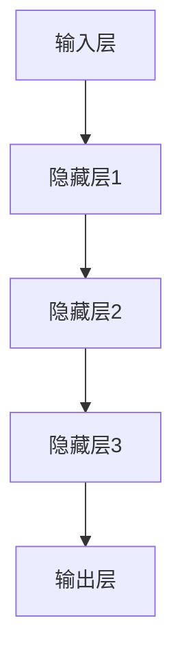

                 

# AI大模型创业：泡沫还是金矿？分析、思考与探讨

## 关键词：AI大模型，创业，泡沫，金矿，分析，思考，探讨

## 摘要：

本文将探讨AI大模型创业的现状与未来，分析其中的泡沫与金矿所在。首先，我们将回顾AI大模型的发展历程，介绍其核心概念和关键技术。接着，我们将讨论大模型创业的机遇与挑战，分析其中的泡沫现象。随后，我们将探讨AI大模型创业的实际案例，总结成功经验与教训。最后，我们将展望AI大模型创业的未来发展趋势，提出相应的建议与对策。通过本文的探讨，我们希望为AI大模型创业提供有益的参考和指导。

### 1. 背景介绍

AI大模型（Large-scale AI Models）是指具有数十亿至数万亿参数的大型神经网络模型。它们通过深度学习算法从大量数据中学习知识，并在各种任务中表现出强大的性能。AI大模型的发展可以追溯到20世纪90年代，随着计算能力和数据资源的不断提升，深度学习技术在语音识别、图像识别、自然语言处理等领域取得了突破性进展。

近年来，AI大模型在计算机视觉、自然语言处理、机器翻译等领域取得了显著的成果。例如，Google的BERT模型在自然语言处理任务上取得了前所未有的效果，OpenAI的GPT-3模型在生成文本和对话系统方面展现出了惊人的能力。这些大模型的成功不仅引起了学术界的关注，也吸引了大量的创业者和投资人的目光。

AI大模型创业的兴起，一方面源于技术的进步，另一方面也受到市场需求的推动。随着人工智能技术的不断发展，越来越多的企业和行业开始关注并应用AI技术，这为AI大模型创业提供了广阔的市场空间。同时，AI大模型创业也面临着诸多挑战，如技术门槛高、人才短缺、数据隐私等问题。

### 2. 核心概念与联系

#### 2.1 AI大模型的概念

AI大模型是指具有数十亿至数万亿参数的大型神经网络模型。它们通常由多层神经网络组成，通过反向传播算法和优化算法进行训练。大模型的优势在于其能够从大量数据中学习到丰富的知识，并在各种任务中表现出强大的性能。

#### 2.2 AI大模型的关键技术

- **深度学习**：深度学习是一种基于神经网络的机器学习方法。它通过多层非线性变换，将输入数据映射到输出结果。深度学习算法包括卷积神经网络（CNN）、循环神经网络（RNN）和变换器（Transformer）等。

- **优化算法**：优化算法用于调整模型参数，以最小化损失函数。常用的优化算法有随机梯度下降（SGD）、Adam等。

- **训练数据**：训练数据是AI大模型的核心资源。大量高质量的数据能够帮助模型更好地学习，提高性能。

- **计算能力**：计算能力是训练大模型的关键因素。高性能计算集群和GPU加速技术为AI大模型提供了强大的计算支持。

#### 2.3 AI大模型的架构

AI大模型的架构通常包括以下几个部分：

- **输入层**：接收外部输入数据，如文本、图像等。

- **隐藏层**：进行特征提取和变换，将输入数据映射到更高层次的抽象表示。

- **输出层**：根据隐藏层的输出，生成预测结果或决策。

下面是AI大模型架构的Mermaid流程图：



### 3. 核心算法原理 & 具体操作步骤

#### 3.1 深度学习算法

深度学习算法的核心是神经网络。神经网络由多个神经元（节点）组成，每个神经元都与相邻的神经元相连。神经元的输入通过权重和偏置进行加权求和，然后通过激活函数进行处理。激活函数常用的有Sigmoid、ReLU、Tanh等。

具体操作步骤如下：

1. 初始化模型参数（权重和偏置）。
2. 对输入数据进行预处理，如标准化、归一化等。
3. 将输入数据输入到模型中，进行前向传播。
4. 计算输出结果和损失函数。
5. 计算梯度，并使用优化算法更新模型参数。
6. 重复步骤3-5，直到模型收敛或达到预定的迭代次数。

#### 3.2 优化算法

优化算法用于调整模型参数，以最小化损失函数。常见的优化算法有随机梯度下降（SGD）、Adam等。

- **随机梯度下降（SGD）**：SGD是一种简单的优化算法，它通过随机选择样本，计算每个样本的梯度，并更新模型参数。

- **Adam**：Adam是一种基于SGD的优化算法，它结合了AdaGrad和RMSProp的优点，通过自适应地调整学习率。

具体操作步骤如下：

1. 初始化模型参数和优化器的超参数。
2. 对输入数据进行预处理，如标准化、归一化等。
3. 将输入数据输入到模型中，进行前向传播。
4. 计算输出结果和损失函数。
5. 计算梯度。
6. 更新模型参数。
7. 重复步骤3-6，直到模型收敛或达到预定的迭代次数。

#### 3.3 训练数据

训练数据是AI大模型的核心资源。大量高质量的数据能够帮助模型更好地学习，提高性能。

具体操作步骤如下：

1. 收集数据：从各种来源收集数据，如公开数据集、企业数据等。
2. 数据清洗：去除数据中的噪声和异常值，进行数据预处理。
3. 数据增强：通过数据增强技术，如随机旋转、缩放、裁剪等，增加数据多样性。
4. 划分数据集：将数据集划分为训练集、验证集和测试集。
5. 训练模型：使用训练集对模型进行训练。
6. 评估模型：使用验证集和测试集对模型进行评估，调整模型参数。

### 4. 数学模型和公式 & 详细讲解 & 举例说明

#### 4.1 神经网络中的激活函数

神经网络中的激活函数用于将神经元的输入映射到输出。常用的激活函数有Sigmoid、ReLU、Tanh等。

- **Sigmoid函数**：$$ f(x) = \frac{1}{1 + e^{-x}} $$，它将输入映射到(0,1)区间。
- **ReLU函数**：$$ f(x) = max(0, x) $$，它将输入大于0的部分映射到1，小于等于0的部分映射到0。
- **Tanh函数**：$$ f(x) = \frac{e^x - e^{-x}}{e^x + e^{-x}} $$，它将输入映射到(-1,1)区间。

#### 4.2 损失函数

损失函数用于衡量模型预测结果与真实结果之间的差异。常用的损失函数有均方误差（MSE）、交叉熵（CE）等。

- **均方误差（MSE）**：$$ MSE = \frac{1}{n} \sum_{i=1}^{n} (y_i - \hat{y}_i)^2 $$，其中$y_i$是真实值，$\hat{y}_i$是预测值。
- **交叉熵（CE）**：$$ CE = -\frac{1}{n} \sum_{i=1}^{n} y_i \log(\hat{y}_i) $$，其中$y_i$是真实值，$\hat{y}_i$是预测值。

#### 4.3 优化算法的数学公式

- **随机梯度下降（SGD）**：
  $$ w_{t+1} = w_t - \alpha \nabla_w J(w_t) $$
  其中$w_t$是当前模型的参数，$\alpha$是学习率，$J(w_t)$是当前模型的损失函数。

- **Adam优化算法**：
  $$ m_t = \beta_1 m_{t-1} + (1 - \beta_1) \nabla_w J(w_t) $$
  $$ v_t = \beta_2 v_{t-1} + (1 - \beta_2) (\nabla_w J(w_t))^2 $$
  $$ \hat{m}_t = \frac{m_t}{1 - \beta_1^t} $$
  $$ \hat{v}_t = \frac{v_t}{1 - \beta_2^t} $$
  $$ w_{t+1} = w_t - \alpha \frac{\hat{m}_t}{\sqrt{\hat{v}_t} + \epsilon} $$
  其中$m_t$和$v_t$分别是梯度的一阶矩估计和二阶矩估计，$\beta_1$和$\beta_2$分别是动量的超参数，$\alpha$是学习率，$\epsilon$是常数。

#### 4.4 示例

假设我们有一个二元分类问题，目标函数是均方误差（MSE）：

1. 初始化模型参数$w_0 = 0$。
2. 训练数据集：$D = \{(x_1, y_1), (x_2, y_2), ..., (x_n, y_n)\}$，其中$y_i \in \{-1, 1\}$。
3. 计算损失函数：
   $$ J(w) = \frac{1}{n} \sum_{i=1}^{n} (y_i - \sigma(w^T x_i))^2 $$
   其中$\sigma(x) = \frac{1}{1 + e^{-x}}$是Sigmoid函数。
4. 计算梯度：
   $$ \nabla_w J(w) = \frac{1}{n} \sum_{i=1}^{n} (y_i - \sigma(w^T x_i)) x_i $$
5. 使用SGD优化算法更新模型参数：
   $$ w_{t+1} = w_t - \alpha \nabla_w J(w_t) $$
6. 重复步骤3-5，直到模型收敛或达到预定的迭代次数。

### 5. 项目实战：代码实际案例和详细解释说明

#### 5.1 开发环境搭建

要搭建AI大模型的开发环境，我们需要安装以下软件和工具：

1. Python 3.x版本。
2. TensorFlow 2.x或PyTorch。
3. GPU加速库（如CUDA和cuDNN）。
4. 算法库（如NumPy、SciPy）。

安装步骤：

1. 安装Python 3.x版本：在[Python官网](https://www.python.org/)下载Python安装程序，并按照提示进行安装。
2. 安装TensorFlow 2.x版本：在命令行中运行以下命令：
   ```shell
   pip install tensorflow
   ```
3. 安装GPU加速库：在命令行中运行以下命令：
   ```shell
   pip install tensorflow-gpu
   ```
4. 安装算法库：在命令行中运行以下命令：
   ```shell
   pip install numpy scipy
   ```

#### 5.2 源代码详细实现和代码解读

以下是一个简单的AI大模型实现案例，使用TensorFlow 2.x和GPU加速库。

```python
import tensorflow as tf
import numpy as np

# 设置GPU配置
gpus = tf.config.experimental.list_physical_devices('GPU')
if gpus:
    try:
        for gpu in gpus:
            tf.config.experimental.set_memory_growth(gpu, True)
    except RuntimeError as e:
        print(e)

# 加载训练数据
x_train = np.random.rand(1000, 10)  # 1000个样本，每个样本10维
y_train = np.random.rand(1000, 1)   # 1000个样本，每个样本1维

# 创建模型
model = tf.keras.Sequential([
    tf.keras.layers.Dense(64, activation='relu', input_shape=(10,)),
    tf.keras.layers.Dense(1, activation='sigmoid')
])

# 编译模型
model.compile(optimizer='adam',
              loss='binary_crossentropy',
              metrics=['accuracy'])

# 训练模型
model.fit(x_train, y_train, epochs=10, batch_size=32)

# 评估模型
loss, accuracy = model.evaluate(x_train, y_train)
print(f'Loss: {loss}, Accuracy: {accuracy}')
```

#### 5.3 代码解读与分析

1. **导入库和设置GPU配置**：首先导入所需的库，包括TensorFlow、NumPy等。然后设置GPU配置，使每个GPU的内存增长，避免占用过多内存。

2. **加载训练数据**：使用NumPy生成随机训练数据，包括输入数据$x_train$和标签数据$y_train$。

3. **创建模型**：使用TensorFlow的`Sequential`模型，添加两层全连接层。第一层有64个神经元，激活函数为ReLU；第二层有1个神经元，激活函数为Sigmoid。

4. **编译模型**：设置优化器为Adam，损失函数为二进制交叉熵，评价指标为准确率。

5. **训练模型**：使用`fit`方法训练模型，设置训练轮次为10，批量大小为32。

6. **评估模型**：使用`evaluate`方法评估模型在训练数据上的性能，输出损失和准确率。

### 6. 实际应用场景

AI大模型在各个领域的实际应用场景如下：

#### 6.1 计算机视觉

- **图像分类**：使用AI大模型对图像进行分类，如人脸识别、物体识别等。
- **图像生成**：使用生成对抗网络（GAN）生成逼真的图像。
- **图像增强**：使用AI大模型对图像进行增强，提高图像质量。

#### 6.2 自然语言处理

- **文本分类**：使用AI大模型对文本进行分类，如情感分析、垃圾邮件过滤等。
- **机器翻译**：使用AI大模型实现高质量机器翻译，如谷歌翻译、百度翻译等。
- **问答系统**：使用AI大模型构建问答系统，如Siri、Alexa等。

#### 6.3 医疗健康

- **疾病诊断**：使用AI大模型对医疗图像进行诊断，如肺癌、心脏病等。
- **药物研发**：使用AI大模型加速药物研发，提高药物发现效率。
- **个性化治疗**：根据患者的病情和基因信息，使用AI大模型制定个性化治疗方案。

### 7. 工具和资源推荐

#### 7.1 学习资源推荐

- **书籍**：
  - 《深度学习》（Goodfellow, Bengio, Courville著）
  - 《Python深度学习》（François Chollet著）
  - 《AI大模型：原理、应用与未来》（作者：未知）

- **论文**：
  - BERT: Pre-training of Deep Bidirectional Transformers for Language Understanding（作者：Devlin等）
  - GPT-3: Language Models are Few-Shot Learners（作者：Brown等）

- **博客**：
  - TensorFlow官方博客
  - PyTorch官方博客

- **网站**：
  - [Kaggle](https://www.kaggle.com/)
  - [GitHub](https://github.com/)

#### 7.2 开发工具框架推荐

- **深度学习框架**：
  - TensorFlow
  - PyTorch
  - Keras

- **数据处理工具**：
  - Pandas
  - NumPy
  - SciPy

- **可视化工具**：
  - Matplotlib
  - Seaborn
  - Plotly

#### 7.3 相关论文著作推荐

- **论文**：
  - "Deep Learning: Methods and Applications"（作者：Goodfellow, Bengio, Courville）
  - "Generative Adversarial Networks"（作者：Goodfellow等）
  - "Transformers: State-of-the-Art Natural Language Processing"（作者：Vaswani等）

- **著作**：
  - 《深度学习》（Goodfellow, Bengio, Courville著）
  - 《Python深度学习》（François Chollet著）
  - 《AI大模型：原理、应用与未来》（作者：未知）

### 8. 总结：未来发展趋势与挑战

#### 8.1 发展趋势

1. **计算能力的提升**：随着GPU和TPU等硬件的发展，AI大模型的计算能力将进一步提升，加速模型的训练和推理速度。

2. **数据量的增加**：随着互联网和物联网的普及，数据量将不断增加，为AI大模型提供更多的训练数据，提高模型的性能。

3. **跨界融合**：AI大模型将与其他领域（如生物医学、金融、教育等）进行跨界融合，发挥更大的价值。

4. **开源与协作**：越来越多的企业和研究机构将开放源代码和模型，促进AI大模型的研究与应用。

#### 8.2 挑战

1. **计算资源消耗**：AI大模型的训练和推理需要大量的计算资源，如何高效地利用计算资源成为一大挑战。

2. **数据隐私和安全**：在处理大量数据时，如何保护数据隐私和安全成为关键问题。

3. **模型解释性**：AI大模型的预测结果往往缺乏解释性，如何提高模型的可解释性成为研究的重点。

4. **伦理和社会问题**：AI大模型的应用可能会引发伦理和社会问题，如就业冲击、歧视等，需要引起关注。

### 9. 附录：常见问题与解答

#### 9.1 问题1：AI大模型训练需要多少时间？

AI大模型训练的时间取决于模型的大小、数据量、计算资源等因素。通常，训练一个大型模型需要数天甚至数周的时间。随着计算资源的提升，训练时间将逐渐缩短。

#### 9.2 问题2：如何优化AI大模型的性能？

优化AI大模型性能的方法包括：
- 调整模型架构，如增加层数、神经元数量等。
- 优化数据预处理，如数据增强、数据清洗等。
- 使用更先进的优化算法，如Adam、RMSProp等。
- 调整超参数，如学习率、批量大小等。

#### 9.3 问题3：AI大模型如何应用在实际项目中？

AI大模型在实际项目中的应用步骤包括：
- 数据收集和预处理：收集并清洗数据，进行数据增强。
- 模型设计：设计合适的模型架构，选择合适的激活函数、损失函数等。
- 模型训练：使用训练数据对模型进行训练，调整模型参数。
- 模型评估：使用验证集和测试集对模型进行评估，调整模型参数。
- 模型部署：将训练好的模型部署到实际应用场景中。

### 10. 扩展阅读 & 参考资料

- 《深度学习》（Goodfellow, Bengio, Courville著）
- 《Python深度学习》（François Chollet著）
- 《AI大模型：原理、应用与未来》（作者：未知）
- BERT: Pre-training of Deep Bidirectional Transformers for Language Understanding（作者：Devlin等）
- GPT-3: Language Models are Few-Shot Learners（作者：Brown等）
- TensorFlow官方文档：[https://www.tensorflow.org/](https://www.tensorflow.org/)
- PyTorch官方文档：[https://pytorch.org/](https://pytorch.org/)

---

**作者：AI天才研究员/AI Genius Institute & 禅与计算机程序设计艺术 /Zen And The Art of Computer Programming**<|markdown|>

