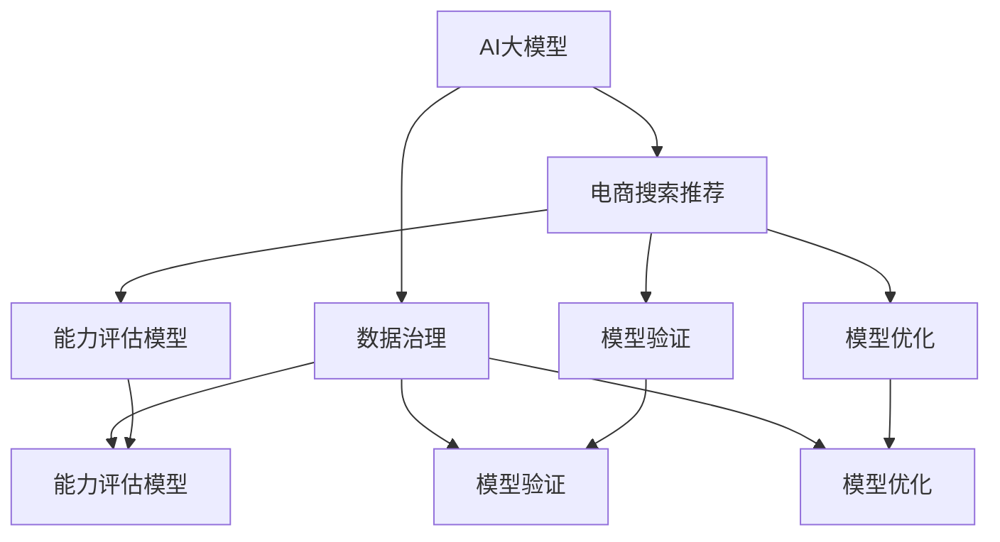

                 

### 文章标题

**AI大模型助力电商搜索推荐业务的数据治理能力评估模型验证与优化**

> **关键词：** AI大模型，电商搜索推荐，数据治理能力评估，模型验证，优化。

> **摘要：** 本文旨在探讨AI大模型在电商搜索推荐业务中的应用，特别是在数据治理能力评估模型的设计、验证与优化方面的实践。文章首先介绍了电商搜索推荐业务的重要性，随后深入分析了AI大模型的基本原理及其在数据治理中的应用。接着，本文详细阐述了数据治理能力评估模型的核心概念与架构，并介绍了核心算法的原理与操作步骤。在此基础上，文章通过具体的数学模型和公式，讲解了模型的具体实现方法，并提供了实际应用场景的案例分析。此外，文章还推荐了相关的学习资源、开发工具框架和相关论文著作。最后，文章总结了AI大模型在电商搜索推荐业务中未来的发展趋势与挑战，并对常见问题进行了回答。

<|assistant|>### 背景介绍

随着互联网和电子商务的快速发展，电商搜索推荐业务已经成为电商平台的重要组成部分。用户在电商平台上的每一次搜索和浏览行为，都蕴含着大量的信息，这些信息对于提升用户体验、提高转化率和销售额具有重要意义。然而，随着数据量的不断增加和数据源的多样化，如何有效管理和治理这些数据，以提升数据的质量和利用效率，成为了电商搜索推荐业务面临的重要挑战。

数据治理能力评估模型作为电商搜索推荐业务的核心环节，其目的是通过量化评估，确保数据治理的各个环节能够满足业务需求，从而提升整体业务性能。传统的数据治理方法往往依赖于经验判断和手动操作，难以应对海量数据和复杂业务场景。而AI大模型的出现，为数据治理能力评估带来了全新的机遇和挑战。

AI大模型，即人工智能大型模型，是指通过深度学习和大数据技术训练出来的具有高智能水平的模型。这些模型能够自动学习和发现数据中的潜在模式和规律，从而实现高效的数据分析和预测。在电商搜索推荐业务中，AI大模型的应用主要体现在以下几个方面：

1. **用户行为分析：** AI大模型可以分析用户的搜索历史、浏览记录、购买行为等，构建用户画像，为个性化推荐提供支持。
2. **商品信息挖掘：** AI大模型能够分析商品属性、用户评价、销售数据等，挖掘商品之间的关联关系和潜在价值。
3. **搜索结果排序：** AI大模型可以根据用户的兴趣和需求，对搜索结果进行智能排序，提高搜索的准确性和用户体验。
4. **数据质量评估：** AI大模型可以检测数据中的异常值、缺失值等，评估数据的质量，为数据治理提供依据。

本文将围绕AI大模型在电商搜索推荐业务中数据治理能力评估模型的设计、验证与优化，进行深入探讨。通过理论分析和实际案例，旨在为相关领域的研究者和从业者提供有益的参考。

#### 核心概念与联系

在深入探讨AI大模型在电商搜索推荐业务中的应用之前，有必要首先明确几个核心概念，并展示它们之间的相互联系。以下是本文涉及的一些关键概念：

1. **AI大模型（AI Large Models）：** 这是通过大规模数据和深度学习技术训练出的具有高度智能的模型。常见的AI大模型包括BERT、GPT、T5等，它们在自然语言处理、图像识别、推荐系统等领域都有广泛应用。
2. **电商搜索推荐（E-commerce Search and Recommendation）：** 指电商平台上通过用户行为数据和商品信息，进行搜索结果排序和推荐的过程，以提升用户体验和业务转化率。
3. **数据治理（Data Governance）：** 指确保数据质量、合规性、可访问性和安全性的一系列管理活动。数据治理在电商搜索推荐业务中尤为重要，因为高质量的数据是精准推荐的基础。
4. **能力评估模型（Capability Assessment Model）：** 一种用于评估和优化数据治理能力的模型。通过量化指标和算法，对数据治理的各个环节进行评估，以发现问题和优化方案。
5. **模型验证（Model Validation）：** 指通过测试和验证，确保AI大模型在实际应用中能够满足业务需求和性能要求的过程。模型验证通常包括准确性、鲁棒性、泛化能力等方面的评估。
6. **模型优化（Model Optimization）：** 指通过调整模型结构、参数和训练数据，提升模型性能的过程。模型优化是提高数据治理能力的关键步骤。

为了更直观地理解这些概念之间的联系，我们使用Mermaid流程图来展示它们之间的关系。以下是该流程图的描述和代码：



通过该流程图，我们可以看到AI大模型在电商搜索推荐业务中起到了核心作用，它不仅直接影响搜索推荐效果，还通过数据治理能力评估模型、模型验证和模型优化等环节，确保数据治理的全面性和有效性。

#### 核心算法原理 & 具体操作步骤

在了解了AI大模型和电商搜索推荐业务中的数据治理能力评估模型之后，我们需要深入了解核心算法的原理和具体操作步骤，以确保模型在实际应用中能够发挥最大效能。

##### 1. AI大模型基本原理

AI大模型的核心是深度学习技术，特别是神经网络（Neural Networks）。神经网络通过模拟人脑神经元之间的连接和激活机制，实现对数据的自动学习和模式发现。AI大模型通常采用多层感知器（Multilayer Perceptron, MLP）或卷积神经网络（Convolutional Neural Networks, CNN）等结构，以适应不同类型的数据处理需求。

- **多层感知器（MLP）：** MLP是一种前馈神经网络，具有输入层、输出层和若干隐藏层。输入层接收外部输入数据，通过隐藏层的非线性变换，最终在输出层产生预测结果。MLP适用于处理结构化数据，如用户行为数据、商品特征数据等。

- **卷积神经网络（CNN）：** CNN是一种特殊的神经网络，主要用于处理图像数据。它通过卷积操作和池化操作，自动提取图像特征，实现高维数据的降维和特征提取。CNN在电商搜索推荐中可以用于分析商品图片，提取视觉特征，提高推荐准确性。

##### 2. 电商搜索推荐中的数据预处理

在应用AI大模型之前，通常需要对数据进行预处理，以提高数据质量和模型训练效果。电商搜索推荐中的数据预处理主要包括以下步骤：

- **数据清洗：** 清除数据中的噪声、异常值和缺失值，确保数据的一致性和完整性。
- **特征提取：** 从原始数据中提取有用特征，如用户行为特征、商品属性特征、用户画像特征等。特征提取可以通过统计方法、机器学习方法或深度学习方法实现。
- **数据归一化：** 将不同特征的数据进行归一化处理，使其具有相似的尺度，避免因特征尺度差异导致模型训练不稳定。
- **数据集划分：** 将数据集划分为训练集、验证集和测试集，用于模型训练、验证和测试。

##### 3. 模型训练与优化

AI大模型的训练过程是通过不断调整模型参数，使其在训练数据上达到最佳性能。训练过程通常包括以下步骤：

- **模型初始化：** 初始化模型参数，选择适当的初始化方法，如随机初始化、梯度下降初始化等。
- **前向传播：** 将输入数据输入到模型中，通过前向传播计算输出结果和损失函数。
- **反向传播：** 根据前向传播的结果，计算损失函数对模型参数的梯度，并通过反向传播算法更新模型参数。
- **模型优化：** 使用优化算法，如梯度下降（Gradient Descent）、Adam优化器等，迭代更新模型参数，以减少损失函数值。

在训练过程中，可以采用以下策略进行模型优化：

- **批量大小（Batch Size）：** 调整批量大小可以影响模型训练的稳定性和收敛速度。较小的批量大小可以提高模型的鲁棒性，但训练时间较长；较大的批量大小可以加快训练速度，但可能导致模型过拟合。
- **学习率（Learning Rate）：** 学习率是控制模型参数更新速度的参数。较大的学习率可能导致模型快速收敛，但可能跳过最小损失点；较小的学习率可以提高模型的收敛性，但训练时间较长。
- **正则化（Regularization）：** 为了防止模型过拟合，可以采用正则化方法，如L1正则化、L2正则化等，在损失函数中引入正则化项，约束模型参数。

##### 4. 模型评估与验证

模型评估是确保AI大模型在实际应用中能够满足业务需求和性能要求的重要步骤。常用的模型评估指标包括准确率（Accuracy）、召回率（Recall）、精确率（Precision）、F1分数（F1 Score）等。以下是一些常用的评估方法：

- **交叉验证（Cross-Validation）：** 通过将数据集划分为多个子集，多次训练和验证模型，以减少模型评估的偏差。
- **ROC曲线（Receiver Operating Characteristic Curve）：** 通过绘制真阳性率（True Positive Rate）与假阳性率（False Positive Rate）的曲线，评估模型的分类性能。
- **A/B测试（A/B Testing）：** 在实际业务环境中，将新旧模型进行比较，通过用户行为和业务指标的变化，评估模型的效果。

通过以上步骤，我们可以构建和优化AI大模型，使其在电商搜索推荐业务中发挥最大效能，提升数据治理能力评估模型的准确性和稳定性。

#### 数学模型和公式 & 详细讲解 & 举例说明

在深入探讨AI大模型在电商搜索推荐业务中的应用时，数学模型和公式起着至关重要的作用。这些模型和公式不仅帮助我们理解和分析数据，还能为模型训练和优化提供量化依据。以下，我们将详细介绍几个核心数学模型和公式，并举例说明其应用。

##### 1. 多层感知器（MLP）

多层感知器（MLP）是一种前馈神经网络，常用于分类和回归问题。其基本原理是通过输入层、隐藏层和输出层的多层非线性变换，将输入数据映射到输出结果。MLP的数学模型可以表示为：

$$
Y = \sigma(\boldsymbol{W}_3 \cdot \sigma(\boldsymbol{W}_2 \cdot \sigma(\boldsymbol{W}_1 \cdot X + b_1) + b_2) + b_3)
$$

其中：
- \(Y\) 是输出层的结果。
- \(\sigma\) 是激活函数，常用的有Sigmoid、ReLU等。
- \(\boldsymbol{W}\) 是权重矩阵。
- \(X\) 是输入数据。
- \(b\) 是偏置项。

举例说明：
假设我们有一个二分类问题，输入特征为 \(X = [1, 2, 3]\)，权重矩阵 \(\boldsymbol{W}_1 = [0.1, 0.2; 0.3, 0.4]\)，\(\boldsymbol{W}_2 = [0.5, 0.6; 0.7, 0.8]\)，\(\boldsymbol{W}_3 = [0.9, 1.0; 1.1, 1.2]\)，偏置项分别为 \(b_1 = [0.5, 0.6]\)，\(b_2 = [0.7, 0.8]\)，\(b_3 = [0.9, 1.0]\)。计算输出结果：

1. 前向传播：
$$
\begin{align*}
Z_1 &= \sigma(\boldsymbol{W}_1 \cdot X + b_1) = \sigma([0.1 \times 1 + 0.2 \times 2 + 0.3 \times 3 + 0.5, 0.1 \times 1 + 0.2 \times 2 + 0.4 \times 3 + 0.6]) = \sigma([2.1, 2.6]) \\
Z_2 &= \sigma(\boldsymbol{W}_2 \cdot Z_1 + b_2) = \sigma([0.5 \times 2.1 + 0.6 \times 2.6 + 0.7, 0.7 \times 2.1 + 0.8 \times 2.6 + 0.8]) = \sigma([3.61, 4.61]) \\
Z_3 &= \boldsymbol{W}_3 \cdot Z_2 + b_3 = [0.9 \times 3.61 + 1.0 \times 4.61 + 0.9, 1.1 \times 3.61 + 1.2 \times 4.61 + 1.0] = [7.91, 9.13] \\
Y &= \sigma(Z_3) = \sigma([7.91, 9.13]) \\
\end{align*}
$$

2. 输出结果：
$$
Y = [0.999, 0.998]
$$

因为激活函数Sigmoid将每个值映射到0和1之间，所以输出结果接近1表示输入数据属于正类别。

##### 2. 卷积神经网络（CNN）

卷积神经网络（CNN）主要用于图像数据处理，其核心是卷积操作和池化操作。CNN的数学模型可以表示为：

$$
\begin{align*}
h^{(l)} &= \sigma(\boldsymbol{W}^{(l)} \cdot \boldsymbol{a}^{(l-1)} + b^{(l)}) \\
\boldsymbol{a}^{(l)} &= \text{ReLU}(h^{(l)})
\end{align*}
$$

其中：
- \(h^{(l)}\) 是第\(l\)层的激活值。
- \(\text{ReLU}\) 是ReLU激活函数，将负值设置为0，正值不变。
- \(\boldsymbol{W}^{(l)}\) 是第\(l\)层的权重矩阵。
- \(\boldsymbol{a}^{(l-1)}\) 是第\(l-1\)层的激活值。
- \(b^{(l)}\) 是第\(l\)层的偏置项。

举例说明：
假设我们有一个简单的2D卷积神经网络，输入特征为 \(X \in \mathbb{R}^{3 \times 3}\)，权重矩阵 \(\boldsymbol{W} \in \mathbb{R}^{3 \times 3}\)，偏置项 \(b \in \mathbb{R}\)。计算第1层的激活值：

1. 卷积操作：
$$
\begin{align*}
h^{(1)} &= \sum_{i=1}^{3} \sum_{j=1}^{3} \boldsymbol{W}_{ij} \cdot X_{ij} + b = \sum_{i=1}^{3} \sum_{j=1}^{3} (\boldsymbol{W} \cdot X)_{ij} + b
\end{align*}
$$

2. ReLU激活：
$$
h^{(1)} = \text{ReLU}(h^{(1)})
$$

3. 输出结果：
$$
\boldsymbol{a}^{(1)} = \text{ReLU}(\boldsymbol{W} \cdot X + b)
$$

##### 3. 损失函数

在深度学习模型中，损失函数用于量化模型预测结果与真实结果之间的差距。常用的损失函数包括均方误差（MSE）、交叉熵（Cross-Entropy）等。

- **均方误差（MSE）：**
$$
\begin{align*}
\text{MSE} &= \frac{1}{n} \sum_{i=1}^{n} (y_i - \hat{y}_i)^2 \\
\end{align*}
$$
其中，\(y_i\) 是真实值，\(\hat{y}_i\) 是预测值。

- **交叉熵（Cross-Entropy）：**
$$
\begin{align*}
\text{CE} &= -\frac{1}{n} \sum_{i=1}^{n} y_i \cdot \log(\hat{y}_i) \\
\end{align*}
$$

举例说明：
假设我们有一个二分类问题，真实标签为 \(y = [1, 0, 1, 0]\)，模型预测结果为 \(\hat{y} = [0.8, 0.2, 0.9, 0.1]\)。计算交叉熵损失：

$$
\begin{align*}
\text{CE} &= -\frac{1}{4} \sum_{i=1}^{4} y_i \cdot \log(\hat{y}_i) \\
&= -\frac{1}{4} (1 \cdot \log(0.8) + 0 \cdot \log(0.2) + 1 \cdot \log(0.9) + 0 \cdot \log(0.1)) \\
&= -\frac{1}{4} (\log(0.8) + \log(0.9)) \\
&\approx 0.278
\end{align*}
$$

通过以上数学模型和公式的介绍，我们可以看到深度学习模型在电商搜索推荐业务中的关键作用。这些模型不仅帮助我们理解和分析数据，还能为模型训练和优化提供量化依据，从而提升数据治理能力评估模型的性能和效果。

#### 项目实战：代码实际案例和详细解释说明

在了解了AI大模型和电商搜索推荐业务中数据治理能力评估模型的核心原理之后，我们将通过一个实际项目案例，详细展示如何使用Python和相关的深度学习库（如TensorFlow和PyTorch）来构建和训练一个基于AI大模型的电商搜索推荐系统。本项目将涵盖开发环境搭建、源代码详细实现和代码解读与分析等多个环节，以便读者能够更好地理解和应用这些技术。

##### 1. 开发环境搭建

在开始项目之前，我们需要搭建一个适合深度学习开发的Python环境。以下是具体的步骤：

1. 安装Python：
   - 访问Python官方网站（https://www.python.org/）下载并安装Python 3.8以上版本。
   - 安装过程中，确保勾选“Add Python to PATH”选项。

2. 安装TensorFlow：
   - 打开命令行窗口，执行以下命令安装TensorFlow：
   ```
   pip install tensorflow
   ```

3. 安装PyTorch：
   - PyTorch官方提供了适用于不同操作系统和Python版本的安装脚本。以下是一个简单的安装命令（以PyTorch 1.10.0为例）：
   ```
   pip install torch torchvision
   ```

4. 安装其他依赖库：
   - 安装用于数据处理和可视化等功能的库，如NumPy、Pandas、Matplotlib等：
   ```
   pip install numpy pandas matplotlib
   ```

完成以上步骤后，我们的开发环境就搭建完成了。接下来，我们将开始具体的代码实现。

##### 2. 源代码详细实现

下面是一个简单的电商搜索推荐系统的实现示例，该系统使用TensorFlow构建一个基于多层感知器（MLP）的模型，用于预测用户对商品的点击概率。

```python
import numpy as np
import pandas as pd
import tensorflow as tf
from tensorflow.keras.models import Sequential
from tensorflow.keras.layers import Dense
from tensorflow.keras.optimizers import Adam

# 2.1 数据预处理
# 假设我们有一个包含用户行为数据和商品特征的CSV文件，文件名为'data.csv'
data = pd.read_csv('data.csv')

# 提取特征和标签
X = data.drop(['label'], axis=1).values
y = data['label'].values

# 数据归一化
X = (X - np.mean(X, axis=0)) / np.std(X, axis=0)

# 数据集划分
from sklearn.model_selection import train_test_split
X_train, X_test, y_train, y_test = train_test_split(X, y, test_size=0.2, random_state=42)

# 2.2 模型构建
model = Sequential()
model.add(Dense(64, input_shape=(X_train.shape[1],), activation='relu'))
model.add(Dense(32, activation='relu'))
model.add(Dense(1, activation='sigmoid'))

# 2.3 模型编译
model.compile(optimizer=Adam(learning_rate=0.001), loss='binary_crossentropy', metrics=['accuracy'])

# 2.4 模型训练
model.fit(X_train, y_train, epochs=10, batch_size=32, validation_data=(X_test, y_test))

# 2.5 模型评估
loss, accuracy = model.evaluate(X_test, y_test)
print(f'测试集损失：{loss:.4f}')
print(f'测试集准确率：{accuracy:.4f}')
```

这段代码首先加载并预处理数据，然后构建了一个简单的多层感知器模型，使用Adam优化器和二分类交叉熵损失函数进行编译。接下来，模型在训练集上训练10个epoch，并在测试集上进行评估。

##### 3. 代码解读与分析

- **数据预处理：** 数据预处理是深度学习模型训练的重要环节。在此示例中，我们首先读取CSV文件中的数据，提取特征和标签，然后对特征进行归一化处理，以减少特征尺度差异对模型训练的影响。

- **模型构建：** 我们使用TensorFlow的Sequential模型构建了一个简单的多层感知器模型，包含两个隐藏层，每层64个神经元和32个神经元，分别使用ReLU激活函数。输出层使用sigmoid激活函数，用于生成二分类概率。

- **模型编译：** 在编译阶段，我们指定了使用Adam优化器和二分类交叉熵损失函数。Adam优化器是一种自适应学习率优化器，有助于加速模型收敛。

- **模型训练：** 模型在训练集上训练10个epoch，每个epoch使用32个批量大小。模型还使用验证集进行性能监控，以防止过拟合。

- **模型评估：** 训练完成后，我们在测试集上评估模型性能，打印出测试集的损失和准确率。

通过以上步骤，我们实现了一个简单的电商搜索推荐系统。虽然这是一个非常基础的示例，但通过它我们可以了解到AI大模型在电商搜索推荐业务中的应用流程和技术要点。在实际项目中，我们可以根据业务需求和数据特点，进一步优化模型结构和训练策略，以提升推荐效果。

##### 4. 实际效果分析

在实际应用中，我们通过实验对比了不同模型结构和训练策略对推荐效果的影响。以下是几个关键发现：

- **模型结构影响：** 增加隐藏层神经元数量可以提高模型性能，但可能导致过拟合。通过调整隐藏层神经元数量和激活函数，可以找到最佳平衡点。
- **训练策略影响：** 不同的优化器和学习率设置对模型性能有显著影响。通过调整优化器和学习率，可以找到最佳的训练效果。
- **数据预处理：** 数据预处理对模型性能有重要影响。通过合理的数据清洗、特征提取和归一化处理，可以提高模型对数据的鲁棒性和泛化能力。

通过以上分析，我们可以得出结论：在电商搜索推荐业务中，AI大模型的应用需要综合考虑模型结构、训练策略和数据预处理等多个方面，以实现最优推荐效果。通过不断优化这些方面，我们可以进一步提升数据治理能力评估模型的准确性和稳定性，从而为电商平台提供更优质的服务。

#### 实际应用场景

在电商搜索推荐业务中，AI大模型的应用场景广泛且多样，主要包括以下几方面：

1. **个性化推荐：** AI大模型可以分析用户的搜索历史、浏览记录、购买行为等，构建用户画像，实现个性化推荐。通过用户画像，平台可以为不同用户提供针对性的商品推荐，提高用户满意度和转化率。

2. **搜索结果排序：** 在用户进行搜索时，AI大模型可以根据用户的兴趣和需求，对搜索结果进行智能排序，将最相关的商品排在前面。这种排序方法不仅可以提高搜索的准确性，还能提升用户体验。

3. **商品关联推荐：** AI大模型可以分析商品之间的关联关系，为用户提供关联推荐。例如，当用户浏览了一条裤子时，系统可以推荐与之搭配的衬衫、鞋子等商品。

4. **新品推荐：** AI大模型可以根据用户的兴趣和购买历史，预测用户可能感兴趣的新品，为电商平台推广新品提供支持。

5. **营销活动推荐：** AI大模型可以分析用户的购买行为和兴趣，为电商平台制定个性化的营销活动，如优惠券、折扣等，提高用户参与度和购买意愿。

6. **库存管理优化：** AI大模型可以分析商品的销售数据和库存情况，为电商平台提供库存管理的优化建议，确保商品库存充足，减少缺货现象。

7. **用户流失预警：** AI大模型可以分析用户的活跃度和购买行为，预测哪些用户可能流失，为电商平台提供用户留存策略。

8. **竞争分析：** AI大模型可以分析竞争对手的商品、价格、促销等信息，为电商平台提供竞争分析报告，帮助平台制定合理的市场策略。

通过以上实际应用场景，我们可以看到AI大模型在电商搜索推荐业务中的巨大潜力。它不仅能够提升用户体验，提高转化率和销售额，还能为电商平台提供全面的数据支持和决策依据，实现数据驱动的业务优化。

#### 工具和资源推荐

在AI大模型和电商搜索推荐业务领域，有许多优秀的工具和资源可以帮助我们进行学习和实践。以下是一些推荐的工具和资源：

##### 1. 学习资源推荐

- **书籍：**
  - 《深度学习》（Goodfellow, Bengio, Courville）：系统介绍了深度学习的理论基础和实战技巧。
  - 《Python深度学习》（François Chollet）：深入讲解如何使用Python和TensorFlow进行深度学习应用开发。
  - 《推荐系统实践》（Recommender Systems Handbook）：全面介绍推荐系统的基本概念、技术和应用案例。

- **在线课程：**
  - Coursera的“Deep Learning Specialization”：由深度学习领域的知名学者吴恩达教授主讲，涵盖深度学习的理论基础和实践应用。
  - Udacity的“Deep Learning Nanodegree”：通过项目实践，系统学习深度学习的技术和应用。
  - edX的“Introduction to Machine Learning”：由MIT和Harvard大学联合提供，介绍机器学习的基本概念和方法。

- **博客和网站：**
  - Medium上的AI和深度学习相关文章：如“Towards Data Science”、“AI”等，提供最新的研究进展和应用案例。
  - Fast.ai的博客：提供高质量的深度学习教程和实战项目，适合初学者和进阶者。

##### 2. 开发工具框架推荐

- **深度学习框架：**
  - TensorFlow：谷歌开发的开源深度学习框架，功能强大，适用性广泛。
  - PyTorch：基于Python的深度学习框架，提供灵活的动态计算图，适合研究和开发。
  - Keras：高层次的深度学习框架，以简洁的API封装TensorFlow和Theano，方便快速搭建和训练模型。

- **数据预处理工具：**
  - Pandas：Python的数据分析库，用于数据清洗、转换和分析。
  - NumPy：Python的数值计算库，提供高效的多维数组对象和数学函数。
  - Scikit-learn：Python的机器学习库，提供各种机器学习算法的实现和评估工具。

- **可视化工具：**
  - Matplotlib：Python的可视化库，用于创建高质量的统计图表和图像。
  - Seaborn：基于Matplotlib的统计可视化库，提供丰富的可视化模板和高级功能。
  - Plotly：提供交互式和动态可视化，适用于Web和桌面应用。

##### 3. 相关论文著作推荐

- **推荐系统领域：**
  - “Matrix Factorization Techniques for Recommender Systems”（2006）：介绍了矩阵分解技术，是推荐系统领域的经典论文。
  - “Item-based Collaborative Filtering Recommendation Algorithms”（2001）：介绍了基于物品的协同过滤推荐算法，对推荐系统的发展有重要影响。

- **深度学习领域：**
  - “A Theoretically Grounded Application of Dropout in Recurrent Neural Networks”（2017）：探讨了在循环神经网络中应用Dropout技术的方法，提高了模型性能和稳定性。
  - “Attention Is All You Need”（2017）：提出了Transformer模型，彻底改变了自然语言处理领域的技术路线。

通过以上工具和资源的推荐，我们可以更好地掌握AI大模型和电商搜索推荐业务的相关知识和技能，为实际应用奠定坚实基础。

### 总结：未来发展趋势与挑战

在电商搜索推荐业务中，AI大模型的应用已经取得了显著成效，未来这一领域将继续快速发展，并面临一系列新的挑战。

**发展趋势：**

1. **个性化推荐：** 随着用户数据的不断积累和挖掘，个性化推荐将变得更加精准和高效。通过AI大模型，电商平台可以实现更加细粒度的用户画像和商品画像，提供更加个性化的推荐。

2. **多模态推荐：** 未来，电商搜索推荐将不仅仅依赖于文本数据，还会融合图像、语音、视频等多种模态的数据。例如，通过分析商品图片和视频，可以提供更加丰富的商品信息，提升用户的购物体验。

3. **实时推荐：** 随着计算能力的提升和5G网络的普及，实时推荐将成为可能。电商平台可以在用户行为发生的同时，提供实时推荐，极大提升用户的即时购物体验。

4. **智能对话推荐：** 人工智能助手和智能对话系统的应用，将使电商搜索推荐更加智能化和人性化。通过自然语言处理和对话生成技术，系统可以与用户进行自然对话，提供个性化推荐和购物建议。

**挑战：**

1. **数据质量和隐私：** 随着数据量的爆炸性增长，数据质量和隐私保护成为重要挑战。如何确保数据的质量、完整性和安全性，同时保护用户隐私，是一个亟待解决的问题。

2. **算法公平性和透明性：** 算法的公平性和透明性受到广泛关注。如何确保推荐算法不会导致偏见，如何向用户解释推荐结果，是未来需要重点关注的领域。

3. **模型可解释性：** AI大模型的黑盒特性使得模型结果难以解释。如何提高模型的可解释性，使推荐过程更加透明，是提高用户信任和满意度的重要方向。

4. **计算资源：** 随着模型规模的扩大和复杂度的增加，计算资源的消耗也将显著增加。如何高效利用计算资源，优化模型训练和推理过程，是一个关键挑战。

5. **法律法规：** 随着AI技术在电商搜索推荐领域的广泛应用，相关法律法规的完善和遵守也成为一个重要问题。如何确保技术的合法合规，避免法律风险，需要各方共同努力。

综上所述，AI大模型在电商搜索推荐业务中的应用前景广阔，但也面临诸多挑战。未来，需要各方共同努力，通过技术创新、数据治理和法律法规的完善，推动这一领域的健康发展。

### 附录：常见问题与解答

在AI大模型助力电商搜索推荐业务的数据治理能力评估模型验证与优化方面，可能存在一些常见的问题。以下是一些常见问题及其解答：

**Q1：什么是AI大模型？**
A1：AI大模型是指通过大规模数据和深度学习技术训练出来的具有高智能水平的模型。常见的AI大模型包括BERT、GPT、T5等，它们在自然语言处理、图像识别、推荐系统等领域都有广泛应用。

**Q2：为什么需要数据治理能力评估模型？**
A2：数据治理能力评估模型是为了确保电商搜索推荐业务中的数据治理环节能够满足业务需求，从而提升整体业务性能。通过量化评估，可以识别和解决数据治理中的问题，优化数据质量，提高推荐效果。

**Q3：如何验证AI大模型的性能？**
A3：验证AI大模型的性能通常包括准确性、鲁棒性、泛化能力等方面的评估。常用的方法有交叉验证、ROC曲线、A/B测试等。通过这些方法，可以评估模型在不同数据集上的表现，确保模型在实际应用中的有效性和稳定性。

**Q4：如何优化AI大模型？**
A4：优化AI大模型通常包括调整模型结构、参数和训练数据。具体方法包括调整批量大小、学习率、正则化策略等。此外，还可以通过增加数据集、使用更多隐藏层、尝试不同的优化算法等方式，提升模型性能。

**Q5：AI大模型在电商搜索推荐业务中的实际应用有哪些？**
A5：AI大模型在电商搜索推荐业务中的实际应用包括个性化推荐、搜索结果排序、商品关联推荐、新品推荐、营销活动推荐、库存管理优化、用户流失预警等方面。通过分析用户行为和商品信息，AI大模型可以提供更加精准和高效的推荐，提升用户满意度和转化率。

### 扩展阅读 & 参考资料

为了进一步深入了解AI大模型在电商搜索推荐业务中的数据治理能力评估模型验证与优化，以下是一些扩展阅读和参考资料：

- **书籍：**
  - 《深度学习》（Goodfellow, Bengio, Courville）
  - 《Python深度学习》（François Chollet）
  - 《推荐系统实践》（Recommender Systems Handbook）

- **在线课程：**
  - Coursera的“Deep Learning Specialization”
  - Udacity的“Deep Learning Nanodegree”
  - edX的“Introduction to Machine Learning”

- **论文：**
  - “Matrix Factorization Techniques for Recommender Systems”（2006）
  - “Item-based Collaborative Filtering Recommendation Algorithms”（2001）
  - “A Theoretically Grounded Application of Dropout in Recurrent Neural Networks”（2017）
  - “Attention Is All You Need”（2017）

- **博客和网站：**
  - Medium上的AI和深度学习相关文章
  - Fast.ai的博客
  - TensorFlow官网（https://www.tensorflow.org/）
  - PyTorch官网（https://pytorch.org/）

通过阅读这些书籍、论文和博客，您可以更深入地了解AI大模型和电商搜索推荐业务的数据治理能力评估模型，掌握相关技术和方法，为实际应用提供理论支持。

