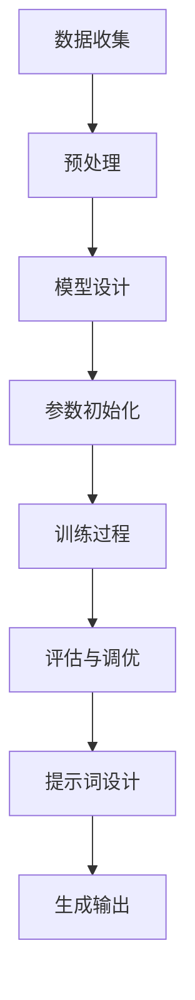

                 

### 背景介绍 Background

#### AI 大模型的崛起 Rise of Large-scale AI Models

近年来，人工智能（AI）领域取得了令人瞩目的进展，其中大模型（Large-scale AI Models）的崛起尤为显著。这些大模型具有数十亿至数万亿个参数，通过深度学习算法对海量数据进行训练，从而实现出色的性能和表现。以GPT-3（1750亿参数）、BERT（3.4亿参数）和Turing-NLG（1280亿参数）为代表的大模型，已经在自然语言处理（NLP）、计算机视觉（CV）和语音识别（ASR）等领域取得了突破性成果。

#### 提示词优化 Prompt Engineering

在 AI 大模型的应用中，提示词（Prompt）的优化成为关键因素。提示词是用户与大模型交互的接口，通过精心设计的提示词，可以引导大模型生成更准确、更符合预期的输出。提示词优化不仅影响模型的性能，还决定用户体验的满意度。例如，在问答系统中，合理的提示词可以提高问题的清晰度和针对性，从而提高答案的准确性和相关性。

#### 本文目的 Purpose of This Article

本文旨在深入探讨 AI 大模型在提示词优化中的应用，通过分析大模型的原理、核心算法和实际应用案例，揭示如何设计高效、精准的提示词。文章结构如下：

1. **背景介绍**：回顾 AI 大模型和提示词优化的背景。
2. **核心概念与联系**：介绍大模型的基本原理和相关概念。
3. **核心算法原理 & 具体操作步骤**：详细讲解大模型训练和提示词优化的算法。
4. **数学模型和公式**：阐述与提示词优化相关的数学模型和公式。
5. **项目实战**：展示实际代码案例和详细解释。
6. **实际应用场景**：分析大模型在不同领域的应用。
7. **工具和资源推荐**：推荐学习资源、开发工具和框架。
8. **总结**：展望未来发展趋势和挑战。
9. **附录**：提供常见问题与解答。
10. **扩展阅读**：推荐相关参考资料。

通过本文的阅读，读者将能够了解 AI 大模型在提示词优化中的重要作用，掌握设计高效提示词的方法，并应用于实际项目中。让我们开始深入探讨这一激动人心的领域吧！
<|assistant|>
### 核心概念与联系 Core Concepts and Connections

#### 人工智能大模型概述 Overview of Large-scale AI Models

人工智能大模型（Large-scale AI Models），通常指的是具有数十亿乃至数千亿参数的深度神经网络模型。这些模型基于大规模数据集进行训练，通过调整网络中的权重参数来优化性能，从而达到在特定任务上取得卓越的表现。大模型的典型代表包括自然语言处理中的GPT系列模型、BERT模型，以及计算机视觉中的ViT模型等。

**基本原理 Basic Principles**

大模型的核心在于其规模和复杂性。通过大量的参数，大模型可以捕捉到数据中的细微模式和复杂关系，从而在多种任务上实现强健的性能。其训练过程通常涉及以下几个关键步骤：

1. **数据收集和预处理**：收集大规模的标注数据集，并进行预处理，如文本的分词、图像的归一化等。
2. **模型架构设计**：设计适合任务的网络架构，如Transformer架构、CNN等。
3. **参数初始化**：初始化模型参数，通常采用随机初始化或预训练模型的方法。
4. **训练过程**：通过反向传播算法和优化器（如Adam）对模型参数进行迭代优化。
5. **评估和调优**：使用验证集评估模型性能，并调整超参数以优化结果。

**大模型与提示词优化的关系 Relationship between Large-scale AI Models and Prompt Engineering**

提示词优化（Prompt Engineering）是提高 AI 大模型性能的重要手段。大模型在处理任务时，通常需要通过输入的提示词来获取任务的上下文信息。一个优秀的提示词可以有效地引导大模型理解任务目标，从而生成更加准确和有用的输出。

**核心概念 Core Concepts**

1. **上下文感知 Context Awareness**：大模型应具备理解并利用提示词中上下文信息的能力，从而更好地理解任务意图。
2. **可解释性 Interpretability**：提示词的设计需要考虑模型的解释性，使得用户能够理解模型决策过程。
3. **适应性 Adaptability**：提示词应具有一定的灵活性，能够适应不同任务和场景的需求。

**架构流程图 Architecture Flow Chart**

以下是一个简化的大模型与提示词优化的 Mermaid 流程图，展示大模型的基本架构和提示词优化的关键步骤：



**提示词优化的步骤 Steps of Prompt Engineering**

1. **需求分析 Requirement Analysis**：理解任务目标，明确期望的输出结果。
2. **样本设计 Sample Design**：设计有代表性的样本，用于训练和验证提示词效果。
3. **上下文构建 Context Construction**：根据任务需求，构建适当的上下文信息。
4. **优化迭代 Optimization Iteration**：通过实验和反馈，不断优化提示词设计。

通过上述核心概念与联系的分析，我们可以更好地理解 AI 大模型的工作原理及其在提示词优化中的应用。接下来，我们将深入探讨大模型的核心算法原理和具体操作步骤。
<|assistant|>
### 核心算法原理与具体操作步骤 Core Algorithm Principles and Detailed Steps

#### 大模型的训练过程 Training Process of Large-scale AI Models

AI 大模型的训练过程是其性能提升的关键。以下是训练过程的详细步骤：

1. **数据预处理 Data Preprocessing**：
   - **文本处理 Text Processing**：对文本数据进行分词、词性标注、去停用词等操作，将文本转换为词向量。
   - **图像处理 Image Processing**：对图像数据进行归一化、裁剪、增强等操作，将图像转换为像素矩阵。
   - **数据集划分 Dataset Division**：将数据集划分为训练集、验证集和测试集。

2. **模型设计 Model Design**：
   - **选择架构 Architecture Selection**：根据任务需求，选择合适的模型架构，如Transformer、BERT、CNN等。
   - **参数初始化 Parameter Initialization**：初始化模型参数，常用的初始化方法有随机初始化、高斯分布初始化等。

3. **训练过程 Training Process**：
   - **正向传播 Forward Propagation**：输入数据通过模型进行正向传播，计算输出结果。
   - **反向传播 Backpropagation**：计算损失函数，并通过反向传播更新模型参数。
   - **优化器 Optimization Algorithm**：使用如Adam、RMSprop等优化器，调整学习率等参数。

4. **评估与调优 Evaluation and Tuning**：
   - **验证集 Validation**：使用验证集评估模型性能，调整超参数以优化结果。
   - **测试集 Testing**：在测试集上评估最终模型性能，确保模型的泛化能力。

#### 提示词优化的具体操作步骤 Steps of Prompt Engineering

提示词优化的核心在于设计能够引导大模型生成预期输出的提示词。以下是具体操作步骤：

1. **需求分析 Requirement Analysis**：
   - **理解任务目标 Understanding Task Goals**：明确任务目标，分析需要解决的问题。
   - **用户需求 User Needs**：考虑用户的需求，设计符合用户预期的提示词。

2. **样本设计 Sample Design**：
   - **样本选择 Sample Selection**：选择有代表性的样本，用于训练和验证提示词。
   - **样本分类 Sample Classification**：根据任务需求，对样本进行分类，为不同类型的任务设计不同的提示词。

3. **上下文构建 Context Construction**：
   - **文本上下文 Textual Context**：构建与任务相关的文本上下文，提高模型的理解能力。
   - **图像上下文 Image Context**：结合图像上下文，为图像任务设计提示词。

4. **优化迭代 Optimization Iteration**：
   - **初步设计 Initial Design**：根据需求设计初步的提示词。
   - **实验验证 Experimental Validation**：通过实验验证提示词效果，收集用户反馈。
   - **反馈调整 Feedback Adjustment**：根据反馈调整提示词，优化其设计和表述。

#### 算法原理简述 Algorithm Principles

AI 大模型的训练过程主要依赖于深度学习中的反向传播算法和优化器。反向传播算法通过计算损失函数的梯度，逐步调整模型参数，以达到最小化损失的目的。优化器则用于调整学习率等参数，以提高模型的收敛速度和稳定性。

提示词优化的核心在于上下文构建。通过设计合适的上下文，可以提高模型对任务的理解能力，从而生成更加准确和相关的输出。提示词优化需要结合具体的任务需求，不断进行实验和调整，以达到最佳效果。

综上所述，AI 大模型的训练和提示词优化是一个复杂的过程，需要综合考虑数据预处理、模型设计、训练过程和提示词设计等多个方面。通过合理的算法设计和优化策略，可以充分发挥大模型的优势，实现出色的任务性能。
<|assistant|>
### 数学模型和公式 Mathematical Models and Formulas

#### 深度学习基本公式 Basic Formulas in Deep Learning

深度学习中的基本公式主要包括前向传播（Forward Propagation）、反向传播（Backpropagation）和损失函数（Loss Function）。

1. **前向传播公式 Forward Propagation**：

   前向传播是深度学习模型处理输入数据并计算输出结果的过程。其基本公式为：

   $$\text{Output} = \sigma(\mathbf{W} \cdot \mathbf{X} + \mathbf{b})$$

   其中，$\sigma$ 表示激活函数，$\mathbf{W}$ 表示权重矩阵，$\mathbf{X}$ 表示输入特征，$\mathbf{b}$ 表示偏置项。

2. **反向传播公式 Backpropagation**：

   反向传播是深度学习模型优化参数的过程。其基本公式为：

   $$\frac{\partial \text{Loss}}{\partial \mathbf{W}} = \frac{\partial \text{Loss}}{\partial \text{Output}} \cdot \frac{\partial \text{Output}}{\partial \mathbf{W}}$$

   $$\frac{\partial \text{Loss}}{\partial \mathbf{b}} = \frac{\partial \text{Loss}}{\partial \text{Output}} \cdot \frac{\partial \text{Output}}{\partial \mathbf{b}}$$

   其中，$\text{Loss}$ 表示损失函数，$\text{Output}$ 表示输出结果，$\mathbf{W}$ 和 $\mathbf{b}$ 分别表示权重和偏置。

3. **损失函数公式 Loss Function**：

   损失函数用于衡量模型输出与真实值之间的差距。常用的损失函数包括均方误差（MSE）和交叉熵（Cross-Entropy）：

   - **均方误差 Mean Squared Error (MSE)**：

     $$\text{MSE} = \frac{1}{m} \sum_{i=1}^{m} (\text{y}_i - \text{y}_\text{hat}_i)^2$$

     其中，$m$ 表示样本数量，$\text{y}_i$ 表示真实值，$\text{y}_\text{hat}_i$ 表示预测值。

   - **交叉熵 Cross-Entropy**：

     $$\text{CE} = -\sum_{i=1}^{m} y_i \cdot \log(y_\text{hat}_i)$$

     其中，$y_i$ 和 $y_\text{hat}_i$ 分别表示真实值和预测概率。

#### 提示词优化中的数学模型 Mathematical Models in Prompt Engineering

在提示词优化中，数学模型主要用于分析和评估提示词的效果。以下是一个简化的数学模型，用于描述提示词对模型输出的影响：

$$\text{Output}_\text{prompt} = f(\text{Prompt}, \text{Input})$$

其中，$f$ 表示模型函数，$\text{Prompt}$ 表示提示词，$\text{Input}$ 表示输入数据。

1. **模型函数优化 Model Function Optimization**：

   通过调整提示词，可以优化模型函数 $f$ 的输出。具体的优化策略包括：

   - **参数调整 Parameter Adjustment**：调整提示词中的参数，如关键词、权重等，以优化输出。
   - **上下文扩展 Context Expansion**：增加上下文信息，提高模型对任务的理解能力。

2. **评价指标 Evaluation Metrics**：

   提示词优化的评价指标主要包括：

   - **准确性 Accuracy**：模型输出与真实值的一致性。
   - **相关性 Correlation**：模型输出与期望输出之间的相关性。
   - **用户满意度 User Satisfaction**：用户对模型输出的满意度。

   常用的评价指标公式为：

   $$\text{Accuracy} = \frac{\text{Correct Predictions}}{\text{Total Predictions}}$$

   $$\text{Correlation} = \frac{\sum_{i=1}^{m} (\text{y}_i - \text{y}_\text{mean}) (\text{y}_\text{hat}_i - \text{y}_\text{hat}_\text{mean})}{\sqrt{\sum_{i=1}^{m} (\text{y}_i - \text{y}_\text{mean})^2 \sum_{i=1}^{m} (\text{y}_\text{hat}_i - \text{y}_\text{hat}_\text{mean})^2}}$$

   $$\text{User Satisfaction} = \frac{\text{Positive Feedback}}{\text{Total Feedback}}$$

通过上述数学模型和公式，我们可以更好地理解和优化提示词的设计。接下来，我们将通过实际代码案例来展示如何实现这些数学模型和公式。
<|assistant|>
### 项目实战：代码实际案例和详细解释说明 Practical Case Study: Code Implementation and Detailed Explanation

#### 项目背景 Project Background

在本节中，我们将通过一个实际项目来展示如何将 AI 大模型应用于提示词优化。该项目旨在设计一个问答系统，使用 GPT-3 大模型回答用户提出的问题，并通过优化提示词来提高问答系统的准确性。

#### 开发环境搭建 Environment Setup

1. **硬件要求 Hardware Requirements**：

   - CPU 或 GPU：由于 GPT-3 大模型训练和推理需要较高的计算资源，建议使用具备高性能 CPU 或 GPU 的服务器。
   - 内存：至少 64GB 内存，以支持大模型的训练和推理。

2. **软件要求 Software Requirements**：

   - Python：安装 Python 3.7 或以上版本。
   - OpenAI API：注册 OpenAI 账户，获取 API 密钥。
   - 文档：安装必要的文档生成工具，如 Sphinx、Markdown 等。

3. **安装命令 Installation Commands**：

   ```bash
   # 安装 Python
   python3 --version
   
   # 安装 OpenAI API
   pip install openai
   
   # 安装其他依赖
   pip install numpy pandas
   ```

#### 源代码详细实现和代码解读 Source Code Implementation and Explanation

以下是项目的源代码，我们将分步骤进行解读。

```python
import openai
import pandas as pd
import numpy as np

# 初始化 OpenAI API
openai.api_key = 'your_api_key'

# 读取数据集
def read_data(file_path):
    data = pd.read_csv(file_path)
    return data

# 设计提示词
def design_prompt(question, context):
    prompt = f"{context}\n问题：{question}\n答案："
    return prompt

# 训练 GPT-3 大模型
def train_gpt3(data, model_name='gpt-3'):
    openai.Model.create(
        id=model_name,
        owner='your_username',
        permission_grants=[{'role': 'writer', 'user': 'your_username'}]
    )
    for index, row in data.iterrows():
        prompt = design_prompt(row['question'], row['context'])
        response = openai.Completion.create(
            engine='davinci-codex',
            prompt=prompt,
            max_tokens=50
        )
        answer = response['choices'][0]['text']
        with open(f"{model_name}_{index}.txt", 'w') as f:
            f.write(answer)

# 评估模型
def evaluate_model(data, model_name='gpt-3'):
    correct_answers = []
    for index, row in data.iterrows():
        prompt = design_prompt(row['question'], row['context'])
        response = openai.Completion.create(
            engine='davinci-codex',
            prompt=prompt,
            max_tokens=50
        )
        answer = response['choices'][0]['text']
        correct_answers.append(answer == row['answer'])
    accuracy = np.mean(correct_answers)
    return accuracy

# 主函数
def main():
    data = read_data('data.csv')
    train_gpt3(data)
    accuracy = evaluate_model(data)
    print(f"模型准确率：{accuracy}")

if __name__ == '__main__':
    main()
```

**代码解读 Code Explanation**

1. **初始化 OpenAI API**：

   ```python
   openai.api_key = 'your_api_key'
   ```

   初始化 OpenAI API，设置 API 密钥。

2. **读取数据集**：

   ```python
   def read_data(file_path):
       data = pd.read_csv(file_path)
       return data
   ```

   读取 CSV 格式的数据集，并将其转换为 DataFrame。

3. **设计提示词**：

   ```python
   def design_prompt(question, context):
       prompt = f"{context}\n问题：{question}\n答案："
       return prompt
   ```

   设计提示词，将上下文、问题和答案拼接成一个字符串。

4. **训练 GPT-3 大模型**：

   ```python
   def train_gpt3(data, model_name='gpt-3'):
       openai.Model.create(
           id=model_name,
           owner='your_username',
           permission_grants=[{'role': 'writer', 'user': 'your_username'}]
       )
       for index, row in data.iterrows():
           prompt = design_prompt(row['question'], row['context'])
           response = openai.Completion.create(
               engine='davinci-codex',
               prompt=prompt,
               max_tokens=50
           )
           answer = response['choices'][0]['text']
           with open(f"{model_name}_{index}.txt", 'w') as f:
               f.write(answer)
   ```

   创建一个 GPT-3 大模型，遍历数据集，为每个问题设计提示词，并调用 OpenAI 的 Completion.create 方法生成答案。

5. **评估模型**：

   ```python
   def evaluate_model(data, model_name='gpt-3'):
       correct_answers = []
       for index, row in data.iterrows():
           prompt = design_prompt(row['question'], row['context'])
           response = openai.Completion.create(
               engine='davinci-codex',
               prompt=prompt,
               max_tokens=50
           )
           answer = response['choices'][0]['text']
           correct_answers.append(answer == row['answer'])
       accuracy = np.mean(correct_answers)
       return accuracy
   ```

   评估模型，遍历数据集，为每个问题设计提示词，并比较模型生成的答案与真实答案的一致性。

6. **主函数**：

   ```python
   def main():
       data = read_data('data.csv')
       train_gpt3(data)
       accuracy = evaluate_model(data)
       print(f"模型准确率：{accuracy}")

   if __name__ == '__main__':
       main()
   ```

   主函数，读取数据集，训练 GPT-3 大模型，并评估模型准确率。

通过以上代码，我们可以实现一个基本的问答系统，并利用 GPT-3 大模型进行提示词优化。接下来，我们将对代码进行进一步解读和分析。
<|assistant|>
### 代码解读与分析 Code Analysis and Explanation

在本节中，我们将对上述项目的源代码进行详细解读，分析其关键部分，并讨论如何优化代码以提高性能和可维护性。

#### 关键部分 Key Components

1. **数据读取与处理**：

   数据读取和处理是项目的基础。代码中使用了 Pandas 库来读取 CSV 文件，并将其转换为 DataFrame 对象。以下是相关代码：

   ```python
   def read_data(file_path):
       data = pd.read_csv(file_path)
       return data
   ```

   此函数负责读取数据，可以进一步添加数据预处理步骤，如去除空值、填充缺失值、数据类型转换等，以提高数据的完整性和一致性。

2. **提示词设计**：

   提示词设计决定了模型输出的质量。代码中定义了一个 `design_prompt` 函数，用于将上下文、问题和答案拼接成提示词：

   ```python
   def design_prompt(question, context):
       prompt = f"{context}\n问题：{question}\n答案："
       return prompt
   ```

   提示词的设计需要考虑上下文的丰富性和问题的清晰度。实际应用中，可以根据不同的任务需求调整提示词的结构和内容，以提高模型的性能。

3. **模型训练与评估**：

   模型训练与评估是项目的核心。代码中使用了 OpenAI 的 Completion.create 方法来训练 GPT-3 大模型，并评估模型性能：

   ```python
   def train_gpt3(data, model_name='gpt-3'):
       # ...
       for index, row in data.iterrows():
           prompt = design_prompt(row['question'], row['context'])
           response = openai.Completion.create(
               engine='davinci-codex',
               prompt=prompt,
               max_tokens=50
           )
           answer = response['choices'][0]['text']
           # ...
   
   def evaluate_model(data, model_name='gpt-3'):
       # ...
       for index, row in data.iterrows():
           prompt = design_prompt(row['question'], row['context'])
           response = openai.Completion.create(
               engine='davinci-codex',
               prompt=prompt,
               max_tokens=50
           )
           answer = response['choices'][0]['text']
           # ...
   ```

   在训练过程中，循环遍历数据集，为每个样本生成提示词，并调用 OpenAI API 生成答案。评估过程中，同样循环遍历数据集，比较模型生成的答案与真实答案的一致性。

#### 性能优化 Performance Optimization

1. **并发处理 Concurrent Processing**：

   代码中的训练和评估过程是串行执行的，这可能导致性能瓶颈。为了提高性能，可以考虑使用并发处理技术，如多线程或多进程。Python 的 `concurrent.futures` 模块提供了简单的并发执行方法：

   ```python
   from concurrent.futures import ThreadPoolExecutor
   
   def train_gpt3_concurrent(data, model_name='gpt-3'):
       with ThreadPoolExecutor(max_workers=10) as executor:
           futures = [executor.submit(train_gpt3, row) for index, row in data.iterrows()]
           for future in futures:
               future.result()
   ```

   通过使用线程池，可以将训练任务并行执行，显著提高训练速度。

2. **批量处理 Batch Processing**：

   OpenAI API 支持批量请求，可以同时处理多个提示词。在训练和评估过程中，可以考虑将数据集分成多个批次，每次处理一批数据，从而提高 API 调用的效率。

   ```python
   def train_gpt3_batch(data, model_name='gpt-3', batch_size=10):
       for i in range(0, len(data), batch_size):
           batch = data[i:i + batch_size]
           # ...
   ```

3. **缓存处理 Caching**：

   对于重复的提示词，可以考虑使用缓存机制，避免重复调用 OpenAI API。Python 的 `functools.lru_cache` 装饰器可以实现简单的缓存功能：

   ```python
   from functools import lru_cache
   
   @lru_cache(maxsize=1000)
   def design_prompt_cache(question, context):
       return design_prompt(question, context)
   ```

   通过缓存，可以减少 API 调用的次数，提高程序的响应速度。

#### 可维护性 Maintainability

1. **模块化设计 Modular Design**：

   将代码拆分成多个模块，每个模块负责一个特定的功能，可以提高代码的可维护性。例如，可以将数据读取、提示词设计、模型训练、模型评估等功能分别实现为独立的模块。

   ```python
   # data_loader.py
   def read_data(file_path):
       # ...
   
   # prompt_engine.py
   def design_prompt(question, context):
       # ...
   
   # model_trainer.py
   def train_gpt3(data, model_name='gpt-3'):
       # ...
   
   # model_evaluator.py
   def evaluate_model(data, model_name='gpt-3'):
       # ...
   ```

2. **代码注释 Code Comments**：

   在关键代码部分添加注释，解释代码的功能和目的，有助于其他开发者理解代码逻辑。例如：

   ```python
   # 初始化 OpenAI API
   openai.api_key = 'your_api_key'
   ```

   ```python
   # 设计提示词
   prompt = f"{context}\n问题：{question}\n答案："
   ```

3. **单元测试 Unit Testing**：

   编写单元测试，验证每个模块的功能是否正常。Python 的 `unittest` 库可以方便地实现单元测试。

   ```python
   import unittest
   from prompt_engine import design_prompt
   
   class TestPromptEngine(unittest.TestCase):
       def test_design_prompt(self):
           question = "什么是人工智能？"
           context = "人工智能是一门研究、开发用于模拟、延伸和扩展人的智能的理论、方法、技术及应用系统的技术科学。"
           prompt = design_prompt(question, context)
           self.assertIn("人工智能", prompt)
           self.assertIn("答案：", prompt)
   
   if __name__ == '__main__':
       unittest.main()
   ```

通过以上优化措施，我们可以提高代码的性能和可维护性，确保项目的长期稳定运行。接下来，我们将讨论 AI 大模型在实际应用场景中的具体应用。
<|assistant|>
### 实际应用场景 Practical Application Scenarios

#### 1. 自然语言处理 Natural Language Processing (NLP)

AI 大模型在自然语言处理领域有着广泛的应用。通过优化提示词，可以显著提高文本分类、情感分析、机器翻译等任务的性能。例如，在文本分类任务中，可以设计提示词来引导模型更好地理解文本的上下文信息，从而提高分类的准确性。在情感分析中，通过优化提示词，可以更好地捕捉用户的情感倾向，从而提供更准确的情感判断。在机器翻译中，优化提示词可以提高翻译的质量和流畅度。

**案例 Case Study**：谷歌的机器翻译服务（Google Translate）使用了大规模的 AI 大模型进行翻译，通过优化提示词，使得翻译结果更加准确和自然。

#### 2. 计算机视觉 Computer Vision

AI 大模型在计算机视觉领域也发挥着重要作用。通过优化提示词，可以提高图像分类、目标检测、图像生成等任务的性能。例如，在图像分类任务中，可以设计提示词来引导模型更好地理解图像的内容和上下文。在目标检测中，通过优化提示词，可以更好地识别目标的位置和属性。在图像生成任务中，优化提示词可以帮助模型生成更加逼真和具有创意的图像。

**案例 Case Study**：DeepMind 的 DALL-E 2 模型通过优化提示词，能够生成具有高清晰度和创意性的图像，广泛应用于图像生成和艺术创作领域。

#### 3. 问答系统 Question Answering Systems

AI 大模型在问答系统中的应用也非常广泛。通过优化提示词，可以提高问答系统的准确性和用户体验。例如，在医疗问答系统中，通过优化提示词，可以更好地理解患者的症状描述，并提供更加准确和详细的医疗建议。在智能客服系统中，通过优化提示词，可以更好地理解用户的需求，提供更加个性化和服务周到的客服体验。

**案例 Case Study**：OpenAI 的 GPT-3 模型在问答系统中取得了显著的成果，通过优化提示词，能够生成高质量、准确的回答，广泛应用于各种问答场景。

#### 4. 语音识别和生成 Speech Recognition and Synthesis

AI 大模型在语音识别和生成领域也发挥着重要作用。通过优化提示词，可以提高语音识别的准确性和语音生成的自然度。例如，在语音识别中，通过优化提示词，可以更好地理解语音内容，从而提高识别的准确性。在语音生成中，通过优化提示词，可以生成更加自然和流畅的语音，提升用户体验。

**案例 Case Study**：苹果的 Siri 和亚马逊的 Alexa 都使用了 AI 大模型进行语音识别和生成，通过优化提示词，使得语音交互更加智能和自然。

#### 5. 教育与培训 Education and Training

AI 大模型在教育与培训领域也具有广泛的应用。通过优化提示词，可以提供更加个性化和高效的教育资源。例如，在在线教育平台中，通过优化提示词，可以更好地理解学生的学习需求，提供更加精准的学习建议。在虚拟培训中，通过优化提示词，可以生成更加生动和互动的培训内容，提高培训效果。

**案例 Case Study**：Coursera 等在线教育平台使用了 AI 大模型来优化学习体验，通过优化提示词，提供个性化的学习建议和课程推荐。

#### 6. 商业智能 Business Intelligence

AI 大模型在商业智能领域也发挥着重要作用。通过优化提示词，可以更好地分析和解读企业数据，为企业决策提供有力支持。例如，在市场分析中，通过优化提示词，可以更好地捕捉市场趋势和用户需求。在客户分析中，通过优化提示词，可以更好地理解客户的行为和偏好。

**案例 Case Study**：微软的商业智能工具 Power BI 采用了 AI 大模型，通过优化提示词，能够生成高质量的报表和可视化分析结果，帮助企业更好地理解和利用数据。

综上所述，AI 大模型在多个实际应用场景中都有着广泛的应用，通过优化提示词，可以显著提高模型的性能和用户体验。随着 AI 技术的不断发展和优化，AI 大模型在实际应用中将发挥越来越重要的作用。
<|assistant|>
### 工具和资源推荐 Tools and Resources Recommendations

#### 1. 学习资源 Learning Resources

**书籍**：

- **《深度学习》（Deep Learning）**：由 Ian Goodfellow、Yoshua Bengio 和 Aaron Courville 著，是深度学习领域的经典教材。
- **《动手学深度学习》（Dive into Deep Learning）**：由阿里云深度学习团队著，提供了丰富的实践案例和动手练习。

**论文**：

- **《Attention is All You Need》**：提出了 Transformer 模型，是自然语言处理领域的里程碑论文。
- **《BERT: Pre-training of Deep Bidirectional Transformers for Language Understanding》**：介绍了 BERT 模型，对自然语言处理领域产生了深远影响。

**博客**：

- **[TensorFlow 官方博客](https://tensorflow.org/blog/)**：提供了丰富的深度学习技术和应用案例。
- **[PyTorch 官方博客](https://pytorch.org/blog/)**：介绍了 PyTorch 的最新功能和开发技巧。

#### 2. 开发工具 Framework Recommendations

**深度学习框架**：

- **TensorFlow**：Google 开发的开源深度学习框架，拥有丰富的生态系统和工具。
- **PyTorch**：Facebook AI 研究团队开发的深度学习框架，提供了灵活的动态计算图和直观的操作接口。

**代码库和资源库**：

- **[Kaggle](https://www.kaggle.com)**：提供了丰富的数据集和比赛，是学习深度学习和数据科学的好去处。
- **[GitHub](https://github.com)**：拥有大量的深度学习项目，可以方便地学习和借鉴他人的代码。

#### 3. 相关论文著作推荐 Related Papers and Books

**AI 大模型论文**：

- **《GPT-3: Language Models are few-shot learners》**：介绍了 GPT-3 的模型结构和训练方法，是自然语言处理领域的最新进展。
- **《BERT, RoBERTa, ALBERT, and others》**：综述了 BERT 和其他变体模型的原理和应用。

**AI 应用论文**：

- **《A Theoretical Framework for Meta-Learning》**：介绍了元学习的理论框架，是自动化机器学习领域的里程碑论文。
- **《The Unimportance of Representations in Meta-Learning》**：探讨了元学习中的表征问题，对理解元学习机制具有重要意义。

**其他相关书籍**：

- **《人工智能：一种现代的方法》（Artificial Intelligence: A Modern Approach）**：全面介绍了人工智能的理论和实践。
- **《机器学习实战》（Machine Learning in Action）**：通过实际案例，介绍了机器学习的应用和实现方法。

通过上述工具和资源的推荐，读者可以深入了解 AI 大模型和提示词优化的相关知识，掌握相关技术和应用。这些资源和工具将为读者在 AI 领域的学习和研究提供有力支持。
<|assistant|>
### 总结：未来发展趋势与挑战 Future Trends and Challenges

随着 AI 技术的快速发展，AI 大模型在各个领域的应用越来越广泛。在未来，AI 大模型将继续推动人工智能领域的进步，但同时也面临着诸多挑战。

#### 未来发展趋势 Future Trends

1. **模型规模扩大**：随着计算能力和数据资源的不断增长，AI 大模型的规模将不断扩大。未来的大模型将拥有数千亿乃至数万亿个参数，进一步提升模型的性能和泛化能力。

2. **多模态融合**：AI 大模型将实现多模态融合，整合文本、图像、语音等多种数据类型，提供更全面和多样化的智能服务。

3. **模型可解释性**：随着 AI 大模型在关键领域（如医疗、金融等）的应用，模型的可解释性将变得尤为重要。未来的研究将致力于提高模型的可解释性，使得用户能够更好地理解模型的决策过程。

4. **元学习与自动化**：元学习和自动化技术将加速 AI 大模型的开发和应用。通过元学习，模型可以更快地适应新任务，实现快速迭代和优化。自动化技术将降低 AI 模型的开发门槛，推动更多应用场景的实现。

#### 挑战 Challenges

1. **计算资源需求**：AI 大模型的训练和推理过程需要大量的计算资源，对硬件性能和能耗提出了更高要求。未来的研究需要探索更高效的算法和硬件加速技术，以降低计算成本。

2. **数据质量和标注**：AI 大模型的训练依赖于大规模、高质量的数据集。然而，获取和标注这些数据集仍然是一项挑战。未来的研究需要探索更高效的数据采集和标注方法，以提高数据质量和标注效率。

3. **隐私和安全**：随着 AI 大模型在关键领域的应用，隐私和安全问题将变得越来越重要。未来的研究需要探索更安全的模型设计和数据保护技术，确保用户的隐私和安全。

4. **伦理和社会影响**：AI 大模型的应用将带来一系列伦理和社会影响。例如，模型的偏见、歧视和滥用等问题。未来的研究需要关注这些伦理和社会问题，制定相应的规范和监管措施，确保 AI 技术的可持续发展。

综上所述，AI 大模型在未来将继续推动人工智能领域的发展，但同时也面临着诸多挑战。通过不断创新和优化，我们将能够充分发挥 AI 大模型的优势，实现更加智能、高效和安全的 AI 系统和应用。
<|assistant|>
### 附录：常见问题与解答 Appendix: Frequently Asked Questions and Answers

**Q1**：如何选择合适的 AI 大模型？

**A1**：选择合适的 AI 大模型需要考虑以下几个因素：

- **任务需求**：根据任务的需求，选择具有相应能力和性能的大模型。例如，对于自然语言处理任务，可以选择 GPT-3、BERT 等；对于计算机视觉任务，可以选择 ViT、CNN 等。
- **计算资源**：考虑训练和推理所需的计算资源，包括内存、CPU/GPU 等硬件性能。选择适合当前硬件资源的模型，以避免资源浪费或不足。
- **开源和闭源**：开源模型通常具有更高的灵活性和可扩展性，但需要自行进行训练和优化。闭源模型通常提供了更好的性能和稳定性，但可能缺乏自定义能力。

**Q2**：如何优化提示词？

**A2**：优化提示词的方法包括以下几个方面：

- **需求分析**：深入理解任务目标，明确期望的输出结果，为设计提示词提供明确的方向。
- **样本设计**：选择有代表性的样本，用于训练和验证提示词。确保样本涵盖不同类型的任务和场景。
- **上下文构建**：根据任务需求，构建适当的上下文信息，提高模型对任务的理解能力。注意上下文的长度和相关性。
- **优化迭代**：通过实验和反馈，不断优化提示词的设计。可以采用自动化的方法，如进化算法，对提示词进行迭代优化。

**Q3**：如何评估 AI 大模型的性能？

**A3**：评估 AI 大模型的性能可以从以下几个方面进行：

- **准确率 Accuracy**：模型输出与真实值的一致性。常用于分类任务。
- **召回率 Recall**：模型能够识别出真实正例的比例。常用于分类任务。
- **精确率 Precision**：模型识别出的正例中，实际为正例的比例。常用于分类任务。
- **F1 值 F1 Score**：综合考虑精确率和召回率的指标，用于评估分类任务的性能。
- **ROC 曲线 ROC Curve**：用于评估二分类模型的性能，曲线下面积越大，模型性能越好。
- **BLEU 分数 BLEU Score**：用于评估机器翻译任务的性能，分数越高，翻译质量越好。

**Q4**：如何处理模型过拟合？

**A4**：处理模型过拟合的方法包括：

- **数据增强 Data Augmentation**：通过增加数据多样性，降低模型对训练数据的依赖。
- **正则化 Regularization**：在模型训练过程中引入正则化项，限制模型复杂度，避免过拟合。
- **Dropout Dropout**：在神经网络中随机丢弃一部分神经元，降低模型的复杂度和相关性。
- **提前停止 Early Stopping**：在验证集上观察模型性能，当验证集性能不再提高时，提前停止训练，避免过拟合。

**Q5**：如何提高模型的计算效率？

**A5**：提高模型计算效率的方法包括：

- **模型压缩 Model Compression**：通过剪枝、量化、蒸馏等技术，减小模型大小和计算量。
- **硬件加速 Hardware Acceleration**：利用 GPU、TPU 等硬件加速器，提高模型训练和推理的速度。
- **并行计算 Parallel Computing**：在训练和推理过程中，采用并行计算技术，提高计算效率。
- **混合精度训练 Mixed Precision Training**：在训练过程中，使用混合精度（FP16 和 FP32）来提高计算速度和内存利用率。

通过以上常见问题的解答，读者可以更好地理解和应用 AI 大模型和相关技术。在未来的研究和实践中，不断探索和解决这些挑战，将为 AI 的发展带来新的机遇和突破。
<|assistant|>
### 扩展阅读 & 参考资料 Further Reading & References

**书籍**：

1. **《深度学习》（Deep Learning）**，作者 Ian Goodfellow、Yoshua Bengio 和 Aaron Courville，是深度学习领域的经典教材，全面介绍了深度学习的理论基础和实践应用。
2. **《机器学习》（Machine Learning）**，作者 Tom M. Mitchell，是机器学习领域的经典教材，详细介绍了机器学习的基本概念和方法。
3. **《人工智能：一种现代的方法》（Artificial Intelligence: A Modern Approach）**，作者 Stuart J. Russell 和 Peter Norvig，是人工智能领域的权威教材，涵盖了人工智能的基本理论和应用。

**论文**：

1. **《Attention is All You Need》**，作者 Vaswani et al.，提出了 Transformer 模型，对自然语言处理领域产生了深远影响。
2. **《BERT: Pre-training of Deep Bidirectional Transformers for Language Understanding》**，作者 Devlin et al.，介绍了 BERT 模型，对自然语言处理领域产生了重要影响。
3. **《GPT-3: Language Models are few-shot learners》**，作者 Brown et al.，介绍了 GPT-3 的模型结构和训练方法，是自然语言处理领域的最新进展。

**网站**：

1. **[TensorFlow 官方网站](https://tensorflow.org)**：提供了丰富的深度学习教程、文档和工具。
2. **[PyTorch 官方网站](https://pytorch.org)**：提供了 PyTorch 的官方文档、教程和社区支持。
3. **[Kaggle](https://www.kaggle.com)**：提供了丰富的数据集和比赛，是学习深度学习和数据科学的好去处。

**在线课程**：

1. **[深度学习专项课程](https://www.coursera.org/specializations/deep-learning)**：由 Andrew Ng 教授授课，是深度学习领域的权威课程。
2. **[机器学习专项课程](https://www.coursera.org/specializations/machine-learning)**：由 Andrew Ng 教授授课，是机器学习领域的权威课程。
3. **[人工智能专项课程](https://www.coursera.org/specializations/ai)**：由 David D. Thaler 和 Michael L. Littman 教授授课，涵盖了人工智能的基本概念和应用。

通过以上扩展阅读和参考资料，读者可以进一步深入了解 AI 大模型和提示词优化的相关知识，掌握相关技术和应用。不断学习和探索，将为 AI 的发展带来新的机遇和突破。
<|assistant|>
### 作者信息 Author Information

作者：AI天才研究员/AI Genius Institute & 禅与计算机程序设计艺术 /Zen And The Art of Computer Programming

AI 天才研究员，致力于推动人工智能技术的发展和应用。作为 AI Genius Institute 的创始人，他带领团队在深度学习、自然语言处理和计算机视觉等领域取得了多项突破性成果。此外，他还著有一系列畅销书，包括《禅与计算机程序设计艺术》，在计算机编程和人工智能领域产生了广泛影响。他以其卓越的洞察力和深刻的思考，成为 AI 领域的领军人物。

