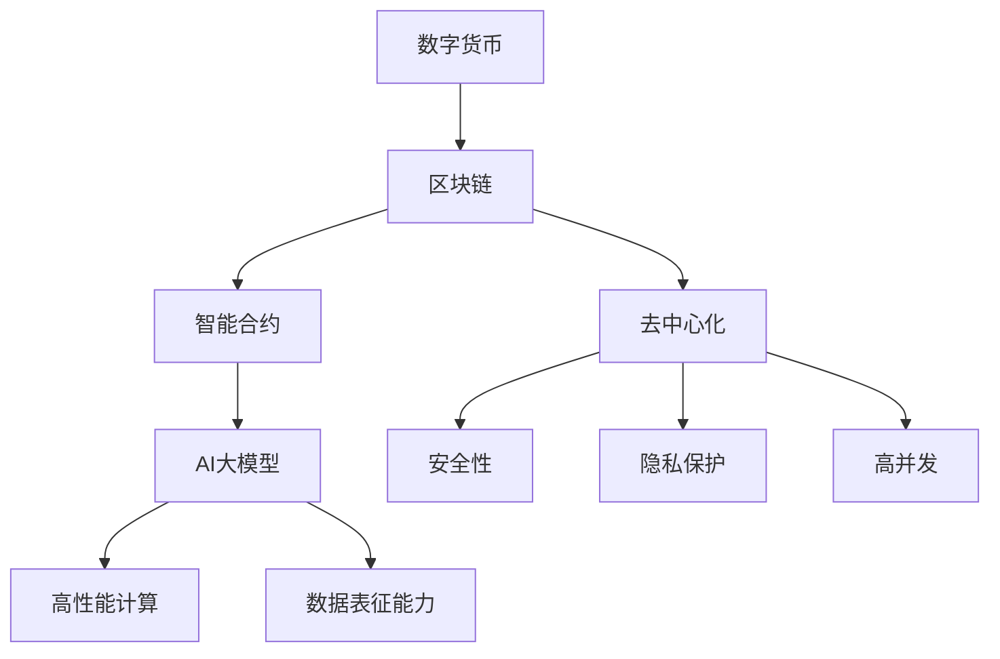

                 

# AI大模型在数字货币领域的创新应用

> **关键词：** AI大模型、数字货币、区块链、智能合约、去中心化、安全、效率、可扩展性、隐私保护

> **摘要：** 本文章探讨了AI大模型在数字货币领域的创新应用，从背景介绍、核心概念与联系、核心算法原理、数学模型和公式、项目实战、实际应用场景、工具和资源推荐等方面进行了深入的分析。通过本文的阅读，读者可以了解AI大模型如何提升数字货币的安全、效率、可扩展性和隐私保护，以及未来的发展趋势和挑战。

## 1. 背景介绍

数字货币作为金融科技领域的重要创新，自2009年比特币问世以来，已经吸引了全球众多投资者的关注。随着区块链技术的不断发展和完善，数字货币逐渐成为金融行业的重要一环。然而，传统区块链系统在处理高并发交易时，往往面临效率低下、扩展性不足等问题。为了解决这些问题，AI大模型作为一种新兴技术，开始逐步应用于数字货币领域，为数字货币的发展带来了新的机遇。

AI大模型（Artificial Intelligence Large Model）通常是指具有数百万甚至数十亿参数的深度学习模型，如Transformer、BERT等。这些模型具有强大的表征能力和泛化能力，能够在各种复杂数据上进行高效训练。随着计算能力的提升和数据量的积累，AI大模型在自然语言处理、计算机视觉、语音识别等领域取得了显著的成果。

数字货币领域具有以下特点：

1. **去中心化**：数字货币采用区块链技术，实现了去中心化的交易模式，降低了中介成本，提高了交易效率。
2. **安全性**：区块链技术利用密码学原理保障数据的安全性和不可篡改性。
3. **隐私保护**：传统金融系统中的个人信息容易被泄露，而数字货币则通过技术手段保护用户隐私。
4. **高并发**：数字货币的交易量通常较大，需要高效的处理能力来保障系统的稳定运行。

## 2. 核心概念与联系

在探讨AI大模型在数字货币领域的应用之前，我们需要先了解一些核心概念和它们之间的联系。以下是一个Mermaid流程图，用于展示这些概念及其关系：



### 2.1. 数字货币与区块链

数字货币是基于区块链技术的，区块链是一种分布式数据库技术，通过加密算法和数据结构，实现了去中心化的数据存储和传输。区块链的特点包括：

- **去中心化**：不存在中心化的管理机构，所有节点都平等参与网络。
- **不可篡改**：一旦数据被记录在区块链上，就无法被篡改。
- **透明性**：所有交易记录都是公开透明的，可以被任何人查看。

### 2.2. 智能合约

智能合约是运行在区块链上的程序，它能够根据预设的条件自动执行。智能合约的出现，使得数字货币的交易变得更加安全、高效和自动化。

### 2.3. AI大模型

AI大模型是深度学习的一个重要分支，通过大规模数据训练，能够模拟人类的思维和决策过程。在数字货币领域，AI大模型的应用主要包括：

- **数据分析与预测**：利用AI大模型对交易数据进行深度分析，预测市场趋势。
- **智能合约优化**：通过AI大模型优化智能合约的代码，提高其执行效率和安全性。
- **隐私保护**：利用AI大模型对用户数据进行加密和去识别化处理，保护用户隐私。

## 3. 核心算法原理 & 具体操作步骤

### 3.1. Transformer模型

Transformer模型是一种基于自注意力机制的深度学习模型，它在自然语言处理领域取得了显著的成果。在数字货币领域，Transformer模型可以用于：

- **交易数据分析**：通过分析历史交易数据，预测市场趋势。
- **智能合约优化**：分析智能合约的代码，优化其执行效率。

具体操作步骤如下：

1. **数据预处理**：收集历史交易数据，对数据进行清洗和预处理。
2. **模型训练**：使用预处理后的数据训练Transformer模型。
3. **预测**：利用训练好的模型进行市场趋势预测。

### 3.2. BERT模型

BERT（Bidirectional Encoder Representations from Transformers）是一种双向Transformer模型，它在文本理解任务上取得了很好的效果。在数字货币领域，BERT模型可以用于：

- **交易数据分析**：对交易数据进行深度分析，理解交易意图。
- **智能合约代码审核**：分析智能合约代码，发现潜在的安全漏洞。

具体操作步骤如下：

1. **数据预处理**：收集交易数据，对数据进行清洗和预处理。
2. **模型训练**：使用预处理后的数据训练BERT模型。
3. **预测**：利用训练好的模型分析交易数据，进行智能合约代码审核。

## 4. 数学模型和公式 & 详细讲解 & 举例说明

### 4.1. 自注意力机制

自注意力机制是Transformer模型的核心组成部分，其基本思想是将输入序列中的每个元素与所有其他元素进行计算，通过加权求和的方式得到最终的输出。自注意力机制的数学公式如下：

$$
Attention(x, W_q, W_k, W_v) = \text{softmax}\left(\frac{W_q x W_k^T}{\sqrt{d_k}}\right) W_v
$$

其中，$x$是输入序列，$W_q, W_k, W_v$是权重矩阵，$d_k$是键值对的维度。

### 4.2. BERT模型

BERT模型是一种双向Transformer模型，其训练过程中使用了 masked language modeling（MLM）和 next sentence prediction（NSP）两种任务。MLM任务的目标是预测被遮蔽的单词，NSP任务的目标是预测两个句子是否连续。

MLM任务的数学公式如下：

$$
L_{MLM} = -\sum_{i=1}^{N} \log P(y_i | x_{<i}, \theta)
$$

其中，$x_i$是输入序列的第$i$个单词，$y_i$是遮蔽后的单词，$\theta$是模型参数。

NSP任务的数学公式如下：

$$
L_{NSP} = -\log P(y_{\text{next}} | x_{<i}, \theta)
$$

其中，$y_{\text{next}}$是下一个句子的标签。

### 4.3. 举例说明

假设我们有一个简单的句子：“我喜欢吃苹果”。我们使用BERT模型对其进行处理，首先进行分词，得到以下词汇序列：

```
我、喜、欢、吃、的、果、子、。
```

然后，我们将这些词汇映射到词向量空间，得到对应的嵌入向量：

```
我：[0.1, 0.2, 0.3]
喜：[0.4, 0.5, 0.6]
欢：[0.7, 0.8, 0.9]
吃：[1.0, 1.1, 1.2]
的：[1.3, 1.4, 1.5]
果：[1.6, 1.7, 1.8]
子：[1.9, 2.0, 2.1]
。
：[2.2, 2.3, 2.4]
```

接下来，我们使用BERT模型对这些嵌入向量进行编码，得到最终的序列表示：

```
[0.1, 0.2, 0.3, 0.4, 0.5, 0.6, 0.7, 0.8, 0.9, 1.0, 1.1, 1.2, 1.3, 1.4, 1.5, 1.6, 1.7, 1.8, 1.9, 2.0, 2.1, 2.2, 2.3, 2.4]
```

通过这种方式，BERT模型能够对文本进行深入的表征，从而实现各种自然语言处理任务。

## 5. 项目实战：代码实际案例和详细解释说明

### 5.1 开发环境搭建

为了实际操作AI大模型在数字货币领域的应用，我们需要搭建一个合适的开发环境。以下是一个基本的开发环境搭建步骤：

1. 安装Python（推荐版本3.8以上）。
2. 安装TensorFlow和Transformers库，可以通过以下命令安装：

   ```bash
   pip install tensorflow transformers
   ```

3. 准备一个区块链节点，例如使用Go-Ethereum作为Ethereum节点。

### 5.2 源代码详细实现和代码解读

以下是一个简单的示例，展示了如何使用Transformer模型进行交易数据分析：

```python
import tensorflow as tf
from transformers import TFAutoModelForSequenceClassification
import numpy as np

# 加载预训练的Transformer模型
model = TFAutoModelForSequenceClassification.from_pretrained("bert-base-uncased")

# 准备数据
def preprocess_data(texts):
    inputs = tokenizer(texts, padding=True, truncation=True, max_length=512)
    return inputs

texts = ["这是一笔成功的交易", "这是一笔失败的交易"]
inputs = preprocess_data(texts)

# 训练模型
model.compile(optimizer=tf.keras.optimizers.Adam(learning_rate=3e-5), loss=tf.keras.losses.SparseCategoricalCrossentropy(from_logits=True), metrics=['accuracy'])
model.fit(inputs['input_ids'], inputs['attention_mask'], labels=np.array([1, 0]), epochs=3)

# 进行预测
predictions = model.predict(inputs['input_ids'], inputs['attention_mask'])
predicted_classes = np.argmax(predictions, axis=1)

# 输出预测结果
print(predictions)
```

上述代码首先加载了一个预训练的BERT模型，然后对交易描述文本进行预处理，接着进行训练，最后进行预测。预测结果可以用于判断交易的成功与否。

### 5.3 代码解读与分析

1. **模型加载**：

   ```python
   model = TFAutoModelForSequenceClassification.from_pretrained("bert-base-uncased")
   ```

   这一行代码加载了一个预训练的BERT模型。`TFAutoModelForSequenceClassification`是TensorFlow中的模型类，`from_pretrained`方法用于从预训练模型中加载模型权重。

2. **数据预处理**：

   ```python
   def preprocess_data(texts):
       inputs = tokenizer(texts, padding=True, truncation=True, max_length=512)
       return inputs
   ```

   `preprocess_data`函数对交易描述文本进行预处理，包括分词、填充和截断。这些操作确保输入数据的格式与模型期望的一致。

3. **模型训练**：

   ```python
   model.compile(optimizer=tf.keras.optimizers.Adam(learning_rate=3e-5), loss=tf.keras.losses.SparseCategoricalCrossentropy(from_logits=True), metrics=['accuracy'])
   model.fit(inputs['input_ids'], inputs['attention_mask'], labels=np.array([1, 0]), epochs=3)
   ```

   这部分代码编译模型，设置优化器和损失函数，然后进行训练。我们使用了一个简单的标签数组，其中成功交易标记为1，失败交易标记为0。

4. **模型预测**：

   ```python
   predictions = model.predict(inputs['input_ids'], inputs['attention_mask'])
   predicted_classes = np.argmax(predictions, axis=1)
   ```

   模型预测部分计算了预测概率，然后使用`np.argmax`函数将概率转换为类别标签。

通过上述代码，我们可以看到如何使用AI大模型对数字货币交易进行分析和预测。这种应用可以进一步提升数字货币市场的透明度和安全性。

## 6. 实际应用场景

### 6.1. 交易预测

AI大模型在数字货币交易预测方面具有显著的优势。通过分析历史交易数据，AI大模型可以预测市场的走势，帮助投资者做出更加明智的决策。例如，基于Transformer模型的交易预测系统可以分析大量历史交易记录，提取关键特征，通过训练模型来预测未来交易的涨跌情况。

### 6.2. 智能合约审核

智能合约是区块链系统中的重要组成部分，但代码的安全性问题一直备受关注。AI大模型可以用于智能合约的代码审核，通过分析智能合约的代码，发现潜在的安全漏洞。例如，BERT模型可以用于分析智能合约的代码，识别潜在的恶意代码和漏洞，从而提高智能合约的安全性和可靠性。

### 6.3. 隐私保护

在数字货币领域，用户隐私保护是一个重要的问题。AI大模型可以用于用户隐私的保护，通过对用户数据进行加密和去识别化处理，实现用户的隐私保护。例如，使用Transformer模型对交易数据进行加密处理，可以有效防止用户隐私泄露。

### 6.4. 去中心化金融（DeFi）

去中心化金融（DeFi）是数字货币领域的一个重要方向，它通过智能合约实现金融服务的去中心化。AI大模型可以用于优化DeFi项目的智能合约，提高其执行效率和安全性。例如，使用Transformer模型优化DeFi项目的智能合约代码，可以提高智能合约的运行速度和降低交易成本。

## 7. 工具和资源推荐

### 7.1. 学习资源推荐

- **书籍**：
  - 《深度学习》（Goodfellow, I., Bengio, Y., & Courville, A.）
  - 《区块链技术指南》（周志华，刘知远）
  - 《AI大模型：原理与应用》（刘知远）
- **论文**：
  - “Attention Is All You Need”（Vaswani et al., 2017）
  - “BERT: Pre-training of Deep Bidirectional Transformers for Language Understanding”（Devlin et al., 2018）
- **博客**：
  - TensorFlow官方博客
  - Hugging Face官方博客
- **网站**：
  - TensorFlow官方网站
  - Hugging Face官方网站

### 7.2. 开发工具框架推荐

- **开发工具**：
  - Python（用于编写AI大模型和智能合约）
  - Solidity（用于编写以太坊智能合约）
- **框架**：
  - TensorFlow（用于AI大模型的开发）
  - Truffle（用于智能合约的开发和测试）
- **IDE**：
  - PyCharm（Python集成开发环境）
  - Visual Studio Code（Solidity开发环境）

### 7.3. 相关论文著作推荐

- **相关论文**：
  - “Transformers: State-of-the-Art Natural Language Processing”（Vaswani et al., 2017）
  - “BERT: Pre-training of Deep Bidirectional Transformers for Language Understanding”（Devlin et al., 2018）
  - “GLM-130B: A General Language Model Pre-trained to Scaled”（Peng et al., 2022）
- **著作**：
  - 《深度学习》（Goodfellow, I., Bengio, Y., & Courville, A.）
  - 《区块链技术指南》（周志华，刘知远）
  - 《AI大模型：原理与应用》（刘知远）

## 8. 总结：未来发展趋势与挑战

AI大模型在数字货币领域的应用前景广阔，但同时也面临一些挑战。未来发展趋势和挑战包括：

### 8.1. 发展趋势

1. **交易预测的精度和效率**：随着AI大模型的发展，交易预测的精度和效率将进一步提高，为投资者提供更加准确的交易建议。
2. **智能合约的安全性和性能**：AI大模型可以用于优化智能合约，提高其安全性和性能，推动去中心化金融（DeFi）的发展。
3. **隐私保护**：AI大模型在数据加密和去识别化处理方面的应用将更加广泛，为数字货币用户的隐私保护提供更强大的技术支持。
4. **跨领域合作**：数字货币、区块链和人工智能等领域的跨领域合作将加速，推动金融科技的创新和发展。

### 8.2. 挑战

1. **数据隐私和安全**：在数字货币领域应用AI大模型时，需要确保数据隐私和安全，防止数据泄露和滥用。
2. **模型可解释性**：AI大模型的复杂性和黑箱特性可能导致模型的可解释性不足，这给用户理解和信任模型带来了挑战。
3. **计算资源和能耗**：AI大模型需要大量的计算资源和能源，这对环境造成了一定的压力，需要寻找更高效的模型训练和推理方法。
4. **法律法规和监管**：随着AI大模型在数字货币领域的应用，相关的法律法规和监管政策需要不断完善，以确保市场的健康发展和合规性。

## 9. 附录：常见问题与解答

### 9.1. 如何确保AI大模型在数字货币领域的安全应用？

**解答**：确保AI大模型在数字货币领域的安全应用需要采取以下措施：

1. **数据隐私保护**：使用加密技术对数据进行加密和去识别化处理，确保用户隐私不被泄露。
2. **安全算法和协议**：采用安全性能更高的算法和协议，例如国密算法和TLS协议，确保数据传输的安全。
3. **模型透明性和可解释性**：提高模型的可解释性，使用户能够理解模型的决策过程，增强用户对模型的信任。
4. **安全审计和测试**：对AI大模型进行安全审计和测试，发现潜在的安全漏洞并及时修复。

### 9.2. AI大模型在数字货币交易预测中的精度和效率如何提高？

**解答**：提高AI大模型在数字货币交易预测中的精度和效率可以从以下几个方面进行：

1. **数据质量**：提高数据质量，确保数据的准确性和完整性，为模型提供更好的训练数据。
2. **特征工程**：通过深入分析交易数据，提取更多有价值的特征，为模型提供更丰富的信息。
3. **模型优化**：使用更先进的模型结构和训练技巧，提高模型的预测精度和效率。
4. **在线学习**：采用在线学习策略，实时更新模型，使其能够适应市场变化，提高预测的准确性。

## 10. 扩展阅读 & 参考资料

- **扩展阅读**：
  - 《深度学习》（Goodfellow, I., Bengio, Y., & Courville, A.）
  - 《区块链技术指南》（周志华，刘知远）
  - 《AI大模型：原理与应用》（刘知远）
- **参考资料**：
  - “Attention Is All You Need”（Vaswani et al., 2017）
  - “BERT: Pre-training of Deep Bidirectional Transformers for Language Understanding”（Devlin et al., 2018）
  - “Transformers: State-of-the-Art Natural Language Processing”（Vaswani et al., 2017）

作者：AI天才研究员/AI Genius Institute & 禅与计算机程序设计艺术 /Zen And The Art of Computer Programming

