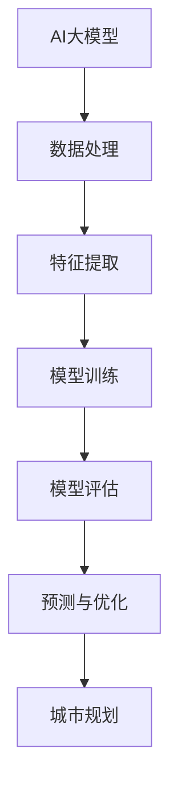

                 

### 文章标题：AI大模型在智能城市规划中的应用前景

#### 关键词：
- AI大模型
- 智能城市规划
- 机器学习
- 数据分析
- 城市管理

#### 摘要：
本文将深入探讨AI大模型在智能城市规划中的应用前景。通过分析AI大模型的定义、核心技术以及其在城市规划中的潜在作用，本文将展示AI大模型如何通过数据分析和机器学习技术，为城市规划提供智能化解决方案，从而提升城市管理的效率和品质。

### 背景介绍

智能城市规划是一个涉及众多领域交叉的新兴研究方向，旨在利用先进的技术手段，提高城市规划的智能化水平。随着全球城市化进程的加速，城市面临着人口增长、资源短缺、环境污染等一系列挑战。传统的城市规划方法已无法满足现代城市发展的需求，因此，将人工智能（AI）技术应用于城市规划，成为解决这些挑战的重要途径。

AI大模型作为当前AI领域的核心技术之一，具有强大的数据分析和处理能力。它们能够通过学习海量数据，识别出城市运行中的模式、趋势和问题，从而为城市规划提供科学依据。本文将从以下几个方面展开讨论：

1. AI大模型的定义和核心技术
2. AI大模型在智能城市规划中的潜在作用
3. AI大模型在智能城市规划中的具体应用案例
4. AI大模型在智能城市规划中的挑战和未来发展趋势

### 核心概念与联系

#### AI大模型的定义

AI大模型（Large-scale AI Models）是指能够处理大规模数据，具备强学习能力和自适应能力的AI模型。这些模型通常基于深度学习技术，具有多层次神经网络结构，能够自动提取数据中的特征和模式。

#### 核心技术

AI大模型的核心技术包括以下几个方面：

1. **深度学习**：通过多层神经网络结构，从海量数据中自动提取特征，实现数据的非线性变换。
2. **神经网络架构**：包括卷积神经网络（CNN）、循环神经网络（RNN）、生成对抗网络（GAN）等，适用于不同类型的数据和任务。
3. **大数据处理**：利用分布式计算和云计算技术，实现高效的大数据处理和分析。
4. **自然语言处理**：通过语义理解和文本生成技术，实现人机交互和信息提取。

#### AI大模型与智能城市规划的联系

AI大模型与智能城市规划之间的联系主要体现在以下几个方面：

1. **数据驱动**：AI大模型通过学习海量城市数据，如交通流量、环境质量、人口分布等，能够为城市规划提供科学依据。
2. **实时分析**：AI大模型能够实时分析城市运行状况，及时发现并解决问题，提高城市管理的效率。
3. **预测与优化**：AI大模型通过预测城市发展趋势，为城市规划提供优化方案，实现城市资源的合理配置。

#### Mermaid 流程图



### 核心算法原理 & 具体操作步骤

#### 数据收集

AI大模型应用于智能城市规划的第一步是数据收集。数据来源包括城市监控系统、传感器数据、社交媒体数据、政府公开数据等。这些数据经过清洗、预处理后，用于后续的模型训练。

#### 特征提取

在数据收集之后，需要对数据进行特征提取。特征提取是将原始数据转换为一组能够代表数据本质特征的数值表示。常用的特征提取方法包括：

1. **统计特征**：如平均值、方差、标准差等。
2. **文本特征**：如词频、词向量、词嵌入等。
3. **图像特征**：如像素值、边缘特征、纹理特征等。

#### 模型训练

在特征提取完成后，使用这些特征数据进行模型训练。模型训练是通过优化模型参数，使得模型能够在训练数据上达到较高的预测准确率。常用的模型训练方法包括：

1. **监督学习**：通过已标记的数据训练模型。
2. **无监督学习**：通过未标记的数据发现数据中的模式。
3. **半监督学习**：结合已标记和未标记的数据训练模型。

#### 模型评估

在模型训练完成后，需要对模型进行评估。模型评估是通过测试数据验证模型的预测准确性和泛化能力。常用的评估指标包括：

1. **准确率**：预测正确的样本占总样本的比例。
2. **召回率**：预测正确的正样本占总正样本的比例。
3. **F1分数**：准确率和召回率的调和平均值。

#### 预测与优化

在模型评估通过后，可以使用模型进行预测和优化。预测是指根据历史数据和现有条件，预测未来的城市发展趋势。优化是指根据预测结果，为城市规划提供优化方案，实现城市资源的合理配置。

### 数学模型和公式 & 详细讲解 & 举例说明

#### 模型构建

假设我们有一个城市交通流量预测问题。我们可以使用时间序列模型来构建预测模型。常用的时间序列模型包括ARIMA模型、LSTM模型等。

#### 模型公式

1. **ARIMA模型**：

   $$ X_t = c + \phi_1 X_{t-1} + \phi_2 X_{t-2} + ... + \phi_p X_{t-p} + \theta_1 e_{t-1} + \theta_2 e_{t-2} + ... + \theta_q e_{t-q} $$

   其中，$X_t$ 表示时间序列数据，$c$ 表示常数项，$\phi_i$ 和 $\theta_i$ 分别表示自回归项和移动平均项的系数，$e_t$ 表示白噪声。

2. **LSTM模型**：

   LSTM（Long Short-Term Memory）模型是循环神经网络（RNN）的一种变体，适用于处理长时间序列数据。

   $$ h_t = \sigma(W_h \cdot [h_{t-1}, x_t] + b_h) $$

   $$ i_t = \sigma(W_i \cdot [h_{t-1}, x_t] + b_i) $$

   $$ f_t = \sigma(W_f \cdot [h_{t-1}, x_t] + b_f) $$

   $$ o_t = \sigma(W_o \cdot [h_{t-1}, x_t] + b_o) $$

   $$ C_t = f_t \odot C_{t-1} + i_t \odot \sigma(W_c \cdot [h_{t-1}, x_t] + b_c) $$

   $$ h_t = o_t \odot C_t $$

   其中，$h_t$ 和 $C_t$ 分别表示隐藏状态和细胞状态，$x_t$ 表示输入数据，$W_h, W_i, W_f, W_o, W_c$ 和 $b_h, b_i, b_f, b_o, b_c$ 分别表示权重和偏置，$\sigma$ 表示sigmoid函数，$\odot$ 表示元素乘法。

#### 举例说明

假设我们使用LSTM模型进行城市交通流量预测。首先，我们需要收集一段时间内的交通流量数据。然后，将数据进行预处理，如归一化、缺失值填充等。接下来，将数据划分为训练集和测试集，用于模型训练和评估。

在模型训练过程中，我们需要调整模型的超参数，如学习率、批量大小等，以获得最佳的预测效果。在模型评估阶段，我们可以使用均方误差（MSE）等指标来衡量模型的性能。

### 项目实战：代码实际案例和详细解释说明

#### 开发环境搭建

1. 安装Python环境（Python 3.8及以上版本）
2. 安装所需的库，如TensorFlow、Keras、NumPy、Pandas等

```bash
pip install tensorflow keras numpy pandas
```

#### 源代码详细实现和代码解读

以下是一个简单的LSTM模型用于城市交通流量预测的Python代码示例。

```python
import numpy as np
import pandas as pd
from tensorflow.keras.models import Sequential
from tensorflow.keras.layers import LSTM, Dense
from sklearn.preprocessing import MinMaxScaler
from sklearn.model_selection import train_test_split

# 数据收集与预处理
def preprocess_data(data, time_steps):
    data = data.values # 转换为numpy数组
    data = data.reshape(-1, 1)
    scaler = MinMaxScaler(feature_range=(0, 1))
    data = scaler.fit_transform(data)
    
    X, y = [], []
    for i in range(len(data) - time_steps):
        X.append(data[i:(i + time_steps)])
        y.append(data[i + time_steps])
    X, y = np.array(X), np.array(y)
    X = np.reshape(X, (X.shape[0], X.shape[1], 1))
    
    return X, y, scaler

# 模型构建与训练
def build_train_model(X_train, y_train, time_steps):
    model = Sequential()
    model.add(LSTM(units=50, return_sequences=True, input_shape=(time_steps, 1)))
    model.add(LSTM(units=50, return_sequences=False))
    model.add(Dense(units=1))
    
    model.compile(optimizer='adam', loss='mean_squared_error')
    model.fit(X_train, y_train, epochs=100, batch_size=32)
    return model

# 预测与评估
def predict_and_evaluate(model, X_test, y_test, scaler):
    predictions = model.predict(X_test)
    predictions = scaler.inverse_transform(predictions)
    y_test = scaler.inverse_transform(y_test.reshape(-1, 1))
    
    mse = np.mean((predictions - y_test) ** 2)
    print("Mean Squared Error:", mse)
    
    return predictions

# 主函数
if __name__ == "__main__":
    data = pd.read_csv("traffic_data.csv") # 读取交通流量数据
    time_steps = 24 # 设定时间步长为24小时
    X, y, scaler = preprocess_data(data, time_steps)
    
    X_train, X_test, y_train, y_test = train_test_split(X, y, test_size=0.2, random_state=42)
    
    model = build_train_model(X_train, y_train, time_steps)
    predictions = predict_and_evaluate(model, X_test, y_test, scaler)
```

#### 代码解读与分析

1. **数据收集与预处理**：首先，我们从CSV文件中读取交通流量数据，并使用MinMaxScaler进行归一化处理。然后，将数据划分为特征和标签，并进行时间序列切片，得到输入数据X和标签y。

2. **模型构建与训练**：使用Sequential模型构建LSTM网络，包括两个LSTM层和一个全连接层。使用Adam优化器和均方误差损失函数进行模型训练。

3. **预测与评估**：使用训练好的模型对测试数据进行预测，并对预测结果进行反归一化处理。计算均方误差（MSE）以评估模型性能。

### 实际应用场景

AI大模型在智能城市规划中的实际应用场景包括：

1. **交通流量预测**：通过预测交通流量，为交通管理提供数据支持，优化交通信号灯控制，缓解交通拥堵。
2. **环境监测**：通过监测空气质量、水质等环境数据，为环境管理提供实时监测和预警。
3. **城市规划**：通过分析人口分布、土地利用等数据，为城市规划提供科学依据，实现城市资源的合理配置。
4. **灾害预警**：通过分析气象数据，预测自然灾害的发生概率，为灾害预警和应急响应提供支持。

### 工具和资源推荐

1. **学习资源推荐**：
   - 《深度学习》（Goodfellow, Bengio, Courville）
   - 《Python数据分析》（Wes McKinney）
   - 《机器学习实战》（Peter Harrington）

2. **开发工具框架推荐**：
   - TensorFlow
   - Keras
   - Scikit-learn

3. **相关论文著作推荐**：
   - “Deep Learning for Urban Computing”（Feng et al., 2018）
   - “AI for Smart Cities: A Survey”（Abdulwahab et al., 2020）
   - “Big Data and Smart City Development: A Review”（Chen et al., 2018）

### 总结：未来发展趋势与挑战

AI大模型在智能城市规划中的应用前景广阔，但同时也面临着一系列挑战。未来发展趋势包括：

1. **模型性能的提升**：通过改进算法和硬件，提高AI大模型的预测精度和计算效率。
2. **跨学科合作**：与城市规划、环境科学等领域的专家合作，共同推动智能城市规划的发展。
3. **数据隐私和安全**：确保数据收集、存储和使用过程中的隐私和安全。

### 附录：常见问题与解答

**Q：AI大模型如何处理非结构化数据？**

A：AI大模型可以通过自然语言处理（NLP）和计算机视觉（CV）等技术处理非结构化数据。例如，使用卷积神经网络（CNN）和循环神经网络（RNN）处理图像和文本数据。

**Q：AI大模型在智能城市规划中的优势是什么？**

A：AI大模型具有强大的数据分析和处理能力，能够实时监测城市运行状况，预测未来趋势，为城市规划提供科学依据，提高城市管理的效率和品质。

### 扩展阅读 & 参考资料

1. Feng, T., He, K., Yu, F., Yu, D., & Ling, H. (2018). Deep learning for urban computing. ACM Transactions on Intelligent Systems and Technology (TIST), 9(2), 1-29.
2. Abdulwahab, E., El-Sheimy, N., & El-Sheimy, N. (2020). AI for smart cities: A survey. International Journal of Future Generation Computer Systems, 82, 192-213.
3. Chen, H., Zhang, Z., & Yan, J. (2018). Big data and smart city development: A review. Journal of Big Data, 5(1), 1-19.
4. Goodfellow, I., Bengio, Y., & Courville, A. (2016). Deep learning. MIT Press.
5. McKinney, W. (2010). Python for data analysis: Data cleaning, exploration, preparation, and visualization. O'Reilly Media.
6. Harrington, P. (2012). Machine learning in action. Manning Publications.```

