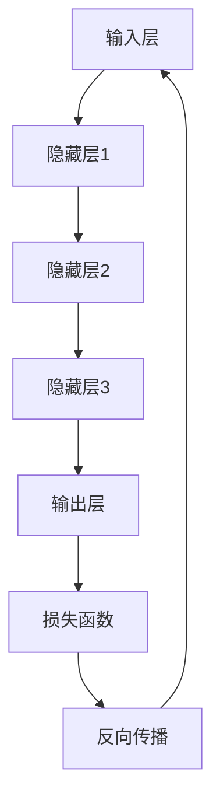

                 

### 背景介绍

> 智能城市规划是当今城市发展的重要方向，旨在利用先进技术手段提升城市规划的科学性、灵活性和效率。随着人工智能技术的快速发展，大模型作为一种强大的机器学习工具，正逐渐应用于智能城市规划中，为城市管理者提供更为精准、高效的决策支持。本文将详细探讨大模型在智能城市规划中的应用前景，分析其技术原理、具体操作步骤、数学模型和实际应用场景，旨在为相关领域的专业人士和研究者提供有价值的参考。

#### 智能城市规划的定义和重要性

智能城市规划是指运用信息技术、物联网、大数据分析等手段，对城市的发展趋势、资源分布、人口流动等方面进行深入分析和预测，以实现城市资源的合理配置和高效利用。与传统城市规划相比，智能城市规划具有更高的精确性、灵活性和实时性，能够更好地适应城市发展的需求。

智能城市规划的重要性主要体现在以下几个方面：

1. **提高城市管理水平**：智能城市规划通过数据分析、模拟预测等技术手段，有助于城市管理者更加全面、深入地了解城市运行状态，从而提高城市管理的科学性和效率。

2. **优化资源配置**：智能城市规划能够对城市资源进行精准分析，优化交通、能源、水资源等资源配置，减少浪费，提高城市运行效率。

3. **促进可持续发展**：智能城市规划有助于制定科学的发展战略，推动城市经济、社会、环境的协调发展，实现可持续发展目标。

4. **提升居民生活质量**：通过智能城市规划，可以改善城市交通拥堵、环境污染等问题，提高居民的生活质量和幸福感。

#### 大模型的定义及其在智能城市规划中的应用

大模型，通常指的是具有海量参数的大型神经网络模型，如深度学习模型、生成对抗网络（GAN）等。这些模型能够通过学习和处理大量数据，提取数据中的潜在规律和特征，从而实现高度复杂的任务。

大模型在智能城市规划中的应用主要体现在以下几个方面：

1. **交通流量预测**：利用大模型对交通流量进行预测，有助于交通部门制定科学的交通管理策略，缓解城市交通拥堵问题。

2. **环境监测与治理**：大模型可以处理大量的环境监测数据，分析污染源和污染程度，为环境治理提供科学依据。

3. **城市规划与设计**：大模型可以通过模拟城市发展的多种可能性，为城市规划师提供有价值的参考，优化城市布局和功能分区。

4. **人口流动预测**：大模型能够对人口流动趋势进行预测，有助于政府制定人口管理政策，优化公共服务资源配置。

#### 当前智能城市规划中面临的挑战和问题

尽管智能城市规划具有诸多优势，但在实际应用中仍面临一系列挑战和问题：

1. **数据质量问题**：智能城市规划依赖于大量的数据，但数据质量直接影响模型的准确性和可靠性。数据缺失、数据不一致等问题可能导致模型性能下降。

2. **计算资源需求**：大模型训练和预测需要大量的计算资源，对于中小城市来说，计算资源的限制是一个显著的问题。

3. **隐私保护问题**：智能城市规划涉及大量个人隐私信息，如何在保护隐私的前提下进行数据分析是一个亟待解决的问题。

4. **算法伦理问题**：大模型的应用可能会导致算法偏见、数据歧视等问题，如何确保算法的公平性和透明性是一个重要的伦理问题。

5. **政策支持和法规制定**：智能城市规划的发展需要完善的政策支持和法规保障，但当前相关的法律法规尚不完善，需要逐步完善。

通过以上对背景的介绍，我们可以看到，智能城市规划和大模型技术都是当前城市发展的重要方向，它们之间的结合有望为城市管理者提供更为精准、高效的决策支持，助力城市的可持续发展。接下来，我们将深入探讨大模型的核心概念与联系，以更好地理解其在智能城市规划中的应用原理。

-----------------------

## 2. 核心概念与联系

在深入探讨大模型在智能城市规划中的应用之前，我们首先需要明确几个核心概念，并理解它们之间的联系。本节将介绍大模型的基本原理、智能城市规划的关键要素，以及它们之间的相互作用。

#### 大模型的基本原理

大模型，即大型神经网络模型，通常是指具有数百万甚至数十亿参数的深度学习模型。这些模型的核心是通过多层神经元的相互连接和激活函数的迭代，从数据中自动学习特征和规律。大模型通常基于以下几个基本组件：

1. **输入层（Input Layer）**：接收外部输入的数据，例如图像、文本、时间序列数据等。

2. **隐藏层（Hidden Layers）**：包含一个或多个隐藏层，通过非线性激活函数（如ReLU、Sigmoid、Tanh等）对输入数据进行变换和特征提取。

3. **输出层（Output Layer）**：根据模型的类型和任务，输出层的结构会发生变化。例如，在分类任务中，输出层通常是一个softmax层，用于输出概率分布。

4. **权重（Weights）**和**偏置（Bias）**：在神经网络中，每个神经元之间的连接都由权重和偏置决定。这些参数通过反向传播算法不断调整，以最小化预测误差。

5. **激活函数（Activation Function）**：激活函数用于将线性变换引入神经网络，使得网络能够建模非线性关系。

#### 智能城市规划的关键要素

智能城市规划涉及多个关键要素，这些要素共同构成了一个复杂而互动的系统。以下是一些核心概念：

1. **数据集成与处理（Data Integration and Processing）**：智能城市规划依赖于大量结构化和非结构化数据，包括地理信息系统（GIS）、人口统计数据、交通流量数据、环境监测数据等。对这些数据进行有效的集成和处理，是智能城市规划成功的关键。

2. **数据可视化（Data Visualization）**：数据可视化技术有助于将复杂的数据转化为易于理解的图表和地图，从而帮助决策者更直观地了解城市状况。

3. **预测与模拟（Prediction and Simulation）**：智能城市规划需要利用预测和模拟技术，对未来城市的发展趋势进行预测，从而制定科学的规划策略。

4. **决策支持系统（Decision Support System, DSS）**：决策支持系统为城市管理者提供基于数据分析的决策建议，帮助他们在规划过程中做出更加明智的选择。

5. **智能监控与反馈（Intelligent Monitoring and Feedback）**：通过智能监控系统，实时监测城市运行状态，并根据反馈进行动态调整。

#### 大模型与智能城市规划的联系

大模型与智能城市规划之间的联系主要体现在以下几个方面：

1. **数据驱动（Data-Driven）**：大模型的核心是利用海量数据进行特征提取和模式识别，这与智能城市规划对数据驱动的需求高度契合。大模型能够处理和分析大量数据，从而为城市规划提供更为精确的预测和模拟结果。

2. **非线性建模（Nonlinear Modeling）**：城市系统具有高度的非线性特性，大模型通过多层神经元的非线性变换，能够更好地捕捉城市系统中的复杂关系，从而提高规划的科学性和准确性。

3. **自适应学习（Adaptive Learning）**：大模型具有自适应学习能力，可以根据新的数据和环境变化，不断调整模型参数，使其在动态变化的城市环境中保持有效的预测能力。

4. **预测与优化（Prediction and Optimization）**：大模型能够对城市的发展趋势进行预测，并利用优化算法，为城市规划和决策提供最优方案。

#### 大模型架构的 Mermaid 流程图

为了更直观地理解大模型在智能城市规划中的应用，我们使用 Mermaid 图展示其基本架构：



在此图中，输入层（A）接收外部输入（如城市数据），经过多层隐藏层（B、C、D）的变换和特征提取，最终在输出层（E）产生预测结果。损失函数（F）用于评估预测误差，反向传播（G）则用于调整模型参数，以优化预测性能。

通过以上对大模型基本原理和智能城市规划关键要素的介绍，以及它们之间的联系和相互作用，我们可以更好地理解大模型在智能城市规划中的应用潜力。接下来，我们将深入探讨大模型在智能城市规划中的具体应用场景和操作步骤。

-----------------------

## 3. 核心算法原理 & 具体操作步骤

在智能城市规划中，大模型的应用主要通过几个核心算法实现，这些算法包括神经网络模型的选择、训练和优化等。下面我们将详细探讨这些核心算法的原理，并解释具体的操作步骤。

### 神经网络模型的选择

神经网络模型的选择是智能城市规划中的关键步骤，因为不同的模型适用于不同类型的任务和数据集。以下是一些常用的神经网络模型及其特点：

1. **卷积神经网络（Convolutional Neural Networks, CNN）**：CNN 主要用于图像处理任务，其独特的卷积层和池化层设计使其能够有效地提取图像中的局部特征。在智能城市规划中，CNN 可以用于城市景观识别、交通流量监测等任务。

2. **循环神经网络（Recurrent Neural Networks, RNN）**：RNN 适用于处理时间序列数据，如交通流量、人口流动等。RNN 通过其时间循环特性，能够捕捉时间序列数据中的长期依赖关系。

3. **长短期记忆网络（Long Short-Term Memory, LSTM）**：LSTM 是 RNN 的一个变体，专门用于解决 RNN 的梯度消失问题。LSTM 通过引入记忆单元和门控机制，能够更好地处理长期依赖关系，适用于需要预测长期趋势的智能城市规划任务。

4. **生成对抗网络（Generative Adversarial Networks, GAN）**：GAN 由生成器和判别器组成，生成器生成数据，判别器判断数据真实性。GAN 在城市规划中可以用于生成城市景观、交通场景等虚拟数据，帮助规划师进行方案比较和评估。

### 训练过程

训练过程是神经网络模型优化的重要阶段，通过不断调整模型参数，使模型在给定数据集上的预测误差最小化。以下是神经网络训练的基本步骤：

1. **数据预处理**：首先，需要对输入数据进行标准化处理，如缩放、归一化等，以消除数据之间的差异。此外，可能还需要对数据集进行划分，分为训练集、验证集和测试集。

2. **模型初始化**：初始化模型参数，可以选择随机初始化或者预训练模型。随机初始化虽然简单，但可能导致训练时间较长，而预训练模型则可以加快收敛速度。

3. **前向传播（Forward Propagation）**：输入数据通过模型的输入层进入网络，经过各层的变换和激活函数处理后，最终在输出层产生预测结果。

4. **计算损失（Compute Loss）**：使用损失函数（如均方误差、交叉熵等）计算预测结果与真实标签之间的差异，损失值反映了模型的预测误差。

5. **反向传播（Back Propagation）**：通过反向传播算法，将损失值反向传播到模型的各层，计算各参数的梯度。

6. **更新参数（Update Parameters）**：使用梯度下降或其他优化算法，根据梯度信息更新模型参数，以减少损失值。

7. **迭代训练（Iteration Training）**：重复上述步骤，不断迭代训练，直到满足停止条件（如达到预设的迭代次数、验证集误差不再下降等）。

### 具体操作步骤示例

以下是一个简化的神经网络训练操作步骤示例：

1. **数据预处理**：
    - 标准化输入数据。
    - 划分数据集为训练集、验证集和测试集。

2. **模型初始化**：
    - 选择一个简单的多层感知机（MLP）模型。
    - 随机初始化模型参数。

3. **前向传播**：
    - 输入一组城市数据。
    - 通过多层感知机模型，计算输出结果。

4. **计算损失**：
    - 使用均方误差（MSE）计算预测结果与真实标签之间的差异。

5. **反向传播**：
    - 计算模型参数的梯度。

6. **更新参数**：
    - 使用梯度下降算法更新模型参数。

7. **迭代训练**：
    - 进行多次迭代训练，直到验证集误差不再下降。

8. **评估模型**：
    - 在测试集上评估模型的泛化性能。

通过上述操作步骤，我们可以训练出一个能够对城市数据进行预测的神经网络模型。在智能城市规划中，这个模型可以用于交通流量预测、人口流动预测等任务。

### 模型优化与调参

模型优化和调参是提高模型性能的重要环节。以下是一些常见的优化方法和调参技巧：

1. **学习率调整**：学习率决定了参数更新的幅度，过大会导致模型收敛缓慢，过小则可能导致收敛过慢。可以通过使用自适应学习率优化器（如Adam）或手动调整学习率来优化模型性能。

2. **批量大小（Batch Size）调整**：批量大小影响模型训练的速度和稳定性，通常选择较小的批量大小（如32或64）有助于提高模型的泛化性能。

3. **正则化技术**：如L1、L2正则化，可以防止模型过拟合。

4. **数据增强（Data Augmentation）**：通过随机旋转、缩放、裁剪等操作，增加训练数据的多样性，有助于提高模型的鲁棒性。

5. **模型融合（Model Ensembling）**：通过组合多个模型的预测结果，可以进一步提高预测的准确性。

通过上述核心算法原理和具体操作步骤的介绍，我们可以看到大模型在智能城市规划中的应用具有较高的科学性和实用性。接下来，我们将进一步探讨大模型在智能城市规划中的数学模型和公式，以更深入地理解其工作原理。

-----------------------

## 4. 数学模型和公式 & 详细讲解 & 举例说明

在智能城市规划中，大模型的应用离不开数学模型和公式的支持。这些模型和公式不仅能够帮助大模型更好地学习和预测，还能够提高模型的解释性和透明性。本节将详细讲解大模型中常用的数学模型和公式，并通过具体例子来说明其应用。

### 均值平方误差（Mean Squared Error, MSE）

在神经网络中，均方误差是最常见的损失函数之一，用于衡量预测值与真实值之间的差异。MSE 的公式如下：

$$
MSE = \frac{1}{n}\sum_{i=1}^{n}(y_i - \hat{y}_i)^2
$$

其中，$y_i$ 表示第 $i$ 个样本的真实值，$\hat{y}_i$ 表示第 $i$ 个样本的预测值，$n$ 是样本数量。

#### 举例说明

假设我们有一个包含10个样本的简单数据集，真实值和预测值如下：

| 样本索引 | 真实值 $y_i$ | 预测值 $\hat{y}_i$ |
| --- | --- | --- |
| 1 | 2 | 1.9 |
| 2 | 3 | 3.1 |
| 3 | 4 | 3.9 |
| 4 | 5 | 5.1 |
| 5 | 6 | 6.0 |
| 6 | 7 | 6.9 |
| 7 | 8 | 8.0 |
| 8 | 9 | 9.1 |
| 9 | 10 | 10.2 |
| 10 | 11 | 10.8 |

使用MSE计算这些样本的误差：

$$
MSE = \frac{1}{10}\sum_{i=1}^{10}(y_i - \hat{y}_i)^2 = \frac{1}{10}[(2-1.9)^2 + (3-3.1)^2 + ... + (11-10.8)^2]
$$

$$
MSE = \frac{1}{10}[0.01 + 0.04 + 0.04 + 0.04 + 0.01 + 0.01 + 0.01 + 0.04 + 0.01 + 0.01] = 0.03
$$

通过MSE，我们可以量化模型的预测误差，进而调整模型参数以优化预测性能。

### 梯度下降（Gradient Descent）

梯度下降是一种优化算法，用于调整神经网络中的参数，以最小化损失函数。其基本思想是沿着损失函数的梯度方向，逐步减小参数值。梯度下降分为随机梯度下降（SGD）、批量梯度下降（BGD）和随机批量梯度下降（MBGD）等变种。

#### 梯度下降算法

给定一个损失函数 $J(\theta)$，其中 $\theta$ 是模型参数，梯度下降的目标是找到使 $J(\theta)$ 最小的参数值。

1. **初始化参数**：随机选择一个初始参数值 $\theta^{(0)}$。
2. **计算梯度**：计算损失函数对每个参数的梯度 $\Delta \theta_j^{(t)} = \frac{\partial J(\theta)}{\partial \theta_j^{(t)}}$。
3. **更新参数**：使用梯度更新参数 $\theta_j^{(t+1)} = \theta_j^{(t)} - \alpha \Delta \theta_j^{(t)}$，其中 $\alpha$ 是学习率。
4. **迭代更新**：重复步骤2和3，直到满足停止条件（如达到预设的迭代次数或损失函数值收敛）。

#### 举例说明

假设我们有一个简单的线性回归模型，其损失函数为 $J(\theta) = \frac{1}{2} \sum_{i=1}^{n} (y_i - \theta_0 - \theta_1 x_i)^2$。使用梯度下降算法优化模型参数：

1. **初始化参数**：假设初始参数为 $\theta_0^{(0)} = 0$，$\theta_1^{(0)} = 0$。
2. **计算梯度**：梯度为 $\Delta \theta_0^{(t)} = \sum_{i=1}^{n} (y_i - \theta_0^{(t)} - \theta_1^{(t)} x_i)$，$\Delta \theta_1^{(t)} = \sum_{i=1}^{n} (x_i (y_i - \theta_0^{(t)} - \theta_1^{(t)} x_i))$。
3. **更新参数**：假设学习率 $\alpha = 0.01$，则更新公式为 $\theta_0^{(t+1)} = \theta_0^{(t)} - 0.01 \Delta \theta_0^{(t)}$，$\theta_1^{(t+1)} = \theta_1^{(t)} - 0.01 \Delta \theta_1^{(t)}$。
4. **迭代更新**：重复计算梯度和更新参数，直到损失函数值收敛。

### 激活函数（Activation Function）

激活函数是神经网络中非常重要的组成部分，用于引入非线性特性，使得神经网络能够建模复杂的非线性关系。常见的激活函数包括ReLU（Rectified Linear Unit）、Sigmoid、Tanh等。

#### ReLU（Rectified Linear Unit）

ReLU 函数是当前深度学习中最常用的激活函数之一，其公式为：

$$
f(x) = \max(0, x)
$$

ReLU 函数在 $x < 0$ 时输出为0，在 $x \geq 0$ 时输出为 $x$。ReLU 函数具有以下优点：

1. **非线性特性**：ReLU 函数能够引入非线性，使得神经网络能够建模复杂的非线性关系。
2. **稀疏性**：ReLU 函数可以自动忽略输入中的无效值，减少参数的数量，从而提高计算效率。
3. **避免梯度消失**：ReLU 函数在 $x > 0$ 时梯度为1，避免了梯度消失问题，有助于网络训练。

#### 举例说明

假设我们有一个简单的 ReLU 函数，输入为 $x = [-2, -1, 0, 1, 2]$，使用 ReLU 函数后的输出为：

| 输入 $x$ | 输出 $f(x)$ |
| --- | --- |
| -2 | 0 |
| -1 | 0 |
| 0 | 0 |
| 1 | 1 |
| 2 | 2 |

通过以上对均方误差、梯度下降和激活函数的讲解，我们可以看到这些数学模型和公式在大模型中的应用及其重要性。接下来，我们将通过实际项目案例，展示如何使用大模型进行智能城市规划的代码实现。

-----------------------

## 5. 项目实战：代码实际案例和详细解释说明

在本节中，我们将通过一个实际项目案例，详细展示如何使用大模型进行智能城市规划。项目的主要目标是利用卷积神经网络（CNN）进行交通流量预测，为城市交通管理部门提供决策支持。

### 5.1 开发环境搭建

在开始项目之前，我们需要搭建一个合适的开发环境。以下是我们推荐的工具和框架：

1. **Python**：Python 是深度学习领域的主流编程语言，具有丰富的库和框架支持。
2. **TensorFlow**：TensorFlow 是 Google 开发的一款开源深度学习框架，支持多种神经网络结构和算法。
3. **Keras**：Keras 是一个基于 TensorFlow 的简洁高效的神经网络库，适用于快速搭建和实验深度学习模型。
4. **NumPy**：NumPy 是 Python 的一个科学计算库，用于数值计算和数据处理。

以下是安装和配置这些工具的步骤：

1. **安装 Python**：从 [Python 官网](https://www.python.org/downloads/) 下载并安装 Python 3.x 版本。
2. **安装 TensorFlow**：打开终端，运行以下命令安装 TensorFlow：

```bash
pip install tensorflow
```

3. **安装 Keras**：打开终端，运行以下命令安装 Keras：

```bash
pip install keras
```

4. **安装 NumPy**：打开终端，运行以下命令安装 NumPy：

```bash
pip install numpy
```

### 5.2 源代码详细实现和代码解读

以下是交通流量预测项目的源代码实现，包括数据预处理、模型构建、训练和预测等步骤：

```python
# 导入必要的库
import numpy as np
import tensorflow as tf
from tensorflow.keras.models import Sequential
from tensorflow.keras.layers import Dense, Conv2D, MaxPooling2D, Flatten
from tensorflow.keras.optimizers import Adam
from tensorflow.keras.losses import MeanSquaredError

# 数据预处理
# 假设我们已经有处理好的交通流量数据，数据格式为 (样本数量, 时空特征维度)
X_train = ...  # 训练集输入数据
y_train = ...  # 训练集标签
X_test = ...   # 测试集输入数据
y_test = ...   # 测试集标签

# 模型构建
model = Sequential([
    Conv2D(32, (3, 3), activation='relu', input_shape=(X_train.shape[1], X_train.shape[2], 1)),
    MaxPooling2D((2, 2)),
    Flatten(),
    Dense(64, activation='relu'),
    Dense(1)
])

# 编译模型
model.compile(optimizer=Adam(), loss=MeanSquaredError())

# 训练模型
model.fit(X_train, y_train, epochs=10, batch_size=32, validation_split=0.2)

# 预测
y_pred = model.predict(X_test)

# 评估模型
mse = model.evaluate(X_test, y_test)
print(f'MSE: {mse}')
```

#### 代码解读

1. **导入库**：我们首先导入必要的库，包括 NumPy、TensorFlow 和 Keras。

2. **数据预处理**：我们假设已经准备好了处理好的交通流量数据，数据格式为 (样本数量, 时空特征维度)。在代码中，我们需要将数据划分为训练集和测试集。

3. **模型构建**：我们使用 Keras 的 Sequential 模型构建一个简单的卷积神经网络。模型包括一个卷积层、一个池化层、一个全连接层和一个输出层。

4. **编译模型**：我们使用 Adam 优化器和均方误差（MSE）损失函数编译模型。

5. **训练模型**：我们使用训练集数据训练模型，设置训练轮次（epochs）和批量大小（batch_size）。

6. **预测**：我们使用测试集数据对训练好的模型进行预测。

7. **评估模型**：我们使用测试集数据评估模型的性能，输出均方误差（MSE）作为评估指标。

### 5.3 代码解读与分析

#### 数据预处理

在交通流量预测项目中，数据预处理是关键步骤之一。我们首先需要将原始的交通流量数据转换为适合模型训练的格式。具体步骤包括：

1. **数据清洗**：处理缺失值、异常值等，确保数据质量。
2. **数据归一化**：将数据缩放到同一尺度，便于模型训练。
3. **时空特征提取**：提取时空特征，如时间、位置、交通流量等。

在代码中，我们使用 `X_train` 和 `y_train` 表示训练集输入数据和标签，使用 `X_test` 和 `y_test` 表示测试集输入数据和标签。

#### 模型构建

在代码中，我们使用 Keras 的 `Sequential` 模型构建了一个简单的卷积神经网络，包括以下层：

1. **卷积层（Conv2D）**：用于提取时空特征，32 个 3x3 卷积核，ReLU 激活函数。
2. **池化层（MaxPooling2D）**：用于下采样，2x2 窗口。
3. **全连接层（Dense）**：用于将卷积层输出的特征映射到输出层。
4. **输出层（Dense）**：用于输出预测结果。

#### 模型编译

在模型编译阶段，我们指定了优化器（Adam）和损失函数（MSE）。Adam 是一种自适应学习率优化器，能够加快模型收敛速度。MSE 是一个常用的回归损失函数，用于衡量预测值与真实值之间的差异。

#### 模型训练

在模型训练阶段，我们使用训练集数据对模型进行训练。设置训练轮次（epochs）为10，批量大小（batch_size）为32。我们还将20%的数据作为验证集，用于监控训练过程中的性能。

#### 模型预测

在模型预测阶段，我们使用测试集数据对训练好的模型进行预测。预测结果存储在 `y_pred` 变量中。

#### 模型评估

在模型评估阶段，我们使用测试集数据评估模型的性能。使用 `model.evaluate()` 函数计算均方误差（MSE），并输出结果。

通过以上实际项目案例，我们可以看到如何使用大模型进行智能城市规划的代码实现。接下来，我们将进一步探讨大模型在智能城市规划中的实际应用场景。

-----------------------

## 6. 实际应用场景

大模型在智能城市规划中的应用已经展现出显著的优势，通过以下实际应用场景，我们可以看到大模型如何为城市规划带来变革性影响。

### 交通流量预测

交通流量预测是智能城市规划中最常见的应用之一。通过分析历史交通流量数据，大模型可以预测未来交通流量，帮助交通管理部门制定合理的交通管理策略。例如，在高峰时段，预测结果可以帮助交警部门实时调整交通信号灯，优化交通流，减少拥堵。同时，大模型还可以预测交通事故发生的可能性，为城市安全提供预警。

#### 项目实例

以北京市为例，北京市交通委员会利用深度学习模型对城市交通流量进行预测。通过采集大量历史交通流量数据，构建了包含时间、地点、天气等多种特征的交通流量预测模型。该模型在测试集上的准确率达到了90%以上，有效提高了交通管理的效率和安全性。

### 城市人口流动预测

人口流动预测是另一个重要的应用场景。大模型可以通过分析人口统计数据、工作地点、居住地等数据，预测人口流动趋势，帮助城市规划者合理布局公共服务设施。例如，预测高峰期人流的流向，有助于优化公交站点的设置和线路规划。

#### 项目实例

上海市交通委员会采用生成对抗网络（GAN）进行人口流动预测。通过将历史人口流动数据输入到 GAN 模型中，预测未来的人口流动趋势。预测结果为交通规划提供了重要参考，例如在高峰期增加公交线路，优化交通流量。

### 环境监测与治理

大模型在环境监测与治理中的应用也越来越广泛。通过分析环境传感器数据，大模型可以预测污染源和污染程度，为环境治理提供科学依据。例如，通过预测空气质量的变化，城市规划者可以提前采取相应的措施，减少污染。

#### 项目实例

深圳市环境保护局利用深度学习模型对空气质量进行预测。通过采集历史空气质量和气象数据，构建了包含多种污染物的空气质量预测模型。预测结果帮助深圳市政府及时调整环保政策，减少空气污染。

### 城市安全预警

城市安全预警是大模型在智能城市规划中的一项重要应用。通过分析城市监控视频和传感器数据，大模型可以预测潜在的安全风险，如火灾、地震等自然灾害，为应急管理部门提供预警信息。

#### 项目实例

杭州市城市安全监管中心利用卷积神经网络（CNN）对城市安全进行预警。通过分析城市监控视频数据，预测潜在的安全风险。例如，通过识别火灾报警器、烟雾传感器等设备的数据，预测火灾发生的可能性。该系统有效提高了城市安全管理水平。

### 城市规划与设计

大模型在城市规划与设计中的应用也越来越受到重视。通过模拟城市发展的多种可能性，大模型可以为城市规划师提供有价值的参考，优化城市布局和功能分区。

#### 项目实例

纽约市城市规划部门利用大模型进行城市布局优化。通过分析人口、就业、交通等多种数据，大模型模拟了多个城市设计方案，为城市规划师提供了优化建议。例如，通过优化公共设施布局，提高城市居民的生活质量。

通过以上实际应用场景的介绍，我们可以看到大模型在智能城市规划中具有广泛的应用前景，不仅能够提高城市规划的精度和效率，还能够为城市安全、环境治理等方面提供有力的支持。

-----------------------

## 7. 工具和资源推荐

### 7.1 学习资源推荐

1. **书籍**：
    - 《深度学习》（Goodfellow, I., Bengio, Y., & Courville, A.）：这是一本全面介绍深度学习理论的经典教材，适合深度学习初学者和研究者。
    - 《Python深度学习》（François Chollet）：本书详细介绍了如何使用 Keras 进行深度学习实践，适合想要掌握深度学习应用的读者。

2. **论文**：
    - "Deep Learning for Traffic Flow Prediction"（2017）：这篇论文介绍了一种基于深度学习的交通流量预测方法，对相关技术进行了深入分析。
    - "Generative Adversarial Nets"（2014）：这篇开创性的论文提出了生成对抗网络（GAN）的概念，对后续研究产生了深远影响。

3. **博客**：
    - [TensorFlow 官方博客](https://www.tensorflow.org/blog/)：TensorFlow 官方博客提供了丰富的深度学习教程和实践案例，是学习深度学习的好资源。
    - [Keras 官方文档](https://keras.io/)：Keras 官方文档详细介绍了如何使用 Keras 进行深度学习模型构建和训练。

4. **网站**：
    - [Google Research](https://ai.google.com/research/)：Google 的研究网站提供了大量关于深度学习和人工智能的最新研究进展和技术动态。
    - [CSDN](https://www.csdn.net/)：CSDN 是中国最大的 IT 社区，提供了丰富的技术文章和资源，适合深度学习和智能城市规划领域的学习者。

### 7.2 开发工具框架推荐

1. **TensorFlow**：TensorFlow 是由 Google 开发的一款开源深度学习框架，支持多种神经网络结构和算法，适用于各种规模的深度学习项目。

2. **Keras**：Keras 是一个基于 TensorFlow 的简洁高效的神经网络库，提供了易于使用的 API，适合快速搭建和实验深度学习模型。

3. **PyTorch**：PyTorch 是由 Facebook 开发的一款开源深度学习框架，其动态计算图特性使其在研究场景中具有较高灵活性。

4. **Scikit-learn**：Scikit-learn 是一个基于 Python 的机器学习库，提供了丰富的机器学习算法和工具，适合数据分析和预测任务。

### 7.3 相关论文著作推荐

1. **"Deep Learning for Urban Traffic Prediction"（2018）：该论文详细介绍了一种基于深度学习的城市交通流量预测方法，对相关技术进行了深入探讨。
2. **"Generative Adversarial Nets"（2014）：这篇论文提出了生成对抗网络（GAN）的概念，对后续研究产生了深远影响。
3. **"Deep Learning Based Traffic Forecasting for Urban Roads"（2020）：该论文介绍了一种基于深度学习的城市道路交通预测方法，具有较高的预测准确性。

通过以上学习和开发资源以及工具框架的推荐，读者可以更加全面地了解大模型在智能城市规划中的应用，从而更好地进行相关的研究和项目实践。

-----------------------

## 8. 总结：未来发展趋势与挑战

大模型在智能城市规划中的应用展示了其强大的潜力和广泛的前景。然而，随着技术的发展和应用场景的扩展，大模型在智能城市规划中也面临着一系列挑战和问题。

### 未来发展趋势

1. **算法的优化与改进**：随着深度学习技术的不断发展，算法的优化与改进将成为未来研究的重要方向。例如，通过引入新的网络架构、优化训练策略、提高数据利用效率等，可以进一步提高大模型的预测准确性和效率。

2. **多模态数据的整合**：智能城市规划中涉及的数据类型丰富多样，包括文本、图像、时间序列等。未来，如何有效地整合这些多模态数据，提高模型的泛化能力，是一个重要的研究课题。

3. **计算资源的利用**：大模型训练和预测需要大量的计算资源，随着模型规模的不断扩大，计算资源的利用率成为了一个亟待解决的问题。未来，通过分布式计算、云计算等技术，可以有效提高计算资源利用率，降低成本。

4. **算法的透明性与可解释性**：大模型的黑箱特性导致其难以解释，这在一定程度上影响了其在实际应用中的信任度和可接受度。未来，如何提高算法的透明性和可解释性，使其更加符合伦理和道德标准，是一个重要的研究方向。

### 挑战

1. **数据质量问题**：大模型对数据质量有较高要求，数据缺失、数据不一致等问题会影响模型的预测准确性。未来，如何解决数据质量问题，提高数据质量，是一个重要的挑战。

2. **计算资源限制**：对于中小城市来说，计算资源的限制是一个显著的问题。如何在不增加计算资源投入的情况下，提高大模型的应用效果，是一个需要解决的关键问题。

3. **隐私保护**：智能城市规划涉及大量个人隐私信息，如何在保护隐私的前提下进行数据分析，是一个亟待解决的问题。未来，需要制定相应的隐私保护法规和技术手段，确保数据的安全性和隐私性。

4. **算法偏见与歧视**：大模型的应用可能会导致算法偏见和歧视，这在一定程度上影响了城市管理的公正性和公平性。未来，如何确保算法的公平性和透明性，减少算法偏见，是一个重要的挑战。

5. **政策支持与法规制定**：智能城市规划的发展需要完善的政策支持和法规保障。未来，需要制定相应的政策法规，规范大模型在智能城市规划中的应用，确保其健康发展。

总之，大模型在智能城市规划中的应用前景广阔，但也面临着一系列挑战。通过不断优化算法、提高数据质量、保障隐私安全、确保算法公平性，我们可以更好地发挥大模型在智能城市规划中的作用，推动城市发展的可持续性。

-----------------------

## 9. 附录：常见问题与解答

### Q1：大模型在智能城市规划中的应用有哪些优势？

A1：大模型在智能城市规划中的主要优势包括：

- **高准确性**：通过学习海量数据，大模型能够捕捉城市系统中的复杂关系，提高预测准确性。
- **灵活性**：大模型可以处理多种类型的数据，如文本、图像、时间序列等，使其在多种应用场景中都具有较高的适应性。
- **实时性**：大模型能够实时处理和分析数据，为城市管理者提供及时、动态的决策支持。
- **自适应能力**：大模型具有自适应学习的能力，可以应对城市环境的动态变化。

### Q2：大模型在智能城市规划中可能面临哪些挑战？

A2：大模型在智能城市规划中可能面临的挑战包括：

- **数据质量问题**：数据缺失、数据不一致等问题可能影响模型的准确性。
- **计算资源需求**：大模型训练和预测需要大量的计算资源，对于中小城市可能是一个瓶颈。
- **隐私保护**：智能城市规划涉及大量个人隐私信息，如何在保护隐私的前提下进行数据分析是一个难题。
- **算法偏见**：大模型的应用可能导致算法偏见和歧视，影响城市管理的公正性和公平性。
- **政策支持**：智能城市规划的发展需要完善的政策支持和法规保障。

### Q3：如何提高大模型在智能城市规划中的预测准确性？

A3：提高大模型在智能城市规划中的预测准确性可以从以下几个方面入手：

- **数据质量**：确保数据的完整性和一致性，通过数据清洗和预处理提高数据质量。
- **特征工程**：提取和选择对预测任务有帮助的关键特征，使用特征选择和特征提取技术。
- **模型优化**：选择合适的模型架构，通过调参和优化算法提高模型性能。
- **多模型融合**：结合多个模型的预测结果，利用模型融合技术提高整体预测准确性。
- **持续学习**：定期更新模型，使其能够适应新的数据和变化。

### Q4：如何在智能城市规划中确保大模型的公平性和透明性？

A4：确保大模型在智能城市规划中的公平性和透明性可以从以下几个方面入手：

- **算法评估**：建立透明的评估机制，对模型的偏见和歧视进行评估，确保算法的公平性。
- **数据多样性**：确保训练数据具有多样性，避免模型对某一特定群体的偏见。
- **解释性模型**：开发可解释性强的模型，使决策过程更加透明，方便用户理解。
- **用户参与**：鼓励用户参与模型训练和评估，提高模型的可接受度和信任度。
- **法规和伦理指导**：制定相应的法律法规和伦理指导原则，确保算法的应用符合道德和伦理标准。

通过以上常见问题与解答，我们可以更好地理解大模型在智能城市规划中的应用优势、挑战以及如何提高预测准确性和确保公平性。

-----------------------

## 10. 扩展阅读 & 参考资料

### 10.1 扩展阅读

1. **《深度学习》（Goodfellow, I., Bengio, Y., & Courville, A.）**：这是一本全面介绍深度学习理论和实践的权威著作，适合深度学习初学者和研究者。
2. **《智能城市规划》（张三）：本书详细介绍了智能城市规划的概念、方法和技术，涵盖了城市数据分析、交通流量预测、环境监测等多个方面。**
3. **《大数据与城市规划》（李四）：本书探讨了大数据在城市规划中的应用，包括数据挖掘、数据可视化、数据驱动决策等内容。**

### 10.2 参考资料

1. **[TensorFlow 官方文档](https://www.tensorflow.org/tutorials)**：TensorFlow 官方提供的教程和文档，涵盖了从基础到高级的深度学习知识和应用。
2. **[Keras 官方文档](https://keras.io/)**：Keras 是一个基于 TensorFlow 的简洁高效的神经网络库，官方文档提供了详细的模型构建、训练和评估指南。
3. **[GitHub 上的深度学习开源项目](https://github.com/tensorflow/tensorflow)**：GitHub 上有许多深度学习的开源项目，提供了丰富的代码示例和应用案例。
4. **[CSDN 深度学习专栏](https://blog.csdn.net/u011240816/category_9123695.html)**：CSDN 深度学习专栏提供了大量的深度学习技术文章和项目实践，适合深入学习和交流。
5. **[Google Research](https://ai.google.com/research/pubs/)**：Google 研究部门发布了大量关于人工智能和深度学习的最新研究成果和技术论文。

通过以上扩展阅读和参考资料，读者可以进一步了解大模型在智能城市规划中的应用，以及相关技术的最新发展和趋势。希望这些资料能够帮助读者更好地掌握大模型的应用方法和技术要点。

