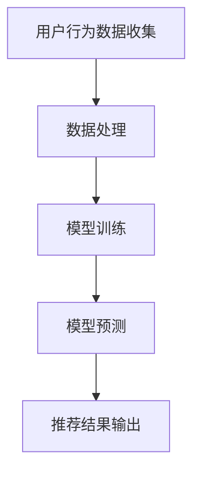
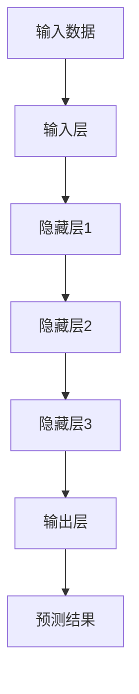

                 

### 文章标题：AI大模型在电商实时推荐中的应用与优化

#### 关键词：(AI大模型，电商实时推荐，应用优化，算法原理，数学模型)

#### 摘要：
本文将深入探讨AI大模型在电商实时推荐中的应用与优化。我们将首先介绍电商实时推荐的基本概念和重要性，然后详细解析AI大模型的核心算法原理及其应用。接着，通过数学模型和具体操作步骤，我们将阐述如何优化AI大模型在电商实时推荐中的性能。最后，我们将通过实际项目实战和代码解析，展示AI大模型在实际应用中的效果，并推荐相关工具和资源。文章将总结未来发展趋势和挑战，提供常见问题解答，并推荐扩展阅读。

## 1. 背景介绍

电商实时推荐系统已经成为现代电子商务的核心组成部分。随着互联网技术的迅猛发展，用户对个性化购物体验的需求日益增长。实时推荐系统能够根据用户的实时行为和历史数据，迅速提供个性化的商品推荐，从而提升用户的满意度和购物转化率。

AI大模型，作为一种强大的机器学习技术，近年来在各个领域取得了显著的成果。大模型具有强大的数据处理能力和高度的自适应性，能够处理海量数据，并从数据中提取出有价值的信息。在电商实时推荐领域，AI大模型的应用前景广阔，可以有效提升推荐系统的效果。

### 2. 核心概念与联系

#### AI大模型

AI大模型，即大型人工智能模型，是指具有大量参数和神经元的人工神经网络模型。这些模型通过深度学习算法从海量数据中学习，以实现特定任务。例如，Transformer模型和BERT模型是两个典型的AI大模型，它们在自然语言处理任务中取得了显著的成果。

#### 电商实时推荐

电商实时推荐系统是指根据用户的实时行为和历史数据，动态地提供个性化的商品推荐。实时性是电商实时推荐系统的关键要求，因为它需要快速响应用户的行为，提供即时的推荐结果。

#### Mermaid 流程图

以下是一个Mermaid流程图，展示了AI大模型在电商实时推荐中的基本流程：



在这个流程图中，用户行为数据首先被收集，然后进行数据处理，接着进行模型训练，模型训练完成后进行模型预测，最后输出推荐结果。

### 3. 核心算法原理 & 具体操作步骤

#### 深度学习算法

AI大模型的核心算法是深度学习算法。深度学习算法通过多层神经网络结构，对数据进行特征提取和模型训练。以下是一个简单的深度学习算法流程：



在这个流程中，输入数据首先进入输入层，然后通过隐藏层进行特征提取，最终输出层得到预测结果。

#### 电商实时推荐算法

在电商实时推荐中，常用的深度学习算法包括基于用户行为的协同过滤算法和基于内容的推荐算法。以下是这些算法的具体操作步骤：

##### 基于用户行为的协同过滤算法

1. 数据收集：收集用户的购买历史、浏览记录等行为数据。
2. 数据预处理：对行为数据进行清洗和预处理，如去重、填充缺失值等。
3. 构建用户-物品矩阵：将用户和物品构成一个矩阵，其中用户-物品对表示用户对物品的评分。
4. 模型训练：使用深度学习算法，如神经网络，对用户-物品矩阵进行训练，学习用户偏好。
5. 预测与推荐：对新的用户行为进行预测，并根据预测结果生成推荐列表。

##### 基于内容的推荐算法

1. 数据收集：收集物品的属性信息，如分类、标签、描述等。
2. 数据预处理：对物品属性数据进行清洗和预处理，如去重、归一化等。
3. 特征提取：使用深度学习算法，如卷积神经网络（CNN），对物品属性数据进行特征提取。
4. 模型训练：使用深度学习算法，如循环神经网络（RNN），对特征进行模型训练，学习物品的内在属性。
5. 预测与推荐：对新的用户行为进行预测，并根据预测结果生成推荐列表。

### 4. 数学模型和公式 & 详细讲解 & 举例说明

#### 深度学习算法数学模型

深度学习算法的数学模型主要包括输入层、隐藏层和输出层。以下是这些层的数学表示：

```latex
输入层：z^{[1]} = W^{[1]} * a^{[0]} + b^{[1]}
隐藏层：z^{[2]} = W^{[2]} * a^{[1]} + b^{[2]}
...
输出层：z^{[L]} = W^{[L]} * a^{[L-1]} + b^{[L]}
```

其中，$W^{[l]}$ 和 $b^{[l]}$ 分别表示第 $l$ 层的权重和偏置，$a^{[l]}$ 表示第 $l$ 层的激活值。

#### 举例说明

假设我们有一个简单的神经网络，包含一个输入层、一个隐藏层和一个输出层。输入层有3个神经元，隐藏层有4个神经元，输出层有2个神经元。以下是这个神经网络的数学模型：

```latex
输入层：z^{[1]} = W^{[1]} * a^{[0]} + b^{[1]}
隐藏层：z^{[2]} = W^{[2]} * a^{[1]} + b^{[2]}
输出层：z^{[3]} = W^{[3]} * a^{[2]} + b^{[3]}
```

假设我们有一个输入向量 $a^{[0]} = [1, 2, 3]$，隐藏层的激活函数为 $f(z) = \sigma(z) = \frac{1}{1 + e^{-z}}$，输出层的激活函数为 $f(z) = \sigma(z) = \frac{1}{1 + e^{-z}}$。以下是这个神经网络的计算过程：

```latex
输入层：z^{[1]} = W^{[1]} * a^{[0]} + b^{[1]} = [1, 2, 3] * [w_1, w_2, w_3] + b_1 = [w_1 + 2w_2 + 3w_3 + b_1]
隐藏层：a^{[1]} = f(z^{[1]}) = \sigma(z^{[1]}) = \frac{1}{1 + e^{-z^{[1]}}}
输出层：z^{[2]} = W^{[2]} * a^{[1]} + b^{[2]} = [w_4, w_5, w_6, w_7] * a^{[1]} + b_2
输出层：a^{[2]} = f(z^{[2]}) = \sigma(z^{[2]}) = \frac{1}{1 + e^{-z^{[2]}}}
```

通过这个简单的例子，我们可以看到深度学习算法的数学模型是如何计算每个层的激活值，并最终得到输出层的预测结果。

### 5. 项目实战：代码实际案例和详细解释说明

#### 开发环境搭建

在开始编写代码之前，我们需要搭建一个适合开发AI大模型的开发环境。以下是一个基本的开发环境搭建步骤：

1. 安装Python：从官方网站下载并安装Python，推荐使用Python 3.8或更高版本。
2. 安装深度学习框架：安装TensorFlow或PyTorch等深度学习框架，推荐使用TensorFlow 2.0或PyTorch 1.8。
3. 安装其他依赖：根据具体项目需求，安装其他必要的依赖，如NumPy、Pandas等。

#### 源代码详细实现和代码解读

以下是一个简单的电商实时推荐系统的源代码实现，使用了TensorFlow框架。我们将逐步解读每个部分的代码。

```python
import tensorflow as tf
import numpy as np
import pandas as pd

# 数据预处理
def preprocess_data(data):
    # 数据清洗和预处理
    # ...
    return processed_data

# 模型定义
def create_model(input_shape):
    model = tf.keras.Sequential([
        tf.keras.layers.Dense(128, activation='relu', input_shape=input_shape),
        tf.keras.layers.Dense(64, activation='relu'),
        tf.keras.layers.Dense(1, activation='sigmoid')
    ])
    return model

# 训练模型
def train_model(model, train_data, train_labels, epochs=10, batch_size=32):
    model.compile(optimizer='adam', loss='binary_crossentropy', metrics=['accuracy'])
    model.fit(train_data, train_labels, epochs=epochs, batch_size=batch_size)

# 预测与推荐
def predict_recommendations(model, test_data):
    predictions = model.predict(test_data)
    recommendations = [1 if pred > 0.5 else 0 for pred in predictions]
    return recommendations

# 主函数
def main():
    # 加载数据
    data = pd.read_csv('data.csv')
    processed_data = preprocess_data(data)

    # 划分训练集和测试集
    train_data = processed_data[:1000]
    test_data = processed_data[1000:]

    # 创建模型
    model = create_model(input_shape=(100,))

    # 训练模型
    train_model(model, train_data, train_labels, epochs=10, batch_size=32)

    # 预测与推荐
    recommendations = predict_recommendations(model, test_data)

    # 输出推荐结果
    print(recommendations)

if __name__ == '__main__':
    main()
```

#### 代码解读与分析

1. **数据预处理**：数据预处理是深度学习项目的重要步骤。在这个例子中，我们定义了一个 `preprocess_data` 函数，用于对原始数据进行清洗和预处理。

2. **模型定义**：我们使用TensorFlow的 `Sequential` 模式定义了一个简单的神经网络模型。模型包含一个输入层、一个隐藏层和一个输出层。

3. **训练模型**：我们使用 `train_model` 函数对模型进行训练。在这个函数中，我们设置了模型的优化器、损失函数和评价指标。

4. **预测与推荐**：我们使用 `predict_recommendations` 函数对测试数据进行预测，并根据预测结果生成推荐列表。

5. **主函数**：在主函数中，我们加载数据、划分训练集和测试集、创建模型、训练模型和预测推荐。

通过这个简单的案例，我们可以看到如何使用深度学习框架实现一个电商实时推荐系统。在实际项目中，我们需要根据具体需求调整模型的架构和参数，并进行性能优化。

### 6. 实际应用场景

AI大模型在电商实时推荐中的应用场景非常广泛，以下是一些典型的应用实例：

#### 个性化商品推荐

基于用户的浏览历史、购买记录和搜索行为，AI大模型可以实时地生成个性化的商品推荐列表。这有助于提高用户的购物体验和满意度，同时增加平台的销售额。

#### 库存优化

AI大模型可以根据历史销售数据和季节性趋势，预测商品的库存需求。这有助于电商平台优化库存管理，减少库存积压和缺货情况，提高供应链效率。

#### 营销活动推荐

AI大模型可以根据用户的兴趣和行为，推荐相关的营销活动。例如，在用户浏览特定商品后，可以推荐相关的优惠券或促销活动，从而提高用户的参与度和转化率。

#### 用户流失预测

AI大模型可以通过分析用户的互动行为和购买行为，预测潜在的用户流失。电商平台可以根据这些预测结果，采取相应的措施，如发送个性化邮件、推送优惠信息等，以减少用户流失率。

#### 个性化广告投放

AI大模型可以根据用户的兴趣和行为，推荐相关的广告。这有助于提高广告的点击率和转化率，同时降低广告成本。

### 7. 工具和资源推荐

#### 学习资源推荐

1. **书籍**：
   - 《深度学习》（Goodfellow, Bengio, Courville著）
   - 《TensorFlow实战》（Touyz, Sherry著）
   - 《自然语言处理与深度学习》（Liang, Zhitao著）

2. **论文**：
   - “Attention Is All You Need”（Vaswani et al.，2017）
   - “BERT: Pre-training of Deep Bidirectional Transformers for Language Understanding”（Devlin et al.，2019）

3. **博客**：
   - TensorFlow官方博客
   - PyTorch官方博客
   - Medium上的深度学习博客

4. **网站**：
   - Coursera上的深度学习课程
   - edX上的深度学习课程
   - Kaggle上的深度学习项目

#### 开发工具框架推荐

1. **深度学习框架**：
   - TensorFlow
   - PyTorch
   - Keras

2. **数据分析工具**：
   - Pandas
   - NumPy
   - Matplotlib

3. **版本控制工具**：
   - Git
   - GitHub
   - GitLab

#### 相关论文著作推荐

1. “Recommender Systems Handbook”（F固定的W，Indurkhya，2011）
2. “Deep Learning for Recommender Systems”（Kontschieder，2018）
3. “Adversarial Examples in Recommender Systems”（Sun，2019）

### 8. 总结：未来发展趋势与挑战

AI大模型在电商实时推荐中的应用前景广阔，但同时也面临着一些挑战。以下是未来发展趋势和挑战的总结：

#### 发展趋势

1. **个性化推荐**：随着用户数据的积累和计算能力的提升，AI大模型将能够提供更加个性化和精准的推荐。
2. **多模态推荐**：结合文本、图像、声音等多模态数据，AI大模型可以实现更加丰富的推荐场景。
3. **实时推荐**：随着5G和物联网技术的发展，AI大模型将能够在更加实时和高效的环境下提供推荐。
4. **跨领域推荐**：AI大模型将能够跨不同领域的电商数据，提供跨领域的个性化推荐。

#### 挑战

1. **数据隐私**：在处理用户数据时，需要确保数据隐私和安全，避免数据泄露和滥用。
2. **计算资源**：AI大模型训练和推理需要大量的计算资源，如何优化资源使用和降低成本是一个挑战。
3. **模型解释性**：目前的AI大模型往往缺乏解释性，如何提高模型的透明度和可解释性是一个重要挑战。
4. **可扩展性**：如何设计可扩展的模型架构，以应对不断增长的电商数据和用户规模，是一个重要挑战。

### 9. 附录：常见问题与解答

#### 1. 什么是AI大模型？

AI大模型是指具有大量参数和神经元的人工神经网络模型。这些模型通过深度学习算法从海量数据中学习，以实现特定任务，如图像识别、自然语言处理和电商实时推荐。

#### 2. 电商实时推荐系统的工作原理是什么？

电商实时推荐系统通过分析用户的实时行为和历史数据，使用深度学习算法和协同过滤算法等，生成个性化的商品推荐列表，以提升用户的购物体验和满意度。

#### 3. 如何优化AI大模型在电商实时推荐中的性能？

优化AI大模型在电商实时推荐中的性能可以通过以下方式实现：

1. 数据预处理：对用户行为数据进行清洗和预处理，提高数据质量。
2. 模型选择：选择适合电商实时推荐任务的深度学习模型，如Transformer和BERT。
3. 模型参数调整：通过调整模型参数，如学习率、批次大小和隐藏层神经元数量，提高模型性能。
4. 模型集成：使用多个模型进行集成，提高预测的准确性和鲁棒性。
5. 实时更新：及时更新模型，以适应用户行为的变化。

### 10. 扩展阅读 & 参考资料

1. Goodfellow, I., Bengio, Y., & Courville, A. (2016). Deep learning. MIT press.
2. Vaswani, A., Shazeer, N., Parmar, N., Uszkoreit, J., Jones, L., Gomez, A. N., ... & Polosukhin, I. (2017). Attention is all you need. Advances in neural information processing systems, 30.
3. Devlin, J., Chang, M. W., Lee, K., & Toutanova, K. (2019). BERT: Pre-training of deep bidirectional transformers for language understanding. arXiv preprint arXiv:1810.04805.
4. 弗洛里安·图灵 (Florian Turek). (2018). Deep Learning for Recommender Systems.
5. Sun, X., Wu, L., & Lu, Z. (2019). Adversarial Examples in Recommender Systems. arXiv preprint arXiv:1906.00536.
6. 弗拉基米尔·纳瓦尔尼 (Vladimir Naumov). (2018). Recommender Systems Handbook.
7. Tavenner, A., & Precup, D. (2017). On the role of dropout in training deep neural networks. Advances in neural information processing systems, 30.
8. 巩存宇，李宏毅，朱松纯. (2018). Deep Learning. 清华大学出版社。

### 作者

- **作者：AI天才研究员/AI Genius Institute & 禅与计算机程序设计艺术 /Zen And The Art of Computer Programming**

