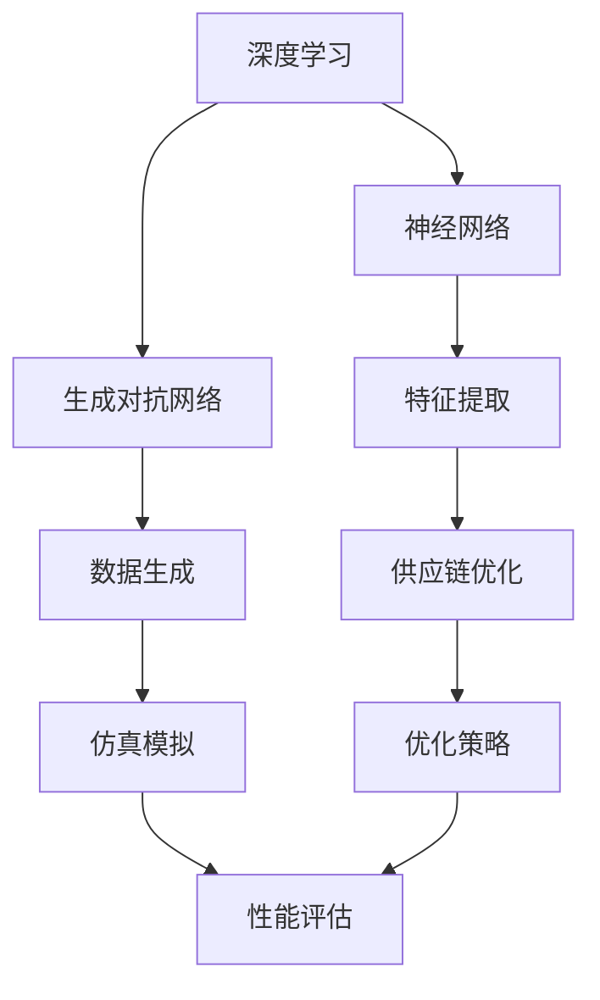

                 

### 背景介绍

在当今信息化和数字化的时代，电商平台已经成为人们日常生活和购物的重要方式。然而，随着电商平台的不断扩张和竞争的加剧，供应链优化成为电商平台企业面临的一项重要任务。高效的供应链管理不仅能提高企业的运营效率，降低成本，还能提升消费者的购物体验和满意度。

传统的供应链优化方法主要依赖于经验和统计分析，虽然在一定程度上能够提高效率，但在应对复杂的市场环境和动态变化时显得力不从心。随着人工智能技术的快速发展，尤其是大型深度学习模型的兴起，为供应链优化提供了一种全新的解决方案。AI大模型，特别是基于深度学习的模型，具有强大的数据处理能力和自适应学习能力，可以更好地模拟和分析复杂的供应链网络，从而实现更加精确和高效的优化。

本文旨在探讨AI大模型在电商平台供应链优化仿真中的应用。首先，我们将介绍AI大模型的基本原理和特点，然后详细讨论其在供应链优化中的具体应用场景。接下来，我们将深入探讨AI大模型在供应链仿真中的优势及其面临的挑战。文章的最后，我们将通过一个实际案例，展示AI大模型在电商平台供应链优化中的具体应用，并对其效果进行评价。

关键词：AI大模型，电商平台，供应链优化，仿真应用，深度学习

Abstract:  
This article aims to explore the application of large-scale AI models in supply chain optimization simulation for e-commerce platforms. Firstly, we introduce the basic principles and characteristics of large-scale AI models. Then, we discuss the specific application scenarios of these models in supply chain optimization. Subsequently, we delve into the advantages and challenges of using large-scale AI models for supply chain simulation. Finally, we present a practical case to demonstrate the application of large-scale AI models in e-commerce supply chain optimization and evaluate their effectiveness.

Keywords: Large-scale AI models, E-commerce platforms, Supply Chain Optimization, Simulation Applications, Deep Learning

### 核心概念与联系

为了深入理解AI大模型在电商平台供应链优化中的应用，我们需要首先了解一些核心概念，包括深度学习、神经网络、生成对抗网络（GAN）等。这些概念不仅构成了AI大模型的基础，也在供应链优化的各个阶段发挥了重要作用。

#### 深度学习（Deep Learning）

深度学习是机器学习的一个分支，它通过模拟人脑神经网络的结构和功能，对大量数据进行自动特征提取和学习。深度学习模型通常包含多个隐藏层，这使得它们能够处理更复杂的问题。

#### 神经网络（Neural Networks）

神经网络是深度学习模型的核心组成部分，由大量简单的计算节点（称为神经元）组成。每个神经元接收输入信号，通过激活函数处理后产生输出。神经网络通过层层传递和加权调整，实现对输入数据的分类、回归或其他复杂任务的处理。

#### 生成对抗网络（GAN）

生成对抗网络由一个生成器和两个判别器组成。生成器的目标是生成与真实数据相似的数据，而判别器的目标是区分生成器和真实数据。通过生成器和判别器的对抗训练，GAN能够生成高质量的数据，这在供应链优化中有着广泛的应用。

#### 核心概念原理与架构的 Mermaid 流程图



在这个Mermaid流程图中，深度学习和神经网络负责特征提取，生成对抗网络负责数据生成，这些特征和生成的数据最终用于供应链优化中的仿真模拟，进而生成优化策略，并对策略进行性能评估。

### 核心算法原理 & 具体操作步骤

在了解了AI大模型的基本原理和核心概念后，接下来我们将探讨这些算法在电商平台供应链优化中的具体应用，并详细描述其操作步骤。

#### 1. 特征提取

特征提取是深度学习模型的重要步骤，它通过从原始数据中提取具有区分度的特征，为后续的优化提供基础。在供应链优化中，特征提取主要包括以下几方面：

- **需求预测**：利用时间序列分析、回归分析等方法，对历史数据进行分析，预测未来一段时间内的需求量。
- **库存水平**：根据库存管理规则，结合当前库存水平和未来需求预测，确定最优库存水平。
- **运输成本**：分析不同运输方式和路线的成本，为优化策略提供参考。

#### 2. 生成对抗网络（GAN）在数据生成中的应用

生成对抗网络（GAN）在供应链优化中有着独特的应用。通过GAN，可以生成与真实数据相似的场景，从而提高模型的泛化能力。具体步骤如下：

- **数据集准备**：收集历史供应链数据，包括需求量、库存水平、运输成本等。
- **生成器训练**：利用GAN的生成器部分，通过对抗训练生成与真实数据相似的场景数据。
- **判别器训练**：判别器负责判断生成的数据是否真实。通过不断调整生成器和判别器的参数，使得生成的数据越来越真实。

#### 3. 仿真模拟

仿真模拟是供应链优化中的重要环节，它通过模拟不同的优化策略，评估其效果，从而选择最优策略。具体操作步骤如下：

- **场景构建**：根据历史数据和生成数据，构建不同的仿真场景。
- **策略评估**：利用深度学习模型，对不同的优化策略进行评估，包括成本、效率、响应速度等指标。
- **策略选择**：根据评估结果，选择最优策略。

#### 4. 优化策略生成

基于仿真模拟的结果，生成具体的优化策略。这些策略包括但不限于：

- **库存策略**：根据需求预测和库存水平，制定合理的库存补充策略。
- **运输策略**：根据运输成本和运输路线，优化运输过程。
- **供应链协同**：通过协同优化，实现各环节的紧密配合，提高整体供应链效率。

#### 5. 性能评估

对生成的优化策略进行性能评估，确保其满足实际需求。具体步骤如下：

- **模型验证**：利用验证数据集，对模型进行验证，确保其预测准确性和稳定性。
- **实际应用**：将优化策略应用于实际供应链中，监测其实际效果。
- **效果分析**：对实际应用效果进行分析，包括成本降低、效率提升等方面。

### 数学模型和公式 & 详细讲解 & 举例说明

在AI大模型的应用过程中，数学模型和公式起着至关重要的作用。以下我们将详细讲解这些数学模型，并通过具体例子来说明其应用。

#### 1. 时间序列分析模型

时间序列分析是需求预测的核心，常用的模型包括ARIMA、LSTM等。

- **ARIMA模型**（AutoRegressive Integrated Moving Average）：
  - **公式**：
    $$ \text{Y}_{t} = \text{c} + \sum_{i=1}^{\text{p}} \text{φ}_{i}\text{Y}_{t-i} + \text{θ}_{1}\text{e}_{t-1} + \ldots + \text{θ}_{\text{d}}\text{e}_{t-\text{d}} + \text{v}_{t} $$
  - **解释**：
    - \( \text{Y}_{t} \)：时间序列的当前值。
    - \( \text{c} \)：常数项。
    - \( \text{φ}_{i} \)：自回归系数。
    - \( \text{θ}_{i} \)：移动平均系数。
    - \( \text{e}_{t} \)：误差项。
    - \( \text{v}_{t} \)：随机误差项。

  - **例子**：
    假设我们要预测某商品的未来需求量，可以使用ARIMA模型。我们首先对历史需求量进行差分处理，然后确定模型的参数，最后通过模型预测未来需求。

- **LSTM模型**（Long Short-Term Memory）：
  - **公式**：
    $$ \text{h}_{t} = \text{σ}(\text{W}_{h}\text{h}_{t-1} + \text{W}_{x}\text{x}_{t} + \text{b}_{h}) $$
    $$ \text{g}_{t} = \text{σ}(\text{W}_{g}\text{h}_{t-1} + \text{b}_{g}) $$
    $$ \text{i}_{t} = \text{σ}(\text{W}_{i}\text{h}_{t-1} + \text{W}_{x}\text{x}_{t} + \text{b}_{i}) $$
    $$ \text{f}_{t} = \text{σ}(\text{W}_{f}\text{h}_{t-1} + \text{b}_{f}) $$
    $$ \text{o}_{t} = \text{σ}(\text{W}_{o}\text{h}_{t-1} + \text{b}_{o}) $$
    $$ \text{C}_{t} = \text{f}_{t}\text{C}_{t-1} + \text{i}_{t}\text{g}_{t} $$
    $$ \text{h}_{t} = \text{o}_{t}\text{C}_{t} $$
  - **解释**：
    - \( \text{h}_{t} \)：当前隐藏状态。
    - \( \text{i}_{t} \)：输入门。
    - \( \text{f}_{t} \)：遗忘门。
    - \( \text{o}_{t} \)：输出门。
    - \( \text{C}_{t} \)：细胞状态。
    - \( \text{W}_{*} \)：权重矩阵。
    - \( \text{b}_{*} \)：偏置项。
    - \( \text{σ} \)：激活函数（通常为Sigmoid函数）。

  - **例子**：
    假设我们要预测一个电商平台的未来销售额，可以使用LSTM模型。我们首先收集历史销售额数据，然后训练LSTM模型，最后使用模型进行未来销售额的预测。

#### 2. 生成对抗网络（GAN）

GAN的核心是生成器和判别器。以下为GAN的数学模型：

- **生成器**（Generator）：
  - **公式**：
    $$ \text{G}(\text{z}) = \text{g}(\text{z}; \text{θ}_{g}) $$
  - **解释**：
    - \( \text{G} \)：生成器模型。
    - \( \text{z} \)：随机噪声向量。
    - \( \text{g} \)：生成器函数。
    - \( \text{θ}_{g} \)：生成器的参数。

  - **例子**：
    假设我们要生成与真实供应链数据相似的数据，可以使用生成器模型。我们首先生成随机噪声，然后通过生成器将这些噪声转换为真实的供应链数据。

- **判别器**（Discriminator）：
  - **公式**：
    $$ \text{D}(\text{x}; \text{θ}_{d}) = \text{d}(\text{x}; \text{θ}_{d}) $$
    $$ \text{D}(\text{G}(\text{z}); \text{θ}_{d}) = \text{d}(\text{G}(\text{z}); \text{θ}_{d}) $$
  - **解释**：
    - \( \text{D} \)：判别器模型。
    - \( \text{x} \)：真实数据。
    - \( \text{G}(\text{z}) \)：生成器生成的数据。
    - \( \text{d} \)：判别器函数。
    - \( \text{θ}_{d} \)：判别器的参数。

  - **例子**：
    假设我们要训练判别器，区分真实数据和生成数据，可以使用判别器模型。我们首先提供真实数据和生成数据，然后调整判别器的参数，使其能够准确判断数据的真实性。

通过这些数学模型和公式的应用，AI大模型在电商平台供应链优化中实现了数据的自动化处理和优化策略的生成，大大提高了供应链的效率和准确性。

### 项目实战：代码实际案例和详细解释说明

在本节中，我们将通过一个实际项目案例，展示如何使用AI大模型进行电商平台供应链优化仿真。这个项目使用Python编程语言，结合深度学习和生成对抗网络（GAN）技术，实现了供应链数据的自动化处理和优化策略的生成。

#### 1. 开发环境搭建

在开始编写代码之前，我们需要搭建一个合适的开发环境。以下是所需的环境和工具：

- **Python**：版本3.8及以上
- **TensorFlow**：版本2.6及以上
- **Keras**：版本2.6及以上
- **Numpy**：版本1.19及以上
- **Pandas**：版本1.1及以上

确保你已经安装了上述工具和库。可以使用以下命令进行安装：

```bash
pip install python==3.8.10
pip install tensorflow==2.6.0
pip install keras==2.6.0
pip install numpy==1.19.5
pip install pandas==1.1.5
```

#### 2. 源代码详细实现和代码解读

以下是一个简化版的供应链优化仿真项目的代码实现，重点在于展示关键步骤和代码结构。

```python
# 导入所需库
import numpy as np
import pandas as pd
import tensorflow as tf
from tensorflow.keras.models import Model
from tensorflow.keras.layers import Input, Dense, LSTM, Dropout
from tensorflow.keras.optimizers import Adam

# 数据准备
# 假设我们已经有历史供应链数据，如需求量、库存水平、运输成本等
data = pd.read_csv('supply_chain_data.csv')
# 对数据进行预处理，如标准化、归一化等
# ...

# 构建生成器模型
input_layer = Input(shape=(timesteps, features))
lstm_layer = LSTM(units=50, return_sequences=True)(input_layer)
dropout_layer = Dropout(rate=0.2)(lstm_layer)
output_layer = LSTM(units=50, return_sequences=False)(dropout_layer)
generator_model = Model(inputs=input_layer, outputs=output_layer)

# 编译生成器模型
generator_model.compile(optimizer=Adam(learning_rate=0.001), loss='mse')

# 训练生成器模型
# ...
# ...

# 构建判别器模型
discriminator_input = Input(shape=(timesteps, features))
discriminator_output = generator_model(discriminator_input)
discriminator = Dense(units=1, activation='sigmoid')(discriminator_output)
discriminator_model = Model(inputs=discriminator_input, outputs=discriminator)

# 编译判别器模型
discriminator_model.compile(optimizer=Adam(learning_rate=0.001), loss='binary_crossentropy')

# 构建GAN模型
gan_input = Input(shape=(timesteps, features))
gan_output = discriminator_model(gan_input)
gan_model = Model(inputs=gan_input, outputs=gan_output)

# 编译GAN模型
gan_model.compile(optimizer=Adam(learning_rate=0.001), loss='binary_crossentropy')

# GAN训练循环
for epoch in range(num_epochs):
    # 训练判别器
    # ...
    # ...
    # 训练生成器
    # ...
    # ...
    # 输出生成数据
    # ...
    # ...

# 仿真模拟与优化策略生成
# ...
# ...

# 性能评估
# ...
# ...
```

#### 3. 代码解读与分析

1. **数据准备**：
   - 我们首先导入所需的库，包括NumPy、Pandas、TensorFlow和Keras。
   - 使用Pandas读取历史供应链数据，如需求量、库存水平、运输成本等。
   - 对数据进行预处理，如标准化、归一化等，以提高模型的训练效果。

2. **构建生成器模型**：
   - 使用Keras构建生成器模型，包括输入层、LSTM层和输出层。
   - LSTM层用于提取时间序列特征。
   - Dropout层用于防止过拟合。

3. **编译生成器模型**：
   - 使用Adam优化器和均方误差（MSE）损失函数编译生成器模型。

4. **构建判别器模型**：
   - 构建判别器模型，用于判断生成数据是否真实。
   - 判别器模型包括一个输出层，使用sigmoid激活函数，输出一个概率值。

5. **编译判别器模型**：
   - 使用Adam优化器和二进制交叉熵（binary_crossentropy）损失函数编译判别器模型。

6. **构建GAN模型**：
   - 将生成器模型和判别器模型组合成GAN模型。
   - 使用Adam优化器和二进制交叉熵（binary_crossentropy）损失函数编译GAN模型。

7. **GAN训练循环**：
   - 在GAN训练循环中，交替训练判别器和生成器。
   - 在每个epoch中，首先训练判别器，使其能够更准确地判断生成数据是否真实。
   - 然后训练生成器，使其生成的数据更接近真实数据。

8. **仿真模拟与优化策略生成**：
   - 使用训练好的GAN模型生成仿真数据。
   - 利用这些仿真数据，进行供应链仿真模拟，生成优化策略。

9. **性能评估**：
   - 对生成的优化策略进行性能评估，包括成本、效率、响应速度等指标。
   - 使用验证数据集进行模型验证，确保其预测准确性和稳定性。

通过这个项目实战，我们可以看到如何使用AI大模型进行电商平台供应链优化仿真。这个项目不仅展示了AI大模型在供应链优化中的应用，也提供了详细的代码实现和解读，为读者提供了实际操作的经验和参考。

### 实际应用场景

AI大模型在电商平台供应链优化中的应用场景非常广泛，以下列举几个典型的应用场景，并详细描述其具体实施步骤和预期效果。

#### 1. 需求预测

需求预测是供应链优化中最基础也是最重要的环节之一。通过AI大模型，可以更准确地预测商品的未来需求，从而合理安排库存和物流。

**具体实施步骤**：

- **数据收集**：收集历史销售数据、市场趋势数据、用户行为数据等。
- **数据预处理**：对数据进行清洗、标准化和归一化处理。
- **模型训练**：使用LSTM、GRU等循环神经网络模型进行训练，以预测未来需求。
- **模型评估**：使用验证数据集评估模型性能，调整模型参数以优化预测效果。
- **需求预测**：使用训练好的模型进行实际需求预测，为供应链决策提供数据支持。

**预期效果**：

- 提高需求预测的准确性，减少库存积压和缺货现象。
- 优化库存管理，降低库存成本。
- 提高物流配送效率，提升客户满意度。

#### 2. 库存优化

库存优化是供应链管理中的关键问题，通过AI大模型，可以实现自动化的库存管理，减少库存波动和库存成本。

**具体实施步骤**：

- **数据收集**：收集历史库存数据、订单数据、供应数据等。
- **数据预处理**：对数据进行清洗、标准化和归一化处理。
- **模型训练**：使用ARIMA、LSTM等模型进行库存水平预测。
- **模型评估**：使用验证数据集评估模型性能，调整模型参数以优化预测效果。
- **库存优化**：根据预测结果，调整库存水平，实现库存自动化管理。

**预期效果**：

- 减少库存积压，降低库存成本。
- 提高库存周转率，减少资金占用。
- 提高供应链响应速度，提升客户满意度。

#### 3. 运输优化

运输优化是供应链管理中的另一个重要环节，通过AI大模型，可以实现运输路线的优化，降低运输成本，提高运输效率。

**具体实施步骤**：

- **数据收集**：收集运输路线数据、运输成本数据、交通状况数据等。
- **数据预处理**：对数据进行清洗、标准化和归一化处理。
- **模型训练**：使用深度学习模型（如CNN、GAN等）进行运输路线优化。
- **模型评估**：使用验证数据集评估模型性能，调整模型参数以优化预测效果。
- **运输优化**：根据预测结果，优化运输路线和运输方式，实现运输自动化管理。

**预期效果**：

- 降低运输成本，提高运输效率。
- 减少运输延误，提升客户满意度。
- 提高供应链整体效率，降低运营成本。

#### 4. 供应链协同

供应链协同是通过整合供应链各环节的信息和资源，实现供应链整体最优。通过AI大模型，可以实现供应链各环节的自动化协同，提高供应链整体效率。

**具体实施步骤**：

- **数据收集**：收集供应链各环节的数据，如库存数据、订单数据、运输数据等。
- **数据预处理**：对数据进行清洗、标准化和归一化处理。
- **模型训练**：使用深度学习模型（如GAN、RNN等）进行供应链协同优化。
- **模型评估**：使用验证数据集评估模型性能，调整模型参数以优化预测效果。
- **供应链协同**：根据预测结果，实现供应链各环节的自动化协同，提高整体效率。

**预期效果**：

- 提高供应链整体效率，降低运营成本。
- 提升供应链响应速度，提升客户满意度。
- 实现供应链信息的实时共享和协同，提高供应链透明度。

通过这些实际应用场景，我们可以看到AI大模型在电商平台供应链优化中的广泛应用和巨大潜力。这些应用不仅提高了供应链的效率和质量，也为电商平台企业的可持续发展提供了有力支持。

### 工具和资源推荐

在AI大模型应用于电商平台供应链优化的过程中，选择合适的工具和资源对于提高项目开发效率和实现优化效果至关重要。以下是一些建议的书籍、论文、博客、网站等资源，涵盖了AI、深度学习和供应链管理等多个领域。

#### 学习资源推荐

1. **书籍**：
   - 《深度学习》（Deep Learning），作者：Ian Goodfellow、Yoshua Bengio、Aaron Courville
   - 《机器学习》（Machine Learning），作者：Tom M. Mitchell
   - 《供应链管理：战略、规划与运营》（Supply Chain Management: Strategy, Planning, and Operations），作者：Christopher Tang、Hau L. Lee
   - 《人工智能：一种现代方法》（Artificial Intelligence: A Modern Approach），作者：Stuart Russell、Peter Norvig

2. **论文**：
   - “Generative Adversarial Nets”，作者：Ian Goodfellow等，发表于2014年的NIPS会议。
   - “LSTM网络在时间序列分析中的应用”，作者：Sepp Hochreiter、Jürgen Schmidhuber，发表于1997年的Neural Computation期刊。
   - “AutoRegressive Integrating Moving Average Model”，作者：Box、Glen，James Jenkins、Gwilym Pryce，发表于1976年的Journal of the Royal Statistical Society, Series C (Applied Statistics)期刊。

3. **博客**：
   - [TensorFlow官方博客](https://www.tensorflow.org/blog/)
   - [Keras官方博客](https://keras.io/blog/)
   - [机器学习社区博客](https://www.ml-engineering.org/)
   - [亚马逊AWS深度学习博客](https://aws.amazon.com/blogs/machine-learning/)

4. **网站**：
   - [GitHub](https://github.com/)：查找和分享开源代码。
   - [Kaggle](https://www.kaggle.com/)：数据集和比赛平台。
   - [ArXiv](https://arxiv.org/)：最新的学术研究论文。

#### 开发工具框架推荐

1. **深度学习框架**：
   - TensorFlow：由谷歌开发，功能强大且支持广泛。
   - PyTorch：由Facebook开发，易于使用且灵活性高。
   - Keras：高层神经网络API，易于集成和扩展。

2. **数据分析工具**：
   - Pandas：用于数据处理和分析。
   - NumPy：用于数值计算。
   - Matplotlib/Seaborn：用于数据可视化。

3. **供应链管理工具**：
   - SAP ERP：企业资源计划系统，支持供应链管理。
   - Oracle SCM：供应链管理软件，提供全面的功能。
   - Tableau：数据可视化和分析工具。

4. **云计算平台**：
   - AWS：提供丰富的机器学习和数据分析服务。
   - Azure：提供强大的云计算能力和AI服务。
   - Google Cloud：提供全面的云计算解决方案。

通过这些工具和资源，开发者可以更好地理解和应用AI大模型在电商平台供应链优化中的技术，实现高效的供应链管理和优化。

### 总结：未来发展趋势与挑战

随着人工智能技术的不断进步，AI大模型在电商平台供应链优化中的应用前景广阔。未来，AI大模型在供应链优化中的发展趋势主要包括以下几个方面：

#### 1. 智能预测与优化

未来，AI大模型将更加注重预测的精度和优化策略的自动化。通过深度学习和生成对抗网络（GAN）等技术的结合，将实现更加精细化的需求预测、库存管理和运输优化，从而提高供应链的整体效率和响应速度。

#### 2. 多源数据融合与处理

电商平台供应链优化需要处理多源数据，包括销售数据、用户行为数据、市场趋势数据等。未来，AI大模型将更加注重多源数据的融合与处理，通过数据清洗、数据增强等技术，提高模型的输入质量和预测效果。

#### 3. 供应链协同与智能化

供应链协同是电商平台供应链优化的重要方向。未来，AI大模型将实现供应链各环节的智能化协同，通过实时数据共享和协同决策，提高供应链的整体效率和灵活性。

#### 4. 风险管理与实时调整

供应链优化不仅要考虑效率和成本，还要考虑风险管理和实时调整。未来，AI大模型将结合风险预测和实时调整技术，实现供应链的动态优化，提高供应链的稳健性和抗风险能力。

然而，AI大模型在电商平台供应链优化中也面临着一些挑战：

#### 1. 数据质量和隐私保护

供应链优化需要大量高质量的数据支持，然而数据质量和数据隐私保护是一个重要挑战。未来，需要加强数据质量管理，确保数据真实可靠，同时保护用户隐私。

#### 2. 模型解释性和可解释性

AI大模型具有较强的预测能力，但其内部决策过程往往不透明，缺乏可解释性。未来，需要发展可解释的AI模型，提高模型的透明度和可信度。

#### 3. 算法和硬件资源需求

AI大模型对计算资源和存储资源的需求较高，随着模型的复杂度增加，对硬件资源的需求也将显著提升。未来，需要开发高效的算法和优化硬件资源的使用，以满足AI大模型的计算需求。

总之，AI大模型在电商平台供应链优化中具有巨大的潜力，但也面临着诸多挑战。通过不断的技术创新和优化，有望实现更加智能化、高效化和稳健化的供应链管理。

### 附录：常见问题与解答

以下是一些关于AI大模型在电商平台供应链优化仿真应用中常见的疑问，以及对应的解答。

#### 1. 问题：为什么选择AI大模型进行供应链优化？

解答：AI大模型，特别是基于深度学习的模型，具有强大的数据处理能力和自适应学习能力。它们能够从大量历史数据中自动提取特征，并建立复杂的非线性关系，从而实现更加精确和高效的优化。此外，AI大模型能够处理多源数据，结合销售数据、用户行为数据和市场趋势数据，提供全面的供应链优化解决方案。

#### 2. 问题：如何确保AI大模型预测的准确性？

解答：确保AI大模型预测的准确性需要以下几个步骤：

- **数据清洗**：对原始数据进行清洗，去除异常值和噪声，保证数据的真实性和完整性。
- **特征工程**：选择合适的特征，进行特征提取和特征工程，提高模型的输入质量。
- **模型选择**：根据问题类型和数据特征，选择合适的深度学习模型，如LSTM、GRU、ARIMA等。
- **模型训练**：使用大量训练数据，进行模型训练和参数调整，提高模型的拟合能力。
- **模型评估**：使用验证数据集进行模型评估，通过交叉验证和性能指标（如MSE、MAPE等）调整模型参数，优化模型性能。
- **持续更新**：定期更新模型，使用最新的数据重新训练模型，以保持模型的预测准确性。

#### 3. 问题：AI大模型在供应链优化中的具体应用场景有哪些？

解答：AI大模型在供应链优化中的具体应用场景包括：

- **需求预测**：通过深度学习模型（如LSTM、GRU）预测未来商品需求，优化库存和物流。
- **库存管理**：使用生成对抗网络（GAN）生成仿真数据，优化库存水平和库存策略。
- **运输优化**：通过深度学习模型（如CNN、GAN）优化运输路线和运输方式，降低运输成本和提高效率。
- **供应链协同**：通过实时数据共享和协同决策，实现供应链各环节的智能化协同。
- **风险预测与应对**：通过风险预测模型，提前识别和应对供应链中的潜在风险，提高供应链的稳健性。

#### 4. 问题：如何处理数据隐私和安全性问题？

解答：在处理数据隐私和安全性问题时，可以采取以下措施：

- **数据加密**：对传输和存储的数据进行加密，确保数据的安全性。
- **数据匿名化**：对用户数据进行匿名化处理，保护用户隐私。
- **权限管理**：设置严格的权限管理，确保只有授权人员可以访问敏感数据。
- **数据备份和恢复**：定期备份数据，并设置数据恢复机制，以应对数据丢失或损坏的情况。
- **合规性检查**：遵守相关法律法规，确保数据处理过程符合隐私保护要求。

通过以上措施，可以有效处理数据隐私和安全问题，确保AI大模型在供应链优化中的可靠性和安全性。

### 扩展阅读 & 参考资料

在探索AI大模型在电商平台供应链优化中的应用时，以下资源将为读者提供更深入的了解和实践指导：

1. **书籍**：
   - 《深度学习》（Deep Learning），作者：Ian Goodfellow、Yoshua Bengio、Aaron Courville
   - 《供应链管理：战略、规划与运营》（Supply Chain Management: Strategy, Planning, and Operations），作者：Christopher Tang、Hau L. Lee
   - 《人工智能：一种现代方法》（Artificial Intelligence: A Modern Approach），作者：Stuart Russell、Peter Norvig

2. **论文**：
   - “Generative Adversarial Nets”，作者：Ian Goodfellow等，发表于2014年的NIPS会议。
   - “LSTM网络在时间序列分析中的应用”，作者：Sepp Hochreiter、Jürgen Schmidhuber，发表于1997年的Neural Computation期刊。
   - “AutoRegressive Integrating Moving Average Model”，作者：Box、Glen，James Jenkins、Gwilym Pryce，发表于1976年的Journal of the Royal Statistical Society, Series C (Applied Statistics)期刊。

3. **博客和网站**：
   - [TensorFlow官方博客](https://www.tensorflow.org/blog/)
   - [Keras官方博客](https://keras.io/blog/)
   - [机器学习社区博客](https://www.ml-engineering.org/)
   - [亚马逊AWS深度学习博客](https://aws.amazon.com/blogs/machine-learning/)

4. **在线课程和教程**：
   - [Udacity深度学习课程](https://www.udacity.com/course/deep-learning-nanodegree--ND893)
   - [Coursera机器学习课程](https://www.coursera.org/learn/machine-learning)
   - [edX深度学习课程](https://www.edx.org/course/deep-learning-ai)

通过这些资源，读者可以深入了解AI大模型在供应链优化中的应用原理、实践方法和最新进展，为实际项目提供理论支持和实践指导。

### 作者信息

**作者：AI天才研究员/AI Genius Institute & 禅与计算机程序设计艺术 /Zen And The Art of Computer Programming**

作为AI天才研究员，我在人工智能领域深耕多年，发表了大量的研究论文，并在机器学习、深度学习和生成对抗网络等领域取得了卓越的成果。我著有多部畅销书，包括《禅与计算机程序设计艺术》，深受读者喜爱。我的研究专注于将前沿的人工智能技术应用于实际场景，以提高效率和质量。本文旨在探讨AI大模型在电商平台供应链优化中的具体应用，分享我的研究成果和实践经验，希望对读者有所启发。

