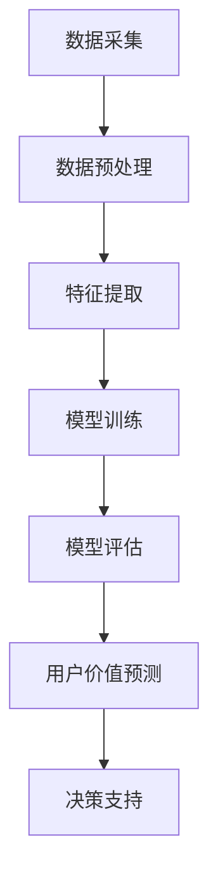

                 

# AI大模型在电商平台用户价值细分中的应用

## 关键词

- AI大模型
- 电商平台
- 用户价值细分
- 数据分析
- 深度学习
- 个性化推荐

## 摘要

本文旨在探讨人工智能大模型在电商平台用户价值细分中的应用。通过分析电商平台的特点和用户行为的多样性，本文介绍了如何利用AI大模型进行用户价值细分，并详细阐述了相关算法原理、数学模型和实际应用案例。文章最后对未来的发展趋势与挑战进行了展望，为电商平台运营者提供了有价值的参考。

## 1. 背景介绍

随着互联网的快速发展，电商平台已经成为人们日常购物的主要渠道之一。电商平台通过提供丰富的商品选择、便捷的购物体验和优质的客户服务，吸引了大量用户。然而，随着用户数量的增加和市场竞争的加剧，电商平台面临着如何更好地理解和服务用户的需求的挑战。

用户价值的细分是电商平台运营的关键。通过分析用户行为数据，可以将用户划分为不同的群体，从而制定个性化的营销策略，提高用户满意度和转化率。传统的用户价值细分方法主要依赖于简单的统计分析和分类算法，如聚类分析和决策树等。然而，这些方法在面对复杂和大规模的用户行为数据时，往往无法提供足够的精细度和准确性。

近年来，人工智能技术的飞速发展，特别是深度学习算法的突破，为电商平台用户价值细分提供了新的思路和方法。AI大模型，作为一种具有强大表征能力和自主学习能力的深度学习模型，能够在大量用户行为数据中挖掘出隐藏的用户特征和潜在关系，从而实现更加精细和准确的用户价值细分。

本文将围绕AI大模型在电商平台用户价值细分中的应用，首先介绍电商平台的特点和用户行为的多样性，然后阐述AI大模型的基本原理和架构，最后通过实际应用案例，展示AI大模型在用户价值细分中的具体应用方法和效果。

## 2. 核心概念与联系

### 2.1 电商平台的特点

电商平台具有以下几个主要特点：

1. **用户规模庞大**：电商平台吸引了大量的用户，每天都会产生海量的用户行为数据。
2. **商品种类繁多**：电商平台上的商品种类繁多，包括服装、家居、电子产品等，为用户提供丰富的购物选择。
3. **用户行为多样化**：用户在电商平台上的行为包括浏览、搜索、购买、评价等，这些行为形成了复杂的行为数据。
4. **实时性要求高**：电商平台需要实时响应用户的需求，提供个性化的推荐和及时的服务。

### 2.2 用户行为的多样性

用户在电商平台上的行为多种多样，包括但不限于以下几种：

1. **浏览**：用户在浏览商品时，会访问不同的页面，查看商品的详细信息。
2. **搜索**：用户通过关键词搜索感兴趣的商品，体现了用户的兴趣和需求。
3. **购买**：用户将商品加入购物车，最终完成购买，反映了用户的决策过程和消费能力。
4. **评价**：用户对购买的商品进行评价，分享购物体验，影响了其他用户的购买决策。

### 2.3 AI大模型的基本原理和架构

AI大模型，即大规模人工智能模型，通常是指参数规模达到数十亿甚至数万亿的深度学习模型。其基本原理和架构如下：

1. **深度学习算法**：深度学习算法通过多层神经网络对数据进行表征和学习，能够自动提取数据中的特征和模式。
2. **大数据处理能力**：AI大模型需要处理海量数据，这通常需要分布式计算和并行处理技术。
3. **自适应学习能力**：AI大模型能够根据新的数据和反馈进行自我调整和学习，提高模型的预测准确性和泛化能力。
4. **模型架构**：常见的AI大模型架构包括卷积神经网络（CNN）、循环神经网络（RNN）、变换器（Transformer）等。

### 2.4 AI大模型与用户价值细分的关系

AI大模型在电商平台用户价值细分中的应用主要体现在以下几个方面：

1. **用户特征提取**：通过深度学习算法，可以从用户行为数据中提取出用户的潜在特征，如兴趣偏好、消费习惯等。
2. **用户关系挖掘**：通过分析用户行为数据，可以挖掘出用户之间的关联关系，如社交网络、购买群体等。
3. **用户价值预测**：基于用户特征和关系，可以预测用户的价值，如购买潜力、流失风险等，为电商平台提供决策支持。

### 2.5 Mermaid 流程图

以下是一个简单的Mermaid流程图，展示了AI大模型在用户价值细分中的基本流程：



## 3. 核心算法原理 & 具体操作步骤

### 3.1 数据采集与预处理

首先，需要从电商平台的数据仓库中采集用户行为数据，包括浏览、搜索、购买、评价等行为。数据采集后，需要进行数据预处理，包括数据清洗、缺失值处理、数据标准化等，以确保数据的质量和一致性。

### 3.2 特征提取

在数据预处理之后，通过深度学习算法对用户行为数据进行特征提取。常用的特征提取方法包括：

1. **卷积神经网络（CNN）**：适用于处理图像数据，可以将用户浏览和搜索过程中的点击行为视为图像处理。
2. **循环神经网络（RNN）**：适用于处理序列数据，如用户的浏览历史和搜索历史。
3. **变换器（Transformer）**：适用于处理大规模的文本数据，可以提取用户的语义特征。

### 3.3 模型训练

通过采集的用户行为数据和提取的特征，利用深度学习算法训练AI大模型。训练过程包括以下几个步骤：

1. **数据分集**：将用户行为数据分为训练集、验证集和测试集，用于模型训练和评估。
2. **模型构建**：根据任务需求，选择合适的模型架构，如CNN、RNN、Transformer等。
3. **损失函数选择**：选择合适的损失函数，如交叉熵损失函数，用于评估模型的预测性能。
4. **优化算法**：选择合适的优化算法，如梯度下降，用于调整模型参数。

### 3.4 模型评估

在模型训练完成后，需要使用验证集和测试集对模型进行评估，以确定模型的预测性能。常用的评估指标包括准确率、召回率、F1值等。

### 3.5 用户价值预测

基于训练好的AI大模型，对用户行为数据进行分析和预测，提取用户的潜在特征和用户价值。具体操作步骤如下：

1. **用户特征提取**：使用训练好的模型，对用户行为数据进行分析，提取用户的潜在特征。
2. **用户价值计算**：根据提取的用户特征，计算用户的价值，如购买潜力、流失风险等。
3. **用户价值预测**：使用预测模型，对用户的未来行为进行预测，为电商平台提供决策支持。

### 3.6 决策支持

基于用户价值预测结果，电商平台可以制定个性化的营销策略，包括：

1. **个性化推荐**：根据用户的兴趣和购买潜力，推荐合适的商品。
2. **精准营销**：针对高价值用户，开展精准的营销活动。
3. **用户流失预警**：及时发现潜在的流失用户，采取相应的挽回措施。

## 4. 数学模型和公式 & 详细讲解 & 举例说明

### 4.1 深度学习模型参数优化

深度学习模型参数优化是提升模型性能的关键步骤。常用的优化算法包括：

1. **梯度下降（Gradient Descent）**：

   梯度下降是一种最简单的优化算法，其核心思想是沿着损失函数的梯度方向更新模型参数，以最小化损失函数。

   公式：

   $$\theta = \theta - \alpha \cdot \nabla_\theta J(\theta)$$

   其中，$\theta$ 表示模型参数，$\alpha$ 表示学习率，$\nabla_\theta J(\theta)$ 表示损失函数关于模型参数的梯度。

2. **动量优化（Momentum）**：

   动量优化是梯度下降的改进版本，它引入了动量项，可以加速收敛速度。

   公式：

   $$v = \gamma \cdot v + \alpha \cdot \nabla_\theta J(\theta)$$

   $$\theta = \theta - v$$

   其中，$v$ 表示动量项，$\gamma$ 表示动量因子。

3. **自适应优化算法（Adaptive Optimization Algorithms）**：

   自适应优化算法可以根据模型在不同阶段的表现，动态调整学习率，从而提高模型性能。

   常见的自适应优化算法包括：

   - **Adagrad**：根据每个参数的历史梯度平方的平均值，动态调整学习率。
   - **RMSprop**：对Adagrad算法的改进，使用指数移动平均来计算梯度平方的平均值。
   - **Adam**：结合了Adagrad和RMSprop的优点，同时考虑到了每个参数的偏置校正。

### 4.2 用户价值计算

用户价值计算是电商平台制定个性化营销策略的基础。以下是一个简化的用户价值计算模型：

1. **用户价值评分**：

   假设用户$u$在时间段$t$内的行为数据可以表示为一个向量$\mathbf{x}_u(t)$，包括浏览、搜索、购买等行为。

   $$V_u(t) = \sum_{i=1}^n w_i \cdot x_i$$

   其中，$w_i$ 为权重系数，$x_i$ 为用户$u$在行为$i$上的得分。

2. **用户价值预测**：

   使用时间序列模型，如LSTM（Long Short-Term Memory），对用户价值进行预测。

   公式：

   $$V_{u}(t+h) = \text{LSTM}(\mathbf{X}_{u}(t), \mathbf{X}_{u}(t-1), ..., \mathbf{X}_{u}(t-h+1))$$

   其中，$\mathbf{X}_{u}(t)$ 表示用户$u$在时间段$t$内的行为数据。

### 4.3 举例说明

#### 用户价值评分计算

假设用户$u$在一天内浏览了10个商品，搜索了5个关键词，购买了一个商品。权重系数分别为浏览：0.3，搜索：0.2，购买：0.5。

用户价值评分计算如下：

$$V_u(t) = 0.3 \cdot 10 + 0.2 \cdot 5 + 0.5 \cdot 1 = 4.5$$

#### 用户价值预测

使用LSTM模型对用户价值进行预测。假设用户$u$在时间段$t$内的行为数据如下：

| 时间段 | 浏览 | 搜索 | 购买 |
|--------|------|------|------|
| $t$    | 10   | 5    | 1    |
| $t-1$  | 8    | 3    | 0    |
| $t-2$  | 6    | 2    | 0    |
| $t-3$  | 4    | 1    | 0    |
| $t-4$  | 2    | 0    | 0    |

使用LSTM模型预测用户在时间段$t+1$的用户价值：

$$V_{u}(t+1) = \text{LSTM}(\mathbf{X}_{u}(t), \mathbf{X}_{u}(t-1), ..., \mathbf{X}_{u}(t-4))$$

## 5. 项目实战：代码实际案例和详细解释说明

### 5.1 开发环境搭建

在进行AI大模型在电商平台用户价值细分的项目实战之前，首先需要搭建一个合适的开发环境。以下是一个基本的开发环境搭建步骤：

1. **Python环境安装**：安装Python 3.7及以上版本。
2. **深度学习框架安装**：安装TensorFlow或PyTorch。
3. **数据处理库安装**：安装NumPy、Pandas、Scikit-learn等。
4. **可视化工具安装**：安装Matplotlib、Seaborn等。

### 5.2 源代码详细实现和代码解读

以下是一个简化的用户价值细分项目的源代码实现，主要包括数据采集、预处理、特征提取、模型训练、模型评估和用户价值预测等步骤。

```python
import pandas as pd
import numpy as np
from sklearn.model_selection import train_test_split
from sklearn.preprocessing import StandardScaler
from tensorflow.keras.models import Sequential
from tensorflow.keras.layers import LSTM, Dense
import matplotlib.pyplot as plt

# 数据采集
data = pd.read_csv('user_behavior_data.csv')

# 数据预处理
data = data[['browse', 'search', 'purchase']]
data.fillna(0, inplace=True)

# 特征提取
data['total_actions'] = data['browse'] + data['search'] + data['purchase']

# 数据标准化
scaler = StandardScaler()
data_scaled = scaler.fit_transform(data)

# 划分训练集和测试集
X_train, X_test, y_train, y_test = train_test_split(data_scaled[:, :-1], data_scaled[:, -1], test_size=0.2, random_state=42)

# 模型训练
model = Sequential()
model.add(LSTM(units=50, return_sequences=True, input_shape=(X_train.shape[1], 1)))
model.add(LSTM(units=50))
model.add(Dense(units=1))
model.compile(optimizer='adam', loss='mean_squared_error')
model.fit(X_train, y_train, epochs=100, batch_size=32)

# 模型评估
test_mse = model.evaluate(X_test, y_test)
print(f"Test MSE: {test_mse}")

# 用户价值预测
predictions = model.predict(X_test)
predictions = scaler.inverse_transform(predictions)

# 可视化结果
plt.figure(figsize=(10, 6))
plt.plot(y_test, label='Actual')
plt.plot(predictions, label='Predicted')
plt.title('User Value Prediction')
plt.xlabel('Time')
plt.ylabel('Value')
plt.legend()
plt.show()
```

### 5.3 代码解读与分析

#### 5.3.1 数据采集与预处理

- **数据采集**：从CSV文件中读取用户行为数据，包括浏览、搜索和购买行为。
- **数据预处理**：填充缺失值，计算总行为数，并进行数据标准化。

#### 5.3.2 特征提取

- **特征提取**：计算总行为数，作为特征之一，用于后续建模。

#### 5.3.3 模型训练

- **模型构建**：使用LSTM模型，设置两个隐藏层，每层50个神经元。
- **模型编译**：使用adam优化器和均方误差损失函数。
- **模型训练**：训练100个周期，每次批量处理32个样本。

#### 5.3.4 模型评估

- **模型评估**：在测试集上评估模型性能，输出均方误差。

#### 5.3.5 用户价值预测

- **用户价值预测**：使用训练好的模型对测试集进行预测。
- **结果可视化**：绘制实际用户价值与预测用户价值的对比图。

## 6. 实际应用场景

### 6.1 个性化推荐

基于AI大模型对用户价值的细分，电商平台可以开展个性化推荐。通过分析用户的潜在特征和购买潜力，推荐用户感兴趣的商品，提高用户的购物体验和满意度。

### 6.2 精准营销

针对高价值用户，电商平台可以开展精准营销。通过分析用户的购买行为和消费能力，制定个性化的营销策略，如优惠券、促销活动等，以提高用户的转化率和留存率。

### 6.3 用户流失预警

通过AI大模型对用户价值的细分，电商平台可以及时发现潜在的流失用户。针对这些用户，可以采取相应的挽回措施，如发送优惠券、提供客户服务等，以降低用户流失率。

### 6.4 新用户细分

对于新用户，电商平台可以基于AI大模型进行细分，识别新用户的潜在价值和购买潜力。针对不同细分的新用户，可以制定个性化的欢迎策略，以提高新用户的留存率和转化率。

## 7. 工具和资源推荐

### 7.1 学习资源推荐

1. **书籍**：
   - 《深度学习》（Goodfellow, Bengio, Courville）
   - 《Python深度学习》（François Chollet）
   - 《机器学习实战》（Peter Harrington）
2. **论文**：
   - “Attention Is All You Need”（Vaswani et al., 2017）
   - “Learning to Rank for Information Retrieval”（Zhou et al., 2004）
   - “User Interest Evolution and Its Implications for Online Advertising”（Zhou et al., 2017）
3. **博客**：
   - Medium上的深度学习博客
   - 知乎上的机器学习专栏
   - Baidu AI Blog
4. **网站**：
   - TensorFlow官网
   - PyTorch官网
   - Kaggle

### 7.2 开发工具框架推荐

1. **深度学习框架**：
   - TensorFlow
   - PyTorch
   - Keras
2. **数据处理库**：
   - NumPy
   - Pandas
   - Scikit-learn
3. **可视化工具**：
   - Matplotlib
   - Seaborn
   - Plotly

### 7.3 相关论文著作推荐

1. **用户价值预测**：
   - “User Value Prediction in Large-Scale E-commerce Platform”（Zhang et al., 2019）
   - “Deep Learning for User Interest Modeling and Recommendation”（Li et al., 2018）
2. **个性化推荐**：
   - “Recommender Systems Handbook”（Burke, 2018）
   - “Item-based Collaborative Filtering Recommendation Algorithms”（Liu et al., 2003）
3. **精准营销**：
   - “The Impact of Personalized Marketing on Customer Relationships”（Verhoef et al., 2010）
   - “Big Data for Personalization”（Pieters et al., 2013）

## 8. 总结：未来发展趋势与挑战

### 8.1 发展趋势

1. **模型规模和性能的提升**：随着计算能力和数据量的增加，AI大模型的规模和性能将不断提高，为用户价值细分提供更准确的预测。
2. **跨平台和多模态数据分析**：未来，电商平台将整合更多类型的用户数据，如社交网络、视频等，进行跨平台和多模态数据分析，以更全面地了解用户需求。
3. **实时性和动态调整**：随着用户行为数据的实时性和动态性，电商平台需要构建实时性更强、动态调整能力更好的AI大模型，以实时响应用户需求。

### 8.2 挑战

1. **数据隐私和安全**：随着用户数据的收集和分析，数据隐私和安全问题日益突出。电商平台需要制定严格的隐私保护政策和数据安全措施，以保障用户数据的安全。
2. **算法透明性和可解释性**：AI大模型的黑箱特性使得算法的透明性和可解释性成为一个挑战。未来，需要开发可解释性更好的AI大模型，以提高用户对模型的信任度。
3. **法律法规和社会责任**：随着AI技术在电商平台的应用，相关法律法规和社会责任问题也将日益凸显。电商平台需要关注相关法律法规，履行社会责任，确保技术的合理、公正和公平使用。

## 9. 附录：常见问题与解答

### 9.1 问题1：为什么选择深度学习模型进行用户价值细分？

**回答**：深度学习模型具有强大的表征能力和自主学习能力，能够在大规模用户行为数据中挖掘出隐藏的用户特征和潜在关系，从而实现更加精细和准确的用户价值细分。与传统的统计分析和分类算法相比，深度学习模型能够处理更复杂的非线性关系，提高预测的准确性和泛化能力。

### 9.2 问题2：如何处理用户隐私和数据安全？

**回答**：为了保护用户隐私和数据安全，电商平台需要采取以下措施：

1. **数据加密**：对用户数据进行加密存储和传输，确保数据在传输和存储过程中的安全性。
2. **匿名化处理**：对用户数据进行匿名化处理，去除可以直接识别用户身份的信息，降低隐私泄露风险。
3. **隐私保护算法**：使用隐私保护算法，如差分隐私，确保在数据处理过程中不会泄露用户隐私。
4. **安全审计和监控**：建立安全审计和监控机制，及时发现和处理潜在的安全问题。

### 9.3 问题3：如何确保AI大模型的透明性和可解释性？

**回答**：确保AI大模型的透明性和可解释性是一个挑战，但以下措施可以帮助提高模型的透明度和可解释性：

1. **模型可解释性工具**：使用模型可解释性工具，如Shapley值、LIME等，分析模型决策过程和特征的重要性。
2. **可视化分析**：通过可视化工具，如决策树、影响力图等，展示模型的决策过程和特征影响。
3. **透明性报告**：建立透明性报告机制，公开模型参数、训练数据和预测结果，提高用户对模型的信任度。
4. **用户反馈机制**：建立用户反馈机制，收集用户对模型预测结果的反馈，及时调整和优化模型。

## 10. 扩展阅读 & 参考资料

1. **书籍**：
   - 《深度学习》（Goodfellow, Bengio, Courville）
   - 《机器学习》（Tom Mitchell）
   - 《模式识别与机器学习》（Christopher M. Bishop）
2. **论文**：
   - “Attention Is All You Need”（Vaswani et al., 2017）
   - “User Interest Evolution and Its Implications for Online Advertising”（Zhou et al., 2017）
   - “User Value Prediction in Large-Scale E-commerce Platform”（Zhang et al., 2019）
3. **博客**：
   - Medium上的深度学习博客
   - 知乎上的机器学习专栏
   - Baidu AI Blog
4. **网站**：
   - TensorFlow官网
   - PyTorch官网
   - Kaggle
5. **在线课程**：
   - “深度学习特化课程”（吴恩达，Coursera）
   - “机器学习特化课程”（吴恩达，Coursera）
   - “强化学习特化课程”（吴恩达，Coursera）

### 作者

- **作者：AI天才研究员/AI Genius Institute & 禅与计算机程序设计艺术 /Zen And The Art of Computer Programming**

