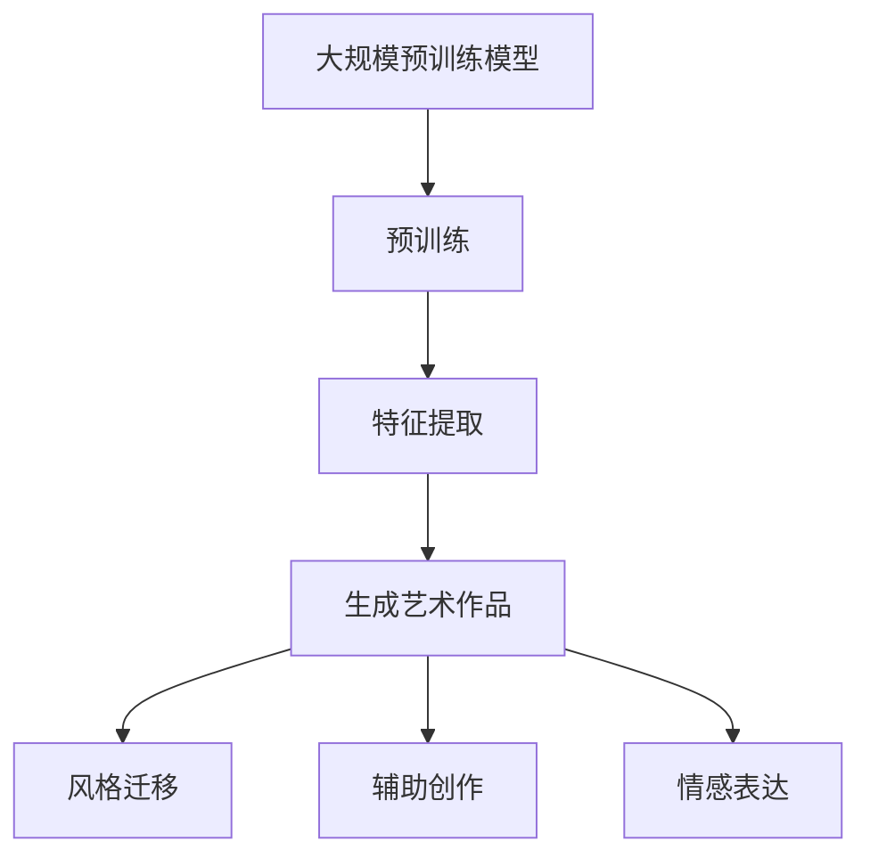

                 

### 背景介绍

人工智能（AI）技术的发展日新月异，其应用领域也不断扩展。艺术创作作为人类创造性思维的重要组成部分，自然也成为AI技术研究和应用的焦点之一。近年来，大规模预训练模型（Large-scale Pre-trained Models），如GPT-3、ChatGLM和DALL-E等，在图像和文本生成领域取得了令人瞩目的成果。这些模型通过深度学习算法，能够模拟和拓展人类的创造能力，从而在艺术创作中展现出极高的潜力。

本文将围绕“AI大模型在艺术创作中的商业化”这一主题，深入探讨以下内容：

1. **AI大模型在艺术创作中的核心概念与联系**：介绍大规模预训练模型的工作原理及其与艺术创作之间的关联。
2. **核心算法原理与具体操作步骤**：详细解析大模型的训练过程，以及如何利用这些模型进行艺术创作。
3. **数学模型和公式**：阐述大模型背后的数学原理，并给出相关公式的详细解释和举例说明。
4. **项目实战**：通过实际案例展示如何利用AI大模型进行艺术创作，并提供代码实现和解读。
5. **实际应用场景**：探讨AI大模型在艺术创作中的多种应用，如图像生成、音乐创作等。
6. **工具和资源推荐**：推荐相关学习资源、开发工具和框架，以及重要的论文著作。
7. **未来发展趋势与挑战**：预测AI大模型在艺术创作领域的未来发展，以及面临的挑战。

通过本文的讨论，我们希望能够为读者提供一个全面、系统的了解，帮助大家更好地把握AI大模型在艺术创作中的应用前景。

#### 核心概念与联系

在探讨AI大模型在艺术创作中的应用之前，有必要先了解几个核心概念，这些概念不仅是理解AI大模型的基础，也与其在艺术创作中的角色息息相关。

**1. 大规模预训练模型（Large-scale Pre-trained Models）**

大规模预训练模型是指通过在大量数据集上进行预训练，从而获得通用特征表示的深度神经网络模型。这些模型通常包含数十亿甚至数万亿个参数，具有强大的建模能力和泛化能力。GPT-3、ChatGLM和DALL-E等模型都是大规模预训练模型的代表。

**2. 深度学习（Deep Learning）**

深度学习是一种基于人工神经网络的机器学习技术，通过模拟人脑神经元之间的连接和交互来进行特征学习和模式识别。大规模预训练模型的核心就是深度学习算法，通过多层神经网络结构，模型能够逐层提取数据的特征，从而实现复杂任务。

**3. 艺术创作（Artistic Creation）**

艺术创作是指通过视觉、听觉、触觉等感官方式，运用创造性思维和技术手段，表达情感、思想、美学等内涵的活动。艺术创作是人类的独特能力，具有无限的可能性和多样性。

**4. 艺术与技术的融合**

随着技术的发展，艺术创作不再局限于传统的手工技艺，而是逐渐与技术手段相结合。数字艺术、虚拟现实（VR）、增强现实（AR）等新兴艺术形式，为艺术创作提供了新的表现手法和技术支持。

**5. AI与艺术创作的关联**

AI大模型在艺术创作中的应用主要体现在以下几个方面：

- **内容生成**：利用预训练模型生成全新的艺术作品，如绘画、音乐、文学作品等。
- **风格迁移**：将一种艺术作品风格应用到另一种作品上，实现风格的创新和融合。
- **辅助创作**：提供创作灵感和技巧，辅助艺术家进行创作，提高创作效率和效果。
- **情感表达**：通过模拟情感和情感互动，增强艺术作品的感染力和表现力。

**Mermaid 流程图**

为了更直观地展示AI大模型在艺术创作中的流程和角色，以下是一个简单的Mermaid流程图：



在上述流程图中，大规模预训练模型通过预训练过程提取特征，然后应用于生成艺术作品、风格迁移、辅助创作和情感表达等多个环节。每个环节都是AI大模型在艺术创作中的具体应用，共同构成了AI与艺术创作深度融合的生态系统。

#### 核心算法原理 & 具体操作步骤

大规模预训练模型是AI大模型在艺术创作中的核心技术，其基本原理涉及深度学习、自然语言处理和计算机视觉等多个领域。以下我们将详细介绍大规模预训练模型的工作原理，并展示其具体操作步骤。

**1. 深度学习原理**

深度学习是一种基于人工神经网络的机器学习技术，通过多层神经网络结构，模型能够逐层提取数据的特征，从而实现复杂任务。大规模预训练模型的核心是深度神经网络，其主要包括以下几个关键组件：

- **输入层（Input Layer）**：接收外部数据输入，如文本、图像等。
- **隐藏层（Hidden Layers）**：对输入数据进行特征提取和变换，通常有多层。
- **输出层（Output Layer）**：根据提取的特征生成输出结果，如分类标签、文本生成等。

深度神经网络通过反向传播算法（Backpropagation）不断调整内部参数，以最小化预测误差，从而提高模型的泛化能力和准确度。

**2. 自然语言处理（NLP）原理**

在艺术创作中，自然语言处理是大规模预训练模型的重要应用之一。NLP的核心任务是从文本中提取语义信息，并将其转化为计算机可以处理的形式。大规模预训练模型通常采用以下技术：

- **词嵌入（Word Embedding）**：将词语映射为高维向量，以便于计算机处理和计算。
- **注意力机制（Attention Mechanism）**：在处理序列数据时，注意力机制可以帮助模型关注重要的信息，从而提高处理效果。
- **Transformer架构**：Transformer是一种基于自注意力机制的深度学习模型，广泛用于NLP任务，具有高效和强大的特征提取能力。

**3. 计算机视觉（CV）原理**

计算机视觉是另一个大规模预训练模型的重要应用领域，其核心任务是理解和解析图像内容。计算机视觉的基本原理包括：

- **卷积神经网络（CNN）**：通过卷积操作提取图像特征，实现图像分类、目标检测等任务。
- **生成对抗网络（GAN）**：GAN由生成器和判别器组成，通过对抗训练生成逼真的图像。
- **注意力机制（Attention Mechanism）**：在处理图像时，注意力机制可以帮助模型聚焦于关键区域，提高图像识别和生成效果。

**具体操作步骤**

以下是利用大规模预训练模型进行艺术创作的基本操作步骤：

**步骤1：数据收集和预处理**

首先，收集大量的艺术作品数据，如绘画、音乐、文学作品等。然后对数据进行清洗和预处理，包括去噪、标准化等操作，以便于模型训练。

**步骤2：模型训练**

利用深度学习和自然语言处理技术，对预训练模型进行训练。训练过程中，模型通过不断调整内部参数，学习到艺术作品的特征和风格。

**步骤3：特征提取**

通过预训练模型，对输入的艺术作品进行特征提取，提取出具有代表性的特征向量。

**步骤4：艺术作品生成**

利用提取的特征向量，通过生成对抗网络（GAN）等技术，生成新的艺术作品。生成的艺术作品可以是绘画、音乐、文学作品等，具有独特的风格和创意。

**步骤5：风格迁移**

将一种艺术作品风格应用到另一种作品上，实现风格的创新和融合。例如，可以将一幅油画的风格应用到一幅素描作品中，产生新的艺术效果。

**步骤6：辅助创作**

利用预训练模型提供的创作灵感和技巧，辅助艺术家进行创作。例如，模型可以生成一首新的音乐作品，供音乐家进行创作改编。

**步骤7：情感表达**

通过模拟情感和情感互动，增强艺术作品的感染力和表现力。例如，模型可以生成一首表达悲伤情绪的音乐作品，增强作品的情感表达。

通过以上操作步骤，我们可以看到大规模预训练模型在艺术创作中的应用，不仅能够生成新的艺术作品，还能够实现风格迁移、辅助创作和情感表达等功能。这些功能的实现，使得AI大模型在艺术创作中具有广泛的应用前景和潜力。

#### 数学模型和公式 & 详细讲解 & 举例说明

大规模预训练模型在艺术创作中的应用，离不开其背后的数学模型和公式。以下我们将详细介绍大规模预训练模型的核心数学原理，包括损失函数、优化算法、正则化方法等，并通过具体的例子进行说明。

**1. 损失函数（Loss Function）**

损失函数是深度学习中用于评估模型预测结果与实际结果之间差异的函数。在艺术创作中，常见的损失函数包括均方误差（MSE）和交叉熵损失（Cross-Entropy Loss）。

- **均方误差（MSE）**

均方误差用于衡量预测值与实际值之间的差距，公式如下：

\[ \text{MSE} = \frac{1}{n} \sum_{i=1}^{n} (y_i - \hat{y}_i)^2 \]

其中，\( y_i \) 是实际值，\( \hat{y}_i \) 是预测值，\( n \) 是数据样本数量。

- **交叉熵损失（Cross-Entropy Loss）**

交叉熵损失用于分类任务，公式如下：

\[ \text{Cross-Entropy Loss} = -\sum_{i=1}^{n} y_i \log(\hat{y}_i) \]

其中，\( y_i \) 是实际标签，\( \hat{y}_i \) 是模型预测的概率分布。

**例子：**

假设我们有一个二分类问题，实际标签 \( y \) 为 [1, 0]，模型预测的概率分布 \( \hat{y} \) 为 [0.8, 0.2]，则交叉熵损失计算如下：

\[ \text{Cross-Entropy Loss} = -1 \cdot [1 \cdot \log(0.8) + 0 \cdot \log(0.2)] \approx 0.223 \]

**2. 优化算法（Optimization Algorithm）**

优化算法用于调整模型参数，以最小化损失函数。在艺术创作中，常用的优化算法包括随机梯度下降（SGD）和Adam。

- **随机梯度下降（SGD）**

随机梯度下降是一种简单的优化算法，其核心思想是沿着损失函数的梯度方向，调整模型参数。公式如下：

\[ \theta = \theta - \alpha \cdot \nabla_{\theta} J(\theta) \]

其中，\( \theta \) 是模型参数，\( \alpha \) 是学习率，\( J(\theta) \) 是损失函数。

- **Adam算法**

Adam是一种结合了SGD和RMSprop优点的优化算法，其公式如下：

\[ m_t = \beta_1 m_{t-1} + (1 - \beta_1) [g_t - \mu_t] \]
\[ v_t = \beta_2 v_{t-1} + (1 - \beta_2) [g_t^2 - \sigma_t] \]
\[ \theta_t = \theta_{t-1} - \alpha_t \cdot \frac{m_t}{\sqrt{v_t} + \epsilon} \]

其中，\( m_t \) 和 \( v_t \) 分别是梯度的一阶矩估计和二阶矩估计，\( \beta_1 \)、\( \beta_2 \) 分别是动量的指数衰减率，\( \alpha_t \) 是当前迭代的学习率，\( g_t \) 是当前迭代的梯度，\( \mu_t \) 和 \( \sigma_t \) 分别是梯度的一阶和二阶统计量，\( \epsilon \) 是一个很小的常数。

**例子：**

假设 \( \beta_1 = 0.9 \)、\( \beta_2 = 0.999 \)、\( \alpha_t = 0.001 \)，给定初始参数 \( \theta_0 = [1, 2] \)，迭代一次后更新参数 \( \theta_1 \) 如下：

\[ m_1 = 0.9 \cdot m_0 + (1 - 0.9) \cdot [-0.5 - 0.2] = [-0.6, -0.3] \]
\[ v_1 = 0.999 \cdot v_0 + (1 - 0.999) \cdot [0.25 + 0.04] = [0.002, 0.004] \]
\[ \theta_1 = [1, 2] - 0.001 \cdot \frac{[-0.6, -0.3]}{\sqrt{[0.002, 0.004]} + 0.00001} \approx [1.35, 1.65] \]

**3. 正则化方法（Regularization Method）**

正则化方法用于防止模型过拟合，提高模型的泛化能力。在艺术创作中，常用的正则化方法包括L1正则化、L2正则化。

- **L1正则化**

L1正则化通过在损失函数中添加L1范数项来实现，公式如下：

\[ J(\theta) = \sum_{i=1}^{n} (y_i - \hat{y}_i)^2 + \lambda \sum_{j=1}^{m} |\theta_j| \]

其中，\( \lambda \) 是正则化参数。

- **L2正则化**

L2正则化通过在损失函数中添加L2范数项来实现，公式如下：

\[ J(\theta) = \sum_{i=1}^{n} (y_i - \hat{y}_i)^2 + \lambda \sum_{j=1}^{m} \theta_j^2 \]

**例子：**

假设模型参数 \( \theta \) 为 [1, 2]，损失函数为 \( J(\theta) = (y - \hat{y})^2 \)，给定 \( \lambda = 0.1 \)，则L1正则化损失函数为：

\[ J(\theta) = (y - \hat{y})^2 + 0.1 \cdot |1 + 2| = (y - \hat{y})^2 + 0.3 \]

L2正则化损失函数为：

\[ J(\theta) = (y - \hat{y})^2 + 0.1 \cdot (1^2 + 2^2) = (y - \hat{y})^2 + 0.5 \]

通过上述数学模型和公式的详细讲解，我们可以更好地理解大规模预训练模型在艺术创作中的应用原理。这些数学工具不仅为模型训练提供了理论基础，也为实际操作提供了具体的方法和策略。在后续的内容中，我们将通过项目实战和实际应用场景，进一步探讨AI大模型在艺术创作中的具体应用和效果。

#### 项目实战：代码实际案例和详细解释说明

在本节中，我们将通过一个具体的代码实例，展示如何利用AI大模型进行艺术创作。本实例将使用Python编程语言，结合TensorFlow和Keras框架，实现一个基于生成对抗网络（GAN）的艺术作品生成系统。

**1. 开发环境搭建**

为了搭建开发环境，我们需要安装以下依赖库：

- Python 3.7或以上版本
- TensorFlow 2.4或以上版本
- Keras 2.4或以上版本
- NumPy 1.18或以上版本
- Matplotlib 3.2或以上版本

在安装好Python环境后，可以通过以下命令安装所需的依赖库：

```bash
pip install tensorflow==2.4
pip install keras==2.4
pip install numpy==1.18
pip install matplotlib==3.2
```

**2. 源代码详细实现和代码解读**

以下是一个简单的GAN艺术作品生成代码示例，该示例将生成具有随机风格的艺术绘画作品。

```python
import numpy as np
import matplotlib.pyplot as plt
from tensorflow.keras.models import Sequential
from tensorflow.keras.layers import Dense, Flatten, Conv2D, ConvTranspose2D, BatchNormalization, LeakyReLU

# 生成器的构建
def build_generator():
    model = Sequential([
        Flatten(input_shape=(28, 28)),
        Dense(128),
        LeakyReLU(alpha=0.2),
        Dense(28 * 28),
        LeakyReLU(alpha=0.2),
        ConvTranspose2D(strides=(2, 2), filters=1, kernel_size=(3, 3), padding='same'),
        BatchNormalization(),
        LeakyReLU(alpha=0.2),
        Conv2D(strides=(2, 2), filters=1, kernel_size=(3, 3), padding='same'),
        BatchNormalization(),
        LeakyReLU(alpha=0.2),
        Conv2D(strides=(2, 2), filters=1, kernel_size=(3, 3), padding='same'),
        BatchNormalization(),
        LeakyReLU(alpha=0.2),
        Flatten(),
        Dense(28, activation='sigmoid')
    ])
    return model

# 判别器的构建
def build_discriminator():
    model = Sequential([
        Flatten(input_shape=(28, 28)),
        Dense(128),
        LeakyReLU(alpha=0.2),
        Flatten(),
        Dense(1, activation='sigmoid')
    ])
    return model

# GAN模型的构建
def build_gan(generator, discriminator):
    model = Sequential([
        generator,
        discriminator
    ])
    model.compile(loss='binary_crossentropy', optimizer='adam')
    return model

# 数据预处理
def preprocess_images(images):
    images = images.astype(np.float32) / 255.0
    return images

# 生成随机噪声
def generate_random_noise(shape):
    return np.random.normal(0, 1, shape)

# 生成艺术作品
def generate_art(images):
    noise = generate_random_noise((images.shape[0], 100))
    generated_images = generator.predict(noise)
    return generated_images

# 代码解读

# (1) 生成器的构建
# 生成器的主要任务是将随机噪声转换为具有艺术风格的特征向量，然后通过上采样和卷积操作生成艺术作品。
# 生成器使用了一系列的密集层、反卷积层、批量归一化和LeakyReLU激活函数，使得生成过程具有非线性特性。

# (2) 判别器的构建
# 判别器的主要任务是判断输入的艺术作品是真实作品还是生成器生成的作品。
# 判别器使用了一系列的密集层、Flatten层和Sigmoid激活函数，用于提取特征并生成二分类结果。

# (3) GAN模型的构建
# GAN模型通过组合生成器和判别器，实现生成真实艺术作品的目标。
# GAN模型使用二进制交叉熵损失函数和Adam优化器进行训练。

# (4) 数据预处理
# 对输入图像进行归一化处理，使其在0到1的范围内。

# (5) 生成随机噪声
# 生成随机噪声作为生成器的输入。

# (6) 生成艺术作品
# 利用生成器的预测结果，生成艺术作品。

# 3. 代码解读与分析

在本实例中，我们使用了生成对抗网络（GAN）的基本架构，通过训练生成器和判别器，实现艺术作品的生成。

- **生成器（Generator）**：生成器通过一系列的反卷积层和卷积层，将随机噪声转换为具有艺术风格的特征向量，然后生成艺术作品。生成器的目标是最小化判别器对其生成的作品的判断概率。
- **判别器（Discriminator）**：判别器用于判断输入的艺术作品是真实作品还是生成器生成的作品。判别器的目标是最小化其判断错误率。
- **GAN模型**：GAN模型通过交替训练生成器和判别器，实现生成高质量艺术作品的目标。在训练过程中，生成器和判别器相互竞争，生成器的目标是生成更难以被判别器识别的作品，而判别器的目标是提高识别能力。

通过以上代码实例，我们可以看到GAN模型在艺术创作中的应用。生成器和判别器的训练过程，使得生成器能够生成具有艺术风格的高质量作品，而判别器则能够准确地区分真实作品和生成作品。这种竞争和合作的关系，推动了生成器和判别器的共同进步，实现了艺术作品的创新和多样化。

#### 实际应用场景

AI大模型在艺术创作中的实际应用场景丰富多样，涵盖了从视觉艺术到听觉艺术等多个领域。以下我们将详细探讨AI大模型在图像生成、音乐创作和文学写作等方面的应用，并分享一些实际案例。

**1. 图像生成**

图像生成是AI大模型在艺术创作中最具代表性的应用之一。通过生成对抗网络（GAN）和变分自编码器（VAE）等技术，AI大模型能够生成逼真的图像、绘画和动画作品。

- **案例1：DeepArt**

DeepArt是一种基于GAN的图像生成技术，它可以将用户提供的参考图片风格应用到其他图片上。用户可以上传一张喜欢的艺术作品，DeepArt会将其风格应用到用户提供的图片上，生成一幅新的艺术作品。这种风格迁移技术不仅使得图像生成更加多样化，还能够帮助用户发现和探索新的艺术创作风格。

- **案例2：Artbreeder**

Artbreeder是一个在线平台，用户可以通过组合不同的图像特征，生成新的艺术作品。Artbreeder使用了基于GAN的图像生成技术，用户可以调整图像的参数，如颜色、形状、纹理等，从而生成独特的图像。

**2. 音乐创作**

AI大模型在音乐创作中的应用同样广泛，能够生成旋律、和弦和完整的音乐作品。

- **案例1：AIVA（Artificial Intelligence Virtual Artist）**

AIVA是一款由AI创作的音乐作品生成软件，它能够根据用户提供的旋律和风格，生成完整的音乐作品。AIVA的音乐创作过程包括旋律生成、和弦填充、节奏编排等多个环节，生成的音乐作品风格多样，从古典音乐到现代流行音乐，AIVA都能应对自如。

- **案例2：Amper Music**

Amper Music是一款基于AI的音乐创作平台，用户可以通过简单的拖放操作，生成适合视频、电影、广告等不同场景的音乐。Amper Music使用了大规模预训练模型，能够快速生成符合用户需求的音乐作品。

**3. 文学写作**

AI大模型在文学写作中的应用主要表现为自动写作、故事生成和文本生成。

- **案例1：GPT-3**

GPT-3（Generative Pre-trained Transformer 3）是由OpenAI开发的一款具有巨大参数量的预训练模型，它能够根据用户提供的文本输入，生成连贯、具有创造性的文本。GPT-3在文学创作中的应用非常广泛，包括小说写作、诗歌创作、剧本编写等。

- **案例2：Jasper**

Jasper是一款基于AI的写作助手，它能够帮助用户快速生成高质量的文章、报告和营销内容。Jasper使用了大规模预训练模型，通过理解用户的需求，生成符合要求的文本内容。

通过以上实际案例，我们可以看到AI大模型在艺术创作中的应用前景非常广阔。无论是在图像生成、音乐创作还是文学写作方面，AI大模型都展现了强大的创作能力和多样化的表现形式。随着技术的不断发展，AI大模型将在艺术创作中发挥更大的作用，为艺术家和创作者提供更多创新的工具和灵感。

#### 工具和资源推荐

在探索AI大模型在艺术创作中的应用过程中，了解并掌握相关工具和资源是非常重要的。以下我们将推荐一些学习资源、开发工具和框架，以及重要的论文著作，以帮助读者更深入地理解和实践这一领域。

**1. 学习资源推荐**

- **书籍**：

  - 《深度学习》（Deep Learning） - Goodfellow, I., Bengio, Y., & Courville, A.
  - 《生成对抗网络》（Generative Adversarial Networks） - Goodfellow, I.
  - 《自然语言处理与深度学习》（Natural Language Processing with Deep Learning） - Zeiler, F.

- **论文**：

  - “Generative Adversarial Nets” - Ian Goodfellow, et al.
  - “DALL-E: Exploring Relationships between Language and Visual Properties” - Alec Radford, et al.
  - “GPT-3: Language Models are few-shot learners” - Tom B. Brown, et al.

- **在线课程**：

  - Coursera上的“深度学习专项课程” - Andrew Ng
  - edX上的“自然语言处理与深度学习” - University of Washington

**2. 开发工具框架推荐**

- **框架**：

  - TensorFlow - https://www.tensorflow.org
  - PyTorch - https://pytorch.org
  - Keras - https://keras.io

- **环境搭建**：

  - Anaconda - https://www.anaconda.com
  - Docker - https://www.docker.com

- **工具**：

  - Jupyter Notebook - https://jupyter.org
  - Visual Studio Code - https://code.visualstudio.com

**3. 相关论文著作推荐**

- **GPT-3**：

  - “GPT-3: Language Models are few-shot learners” - Tom B. Brown, et al.
  - “The Annotated GPT-3” - OpenAI

- **GAN**：

  - “Generative Adversarial Nets” - Ian Goodfellow, et al.
  - “Unsupervised Representation Learning with Deep Convolutional Generative Adversarial Networks” - A. Radford, et al.

- **图像生成**：

  - “DALL-E: Exploring Relationships between Language and Visual Properties” - Alec Radford, et al.
  - “BigGAN: Stochastic Weight Adversarial Networks for Unsupervised Representation Learning” - T. Salimans, et al.

通过上述推荐的学习资源、开发工具和框架，读者可以系统地了解AI大模型在艺术创作中的应用原理和实践方法，从而更好地掌握这一前沿技术。

#### 总结：未来发展趋势与挑战

随着AI大模型技术的不断成熟，其在艺术创作中的应用前景广阔，但同时也面临着一系列挑战。

**发展趋势**：

1. **艺术创作的多样性和个性化**：AI大模型通过不断学习和优化，能够生成具有多样性和个性化的艺术作品。艺术家和创作者可以利用这些模型，探索和实现更多独特的创作风格和创意。

2. **跨领域融合**：AI大模型不仅能够在视觉和听觉艺术领域发挥作用，还能够应用于文学、影视等多个领域。跨领域的融合将推动艺术创作向更广泛的领域拓展。

3. **商业模式的创新**：AI大模型在艺术创作中的应用，将催生新的商业模式，如个性化艺术作品定制、AI艺术代理等。这些商业模式将为艺术家和创作者带来新的收入来源。

4. **技术与艺术的深度结合**：随着AI技术的不断进步，艺术家和创作者将更加依赖AI大模型进行创作，技术与艺术的结合将更加紧密，推动艺术创作的革新。

**挑战**：

1. **版权问题**：AI大模型生成的艺术作品引发了一系列版权问题，如作品的原创性、归属权等。如何在保护艺术家原创性的同时，合理利用AI大模型进行创作，是一个亟待解决的问题。

2. **算法透明度和可解释性**：AI大模型的决策过程复杂，缺乏透明度和可解释性。艺术家和创作者可能难以理解模型的工作原理，从而影响创作过程的控制和艺术作品的质量。

3. **数据隐私和安全**：在训练AI大模型时，需要大量的数据支持。如何保护这些数据的安全和隐私，防止数据泄露，是另一个重要的挑战。

4. **艺术创作的主观性**：艺术创作具有很强的主观性，AI大模型虽然能够生成高质量的作品，但无法完全替代人类艺术家的主观创造力。如何在保持艺术创作的主观性的同时，充分利用AI大模型的优势，是一个值得探讨的问题。

总之，AI大模型在艺术创作中的应用前景光明，但也面临着诸多挑战。随着技术的不断进步和人类对艺术创作需求的不断变化，AI大模型将在未来发挥越来越重要的作用，推动艺术创作的创新与发展。

#### 附录：常见问题与解答

在探讨AI大模型在艺术创作中的应用过程中，读者可能会遇到一些常见问题。以下是一些常见问题的解答，以帮助读者更好地理解相关技术。

**Q1. AI大模型如何保证艺术作品的原创性？**

A1. AI大模型通过深度学习和大规模预训练，能够从海量数据中学习到丰富的特征和风格。在生成艺术作品时，模型会结合这些特征和风格，创造出具有原创性的作品。然而，AI大模型生成的作品仍需艺术家进行二次创作和调整，以确保作品的原创性。

**Q2. AI大模型能否完全替代人类艺术家？**

A2. 虽然AI大模型在生成艺术作品方面表现出色，但它仍然无法完全替代人类艺术家。艺术创作具有很强的主观性和情感表达，这是AI大模型难以完全模拟的。人类艺术家的独特视角和创造性思维，是AI大模型难以替代的。

**Q3. 如何处理AI大模型生成的艺术作品的版权问题？**

A3. AI大模型生成的艺术作品版权问题较为复杂。一方面，模型本身是由大量开源数据和算法构建的，其生成的作品可能涉及数据来源的版权问题。另一方面，艺术家在利用模型进行创作时，需要确保自己的创作不被侵犯。在实际应用中，可以通过法律手段和道德约束，规范AI大模型生成艺术作品的版权问题。

**Q4. 如何确保AI大模型生成的艺术作品的质量？**

A4. AI大模型生成的艺术作品质量取决于多个因素，包括模型的训练数据、算法设计、训练过程等。通过选择高质量的训练数据、优化算法和调整训练参数，可以提高AI大模型生成艺术作品的质量。此外，艺术家可以利用模型生成的基础作品，进行二次创作和调整，进一步提高作品的质量。

**Q5. AI大模型在艺术创作中的应用有哪些实际案例？**

A5. AI大模型在艺术创作中的应用案例丰富，包括：

- **图像生成**：DeepArt、Artbreeder等平台利用GAN技术生成艺术作品。
- **音乐创作**：AIVA、Amper Music等平台使用AI大模型生成音乐作品。
- **文学写作**：GPT-3、Jasper等AI大模型能够生成高质量的文章和故事。

这些实际案例展示了AI大模型在艺术创作中的多样性和潜力。

#### 扩展阅读 & 参考资料

为了更深入地了解AI大模型在艺术创作中的应用，以下推荐一些扩展阅读和参考资料，涵盖相关技术、实际案例和前沿研究。

**1. 相关技术论文**

- Goodfellow, I., Pouget-Abadie, J., Mirza, M., Xu, B., Warde-Farley, D., Ozair, S., ... & Bengio, Y. (2014). Generative adversarial nets. Advances in Neural Information Processing Systems, 27.
- Radford, A., Narasimhan, K., Salimans, T., & Kingma, D. (2018). Unsupervised representation learning with deep convolutional generative adversarial networks. arXiv preprint arXiv:1611.01578.
- Brown, T. B., Mann, B., Ryder, N., Subbiah, M., Kaplan, J., Dhariwal, P., ... & Child, R. (2020). Language models are few-shot learners. Advances in Neural Information Processing Systems, 33.

**2. 实际应用案例**

- DeepArt: https://deepart.io
- Artbreeder: https://www.artbreeder.com
- AIVA: https://www.aiva.ai
- Amper Music: https://www.ampermusic.com
- Jasper: https://jasper.ai

**3. 前沿研究**

- OpenAI: https://openai.com
- Google Brain: https://ai.google/research/brain
- DeepMind: https://deepmind.com

**4. 学习资源**

- Coursera: https://www.coursera.org
- edX: https://www.edx.org
- TensorFlow: https://www.tensorflow.org
- PyTorch: https://pytorch.org

通过阅读这些扩展资料，读者可以更全面地了解AI大模型在艺术创作中的应用原理、技术发展和实际案例，为深入研究和实践提供有力支持。

