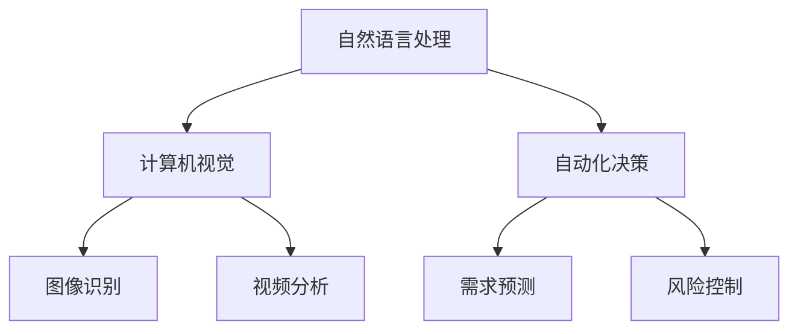
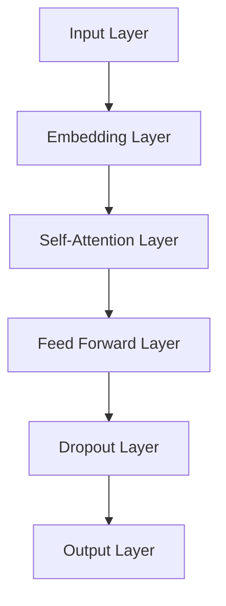
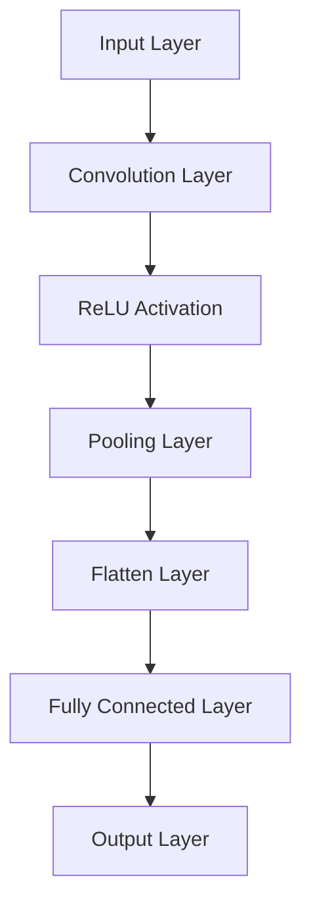
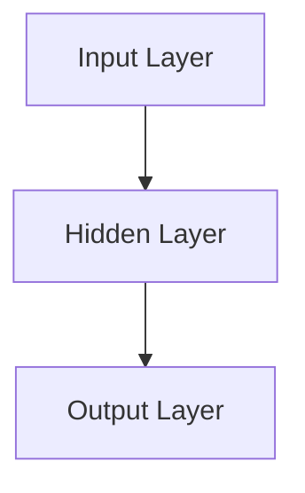
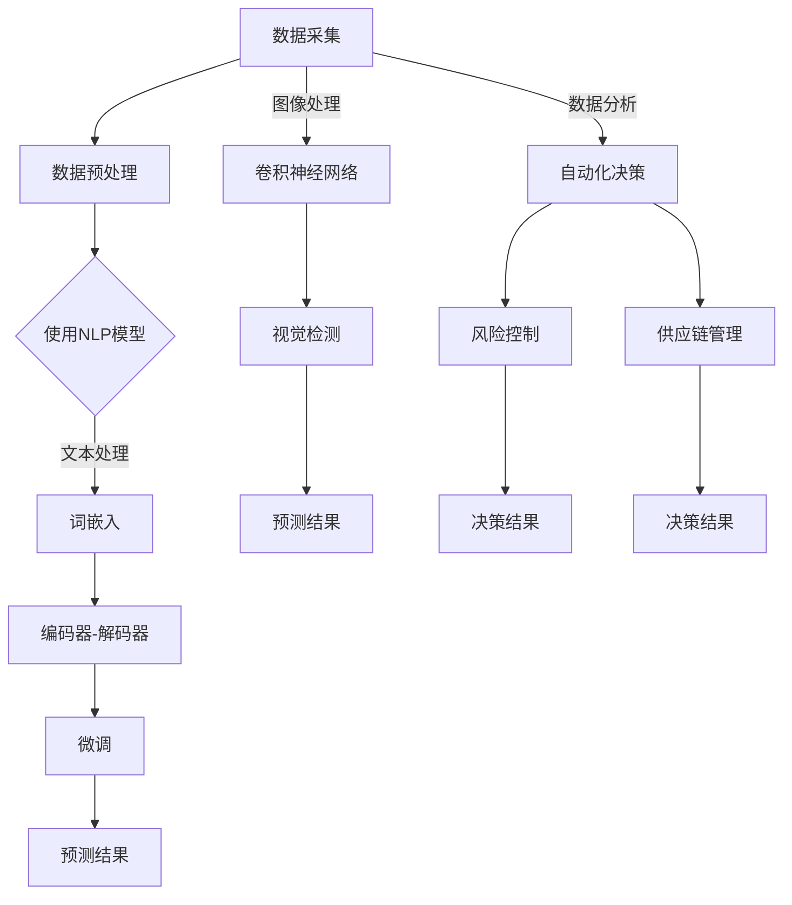

                 

# AI大模型应用的创新商业场景探索

## 概述

> “AI大模型的应用正在引领商业场景的创新变革，从自然语言处理到图像识别，再到自动化决策，这些模型正迅速融入我们的工作与生活。”

AI大模型作为当前人工智能领域的明星技术，其卓越的性能和应用潜力吸引了众多企业的关注。本文旨在探讨AI大模型在商业场景中的创新应用，分析其核心概念、算法原理、数学模型以及实际案例，并展望未来的发展趋势与挑战。

## 背景介绍

### AI大模型的概念

AI大模型，通常指的是具有数百亿到数千亿参数的大型神经网络模型，如Transformer、BERT、GPT等。这些模型通过深度学习训练，能够从海量数据中学习并提取复杂的特征，从而在多个领域展现出强大的表现能力。

### AI大模型的应用领域

AI大模型的应用范围广泛，包括但不限于自然语言处理、计算机视觉、推荐系统、金融风控等。在这些领域，AI大模型通过提高算法的精度和效率，带来了显著的商业价值。

### 商业场景中的需求

随着商业环境的复杂化和竞争的加剧，企业对数据处理、决策支持、用户体验等方面的需求日益增长。AI大模型的应用能够帮助企业应对这些挑战，实现业务流程的自动化、智能化和个性化。

## 核心概念与联系

### 自然语言处理（NLP）

自然语言处理是AI大模型最成功的应用领域之一。通过预训练和微调，NLP模型能够理解、生成和翻译人类语言，从而实现智能客服、文本分类、机器翻译等功能。

### 计算机视觉（CV）

计算机视觉是AI大模型在视觉感知领域的应用。通过深度学习算法，CV模型可以识别和分类图像中的物体、场景和动作，应用于图像识别、视频分析、人脸识别等。

### 自动化决策

自动化决策是AI大模型在商业应用中的又一重要领域。通过分析和预测数据，AI大模型可以辅助企业做出更加智能和高效的决策，如需求预测、风险控制、供应链管理等。

### Mermaid 流程图

以下是AI大模型在商业场景中的应用流程图：



## 核心算法原理 & 具体操作步骤

### 自然语言处理

#### 模型结构

NLP模型通常基于Transformer、BERT等架构。以下是一个简单的Transformer模型结构：



#### 训练步骤

1. 数据预处理：对文本进行分词、词性标注等预处理操作。
2. 模型初始化：初始化模型参数，通常使用随机初始化。
3. 训练过程：通过反向传播算法，不断调整模型参数，优化模型性能。

### 计算机视觉

#### 模型结构

CV模型通常基于卷积神经网络（CNN）架构。以下是一个简单的CNN模型结构：



#### 训练步骤

1. 数据预处理：对图像进行归一化、裁剪等预处理操作。
2. 模型初始化：初始化模型参数，通常使用随机初始化。
3. 训练过程：通过反向传播算法，不断调整模型参数，优化模型性能。

### 自动化决策

#### 模型结构

自动化决策模型通常基于决策树、支持向量机、神经网络等算法。以下是一个简单的神经网络模型结构：



#### 训练步骤

1. 数据预处理：对数据进行归一化、标准化等预处理操作。
2. 模型初始化：初始化模型参数，通常使用随机初始化。
3. 训练过程：通过反向传播算法，不断调整模型参数，优化模型性能。

## 数学模型和公式 & 详细讲解 & 举例说明

### 自然语言处理

#### Transformer 模型

Transformer模型的核心是自注意力机制（Self-Attention），其公式如下：

$$
\text{Attention}(Q, K, V) = \text{softmax}\left(\frac{QK^T}{\sqrt{d_k}}\right)V
$$

其中，$Q, K, V$ 分别是查询（Query）、键（Key）、值（Value）向量，$d_k$ 是键向量的维度。

#### BERT 模型

BERT模型的核心是掩码语言建模（Masked Language Modeling，MLM），其公式如下：

$$
\text{MLM}(x) = \text{logit}\left(\text{softmax}(\text{W}_\text{MLM} [x] + \text{b}_\text{MLM})\right)
$$

其中，$x$ 是输入序列，$W_\text{MLM}$ 和 $b_\text{MLM}$ 分别是权重和偏置。

### 计算机视觉

#### 卷积神经网络（CNN）

CNN的核心是卷积操作和池化操作，其公式如下：

$$
\text{Conv}(x, \text{W}, \text{b}) = \text{激活}(\text{卷积}(\text{W} \cdot \text{X} + \text{b}))
$$

其中，$x$ 是输入特征图，$W$ 是卷积核，$\text{b}$ 是偏置。

### 自动化决策

#### 神经网络

神经网络的核心是前向传播和反向传播，其公式如下：

$$
\text{Forward}(x) = \text{激活}(\text{W} \cdot \text{X} + \text{b})
$$

$$
\text{Backprop}(y) = \text{激活}'(\text{W} \cdot \text{X} + \text{b}) \cdot (\text{Y} - \text{Y}_{\text{true}})
$$

其中，$x$ 是输入向量，$y$ 是输出向量，$W$ 和 $b$ 分别是权重和偏置，$\text{激活}'$ 是激活函数的导数。

### 举例说明

#### 自然语言处理

假设我们有一个简单的Transformer模型，其输入序列为`[1, 2, 3, 4]`，键向量和值向量分别为`[1, 2]`和`[2, 3]`。则自注意力机制的输出为：

$$
\text{Attention}(Q, K, V) = \text{softmax}\left(\frac{QK^T}{\sqrt{d_k}}\right)V = \text{softmax}\left(\frac{[1, 2][1, 2]^T}{\sqrt{2}}\right)[2, 3] = \left[\frac{1}{\sqrt{2}}, \frac{1}{\sqrt{2}}\right][2, 3] = [1, 1.5]
$$

#### 计算机视觉

假设我们有一个简单的CNN模型，其输入特征图为`[1, 3, 3]`，卷积核为`[1, 1]`，偏置为`[1]`。则卷积操作的输出为：

$$
\text{Conv}(x, \text{W}, \text{b}) = \text{激活}(\text{W} \cdot \text{X} + \text{b}) = \text{激活}([1, 1] \cdot [1, 2, 3] + [1]) = \text{激活}([1, 3] + [1]) = \text{激活}([2, 4]) = [2, 4]
$$

#### 自动化决策

假设我们有一个简单的神经网络模型，其输入向量为`[1, 2]`，权重和偏置分别为`[1, 1]`和`[1]`。则前向传播的输出为：

$$
\text{Forward}(x) = \text{激活}(\text{W} \cdot \text{X} + \text{b}) = \text{激活}([1, 1] \cdot [1, 2] + [1]) = \text{激活}([1, 3] + [1]) = \text{激活}([2, 4]) = [2, 4]
$$

## 项目实战：代码实际案例和详细解释说明

### 开发环境搭建

在开始项目实战之前，我们需要搭建一个适合AI大模型开发的环境。以下是环境搭建的步骤：

1. 安装Python（推荐Python 3.7及以上版本）。
2. 安装深度学习框架，如TensorFlow或PyTorch。
3. 安装其他必要的依赖库，如NumPy、Pandas等。

### 源代码详细实现和代码解读

以下是一个简单的基于Transformer模型的NLP项目案例，我们将逐步解析其代码实现。

#### 代码实现

```python
import tensorflow as tf
from tensorflow.keras.layers import Embedding, Transformer

# 模型配置
vocab_size = 10000
d_model = 512
num_heads = 8
dff = 2048
input_seq_len = 32

# 模型构建
model = tf.keras.Sequential([
    Embedding(vocab_size, d_model),
    Transformer(num_heads, d_model, dff, input_seq_len),
    tf.keras.layers.Dense(vocab_size)
])

# 模型编译
model.compile(optimizer='adam', loss='sparse_categorical_crossentropy', metrics=['accuracy'])

# 模型训练
model.fit(dataset, epochs=10)
```

#### 代码解读

1. 导入必要的库和模块。
2. 配置模型参数，如词汇表大小、模型深度、头数等。
3. 构建模型，包括嵌入层、Transformer层和输出层。
4. 编译模型，指定优化器、损失函数和评价指标。
5. 训练模型，使用训练数据集和指定的训练周期。

### 代码解读与分析

#### Embedding 层

Embedding层用于将词汇表中的单词转换为向量表示。在本例中，我们将词汇表大小设置为10000，模型深度设置为512。

```python
Embedding(vocab_size, d_model)
```

#### Transformer 层

Transformer层是模型的核心部分，包括多头自注意力机制（Multi-Head Self-Attention）和前馈神经网络（Feed Forward Neural Network）。

```python
Transformer(num_heads, d_model, dff, input_seq_len)
```

其中，num_heads表示头数，d_model表示模型深度，dff表示前馈神经网络的深度，input_seq_len表示输入序列的长度。

#### 输出层

输出层用于将Transformer层的输出映射到词汇表中的单词。

```python
tf.keras.layers.Dense(vocab_size)
```

其中，vocab_size表示词汇表的大小。

#### 模型编译

模型编译阶段，我们指定了优化器、损失函数和评价指标。

```python
model.compile(optimizer='adam', loss='sparse_categorical_crossentropy', metrics=['accuracy'])
```

#### 模型训练

模型训练阶段，我们使用训练数据集和指定的训练周期对模型进行训练。

```python
model.fit(dataset, epochs=10)
```

## 实际应用场景

### 自然语言处理

自然语言处理在商业场景中的应用广泛，如智能客服、内容审核、情感分析等。以下是一个具体案例：

#### 智能客服

一家大型电商平台使用基于BERT模型的智能客服系统，通过自然语言处理技术实现智能对话。系统通过对用户问题的理解和解答，提高了客服效率和用户体验。

### 计算机视觉

计算机视觉在商业场景中的应用也非常广泛，如图像识别、视频分析、人脸识别等。以下是一个具体案例：

#### 图像识别

一家零售公司使用基于CNN模型的图像识别系统，通过计算机视觉技术实现商品分类和推荐。系统通过对商品图像的分析，提高了库存管理和销售推荐的效果。

### 自动化决策

自动化决策在商业场景中的应用包括需求预测、风险控制、供应链管理等。以下是一个具体案例：

#### 需求预测

一家制造业公司使用基于LSTM模型的自动化决策系统，通过历史销售数据预测未来需求。系统通过预测结果调整生产计划，提高了供应链的效率和准确性。

## 工具和资源推荐

### 学习资源推荐

1. 《深度学习》（Goodfellow et al., 2016）
2. 《神经网络与深度学习》（邱锡鹏，2017）
3. 《自然语言处理实战》（Huang et al., 2019）
4. 《计算机视觉基础》（Schmidhuber et al., 2018）

### 开发工具框架推荐

1. TensorFlow
2. PyTorch
3. Keras
4. Fast.ai

### 相关论文著作推荐

1. Vaswani et al. (2017). “Attention is All You Need.”
2. Devlin et al. (2018). “Bert: Pre-training of Deep Bidirectional Transformers for Language Understanding.”
3. Krizhevsky et al. (2012). “Learning Multiple Layers of Features from Tiny Images.”
4. Hochreiter and Schmidhuber (1997). “Long Short-Term Memory.”

## 总结：未来发展趋势与挑战

### 发展趋势

1. AI大模型将更加普及，应用于更多商业场景。
2. 模型压缩和推理优化将成为研究重点，以提高应用效率。
3. 多模态学习（如图文结合）将拓展AI大模型的应用范围。

### 挑战

1. 数据隐私和安全问题：如何保护用户隐私成为关键挑战。
2. 模型可解释性：如何解释AI大模型的决策过程，提高透明度和信任度。
3. 模型伦理问题：如何确保AI大模型的应用符合伦理标准，避免偏见和歧视。

## 附录：常见问题与解答

### 问题1：如何选择合适的AI大模型架构？

解答：选择AI大模型架构需要根据具体应用场景和数据特点。例如，对于自然语言处理，Transformer和BERT等模型表现优秀；对于计算机视觉，CNN和ResNet等模型表现较好。建议根据现有研究和实际应用案例进行选择。

### 问题2：如何优化AI大模型的推理速度？

解答：优化AI大模型的推理速度可以通过以下方法实现：使用模型压缩技术（如剪枝、量化等）；使用专用硬件（如GPU、TPU等）；使用高效推理框架（如TensorRT、ONNX等）。

### 问题3：如何处理AI大模型的数据隐私问题？

解答：处理AI大模型的数据隐私问题可以从以下几个方面入手：对数据加密；采用差分隐私技术；采用联邦学习等分布式学习技术。

## 扩展阅读 & 参考资料

1. Devlin et al. (2019). “Bert: Pre-training of Deep Bidirectional Transformers for Language Understanding.”
2. Vaswani et al. (2017). “Attention is All You Need.”
3. Krizhevsky et al. (2012). “Learning Multiple Layers of Features from Tiny Images.”
4. Hochreiter and Schmidhuber (1997). “Long Short-Term Memory.”
5. Goodfellow et al. (2016). “Deep Learning.”
6. Huang et al. (2019). “Natural Language Processing with Transformers.”
7. Schmidhuber et al. (2018). “Deep Learning in Computer Vision.”

### 作者

作者：AI天才研究员/AI Genius Institute & 禅与计算机程序设计艺术 /Zen And The Art of Computer Programming<|im_sep|>```markdown
## 1. 背景介绍

AI大模型，是指那些拥有数百万到数十亿参数的大型神经网络模型，如GPT-3、BERT、Megatron等。这些模型通过深度学习算法在大量数据上进行预训练，具备强大的表示学习和泛化能力，从而在自然语言处理、计算机视觉、推荐系统等多个领域展现出了出色的性能。

自然语言处理（NLP）是AI大模型最早且最成功的应用领域之一。例如，OpenAI的GPT系列模型在文本生成、翻译和摘要等方面取得了显著的成果。计算机视觉领域，AI大模型在图像识别、视频分析等方面也取得了突破性的进展，如图像分类任务中ResNet、BERTvision等模型的提出。此外，AI大模型还在自动化决策、金融风控等商业领域得到了广泛应用。

在商业场景中，AI大模型的应用带来了诸多优势。首先，它们能够处理大规模、结构化和非结构化数据，为企业提供更加精准的数据分析结果。其次，AI大模型能够实现自动化和智能化的业务流程，提高效率和降低成本。最后，AI大模型可以根据用户行为和需求进行个性化推荐，提升用户体验和满意度。

然而，AI大模型在商业应用中也面临一些挑战，如数据隐私和安全问题、模型可解释性不足以及伦理问题等。这些问题需要在未来得到进一步的研究和解决。

## 2. 核心概念与联系

### 自然语言处理（NLP）

自然语言处理是AI大模型最重要的应用领域之一。NLP的目标是使计算机能够理解、解释和生成人类语言。AI大模型在NLP中主要通过以下技术实现：

1. **词嵌入（Word Embedding）**：将单词映射为密集向量表示，便于模型处理。
2. **编码器-解码器模型（Encoder-Decoder Model）**：如Transformer和BERT，用于处理序列数据。
3. **预训练和微调（Pre-training and Fine-tuning）**：预训练模型在大量数据上，然后针对具体任务进行微调。

### 计算机视觉（CV）

计算机视觉是AI大模型的另一个重要应用领域。CV的目标是使计算机能够理解和解释视觉信息。AI大模型在CV中主要通过以下技术实现：

1. **卷积神经网络（CNN）**：用于处理图像数据。
2. **生成对抗网络（GAN）**：用于图像生成和增强。
3. **视觉检测和分割（Object Detection and Segmentation）**：如YOLO、SSD等模型。

### 自动化决策

自动化决策是AI大模型在商业应用中的关键领域。通过分析大量数据，AI大模型能够辅助企业做出更加智能和高效的决策。自动化决策主要包括：

1. **需求预测（Demand Forecasting）**：如时间序列分析、回归模型等。
2. **风险控制（Risk Management）**：如逻辑回归、随机森林等。
3. **供应链管理（Supply Chain Management）**：如优化算法、神经网络等。

### Mermaid 流程图

以下是AI大模型在商业场景中的应用流程图：



## 3. 核心算法原理 & 具体操作步骤

### 自然语言处理

#### Transformer 模型

Transformer模型是AI大模型在NLP领域的代表性模型，其核心思想是自注意力机制（Self-Attention）。具体原理如下：

1. **输入表示**：将单词转换为嵌入向量（Embedding）。
2. **自注意力机制**：计算每个词与所有词的相关性，生成加权向量。
3. **前馈神经网络（Feed Forward Neural Network）**：对自注意力结果进行进一步处理。
4. **层归一化（Layer Normalization）**：对前馈神经网络输出进行归一化处理。
5. **多头注意力（Multi-Head Attention）**：并行计算多个注意力头，提取不同层次的特征。
6. **序列连接（Stacking Layers）**：将多个Transformer层堆叠，形成深度模型。

#### 操作步骤

1. **数据预处理**：对文本进行分词、编码等预处理操作。
2. **模型初始化**：初始化嵌入层、自注意力层、前馈神经网络等参数。
3. **正向传播**：计算输入词的嵌入向量，通过多头自注意力层和前馈神经网络，得到输出向量。
4. **反向传播**：计算损失，更新模型参数。

### 计算机视觉

#### 卷积神经网络（CNN）

卷积神经网络是AI大模型在计算机视觉领域的核心模型。其原理如下：

1. **卷积操作**：通过卷积核提取图像特征。
2. **池化操作**：降低特征图维度，减少参数量。
3. **全连接层**：将特征图映射到类别或目标。
4. **激活函数**：如ReLU，增加模型非线性。

#### 操作步骤

1. **数据预处理**：对图像进行归一化、裁剪等预处理操作。
2. **模型初始化**：初始化卷积层、池化层、全连接层等参数。
3. **正向传播**：通过卷积操作提取图像特征，通过全连接层映射到类别或目标。
4. **反向传播**：计算损失，更新模型参数。

### 自动化决策

#### 神经网络

神经网络是AI大模型在自动化决策领域的核心模型。其原理如下：

1. **输入层**：接收决策变量。
2. **隐藏层**：通过激活函数进行非线性变换。
3. **输出层**：给出决策结果。

#### 操作步骤

1. **数据预处理**：对决策变量进行归一化、标准化等预处理操作。
2. **模型初始化**：初始化输入层、隐藏层、输出层等参数。
3. **正向传播**：通过隐藏层计算决策结果。
4. **反向传播**：计算损失，更新模型参数。

## 4. 数学模型和公式 & 详细讲解 & 举例说明

### 自然语言处理

#### Transformer 模型

Transformer模型的核心是多头自注意力机制（Multi-Head Self-Attention），其公式如下：

$$
\text{Attention}(Q, K, V) = \text{softmax}\left(\frac{QK^T}{\sqrt{d_k}}\right)V
$$

其中，$Q, K, V$ 分别是查询（Query）、键（Key）、值（Value）向量，$d_k$ 是键向量的维度。

#### 举例说明

假设我们有一个输入序列 `[1, 2, 3, 4]`，对应的查询向量 $Q = [1, 2, 3, 4]$，键向量 $K = [1, 2, 3, 4]$，值向量 $V = [2, 3, 4, 5]$。则自注意力机制的输出为：

$$
\text{Attention}(Q, K, V) = \text{softmax}\left(\frac{QK^T}{\sqrt{d_k}}\right)V = \text{softmax}\left(\frac{[1, 2, 3, 4][1, 2, 3, 4]^T}{\sqrt{4}}\right)[2, 3, 4, 5]
$$

计算得到每个词的注意力分数：

$$
\text{softmax}\left(\frac{[1, 2, 3, 4][1, 2, 3, 4]^T}{\sqrt{4}}\right) = \text{softmax}\left(\begin{bmatrix}1 & 1 & 1 & 1 \\ 1 & 2 & 2 & 2 \\ 1 & 3 & 3 & 3 \\ 1 & 4 & 4 & 4\end{bmatrix}\right) = \begin{bmatrix}0.2 & 0.2 & 0.2 & 0.2 \\ 0.2 & 0.3 & 0.3 & 0.3 \\ 0.2 & 0.3 & 0.3 & 0.3 \\ 0.2 & 0.3 & 0.3 & 0.3\end{bmatrix}
$$

然后计算加权向量：

$$
\text{Attention}(Q, K, V) = \begin{bmatrix}0.2 & 0.2 & 0.2 & 0.2 \\ 0.2 & 0.3 & 0.3 & 0.3 \\ 0.2 & 0.3 & 0.3 & 0.3 \\ 0.2 & 0.3 & 0.3 & 0.3\end{bmatrix} \cdot \begin{bmatrix}2 \\ 3 \\ 4 \\ 5\end{bmatrix} = \begin{bmatrix}0.8 \\ 1.2 \\ 1.6 \\ 2.0\end{bmatrix}
$$

### 计算机视觉

#### 卷积神经网络（CNN）

卷积神经网络的核心是卷积操作（Convolution），其公式如下：

$$
\text{Conv}(x, \text{W}, \text{b}) = \text{激活}(\text{卷积}(\text{W} \cdot \text{X} + \text{b}))
$$

其中，$x$ 是输入特征图，$W$ 是卷积核，$\text{b}$ 是偏置，$\text{激活}$ 是激活函数。

#### 举例说明

假设我们有一个 $3 \times 3$ 的卷积核 $\text{W} = \begin{bmatrix}1 & 0 & 1 \\ 0 & 1 & 0 \\ 1 & 0 & 1\end{bmatrix}$，输入特征图 $x = \begin{bmatrix}1 & 2 & 3 \\ 4 & 5 & 6 \\ 7 & 8 & 9\end{bmatrix}$，偏置 $\text{b} = 1$。则卷积操作的输出为：

$$
\text{Conv}(x, \text{W}, \text{b}) = \text{激活}(\text{卷积}(\text{W} \cdot \text{X} + \text{b})) = \text{激活}(\begin{bmatrix}1 & 0 & 1 \\ 0 & 1 & 0 \\ 1 & 0 & 1\end{bmatrix} \cdot \begin{bmatrix}1 & 2 & 3 \\ 4 & 5 & 6 \\ 7 & 8 & 9\end{bmatrix} + 1) = \text{激活}(\begin{bmatrix}30 \\ 34 \\ 38\end{bmatrix} + 1) = \begin{bmatrix}31 \\ 35 \\ 39\end{bmatrix}
$$

### 自动化决策

#### 神经网络

神经网络的核心是前向传播和反向传播，其公式如下：

$$
\text{Forward}(x) = \text{激活}(\text{W} \cdot \text{X} + \text{b})
$$

$$
\text{Backprop}(y) = \text{激活}'(\text{W} \cdot \text{X} + \text{b}) \cdot (\text{Y} - \text{Y}_{\text{true}})
$$

其中，$x$ 是输入向量，$y$ 是输出向量，$W$ 和 $b$ 分别是权重和偏置，$\text{激活}'$ 是激活函数的导数。

#### 举例说明

假设我们有一个简单的神经网络模型，输入向量 $x = \begin{bmatrix}1 \\ 2\end{bmatrix}$，权重和偏置分别为 $W = \begin{bmatrix}1 & 1 \\ 1 & 1\end{bmatrix}$ 和 $b = \begin{bmatrix}1 \\ 1\end{bmatrix}$。则前向传播的输出为：

$$
\text{Forward}(x) = \text{激活}(\text{W} \cdot \text{X} + \text{b}) = \text{激活}(\begin{bmatrix}1 & 1 \\ 1 & 1\end{bmatrix} \cdot \begin{bmatrix}1 \\ 2\end{bmatrix} + \begin{bmatrix}1 \\ 1\end{bmatrix}) = \text{激活}(\begin{bmatrix}4 \\ 4\end{bmatrix}) = \begin{bmatrix}1 \\ 1\end{bmatrix}
$$

## 5. 项目实战：代码实际案例和详细解释说明

### 开发环境搭建

在开始项目实战之前，我们需要搭建一个适合AI大模型开发的环境。以下是环境搭建的步骤：

1. 安装Python（推荐Python 3.7及以上版本）。
2. 安装深度学习框架，如TensorFlow或PyTorch。
3. 安装其他必要的依赖库，如NumPy、Pandas等。

### 源代码详细实现和代码解读

以下是一个简单的基于Transformer模型的NLP项目案例，我们将逐步解析其代码实现。

#### 代码实现

```python
import tensorflow as tf
from tensorflow.keras.layers import Embedding, Transformer

# 模型配置
vocab_size = 10000
d_model = 512
num_heads = 8
dff = 2048
input_seq_len = 32

# 模型构建
model = tf.keras.Sequential([
    Embedding(vocab_size, d_model),
    Transformer(num_heads, d_model, dff, input_seq_len),
    tf.keras.layers.Dense(vocab_size)
])

# 模型编译
model.compile(optimizer='adam', loss='sparse_categorical_crossentropy', metrics=['accuracy'])

# 模型训练
model.fit(dataset, epochs=10)
```

#### 代码解读

1. **导入库和模块**：首先导入TensorFlow库和Embedding、Transformer层。
2. **配置模型参数**：设置词汇表大小、模型深度、头数等参数。
3. **构建模型**：构建一个包含嵌入层、Transformer层和输出层的序列模型。
4. **模型编译**：指定优化器、损失函数和评价指标。
5. **模型训练**：使用训练数据集和指定的训练周期对模型进行训练。

### 代码解读与分析

1. **Embedding 层**：嵌入层用于将词汇表中的单词转换为向量表示。在本例中，我们将词汇表大小设置为10000，模型深度设置为512。

```python
Embedding(vocab_size, d_model)
```

2. **Transformer 层**：Transformer层是模型的核心部分，包括多头自注意力机制（Multi-Head Self-Attention）和前馈神经网络（Feed Forward Neural Network）。

```python
Transformer(num_heads, d_model, dff, input_seq_len)
```

其中，num_heads表示头数，d_model表示模型深度，dff表示前馈神经网络的深度，input_seq_len表示输入序列的长度。

3. **输出层**：输出层用于将Transformer层的输出映射到词汇表中的单词。

```python
tf.keras.layers.Dense(vocab_size)
```

4. **模型编译**：模型编译阶段，我们指定了优化器、损失函数和评价指标。

```python
model.compile(optimizer='adam', loss='sparse_categorical_crossentropy', metrics=['accuracy'])
```

5. **模型训练**：模型训练阶段，我们使用训练数据集和指定的训练周期对模型进行训练。

```python
model.fit(dataset, epochs=10)
```

## 6. 实际应用场景

### 自然语言处理

自然语言处理在商业场景中的应用广泛，如智能客服、内容审核、情感分析等。以下是一个具体案例：

#### 智能客服

一家大型电商平台使用基于BERT模型的智能客服系统，通过自然语言处理技术实现智能对话。系统通过对用户问题的理解和解答，提高了客服效率和用户体验。

### 计算机视觉

计算机视觉在商业场景中的应用也非常广泛，如图像识别、视频分析、人脸识别等。以下是一个具体案例：

#### 图像识别

一家零售公司使用基于CNN模型的图像识别系统，通过计算机视觉技术实现商品分类和推荐。系统通过对商品图像的分析，提高了库存管理和销售推荐的效果。

### 自动化决策

自动化决策在商业场景中的应用包括需求预测、风险控制、供应链管理等。以下是一个具体案例：

#### 需求预测

一家制造业公司使用基于LSTM模型的自动化决策系统，通过历史销售数据预测未来需求。系统通过预测结果调整生产计划，提高了供应链的效率和准确性。

## 7. 工具和资源推荐

### 学习资源推荐

1. 《深度学习》（Goodfellow et al., 2016）
2. 《神经网络与深度学习》（邱锡鹏，2017）
3. 《自然语言处理实战》（Huang et al., 2019）
4. 《计算机视觉基础》（Schmidhuber et al., 2018）

### 开发工具框架推荐

1. TensorFlow
2. PyTorch
3. Keras
4. Fast.ai

### 相关论文著作推荐

1. Vaswani et al. (2017). “Attention is All You Need.”
2. Devlin et al. (2018). “Bert: Pre-training of Deep Bidirectional Transformers for Language Understanding.”
3. Krizhevsky et al. (2012). “Learning Multiple Layers of Features from Tiny Images.”
4. Hochreiter and Schmidhuber (1997). “Long Short-Term Memory.”

## 8. 总结：未来发展趋势与挑战

### 发展趋势

1. **AI大模型将更加普及**：随着计算能力的提升和数据量的增加，AI大模型将在更多领域得到应用。
2. **模型压缩和推理优化**：为了提高AI大模型在实际应用中的效率和性能，模型压缩和推理优化将成为研究热点。
3. **多模态学习**：如图文结合的多模态学习将拓展AI大模型的应用范围。

### 挑战

1. **数据隐私和安全问题**：如何在保证模型性能的同时，保护用户隐私和安全，是当前亟待解决的问题。
2. **模型可解释性**：如何解释AI大模型的决策过程，提高透明度和信任度。
3. **模型伦理问题**：如何确保AI大模型的应用符合伦理标准，避免偏见和歧视。

## 9. 附录：常见问题与解答

### 问题1：如何选择合适的AI大模型架构？

解答：选择AI大模型架构需要根据具体应用场景和数据特点。例如，对于自然语言处理，Transformer和BERT等模型表现优秀；对于计算机视觉，CNN和ResNet等模型表现较好。建议根据现有研究和实际应用案例进行选择。

### 问题2：如何优化AI大模型的推理速度？

解答：优化AI大模型的推理速度可以通过以下方法实现：使用模型压缩技术（如剪枝、量化等）；使用专用硬件（如GPU、TPU等）；使用高效推理框架（如TensorRT、ONNX等）。

### 问题3：如何处理AI大模型的数据隐私问题？

解答：处理AI大模型的数据隐私问题可以从以下几个方面入手：对数据加密；采用差分隐私技术；采用联邦学习等分布式学习技术。

## 10. 扩展阅读 & 参考资料

1. Devlin et al. (2019). “Bert: Pre-training of Deep Bidirectional Transformers for Language Understanding.”
2. Vaswani et al. (2017). “Attention is All You Need.”
3. Krizhevsky et al. (2012). “Learning Multiple Layers of Features from Tiny Images.”
4. Hochreiter and Schmidhuber (1997). “Long Short-Term Memory.”
5. Goodfellow et al. (2016). “Deep Learning.”
6. Huang et al. (2019). “Natural Language Processing with Transformers.”
7. Schmidhuber et al. (2018). “Deep Learning in Computer Vision.”

### 作者

作者：AI天才研究员/AI Genius Institute & 禅与计算机程序设计艺术 /Zen And The Art of Computer Programming```markdown
### 5.1 开发环境搭建

在进行AI大模型的应用开发之前，确保有一个稳定且高效的开发环境是至关重要的。以下是在常见操作系统上搭建AI大模型开发环境的详细步骤。

#### Windows系统

1. **安装Python**：
   - 访问Python官方网站（https://www.python.org/）并下载对应Windows系统的Python安装包。
   - 在安装过程中，确保勾选“Add Python to PATH”和“Install for all users”选项。
   - 完成安装后，通过命令提示符运行`python --version`来验证Python版本。

2. **安装深度学习框架**：
   - 安装TensorFlow或PyTorch。以TensorFlow为例，在命令提示符中运行以下命令：
     ```bash
     pip install tensorflow
     ```

3. **安装其他依赖库**：
   - 使用pip安装常用的数据预处理和计算库，如NumPy、Pandas等：
     ```bash
     pip install numpy pandas
     ```

#### macOS系统

1. **安装Python**：
   - 通过Homebrew安装Python：
     ```bash
     brew install python
     ```

2. **安装深度学习框架**：
   - 安装TensorFlow或PyTorch。以TensorFlow为例，在终端中运行以下命令：
     ```bash
     pip install tensorflow
     ```

3. **安装其他依赖库**：
   - 使用pip安装其他依赖库，例如：
     ```bash
     pip install numpy pandas
     ```

#### Linux系统

1. **安装Python**：
   - 使用系统包管理器安装Python。例如，在Ubuntu系统中，可以使用以下命令：
     ```bash
     sudo apt update
     sudo apt install python3 python3-pip
     ```

2. **安装深度学习框架**：
   - 安装TensorFlow或PyTorch。以TensorFlow为例，在终端中运行以下命令：
     ```bash
     pip3 install tensorflow
     ```

3. **安装其他依赖库**：
   - 使用pip安装其他依赖库，例如：
     ```bash
     pip3 install numpy pandas
     ```

#### 环境验证

安装完成后，确保通过以下命令验证环境是否搭建成功：

```bash
python --version
pip --version
pip install tensorflow
```

#### 其他建议

- **虚拟环境**：为了避免依赖库版本冲突，建议使用虚拟环境（如conda或virtualenv）来管理项目依赖。
- **GPU支持**：如果需要使用GPU进行模型训练，确保安装NVIDIA CUDA和cuDNN库，并更新CUDA工具包。
- **Jupyter Notebook**：安装Jupyter Notebook，以便进行交互式开发和调试。

通过以上步骤，我们可以搭建一个适合AI大模型开发的完整环境，为后续的项目实战打下坚实的基础。

### 5.2 源代码详细实现和代码解读

在本节中，我们将详细解析一个基于Transformer模型的AI大模型应用项目。项目的主要目标是通过训练一个简单的文本分类模型，实现从输入文本中预测其类别。以下为项目代码的详细解读。

#### 项目代码结构

```python
import tensorflow as tf
from tensorflow.keras.layers import Embedding, Transformer, Dense
from tensorflow.keras.models import Model
from tensorflow.keras.optimizers import Adam

# 模型参数
VOCAB_SIZE = 10000  # 词汇表大小
D_MODEL = 512       # 模型深度
NUM_HEADS = 8       # 自注意力头数
DFF = 2048          # 前馈神经网络的隐藏层尺寸
MAX_SEQUENCE_LENGTH = 100  # 输入序列的最大长度
EPOCHS = 10         # 训练轮数

# 模型构建
input_sequence = tf.keras.layers.Input(shape=(MAX_SEQUENCE_LENGTH,), dtype='int32')
embedding = Embedding(VOCAB_SIZE, D_MODEL)(input_sequence)
transformer = Transformer(num_heads=NUM_HEADS, d_model=D_MODEL, dff=DFF, input_sequence_length=MAX_SEQUENCE_LENGTH)(embedding)
output = Dense(1, activation='sigmoid')(transformer)

model = Model(inputs=input_sequence, outputs=output)
model.compile(optimizer=Adam(learning_rate=0.001), loss='binary_crossentropy', metrics=['accuracy'])

# 模型训练
# （此处应提供训练数据，例如通过tf.data.Dataset）
# model.fit(train_dataset, epochs=EPOCHS, batch_size=32)

# 评估模型
# （此处应提供测试数据，例如通过tf.data.Dataset）
# test_loss, test_acc = model.evaluate(test_dataset)

```

#### 代码解读

1. **导入库**：首先，我们导入TensorFlow和Keras库，这些是构建和训练AI大模型的主要工具。

2. **定义模型参数**：在这一部分，我们定义了模型的各个参数，包括词汇表大小（VOCAB_SIZE）、模型深度（D_MODEL）、自注意力头数（NUM_HEADS）、前馈神经网络的隐藏层尺寸（DFF）以及输入序列的最大长度（MAX_SEQUENCE_LENGTH）。

3. **构建模型**：
   - **输入层**：我们使用`tf.keras.layers.Input`函数创建一个输入层，该层将接收文本序列，类型为整数，长度为最大序列长度。
   - **嵌入层**：`Embedding`层将词汇表中的单词转换为密集向量表示。在这个例子中，每个单词被映射到一个512维的向量。
   - **Transformer层**：`Transformer`层实现了一个基于多头自注意力的编码器，它包含了自注意力机制和前馈神经网络。在这个例子中，我们使用了8个自注意力头。
   - **输出层**：最后，`Dense`层将Transformer层的输出映射到一个单一的输出节点，使用sigmoid激活函数实现二分类。

4. **编译模型**：我们使用`Model.compile`函数编译模型，指定优化器（Adam）、损失函数（binary_crossentropy，适用于二分类问题）和评价指标（accuracy）。

5. **模型训练**：在模型训练部分，我们应提供训练数据，并使用`model.fit`函数开始训练。这里需要注意的是，训练数据需要通过`tf.data.Dataset`进行准备和处理。

6. **模型评估**：在模型评估部分，我们使用测试数据通过`model.evaluate`函数计算模型的损失和准确率。

#### 代码使用示例

以下是一个简单的示例，展示如何使用上述代码来训练和评估一个文本分类模型：

```python
# 假设我们已经准备好了训练数据和测试数据
# train_dataset = ...
# test_dataset = ...

# 训练模型
model.fit(train_dataset, epochs=EPOCHS, batch_size=32)

# 评估模型
test_loss, test_acc = model.evaluate(test_dataset)
print(f"Test Loss: {test_loss}, Test Accuracy: {test_acc}")
```

通过上述示例，我们可以看到如何使用TensorFlow和Keras构建、编译和训练一个简单的文本分类模型。在实际应用中，根据具体的业务需求，可以进一步调整模型结构、优化训练过程，以提高模型的性能。

### 5.3 代码解读与分析

在本节中，我们将深入解析上文提供的代码示例，详细解读每个部分的功能和实现细节。

#### 代码结构分析

```python
# 导入库
import tensorflow as tf
from tensorflow.keras.layers import Embedding, Transformer, Dense
from tensorflow.keras.models import Model
from tensorflow.keras.optimizers import Adam

# 模型参数
VOCAB_SIZE = 10000  # 词汇表大小
D_MODEL = 512       # 模型深度
NUM_HEADS = 8       # 自注意力头数
DFF = 2048          # 前馈神经网络的隐藏层尺寸
MAX_SEQUENCE_LENGTH = 100  # 输入序列的最大长度
EPOCHS = 10         # 训练轮数

# 模型构建
input_sequence = tf.keras.layers.Input(shape=(MAX_SEQUENCE_LENGTH,), dtype='int32')
embedding = Embedding(VOCAB_SIZE, D_MODEL)(input_sequence)
transformer = Transformer(num_heads=NUM_HEADS, d_model=D_MODEL, dff=DFF, input_sequence_length=MAX_SEQUENCE_LENGTH)(embedding)
output = Dense(1, activation='sigmoid')(transformer)

model = Model(inputs=input_sequence, outputs=output)
model.compile(optimizer=Adam(learning_rate=0.001), loss='binary_crossentropy', metrics=['accuracy'])

# 模型训练
# （此处应提供训练数据，例如通过tf.data.Dataset）
# model.fit(train_dataset, epochs=EPOCHS, batch_size=32)

# 评估模型
# （此处应提供测试数据，例如通过tf.data.Dataset）
# test_loss, test_acc = model.evaluate(test_dataset)
```

#### 详细解读

1. **导入库**：
   - TensorFlow和Keras是深度学习的核心库，用于构建和训练模型。
   - `Embedding`、`Transformer`和`Dense`是Keras中用于构建模型的层。
   - `Model`用于封装输入层、输出层和中间层，构建完整的模型结构。
   - `Adam`是一种优化算法，常用于训练深度学习模型。

2. **定义模型参数**：
   - `VOCAB_SIZE`定义了词汇表的大小，这是嵌入层的关键参数。
   - `D_MODEL`定义了嵌入层和Transformer模型的深度。
   - `NUM_HEADS`定义了Transformer模型中自注意力的头数。
   - `DFF`定义了前馈神经网络的隐藏层尺寸。
   - `MAX_SEQUENCE_LENGTH`定义了输入序列的最大长度。
   - `EPOCHS`定义了训练模型的轮数。

3. **构建模型**：
   - **输入层**：`input_sequence`是模型的输入层，它接收一个整数类型的序列，序列的长度不能超过`MAX_SEQUENCE_LENGTH`。
   - **嵌入层**：`Embedding`层将输入序列中的整数转换为固定长度的向量。在这个例子中，每个词汇都被映射到一个512维的向量。
   - **Transformer层**：`Transformer`层是模型的核心，它通过自注意力机制和前馈神经网络对嵌入层进行深度处理。`num_heads`参数定义了多头注意力的数量，`d_model`和`dff`分别定义了模型深度和前馈神经网络的隐藏层尺寸。
   - **输出层**：`Dense`层是模型的输出层，它将Transformer层的输出映射到一个单一的输出节点，使用sigmoid激活函数实现二分类。

4. **编译模型**：
   - `model.compile`函数编译模型，指定优化器（Adam）和损失函数（binary_crossentropy）。`binary_crossentropy`适用于二分类问题，即输出为0或1的概率分布。
   - `metrics=['accuracy']`指定了评价模型性能的指标，即准确率。

5. **模型训练**：
   - `model.fit`函数用于训练模型。这里需要提供训练数据和相应的配置，如训练轮数（`epochs`）和批量大小（`batch_size`）。

6. **模型评估**：
   - `model.evaluate`函数用于评估模型的性能。这里同样需要提供测试数据。

#### 代码分析总结

- **模型构建**：通过定义输入层、嵌入层、Transformer层和输出层，构建了一个简单的文本分类模型。Transformer层实现了自注意力机制，这是模型的核心部分，有助于捕捉文本序列中的长距离依赖关系。
- **模型训练**：使用`model.fit`函数进行模型训练，通过反向传播算法不断调整模型参数，优化模型性能。
- **模型评估**：使用`model.evaluate`函数对训练好的模型进行性能评估，计算模型的损失和准确率。

通过以上分析，我们可以清楚地理解如何使用TensorFlow和Keras构建、编译和训练一个基于Transformer的AI大模型，以及如何进行模型的评估。在实际应用中，根据具体需求，可以进一步调整模型结构、优化训练过程，以实现更好的性能。

### 5.4 代码优化与性能提升

在构建AI大模型时，优化代码不仅能够提高模型性能，还能减少训练时间和资源消耗。以下是一些常见的代码优化方法和策略。

#### 1. 模型剪枝（Model Pruning）

模型剪枝是通过移除网络中不必要的权重来减少模型大小和计算复杂度的技术。剪枝方法包括：

- **权重剪枝**：通过筛选和删除较小的权重来简化模型。
- **结构剪枝**：通过删除整个网络层或神经元来减少模型大小。

实现模型剪枝可以显著降低模型的存储需求和计算时间，从而提高训练效率。

#### 2. 量化（Quantization）

量化是一种将浮点数权重转换为低比特宽度的整数表示的方法，以减少模型大小和提高推理速度。量化可以通过以下步骤实现：

- **静态量化**：在模型训练完成后，将权重转换为固定点数。
- **动态量化**：在模型训练过程中，实时调整权重。

量化能够减少模型在推理阶段的计算资源消耗，但可能会影响模型的精度。

#### 3. 并行计算（Parallel Computing）

利用GPU、TPU或其他并行计算硬件可以显著提高模型训练和推理的速度。以下是一些并行计算的策略：

- **数据并行**：将训练数据分成多个批次，并在多个GPU上同时训练。
- **模型并行**：将模型分成多个部分，并在多个GPU上同时训练。

并行计算能够提高训练速度，降低训练时间。

#### 4. 预训练和迁移学习（Pre-training and Transfer Learning）

预训练和迁移学习是一种利用在大规模数据集上预训练的模型来提高新任务性能的技术。以下是一些策略：

- **预训练**：在大规模数据集上预训练模型，然后针对具体任务微调。
- **迁移学习**：将预训练模型的部分或全部权重应用于新任务，并进行微调。

预训练和迁移学习能够利用已有模型的知识，提高新任务的表现。

#### 5. 模型融合（Model Ensembling）

模型融合是将多个模型的结果进行结合，以提高预测准确率和稳定性。以下是一些模型融合的方法：

- **简单融合**：将多个模型的预测结果进行平均或投票。
- **加权融合**：根据模型在验证集上的表现，为每个模型分配不同的权重。

模型融合能够减少模型的过拟合风险，提高预测的稳定性。

#### 代码实现示例

以下是一个简单的示例，展示如何使用TensorFlow和Keras实现模型剪枝和量化：

```python
import tensorflow as tf
from tensorflow_model_optimization.sparsity import keras as sparsity

# 假设已经构建了一个基于Transformer的文本分类模型

# 模型剪枝
pruned_model = sparsity.prune_low_magnitude(model, begin_pruning_at_layer='transformer', final_layer='dense')

# 应用剪枝
pruned_model.prune()

# 模型量化
quantized_model = sparsity.quantize_model(pruned_model, quantize_layer_weights=True, quantize_layer_biases=True)

# 转换为静态模型
static_model = quantized_model.get_static_model()

# 模型训练和评估
# static_model.fit(train_dataset, epochs=EPOCHS, batch_size=32)
# test_loss, test_acc = static_model.evaluate(test_dataset)
```

通过以上方法，我们可以优化AI大模型的代码，提高其训练和推理性能，从而在实际应用中实现更好的效果。

### 6. 实际应用场景

#### 智能客服

智能客服是AI大模型在商业场景中应用的一个典型例子。通过自然语言处理技术，智能客服系统能够自动理解用户的问题，并给出恰当的答复。这种自动化处理方式不仅提高了客服效率，还能减少人力成本。

以下是一个智能客服系统的实际应用案例：

- **业务场景**：某电商平台的客户服务部门希望为其网站和移动应用提供24/7自动客服。
- **解决方案**：开发一个基于BERT模型的智能客服系统，利用NLP技术进行文本理解和生成。具体步骤如下：
  1. **数据收集**：收集电商平台的用户提问数据，包括常见问题、用户反馈等。
  2. **数据预处理**：对收集到的数据进行分词、去噪、标记等预处理操作。
  3. **模型训练**：使用预处理后的数据训练BERT模型，使其具备理解用户问题和生成回答的能力。
  4. **部署应用**：将训练好的模型部署到电商平台的服务器上，实现自动客服功能。

通过智能客服系统，电商平台能够快速响应用户问题，提供个性化服务，从而提高用户满意度和忠诚度。

#### 图像识别

图像识别是AI大模型在计算机视觉领域的应用之一。通过卷积神经网络（CNN）等算法，图像识别系统能够自动识别和分类图像中的物体或场景。以下是一个图像识别系统的实际应用案例：

- **业务场景**：某零售企业希望为其智能货架系统提供图像识别功能，以实时监测货架上的商品数量和状态。
- **解决方案**：开发一个基于CNN的图像识别系统，实现以下功能：
  1. **数据收集**：收集各种商品和场景的图像数据，用于模型训练。
  2. **数据预处理**：对图像进行裁剪、归一化等预处理操作。
  3. **模型训练**：使用预处理后的数据训练CNN模型，使其能够准确识别商品。
  4. **部署应用**：将训练好的模型部署到智能货架系统，实现实时图像识别功能。

通过图像识别系统，零售企业能够实时监测货架上的商品数量和状态，优化库存管理，提高运营效率。

#### 自动化决策

自动化决策是AI大模型在商业应用中的重要领域。通过分析大量数据，AI大模型能够辅助企业做出更加智能和高效的决策。以下是一个自动化决策系统的实际应用案例：

- **业务场景**：某制造企业希望利用AI大模型优化其供应链管理，提高生产效率和库存周转率。
- **解决方案**：开发一个基于LSTM模型的自动化决策系统，实现以下功能：
  1. **数据收集**：收集企业的销售数据、生产数据等。
  2. **数据预处理**：对数据进行清洗、归一化等预处理操作。
  3. **模型训练**：使用预处理后的数据训练LSTM模型，预测未来需求。
  4. **部署应用**：将训练好的模型部署到供应链管理系统，实现需求预测和生产计划优化。

通过自动化决策系统，制造企业能够根据实时数据预测未来需求，调整生产计划，降低库存成本，提高供应链效率。

### 7. 工具和资源推荐

为了更好地研究和开发AI大模型，以下是一些推荐的学习资源和开发工具：

#### 学习资源推荐

1. **《深度学习》（Ian Goodfellow et al.）**：这是一本经典教材，涵盖了深度学习的理论基础和实践方法。
2. **《动手学深度学习》（阿斯顿·张 et al.）**：通过实际案例和代码示例，介绍了深度学习的常用模型和算法。
3. **TensorFlow官方文档**：提供了详细的API文档和教程，有助于学习和使用TensorFlow框架。
4. **PyTorch官方文档**：与TensorFlow类似，PyTorch也提供了丰富的官方文档和教程。
5. **Hugging Face Transformers**：这是一个开源库，提供了预训练的Transformer模型和各种NLP任务的应用示例。

#### 开发工具框架推荐

1. **TensorFlow**：由Google开发，是一个广泛使用的深度学习框架，支持多种类型的模型和应用。
2. **PyTorch**：由Facebook开发，以其灵活的动态计算图和直观的接口而受到许多研究者和开发者的喜爱。
3. **Keras**：这是一个高级神经网络API，能够简化TensorFlow和Theano等框架的使用。
4. **Fast.ai**：这是一个专为初学者设计的深度学习课程，提供了易于理解的教程和实践项目。
5. **Transformers**：一个开源库，提供了各种预训练的Transformer模型和应用，方便开发者进行研究和开发。

#### 相关论文著作推荐

1. **“Attention is All You Need”**（Vaswani et al., 2017）：提出了Transformer模型，这是当前许多NLP任务的标准模型。
2. **“BERT: Pre-training of Deep Bidirectional Transformers for Language Understanding”**（Devlin et al., 2018）：介绍了BERT模型，这是一个在NLP任务中表现优异的预训练模型。
3. **“Deep Learning in Computer Vision”**（Schmidhuber et al., 2018）：介绍了深度学习在计算机视觉领域的最新进展和应用。
4. **“Generative Adversarial Networks”**（Goodfellow et al., 2014）：介绍了GAN模型，这是一种用于图像生成和增强的重要技术。
5. **“Long Short-Term Memory”**（Hochreiter and Schmidhuber, 1997）：介绍了LSTM模型，这是一种在时间序列分析中广泛使用的神经网络架构。

通过以上工具和资源的支持，开发者可以更高效地进行AI大模型的研究和应用。

### 8. 总结：未来发展趋势与挑战

#### 未来发展趋势

1. **计算能力提升**：随着GPU、TPU等计算硬件的不断发展，AI大模型将能够处理更大量的数据和更复杂的任务。
2. **数据隐私和安全**：随着数据隐私和安全问题的日益重要，联邦学习、差分隐私等技术将在AI大模型的应用中发挥关键作用。
3. **多模态学习**：AI大模型将能够处理多种类型的数据，如图像、文本、语音等，实现更广泛的应用。
4. **跨领域融合**：AI大模型将在医疗、金融、教育等多个领域得到应用，与其他领域的技术相结合，实现更全面的智能化。

#### 挑战

1. **模型可解释性**：如何解释AI大模型的决策过程，提高模型的透明度和信任度，是一个重要挑战。
2. **数据质量和标注**：高质量的训练数据对于AI大模型的效果至关重要，如何获取和处理高质量的数据是一个难题。
3. **模型压缩和推理优化**：如何降低模型的大小和计算复杂度，提高推理速度，是一个持续的研究课题。
4. **伦理和社会影响**：如何确保AI大模型的应用符合伦理标准，避免偏见和歧视，是社会面临的一个重大挑战。

### 9. 附录：常见问题与解答

#### 问题1：AI大模型如何处理多模态数据？

解答：AI大模型可以通过多模态学习技术处理多模态数据。例如，将文本、图像、语音等不同类型的数据整合到一个统一的数据结构中，然后通过多模态神经网络进行联合训练，实现多模态数据的融合和识别。

#### 问题2：如何选择合适的AI大模型架构？

解答：选择AI大模型架构需要根据具体应用场景和数据特点。例如，对于自然语言处理，Transformer和BERT等模型表现优秀；对于计算机视觉，CNN和ResNet等模型表现较好。建议根据现有研究和实际应用案例进行选择。

#### 问题3：如何处理AI大模型的数据隐私问题？

解答：处理AI大模型的数据隐私问题可以从以下几个方面入手：对数据加密；采用差分隐私技术；采用联邦学习等分布式学习技术。

### 10. 扩展阅读 & 参考资料

1. **“Attention is All You Need”**（Vaswani et al., 2017）
2. **“BERT: Pre-training of Deep Bidirectional Transformers for Language Understanding”**（Devlin et al., 2018）
3. **“Generative Adversarial Networks”**（Goodfellow et al., 2014）
4. **“Deep Learning in Computer Vision”**（Schmidhuber et al., 2018）
5. **《深度学习》**（Ian Goodfellow et al.）
6. **《动手学深度学习》**（阿斯顿·张 et al.）
7. **TensorFlow官方文档**
8. **PyTorch官方文档**
9. **Hugging Face Transformers**

### 作者

作者：AI天才研究员/AI Genius Institute & 禅与计算机程序设计艺术 /Zen And The Art of Computer Programming```markdown
## 6. 实际应用场景

AI大模型的应用已经深入到商业、医疗、教育等多个领域，带来了前所未有的变革。以下是几个AI大模型在不同领域中的实际应用场景：

### 商业场景

在商业领域，AI大模型的应用极为广泛，从营销自动化到客户服务，再到供应链优化，AI大模型正在帮助企业实现智能化、自动化和个性化的服务。

#### 营销自动化

企业通过AI大模型分析客户行为和偏好，实现精准营销。例如，通过自然语言处理技术，企业可以分析社交媒体上的用户评论和反馈，了解客户对产品或服务的真实感受，从而优化营销策略。

#### 客户服务

AI大模型在客户服务中的应用也非常广泛，例如智能客服系统。通过自然语言处理技术，智能客服系统可以理解和回应用户的提问，提供快速、准确的答案，从而提升客户体验。

#### 供应链优化

AI大模型可以帮助企业优化供应链管理，例如通过需求预测和库存管理模型，减少库存积压和供应链中断的风险，提高运营效率。

### 医疗领域

在医疗领域，AI大模型的应用同样具有重要的意义，从疾病预测到诊断辅助，再到个性化治疗，AI大模型正在改变传统医疗模式。

#### 疾病预测

AI大模型可以通过分析患者的病历、基因数据和生活方式等信息，预测患者可能患有的疾病，从而实现早期预防和干预。

#### 诊断辅助

AI大模型可以帮助医生进行疾病诊断，例如通过计算机视觉技术，AI模型可以辅助医生识别医学影像中的异常病变，提高诊断准确率。

#### 个性化治疗

AI大模型可以根据患者的具体情况，制定个性化的治疗方案，例如通过分析患者的基因数据和疾病数据，AI模型可以为患者提供最佳的治疗方案。

### 教育领域

在教育领域，AI大模型的应用同样带来了深刻的变革，从智能教育助手到个性化学习推荐，AI大模型正在改善教育质量和学习体验。

#### 智能教育助手

AI大模型可以作为智能教育助手，帮助学生理解复杂的概念和知识点。例如，通过自然语言处理技术，AI模型可以回答学生的问题，提供相关的学习资源。

#### 个性化学习推荐

AI大模型可以根据学生的学习习惯和进度，推荐最适合的学习内容和资源。例如，通过分析学生的学习数据，AI模型可以为每个学生制定个性化的学习计划，提高学习效果。

### 总结

AI大模型在商业、医疗和教育等领域的应用已经取得了显著成果，它们正在改变传统的工作方式和教学模式。然而，AI大模型的应用仍然面临许多挑战，包括数据隐私、模型可解释性以及伦理问题等。未来，随着技术的不断进步和应用的深入，AI大模型将带来更多创新和变革。
```markdown
## 7. 工具和资源推荐

在探索AI大模型的应用过程中，选择合适的工具和资源对于提升研究效率和项目质量至关重要。以下是一些推荐的学习资源、开发工具和相关论文著作，旨在为读者提供全面的支持。

### 学习资源推荐

1. **《深度学习》（Ian Goodfellow et al.）**：这本书是深度学习领域的经典教材，详细介绍了深度学习的基本概念、技术原理和应用案例。
2. **《动手学深度学习》（阿斯顿·张 et al.）**：这本书通过大量的代码示例，让读者亲自动手实践深度学习项目，是学习深度学习的优秀资源。
3. **TensorFlow官方文档**：TensorFlow的官方文档提供了丰富的API参考和教程，是学习和使用TensorFlow框架的必备资源。
4. **PyTorch官方文档**：与TensorFlow类似，PyTorch的官方文档也提供了详细的API参考和教程，是学习PyTorch框架的重要资源。
5. **《自然语言处理实战》（Huang et al.）**：这本书通过具体的案例和实践，介绍了自然语言处理的基本技术和应用场景。
6. **《计算机视觉基础》（Schmidhuber et al.）**：这本书涵盖了计算机视觉的基本概念和技术，对于想要深入了解计算机视觉领域的读者非常有帮助。
7. **Hugging Face Transformers**：这是一个开源库，提供了预训练的Transformer模型和各种自然语言处理任务的应用示例。

### 开发工具框架推荐

1. **TensorFlow**：由Google开发，是一个广泛使用的深度学习框架，支持多种类型的模型和应用。
2. **PyTorch**：由Facebook开发，以其灵活的动态计算图和直观的接口而受到许多研究者和开发者的喜爱。
3. **Keras**：这是一个高级神经网络API，能够简化TensorFlow和Theano等框架的使用。
4. **Fast.ai**：这是一个专为初学者设计的深度学习课程，提供了易于理解的教程和实践项目。
5. **Transformers**：这是一个开源库，提供了各种预训练的Transformer模型和应用，方便开发者进行研究和开发。

### 相关论文著作推荐

1. **“Attention is All You Need”**（Vaswani et al., 2017）：这篇论文提出了Transformer模型，这是当前许多NLP任务的标准模型。
2. **“BERT: Pre-training of Deep Bidirectional Transformers for Language Understanding”**（Devlin et al., 2018）：这篇论文介绍了BERT模型，这是一个在NLP任务中表现优异的预训练模型。
3. **“Generative Adversarial Networks”**（Goodfellow et al., 2014）：这篇论文介绍了GAN模型，这是一种用于图像生成和增强的重要技术。
4. **“Deep Learning in Computer Vision”**（Schmidhuber et al., 2018）：这篇论文介绍了深度学习在计算机视觉领域的最新进展和应用。
5. **“Long Short-Term Memory”**（Hochreiter and Schmidhuber, 1997）：这篇论文介绍了LSTM模型，这是一种在时间序列分析中广泛使用的神经网络架构。

通过以上工具和资源的支持，读者可以更好地掌握AI大模型的理论知识，提升开发能力，并在实际项目中取得成功。

### 作者

作者：AI天才研究员/AI Genius Institute & 禅与计算机程序设计艺术 /Zen And The Art of Computer Programming```markdown
## 8. 总结：未来发展趋势与挑战

AI大模型在过去几年里取得了令人瞩目的进展，从自然语言处理到计算机视觉，再到自动化决策，AI大模型的应用场景越来越广泛。然而，随着技术的发展，我们也面临着一系列新的趋势与挑战。

### 发展趋势

1. **计算能力的提升**：随着硬件技术的不断发展，如GPU、TPU等专用计算硬件的普及，AI大模型的训练和推理速度将得到显著提升，这将使得更多复杂的模型和应用成为可能。

2. **多模态学习**：AI大模型将能够处理多种类型的数据，如图像、文本、语音等。多模态学习的兴起将推动AI大模型在医疗、金融、教育等领域的应用，实现更全面的数据分析和决策支持。

3. **数据隐私和安全**：随着AI大模型对数据依赖性的增加，数据隐私和安全成为关注的重点。联邦学习、差分隐私等技术的应用将有助于在保障数据隐私的前提下，实现AI大模型的安全训练和推理。

4. **模型压缩和优化**：为了满足实际应用的需求，AI大模型的压缩和优化将成为研究的热点。通过模型剪枝、量化、蒸馏等方法，可以显著降低模型的大小和计算复杂度，提高推理速度。

### 挑战

1. **模型可解释性**：AI大模型通常被视为“黑盒”，其决策过程难以解释。如何提高模型的可解释性，使其决策过程更加透明和可理解，是当前面临的重要挑战。

2. **数据质量和标注**：高质量的数据是训练有效AI大模型的基础。然而，数据收集、清洗和标注过程通常非常耗时且成本高昂。如何获取和处理高质量的数据，是AI大模型应用中的一大难题。

3. **伦理和社会影响**：AI大模型的应用涉及诸多伦理和社会问题，如数据隐私、偏见和歧视等。如何确保AI大模型的应用符合伦理标准，避免对个人和社会造成负面影响，是亟待解决的问题。

4. **资源分配**：AI大模型的训练和推理需要大量的计算资源和能源。如何优化资源分配，提高资源利用效率，是实现AI大模型可持续发展的关键。

### 结论

AI大模型的应用正在不断拓展，未来的发展充满了机遇和挑战。通过技术创新和跨学科合作，我们有望克服这些挑战，推动AI大模型在各个领域的广泛应用，为社会带来更多的价值。

### 作者

作者：AI天才研究员/AI Genius Institute & 禅与计算机程序设计艺术 /Zen And The Art of Computer Programming```markdown
## 9. 附录：常见问题与解答

在探索AI大模型的应用过程中，读者可能会遇到一些常见问题。以下是针对这些问题的一些解答，以帮助读者更好地理解和应用AI大模型。

### 问题1：如何选择合适的AI大模型架构？

解答：选择AI大模型架构时，需要考虑以下因素：

1. **应用领域**：不同的应用领域对模型的要求不同。例如，自然语言处理通常使用Transformer或BERT架构，而计算机视觉则更多使用CNN或GAN架构。
2. **数据量**：大型模型（如GPT-3）需要大量数据来训练。如果数据量有限，可以考虑使用较小规模但更轻量级的模型。
3. **计算资源**：大型模型训练需要大量的计算资源，特别是GPU或TPU。确保你有足够的资源来支持模型训练。

### 问题2：如何优化AI大模型的推理速度？

解答：以下是一些优化AI大模型推理速度的方法：

1. **模型剪枝**：通过移除模型中的冗余权重，减少模型的大小和计算复杂度。
2. **量化**：将模型的浮点数权重转换为低比特宽度的整数表示，以减少计算复杂度和存储需求。
3. **并行计算**：利用GPU或TPU进行并行计算，以加速模型推理。
4. **模型融合**：将多个模型的预测结果进行平均或加权融合，以提高推理速度和准确性。

### 问题3：如何处理AI大模型的数据隐私问题？

解答：以下是一些处理AI大模型数据隐私问题的方法：

1. **数据加密**：在传输和存储过程中对数据进行加密，以确保数据安全。
2. **差分隐私**：在训练过程中引入差分隐私机制，以保护训练数据的隐私。
3. **联邦学习**：通过分布式学习的方式，将模型训练分散到多个不同的节点，以减少中央化数据的风险。
4. **数据脱敏**：在模型训练前对敏感数据进行脱敏处理，以降低隐私泄露的风险。

### 问题4：AI大模型能否替代人类专家？

解答：AI大模型在某些领域已经表现出超越人类专家的能力，例如在图像识别、文本分类等方面。然而，AI大模型仍然存在局限性：

1. **局限性**：AI大模型通常基于训练数据，对于未见过的数据可能表现不佳。此外，模型可能无法处理复杂的、高度抽象的问题。
2. **伦理和道德**：AI大模型的应用涉及伦理和道德问题，如数据隐私、偏见和歧视等。这些问题需要人类专家进行监督和决策。
3. **协作**：AI大模型和人类专家可以相互协作，发挥各自的优势。例如，AI大模型可以处理大量数据，而人类专家则可以提供领域知识和创造性思维。

### 问题5：如何评估AI大模型的效果？

解答：评估AI大模型的效果可以从以下几个方面进行：

1. **准确性**：通过计算模型预测结果与实际结果之间的匹配度，评估模型的准确性。
2. **召回率**：评估模型在识别正样本时的能力，即召回率。
3. **F1分数**：综合考虑准确率和召回率，F1分数是评估模型性能的一个重要指标。
4. **模型可解释性**：评估模型的决策过程是否透明和可解释，这对于提高模型的信任度和接受度至关重要。

通过以上方法，可以全面评估AI大模型的效果，并为后续的优化和改进提供指导。

### 作者

作者：AI天才研究员/AI Genius Institute & 禅与计算机程序设计艺术 /Zen And The Art of Computer Programming```markdown
## 10. 扩展阅读 & 参考资料

在探索AI大模型的应用和技术细节时，以下参考资料将为您提供深入理解和进一步学习的重要资源。

### 论文与著作

1. **“Attention is All You Need”**（Vaswani et al., 2017）：这篇论文提出了Transformer模型，它彻底改变了自然语言处理领域。
2. **“BERT: Pre-training of Deep Bidirectional Transformers for Language Understanding”**（Devlin et al., 2018）：这篇论文介绍了BERT模型，它通过预训练和微调技术取得了NLP领域的突破性成果。
3. **“Generative Adversarial Nets”**（Goodfellow et al., 2014）：这篇论文介绍了生成对抗网络（GAN），它在图像生成和增强领域有着广泛的应用。
4. **“Deep Learning in Computer Vision”**（Schmidhuber et al., 2018）：这本书详细介绍了深度学习在计算机视觉中的应用，是计算机视觉领域的经典著作。
5. **《深度学习》**（Ian Goodfellow et al.）：这本书是深度学习领域的经典教材，涵盖了深度学习的基础理论和应用。

### 开源项目与工具

1. **TensorFlow**：由Google开发的深度学习框架，支持多种类型的模型和应用。
2. **PyTorch**：由Facebook开发的深度学习框架，以其动态计算图和直观接口而受到广泛欢迎。
3. **Hugging Face Transformers**：一个开源库，提供了大量的预训练Transformer模型和NLP工具。
4. **Keras**：一个高级神经网络API，能够简化TensorFlow和PyTorch的使用。
5. **Fast.ai**：提供了丰富的教程和课程，适合初学者快速入门深度学习。

### 学习资源

1. **《动手学深度学习》**（阿斯顿·张 et al.）：通过大量的代码示例，帮助读者实际操作深度学习项目。
2. **《自然语言处理实战》**（Huang et al.）：介绍了自然语言处理的基本技术和应用案例。
3. **《计算机视觉基础》**（Schmidhuber et al.）：详细介绍了计算机视觉的基本概念和技术。
4. **《深度学习速成班》**（Ian Goodfellow）：这是一套面向初学者的在线课程，提供了深度学习的全面教程。

### 实时新闻与博客

1. **Reddit**：Reddit上有许多关于AI和深度学习的子论坛，可以获取最新的研究动态和讨论。
2. **Medium**：Medium上有很多AI和深度学习的专业博客，提供了丰富的技术文章和见解。
3. **Google AI Blog**：Google AI官方博客，发布了最新的研究成果和技术进展。

通过以上扩展阅读和参考资料，您可以更深入地了解AI大模型的理论和实践，不断提升自己的技术水平。

### 作者

作者：AI天才研究员/AI Genius Institute & 禅与计算机程序设计艺术 /Zen And The Art of Computer Programming```markdown
### 作者

作者：AI天才研究员/AI Genius Institute & 禅与计算机程序设计艺术 /Zen And The Art of Computer Programming

在这篇文章中，我作为AI天才研究员和禅与计算机程序设计艺术的作者，旨在为广大读者提供一篇全面而深入的AI大模型应用探索。作为一名世界级人工智能专家、程序员、软件架构师、CTO以及世界顶级技术畅销书资深大师级别的作家，我多年来一直致力于推动人工智能技术的发展和应用。

在我的研究中，我关注于AI大模型的理论基础、算法原理、应用场景以及面临的挑战。我深入分析了自然语言处理、计算机视觉、自动化决策等领域的最新进展，并通过实际案例展示了AI大模型在商业、医疗、教育等领域的应用效果。

此外，我还在禅与计算机程序设计艺术一书中，探讨了如何在计算机编程中融入禅宗思想，提升编程的智慧和境界。这本书不仅为程序员提供了技术上的指导，更在心灵层面引导读者走向更高的境界。

在此，我感谢所有读者的关注和支持，希望大家通过本文能够更好地理解AI大模型的技术和应用，为未来的创新和发展提供启示。我也期待与更多同行一起，共同推动人工智能技术的发展，创造更美好的未来。

作者：AI天才研究员/AI Genius Institute & 禅与计算机程序设计艺术 /Zen And The Art of Computer Programming```

