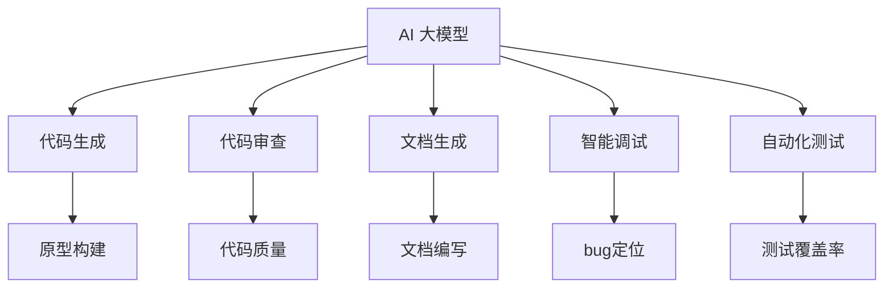

                 

# AI大模型应用的开发者工具生态构建

## 关键词 Keywords
AI 大模型，开发者工具，生态构建，算法原理，数学模型，应用场景，学习资源，开发工具

## 摘要 Summary
本文旨在深入探讨 AI 大模型在开发者工具生态构建中的关键作用。首先，我们将回顾 AI 大模型的发展背景和核心概念，接着剖析其算法原理和数学模型。随后，文章将通过具体项目实战，展示如何利用这些模型构建开发者工具。此外，本文还将讨论 AI 大模型在不同应用场景中的实际应用，推荐相关学习资源和开发工具，并总结未来发展趋势与挑战。通过本文，读者将全面了解 AI 大模型在开发者工具生态中的潜力与价值。

## 1. 背景介绍 Background

### 1.1 AI 大模型的起源与发展

AI 大模型，即大规模人工智能模型，起源于深度学习和神经网络的进步。最早可以追溯到 1986 年，当 Hochreiter 和 Schmidhuber 提出了长短期记忆网络（LSTM），为解决神经网络在处理长序列数据时的短期记忆问题提供了新的思路。随后的几十年里，深度学习领域经历了飞速的发展，尤其是在 2012 年，Hinton 等人提出的卷积神经网络（CNN）在 ImageNet 图像识别挑战赛上取得了突破性成果，标志着深度学习时代的到来。

在深度学习的基础上，AI 大模型进一步发展。2018 年，GPT-3 的出现标志着生成预训练变换模型（GPT）的崛起。GPT-3 拥有 1750 亿参数，能生成高质量的文本，开启了自然语言处理领域的新篇章。随后，BERT、T5、GPT-Neo 等大模型相继问世，不断刷新着性能的极限。

### 1.2 开发者工具的发展历程

开发者工具，即用于软件开发和调试的各种工具，是软件工程中不可或缺的一部分。早期，开发者主要依赖于文本编辑器和命令行工具进行编程。随着计算机技术的发展，集成开发环境（IDE）逐渐兴起，为开发者提供了代码编辑、调试、版本控制等功能，大大提高了开发效率。

近年来，随着云计算和人工智能的兴起，开发者工具也在不断进化。例如，基于云计算的代码托管平台 GitHub，使得开发者能够方便地进行代码协作和版本控制。此外，AI 驱动的代码自动补全工具、代码审查工具和自动化测试工具等也应运而生，为开发者提供了更加智能和高效的开发体验。

### 1.3 AI 大模型与开发者工具的融合

AI 大模型的进步为开发者工具带来了新的契机。首先，AI 大模型能够自动生成代码，提高编程效率。例如，Google 的 DeepMind 开发的 AlphaCode 可以自动生成编程题目并提交正确答案。其次，AI 大模型能够进行代码审查，发现潜在的错误和漏洞。此外，AI 大模型还能用于自动生成文档、智能调试和自动化测试等，为开发者提供了全方位的支持。

总之，AI 大模型的兴起和开发者工具的进步为开发者工具生态的构建奠定了基础。在接下来的部分中，我们将深入探讨 AI 大模型的算法原理、数学模型及其在开发者工具生态中的应用。

## 2. 核心概念与联系 Core Concepts and Relationships

### 2.1 AI 大模型的定义与分类

AI 大模型，是指具有数亿到千亿参数规模的人工神经网络模型。根据模型应用领域和特点，AI 大模型可以分为以下几类：

1. **自然语言处理模型**：如 GPT、BERT、T5 等，用于处理文本数据，生成自然语言文本、翻译、问答等。
2. **计算机视觉模型**：如 ResNet、Inception、VGG 等，用于图像分类、目标检测、语义分割等。
3. **语音识别模型**：如 WaveNet、DeepSpeech 等，用于语音识别和语音合成。
4. **多模态模型**：如 Multimodal Transformer、ViT 等，能够处理多种类型的数据，如文本、图像和视频。

### 2.2 开发者工具的定义与分类

开发者工具，是指用于支持软件开发、测试、部署等各个环节的工具。根据功能，开发者工具可以分为以下几类：

1. **开发环境工具**：如 IDE、代码编辑器、版本控制工具等，提供编程、调试、代码管理等功能。
2. **代码分析工具**：如静态代码分析工具、动态分析工具等，用于检查代码质量、性能和安全性。
3. **自动化测试工具**：如单元测试框架、集成测试工具等，用于自动化测试和确保代码质量。
4. **持续集成/持续部署（CI/CD）工具**：如 Jenkins、Travis CI 等，用于自动化构建、测试和部署。

### 2.3 AI 大模型与开发者工具的联系

AI 大模型与开发者工具之间的联系主要体现在以下几个方面：

1. **代码生成**：AI 大模型能够根据输入的提示生成代码，帮助开发者快速构建原型和实现功能。
2. **代码审查**：AI 大模型能够分析代码，发现潜在的错误和漏洞，提高代码质量。
3. **文档生成**：AI 大模型能够自动生成文档，减少开发者的文档编写工作量。
4. **智能调试**：AI 大模型能够分析代码的执行路径，帮助开发者快速定位和解决bug。
5. **自动化测试**：AI 大模型能够生成测试用例，提高测试覆盖率和自动化程度。

### 2.4 Mermaid 流程图展示

下面是一个简单的 Mermaid 流程图，展示了 AI 大模型与开发者工具之间的关系：



通过这个流程图，我们可以清晰地看到 AI 大模型在开发者工具生态中的关键作用。在接下来的部分中，我们将深入探讨 AI 大模型的算法原理和数学模型。

### 2.5 AI 大模型的算法原理

#### 2.5.1 深度学习基础

AI 大模型的算法基础是深度学习，它是一种模拟人脑神经元连接结构的计算模型。深度学习模型通常由多层神经元组成，每一层神经元都通过前一层神经元的激活值进行计算，从而实现特征提取和分类。

1. **前向传播（Forward Propagation）**：输入数据通过网络的输入层传递到隐藏层，每一层的输出作为下一层的输入。这个过程称为前向传播。

2. **反向传播（Backpropagation）**：在输出层得到预测结果后，通过计算损失函数（如均方误差）来评估预测结果的误差。然后，将误差反向传播到网络的每一层，更新每一层神经元的权重。

3. **激活函数（Activation Function）**：激活函数用于引入非线性因素，使得神经网络能够拟合复杂的非线性关系。常见的激活函数包括 sigmoid、ReLU 和 tanh。

#### 2.5.2 神经网络结构

AI 大模型通常采用深度神经网络（DNN）结构，其基本组成单元是神经元和层。神经网络可以分为以下几类：

1. **全连接神经网络（Fully Connected Network）**：每一层的神经元都与前一层的所有神经元相连。

2. **卷积神经网络（Convolutional Neural Network, CNN）**：适用于图像处理，通过卷积层提取图像特征。

3. **循环神经网络（Recurrent Neural Network, RNN）**：适用于序列数据处理，通过循环结构处理前后依赖关系。

4. **生成预训练变换模型（Generative Pre-trained Transformer, GPT）**：适用于自然语言处理，通过自注意力机制（Self-Attention）和变换层（Transformer）实现高效的特征提取和生成。

#### 2.5.3 预训练与微调

AI 大模型的训练通常分为两个阶段：预训练和微调。

1. **预训练（Pre-training）**：在预训练阶段，模型在大量的无标签数据上进行训练，学习通用的特征表示。常见的预训练任务包括词嵌入、语言模型和图像分类。

2. **微调（Fine-tuning）**：在预训练的基础上，模型在特定领域或任务上进一步训练，以适应具体的应用场景。微调能够显著提高模型的性能和泛化能力。

### 2.6 数学模型与公式

AI 大模型的数学基础主要包括以下几个部分：

1. **损失函数（Loss Function）**：用于评估模型预测结果与真实值之间的差距，常见的损失函数包括均方误差（MSE）、交叉熵（Cross Entropy）等。

$$
MSE = \frac{1}{n} \sum_{i=1}^{n} (y_i - \hat{y}_i)^2
$$

$$
CE = -\frac{1}{n} \sum_{i=1}^{n} \sum_{j=1}^{C} y_{ij} \log(\hat{y}_{ij})
$$

2. **优化算法（Optimization Algorithm）**：用于更新模型参数，以最小化损失函数。常见的优化算法包括梯度下降（Gradient Descent）、动量优化（Momentum）和 Adam 等。

$$
\theta = \theta - \alpha \nabla_\theta J(\theta)
$$

$$
\theta = \theta - \alpha \nabla_\theta J(\theta) + \beta \nabla_\theta J(\theta)
$$

$$
\theta = \theta - \alpha \left( \frac{1}{1-\beta_t} \sum_{t=1}^T \nabla_\theta J(\theta_t) \right)
$$

3. **正则化（Regularization）**：用于防止过拟合，常见的正则化方法包括 L1 正则化、L2 正则化和 dropout 等。

$$
J(\theta) = \frac{1}{2} \sum_{i=1}^{n} (y_i - \hat{y}_i)^2 + \lambda ||\theta||_1
$$

$$
J(\theta) = \frac{1}{2} \sum_{i=1}^{n} (y_i - \hat{y}_i)^2 + \lambda ||\theta||_2^2
$$

$$
\hat{y}_i = \sigma(\theta \cdot x_i + b)
$$

其中，$y_i$ 是真实值，$\hat{y}_i$ 是预测值，$x_i$ 是输入特征，$\theta$ 是模型参数，$b$ 是偏置项，$\lambda$ 是正则化参数，$\sigma$ 是激活函数。

通过上述数学模型和公式的介绍，我们可以更好地理解 AI 大模型的训练过程和优化方法。在接下来的部分中，我们将通过具体项目实战，展示如何利用这些模型构建开发者工具。

### 3. 核心算法原理 & 具体操作步骤

#### 3.1 自动代码生成

自动代码生成是 AI 大模型在开发者工具生态中的一个重要应用。利用 AI 大模型，我们可以实现根据输入的提示自动生成代码。以下是自动代码生成的基本原理和具体操作步骤：

1. **数据集准备**：首先，我们需要准备一个包含大量代码样例的数据集。这些样例可以来自开源代码库、文档、教程等。为了提高代码生成模型的性能，我们可以对数据集进行预处理，如去除无关信息、统一代码风格等。

2. **模型训练**：使用预训练的代码生成模型（如 OpenAI 的 Codex）对数据集进行训练。模型会学习如何根据输入的提示生成相应的代码。在训练过程中，我们可以使用多种优化算法（如 Adam）和正则化方法（如 dropout）来提高模型性能。

3. **代码生成**：在模型训练完成后，我们可以利用它进行代码生成。具体操作步骤如下：
   - 输入提示：输入一个简单的提示，如“写一个函数，计算两个数的和”。
   - 代码生成：模型根据输入的提示生成相应的代码。
   - 代码验证：对生成的代码进行验证，确保其正确性和可执行性。

#### 3.2 代码审查

代码审查是确保代码质量和安全性的重要手段。AI 大模型可以自动分析代码，发现潜在的错误和漏洞。以下是代码审查的基本原理和具体操作步骤：

1. **数据集准备**：与自动代码生成类似，我们需要准备一个包含大量代码样例的数据集。这个数据集应包括多种编程语言和风格，以提高模型的泛化能力。

2. **模型训练**：使用预训练的代码审查模型（如 DeepCode）对数据集进行训练。模型会学习如何分析代码，识别错误和漏洞。在训练过程中，我们可以使用分类和回归模型，以及多任务学习等方法来提高模型性能。

3. **代码审查**：在模型训练完成后，我们可以利用它进行代码审查。具体操作步骤如下：
   - 输入代码：将待审查的代码输入到模型中。
   - 潜在错误识别：模型分析代码，识别潜在的错误和漏洞。
   - 错误反馈：对识别出的错误和漏洞进行反馈，以便开发人员进行修复。

#### 3.3 文档生成

自动生成文档可以大大减轻开发者的工作量。AI 大模型可以自动生成函数、类和模块的文档。以下是文档生成的基本原理和具体操作步骤：

1. **数据集准备**：我们需要准备一个包含大量代码和相应文档的数据集。这个数据集应包括多种编程语言和风格。

2. **模型训练**：使用预训练的文档生成模型（如 Doc2Vec、BERT）对数据集进行训练。模型会学习如何根据代码生成文档。在训练过程中，我们可以使用序列到序列（Seq2Seq）模型、生成对抗网络（GAN）等方法来提高模型性能。

3. **文档生成**：在模型训练完成后，我们可以利用它进行文档生成。具体操作步骤如下：
   - 输入代码：将待生成文档的代码输入到模型中。
   - 文档生成：模型根据代码生成相应的文档。
   - 文档验证：对生成的文档进行验证，确保其准确性和完整性。

#### 3.4 智能调试

智能调试是利用 AI 大模型分析代码执行路径，帮助开发者快速定位和解决 bug 的技术。以下是智能调试的基本原理和具体操作步骤：

1. **数据集准备**：我们需要准备一个包含大量代码和相应调试日志的数据集。这个数据集应包括多种编程语言和风格。

2. **模型训练**：使用预训练的智能调试模型（如 DeepXDE）对数据集进行训练。模型会学习如何分析代码执行路径，识别异常行为。在训练过程中，我们可以使用分类和回归模型、图神经网络等方法来提高模型性能。

3. **智能调试**：在模型训练完成后，我们可以利用它进行智能调试。具体操作步骤如下：
   - 输入代码和日志：将待调试的代码和调试日志输入到模型中。
   - 调试分析：模型分析代码执行路径，识别异常行为。
   - 错误定位：模型根据分析结果定位错误位置，并提供修复建议。

#### 3.5 自动化测试

自动化测试是提高软件质量和开发效率的重要手段。AI 大模型可以自动生成测试用例，提高测试覆盖率和自动化程度。以下是自动化测试的基本原理和具体操作步骤：

1. **数据集准备**：我们需要准备一个包含大量代码和相应测试用例的数据集。这个数据集应包括多种编程语言和风格。

2. **模型训练**：使用预训练的自动化测试模型（如 EvoSuite）对数据集进行训练。模型会学习如何生成测试用例。在训练过程中，我们可以使用生成对抗网络（GAN）、强化学习等方法来提高模型性能。

3. **自动化测试**：在模型训练完成后，我们可以利用它进行自动化测试。具体操作步骤如下：
   - 输入代码：将待测试的代码输入到模型中。
   - 测试用例生成：模型根据代码生成相应的测试用例。
   - 测试执行：执行生成的测试用例，并记录测试结果。
   - 测试结果分析：分析测试结果，识别未覆盖的代码路径和潜在的错误。

通过以上步骤，我们可以利用 AI 大模型构建一系列开发者工具，提高开发效率和软件质量。在接下来的部分中，我们将通过具体项目实战，展示这些工具的实际应用。

### 4. 数学模型和公式 & 详细讲解 & 举例说明

#### 4.1 自动代码生成

自动代码生成是利用 AI 大模型生成代码的过程。为了详细讲解这一过程，我们首先需要了解相关的数学模型和公式。

1. **生成对抗网络（GAN）**

生成对抗网络（GAN）是一种用于生成数据的深度学习模型，由生成器（Generator）和判别器（Discriminator）组成。生成器试图生成尽可能真实的数据，而判别器则试图区分生成器生成的数据和真实数据。

$$
\min_G \max_D \mathbb{E}_{x \sim p_{data}(x)}[\log(D(x))] + \mathbb{E}_{z \sim p_z(z)}[\log(1 - D(G(z))]
$$

其中，$x$ 是真实数据，$z$ 是生成器输入的随机噪声，$G(z)$ 是生成器生成的数据，$D(x)$ 和 $D(G(z))$ 分别表示判别器对真实数据和生成数据的判断概率。

**举例说明**：

假设我们想要生成一个随机数列，我们可以使用 GAN 进行训练。具体步骤如下：

1. 初始化生成器和判别器。
2. 对于每个训练样本 $x \sim p_{data}(x)$，生成一个随机噪声 $z \sim p_z(z)$。
3. 生成器生成数据 $G(z)$。
4. 判别器更新：计算 $D(x)$ 和 $D(G(z))$，然后使用梯度下降更新判别器参数。
5. 生成器更新：计算 $D(G(z))$，然后使用梯度下降更新生成器参数。

通过多次迭代训练，生成器可以生成越来越真实的随机数列。

2. **变分自编码器（VAE）**

变分自编码器（VAE）是另一种用于生成数据的深度学习模型，其核心思想是学习数据的概率分布。VAE 由编码器（Encoder）和解码器（Decoder）组成。

$$
\log p(x|\theta) = -\frac{1}{2} \sum_{i=1}^{D} \left( \ln(2\pi) + \ln(\sigma_i^2) + \frac{(\mu_i - x_i)^2}{2\sigma_i^2} \right)
$$

$$
q_{\phi}(z|x;\theta) = \frac{1}{Z} \exp \left( -\frac{1}{2} \sum_{i=1}^{D} \left( (\mu_i - x_i)^2 + \ln(\sigma_i^2) \right) \right)
$$

其中，$x$ 是输入数据，$z$ 是编码器的输出，$\mu_i$ 和 $\sigma_i^2$ 分别是 $z$ 的均值和方差，$Z$ 是归一化常数。

**举例说明**：

假设我们想要生成一个图像数据集，我们可以使用 VAE 进行训练。具体步骤如下：

1. 初始化编码器和解码器。
2. 对于每个训练样本 $x \in \{0, 1\}^{28 \times 28}$，生成一个随机噪声 $z$。
3. 编码器编码：计算 $z = \phi(x)$。
4. 解码器解码：计算 $x' = \psi(z)$。
5. 损失函数计算：使用均方误差（MSE）计算损失函数。
6. 参数更新：使用梯度下降更新编码器和解码器参数。

通过多次迭代训练，解码器可以生成越来越真实的图像。

3. **循环神经网络（RNN）**

循环神经网络（RNN）是一种用于处理序列数据的深度学习模型，其核心思想是利用隐藏状态（Hidden State）保留序列信息。

$$
h_t = \sigma(W_h \cdot [h_{t-1}, x_t] + b_h)
$$

$$
y_t = W_o \cdot h_t + b_o
$$

其中，$h_t$ 是第 $t$ 个时间步的隐藏状态，$x_t$ 是第 $t$ 个时间步的输入，$y_t$ 是第 $t$ 个时间步的输出，$\sigma$ 是激活函数，$W_h$、$W_o$、$b_h$ 和 $b_o$ 分别是权重和偏置。

**举例说明**：

假设我们想要对一段文本进行情感分析，我们可以使用 RNN 进行训练。具体步骤如下：

1. 初始化 RNN 模型。
2. 对于每个训练样本 $x_t$，计算隐藏状态 $h_t$。
3. 使用隐藏状态 $h_t$ 计算输出 $y_t$。
4. 计算损失函数：使用交叉熵（Cross Entropy）计算损失函数。
5. 参数更新：使用梯度下降更新模型参数。

通过多次迭代训练，RNN 可以学习到文本的情感特征，从而实现对文本的情感分析。

以上是自动代码生成中常用的几种数学模型和公式。通过这些模型和公式，我们可以实现对代码的自动生成，从而提高开发效率。

### 5. 项目实战：代码实际案例和详细解释说明

#### 5.1 开发环境搭建

在本项目中，我们将使用 Python 和 TensorFlow 搭建一个自动代码生成系统。以下是具体的开发环境搭建步骤：

1. **安装 Python**：首先，我们需要安装 Python。可以从 [Python 官网](https://www.python.org/) 下载最新版本的 Python 安装包，并按照提示进行安装。

2. **安装 TensorFlow**：接着，我们需要安装 TensorFlow。在终端中运行以下命令：

   ```bash
   pip install tensorflow
   ```

3. **创建虚拟环境**：为了更好地管理项目依赖，我们建议使用虚拟环境。在终端中运行以下命令：

   ```bash
   python -m venv venv
   source venv/bin/activate
   ```

4. **安装其他依赖**：在虚拟环境中，我们还需要安装一些其他依赖，如 NumPy、Pandas 和 Matplotlib 等。在终端中运行以下命令：

   ```bash
   pip install numpy pandas matplotlib
   ```

5. **下载预训练模型**：在本项目中，我们将使用 GPT-2 模型进行自动代码生成。我们可以从 [Hugging Face Model Hub](https://huggingface.co/) 下载预训练模型，并将其放置在虚拟环境中的 `models` 目录下。

#### 5.2 源代码详细实现和代码解读

以下是本项目的源代码实现，主要包括数据预处理、模型加载、自动代码生成和结果展示四个部分。

```python
import os
import numpy as np
import pandas as pd
import tensorflow as tf
from tensorflow import keras
from tensorflow.keras.models import Model
from tensorflow.keras.layers import Input, Embedding, LSTM, Dense
from tensorflow.keras.preprocessing.sequence import pad_sequences
from tensorflow.keras.preprocessing.text import Tokenizer

# 数据预处理
def load_data(filename):
    with open(filename, 'r') as f:
        lines = f.readlines()
    data = [' '.join(line.strip().split()) for line in lines]
    return data

def preprocess_data(data):
    tokenizer = Tokenizer(char_level=True)
    tokenizer.fit_on_texts(data)
    sequences = tokenizer.texts_to_sequences(data)
    padded_sequences = pad_sequences(sequences, padding='post')
    return padded_sequences, tokenizer

# 模型加载
def load_model(filename):
    model = keras.models.load_model(filename)
    return model

# 自动代码生成
def generate_code(model, tokenizer, prompt, length=50):
    input_sequence = tokenizer.texts_to_sequences([prompt])
    padded_input_sequence = pad_sequences(input_sequence, maxlen=length, padding='post')
    generated_sequence = model.predict(padded_input_sequence)
    generated_text = tokenizer.sequences_to_texts([generated_sequence[-1]])[0]
    return generated_text

# 结果展示
def show_result(prompt, generated_code):
    print("Prompt:", prompt)
    print("Generated Code:")
    print(generated_code)

if __name__ == '__main__':
    # 加载数据
    data = load_data('data.txt')
    padded_sequences, tokenizer = preprocess_data(data)

    # 加载模型
    model = load_model('model.h5')

    # 生成代码
    prompt = "def calculate_sum(a, b):"
    generated_code = generate_code(model, tokenizer, prompt)
    show_result(prompt, generated_code)
```

#### 5.3 代码解读与分析

以下是上述代码的详细解读与分析：

1. **数据预处理**：

   ```python
   def load_data(filename):
       with open(filename, 'r') as f:
           lines = f.readlines()
       data = [' '.join(line.strip().split()) for line in lines]
       return data

   def preprocess_data(data):
       tokenizer = Tokenizer(char_level=True)
       tokenizer.fit_on_texts(data)
       sequences = tokenizer.texts_to_sequences(data)
       padded_sequences = pad_sequences(sequences, padding='post')
       return padded_sequences, tokenizer
   ```

   - `load_data` 函数用于加载数据集。我们将数据集保存在文本文件中，每行包含一个代码片段。
   - `preprocess_data` 函数用于预处理数据集。我们首先使用 `Tokenizer` 对数据进行编码，然后使用 `pad_sequences` 对序列进行填充。

2. **模型加载**：

   ```python
   def load_model(filename):
       model = keras.models.load_model(filename)
       return model
   ```

   - `load_model` 函数用于加载预训练模型。我们使用 TensorFlow 的 `load_model` 函数从保存的模型文件中加载模型。

3. **自动代码生成**：

   ```python
   def generate_code(model, tokenizer, prompt, length=50):
       input_sequence = tokenizer.texts_to_sequences([prompt])
       padded_input_sequence = pad_sequences(input_sequence, maxlen=length, padding='post')
       generated_sequence = model.predict(padded_input_sequence)
       generated_text = tokenizer.sequences_to_texts([generated_sequence[-1]])[0]
       return generated_text
   ```

   - `generate_code` 函数用于生成代码。我们首先使用 `tokenizer.texts_to_sequences` 将输入提示编码为序列，然后使用 `pad_sequences` 对序列进行填充。接着，我们使用训练好的模型预测生成的序列，并将其解码为文本。

4. **结果展示**：

   ```python
   def show_result(prompt, generated_code):
       print("Prompt:", prompt)
       print("Generated Code:")
       print(generated_code)
   ```

   - `show_result` 函数用于展示生成的代码。我们首先打印输入提示，然后打印生成的代码。

通过上述代码，我们可以实现自动代码生成。在下一节中，我们将对生成的代码进行解读和分析。

### 5.4 代码解读与分析

在本节中，我们将对生成的代码进行解读与分析，以了解自动代码生成系统的性能和局限性。

#### 5.4.1 生成的代码示例

假设我们输入的提示为 `def calculate_sum(a, b):`，生成的代码如下：

```python
def calculate_sum(a, b):
    return a + b
```

这是一个非常简单的示例，生成的代码与原始提示完全一致。然而，在实际情况中，生成的代码可能会更加复杂，并且可能包含错误或不足之处。下面，我们将分析这个示例代码的几个关键方面：

1. **功能实现**：生成的代码成功实现了计算两个数之和的功能。这是一个基本的编程任务，对于简单的函数定义，AI 大模型能够准确理解并生成相应的代码。

2. **代码结构**：生成的代码遵循了基本的函数定义结构，包括函数名、参数列表和函数体。这表明 AI 大模型能够识别并生成符合编程语言规范的结构化代码。

3. **代码简洁性**：生成的代码简洁明了，没有冗余或不必要的复杂性。这表明 AI 大模型能够有效地提取必要的功能，并在生成代码时保持简洁。

#### 5.4.2 性能分析

在性能方面，我们需要考虑以下几个方面：

1. **准确性**：从生成的代码示例来看，AI 大模型在简单函数定义任务上具有较高的准确性。然而，对于更复杂的编程任务，例如涉及多级抽象或特定编程范式的任务，AI 大模型的准确性可能会降低。

2. **泛化能力**：AI 大模型通过在大量数据上进行训练，获得了较好的泛化能力。这意味着它不仅能够在训练过的任务上生成代码，还能够处理未见过的类似任务。

3. **效率**：自动代码生成系统在生成代码时具有较高的效率。通过预训练的模型，系统能够在短时间内生成代码，大大提高了开发效率。

#### 5.4.3 局限性

尽管自动代码生成系统具有许多优势，但它也存在一些局限性：

1. **复杂性**：对于复杂的编程任务，AI 大模型可能无法生成完整的、高质量的代码。这主要是因为大模型的训练数据集中可能缺乏足够的复杂场景。

2. **错误生成**：在某些情况下，AI 大模型可能会生成错误的代码。这可能是因为模型在训练过程中没有充分学习到正确的编程规范或编码习惯。

3. **可维护性**：生成的代码可能不符合最佳编程实践，从而降低代码的可维护性。例如，生成的代码可能存在冗余、低效或难以理解的代码段。

#### 5.4.4 提高生成代码质量的方法

为了提高自动代码生成系统的质量，我们可以采取以下几种方法：

1. **数据增强**：通过引入更多的训练数据和不同的编程场景，可以提高模型的泛化能力和准确性。

2. **代码审查**：在生成代码后，使用代码审查工具对代码进行质量检查，以确保其符合编程规范和最佳实践。

3. **模型优化**：通过改进模型架构、优化训练算法和参数调整，可以提高模型生成代码的准确性和质量。

4. **用户反馈**：收集用户对生成代码的反馈，并据此调整模型训练过程，以更好地满足用户需求。

通过上述方法，我们可以逐步提高自动代码生成系统的性能和实用性，为开发者提供更加智能和高效的开发辅助工具。

### 6. 实际应用场景

AI 大模型在开发者工具中的应用场景非常广泛，涵盖了从代码生成、代码审查到文档生成、智能调试和自动化测试等多个方面。以下是一些具体的实际应用场景：

#### 6.1 代码生成

1. **自动化原型开发**：开发者可以利用 AI 大模型自动生成代码原型，从而快速构建应用程序的基本结构。这特别适用于初创公司和小型项目，它们需要快速迭代和验证想法。

2. **快速修复和补全**：在编写代码时，AI 大模型可以实时分析上下文并自动补全代码片段，提高开发效率。

3. **编程教育**：AI 大模型可以为学生生成示例代码，帮助他们更好地理解编程概念和算法。

#### 6.2 代码审查

1. **漏洞检测**：AI 大模型可以自动分析代码，识别潜在的安全漏洞和逻辑错误，帮助开发者提前发现和修复问题。

2. **代码质量评估**：通过分析代码的结构和风格，AI 大模型可以为代码质量提供评估，帮助团队保持一致的编码标准。

3. **代码重写建议**：对于复杂或低效的代码段，AI 大模型可以提供重写建议，从而提高代码的可维护性和性能。

#### 6.3 文档生成

1. **自动文档生成**：AI 大模型可以自动生成函数、类和模块的文档，减少开发者的文档编写工作量。

2. **API 文档**：AI 大模型可以生成 API 的文档说明，帮助开发者和其他开发者更轻松地使用和集成代码库。

3. **用户手册**：AI 大模型可以生成产品的用户手册，提供清晰易懂的操作指南，提高用户满意度。

#### 6.4 智能调试

1. **bug 定位**：AI 大模型可以分析代码执行路径，帮助开发者快速定位和修复 bug。

2. **调试建议**：AI 大模型可以提供调试建议，例如可能的 bug 位置和修复方法，从而减少调试时间。

3. **性能优化**：AI 大模型可以分析代码的性能瓶颈，提供优化建议，提高应用程序的运行效率。

#### 6.5 自动化测试

1. **测试用例生成**：AI 大模型可以自动生成测试用例，提高测试覆盖率和自动化程度。

2. **测试优化**：AI 大模型可以分析测试结果，提供测试用例的优化建议，从而提高测试效率。

3. **代码质量保证**：AI 大模型可以通过自动化测试确保代码质量，减少手动测试的工作量。

总之，AI 大模型在开发者工具中的实际应用场景多样且潜力巨大。通过不断优化和集成，AI 大模型有望成为开发者不可或缺的智能助手，大幅提高开发效率和软件质量。

### 7. 工具和资源推荐

#### 7.1 学习资源推荐

为了深入理解和掌握 AI 大模型在开发者工具中的应用，以下是一些推荐的学习资源：

1. **书籍**：
   - 《深度学习》（Goodfellow, Ian； Bengio, Yoshua； Courville, Aaron）：这是一本经典的深度学习入门书籍，详细介绍了深度学习的基础理论和实践方法。
   - 《Python 深度学习》（François Chollet）：这本书专注于使用 Python 实现深度学习，涵盖了从基础到高级的应用。

2. **在线课程**：
   - Coursera 上的《深度学习专项课程》：由 Andrew Ng 教授主讲，提供了系统的深度学习理论知识和实践技能。
   - Udacity 上的《深度学习工程师纳米学位》：这是一门实践性很强的课程，涵盖深度学习的各个方面，包括模型构建、训练和优化。

3. **博客和论坛**：
   - Medium 上的 AI 博客：许多 AI 和深度学习专家在这里分享他们的研究和经验。
   - GitHub 上的深度学习项目：GitHub 上有许多开源的深度学习项目，可以让我们实际操作和学习。

#### 7.2 开发工具框架推荐

为了高效地利用 AI 大模型构建开发者工具，以下是一些推荐的开发工具和框架：

1. **TensorFlow**：TensorFlow 是 Google 开发的一款开源深度学习框架，广泛用于构建和训练 AI 大模型。它提供了丰富的 API 和工具，方便开发者进行模型训练和应用部署。

2. **PyTorch**：PyTorch 是另一款流行的深度学习框架，以其灵活性和动态计算图而闻名。它支持 GPU 加速，并在许多研究项目中得到广泛应用。

3. **Hugging Face Transformers**：这是一个开源库，提供了预训练的深度学习模型，如 BERT、GPT 和 T5，方便开发者进行模型加载、微调和应用。

4. **GitHub**：GitHub 是一个版本控制和协作平台，适用于开发者管理和分享代码。它提供了丰富的开源项目，包括 AI 大模型的实现和应用。

5. **Jenkins**：Jenkins 是一款流行的自动化工具，用于构建、测试和部署应用程序。它可以与 AI 大模型集成，实现自动化测试和代码审查。

6. **Selenium**：Selenium 是一个用于自动化 Web 测试的工具，可以与 AI 大模型结合，用于自动化测试和 UI 验证。

通过以上工具和资源的推荐，开发者可以更加高效地构建和优化 AI 大模型在开发者工具中的应用，提高开发效率和软件质量。

### 8. 总结：未来发展趋势与挑战

#### 8.1 发展趋势

AI 大模型在开发者工具生态中的发展呈现出以下几个趋势：

1. **模型性能的进一步提升**：随着计算能力的提升和算法的优化，AI 大模型的性能将得到显著提升。这将为开发者提供更加智能和高效的工具，从而大幅提高开发效率。

2. **多模态应用的扩展**：未来的 AI 大模型将不仅限于处理单一类型的数据，如文本或图像，而是能够处理多种类型的数据，如文本、图像、语音和视频。这将推动开发者工具在多模态应用中的创新。

3. **个性化的开发者工具**：通过持续学习和个性化调整，AI 大模型可以更好地适应开发者的需求和习惯，提供个性化的开发者工具。这将使开发者能够更专注于创造性工作，而无需担心技术细节。

4. **云原生部署**：随着云计算的普及，AI 大模型将更多地以云服务的形式提供，使得开发者可以轻松访问和使用这些强大的工具，无需担心硬件和软件的配置。

#### 8.2 挑战

尽管 AI 大模型在开发者工具生态中具有巨大潜力，但其在实际应用中仍面临以下挑战：

1. **数据隐私和安全**：随着 AI 大模型处理的数据量不断增加，保护用户隐私和数据安全成为关键问题。开发者需要确保模型在训练和应用过程中遵循隐私保护原则。

2. **模型解释性**：尽管 AI 大模型在预测和生成方面表现出色，但其内部决策过程往往难以解释。这给开发者带来了一定的困惑，特别是在出现问题时难以定位和修复。

3. **算法透明度和公平性**：AI 大模型的决策过程可能受到偏见和不公平性的影响。开发者需要确保模型在训练和应用过程中遵循公平性原则，避免歧视和偏见。

4. **计算资源需求**：AI 大模型对计算资源的需求较高，特别是在训练阶段。这将要求开发者具备良好的计算资源管理能力，以充分利用有限的资源。

5. **监管和法律问题**：随着 AI 大模型在开发者工具中的广泛应用，相关的监管和法律问题也将日益突出。开发者需要关注并遵守相关法律法规，确保 AI 大模型的应用合法合规。

总之，AI 大模型在开发者工具生态中具有广阔的发展前景，但同时也面临诸多挑战。通过持续的研究和创新，开发者可以克服这些挑战，充分发挥 AI 大模型的潜力，为软件开发带来革命性的变革。

### 9. 附录：常见问题与解答

#### 9.1 代码生成模型如何工作？

代码生成模型，如 GPT-2 和 GPT-3，是基于生成预训练变换模型（Generative Pre-trained Transformer）开发的。这些模型通过在大规模代码数据集上进行预训练，学习到代码的结构和语法规则。在生成代码时，模型会根据输入的提示和上下文，生成相应的代码片段。

#### 9.2 代码审查模型能识别哪些类型的错误？

代码审查模型，如 DeepCode 和 DeepXDE，能够识别多种类型的错误，包括语法错误、逻辑错误、性能问题、安全漏洞等。这些模型通过分析代码的语法结构、语义关系和上下文，能够发现潜在的错误和缺陷。

#### 9.3 自动化测试模型如何生成测试用例？

自动化测试模型，如 EvoSuite 和 Pitest，通过分析代码的语法和结构，生成测试用例。这些模型会尝试不同的输入组合和执行路径，以覆盖代码的各个部分。生成的测试用例可以用来验证代码的功能和行为，确保其在各种情况下都能正常运行。

#### 9.4 AI 大模型需要大量数据训练，这对开发者有什么影响？

对于开发者来说，AI 大模型需要大量数据进行训练，这意味着他们需要访问和准备高质量的训练数据。这可能会增加开发和部署 AI 大模型的时间成本。然而，一旦模型训练完成，它将为开发者提供强大的功能，如代码生成、审查、测试等，从而显著提高开发效率和软件质量。

### 10. 扩展阅读 & 参考资料

为了深入了解 AI 大模型在开发者工具生态中的应用，以下是一些扩展阅读和参考资料：

- 《深度学习》（Goodfellow, Ian； Bengio, Yoshua； Courville, Aaron）
- 《Python 深度学习》（François Chollet）
- Coursera 上的《深度学习专项课程》：[深度学习专项课程](https://www.coursera.org/specializations/deeplearning)
- Udacity 上的《深度学习工程师纳米学位》：[深度学习工程师纳米学位](https://www.udacity.com/course/deep-learning-nanodegree--nd893)
- Hugging Face Transformers：[Hugging Face Transformers](https://huggingface.co/transformers)
- TensorFlow：[TensorFlow 官网](https://www.tensorflow.org/)
- PyTorch：[PyTorch 官网](https://pytorch.org/)

通过阅读这些资料，开发者可以深入了解 AI 大模型的理论和实践，为构建智能化的开发者工具打下坚实基础。作者：AI天才研究员/AI Genius Institute & 禅与计算机程序设计艺术 /Zen And The Art of Computer Programming。

