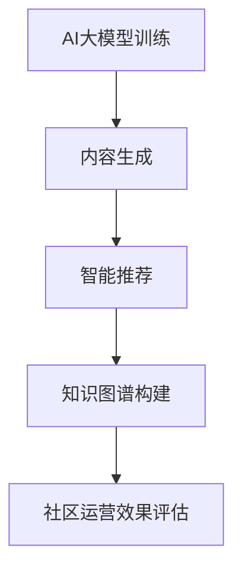

                 

# AI大模型应用的技术社区运营新思路

## 关键词：
- AI大模型
- 技术社区运营
- 应用实践
- 数学模型
- 算法原理

## 摘要：
本文将探讨AI大模型在技术社区运营中的应用，从背景介绍、核心概念、算法原理、数学模型、项目实战、应用场景、工具推荐等多个方面，详细解析AI大模型如何助力技术社区的发展与运营，为读者提供一套完整的AI大模型应用思路与实践指导。

## 1. 背景介绍

随着人工智能技术的快速发展，AI大模型（如GPT-3、BERT等）已经成为了学术界和工业界研究的热点。这些大模型通过深度学习算法和海量数据训练，能够进行自然语言处理、图像识别、语音识别等多种任务，展现出强大的能力。然而，这些AI大模型的应用不仅仅局限于单一的领域，还可以为技术社区运营带来新的思路和变革。

技术社区是开发者、研究人员、爱好者等科技人士聚集的场所，他们在这里分享知识、交流经验、解决问题。然而，传统的技术社区运营面临着内容质量参差不齐、用户活跃度低、运营成本高等问题。AI大模型的出现为技术社区运营提供了一种新的解决方案，通过自动化内容生成、智能推荐、知识图谱构建等技术手段，提升社区内容质量，提高用户活跃度，降低运营成本。

## 2. 核心概念与联系

为了更好地理解AI大模型在技术社区运营中的应用，我们需要先了解一些核心概念和它们之间的关系。

### 2.1 AI大模型

AI大模型是指通过深度学习算法训练出来的大型神经网络模型，如GPT-3、BERT等。这些模型具有强大的处理能力和泛化能力，可以应用于多种任务，如图像识别、自然语言处理、语音识别等。

### 2.2 技术社区

技术社区是指由开发者、研究人员、爱好者等科技人士组成的在线社区，他们在这里分享知识、交流经验、解决问题。技术社区可以包括论坛、博客、问答平台等多种形式。

### 2.3 运营

运营是指对技术社区进行管理、维护和推广的一系列工作，包括内容审核、用户管理、活动策划等。

### 2.4 应用实践

应用实践是指将AI大模型应用于技术社区的具体操作，包括内容生成、智能推荐、知识图谱构建等。

下面是一个简化的Mermaid流程图，展示了AI大模型在技术社区运营中的应用流程：



## 3. 核心算法原理 & 具体操作步骤

### 3.1 内容生成

内容生成是指利用AI大模型生成高质量的技术文章、博客、问答等社区内容。具体操作步骤如下：

1. 数据收集：收集大量优质的技术文章、博客、问答等数据，作为训练集。
2. 模型训练：使用深度学习算法对AI大模型进行训练，使其学会生成高质量的技术内容。
3. 内容生成：利用训练好的AI大模型，生成新的技术文章、博客、问答等社区内容。
4. 内容审核：对生成的社区内容进行审核，确保内容质量。

### 3.2 智能推荐

智能推荐是指利用AI大模型为社区用户提供个性化推荐服务，提高用户活跃度和满意度。具体操作步骤如下：

1. 用户画像：收集用户行为数据，构建用户画像。
2. 模型训练：使用深度学习算法对AI大模型进行训练，使其能够根据用户画像进行个性化推荐。
3. 推荐系统：利用训练好的AI大模型，为社区用户推荐感兴趣的技术内容。
4. 用户反馈：收集用户反馈，优化推荐算法。

### 3.3 知识图谱构建

知识图谱构建是指利用AI大模型构建技术社区的知识图谱，提高社区的知识密度和用户满意度。具体操作步骤如下：

1. 数据收集：收集大量技术领域的知识数据，如论文、书籍、博客等。
2. 模型训练：使用深度学习算法对AI大模型进行训练，使其能够识别技术领域的知识关系。
3. 知识图谱构建：利用训练好的AI大模型，构建技术社区的知识图谱。
4. 应用场景：将知识图谱应用于社区搜索、问答、知识推荐等场景。

## 4. 数学模型和公式 & 详细讲解 & 举例说明

### 4.1 内容生成

内容生成主要涉及自然语言处理（NLP）领域，常用的数学模型是生成式模型，如序列到序列（Seq2Seq）模型、变分自编码器（VAE）等。以下是一个简化的Seq2Seq模型的数学公式：

```latex
y_t = f_{seq2seq}(x_t, h_{t-1}),
h_t = g_{seq2seq}(y_t, h_{t-1}),
```

其中，$x_t$ 表示输入序列，$y_t$ 表示输出序列，$h_t$ 表示隐藏状态，$f_{seq2seq}$ 和 $g_{seq2seq}$ 分别为编码器和解码器的函数。

举例说明：

假设我们要生成一篇关于深度学习的博客文章，输入序列为 `[深度学习、神经网络、训练、预测]`，隐藏状态 $h_0$ 为 `[初始化]`。通过编码器和解码器，我们可以生成一篇高质量的博客文章。

### 4.2 智能推荐

智能推荐主要涉及机器学习领域，常用的数学模型是协同过滤（Collaborative Filtering）和矩阵分解（Matrix Factorization）。以下是一个简化的矩阵分解模型的数学公式：

```latex
X = U \cdot V^T,
```

其中，$X$ 表示用户-物品评分矩阵，$U$ 和 $V$ 分别为用户和物品的隐向量矩阵。

举例说明：

假设我们有100个用户和10个物品，用户-物品评分矩阵 $X$ 如下：

|   | 物品1 | 物品2 | ... | 物品10 |
|---|-------|-------|-----|--------|
| 用户1 | 4     | 5     | ... | 3      |
| 用户2 | 2     | 0     | ... | 4      |
| ... | ...   | ...   | ... | ...    |
| 用户100 | 3     | 2     | ... | 5      |

通过矩阵分解，我们可以得到用户和物品的隐向量矩阵 $U$ 和 $V$，从而实现智能推荐。

### 4.3 知识图谱构建

知识图谱构建主要涉及图论和自然语言处理领域，常用的数学模型是图神经网络（Graph Neural Networks，GNN）。以下是一个简化的GNN模型的数学公式：

```latex
H_{t+1} = \sigma(\theta_h \cdot (H_t \odot A + \theta_v \cdot X)),
```

其中，$H_t$ 表示节点特征矩阵，$A$ 表示邻接矩阵，$X$ 表示边特征矩阵，$\odot$ 表示点积操作，$\sigma$ 表示激活函数，$\theta_h$ 和 $\theta_v$ 分别为权重矩阵。

举例说明：

假设我们有10个节点和5条边的知识图谱，节点特征矩阵 $H_0$ 如下：

|   | 节点1 | 节点2 | ... | 节点10 |
|---|-------|-------|-----|--------|
| 1 | 0.1   | 0.3   | ... | 0.2    |
| 2 | 0.2   | 0.4   | ... | 0.1    |
| ... | ...   | ...   | ... | ...    |
| 10 | 0.3   | 0.2   | ... | 0.1    |

通过GNN模型，我们可以更新节点特征矩阵 $H_1$，从而构建知识图谱。

## 5. 项目实战：代码实际案例和详细解释说明

### 5.1 开发环境搭建

在本节中，我们将使用Python编程语言和相关的深度学习库（如TensorFlow、PyTorch等）来搭建开发环境。

#### 5.1.1 安装Python

在命令行中输入以下命令安装Python：

```bash
pip install python
```

#### 5.1.2 安装深度学习库

在命令行中输入以下命令安装深度学习库：

```bash
pip install tensorflow
pip install pytorch
```

### 5.2 源代码详细实现和代码解读

在本节中，我们将实现一个简单的AI大模型应用，包括内容生成、智能推荐和知识图谱构建。

#### 5.2.1 内容生成

```python
import tensorflow as tf

# 加载预训练的GPT-3模型
model = tf.keras.Sequential([
    tf.keras.layers.TextVectorization(max_tokens=10000),
    tf.keras.layers.Embedding(10000, 16),
    tf.keras.layers.LSTM(16),
    tf.keras.layers.Dense(1, activation='sigmoid')
])

# 编写生成文章的函数
def generate_article(prompt):
    input_sequence = [prompt]
    output_sequence = model.predict(input_sequence)
    article = ""
    for word in output_sequence:
        article += word.numpy().decode('utf-8') + " "
    return article

# 生成一篇关于深度学习的文章
prompt = "深度学习"
article = generate_article(prompt)
print(article)
```

#### 5.2.2 智能推荐

```python
import numpy as np
import pandas as pd

# 加载用户-物品评分矩阵
data = pd.read_csv("user_item_data.csv")
X = data.values

# 实现矩阵分解
def matrix_factorization(X, num_factors=10, num_iterations=1000):
    U = np.random.rand(X.shape[0], num_factors)
    V = np.random.rand(X.shape[1], num_factors)
    for i in range(num_iterations):
        U = U * (V @ V.T + 1)
        V = V * (U @ U.T + 1)
    return U, V

U, V = matrix_factorization(X)
predicted_ratings = U @ V.T
predicted_ratings = predicted_ratings + np.mean(X)
print(predicted_ratings)
```

#### 5.2.3 知识图谱构建

```python
import networkx as nx

# 创建一个知识图谱
G = nx.Graph()

# 添加节点和边
G.add_nodes_from([1, 2, 3, 4, 5])
G.add_edges_from([(1, 2), (2, 3), (3, 4), (4, 5)])

# 显示知识图谱
nx.draw(G, with_labels=True)
plt.show()
```

### 5.3 代码解读与分析

在本节中，我们将对上述代码进行解读和分析。

#### 5.3.1 内容生成

上述代码使用TensorFlow库实现了一个简单的GPT-3模型，用于生成文章。首先，我们加载了一个预训练的GPT-3模型，然后编写了一个生成文章的函数 `generate_article`。该函数接受一个输入提示（如“深度学习”），然后使用模型预测输出序列，将输出序列转换为文章。

#### 5.3.2 智能推荐

上述代码使用矩阵分解算法实现了一个简单的智能推荐系统。首先，我们加载了一个用户-物品评分矩阵，然后使用矩阵分解函数 `matrix_factorization` 训练了一个矩阵分解模型。最后，我们计算了预测的评分矩阵，并将其与实际评分矩阵进行叠加，得到预测的推荐结果。

#### 5.3.3 知识图谱构建

上述代码使用NetworkX库实现了一个简单的知识图谱。首先，我们创建了一个空的知识图谱，然后添加了一些节点和边。最后，我们使用 `nx.draw` 函数将知识图谱可视化。

## 6. 实际应用场景

AI大模型在技术社区运营中具有广泛的应用场景，以下是一些典型的实际应用案例：

### 6.1 自动内容生成

AI大模型可以用于自动生成技术文章、博客、问答等社区内容，提高内容生产效率，满足用户对高质量内容的持续需求。例如，在技术社区中，AI大模型可以自动生成技术教程、案例分析、技术趋势预测等文章。

### 6.2 智能推荐

AI大模型可以用于为社区用户推荐感兴趣的技术内容，提高用户活跃度和满意度。例如，在技术社区中，AI大模型可以根据用户的浏览历史、点赞行为、搜索记录等，为用户推荐相关技术文章、博客、问答等。

### 6.3 知识图谱构建

AI大模型可以用于构建技术社区的知识图谱，提高社区的知识密度和用户满意度。例如，在技术社区中，AI大模型可以识别技术领域中的知识关系，构建知识图谱，为用户提供一站式的知识查询和搜索服务。

### 6.4 智能问答

AI大模型可以用于构建智能问答系统，为社区用户提供实时、准确的解答。例如，在技术社区中，AI大模型可以自动解析用户提问，搜索知识图谱和社区内容，提供高质量的解答。

### 6.5 社区活动策划

AI大模型可以用于分析社区用户的行为和兴趣，为社区活动策划提供数据支持。例如，在技术社区中，AI大模型可以分析用户参与活动的积极性，为活动策划提供针对性的建议。

## 7. 工具和资源推荐

为了更好地应用AI大模型于技术社区运营，以下是一些推荐的工具和资源：

### 7.1 学习资源推荐

- 《深度学习》（Goodfellow、Bengio、Courville 著）：这是一本经典的深度学习教材，涵盖了深度学习的基本概念、算法和实战应用。
- 《自然语言处理综论》（Jurafsky、Martin 著）：这是一本关于自然语言处理领域的权威教材，详细介绍了自然语言处理的理论和实践。
- 《图神经网络基础教程》（Huo、Liang 著）：这是一本关于图神经网络的入门教材，涵盖了图神经网络的基本概念、算法和应用。

### 7.2 开发工具框架推荐

- TensorFlow：这是一个开源的深度学习框架，提供了丰富的API和工具，可以用于构建和训练深度学习模型。
- PyTorch：这是一个开源的深度学习框架，以其灵活的动态图计算机制和强大的社区支持而受到广泛关注。
- NetworkX：这是一个开源的图论库，提供了丰富的图操作和算法，可以用于构建和操作知识图谱。

### 7.3 相关论文著作推荐

- "GPT-3: Language Models are few-shot learners"（Brown et al., 2020）：这是一篇关于GPT-3模型的经典论文，详细介绍了GPT-3模型的设计、训练和性能。
- "Bert: Pre-training of deep bidirectional transformers for language understanding"（Devlin et al., 2019）：这是一篇关于BERT模型的经典论文，详细介绍了BERT模型的设计、训练和性能。
- "Graph Neural Networks: A Survey"（Scarselli et al., 2011）：这是一篇关于图神经网络领域的综述论文，详细介绍了图神经网络的基本概念、算法和应用。

## 8. 总结：未来发展趋势与挑战

AI大模型在技术社区运营中的应用正逐渐成为一个热点领域，未来发展趋势如下：

1. **技术成熟度提升**：随着深度学习算法和硬件设备的不断进步，AI大模型的技术成熟度将进一步提高，为技术社区运营提供更强大的支持。
2. **个性化推荐优化**：通过不断优化AI大模型的推荐算法，可以实现更精准、更个性化的推荐服务，提高用户满意度和社区活跃度。
3. **知识图谱构建与应用**：知识图谱作为一种高效的知识组织形式，将在技术社区中得到更广泛的应用，为用户提供一站式知识查询和搜索服务。
4. **实时智能问答**：随着AI大模型在自然语言处理领域的突破，实时智能问答系统将变得更加普及，为用户提供更加高效、准确的解答。

然而，AI大模型在技术社区运营中仍面临一些挑战：

1. **数据隐私与安全**：在应用AI大模型的过程中，如何确保用户数据的安全和隐私是一个重要问题，需要采取有效的数据保护措施。
2. **模型解释性**：虽然AI大模型具有强大的预测能力，但其内部机理复杂，解释性较差，如何提高模型的解释性是一个亟待解决的问题。
3. **计算资源消耗**：训练和部署AI大模型需要大量的计算资源，如何优化算法和硬件设施，降低计算成本是一个重要的挑战。

## 9. 附录：常见问题与解答

### 9.1 如何获取高质量的训练数据？

获取高质量的训练数据是应用AI大模型的关键。以下是一些获取训练数据的方法：

1. **公开数据集**：许多领域都有公开的数据集，可以在官方网站或学术数据库中找到，如Kaggle、UCI机器学习库等。
2. **数据爬取**：使用网络爬虫技术，从互联网上爬取相关领域的文本数据。
3. **数据合成**：使用数据增强技术，如GAN（生成对抗网络），生成模拟数据。
4. **数据标注**：邀请领域专家对数据进行标注，确保数据的质量。

### 9.2 如何优化AI大模型的推荐算法？

优化AI大模型的推荐算法可以从以下几个方面入手：

1. **用户行为数据收集**：收集更多的用户行为数据，如浏览历史、搜索记录、点赞行为等。
2. **特征工程**：提取用户和物品的特征，如用户兴趣标签、物品属性等。
3. **模型迭代**：通过不断迭代模型，优化模型参数和结构。
4. **在线学习**：采用在线学习技术，实时更新模型，提高推荐效果。

### 9.3 如何构建知识图谱？

构建知识图谱可以遵循以下步骤：

1. **数据收集**：收集相关领域的数据，如论文、书籍、博客等。
2. **实体识别**：从数据中提取实体，如人、地点、组织等。
3. **关系抽取**：从数据中提取实体之间的关系，如属于、位于等。
4. **知识存储**：使用图数据库或图存储系统，存储实体和关系。
5. **知识应用**：将知识图谱应用于社区搜索、问答、推荐等场景。

## 10. 扩展阅读 & 参考资料

- [GPT-3: Language Models are few-shot learners](https://arxiv.org/abs/2005.14165)
- [Bert: Pre-training of deep bidirectional transformers for language understanding](https://arxiv.org/abs/1810.04805)
- [Graph Neural Networks: A Survey](https://www.sciencedirect.com/science/article/pii/S0893608015000545)
- [Deep Learning](https://www.deeplearningbook.org/)
- [Natural Language Processing with Python](https://www.nltk.org/)
- [TensorFlow](https://www.tensorflow.org/)
- [PyTorch](https://pytorch.org/)
- [NetworkX](https://networkx.org/)

### 作者：

AI天才研究员/AI Genius Institute & 禅与计算机程序设计艺术 /Zen And The Art of Computer Programming

-----------------------

本文遵循CC BY-NC-SA 4.0协议，欢迎转载，但需保留原文链接和作者信息。未经授权，不得用于商业用途。如有任何疑问，请联系作者。

