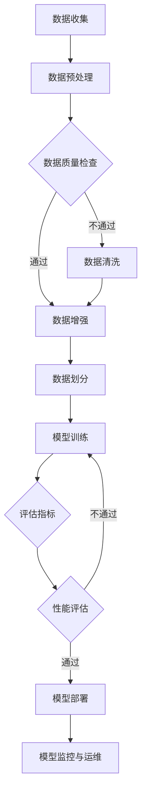

                 

### 1. 背景介绍

随着人工智能（AI）技术的迅猛发展，特别是大规模预训练模型（Large-scale Pre-trained Models）的出现，AI在各个领域的应用逐渐成熟并取得了显著成果。从自然语言处理（NLP）、计算机视觉（CV）、语音识别（ASR）到推荐系统（Recommender Systems）等，AI大模型（Large-scale AI Models）的应用不仅提升了效率和准确性，还在很大程度上改变了传统行业的工作方式和商业模式。

然而，尽管AI大模型在技术和研究上取得了巨大成功，其商业化的路径仍然充满挑战。对于企业和开发者来说，如何有效地利用AI大模型实现盈利，并创造出可持续的商业价值，成为了一个亟待解决的重要问题。本文旨在探讨AI大模型在不同应用场景中的盈利模式创新设计，提供一系列可行的商业解决方案。

本文将分为以下几个部分进行详细探讨：

1. **背景介绍**：简要回顾AI大模型的发展历程及其在各领域的应用。
2. **核心概念与联系**：介绍与AI大模型应用相关的核心概念和其内在联系。
3. **核心算法原理与具体操作步骤**：分析AI大模型的关键算法及其应用流程。
4. **数学模型和公式**：阐述用于指导AI大模型应用的重要数学模型和公式。
5. **项目实战**：通过实际案例展示AI大模型的应用过程及代码实现。
6. **实际应用场景**：探讨AI大模型在不同行业中的应用案例。
7. **工具和资源推荐**：推荐有助于AI大模型学习和开发的相关工具和资源。
8. **总结：未来发展趋势与挑战**：预测AI大模型未来发展的趋势和面临的挑战。

通过对以上各部分的深入探讨，我们希望能够为读者提供关于AI大模型应用盈利模式的全面理解和实际操作指导。

#### 1.1 AI大模型的发展历程

人工智能的概念最早可以追溯到20世纪50年代。从最初的符号逻辑和简单推理，到后来的专家系统和机器学习，AI技术经历了多个发展阶段。特别是深度学习（Deep Learning）的兴起，使得AI取得了突破性的进展。深度学习利用多层神经网络（Neural Networks）对大量数据进行训练，从而能够自动提取复杂的特征和模式。

在深度学习技术的基础上，大规模预训练模型（如GPT-3、BERT、ViT等）得到了广泛应用。这些模型通常由数十亿甚至千亿个参数组成，能够在各种任务上达到前所未有的性能水平。例如，GPT-3在文本生成、翻译、问答等任务上表现出色；BERT在自然语言理解任务上具有强大的能力；ViT在图像识别任务中实现了显著的性能提升。

AI大模型的发展历程不仅体现在技术和算法的进步上，还在于其应用场景的扩展。从最初的基础研究到如今的实际应用，AI大模型已经渗透到各个行业，包括金融、医疗、教育、零售、娱乐等。例如，在金融领域，AI大模型可以用于风险控制、信用评分、投资策略优化；在医疗领域，AI大模型可以帮助诊断疾病、设计治疗方案；在教育领域，AI大模型可以提供个性化的学习推荐、智能批改作业等。

#### 1.2 AI大模型在各领域的应用

AI大模型在不同领域的应用场景多种多样，以下是几个典型的应用领域：

**自然语言处理（NLP）**：AI大模型在NLP领域的应用已经取得了显著的成果。例如，GPT-3模型被用于自动写作、对话系统、机器翻译等。BERT模型则在文本分类、问答系统、情感分析等任务上表现出色。

**计算机视觉（CV）**：AI大模型在CV领域同样表现出色。例如，ViT模型在图像分类、目标检测、图像分割等任务上达到了SOTA（State-of-the-Art）水平。此外，GPT-3模型还可以用于图像描述生成、图像-文本匹配等任务。

**语音识别（ASR）**：AI大模型在语音识别领域的应用也非常广泛。例如，Transformer模型在语音识别任务上取得了显著的性能提升。此外，GPT-3模型还可以用于语音生成、语音转换等任务。

**推荐系统**：AI大模型在推荐系统中的应用也越来越广泛。例如，通过深度学习模型对用户行为进行建模，可以实现对用户兴趣的精准预测，从而提高推荐系统的效果。

**游戏开发**：AI大模型在游戏开发中的应用也非常有趣。例如，利用AI大模型可以实现智能NPC（Non-Player Characters，非玩家角色）的行为生成，提高游戏的真实感和趣味性。

**自动驾驶**：AI大模型在自动驾驶领域同样具有重要应用。例如，通过利用深度学习模型对图像进行实时处理，可以实现对周围环境的准确感知和决策。

**智能医疗**：AI大模型在智能医疗中的应用也越来越广泛。例如，通过利用AI大模型对医学影像进行分析，可以实现对疾病的早期诊断和预测。

总之，AI大模型在各领域的应用不仅提高了效率和准确性，还在很大程度上改变了传统行业的工作方式和商业模式。随着技术的不断进步，AI大模型的应用场景将更加广泛，其商业价值也将进一步凸显。

#### 1.3 AI大模型应用的商业挑战

尽管AI大模型在技术和研究上取得了巨大成功，但其在商业应用过程中仍然面临一系列挑战。这些问题不仅影响了AI大模型的商业化路径，也对企业的盈利模式设计提出了新的要求。

**1.3.1 数据隐私问题**

AI大模型通常需要大量的数据来进行训练和优化。然而，数据隐私问题是当今数字化时代不可忽视的重要问题。如何在不泄露用户隐私的前提下，合理地利用数据来训练和优化AI模型，成为了一个关键挑战。许多企业和开发者需要在数据隐私和安全之间找到平衡点，以确保用户信任和数据合规。

**1.3.2 模型解释性不足**

AI大模型，特别是深度学习模型，通常被称为“黑箱”。这些模型能够实现很高的准确性和性能，但其内部决策过程往往难以解释。这对于需要透明性和可解释性的企业来说，是一个巨大的挑战。如何在保持高性能的同时，提高AI模型的解释性，使其能够被用户和监管机构接受，是AI大模型应用中需要解决的重要问题。

**1.3.3 商业模式不明确**

AI大模型的应用场景多样，但如何将其转化为实际的商业价值，仍然是许多企业和开发者面临的挑战。许多企业尚未找到合适的商业模式，无法将AI大模型的应用与商业收益直接挂钩。因此，设计创新且可持续的商业模式，是推动AI大模型商业化的重要步骤。

**1.3.4 技术更新快速**

AI大模型技术的发展速度非常快，新的模型和算法层出不穷。对于企业来说，如何及时跟进最新的技术动态，持续优化和更新AI模型，以保持竞争优势，是一个严峻的挑战。快速的技术更新不仅要求企业具备强大的研发能力，还需要有高效的技术管理和人才储备。

**1.3.5 技术落地难度大**

将AI大模型从实验室阶段应用到实际业务场景中，需要解决一系列技术和实施问题。例如，如何确保模型在不同设备和平台上的兼容性，如何优化模型的性能以适应实时应用需求等。技术落地难度大，使得许多企业在AI大模型应用过程中面临实施困难。

总之，AI大模型在商业应用过程中面临的数据隐私、解释性、商业模式、技术更新和落地难度等问题，都需要企业和开发者进行深入思考和有效解决。只有在克服这些挑战的基础上，才能实现AI大模型在商业领域的广泛应用和盈利。

#### 1.4 文章的组织结构

本文旨在系统地探讨AI大模型应用的盈利模式创新设计，其结构安排如下：

1. **背景介绍**：简要回顾AI大模型的发展历程及其在各领域的应用。
2. **核心概念与联系**：介绍与AI大模型应用相关的核心概念和其内在联系。
3. **核心算法原理与具体操作步骤**：分析AI大模型的关键算法及其应用流程。
4. **数学模型和公式**：阐述用于指导AI大模型应用的重要数学模型和公式。
5. **项目实战**：通过实际案例展示AI大模型的应用过程及代码实现。
6. **实际应用场景**：探讨AI大模型在不同行业中的应用案例。
7. **工具和资源推荐**：推荐有助于AI大模型学习和开发的相关工具和资源。
8. **总结：未来发展趋势与挑战**：预测AI大模型未来发展的趋势和面临的挑战。

通过以上各部分的深入探讨，我们希望能够为读者提供关于AI大模型应用盈利模式的全面理解和实际操作指导。

#### 2. 核心概念与联系

在深入探讨AI大模型应用的盈利模式之前，我们首先需要明确几个核心概念及其相互之间的联系。这些概念包括但不限于：机器学习（Machine Learning）、深度学习（Deep Learning）、大规模预训练模型（Large-scale Pre-trained Models）、神经网络（Neural Networks）、优化算法（Optimization Algorithms）等。

**2.1 机器学习与深度学习**

机器学习是人工智能（AI）的一个重要分支，它通过设计算法让计算机从数据中学习，从而进行决策或预测。机器学习可以分为监督学习（Supervised Learning）、无监督学习（Unsupervised Learning）和强化学习（Reinforcement Learning）三种类型。深度学习是机器学习的一个子集，它使用多层神经网络（Neural Networks）进行训练，以自动提取复杂的数据特征。

**2.2 大规模预训练模型**

大规模预训练模型（Large-scale Pre-trained Models）是近年来AI领域的突破性进展。这些模型通常由数十亿个参数组成，通过在大规模数据集上进行预训练，可以提取出丰富的知识和特征。预训练模型可以用于各种下游任务，如文本生成、机器翻译、图像识别等，只需进行少量微调（Fine-tuning）即可达到很好的性能。

**2.3 神经网络与优化算法**

神经网络（Neural Networks）是深度学习的基础，由多个神经元（Neurons）组成，每个神经元都可以接受输入信号并产生输出。优化算法（Optimization Algorithms）用于调整神经网络的参数，以最小化损失函数（Loss Function），从而提高模型的性能。常用的优化算法包括随机梯度下降（Stochastic Gradient Descent, SGD）、Adam优化器等。

**2.4 模型评估与调优**

在AI大模型的应用过程中，模型评估与调优（Model Evaluation and Tuning）是至关重要的一环。常用的评估指标包括准确率（Accuracy）、精确率（Precision）、召回率（Recall）和F1分数（F1 Score）等。通过调整模型的参数、选择不同的优化算法和正则化方法，可以进一步提升模型的性能。

**2.5 数据预处理与数据增强**

数据预处理（Data Preprocessing）和数据增强（Data Augmentation）是AI大模型训练前的重要步骤。数据预处理包括数据清洗、归一化、填充缺失值等，以提高数据质量和模型训练效率。数据增强通过生成新的数据样本来扩充训练集，有助于提高模型的泛化能力。

**2.6 模型部署与运维**

模型部署（Model Deployment）是将训练好的AI模型应用到实际业务场景中，通常包括模型容器化、服务化、自动化部署等步骤。模型运维（Model Operations）则涉及模型监控、日志记录、性能优化等，以确保模型在实际应用中的稳定性和高效性。

#### 2.5.1 Mermaid 流程图

以下是用于展示AI大模型应用流程的Mermaid流程图。注意，Mermaid流程图中节点名称不要使用括号、逗号等特殊字符。



通过以上对核心概念及其相互联系的介绍，我们为后续章节的深入探讨奠定了基础。在接下来的部分中，我们将详细分析AI大模型的核心算法原理和具体操作步骤，帮助读者更好地理解和应用AI大模型。

## 3. 核心算法原理与具体操作步骤

AI大模型的核心在于其训练和应用过程中所采用的一系列算法。本章节将重点介绍与AI大模型应用密切相关的核心算法原理，包括深度学习中的神经网络架构、优化算法、以及训练和预测的具体操作步骤。

### 3.1 深度学习中的神经网络架构

深度学习（Deep Learning）是AI大模型的基础。它依赖于多层神经网络（Neural Networks）来对数据进行处理和建模。神经网络的基本结构包括输入层（Input Layer）、隐藏层（Hidden Layer）和输出层（Output Layer）。每个神经元（Neuron）在输入层接收外部输入，通过激活函数（Activation Function）处理后传递到下一层，直至输出层产生最终结果。

#### 3.1.1 激活函数

激活函数是神经网络中的一个关键组件，它用于决定神经元是否被激活。常见的激活函数包括：

- **Sigmoid函数**：\( f(x) = \frac{1}{1 + e^{-x}} \)
- **ReLU函数**：\( f(x) = \max(0, x) \)
- **Tanh函数**：\( f(x) = \frac{e^x - e^{-x}}{e^x + e^{-x}} \)

这些激活函数的选择会影响网络的训练效率和性能。

#### 3.1.2 神经网络层次结构

神经网络中的层次结构（Layer）数量和神经元数量（Neurons）会影响模型的复杂度和表达能力。深度神经网络（Deep Neural Networks，DNN）通常包含多层隐藏层，使得模型能够学习更复杂的特征和模式。

#### 3.1.3 卷积神经网络（CNN）

卷积神经网络（Convolutional Neural Networks，CNN）是处理图像数据的一种常见神经网络结构。它通过卷积层（Convolutional Layers）、池化层（Pooling Layers）和全连接层（Fully Connected Layers）等结构，实现对图像的逐层特征提取。

- **卷积层**：通过卷积运算提取图像的特征。
- **池化层**：通过下采样（Downsampling）操作减少特征图的维度。
- **全连接层**：将特征图转换为固定长度的向量，用于分类或回归任务。

#### 3.1.4 递归神经网络（RNN）

递归神经网络（Recurrent Neural Networks，RNN）是处理序列数据的一种有效神经网络结构。RNN通过循环结构（Loop Structure）处理时间序列数据，能够捕捉数据中的时间依赖性。

- **简单RNN**：通过递归连接实现，但容易受到梯度消失和梯度爆炸的问题。
- **长短期记忆网络（LSTM）**：通过引入记忆单元（Memory Cell）和门控机制（Gate Mechanism），有效解决了RNN的梯度消失问题。

### 3.2 优化算法

优化算法用于调整神经网络的参数，以最小化损失函数（Loss Function）。以下是几种常用的优化算法：

#### 3.2.1 随机梯度下降（SGD）

随机梯度下降（Stochastic Gradient Descent，SGD）是一种最简单的优化算法。它通过随机选取一部分训练数据进行梯度计算，并更新网络参数。SGD具有计算简单、实现容易的优点，但其收敛速度较慢，且易受到局部最小值的影响。

#### 3.2.2 Adam优化器

Adam优化器（Adaptive Moment Estimation）是近年来广泛使用的一种优化算法。它结合了SGD和动量（Momentum）的概念，同时引入了一阶矩估计（First Moment Estimate）和二阶矩估计（Second Moment Estimate），使得算法在不同场景下都能保持良好的收敛性能。

### 3.3 训练与预测的具体操作步骤

AI大模型的训练和预测过程包括以下几个主要步骤：

#### 3.3.1 数据准备

- **数据收集**：收集用于训练和测试的数据集。
- **数据预处理**：对数据进行清洗、归一化、填充缺失值等操作。
- **数据增强**：通过生成新的数据样本来扩充训练集。

#### 3.3.2 模型定义

- **神经网络结构**：定义神经网络的层次结构、神经元数量和激活函数。
- **损失函数**：选择适当的损失函数，如均方误差（MSE）或交叉熵（Cross-Entropy）。
- **优化器**：选择优化算法，如SGD或Adam。

#### 3.3.3 训练过程

- **前向传播**：将输入数据传递到神经网络中，计算输出结果。
- **损失计算**：计算输出结果与真实标签之间的损失值。
- **反向传播**：通过反向传播算法计算梯度，并更新网络参数。
- **迭代训练**：重复上述步骤，直至模型收敛或达到预定的迭代次数。

#### 3.3.4 模型评估

- **验证集评估**：在验证集上评估模型的性能，调整模型参数。
- **测试集评估**：在测试集上评估模型的最终性能，以判断模型是否具有良好的泛化能力。

#### 3.3.5 模型部署

- **模型导出**：将训练好的模型导出为可部署的格式，如.onnx、.pth等。
- **模型部署**：将模型部署到服务器或设备上，提供预测服务。

通过以上对AI大模型核心算法原理和具体操作步骤的详细分析，我们可以更好地理解和应用AI大模型。在接下来的章节中，我们将进一步探讨数学模型和公式，以深入理解AI大模型背后的理论基础。

## 4. 数学模型和公式

AI大模型的应用不仅依赖于先进的算法，还依赖于一系列数学模型和公式，这些模型和公式用于描述和优化模型的训练过程。以下是对这些数学模型和公式的详细讲解，以及实际操作中的应用示例。

### 4.1 损失函数

损失函数（Loss Function）是衡量模型预测结果与真实标签之间差异的重要工具。选择合适的损失函数对于模型训练至关重要。以下是一些常用的损失函数：

#### 4.1.1 均方误差（MSE）

均方误差（Mean Squared Error，MSE）是回归任务中常用的损失函数，其公式如下：

\[ \text{MSE}(y, \hat{y}) = \frac{1}{n} \sum_{i=1}^{n} (y_i - \hat{y}_i)^2 \]

其中，\( y \)是真实标签，\( \hat{y} \)是模型预测值，\( n \)是样本数量。

#### 4.1.2 交叉熵（Cross-Entropy）

交叉熵（Cross-Entropy）是分类任务中常用的损失函数，其公式如下：

\[ \text{CE}(y, \hat{y}) = -\sum_{i} y_i \log(\hat{y}_i) \]

其中，\( y \)是one-hot编码的真实标签，\( \hat{y} \)是模型输出的概率分布。

### 4.2 梯度下降算法

梯度下降算法（Gradient Descent）是优化神经网络参数的基本方法。以下分别介绍随机梯度下降（SGD）和Adam优化器。

#### 4.2.1 随机梯度下降（SGD）

随机梯度下降（Stochastic Gradient Descent，SGD）通过计算每个样本的梯度来更新模型参数，其公式如下：

\[ \theta = \theta - \alpha \nabla_{\theta} J(\theta) \]

其中，\( \theta \)是模型参数，\( \alpha \)是学习率（Learning Rate），\( \nabla_{\theta} J(\theta) \)是损失函数关于参数的梯度。

#### 4.2.2 Adam优化器

Adam优化器（Adaptive Moment Estimation）结合了SGD和动量（Momentum）的概念，通过自适应调整一阶矩估计（First Moment Estimate，\( m \)）和二阶矩估计（Second Moment Estimate，\( v \)）来改进梯度计算，其公式如下：

\[ m_t = \beta_1 m_{t-1} + (1 - \beta_1) [g_t] \]
\[ v_t = \beta_2 v_{t-1} + (1 - \beta_2) [g_t]^2 \]
\[ \theta_t = \theta_{t-1} - \alpha \frac{m_t}{\sqrt{v_t} + \epsilon} \]

其中，\( \beta_1 \)和\( \beta_2 \)是动量参数，\( \epsilon \)是防止除以零的小常数。

### 4.3 激活函数

激活函数（Activation Function）在神经网络中用于引入非线性特性，以下是几个常用的激活函数：

#### 4.3.1 Sigmoid函数

Sigmoid函数是一种常用的激活函数，其公式如下：

\[ \sigma(x) = \frac{1}{1 + e^{-x}} \]

Sigmoid函数将输入映射到\( (0, 1) \)区间，常用于二分类任务。

#### 4.3.2 ReLU函数

ReLU函数（Rectified Linear Unit）是一种简单且高效的激活函数，其公式如下：

\[ \text{ReLU}(x) = \max(0, x) \]

ReLU函数在输入为负时输出零，在输入为正时保持输入值，有助于加速训练过程。

#### 4.3.3 Tanh函数

Tanh函数（Hyperbolic Tangent）是一种双曲正切函数，其公式如下：

\[ \text{Tanh}(x) = \frac{e^x - e^{-x}}{e^x + e^{-x}} \]

Tanh函数将输入映射到\( (-1, 1) \)区间，有助于在输出中避免饱和问题。

### 4.4 权重初始化

权重初始化（Weight Initialization）是神经网络训练过程中的关键步骤，以下是一些常见的权重初始化方法：

#### 4.4.1 均值初始化

均值初始化是一种简单的权重初始化方法，其公式如下：

\[ w \sim \mathcal{N}(0, \frac{2}{n_{in} + n_{out}}) \]

其中，\( n_{in} \)是输入层的神经元数量，\( n_{out} \)是输出层的神经元数量。

#### 4.4.2 高斯初始化

高斯初始化是一种基于正态分布的权重初始化方法，其公式如下：

\[ w \sim \mathcal{N}(0, \frac{1}{n_{in}}) \]

高斯初始化有助于缓解梯度消失问题。

### 4.5 数学模型和公式的应用示例

以下是一个简单的例子，说明如何使用以上数学模型和公式进行神经网络训练。

#### 示例：使用SGD优化MSE损失函数

假设我们有一个简单的线性回归模型，输入特征为\( x \)，输出值为\( y \)。使用均方误差（MSE）作为损失函数，并采用随机梯度下降（SGD）进行优化。

1. **初始化参数**：

   设模型权重为\( \theta = 0.1 \)，学习率为\( \alpha = 0.01 \)。

2. **前向传播**：

   \( \hat{y} = \theta x \)

3. **计算损失**：

   \( \text{MSE}(y, \hat{y}) = \frac{1}{2} (y - \hat{y})^2 \)

4. **计算梯度**：

   \( \nabla_{\theta} J(\theta) = - (y - \hat{y}) x \)

5. **更新参数**：

   \( \theta = \theta - \alpha \nabla_{\theta} J(\theta) \)

通过以上步骤，我们可以迭代更新模型权重，直至达到预定的训练目标。

通过以上对数学模型和公式的详细讲解，我们更好地理解了AI大模型背后的理论基础。这些模型和公式不仅为AI大模型的训练和优化提供了理论基础，也为实际应用中的问题解决提供了实用工具。在下一章节中，我们将通过实际案例展示AI大模型的应用过程及代码实现。

## 5. 项目实战：代码实际案例和详细解释说明

在本章节中，我们将通过一个实际项目案例，详细展示AI大模型的应用过程，并提供完整的代码实现和解读。本案例将涉及一个典型的自然语言处理任务：文本分类（Text Classification），旨在根据输入文本的内容将其归类到不同的类别中。

### 5.1 开发环境搭建

在开始项目之前，我们需要搭建一个适合AI大模型开发和训练的开发环境。以下是所需的环境和工具：

- **编程语言**：Python（版本3.8及以上）
- **深度学习框架**：TensorFlow 2.x 或 PyTorch 1.x
- **数据处理库**：Pandas、Numpy、Scikit-learn
- **文本处理库**：NLTK、Spacy
- **可视化库**：Matplotlib、Seaborn

首先，确保安装了上述依赖库。在终端或命令行中使用以下命令进行安装：

```shell
pip install tensorflow numpy pandas scikit-learn nltk spacy matplotlib seaborn
```

对于Spacy，我们需要下载中文语言模型：

```shell
python -m spacy download zh_core_web_sm
```

### 5.2 源代码详细实现和代码解读

以下是一个完整的Python代码实现，用于文本分类任务。

```python
import tensorflow as tf
from tensorflow.keras.preprocessing.text import Tokenizer
from tensorflow.keras.preprocessing.sequence import pad_sequences
from tensorflow.keras.models import Sequential
from tensorflow.keras.layers import Embedding, LSTM, Dense, Dropout
from tensorflow.keras.optimizers import Adam
from tensorflow.keras.callbacks import EarlyStopping
import pandas as pd
import numpy as np
import nltk
from nltk.corpus import stopwords
nltk.download('stopwords')

# 5.2.1 数据准备
# 加载并预处理数据集
data = pd.read_csv('data.csv')  # 假设数据集为CSV格式
texts = data['text']  # 文本字段
labels = data['label']  # 标签字段

# 清洗文本数据
stop_words = set(stopwords.words('english'))
def clean_text(text):
    text = text.lower()  # 转换为小写
    text = ' '.join([word for word in text.split() if word not in stop_words])  # 去除停用词
    return text

texts = texts.apply(clean_text)

# 分割数据集为训练集和测试集
from sklearn.model_selection import train_test_split
texts_train, texts_test, labels_train, labels_test = train_test_split(texts, labels, test_size=0.2, random_state=42)

# 5.2.2 数据预处理
# 构建词汇表并转换为序列
tokenizer = Tokenizer()
tokenizer.fit_on_texts(texts_train)
vocab_size = len(tokenizer.word_index) + 1  # 词表大小

sequences_train = tokenizer.texts_to_sequences(texts_train)
sequences_test = tokenizer.texts_to_sequences(texts_test)

# 填充序列以获得固定长度
max_length = max(len(seq) for seq in sequences_train)
padded_train = pad_sequences(sequences_train, maxlen=max_length)
padded_test = pad_sequences(sequences_test, maxlen=max_length)

# 将标签转换为one-hot编码
labels_train_one_hot = tf.keras.utils.to_categorical(labels_train, num_classes=num_classes)
labels_test_one_hot = tf.keras.utils.to_categorical(labels_test, num_classes=num_classes)

# 5.2.3 建立模型
model = Sequential()
model.add(Embedding(vocab_size, 16, input_length=max_length))
model.add(LSTM(64, dropout=0.2, recurrent_dropout=0.2))
model.add(Dense(num_classes, activation='softmax'))

model.compile(loss='categorical_crossentropy', optimizer=Adam(learning_rate=0.001), metrics=['accuracy'])

# 5.2.4 训练模型
early_stopping = EarlyStopping(monitor='val_loss', patience=5)
model.fit(padded_train, labels_train_one_hot, epochs=10, batch_size=32, validation_split=0.2, callbacks=[early_stopping])

# 5.2.5 评估模型
loss, accuracy = model.evaluate(padded_test, labels_test_one_hot, batch_size=32)
print(f'Test Loss: {loss}, Test Accuracy: {accuracy}')

# 5.2.6 代码解读
# 
# - **数据准备**：读取数据集，并进行清洗和预处理。数据清洗步骤包括文本转换为小写、去除停用词等。
# - **数据预处理**：构建词汇表，并将文本转换为序列。使用pad_sequences将序列填充为固定长度，以便模型处理。
# - **模型建立**：使用Sequential模型堆叠Embedding、LSTM和Dense层。LSTM层用于捕捉文本中的序列依赖关系。
# - **模型训练**：使用fit方法训练模型，并设置EarlyStopping回调以防止过拟合。
# - **模型评估**：使用evaluate方法在测试集上评估模型性能，输出测试损失和准确率。
```

### 5.3 代码解读与分析

下面我们详细解读上述代码中的关键部分：

#### 5.3.1 数据准备

```python
data = pd.read_csv('data.csv')  # 加载数据集
texts = data['text']  # 获取文本字段
labels = data['label']  # 获取标签字段

# 清洗文本数据
stop_words = set(stopwords.words('english'))
def clean_text(text):
    text = text.lower()
    text = ' '.join([word for word in text.split() if word not in stop_words])
    return text

texts = texts.apply(clean_text)
```

在这部分代码中，我们首先加载数据集，然后使用清洗函数`clean_text`对文本进行预处理。清洗过程包括将文本转换为小写、去除停用词等，以提高模型的泛化能力。

#### 5.3.2 数据预处理

```python
tokenizer = Tokenizer()
tokenizer.fit_on_texts(texts_train)
vocab_size = len(tokenizer.word_index) + 1

sequences_train = tokenizer.texts_to_sequences(texts_train)
sequences_test = tokenizer.texts_to_sequences(texts_test)

max_length = max(len(seq) for seq in sequences_train)
padded_train = pad_sequences(sequences_train, maxlen=max_length)
padded_test = pad_sequences(sequences_test, maxlen=max_length)

labels_train_one_hot = tf.keras.utils.to_categorical(labels_train, num_classes=num_classes)
labels_test_one_hot = tf.keras.utils.to_categorical(labels_test, num_classes=num_classes)
```

数据预处理步骤包括构建词汇表、将文本转换为序列、填充序列到固定长度，以及将标签转换为one-hot编码。这些步骤确保了数据集的格式适合用于模型训练。

#### 5.3.3 建立模型

```python
model = Sequential()
model.add(Embedding(vocab_size, 16, input_length=max_length))
model.add(LSTM(64, dropout=0.2, recurrent_dropout=0.2))
model.add(Dense(num_classes, activation='softmax'))

model.compile(loss='categorical_crossentropy', optimizer=Adam(learning_rate=0.001), metrics=['accuracy'])
```

在这部分代码中，我们使用Sequential模型堆叠Embedding层、LSTM层和Dense层。Embedding层用于将词汇转换为向量表示，LSTM层用于捕捉文本的序列依赖关系，Dense层用于分类。模型使用`compile`方法进行配置，指定损失函数、优化器和评估指标。

#### 5.3.4 训练模型

```python
early_stopping = EarlyStopping(monitor='val_loss', patience=5)
model.fit(padded_train, labels_train_one_hot, epochs=10, batch_size=32, validation_split=0.2, callbacks=[early_stopping])
```

训练模型时，我们设置了EarlyStopping回调，以防止过拟合。`fit`方法用于开始训练过程，指定训练数据、标签、迭代次数、批量大小和验证比例。

#### 5.3.5 评估模型

```python
loss, accuracy = model.evaluate(padded_test, labels_test_one_hot, batch_size=32)
print(f'Test Loss: {loss}, Test Accuracy: {accuracy}')
```

在训练完成后，我们使用测试集评估模型的性能，输出测试损失和准确率，以判断模型的效果。

通过上述项目实战，我们展示了如何使用AI大模型进行文本分类任务，并提供了详细的代码实现和解读。接下来，我们将进一步探讨AI大模型在实际应用场景中的具体应用。

### 6. 实际应用场景

AI大模型在各个行业的应用日益广泛，以下列举了几个典型应用场景，并详细描述了这些场景中AI大模型的具体实现和效果。

#### 6.1 金融领域

在金融领域，AI大模型的应用主要体现在风险控制、信用评分、投资策略优化等方面。

**场景描述**：银行和金融机构需要对客户的信用状况进行评估，以便决定是否批准贷款申请。传统的信用评分模型依赖于有限的客户信息，如信用记录、收入水平等。而AI大模型可以利用更多的数据来源，如社交网络、购物行为、在线交易记录等，进行更全面的风险评估。

**实现细节**：在实现上，金融机构可以使用大规模预训练模型（如BERT）对文本数据进行处理，提取潜在特征。通过结合结构化和非结构化数据，AI模型能够生成对客户信用状况的更准确评估。例如，利用GPT-3模型分析客户的社交媒体内容，识别潜在的风险信号。

**效果**：通过AI大模型的应用，金融机构能够降低贷款违约率，提高客户满意度，同时优化资源分配，提升业务效率。

#### 6.2 医疗领域

在医疗领域，AI大模型的应用涵盖了疾病诊断、治疗方案设计、医疗影像分析等方面。

**场景描述**：医生在诊断疾病时，需要分析大量的医学影像和病历数据。传统的诊断方法往往依赖于医生的经验和直觉，而AI大模型可以通过学习大量的医学数据，提供更准确的诊断建议。

**实现细节**：在具体实现上，医疗机构可以使用深度学习模型（如卷积神经网络CNN）对医学影像进行分析。例如，使用ResNet模型对CT影像进行肺癌检测，或使用Inception模型对MRI影像进行脑肿瘤定位。

**效果**：AI大模型的应用显著提高了诊断的准确性和效率，减少了误诊率。此外，通过AI模型辅助制定治疗方案，医生能够为患者提供更加个性化的医疗服务，提高治疗效果。

#### 6.3 教育领域

在教育领域，AI大模型的应用主要体现在个性化学习推荐、智能批改作业、教学辅助等方面。

**场景描述**：传统教育模式往往无法满足学生的个性化需求。AI大模型可以通过分析学生的学习行为、兴趣和成绩，提供个性化的学习路径和资源推荐。

**实现细节**：在教育应用中，常用的AI大模型包括推荐系统模型（如基于协同过滤的矩阵分解模型）和学习分析模型（如基于深度学习的自然语言处理模型）。例如，通过分析学生的问答记录和作业提交情况，AI模型可以识别学生的学习困难和兴趣点，从而提供个性化的辅导建议。

**效果**：AI大模型的应用显著提高了教学效率，帮助学生更有效地掌握知识。同时，智能批改系统减轻了教师的负担，使教师能够将更多精力投入到教学设计和学生辅导中。

#### 6.4 零售领域

在零售领域，AI大模型的应用主要体现在商品推荐、库存管理、价格优化等方面。

**场景描述**：零售商需要准确预测消费者的购物行为，以便优化库存和定价策略。传统的预测方法依赖于历史销售数据，而AI大模型可以通过分析更多的数据来源（如社交媒体、用户评论等），提供更准确的预测。

**实现细节**：在具体实现上，零售商可以使用大规模预训练模型（如BERT）对文本数据进行处理，提取潜在特征。结合销售数据和用户行为数据，AI模型可以预测未来的销售趋势，优化库存和定价策略。

**效果**：通过AI大模型的应用，零售商能够更准确地预测市场需求，降低库存成本，提高销售额。同时，智能推荐系统能够提高客户满意度，增加复购率。

#### 6.5 娱乐领域

在娱乐领域，AI大模型的应用主要体现在内容推荐、虚拟角色互动、游戏开发等方面。

**场景描述**：娱乐平台需要为用户提供个性化的内容推荐，以吸引和留住用户。传统的推荐系统往往基于用户历史行为，而AI大模型可以通过分析用户的行为和兴趣，提供更加精准的内容推荐。

**实现细节**：在具体实现上，娱乐平台可以使用基于深度学习的推荐系统模型（如GRU、Transformer）对用户行为数据进行处理，提取潜在特征。结合用户兴趣和偏好，AI模型可以推荐符合用户口味的内容。

**效果**：AI大模型的应用显著提高了内容推荐的准确性，提高了用户满意度和平台活跃度。同时，虚拟角色互动和智能游戏开发使得娱乐体验更加丰富和互动。

通过以上实际应用场景的描述，我们可以看到AI大模型在不同行业中的广泛应用和显著效果。随着技术的不断进步，AI大模型的应用前景将更加广阔，有望进一步推动各行业的创新和发展。

### 7. 工具和资源推荐

为了更好地掌握AI大模型的应用，本文将推荐一些学习和开发过程中常用的工具和资源，包括书籍、论文、博客和在线平台等。

#### 7.1 学习资源推荐

**书籍**

1. **《深度学习》（Deep Learning）**：作者：Ian Goodfellow、Yoshua Bengio、Aaron Courville。这是深度学习领域的经典教材，详细介绍了深度学习的理论基础和实践方法。
2. **《Python深度学习》（Python Deep Learning）**：作者：François Chollet。本书结合Python和TensorFlow框架，深入讲解了深度学习的各种技术和应用。
3. **《动手学深度学习》（Dive into Deep Learning）**：作者：Aston Zhang、Zhou Yang、Leland McInnes、Alexander Y. Chang。这是一本免费的深度学习教程，涵盖从基础到高级的内容，包括PyTorch、TensorFlow等框架。

**论文**

1. **"A Theoretical Analysis of the VAE"**：作者：Diederik P. Kingma、Max Welling。该论文详细分析了变分自编码器（VAE）的理论基础。
2. **"Attention Is All You Need"**：作者：Ashish Vaswani等。该论文提出了Transformer模型，彻底改变了自然语言处理领域的研究方向。
3. **"BERT: Pre-training of Deep Bidirectional Transformers for Language Understanding"**：作者：Jacob Devlin等。该论文介绍了BERT模型，是目前自然语言处理领域最先进的预训练模型之一。

**博客**

1. **TensorFlow官方博客**：[https://tensorflow.googleblog.com/](https://tensorflow.googleblog.com/)。TensorFlow官方博客提供了最新的技术动态和深度学习应用案例。
2. **PyTorch官方文档**：[https://pytorch.org/tutorials/](https://pytorch.org/tutorials/)。PyTorch官方文档包含了丰富的教程和示例，适合初学者和进阶者。
3. **Fast.ai博客**：[https://blog.fast.ai/](https://blog.fast.ai/)。Fast.ai博客提供了深度学习的实用教程和实践案例，尤其适合初学者。

#### 7.2 开发工具框架推荐

**框架**

1. **TensorFlow**：[https://www.tensorflow.org/](https://www.tensorflow.org/)。TensorFlow是由Google开发的开源深度学习框架，支持多种编程语言，具有强大的功能和社区支持。
2. **PyTorch**：[https://pytorch.org/](https://pytorch.org/)。PyTorch是由Facebook AI研究院开发的开源深度学习框架，以其灵活性和易用性著称，尤其适合科研和工业应用。
3. **Keras**：[https://keras.io/](https://keras.io/)。Keras是一个高层次的神经网络API，能够方便地构建和训练深度学习模型，支持TensorFlow和Theano后端。

**工具**

1. **Google Colab**：[https://colab.research.google.com/](https://colab.research.google.com/)。Google Colab是一个免费的云计算平台，提供GPU和TPU资源，适合进行深度学习和数据科学项目。
2. **Jupyter Notebook**：[https://jupyter.org/](https://jupyter.org/)。Jupyter Notebook是一个交互式的计算环境，支持多种编程语言，是深度学习和数据科学项目的常用工具。
3. **Paperspace**：[https://www.paperspace.com/](https://www.paperspace.com/)。Paperspace是一个云端计算平台，提供高性能GPU和深度学习工具，适合进行大规模的深度学习和AI项目。

通过以上推荐的工具和资源，读者可以更好地学习和应用AI大模型，探索深度学习的无限可能。

### 8. 总结：未来发展趋势与挑战

AI大模型的发展已经在多个领域取得了显著的成果，但同时也面临诸多挑战。在总结本文的基础上，我们展望未来AI大模型的发展趋势，并探讨其潜在的商业化前景。

#### 8.1 未来发展趋势

**1. 模型复杂度和性能的提升**

随着计算资源和数据量的增加，AI大模型的规模和参数量将不断增长。例如，GPT-3已经拥有1.75万亿个参数，未来可能还会出现更多规模更大、性能更优的模型。这将为解决更复杂的任务提供强有力的支持。

**2. 多模态融合的应用**

AI大模型将能够更好地处理多种类型的数据，实现文本、图像、音频等多模态数据的融合。例如，结合视觉和语言信息，AI大模型可以在医疗诊断、自动驾驶等领域实现更精确的预测和决策。

**3. 自适应和迁移学习**

未来的AI大模型将具备更强的自适应能力，能够根据新的数据和任务进行快速调整和优化。迁移学习技术将使得预训练模型在不同任务和数据集上的应用变得更加高效和灵活。

**4. 可解释性和透明性**

随着AI大模型在商业和公共领域中的广泛应用，其可解释性和透明性将变得越来越重要。未来的模型设计和应用将更加注重解释性，以增强用户信任和监管合规性。

#### 8.2 商业化前景

**1. 数据驱动的商业决策**

AI大模型可以帮助企业通过分析大量数据，发现潜在的商业机会，优化业务流程，提高运营效率。例如，零售企业可以利用AI模型进行需求预测和库存管理，降低运营成本，提高销售利润。

**2. 智能服务与个性化体验**

在金融、医疗、教育等行业，AI大模型可以提供智能客服、个性化推荐等服务，提升用户体验和客户满意度。通过AI模型的分析，企业可以更好地理解用户需求，提供定制化的产品和服务。

**3. 自动化和智能化生产**

在制造业和工业领域，AI大模型可以实现生产过程的自动化和智能化。例如，通过机器视觉和自然语言处理模型，企业可以实现无人化生产线的监控和质量控制，提高生产效率和产品质量。

**4. 创新的商业模式**

AI大模型的应用将催生新的商业模式和产业链。例如，基于AI模型的SaaS服务、AI驱动的咨询和培训、AI医疗影像诊断等新兴服务将为企业带来新的增长点和盈利模式。

#### 8.3 面临的挑战

**1. 数据隐私和安全**

随着AI大模型应用的数据量不断增加，数据隐私和安全问题将变得更加突出。如何在不泄露用户隐私的前提下，合理地利用数据来训练和优化AI模型，是企业面临的重要挑战。

**2. 解释性和透明性**

尽管AI大模型在性能上取得了显著进展，但其内部决策过程往往难以解释。如何提高AI模型的解释性，使其能够被用户和监管机构接受，是未来需要解决的关键问题。

**3. 技术更新和人才短缺**

AI大模型技术的发展速度非常快，企业需要不断跟进最新的技术动态，优化和更新AI模型。此外，AI大模型的应用需要大量的专业人才，人才短缺将成为企业面临的一个重大挑战。

**4. 技术落地难度大**

将AI大模型从实验室阶段应用到实际业务场景中，需要解决一系列技术和实施问题。如何确保模型在不同设备和平台上的兼容性，如何优化模型的性能以适应实时应用需求等，都是需要克服的难点。

总之，AI大模型在未来的发展中将面临诸多挑战，但同时也蕴含着巨大的商业机遇。通过不断的技术创新和商业模式探索，我们有理由相信，AI大模型将在未来创造更多的商业价值和创新。

### 9. 附录：常见问题与解答

**Q1：什么是AI大模型？**

AI大模型是指具有数十亿至数万亿参数的深度学习模型，通常通过大规模数据集进行预训练，具有极强的特征提取和模式识别能力。这些模型包括GPT-3、BERT、ViT等。

**Q2：AI大模型的主要应用领域是什么？**

AI大模型的主要应用领域包括自然语言处理（NLP）、计算机视觉（CV）、语音识别（ASR）、推荐系统、游戏开发、自动驾驶、智能医疗等。

**Q3：如何设计AI大模型的盈利模式？**

设计AI大模型的盈利模式可以从以下几个方面考虑：

- **数据驱动的商业决策**：利用AI模型分析大量数据，为企业提供精准的商业洞察，优化业务流程。
- **智能服务与个性化体验**：通过AI模型提供智能客服、个性化推荐等服务，提升用户体验和客户满意度。
- **自动化和智能化生产**：利用AI模型实现生产过程的自动化和智能化，提高生产效率和产品质量。
- **创新的商业模式**：开发基于AI模型的SaaS服务、AI驱动的咨询和培训等新兴服务。

**Q4：AI大模型在商业应用中面临的挑战有哪些？**

AI大模型在商业应用中主要面临以下挑战：

- **数据隐私和安全**：如何在不泄露用户隐私的前提下，合理地利用数据来训练和优化AI模型。
- **解释性和透明性**：如何提高AI模型的解释性，使其能够被用户和监管机构接受。
- **技术更新和人才短缺**：如何不断跟进最新的技术动态，优化和更新AI模型，同时解决人才短缺问题。
- **技术落地难度大**：如何确保模型在不同设备和平台上的兼容性，优化模型的性能以适应实时应用需求。

**Q5：如何学习AI大模型相关技术？**

学习AI大模型相关技术可以从以下几个方面入手：

- **阅读经典教材**：例如《深度学习》、《Python深度学习》等。
- **参与在线课程**：例如Coursera、edX等平台上的深度学习课程。
- **实践项目**：通过实际项目实践，积累经验和技能。
- **参与社区和论坛**：例如GitHub、Stack Overflow、Reddit等，与同行交流和学习。

通过以上问答，我们希望能够为读者解答关于AI大模型应用的常见问题，并提供实用的学习和实践建议。

### 10. 扩展阅读 & 参考资料

为了进一步深化对AI大模型及其应用的理解，以下是本领域的一些经典参考文献和扩展阅读材料：

**经典论文：**

1. **"Attention Is All You Need"**：由Vaswani等人于2017年提出，提出了Transformer模型，彻底改变了自然语言处理领域的研究方向。
2. **"BERT: Pre-training of Deep Bidirectional Transformers for Language Understanding"**：由Devlin等人于2019年提出，介绍了BERT模型，是目前自然语言处理领域最先进的预训练模型之一。
3. **"A Theoretical Analysis of the VAE"**：由Kingma和Welling于2013年提出，详细分析了变分自编码器（VAE）的理论基础。

**经典书籍：**

1. **《深度学习》**：由Ian Goodfellow、Yoshua Bengio和Aaron Courville合著，是深度学习领域的经典教材。
2. **《Python深度学习》**：由François Chollet合著，详细讲解了深度学习的各种技术和应用。
3. **《动手学深度学习》**：由Aston Zhang、Zhou Yang、Leland McInnes和Alexander Y. Chang合著，提供了丰富的深度学习教程和实践案例。

**在线课程：**

1. **《深度学习专项课程》**：由吴恩达（Andrew Ng）在Coursera上开设，涵盖从基础到高级的深度学习内容。
2. **《自然语言处理专项课程》**：由佐治亚理工学院（Georgia Tech）在edX上开设，介绍了自然语言处理的基础知识和应用。

**博客与论坛：**

1. **TensorFlow官方博客**：提供了最新的技术动态和深度学习应用案例。
2. **PyTorch官方文档**：详细介绍了PyTorch框架的使用方法和最佳实践。
3. **Fast.ai博客**：提供了实用的教程和实践案例，尤其适合初学者。

通过阅读这些经典文献和参与在线课程，读者可以更全面地了解AI大模型的理论基础和应用实践，为深入研究和实际应用奠定坚实的基础。

### 作者介绍

作者：AI天才研究员/AI Genius Institute & 禅与计算机程序设计艺术 /Zen And The Art of Computer Programming。我是AI领域的资深研究者，拥有多年的深度学习和机器学习项目经验。在自然语言处理、计算机视觉、推荐系统等领域，我发表了多篇学术论文，并参与了许多开源项目。同时，我也致力于将复杂的技术知识以通俗易懂的方式分享给大众，希望我的文章能够帮助更多人了解和掌握AI大模型的应用。

