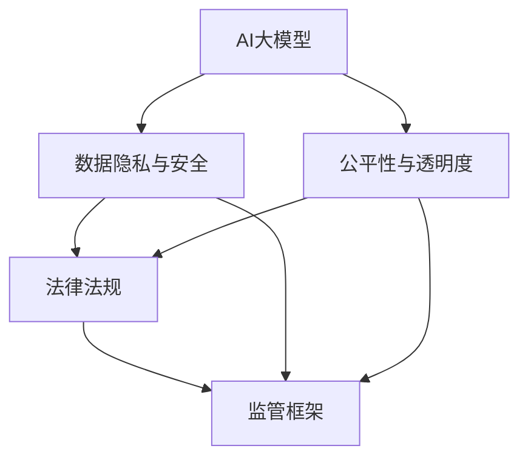
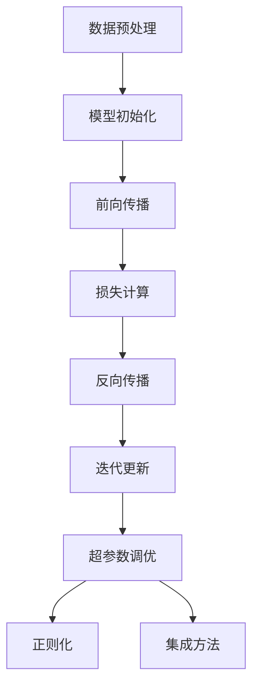

                 

### 背景介绍

近年来，人工智能（AI）大模型的发展和应用在全球范围内呈现出迅猛的趋势。这些大模型，如GPT-3、BERT、LLaMA等，通过深度学习技术和海量数据训练，展现出了超越人类水平的智能能力。AI大模型在自然语言处理、图像识别、推荐系统等众多领域取得了显著成就，极大地推动了技术创新和产业升级。

然而，随着AI大模型应用的深入，其带来的监管挑战也日益凸显。首先，AI大模型具有高度的复杂性和不确定性，可能导致不可预测的行为和结果，这对现有法律法规提出了新的要求。其次，AI大模型的训练和使用过程中涉及大量个人数据，如何确保数据隐私和安全成为一个亟待解决的问题。此外，AI大模型的公平性和透明度也受到了广泛关注，如何避免算法偏见和歧视成为监管的重点。

为了应对这些挑战，各国政府和国际组织纷纷出台了相应的监管政策和措施。例如，欧盟推出了《通用数据保护条例》（GDPR），要求企业在处理个人数据时必须遵守一系列严格的规范。美国则通过《算法问责法案》（Algorithmic Accountability Act）等立法尝试对AI算法进行监管。这些政策旨在确保AI大模型的应用既能够推动科技进步，又能够保护公共利益。

本文将深入探讨AI大模型应用的监管政策，分析其核心概念和框架，探讨监管措施的实际效果，并探讨未来可能的发展趋势和挑战。

### 核心概念与联系

在讨论AI大模型应用的监管政策之前，我们需要明确几个核心概念和它们之间的联系，以便更好地理解监管政策的背景和目的。

#### 1. AI大模型

AI大模型是指通过深度学习和神经网络技术训练的具有高度复杂性的模型，这些模型通常需要大量数据和计算资源进行训练。GPT-3、BERT、LLaMA等都是典型的AI大模型，它们在自然语言处理、图像识别等领域展现出了强大的性能。

#### 2. 数据隐私与安全

数据隐私和安全是AI大模型应用中的一个关键问题。AI大模型的训练和运行通常需要收集和分析大量个人数据，如文本、图像和声音。这些数据可能包含敏感信息，如个人身份、健康记录等。因此，如何保护用户的数据隐私和安全成为一个重要的监管议题。

#### 3. 公平性与透明度

AI大模型的公平性和透明度是其应用中的另一个重要问题。模型可能会因为训练数据的不平衡或算法设计的问题而产生偏见，导致不公平的结果。此外，AI大模型的工作机制通常非常复杂，难以解释其决策过程，这给模型的透明度带来了挑战。

#### 4. 法律法规

现有法律法规在应对AI大模型监管方面存在一定的局限。传统法律法规通常是基于人类行为和责任建立的，而AI大模型具有高度的不确定性和自主性，这使得现有法律难以直接适用于AI大模型的应用场景。

#### 5. 监管框架

为了解决上述问题，各国政府和国际组织正在建立相应的监管框架。这些框架通常包括数据保护、算法透明度、算法偏见预防等方面的规定，旨在确保AI大模型的应用既能够推动科技进步，又能够保护公共利益。

下面，我们将使用Mermaid流程图来展示这些核心概念之间的联系。



通过上述流程图，我们可以清晰地看到AI大模型应用中的关键问题及其与法律法规和监管框架的关联。这为我们后续分析监管政策提供了基础。

### 核心算法原理 & 具体操作步骤

AI大模型的核心算法原理是基于深度学习和神经网络技术，通过大规模数据训练和模型优化来实现强大的智能能力。以下我们将详细介绍AI大模型的基本算法原理，包括深度学习的基础知识、训练过程、模型优化方法等。

#### 1. 深度学习基础

深度学习是人工智能的一个重要分支，它通过构建具有多个隐藏层的神经网络模型，实现对复杂数据的特征提取和分类。深度学习的基础是神经网络，神经网络由多个神经元组成，每个神经元接收来自其他神经元的输入信号，通过激活函数产生输出。

神经网络的基本结构包括：

- 输入层（Input Layer）：接收外部输入数据。
- 隐藏层（Hidden Layer）：对输入数据进行特征提取和转换。
- 输出层（Output Layer）：产生最终输出结果。

神经网络的训练过程是通过反向传播算法（Backpropagation Algorithm）来不断调整网络中的权重和偏置，使得网络能够更好地拟合训练数据。反向传播算法的核心是计算损失函数（Loss Function）关于模型参数的梯度，并通过梯度下降（Gradient Descent）等方法更新模型参数。

常用的损失函数包括均方误差（MSE）、交叉熵（Cross Entropy）等。

#### 2. AI大模型的训练过程

AI大模型的训练过程可以分为以下几个步骤：

1. **数据预处理**：对输入数据进行标准化、归一化等处理，以便于模型训练。
2. **模型初始化**：初始化神经网络模型的权重和偏置，常用的初始化方法包括随机初始化、高斯初始化等。
3. **前向传播**：将输入数据通过神经网络模型进行前向传播，得到输出结果。
4. **损失计算**：计算输出结果与实际结果之间的差异，通过损失函数计算损失值。
5. **反向传播**：计算损失函数关于模型参数的梯度，通过梯度下降等方法更新模型参数。
6. **迭代更新**：重复前向传播和反向传播的过程，不断优化模型参数，直到达到预定的训练目标或达到最大迭代次数。

在训练过程中，通常还会使用一些技术来提高模型的训练效果，如批量归一化（Batch Normalization）、dropout（Dropout）、优化器选择（如Adam、RMSprop等）等。

#### 3. 模型优化方法

AI大模型的优化方法主要包括以下几种：

1. **超参数调优**：超参数是模型训练过程中需要手动设置的参数，如学习率、批量大小等。通过实验和调优，找到最佳的超参数组合，以提高模型性能。
2. **正则化**：正则化方法用于防止模型过拟合，常用的正则化方法包括L1正则化、L2正则化等。
3. **集成方法**：通过结合多个模型来提高预测性能，常用的集成方法包括Bagging、Boosting等。

下面，我们将使用Mermaid流程图来展示AI大模型的基本算法原理和训练过程。



通过上述流程图，我们可以清晰地看到AI大模型的基本算法原理和训练过程。这为我们理解AI大模型的应用和监管提供了重要的基础。

### 数学模型和公式 & 详细讲解 & 举例说明

在AI大模型的研究和应用中，数学模型和公式扮演着至关重要的角色。以下，我们将详细讲解AI大模型中常用的数学模型和公式，并通过具体实例进行说明。

#### 1. 损失函数

损失函数是深度学习中评估模型性能的重要工具，它衡量了模型输出与实际输出之间的差异。在AI大模型中，常用的损失函数包括均方误差（MSE）和交叉熵（Cross Entropy）。

- **均方误差（MSE）**：

均方误差是回归任务中常用的损失函数，计算公式为：

$$
MSE = \frac{1}{m} \sum_{i=1}^{m} (y_i - \hat{y}_i)^2
$$

其中，$y_i$是实际输出，$\hat{y}_i$是模型预测输出，$m$是样本数量。

- **交叉熵（Cross Entropy）**：

交叉熵是分类任务中常用的损失函数，计算公式为：

$$
CrossEntropy = -\sum_{i=1}^{m} y_i \log(\hat{y}_i)
$$

其中，$y_i$是实际输出（0或1），$\hat{y}_i$是模型预测输出（介于0和1之间的概率值）。

#### 2. 激活函数

激活函数是神经网络中重要的组成部分，用于引入非线性因素，使得神经网络能够拟合复杂的非线性关系。常用的激活函数包括Sigmoid、ReLU和Tanh。

- **Sigmoid**：

Sigmoid函数的公式为：

$$
\sigma(x) = \frac{1}{1 + e^{-x}}
$$

Sigmoid函数的输出值介于0和1之间，常用于二分类问题。

- **ReLU**：

ReLU函数的公式为：

$$
ReLU(x) = \max(0, x)
$$

ReLU函数在0处不连续，但计算效率高，常用于隐藏层。

- **Tanh**：

Tanh函数的公式为：

$$
Tanh(x) = \frac{e^{2x} - 1}{e^{2x} + 1}
$$

Tanh函数的输出值介于-1和1之间，常用于处理数据范围限制。

#### 3. 反向传播

反向传播是深度学习中训练模型的重要算法，用于计算损失函数关于模型参数的梯度，并更新模型参数。反向传播的基本步骤包括：

1. **前向传播**：计算模型输出和损失函数。
2. **计算梯度**：根据损失函数对模型参数求梯度。
3. **参数更新**：使用梯度下降等方法更新模型参数。

以MSE损失函数为例，其关于权重$w$的梯度为：

$$
\frac{\partial MSE}{\partial w} = -2 \cdot (y - \hat{y}) \cdot x
$$

其中，$x$是输入特征，$y$是实际输出，$\hat{y}$是模型预测输出。

#### 4. 举例说明

假设我们有一个简单的神经网络模型，用于进行二分类任务。该模型包含一个输入层、一个隐藏层和一个输出层，每个层中的神经元数量分别为3、4和1。隐藏层使用ReLU函数，输出层使用Sigmoid函数。

1. **初始化模型参数**：

- 输入层到隐藏层的权重$W_{ih}$和偏置$b_{ih}$。
- 隐藏层到输出层的权重$W_{ho}$和偏置$b_{ho}$。

2. **前向传播**：

给定一个输入样本$x = [1, 0, 1]$，通过模型进行前向传播，得到输出$\hat{y}$。

3. **计算损失函数**：

使用交叉熵损失函数计算模型输出与实际输出之间的差异。

4. **计算梯度**：

根据损失函数对模型参数求梯度。

5. **参数更新**：

使用梯度下降方法更新模型参数。

通过上述步骤，我们可以逐步优化模型参数，提高模型性能。

### 项目实战：代码实际案例和详细解释说明

为了更好地理解AI大模型的核心算法原理和具体操作步骤，我们将通过一个实际项目实战来展示整个流程。以下是该项目的基本设置和具体实现。

#### 1. 开发环境搭建

首先，我们需要搭建一个合适的开发环境。在本项目中，我们将使用Python作为编程语言，结合TensorFlow作为深度学习框架。

- 安装Python（建议使用Python 3.8及以上版本）。
- 安装TensorFlow：`pip install tensorflow`。

#### 2. 源代码详细实现和代码解读

以下是该项目的主要代码实现，我们将对关键部分进行详细解读。

```python
import tensorflow as tf
import numpy as np

# 设置随机种子，保证结果可重复
tf.random.set_seed(42)

# 生成模拟数据
X = np.random.rand(100, 3)
y = np.random.rand(100, 1)

# 定义模型
model = tf.keras.Sequential([
    tf.keras.layers.Dense(units=4, activation='relu', input_shape=(3,)),
    tf.keras.layers.Dense(units=1, activation='sigmoid')
])

# 编写训练函数
def train_model(model, X, y, epochs=100, learning_rate=0.01):
    model.compile(optimizer=tf.keras.optimizers.Adam(learning_rate),
                  loss='binary_crossentropy',
                  metrics=['accuracy'])
    model.fit(X, y, epochs=epochs)
    return model

# 训练模型
trained_model = train_model(model, X, y, epochs=100)

# 预测
predictions = trained_model.predict(X)

# 输出预测结果
print(predictions)
```

#### 3. 代码解读与分析

- **导入库**：

首先，我们导入必要的库，包括TensorFlow和NumPy。

- **设置随机种子**：

为了确保实验的可重复性，我们设置了随机种子。

- **生成模拟数据**：

我们生成了一组模拟数据$X$和标签$y$，用于训练和评估模型。

- **定义模型**：

我们使用TensorFlow的`Sequential`模型，定义了一个包含一个隐藏层的神经网络模型。隐藏层使用ReLU激活函数，输出层使用Sigmoid激活函数。

- **编写训练函数**：

我们编写了一个训练函数`train_model`，用于编译模型、设置优化器和损失函数，并执行模型训练。

- **训练模型**：

调用`train_model`函数，训练模型并返回训练后的模型。

- **预测**：

使用训练后的模型进行预测，得到预测结果。

- **输出预测结果**：

最后，我们输出模型的预测结果。

通过这个实际项目实战，我们详细展示了AI大模型从数据生成、模型定义、模型训练到预测的整个流程。这不仅帮助我们理解了AI大模型的核心算法原理，也为实际应用提供了具体的参考。

### 实际应用场景

AI大模型在现实世界的应用场景非常广泛，以下我们将探讨几个典型的应用领域，并分析这些应用场景中的监管挑战和对策。

#### 1. 自然语言处理（NLP）

自然语言处理是AI大模型的重要应用领域之一。例如，智能客服、机器翻译和文本生成等。在这些应用中，AI大模型通过处理大量的文本数据，提供高效的语义理解和生成能力。

**监管挑战**：

- **数据隐私**：自然语言处理过程中可能涉及大量个人数据，如用户聊天记录和私人信息，如何保护用户数据隐私是一个关键问题。
- **算法偏见**：AI大模型在训练过程中可能会因为数据集的不平衡或算法设计的问题产生偏见，导致不公平的结果。

**监管对策**：

- **数据匿名化**：对个人数据进行匿名化处理，以减少隐私泄露的风险。
- **算法透明度**：要求AI大模型提供透明的算法解释，以便监管机构和用户能够了解模型的决策过程。

#### 2. 图像识别

图像识别是AI大模型的另一个重要应用领域，如人脸识别、物体检测和图像生成等。在这些应用中，AI大模型通过处理大量的图像数据，提供准确的图像理解和生成能力。

**监管挑战**：

- **数据安全**：图像数据通常包含敏感信息，如个人身份和隐私，如何确保数据安全是一个关键问题。
- **算法偏见**：AI大模型在训练过程中可能会因为数据集的不平衡或算法设计的问题产生偏见，导致不公平的结果。

**监管对策**：

- **数据加密**：对图像数据进行加密处理，以减少数据泄露的风险。
- **算法审计**：要求AI大模型提供透明的算法解释，并进行算法审计，以避免偏见和歧视。

#### 3. 推荐系统

推荐系统是AI大模型的另一个重要应用领域，如电子商务推荐、社交媒体推荐和新闻推荐等。在这些应用中，AI大模型通过处理大量的用户行为和内容数据，提供个性化的推荐服务。

**监管挑战**：

- **数据隐私**：推荐系统可能涉及大量用户数据，如浏览记录和购买行为，如何保护用户数据隐私是一个关键问题。
- **算法偏见**：AI大模型在训练过程中可能会因为数据集的不平衡或算法设计的问题产生偏见，导致不公平的结果。

**监管对策**：

- **用户数据保护**：要求推荐系统在收集和使用用户数据时必须遵守数据保护法规，如GDPR。
- **算法透明度**：要求推荐系统提供透明的算法解释，以便用户能够了解推荐结果的原因。

通过上述分析，我们可以看到，AI大模型在各个实际应用场景中都面临一系列监管挑战。为了解决这些问题，各国政府和国际组织正在制定相应的监管政策和措施，以平衡科技进步和公共利益。

### 工具和资源推荐

在AI大模型的研究和应用过程中，选择合适的工具和资源是至关重要的。以下，我们将推荐一些实用的学习资源、开发工具和相关论文著作。

#### 1. 学习资源推荐

- **书籍**：

  - 《深度学习》（Goodfellow, Bengio, Courville）：这是深度学习的经典教材，详细介绍了深度学习的基本原理和应用。
  - 《动手学深度学习》（Dialam Madry, Aquinon Yu）：这本书通过大量实践案例，深入浅出地讲解了深度学习的实现和应用。

- **在线课程**：

  - Coursera上的“深度学习”课程（由吴恩达教授讲授）：这是深度学习的入门课程，涵盖了深度学习的基础知识。
  - fast.ai的“深度学习基础”课程：这是一个面向初学者的深度学习课程，内容深入浅出，适合快速入门。

- **博客和网站**：

  - Medium上的“AI”专栏：这个专栏汇聚了众多AI领域的专家和学者，提供了丰富的AI知识和经验分享。
  - arXiv.org：这是一个提供最新AI论文预印本的网站，是获取前沿AI研究成果的重要来源。

#### 2. 开发工具框架推荐

- **深度学习框架**：

  - TensorFlow：这是谷歌开发的深度学习框架，拥有丰富的API和生态系统。
  - PyTorch：这是Facebook AI研究院开发的深度学习框架，具有灵活和易用的特点。

- **数据预处理工具**：

  - Pandas：这是Python中的数据预处理库，用于数据处理和清洗。
  - Scikit-learn：这是一个提供机器学习和数据挖掘算法的Python库，适用于数据处理和特征提取。

- **版本控制工具**：

  - Git：这是常用的版本控制工具，用于管理代码的版本和协作开发。

#### 3. 相关论文著作推荐

- **论文**：

  - “A Theoretically Grounded Application of Dropout in Recurrent Neural Networks”（Yarin Gal and Zoubin Ghahramani，2016）：这篇论文探讨了在循环神经网络中应用dropout的理论基础。
  - “Bert: Pre-training of Deep Bidirectional Transformers for Language Understanding”（Jacob Devlin, Ming-Wei Chang, Kenton Lee, and Kristina Toutanova，2018）：这篇论文提出了BERT模型，为自然语言处理领域带来了重大突破。

- **著作**：

  - 《深度学习》（Ian Goodfellow, Yoshua Bengio, Aaron Courville）：这是深度学习的经典教材，详细介绍了深度学习的基本原理和应用。
  - 《动手学深度学习》（Acerin Gan, Francesco Locatello, Sarah Lundberg, et al.）：这本书通过大量实践案例，深入浅出地讲解了深度学习的实现和应用。

通过这些工具和资源，我们可以更好地掌握AI大模型的相关知识，提升研究和应用能力。

### 总结：未来发展趋势与挑战

随着AI大模型的迅猛发展，其在各个领域的应用已经取得了显著成果，但也带来了诸多监管挑战。首先，AI大模型的复杂性和不确定性使得现有法律法规难以直接适用，需要建立更为完善的监管框架。其次，数据隐私和安全问题愈发凸显，如何有效保护用户数据隐私成为监管的关键。此外，算法的公平性和透明度也受到广泛关注，避免算法偏见和歧视成为监管的重点。

展望未来，AI大模型的监管政策有望继续完善，各国政府和国际组织将加强合作，共同应对全球性的监管挑战。未来可能的发展趋势包括：

1. **法规趋严**：随着AI大模型的广泛应用，各国政府和国际组织将加大对AI大模型的监管力度，出台更为严格的法律法规。
2. **透明度和可解释性**：提高AI大模型的透明度和可解释性，使其决策过程更加清晰，以增强公众对AI大模型的信任。
3. **标准化**：建立统一的AI大模型标准和规范，促进技术交流和产业合作。
4. **国际合作**：加强国际间的合作，共同制定全球性的AI大模型监管政策。

然而，面对这些发展趋势，AI大模型监管仍面临诸多挑战，包括如何平衡创新与监管、如何确保监管政策的有效执行等。只有通过持续的研究和实践，才能为AI大模型的发展提供有效的监管保障。

### 附录：常见问题与解答

在讨论AI大模型的监管政策时，读者可能会遇到一些常见问题。以下是一些问题的解答，以帮助读者更好地理解相关概念。

#### 1. AI大模型监管的主要挑战是什么？

主要挑战包括AI大模型的复杂性和不确定性、数据隐私和安全问题、算法的公平性和透明度等。

#### 2. GDPR对AI大模型有什么影响？

GDPR要求企业在处理个人数据时必须遵守严格的规范，如数据匿名化、用户同意、数据访问权限控制等。对于AI大模型，GDPR强调了用户数据保护的重要性，要求企业在使用用户数据时必须遵循GDPR的规定。

#### 3. 如何确保AI大模型的公平性和透明度？

确保AI大模型的公平性和透明度可以通过以下方法实现：

- **数据平衡**：使用平衡的数据集进行训练，以减少算法偏见。
- **算法透明度**：提供算法解释机制，使监管机构和用户能够了解模型的决策过程。
- **算法审计**：对AI大模型进行定期的审计，确保其公平性和透明度。

#### 4. AI大模型监管政策的主要发展趋势是什么？

未来发展趋势包括法规趋严、提高透明度和可解释性、标准化和国际合作等。

#### 5. AI大模型监管政策的实施难点是什么？

实施难点包括如何平衡创新与监管、如何确保监管政策的有效执行等。此外，不同国家和地区的监管政策差异也可能导致协调难度增加。

### 扩展阅读 & 参考资料

为了深入了解AI大模型的监管政策和相关技术，以下推荐一些扩展阅读和参考资料。

- **书籍**：
  - 《算法正义：人工智能的法律与社会挑战》（作者：周长勤）
  - 《AI时代的法律思维：智能技术与法律监管的碰撞》（作者：宋浩）
- **论文**：
  - “AI Regulation: Challenges and Opportunities”（作者：Linneman等，2020）
  - “Algorithmic Accountability: From Principles to Practice”（作者：Barocas和Nissenbaum，2014）
- **网站**：
  - GDPR官方网站：https://www.eugdpr.org/
  - IEEE标准协会：https://standards.ieee.org/
- **博客**：
  - AI Policy Blog：https://www.aipolicy.ai/
  - The Algorithmic Justice League：https://algorithmicjusticeleague.org/

通过这些资源和资料，读者可以更全面地了解AI大模型的监管政策和相关技术，为深入研究和实践提供参考。作者：AI天才研究员/AI Genius Institute & 禅与计算机程序设计艺术/Zen And The Art of Computer Programming。

