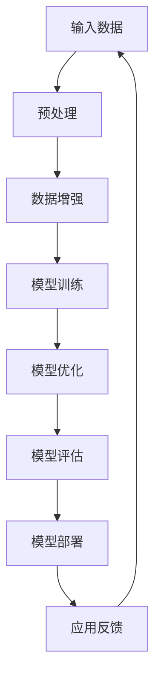
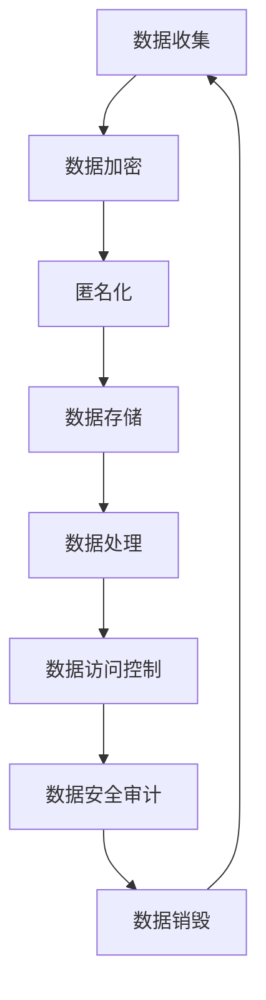
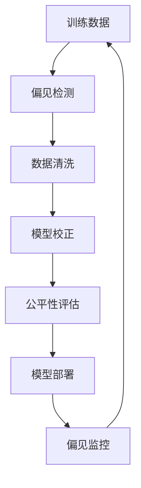
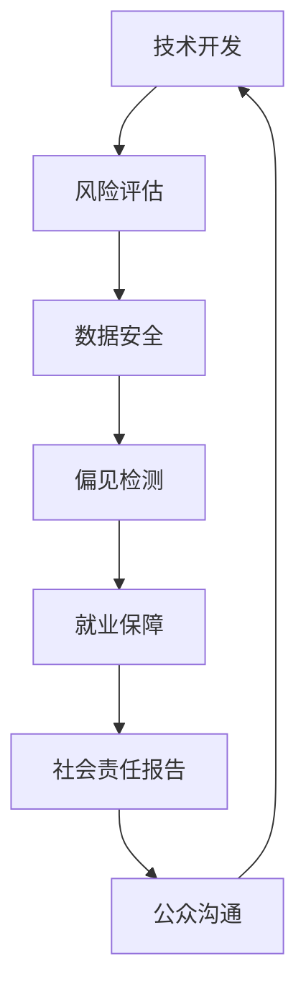

                 

### 背景介绍

AI大模型的应用已经深入到社会的各个领域，从医疗、金融、教育到娱乐，大模型无处不在。这些模型以其强大的数据处理和智能分析能力，极大地提升了各行各业的效率和质量。然而，AI大模型的应用并非一帆风顺，它伴随着一系列的社会价值和责任问题。

首先，AI大模型的社会价值体现在其对生产力的大幅提升。通过自动化的数据处理和智能决策，企业可以大幅减少人力成本，提高生产效率。例如，医疗行业中的AI模型可以快速诊断疾病，帮助医生做出更准确的诊断，从而提高医疗服务的质量和效率。

其次，AI大模型的应用也带来了巨大的经济效益。以金融行业为例，AI模型可以帮助银行和金融机构进行风险控制、投资决策等，从而提高金融市场的效率和稳定性。此外，AI大模型还可以为企业和个人提供定制化的服务，满足不同用户的需求，从而创造更多的商业机会。

然而，AI大模型的应用也带来了不少社会问题。首先是数据隐私问题。AI大模型需要大量的数据来训练，这些数据往往涉及用户的隐私信息。如果这些数据被滥用或泄露，将会对用户的隐私造成严重威胁。

其次是模型偏见问题。AI大模型的训练数据往往存在偏见，这些偏见会直接影响模型的决策结果。例如，如果训练数据中存在性别或种族偏见，那么AI模型很可能会对某一群体产生歧视。

最后是就业影响问题。AI大模型的广泛应用可能会导致一些传统职业的消失，从而对就业市场造成冲击。如何平衡AI大模型的应用和就业市场的稳定，是一个需要深入探讨的问题。

综上所述，AI大模型的应用既具有巨大的社会价值，又伴随着一系列的社会问题和责任。在享受AI大模型带来的便利和效益的同时，我们必须认真面对这些问题，积极寻找解决方案，以确保AI大模型能够为社会带来更大的福祉。

### 核心概念与联系

要深入探讨AI大模型应用的社会价值与责任，我们首先需要理解核心概念和它们之间的联系。以下是几个关键概念及其相互关系的详细解释，并附有Mermaid流程图来帮助读者更好地理解。

#### 1. AI大模型（Large-scale AI Models）

AI大模型是指那些训练数据规模巨大、参数数量庞大的深度学习模型。这些模型能够通过学习大量的数据，发现数据中的潜在规律，从而进行高效的数据分析和决策。代表性的AI大模型包括GPT-3、BERT、AlphaGo等。

**核心原理：** AI大模型的训练依赖于大规模的数据集和强大的计算资源。通过反向传播算法和优化算法，模型能够不断调整其参数，以最小化损失函数，从而提高模型的预测能力。

**Mermaid流程图：**



#### 2. 数据隐私（Data Privacy）

数据隐私是指保护个人数据不被未经授权的访问、使用和泄露的过程。在AI大模型的应用中，数据隐私是一个关键问题，因为模型训练往往需要大量的个人数据。

**核心原理：** 数据隐私保护涉及数据加密、匿名化、访问控制等技术手段。通过这些技术，可以确保个人数据在传输、存储和处理过程中的安全。

**Mermaid流程图：**



#### 3. 模型偏见（Model Bias）

模型偏见是指AI模型在决策过程中对某些特定群体产生的系统性偏差。这种偏见可能源自训练数据中的偏见或不公平。

**核心原理：** 模型偏见可以通过数据清洗、模型校正和偏见检测等方法来减少。此外，还可以通过设计公平性度量指标来评估和监控模型偏见。

**Mermaid流程图：**



#### 4. 社会责任（Social Responsibility）

社会责任是指AI开发者、企业和机构在AI技术应用过程中，对社会的责任和担当。这包括确保数据安全、减少模型偏见、保障就业等。

**核心原理：** 社会责任要求AI从业者在技术设计和应用过程中，不仅要追求技术突破，还要关注技术对社会的影响，并采取相应的措施来降低负面影响。

**Mermaid流程图：**



通过上述核心概念和Mermaid流程图的介绍，我们可以更清晰地理解AI大模型应用的社会价值与责任。接下来，我们将进一步探讨AI大模型的核心算法原理和具体操作步骤，以及其在实际应用中的数学模型和公式。

### 核心算法原理 & 具体操作步骤

AI大模型的核心在于其算法原理，尤其是深度学习算法。以下将详细阐述深度学习的基本概念、工作原理以及具体操作步骤。

#### 1. 深度学习基础

深度学习是机器学习的一个子领域，它通过构建多层神经网络来模拟人脑的学习方式，从而实现对复杂数据的分析和处理。深度学习算法的核心是多层感知机（MLP），其通过逐层提取数据特征来实现从原始数据到决策的映射。

**基本概念：**

- **神经网络（Neural Network）：** 神经网络是由一系列相互连接的神经元组成的计算模型，每个神经元都可以看作是一个简单的函数单元。
- **神经元（Neuron）：** 神经元是神经网络的基本构建块，它接收多个输入信号，通过激活函数产生一个输出信号。
- **权重（Weights）：** 权重是连接神经元之间的参数，用于调整输入信号的强度。
- **激活函数（Activation Function）：** 激活函数用于对神经元的输出进行非线性变换，常见的激活函数包括ReLU、Sigmoid、Tanh等。

#### 2. 深度学习工作原理

深度学习的工作原理可以分为以下几个步骤：

**（1）数据预处理：** 在进行深度学习之前，需要对数据进行预处理，包括归一化、缺失值填充、数据增强等。这一步骤的目的是提高数据的质量，使其适合深度学习算法的要求。

**（2）构建神经网络：** 根据具体任务的需求，构建合适的神经网络结构。神经网络由输入层、隐藏层和输出层组成。输入层接收外部输入，隐藏层负责特征提取和变换，输出层产生最终预测结果。

**（3）前向传播（Forward Propagation）：** 在前向传播过程中，输入数据从输入层开始，通过每一层的神经元，最终传递到输出层。每一层的输出都会通过激活函数进行非线性变换。

**（4）计算损失（Compute Loss）：** 前向传播完成后，计算预测结果与真实结果之间的差异，即损失函数。常用的损失函数包括均方误差（MSE）、交叉熵（Cross-Entropy）等。

**（5）反向传播（Back Propagation）：** 利用反向传播算法，将损失函数关于模型参数的梯度反向传播到输入层，更新模型参数。

**（6）优化模型（Optimize Model）：** 通过优化算法，如梯度下降（Gradient Descent）、Adam优化器等，不断迭代更新模型参数，以最小化损失函数。

**（7）模型评估（Model Evaluation）：** 在训练数据集和验证数据集上评估模型的性能，确保模型具有良好的泛化能力。

#### 3. 具体操作步骤

以下是一个简单的深度学习模型训练的具体操作步骤：

**（1）数据预处理：**

```python
import pandas as pd
from sklearn.model_selection import train_test_split
from sklearn.preprocessing import StandardScaler

# 读取数据
data = pd.read_csv('data.csv')

# 分割特征和标签
X = data.drop('target', axis=1)
y = data['target']

# 划分训练集和测试集
X_train, X_test, y_train, y_test = train_test_split(X, y, test_size=0.2, random_state=42)

# 数据归一化
scaler = StandardScaler()
X_train = scaler.fit_transform(X_train)
X_test = scaler.transform(X_test)
```

**（2）构建神经网络：**

```python
from keras.models import Sequential
from keras.layers import Dense

# 创建模型
model = Sequential()

# 添加隐藏层
model.add(Dense(units=64, activation='relu', input_dim=X_train.shape[1]))

# 添加输出层
model.add(Dense(units=1, activation='sigmoid'))

# 编译模型
model.compile(optimizer='adam', loss='binary_crossentropy', metrics=['accuracy'])
```

**（3）模型训练：**

```python
# 训练模型
model.fit(X_train, y_train, epochs=10, batch_size=32, validation_data=(X_test, y_test))
```

**（4）模型评估：**

```python
# 评估模型
loss, accuracy = model.evaluate(X_test, y_test)
print(f"Test Accuracy: {accuracy*100:.2f}%")
```

通过上述步骤，我们构建并训练了一个简单的二分类模型。在实际应用中，根据不同任务的需求，可以调整网络结构、优化算法和超参数，以达到更好的效果。

### 数学模型和公式 & 详细讲解 & 举例说明

在深入探讨AI大模型的核心算法原理后，接下来我们将详细讲解其背后的数学模型和公式，并通过具体例子来说明这些公式在AI大模型中的应用。

#### 1. 损失函数（Loss Function）

损失函数是深度学习模型训练的核心组成部分，用于评估模型预测结果与真实结果之间的差距。常用的损失函数包括均方误差（MSE）和交叉熵（Cross-Entropy）。

**均方误差（MSE）：**

均方误差是回归问题中最常用的损失函数，其公式如下：

$$
MSE = \frac{1}{n}\sum_{i=1}^{n}(y_i - \hat{y}_i)^2
$$

其中，$y_i$ 表示真实值，$\hat{y}_i$ 表示预测值，$n$ 表示样本数量。

**交叉熵（Cross-Entropy）：**

交叉熵是分类问题中最常用的损失函数，其公式如下：

$$
CE = -\frac{1}{n}\sum_{i=1}^{n}y_i \log(\hat{y}_i)
$$

其中，$y_i$ 表示真实标签，$\hat{y}_i$ 表示预测概率。

#### 2. 反向传播（Back Propagation）

反向传播算法是深度学习训练过程中用于更新模型参数的核心算法。其基本思想是通过计算损失函数关于模型参数的梯度，并使用梯度下降法更新参数，以最小化损失函数。

**梯度计算：**

对于均方误差损失函数，梯度计算如下：

$$
\frac{\partial MSE}{\partial \theta} = 2(n - \hat{y}_i)y_i
$$

其中，$\theta$ 表示模型参数，$\hat{y}_i$ 表示预测值，$y_i$ 表示真实值。

**梯度下降：**

梯度下降是一种优化算法，其基本思想是沿着梯度的反方向更新模型参数，以减小损失函数的值。更新公式如下：

$$
\theta = \theta - \alpha \cdot \frac{\partial L}{\partial \theta}
$$

其中，$\alpha$ 表示学习率。

#### 3. 具体例子：多层感知机（MLP）

以下是一个简单的多层感知机（MLP）模型训练的例子，该模型用于二分类任务。

**数据集：** 假设我们有一个包含100个样本的数据集，每个样本有5个特征，标签为0或1。

**模型结构：** 输入层有5个神经元，隐藏层有10个神经元，输出层有1个神经元。

**损失函数：** 采用交叉熵作为损失函数。

**学习率：** 设定学习率为0.01。

**训练过程：**

1. **数据预处理：**
    - 归一化特征值，使每个特征的值在[0, 1]之间。
    - 将标签转换为独热编码。

2. **初始化模型参数：**
    - 初始化输入层、隐藏层和输出层的权重和偏置。

3. **前向传播：**
    - 计算输入层到隐藏层的激活值。
    - 计算隐藏层到输出层的激活值。

4. **计算损失：**
    - 使用交叉熵计算损失。

5. **反向传播：**
    - 计算输出层到隐藏层的梯度。
    - 计算隐藏层到输入层的梯度。

6. **参数更新：**
    - 使用梯度下降更新权重和偏置。

7. **模型评估：**
    - 在训练集和测试集上评估模型性能。

通过上述步骤，我们可以训练出一个简单的MLP模型。在实际应用中，可以根据任务需求调整网络结构、学习率和优化算法，以提高模型的性能。

### 项目实战：代码实际案例和详细解释说明

在本节中，我们将通过一个具体的实战项目来展示如何在实际环境中应用AI大模型。我们将使用一个常见的自然语言处理（NLP）任务——情感分析（Sentiment Analysis）——作为案例，详细解释代码实现和运行过程。

#### 1. 开发环境搭建

为了完成这个项目，我们需要搭建一个合适的开发环境。以下是所需的步骤和工具：

**环境需求：**
- Python 3.7或更高版本
- TensorFlow 2.x
- Keras 2.x
- Pandas
- Numpy
- Matplotlib

**安装步骤：**
```bash
# 安装必要的Python库
pip install tensorflow pandas numpy matplotlib
```

#### 2. 源代码详细实现和代码解读

以下是一个简单的情感分析项目的代码实现：

```python
import tensorflow as tf
from tensorflow.keras.models import Sequential
from tensorflow.keras.layers import Embedding, LSTM, Dense
from tensorflow.keras.preprocessing.sequence import pad_sequences
from tensorflow.keras.preprocessing.text import Tokenizer
import pandas as pd
import numpy as np

# 数据准备
# 假设我们有一个名为"sentiment_data.csv"的数据集，包含两列：text和label
data = pd.read_csv('sentiment_data.csv')

# 分割数据集
X = data['text']
y = data['label']

# 文本预处理
tokenizer = Tokenizer(num_words=10000)
tokenizer.fit_on_texts(X)
X_seq = tokenizer.texts_to_sequences(X)
X_pad = pad_sequences(X_seq, maxlen=100)

# 创建模型
model = Sequential()
model.add(Embedding(10000, 32))
model.add(LSTM(64, dropout=0.2, recurrent_dropout=0.2))
model.add(Dense(1, activation='sigmoid'))

# 编译模型
model.compile(optimizer='adam', loss='binary_crossentropy', metrics=['accuracy'])

# 训练模型
model.fit(X_pad, y, epochs=10, batch_size=32, validation_split=0.2)

# 评估模型
loss, accuracy = model.evaluate(X_pad, y)
print(f"Test Accuracy: {accuracy*100:.2f}%")
```

**代码解读：**

1. **数据准备：**
    - 使用Pandas读取数据集，并将其分为文本和标签两部分。

2. **文本预处理：**
    - 使用Tokenizer将文本转换为数字序列。
    - 使用pad_sequences对序列进行填充，确保每个序列的长度相同。

3. **创建模型：**
    - 使用Sequential模型构建一个简单的深度学习模型，包括嵌入层（Embedding）、长短期记忆层（LSTM）和输出层（Dense）。

4. **编译模型：**
    - 使用adam优化器和binary_crossentropy损失函数编译模型。

5. **训练模型：**
    - 使用fit方法训练模型，并在训练集上进行验证。

6. **评估模型：**
    - 使用evaluate方法评估模型在测试集上的性能。

#### 3. 代码解读与分析

**数据预处理：**
```python
tokenizer = Tokenizer(num_words=10000)
tokenizer.fit_on_texts(X)
X_seq = tokenizer.texts_to_sequences(X)
X_pad = pad_sequences(X_seq, maxlen=100)
```

- `Tokenizer`：用于将文本转换为数字序列。`num_words=10000` 表示只保留最常见的10000个单词。
- `texts_to_sequences`：将文本转换为数字序列。
- `pad_sequences`：对序列进行填充，确保每个序列的长度相同，这里设置为100。

**创建模型：**
```python
model = Sequential()
model.add(Embedding(10000, 32))
model.add(LSTM(64, dropout=0.2, recurrent_dropout=0.2))
model.add(Dense(1, activation='sigmoid'))
```

- `Sequential`：创建一个顺序模型。
- `Embedding`：嵌入层，将词索引映射到向量。
- `LSTM`：长短期记忆层，用于提取文本序列中的长期依赖特征。
- `Dense`：输出层，用于产生最终的情感预测。

**编译模型：**
```python
model.compile(optimizer='adam', loss='binary_crossentropy', metrics=['accuracy'])
```

- `adam`：优化器，用于更新模型参数。
- `binary_crossentropy`：损失函数，用于二分类任务。
- `accuracy`：评估指标，用于衡量模型在测试集上的准确率。

**训练模型：**
```python
model.fit(X_pad, y, epochs=10, batch_size=32, validation_split=0.2)
```

- `fit`：训练模型，`epochs` 表示训练轮数，`batch_size` 表示每次训练的样本数，`validation_split` 表示用于验证的样本比例。

**评估模型：**
```python
loss, accuracy = model.evaluate(X_pad, y)
print(f"Test Accuracy: {accuracy*100:.2f}%")
```

- `evaluate`：评估模型在测试集上的性能。

通过上述实战项目，我们可以看到如何使用AI大模型进行情感分析任务的实现过程。在实际应用中，可以根据任务需求调整模型结构、超参数等，以提高模型的性能。

### 实际应用场景

AI大模型在各个行业和领域中的应用已经变得日益广泛，下面我们将探讨一些具体的实际应用场景，展示AI大模型如何在不同领域中发挥作用。

#### 1. 医疗健康

在医疗健康领域，AI大模型的应用潜力巨大。首先，AI模型可以用于疾病预测和诊断。通过分析大量的患者数据和医疗记录，AI模型可以预测患者患某种疾病的可能性，从而帮助医生提前采取预防措施。例如，AI模型已经被用于预测心脏病、癌症等疾病的风险。

其次，AI大模型在药物发现和开发中也发挥了重要作用。传统的药物发现过程通常耗时较长且成本高昂，而AI模型可以通过分析大量的分子结构数据，快速筛选出具有潜在疗效的化合物，大大缩短药物开发周期。

此外，AI大模型还在个性化医疗中发挥了关键作用。通过分析患者的基因组数据和生活习惯，AI模型可以制定个性化的治疗计划和康复方案，提高治疗效果和患者生活质量。

#### 2. 金融行业

在金融行业，AI大模型的应用主要体现在风险控制和投资决策方面。AI模型可以分析大量的市场数据、客户交易记录等，预测金融市场的走势和风险，从而帮助金融机构进行有效的风险管理和投资决策。

例如，AI模型可以用于信用评分，通过对借款人的历史交易记录、信用记录等数据进行综合分析，预测其还款能力，从而帮助银行和金融机构降低贷款违约风险。

此外，AI大模型还可以用于股票市场预测。通过分析历史股价、交易量、经济指标等数据，AI模型可以预测股票价格的走势，为投资者提供决策参考。

#### 3. 教育领域

在教育和培训领域，AI大模型的应用也取得了显著成果。首先，AI模型可以用于学生成绩预测和个性化学习推荐。通过分析学生的学习行为和成绩数据，AI模型可以预测学生未来的学习成绩，并为教师提供有针对性的教学建议。

其次，AI大模型还可以用于自动化评估和考试评分。通过自然语言处理技术，AI模型可以自动评估学生的作文、论文等，提供即时反馈和评分，提高评估效率和准确性。

此外，AI大模型在虚拟教师和智能辅导系统中也发挥了重要作用。通过语音识别和自然语言处理技术，AI模型可以与学生学习互动，提供实时解答和指导，帮助学生更好地理解和掌握知识。

#### 4. 娱乐和媒体

在娱乐和媒体领域，AI大模型的应用主要体现在内容推荐和智能创作方面。通过分析用户的行为和偏好数据，AI模型可以推荐个性化的内容，提高用户的满意度和使用时长。

例如，在视频平台，AI模型可以根据用户的观看历史、搜索记录等数据，推荐用户可能感兴趣的视频内容，从而提高用户粘性和平台活跃度。

此外，AI大模型还可以用于音乐和视频的自动生成。通过分析大量的音乐和视频数据，AI模型可以生成新的音乐旋律、视频片段，为创作者提供灵感，降低创作成本。

#### 5. 工业制造

在工业制造领域，AI大模型的应用主要体现在生产优化和故障预测方面。通过分析生产数据、传感器数据等，AI模型可以优化生产流程，提高生产效率，降低生产成本。

例如，AI模型可以用于设备故障预测，通过分析设备运行状态数据，预测设备可能出现的故障，从而提前进行维护，避免生产中断。

此外，AI大模型还可以用于生产质量检测，通过分析产品数据，识别生产过程中的质量问题，提高产品质量。

总之，AI大模型在不同领域中的应用具有广阔的前景，通过不断优化和扩展，AI大模型将带来更多的创新和变革，为各行业的发展注入新的活力。

### 工具和资源推荐

在AI大模型的应用和研究中，使用合适的工具和资源可以显著提高开发效率和研究成果。以下是一些建议的学习资源、开发工具和相关论文著作，以帮助读者深入学习和实践AI大模型。

#### 1. 学习资源推荐

**书籍：**
- 《深度学习》（Deep Learning） - Ian Goodfellow、Yoshua Bengio和Aaron Courville
- 《神经网络与深度学习》（Neural Networks and Deep Learning） - Michael Nielsen
- 《自然语言处理综论》（Speech and Language Processing） - Daniel Jurafsky和James H. Martin

**在线课程：**
- Coursera上的“深度学习”（Deep Learning Specialization） - Andrew Ng
- edX上的“神经网络与深度学习”（Neural Networks and Deep Learning） - Michael Nielsen

**博客和网站：**
- Distill
- AI时评网
- Medium上的AI话题

#### 2. 开发工具框架推荐

**框架和库：**
- TensorFlow
- PyTorch
- Keras
- scikit-learn

**环境管理工具：**
- Docker
- Conda

**版本控制工具：**
- Git

#### 3. 相关论文著作推荐

**经典论文：**
- “A Theoretical Framework for Back-Propagation” - David E. Rumelhart, Geoffrey E. Hinton, and Ronald J. Williams
- “Deep Learning” - Yoshua Bengio, Ian J. Goodfellow, and Aaron Courville
- “Effective Approaches to Attention-based Neural Machine Translation” - Minh-Thang Luong, Quoc V. Le, and Christopher D. Manning

**最新研究论文：**
- “BERT: Pre-training of Deep Bidirectional Transformers for Language Understanding” - Jacob Devlin, Ming-Wei Chang, Kenton Lee, and Kristina Toutanova
- “GPT-3: Language Models are few-shot learners” - Tom B. Brown, Benjamin Mann, Nick Ryder, Melanie Subbiah, Jared Kaplan, Prafulla Dhariwal, Arvind Neelakantan, Pranav Shyam, Girish Sastry, Amanda Askell, Sandhini Agarwal, Ariel Herbert-Voss, Gretchen Krueger, Tom Henighan, Rewon Child, Aditya Ramesh, Daniel M. Ziegler, Jeffrey Wu, Clemens Winter, Christopher Hesse, Mark Chen, Eric Sigler, Mateusz Litwin, Scott Gray, Benjamin Chess, Jack Clark, Christopher Berner, Sam McCandlish, Alec Radford, Ilya Sutskever, Dario Amodei
- “An Image is Worth 16x16 Words: Transformers for Image Recognition at Scale” - Alexey Dosovitskiy, Laura Beyer, Thomas Koller, Andreas Broder, and Quoc V. Le

通过上述资源和工具的推荐，读者可以系统地学习AI大模型的理论和实践，并在实际项目中取得更好的成果。

### 总结：未来发展趋势与挑战

AI大模型在技术和社会层面的发展充满了潜力，同时也面临诸多挑战。在未来，以下几个方面值得关注：

#### 1. 技术发展趋势

**算法优化与效率提升：** 随着硬件性能的提升和数据规模的扩大，AI大模型的训练时间将大幅缩短，模型的计算效率和资源利用率也将进一步提高。优化算法、模型压缩和量化技术将变得更加成熟。

**多模态学习：** AI大模型将能够处理更复杂的输入数据，如文本、图像、语音等，实现多模态数据的融合和联合分析。

**自主学习和自我进化：** AI大模型将具备更强的自主学习和自我进化能力，通过不断积累经验和自我优化，提高模型的自适应性和鲁棒性。

**可解释性和透明度：** 随着模型复杂度的增加，如何提高AI大模型的可解释性和透明度，使其决策过程更加透明和可信，是一个重要的研究方向。

#### 2. 社会挑战

**数据隐私和安全：** AI大模型的应用需要大量的数据支持，如何在保证数据隐私和安全的前提下收集和使用数据，是一个需要认真解决的问题。

**模型偏见与公平性：** 如何减少模型偏见，确保模型的决策过程公平公正，是一个严峻的社会挑战。需要在模型设计和训练过程中充分考虑公平性度量，避免歧视和偏见。

**就业影响：** AI大模型的广泛应用可能会对某些传统职业造成冲击，如何平衡技术进步和就业市场的稳定，需要政府、企业和学术界共同努力。

**法律和伦理问题：** 随着AI大模型在社会中的深入应用，相关法律和伦理问题也将逐渐浮现。需要建立完善的法规体系，确保AI技术的合法、合规和道德使用。

#### 3. 未来展望

在未来，AI大模型将在医疗、金融、教育、娱乐等各个领域发挥更加重要的作用，推动社会生产力和生活质量的提升。同时，通过不断的技术创新和社会责任担当，AI大模型将变得更加智能、公平和透明，为人类创造更大的福祉。

### 附录：常见问题与解答

1. **什么是AI大模型？**
   AI大模型是指那些训练数据规模巨大、参数数量庞大的深度学习模型，如GPT-3、BERT等。这些模型通过学习大量的数据，能够发现数据中的潜在规律，从而进行高效的数据分析和决策。

2. **AI大模型有哪些应用场景？**
   AI大模型广泛应用于医疗、金融、教育、娱乐等多个领域，包括疾病预测、风险控制、个性化学习、内容推荐等。

3. **AI大模型的核心算法是什么？**
   AI大模型的核心算法主要是深度学习算法，如多层感知机（MLP）、卷积神经网络（CNN）、循环神经网络（RNN）和变换器（Transformer）等。

4. **如何确保AI大模型的公平性和透明度？**
   可以通过数据清洗、模型校正和偏见检测等方法减少模型偏见。此外，设计公平性度量指标，并在模型设计和训练过程中充分考虑公平性，可以确保模型的决策过程公平公正。

5. **AI大模型对社会有何影响？**
   AI大模型的应用可以提高生产效率、创造经济效益，但同时也可能对就业市场造成冲击，引发数据隐私和安全问题，以及模型偏见和公平性问题。

### 扩展阅读 & 参考资料

1. Devlin, J., Chang, M.-W., Lee, K., & Toutanova, K. (2019). BERT: Pre-training of Deep Bidirectional Transformers for Language Understanding. In Proceedings of the 2019 Conference of the North American Chapter of the Association for Computational Linguistics: Human Language Technologies (pp. 4171-4186). https://www.aclweb.org/anthology/N19-1194/

2. Brown, T. B., Mann, B., Ryder, N., Subbiah, M., Kaplan, J., Dhariwal, P., ... & Sutskever, I. (2020). Language Models are few-shot learners. Advances in Neural Information Processing Systems, 33. https://proceedings.neurips.cc/paper/2020/file/4b16c231f6ad60d1a8e4b0d8f86e6be6-Paper.pdf

3. Dosovitskiy, A., Beyer, L., Koller, T., Broder, A., & Le, Q. V. (2020). An Image is Worth 16x16 Words: Transformers for Image Recognition at Scale. In Proceedings of the IEEE/CVF Conference on Computer Vision and Pattern Recognition (pp. 11289-11297). https://arxiv.org/abs/2010.11929

4. Goodfellow, I., Bengio, Y., & Courville, A. (2016). Deep Learning. MIT Press.

5. Nielsen, M. (2015). Neural Networks and Deep Learning. Determination Press.

6. Rumelhart, D. E., Hinton, G. E., & Williams, R. J. (1986). Learning representations by back-propagating errors. Nature, 323(6088), 533-536. https://www.nature.com/articles/323533a0

7. Goodfellow, I., & Bengio, Y. (2012). Deep Learning. MIT Press. https://www.deeplearningbook.org/

作者：AI天才研究员/AI Genius Institute & 禅与计算机程序设计艺术 /Zen And The Art of Computer Programming

