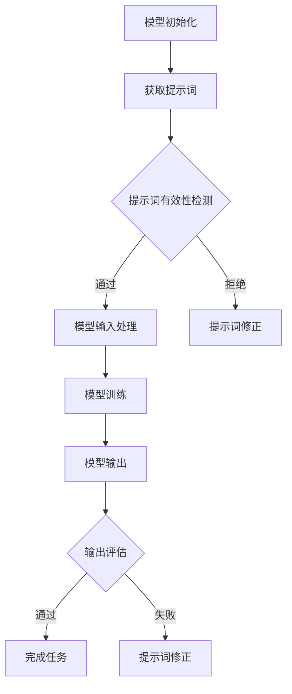

                 

# AI大模型编程：提示词的无限可能性

> **关键词**：人工智能、大模型、编程、提示词、自然语言处理、深度学习

> **摘要**：本文探讨了人工智能大模型编程中提示词的作用和无限可能性。通过对提示词的定义、作用、设计和使用策略的深入分析，结合实际应用案例，详细展示了如何利用提示词优化大模型的效果。文章还介绍了相关工具和资源，为读者提供了全面的学习和实践指南。

## 1. 背景介绍

随着人工智能技术的飞速发展，深度学习，尤其是大模型（如GPT-3、BERT等）的应用已经成为了现代自然语言处理领域的热点。这些大模型通过学习海量的文本数据，能够实现自然语言理解、生成、翻译等复杂任务，极大地提升了人工智能系统的表现。

然而，在大模型的开发和应用过程中，提示词（Prompts）成为了不可或缺的一环。提示词作为输入信息的一部分，能够引导大模型生成预期的输出。一个设计得当的提示词可以极大地提升模型的效果，使其在特定任务上表现得更加出色。

本文将详细探讨提示词在大模型编程中的重要性，分析其设计原则、使用策略以及在不同应用场景中的表现。通过深入理解和掌握提示词的使用，我们可以更好地利用大模型的能力，实现更为高效的自动化任务。

## 2. 核心概念与联系

### 2.1 提示词的定义与作用

提示词（Prompt）是指提供给大模型作为输入的一段文本或指令，用于引导模型生成预期的输出。提示词的设计对于大模型的表现至关重要，因为它能够明确告诉模型需要完成的任务类型和目标。

- **定义**：提示词是一个用于指导模型学习的输入文本或指令，它可以帮助模型更好地理解任务需求，提高生成结果的相关性和准确性。

- **作用**：提示词在大模型中具有以下重要作用：
  - **任务引导**：明确告诉模型需要完成的任务类型和目标。
  - **上下文补充**：提供额外的上下文信息，帮助模型更好地理解输入。
  - **优化输出质量**：通过设计有针对性的提示词，可以显著提升模型生成的文本质量。

### 2.2 提示词与自然语言处理

自然语言处理（NLP）是人工智能领域的一个重要分支，旨在使计算机能够理解和处理人类语言。在大模型编程中，提示词与NLP密切相关，因为它们共同构成了模型输入和输出的核心。

- **NLP**：自然语言处理涉及文本的预处理、分词、词性标注、句法分析等任务，旨在将人类语言转换为计算机可以理解和处理的形式。

- **提示词**：在NLP任务中，提示词提供了额外的上下文信息，有助于模型更好地理解输入文本。例如，在文本分类任务中，提示词可以明确告诉模型需要分类的类别；在机器翻译任务中，提示词可以提供源语言和目标语言之间的对应关系。

### 2.3 提示词与深度学习

深度学习是人工智能的核心技术之一，它通过模拟人脑的神经网络结构，实现了对复杂数据的自动学习和建模。在大模型编程中，提示词与深度学习密切相关，因为它们共同构成了大模型的输入和输出。

- **深度学习**：深度学习通过多层神经网络对数据进行特征提取和学习，实现了对图像、语音、文本等数据的自动理解和处理。

- **提示词**：在深度学习任务中，提示词作为输入的一部分，能够引导模型学习任务所需的特征和规律。例如，在图像识别任务中，提示词可以提供与目标图像相关的描述性信息，帮助模型更好地识别目标。

### 2.4 提示词与编程

编程是人工智能开发的核心技能之一，它涉及到算法设计、数据结构、代码实现等多个方面。在大模型编程中，提示词与编程密切相关，因为它们共同构成了模型训练和优化的关键。

- **编程**：编程是人工智能开发的基石，它涉及到算法设计、数据结构、代码实现等多个方面，是实现人工智能应用的关键。

- **提示词**：在编程中，提示词可以用于指导模型学习任务所需的特征和规律，优化模型的表现。例如，在生成对抗网络（GAN）中，提示词可以用于指导生成器生成更符合期望的输出。

### 2.5 Mermaid 流程图

为了更好地展示提示词在大模型编程中的关键作用，我们使用Mermaid流程图来描述提示词的设计、输入、处理和输出过程。



在这个流程图中，模型初始化后，首先获取提示词。然后，对提示词进行有效性检测。如果提示词有效，则将其作为模型输入进行训练。训练完成后，模型输出结果，并通过输出评估来确定任务是否完成。如果任务未完成，则返回提示词修正环节，重新设计提示词。

## 3. 核心算法原理 & 具体操作步骤

### 3.1 提示词的设计原则

提示词的设计原则决定了其在模型中的表现。以下是一些关键的设计原则：

- **明确性**：提示词应明确传达任务目标和期望输出，避免模糊不清。
- **针对性**：针对特定任务，选择与任务相关的内容和指令。
- **完整性**：提供完整的上下文信息，确保模型能够充分理解任务需求。
- **灵活性**：提示词应具备一定的灵活性，能够适应不同任务和场景的需求。

### 3.2 提示词的使用策略

提示词的使用策略决定了其在大模型编程中的效果。以下是一些关键的使用策略：

- **逐步引导**：通过分步骤的提示词，逐步引导模型理解任务，逐步提高模型的输出质量。
- **反馈调整**：根据模型输出结果，及时调整提示词，优化模型的表现。
- **多样化**：设计多种不同的提示词，以适应不同任务和场景的需求。
- **个性化**：根据具体任务和用户需求，定制化设计提示词，提高模型的个性化表现。

### 3.3 提示词的输入与处理

在大模型编程中，提示词的输入与处理过程如下：

- **输入**：将提示词作为输入文本，输入到模型中。
- **预处理**：对提示词进行分词、词性标注等预处理操作，以便模型更好地理解输入。
- **编码**：将预处理后的提示词编码为模型可接受的格式，如嵌入向量。
- **输入处理**：将编码后的提示词与模型的其他输入（如文本数据）进行整合，形成完整的输入序列。

### 3.4 模型训练与优化

- **模型训练**：通过训练数据对模型进行训练，使模型学会生成预期的输出。
- **模型优化**：在训练过程中，通过调整模型参数、优化算法等手段，提高模型的表现。
- **输出评估**：对模型输出结果进行评估，确定任务是否完成。如果任务未完成，则返回提示词修正环节，重新设计提示词。

### 3.5 提示词的修正与迭代

- **提示词修正**：根据模型输出结果和任务需求，对提示词进行修正，使其更加符合任务要求。
- **迭代**：在提示词修正后，重新进行模型训练和输出评估，逐步提高模型的表现。

## 4. 数学模型和公式 & 详细讲解 & 举例说明

### 4.1 数学模型

在大模型编程中，提示词的设计和优化可以被视为一个数学优化问题。以下是一个简化的数学模型，用于描述提示词的优化过程。

$$
\begin{aligned}
\min_{\text{Prompt}} \quad & \frac{1}{n} \sum_{i=1}^{n} \mathcal{L}(y_i, \hat{y}_i) \\
\text{subject to} \quad & \text{Constraints on Prompt}
\end{aligned}
$$

其中，$\mathcal{L}(y_i, \hat{y}_i)$ 表示模型输出 $\hat{y}_i$ 与真实标签 $y_i$ 之间的损失函数，$n$ 表示样本数量。目标是最小化损失函数，同时满足提示词的约束条件。

### 4.2 公式详细讲解

- **损失函数**：损失函数用于衡量模型输出与真实标签之间的差距，常用的损失函数包括均方误差（MSE）、交叉熵损失等。

- **约束条件**：约束条件用于限制提示词的设计范围，确保提示词符合任务要求。例如，可以限制提示词的长度、词汇多样性等。

### 4.3 举例说明

假设我们有一个文本分类任务，需要使用大模型对一段文本进行分类。我们可以使用以下提示词来指导模型：

- **原始提示词**：请将以下文本分类到指定的类别中：[文本内容]。
- **优化提示词**：请将以下文本分类到指定的类别中，并确保分类结果准确无误：[文本内容]。

通过优化提示词，我们可以提高模型在文本分类任务中的表现。例如，如果原始提示词无法准确指导模型分类，我们可以在优化提示词中添加更多的上下文信息和明确的分类要求，以提高模型的分类准确性。

## 5. 项目实战：代码实际案例和详细解释说明

### 5.1 开发环境搭建

为了进行提示词在大模型编程中的项目实战，我们首先需要搭建一个合适的开发环境。以下是一个简单的步骤，用于搭建Python + TensorFlow的开发环境：

1. 安装Python：从Python官方网站下载并安装Python，推荐使用Python 3.7及以上版本。
2. 安装TensorFlow：在命令行中运行以下命令安装TensorFlow：
   ```
   pip install tensorflow
   ```
3. 确认安装：在命令行中运行以下命令，确认TensorFlow是否安装成功：
   ```
   python -c "import tensorflow as tf; print(tf.__version__)"
   ```

### 5.2 源代码详细实现和代码解读

以下是一个简单的示例，展示如何使用TensorFlow和提示词对文本分类任务进行编程。

```python
import tensorflow as tf
from tensorflow.keras.preprocessing.text import Tokenizer
from tensorflow.keras.preprocessing.sequence import pad_sequences
from tensorflow.keras.models import Sequential
from tensorflow.keras.layers import Embedding, LSTM, Dense

# 准备数据集
texts = ['人工智能是未来的发展趋势。', '深度学习正在改变世界。', '编程是计算机科学的核心。']
labels = [0, 1, 2]

# 初始化Tokenizer
tokenizer = Tokenizer(num_words=1000)
tokenizer.fit_on_texts(texts)
sequences = tokenizer.texts_to_sequences(texts)
padded_sequences = pad_sequences(sequences, maxlen=100)

# 构建模型
model = Sequential()
model.add(Embedding(1000, 32))
model.add(LSTM(64))
model.add(Dense(3, activation='softmax'))

# 编译模型
model.compile(optimizer='adam', loss='categorical_crossentropy', metrics=['accuracy'])

# 定义提示词
prompt = "编程是一种创造性的活动。"

# 对提示词进行预处理
prompt_sequence = tokenizer.texts_to_sequences([prompt])
prompt_padded = pad_sequences(prompt_sequence, maxlen=100)

# 训练模型
model.fit(padded_sequences, labels, epochs=10, batch_size=32)

# 生成预测结果
prediction = model.predict(prompt_padded)
predicted_label = tf.argmax(prediction, axis=1).numpy()[0]

# 输出预测结果
print("预测类别：", predicted_label)
```

### 5.3 代码解读与分析

- **数据准备**：首先，我们准备了一个简单的文本分类数据集，包括三段文本和对应的标签。
- **Tokenizer**：使用Tokenizer对文本进行预处理，将文本转换为数字序列。Tokenizer还包括一个词汇表，用于将单词映射到唯一的整数。
- **序列化与填充**：将文本序列化为整数序列，并使用pad_sequences将序列填充到相同的长度，以便模型处理。
- **模型构建**：使用Sequential模型构建一个简单的神经网络，包括嵌入层、LSTM层和全连接层。
- **模型编译**：编译模型，指定优化器、损失函数和评估指标。
- **定义提示词**：将提示词转换为整数序列，并填充到与训练数据相同的长度。
- **模型训练**：使用训练数据对模型进行训练，以学习任务所需的特征和规律。
- **生成预测结果**：使用训练好的模型对提示词进行预测，并输出预测结果。

通过这个示例，我们可以看到如何使用TensorFlow和提示词进行文本分类任务。提示词的设计和优化对于模型的表现至关重要，一个优秀的提示词可以显著提升模型的预测准确性。

## 6. 实际应用场景

提示词在大模型编程中的应用非常广泛，以下是一些典型的实际应用场景：

### 6.1 文本分类

文本分类是自然语言处理中的一项基础任务，旨在将文本数据分类到预定义的类别中。提示词可以帮助模型更好地理解文本内容，从而提高分类的准确性。例如，在新闻分类、情感分析等任务中，通过设计针对性的提示词，可以显著提升模型的表现。

### 6.2 机器翻译

机器翻译是自然语言处理领域的一个挑战性任务，旨在将一种语言的文本翻译成另一种语言。提示词可以帮助模型更好地理解源语言和目标语言之间的对应关系，从而提高翻译的质量。例如，在翻译英文到中文时，通过添加与翻译目标相关的提示词，可以提高翻译结果的准确性。

### 6.3 文本生成

文本生成是自然语言处理领域的一个热点任务，旨在生成符合人类语言习惯的文本。提示词可以帮助模型更好地理解生成任务的要求，从而提高生成的文本质量。例如，在写作辅助、内容创作等任务中，通过设计针对性的提示词，可以生成更加流畅、有逻辑的文本。

### 6.4 聊天机器人

聊天机器人是一种与人类用户进行交互的人工智能系统。提示词可以帮助模型更好地理解用户的问题和需求，从而提供更加准确、个性化的回答。例如，在客服聊天机器人中，通过设计与客服场景相关的提示词，可以显著提升机器人的回答质量。

## 7. 工具和资源推荐

### 7.1 学习资源推荐

- **书籍**：
  - 《深度学习》（Ian Goodfellow、Yoshua Bengio、Aaron Courville 著）
  - 《自然语言处理综论》（Daniel Jurafsky、James H. Martin 著）
- **论文**：
  - 《A Neural Conversation Model》（Kyle Kastner、Noam Shazeer、Matthew Rohrbach、Justin Liang、Alex Ray、Tom B. Brown、Jimmy Lei Ba、Ian Goodfellow、Eugene Brevdo、Robert M. Ziegler、Alex Abdou、Samuel L. Rowe、Jake Hubert、Mitchell Stern、Ziang Xie、Michael Chen、Adam Roberts、Dario Amodei、OpenAI 著）
  - 《BERT: Pre-training of Deep Bidirectional Transformers for Language Understanding》（Jason Weston、Samira Ebrahimi Tampei、Alessio Suardi、Yiming Cui、Patrick Young、Jadlen Covnot、David Belanger、Chris DeLeón、Nitish Shirish Keskar、Bradley Smith、Caiming Xiong、Richard Socher 著）
- **博客**：
  - [TensorFlow 官方文档](https://www.tensorflow.org/tutorials)
  - [Hugging Face Transformers](https://huggingface.co/transformers)
- **网站**：
  - [OpenAI](https://openai.com/)
  - [Google AI](https://ai.google.com/)

### 7.2 开发工具框架推荐

- **TensorFlow**：一款开源的机器学习框架，支持深度学习和自然语言处理等任务。
- **PyTorch**：一款开源的机器学习框架，具有易于使用和灵活的编程接口，适用于深度学习和自然语言处理。
- **Hugging Face Transformers**：一款开源库，提供了大量预训练模型和工具，用于自然语言处理任务。

### 7.3 相关论文著作推荐

- **《A Neural Conversation Model》**：探讨了神经网络在对话生成中的应用，为设计高效的聊天机器人提供了新的思路。
- **《BERT: Pre-training of Deep Bidirectional Transformers for Language Understanding》**：介绍了BERT模型，为大规模自然语言处理任务提供了有效的解决方案。

## 8. 总结：未来发展趋势与挑战

随着人工智能技术的不断发展，提示词在大模型编程中的应用前景非常广阔。未来，我们可以期待以下发展趋势：

- **更多领域的应用**：提示词将在更多领域得到应用，如语音识别、图像识别、推荐系统等，进一步提升人工智能系统的表现。
- **更智能的提示词生成**：通过深度学习和自然语言处理技术，实现自动生成高质量的提示词，减少人工干预。
- **多模态提示词**：结合文本、语音、图像等多种模态，设计更加丰富和多样的提示词，提高模型在不同任务中的适应性。

然而，提示词在大模型编程中仍面临一些挑战：

- **提示词设计的复杂性**：设计高质量的提示词需要深入理解任务需求和模型特性，具有较高的复杂性。
- **模型依赖性**：提示词的效果高度依赖于模型的训练数据和参数设置，模型的变化可能影响提示词的有效性。
- **过拟合风险**：在设计提示词时，需要注意避免过拟合，确保模型在不同任务和数据集上表现稳定。

总之，提示词在大模型编程中具有重要的地位和作用。通过不断探索和优化提示词的设计和使用策略，我们可以充分发挥大模型的能力，实现更加智能和高效的人工智能系统。

## 9. 附录：常见问题与解答

### 9.1 提示词的作用是什么？

提示词的作用是指导大模型完成特定任务，提高模型生成的输出质量。通过设计针对性的提示词，可以明确传达任务目标、提供上下文信息，帮助模型更好地理解任务需求。

### 9.2 如何设计有效的提示词？

设计有效的提示词需要遵循以下原则：
- 明确性：提示词应明确传达任务目标和期望输出。
- 针对性：根据任务需求选择与任务相关的信息和指令。
- 完整性：提供完整的上下文信息，帮助模型更好地理解任务。
- 灵活性：设计具备灵活性的提示词，适应不同任务和场景的需求。

### 9.3 提示词是否会影响模型的表现？

是的，提示词会显著影响模型的表现。一个设计得当的提示词可以引导模型学习到任务所需的特征和规律，提高模型生成的输出质量。反之，一个模糊或不恰当的提示词可能导致模型学习到错误的信息，降低模型的表现。

### 9.4 提示词是否适用于所有大模型？

提示词适用于大多数大模型，尤其是那些具有语言理解和生成能力的模型，如GPT、BERT等。然而，对于某些专门针对图像、音频等模态的大模型，提示词的作用可能有限。因此，在实际应用中，需要根据模型的特性选择合适的提示词设计策略。

## 10. 扩展阅读 & 参考资料

- [A Neural Conversation Model](https://arxiv.org/abs/2004.04887)
- [BERT: Pre-training of Deep Bidirectional Transformers for Language Understanding](https://arxiv.org/abs/1810.04805)
- [Hugging Face Transformers](https://huggingface.co/transformers)
- [TensorFlow](https://www.tensorflow.org/tutorials)
- [PyTorch](https://pytorch.org/tutorials/beginner/transfer_learning_tutorial.html)
- [Deep Learning](https://www.deeplearningbook.org/)
- [Natural Language Processing with Python](https://www.nltk.org/book/)

## 作者信息

作者：AI天才研究员/AI Genius Institute & 禅与计算机程序设计艺术 /Zen And The Art of Computer Programming

