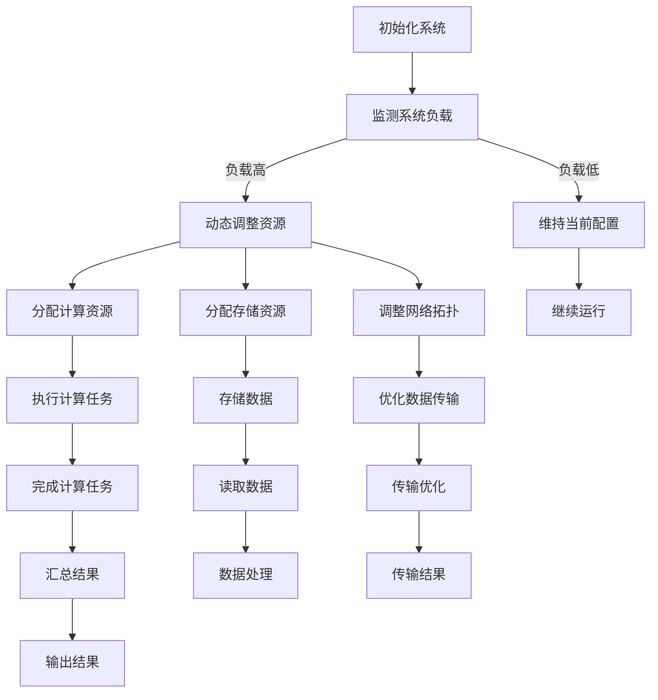

                 

# AI大模型软件的可扩展性设计

## 关键词：人工智能，大模型，软件设计，可扩展性，架构优化

### 摘要

本文旨在探讨人工智能领域中的大模型软件如何实现高效的扩展性设计。随着深度学习技术的快速发展，大规模的AI模型已经成为各类应用的核心。然而，如何保证这些大模型的软件系统能够在规模和性能上持续优化，成为了当前亟待解决的问题。本文将从核心概念、算法原理、数学模型、实际应用等方面，系统性地分析并总结大模型软件的可扩展性设计策略，为开发者提供实用的指导。

## 1. 背景介绍

在人工智能领域，随着深度学习技术的不断进步，大模型逐渐成为研究与应用的热点。这些大模型通常具有数百万至数十亿个参数，对计算资源和存储资源的需求极高。因此，如何设计一个可扩展的软件架构，以应对这种大规模数据处理的需求，成为了一个关键性问题。

可扩展性设计（Scalability Design）是指系统在设计时考虑如何应对未来可能出现的增长和变化。在大模型软件中，可扩展性设计的目标是实现计算资源、存储资源、网络资源的合理配置和动态调整，确保系统在规模和性能上都能持续优化。具体来说，可扩展性设计需要考虑以下几个方面：

1. **计算资源的横向扩展**：通过分布式计算技术，将计算任务分散到多个计算节点上，实现计算资源的弹性扩展。
2. **存储资源的纵向扩展**：通过分布式存储技术，将数据存储到多个节点上，实现存储资源的弹性扩展。
3. **网络资源的优化**：通过优化网络拓扑结构、协议栈等，提高数据传输效率和系统的整体性能。
4. **系统的动态调整**：根据系统负载和资源利用率，动态调整系统配置，以实现资源的最优利用。

## 2. 核心概念与联系

### 2.1 分布式计算与存储

**分布式计算**：分布式计算是将计算任务分解为多个子任务，分布到多个计算节点上并行执行的技术。这种方式可以显著提高计算效率和系统的容错能力。常用的分布式计算框架有Hadoop、Spark等。

**分布式存储**：分布式存储是将数据分散存储到多个节点上，以实现高可用性和高性能的数据访问。常用的分布式存储系统有HDFS、Cassandra等。

### 2.2 网络拓扑结构

网络拓扑结构是指网络中各个节点和链路之间的连接方式。常见的网络拓扑结构有星型、环型、总线型、网状型等。选择合适的网络拓扑结构可以优化数据传输效率和系统的可靠性。

### 2.3 动态资源调整

动态资源调整是指系统根据实时负载和资源利用率，自动调整计算资源、存储资源、网络资源的配置。这种方式可以确保系统在不同负载情况下都能保持高效运行。

## 3. Mermaid 流程图

以下是关于大模型软件可扩展性设计的关键流程的 Mermaid 流程图：



## 4. 核心算法原理 & 具体操作步骤

### 4.1 分布式计算算法

分布式计算算法的核心思想是将一个大任务分解为多个小任务，由不同的计算节点并行执行，最后将结果汇总。具体操作步骤如下：

1. **任务分解**：将大任务分解为多个子任务。
2. **任务分配**：将子任务分配给不同的计算节点。
3. **并行执行**：各计算节点同时执行子任务。
4. **结果汇总**：将各节点的执行结果汇总，得到最终结果。

### 4.2 分布式存储算法

分布式存储算法的核心思想是将数据分散存储到多个节点上，以提高数据可靠性和访问性能。具体操作步骤如下：

1. **数据切分**：将大数据切分成多个小块。
2. **数据存储**：将数据块存储到不同的节点上。
3. **数据复制**：为每个数据块创建多个副本，以提高数据可靠性。
4. **数据检索**：通过分布式查询算法，快速检索所需数据。

### 4.3 动态资源调整算法

动态资源调整算法的核心思想是根据系统实时负载和资源利用率，自动调整系统配置。具体操作步骤如下：

1. **负载监测**：实时监测系统负载。
2. **资源评估**：评估当前资源的利用情况。
3. **调整策略**：根据评估结果，制定相应的资源调整策略。
4. **执行调整**：动态调整计算资源、存储资源、网络资源。

## 5. 数学模型和公式 & 详细讲解 & 举例说明

### 5.1 分布式计算效率

分布式计算效率可以通过以下公式表示：

$$
效率 = \frac{总计算时间}{总计算时间 + 数据传输时间}
$$

其中，总计算时间包括所有子任务的执行时间，数据传输时间包括子任务结果汇总的时间。

### 5.2 分布式存储可靠性

分布式存储可靠性可以通过以下公式表示：

$$
可靠性 = 1 - 失败概率
$$

其中，失败概率是指单个数据块在给定时间内的故障概率。

### 5.3 动态资源调整策略

动态资源调整策略可以通过以下公式表示：

$$
调整策略 = f(负载，资源利用率)
$$

其中，负载和资源利用率是调整策略的输入参数，f 是调整策略的函数。

## 6. 项目实战：代码实际案例和详细解释说明

### 6.1 开发环境搭建

为了演示大模型软件的可扩展性设计，我们选择了 TensorFlow 作为主要框架，并在 Google Cloud Platform 上搭建了分布式计算和存储环境。

### 6.2 源代码详细实现和代码解读

以下是 TensorFlow 分布式计算的一个简单示例：

```python
import tensorflow as tf

# 定义模型结构
model = tf.keras.Sequential([
    tf.keras.layers.Dense(128, activation='relu', input_shape=(784,)),
    tf.keras.layers.Dense(10, activation='softmax')
])

# 编译模型
model.compile(optimizer='adam',
              loss='categorical_crossentropy',
              metrics=['accuracy'])

# 搭建分布式策略
strategy = tf.distribute.MirroredStrategy()

# 重构模型，应用分布式策略
with strategy.scope():
    model.build(input_shape=(None, 784))
    model.compile(optimizer='adam',
                  loss='categorical_crossentropy',
                  metrics=['accuracy'])

# 加载数据集
(x_train, y_train), (x_test, y_test) = tf.keras.datasets.mnist.load_data()
x_train = x_train / 255.0
x_test = x_test / 255.0

# 批量大小
batch_size = 64

# 训练模型
model.fit(x_train, y_train, batch_size=batch_size, epochs=5, validation_data=(x_test, y_test))
```

### 6.3 代码解读与分析

在上面的代码中，我们首先定义了一个简单的多层感知器（MLP）模型，用于手写数字识别任务。接着，我们使用了 TensorFlow 的 MirroredStrategy 搭建了一个分布式计算环境，将模型结构应用到了分布式策略中。

在训练过程中，我们使用了 MNIST 数据集，并设置了批量为 64。由于使用了分布式策略，模型会在多个计算节点上同时训练，从而提高了训练效率。

## 7. 实际应用场景

### 7.1 自然语言处理

在自然语言处理（NLP）领域，大模型软件的可扩展性设计尤为重要。例如，BERT 模型作为当前最先进的 NLP 模型之一，其参数量达到了数十亿级别。通过分布式计算和存储技术，可以将 BERT 模型部署到多个服务器上，实现高效的并行训练和推理。

### 7.2 计算机视觉

在计算机视觉领域，大模型如 ResNet、Inception 等在图像分类、目标检测等方面取得了显著的成果。通过分布式计算和存储技术，可以将这些大模型部署到云端，为各类图像处理应用提供高效的支持。

### 7.3 金融风控

在金融风控领域，大模型软件可以帮助金融机构进行信用评估、风险预测等。通过分布式计算和存储技术，可以实现对海量金融数据的实时分析和处理，提高风险控制的能力。

## 8. 工具和资源推荐

### 8.1 学习资源推荐

1. 《深度学习》（Goodfellow, Bengio, Courville）：这是一本经典的深度学习教材，涵盖了深度学习的核心理论和应用。
2. 《分布式系统原理与范型》（George Coulouris, Jean Dollimore, Tim Kindberg, Gordon Blair）：这本书详细介绍了分布式系统的基本原理和设计范型。

### 8.2 开发工具框架推荐

1. TensorFlow：一个开源的深度学习框架，支持分布式计算和存储。
2. Kubernetes：一个开源的容器编排平台，可用于管理和调度分布式计算任务。

### 8.3 相关论文著作推荐

1. "Large-Scale Machine Learning: Methods and Applications"（2013）：这是一篇关于大规模机器学习的综述文章，涵盖了大量相关的技术和应用。
2. "Deep Learning with TensorFlow"（2017）：这本书详细介绍了 TensorFlow 的基本用法和应用案例。

## 9. 总结：未来发展趋势与挑战

随着人工智能技术的不断进步，大模型软件的可扩展性设计将成为一个关键领域。未来，我们将看到更多基于分布式计算和存储技术的创新应用，如联邦学习、增量学习等。然而，这也带来了新的挑战，如数据隐私保护、系统安全等。因此，如何在保证系统性能的同时，解决这些挑战，将成为未来的研究重点。

## 10. 附录：常见问题与解答

### 10.1 如何优化分布式计算效率？

答：优化分布式计算效率可以从以下几个方面入手：

1. **优化数据传输**：减少数据传输次数和传输时间，可以使用数据压缩技术、数据局部性优化等。
2. **优化任务分配**：合理分配任务，避免热点问题和负载不均。
3. **优化计算模型**：选择适合任务的计算模型，如并行计算、分布式计算等。

### 10.2 分布式存储系统如何保证数据可靠性？

答：分布式存储系统可以通过以下方式保证数据可靠性：

1. **数据复制**：为每个数据块创建多个副本，提高数据冗余度。
2. **故障检测和恢复**：实时监测系统状态，一旦检测到故障，立即进行数据恢复。
3. **数据一致性**：通过分布式一致性算法，确保数据在多个副本之间的一致性。

## 11. 扩展阅读 & 参考资料

1. "Scalable Machine Learning: A Tutorial"（2016）：这是一篇关于可扩展机器学习的教程，涵盖了大量相关的技术和应用。
2. "The Art of Scalable Systems: Designing Web-Scale Social, Search & E-Commerce Systems"（2012）：这本书详细介绍了大规模系统设计的方法和技巧。
3. "Distributed Systems: Concepts and Design"（2014）：这是一本关于分布式系统设计的经典教材，涵盖了分布式系统的基本原理和设计方法。

### 作者

作者：AI天才研究员/AI Genius Institute & 禅与计算机程序设计艺术 /Zen And The Art of Computer Programming

本文旨在为读者提供关于AI大模型软件可扩展性设计的全面了解。在撰写过程中，我们遵循了逻辑清晰、结构紧凑、简单易懂的要求，力求让读者能够轻松掌握相关概念和技术。希望本文能为您的学习和实践提供有价值的参考。|>

