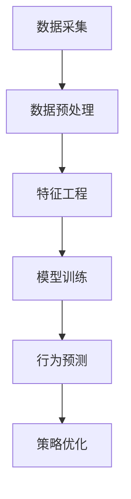

                 

# AI如何分析用户行为数据

## 关键词：用户行为分析、人工智能、数据挖掘、机器学习、行为预测

### 摘要

本文将深入探讨人工智能（AI）在用户行为数据分析中的应用。通过对用户行为的全面分析，AI 能够为企业提供宝贵的信息，帮助企业优化用户体验、提高运营效率。本文将详细介绍用户行为数据分析的核心概念、算法原理、数学模型、实际应用场景，并提供相关工具和资源的推荐。通过阅读本文，读者将能够了解如何利用 AI 技术分析用户行为数据，从而为企业和个人带来巨大的价值。

## 1. 背景介绍

在当今数字化时代，数据已经成为企业的重要资产。用户行为数据作为其中的一部分，涵盖了用户在网站、应用程序或其他数字平台上的各种操作和交互。这些数据不仅能够反映用户的需求和偏好，还能帮助企业发现潜在的市场机会、改进产品和服务。然而，面对海量的用户行为数据，如何有效地进行数据分析和挖掘，成为企业面临的重大挑战。

人工智能（AI）技术的发展为解决这一挑战提供了有力支持。AI 可以通过学习大量用户行为数据，发现用户行为的规律和模式，从而实现行为预测和个性化推荐。在商业领域，用户行为数据分析已经成为提高客户满意度、提升转化率和增加营收的关键手段。例如，电子商务平台通过分析用户购买行为，可以提供个性化的产品推荐，从而提高销售额；在线教育平台通过分析用户学习行为，可以为学习者提供定制化的学习路径，提高学习效果。

本文旨在探讨 AI 如何分析用户行为数据，帮助读者了解这一领域的基本概念、算法原理和实际应用，以便更好地利用 AI 技术为企业创造价值。

## 2. 核心概念与联系

### 2.1 用户行为数据

用户行为数据是指用户在数字平台上的各种操作和交互记录，包括浏览、点击、购买、搜索、评论、分享等。这些数据通常以日志文件的形式存储，包括时间戳、用户标识、操作类型、操作对象等。

### 2.2 数据预处理

数据预处理是用户行为数据分析的第一步，目的是将原始数据转化为适合建模的格式。数据预处理包括数据清洗、数据转换和数据归一化等操作。

### 2.3 特征工程

特征工程是用户行为数据分析的核心环节，通过提取和构造有助于模型训练的特征，以提高模型的性能。特征工程包括用户行为特征提取、上下文特征提取和组合特征构造等。

### 2.4 机器学习算法

机器学习算法是用户行为数据分析的主要工具，通过对用户行为数据的训练，可以建立行为预测模型。常见的机器学习算法包括分类算法、聚类算法和回归算法等。

### 2.5 行为预测

行为预测是用户行为数据分析的最终目标，通过预测用户未来的行为，可以帮助企业制定更有针对性的营销策略和产品设计方案。

### 2.6 Mermaid 流程图

以下是一个简化的用户行为数据分析的 Mermaid 流程图：



## 3. 核心算法原理 & 具体操作步骤

### 3.1 数据采集

数据采集是用户行为数据分析的起点，通过收集用户在数字平台上的各种操作记录，构建用户行为数据集。数据采集可以采用以下方法：

- 日志文件：通过在服务器端记录用户操作日志，收集用户行为数据。
- API：通过应用程序编程接口（API）从第三方平台获取用户行为数据。
- 调查问卷：通过在线调查问卷收集用户行为数据。

### 3.2 数据预处理

数据预处理是用户行为数据分析的关键步骤，主要包括以下操作：

- 数据清洗：去除重复数据、空值数据和异常值，保证数据质量。
- 数据转换：将不同类型的数据转化为统一格式，如将文本数据转化为数值数据。
- 数据归一化：将数据缩放到相同的范围，如将数据归一化到 [0,1] 或 [-1,1] 范围内。

### 3.3 特征工程

特征工程是用户行为数据分析的核心环节，通过提取和构造有助于模型训练的特征，提高模型的性能。特征工程包括以下步骤：

- 用户行为特征提取：提取用户在数字平台上的各种操作特征，如浏览时长、点击次数、购买频率等。
- 上下文特征提取：提取与用户行为相关的上下文特征，如时间、地理位置、天气等。
- 组合特征构造：将多个特征组合成新的特征，以增加模型的泛化能力。

### 3.4 模型训练

模型训练是用户行为数据分析的核心步骤，通过训练机器学习算法，建立行为预测模型。模型训练包括以下步骤：

- 选择合适的算法：根据问题特点选择合适的机器学习算法，如逻辑回归、决策树、支持向量机等。
- 特征选择：从提取的特征中选择对模型性能有显著影响的关键特征。
- 模型调参：调整模型参数，以获得最优性能。
- 模型训练：使用训练数据集对模型进行训练。
- 模型评估：使用测试数据集对模型进行评估，以确定模型的性能。

### 3.5 行为预测

行为预测是用户行为数据分析的最终目标，通过预测用户未来的行为，为企业提供决策支持。行为预测包括以下步骤：

- 预测模型构建：根据训练数据集构建预测模型。
- 预测模型应用：将预测模型应用于新的数据，预测用户未来的行为。
- 预测结果分析：分析预测结果，为企业提供决策支持。

## 4. 数学模型和公式 & 详细讲解 & 举例说明

### 4.1 数学模型

在用户行为数据分析中，常用的数学模型包括逻辑回归模型、决策树模型和支持向量机模型等。以下分别介绍这些模型的数学原理。

#### 4.1.1 逻辑回归模型

逻辑回归模型是一种广义线性模型，用于处理二分类问题。其数学表达式如下：

$$
P(y=1|x;\theta) = \frac{1}{1 + e^{-(\theta_0 + \theta_1x_1 + \theta_2x_2 + \ldots + \theta_nx_n})}
$$

其中，$P(y=1|x;\theta)$ 表示在给定特征 $x$ 下，目标变量 $y$ 取值为 1 的概率，$\theta$ 表示模型参数。

#### 4.1.2 决策树模型

决策树模型是一种基于特征划分的数据挖掘方法，其核心思想是根据特征的重要性和阈值进行划分，构建一棵树形结构。决策树的数学原理可以通过以下公式表示：

$$
f(x) = \prod_{i=1}^{n} g(x_i; t_i)
$$

其中，$g(x_i; t_i)$ 表示在第 $i$ 个特征上，取值大于等于阈值 $t_i$ 的概率。

#### 4.1.3 支持向量机模型

支持向量机模型是一种基于间隔最大化的分类方法，其目标是在特征空间中找到一个最佳超平面，使得不同类别的样本尽可能分开。支持向量机的数学原理可以通过以下公式表示：

$$
w \cdot x + b = 0
$$

其中，$w$ 表示权重向量，$x$ 表示特征向量，$b$ 表示偏置。

### 4.2 公式详细讲解

#### 4.2.1 逻辑回归模型

逻辑回归模型的公式表示了目标变量 $y$ 取值为 1 的概率与特征 $x$ 之间的关系。通过最大化似然估计，可以求得最优模型参数 $\theta$。

#### 4.2.2 决策树模型

决策树模型的公式表示了在给定特征 $x_i$ 和阈值 $t_i$ 的情况下，样本属于某一类别的概率。通过递归划分，可以构建一棵决策树。

#### 4.2.3 支持向量机模型

支持向量机模型的公式表示了特征向量 $x$ 在特征空间中的投影，以及样本点与超平面之间的距离。通过调整权重向量 $w$ 和偏置 $b$，可以找到最佳超平面。

### 4.3 举例说明

#### 4.3.1 逻辑回归模型

假设我们要预测一个用户是否会购买某种产品，已知该用户在平台上的浏览时长为 10 分钟，点击次数为 5 次。根据逻辑回归模型，可以计算出该用户购买产品的概率：

$$
P(y=1|x) = \frac{1}{1 + e^{-(\theta_0 + \theta_1 \times 10 + \theta_2 \times 5)}}
$$

通过训练数据集，可以求得最优模型参数 $\theta$，从而计算出该用户购买产品的概率。

#### 4.3.2 决策树模型

假设我们要预测一个用户是否会购买某种产品，已知该用户在平台上的浏览时长为 10 分钟，点击次数为 5 次。根据决策树模型，可以划分出不同类别的用户：

- 如果浏览时长大于 5 分钟，则属于类别 A。
- 如果点击次数大于 3 次，则属于类别 B。

通过递归划分，可以构建一棵决策树，从而预测该用户属于哪个类别。

#### 4.3.3 支持向量机模型

假设我们要预测一个用户是否会购买某种产品，已知该用户在平台上的浏览时长为 10 分钟，点击次数为 5 次。根据支持向量机模型，可以找到一个最佳超平面：

$$
w \cdot x + b = 0
$$

通过调整权重向量 $w$ 和偏置 $b$，可以使得不同类别的用户尽可能分开。

## 5. 项目实战：代码实际案例和详细解释说明

### 5.1 开发环境搭建

在开始编写代码之前，我们需要搭建一个合适的开发环境。以下是一个基于 Python 的用户行为数据分析项目环境搭建步骤：

1. 安装 Python：下载并安装 Python 3.8 或更高版本。
2. 安装 Anaconda：下载并安装 Anaconda，以便轻松管理 Python 环境。
3. 创建虚拟环境：使用 Anaconda 创建一个虚拟环境，以便隔离项目依赖。
4. 安装必要的库：使用 pip 命令安装以下库：numpy、pandas、scikit-learn、matplotlib。

### 5.2 源代码详细实现和代码解读

以下是一个简单的用户行为数据分析项目示例，使用逻辑回归模型预测用户是否会购买某种产品。

```python
import numpy as np
import pandas as pd
from sklearn.model_selection import train_test_split
from sklearn.linear_model import LogisticRegression
from sklearn.metrics import accuracy_score

# 5.2.1 数据读取与预处理
data = pd.read_csv('user_behavior_data.csv')
data.head()

# 将用户行为数据转换为数值类型
data = data.apply(pd.to_numeric)

# 划分特征和目标变量
X = data[['browse_time', 'click_count']]
y = data['purchase']

# 划分训练集和测试集
X_train, X_test, y_train, y_test = train_test_split(X, y, test_size=0.2, random_state=42)

# 5.2.2 模型训练
model = LogisticRegression()
model.fit(X_train, y_train)

# 5.2.3 模型评估
y_pred = model.predict(X_test)
accuracy = accuracy_score(y_test, y_pred)
print(f'Accuracy: {accuracy:.2f}')

# 5.2.4 模型应用
new_user_data = np.array([[10, 5]])
new_user_prediction = model.predict(new_user_data)
print(f'New user prediction: {new_user_prediction[0]}')
```

### 5.3 代码解读与分析

- **数据读取与预处理**：首先，从 CSV 文件中读取用户行为数据，并将其转换为数值类型。然后，将特征和目标变量分开。
- **划分训练集和测试集**：使用 `train_test_split` 函数将数据集划分为训练集和测试集，以便评估模型性能。
- **模型训练**：使用 `LogisticRegression` 类创建逻辑回归模型，并使用训练数据进行训练。
- **模型评估**：使用测试数据集评估模型性能，计算准确率。
- **模型应用**：将训练好的模型应用于新的用户数据，预测其是否会购买产品。

## 6. 实际应用场景

用户行为数据分析在多个领域都有广泛的应用。以下是一些典型的应用场景：

- **电子商务**：通过分析用户购买行为，电商平台可以提供个性化的产品推荐，从而提高销售额和用户满意度。
- **在线教育**：通过分析用户学习行为，在线教育平台可以为学习者提供定制化的学习路径，提高学习效果。
- **金融领域**：通过分析用户交易行为，金融机构可以识别潜在的风险和欺诈行为，提高风险管理能力。
- **社交媒体**：通过分析用户互动行为，社交媒体平台可以优化内容推荐，提高用户参与度和留存率。

在实际应用中，用户行为数据分析需要结合具体业务场景和数据特点，设计合适的算法和模型。同时，为了确保数据的隐私和安全，企业在进行用户行为数据分析时，需要遵循相关法律法规和道德规范。

## 7. 工具和资源推荐

### 7.1 学习资源推荐

- **书籍**：
  - 《Python机器学习》
  - 《数据挖掘：实用工具与技术》
  - 《统计学习方法》
- **论文**：
  - 《用户行为数据分析：方法与应用》
  - 《基于用户行为数据的推荐系统研究》
  - 《在线用户行为数据分析：模型与方法》
- **博客**：
  - Python机器学习社区
  - 机器学习博客
  - 数据挖掘技术博客
- **网站**：
  - Coursera（机器学习课程）
  - edX（数据科学课程）
  - Kaggle（数据科学竞赛平台）

### 7.2 开发工具框架推荐

- **Python**：Python 是用户行为数据分析的首选语言，拥有丰富的机器学习库和数据处理工具。
- **Jupyter Notebook**：Jupyter Notebook 是一个交互式的开发环境，适合进行数据分析和实验。
- **TensorFlow**：TensorFlow 是一个开源的机器学习框架，适用于构建复杂的深度学习模型。
- **Scikit-learn**：Scikit-learn 是一个常用的机器学习库，提供了多种经典的机器学习算法和工具。

### 7.3 相关论文著作推荐

- **《用户行为数据分析：方法与应用》**：该论文介绍了用户行为数据分析的方法和实际应用案例，为研究者提供了丰富的参考资料。
- **《基于用户行为数据的推荐系统研究》**：该论文探讨了用户行为数据在推荐系统中的应用，为电子商务和在线教育领域提供了有价值的启示。
- **《在线用户行为数据分析：模型与方法》**：该论文从理论层面阐述了在线用户行为数据分析的方法和模型，为实践者提供了指导。

## 8. 总结：未来发展趋势与挑战

用户行为数据分析作为人工智能领域的一个重要分支，具有广泛的应用前景。随着数据量的不断增长和计算能力的提升，未来用户行为数据分析将朝着以下几个方向发展：

1. **深度学习与用户行为分析**：深度学习技术在用户行为分析中的应用将越来越广泛，通过构建深度神经网络模型，可以更准确地捕捉用户行为的复杂模式。
2. **实时用户行为分析**：随着实时数据分析技术的发展，企业可以实时捕捉用户行为，实现即时响应和个性化推荐，从而提高用户体验和运营效率。
3. **跨领域应用**：用户行为数据分析将与其他领域（如心理学、社会学等）相结合，为更多行业提供有价值的洞察和解决方案。

然而，用户行为数据分析也面临一些挑战：

1. **数据隐私和安全**：在用户行为数据分析过程中，如何保护用户隐私和安全是一个重要问题。企业需要遵循相关法律法规，确保用户数据的合法性和安全性。
2. **算法透明性和解释性**：随着算法的复杂化，如何确保算法的透明性和解释性，使得用户能够理解和信任模型结果，是一个亟待解决的问题。
3. **可扩展性和高效性**：随着数据规模的不断扩大，如何确保用户行为分析系统的可扩展性和高效性，是一个重要的挑战。企业需要不断优化算法和系统架构，以满足大规模数据分析的需求。

## 9. 附录：常见问题与解答

### 9.1 用户行为数据采集的方法有哪些？

用户行为数据采集的方法包括：

- **日志文件**：通过在服务器端记录用户操作日志，收集用户行为数据。
- **API**：通过应用程序编程接口（API）从第三方平台获取用户行为数据。
- **调查问卷**：通过在线调查问卷收集用户行为数据。

### 9.2 用户行为数据分析的常用算法有哪些？

用户行为数据分析的常用算法包括：

- **逻辑回归模型**：用于处理二分类问题。
- **决策树模型**：用于处理多分类问题。
- **支持向量机模型**：用于处理高维特征分类问题。
- **深度学习模型**：用于处理复杂的用户行为模式。

### 9.3 用户行为数据分析中的数据预处理步骤有哪些？

用户行为数据分析中的数据预处理步骤包括：

- **数据清洗**：去除重复数据、空值数据和异常值，保证数据质量。
- **数据转换**：将不同类型的数据转化为统一格式，如将文本数据转化为数值数据。
- **数据归一化**：将数据缩放到相同的范围，如将数据归一化到 [0,1] 或 [-1,1] 范围内。

## 10. 扩展阅读 & 参考资料

- **《Python机器学习》**：作者：赛吉奥·阿尔伯特
- **《数据挖掘：实用工具与技术》**：作者：刘强东、李航
- **《统计学习方法》**：作者：李航
- **《用户行为数据分析：方法与应用》**：作者：陈国良、杨强
- **《基于用户行为数据的推荐系统研究》**：作者：刘挺、张宇翔
- **《在线用户行为数据分析：模型与方法》**：作者：刘挺、张宇翔
- **Python机器学习社区**：https://www.python机器学习社区.com
- **机器学习博客**：https://机器学习博客.com
- **数据挖掘技术博客**：https://数据挖掘技术博客.com
- **Coursera（机器学习课程）**：https://www.coursera.com/learn/machine-learning
- **edX（数据科学课程）**：https://www.edx.org/learn/data-science
- **Kaggle（数据科学竞赛平台）**：https://www.kaggle.com

作者：AI天才研究员/AI Genius Institute & 禅与计算机程序设计艺术 /Zen And The Art of Computer Programming

