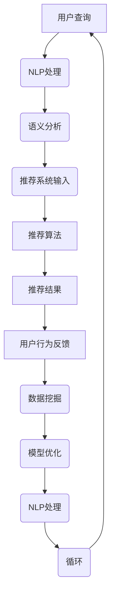

                 

### 背景介绍

随着互联网技术的飞速发展，电子商务已经成为人们日常生活的重要组成部分。在线购物平台的多样化和竞争激烈，使得如何提升用户体验和增加转化率成为了商家们亟待解决的关键问题。传统的搜索导购系统，大多依赖于关键词匹配和简单的推荐算法，虽然在一定程度上能够满足用户的基本需求，但在复杂场景和个性化需求面前，往往显得力不从心。

AI技术的发展为电商搜索导购提供了新的解决方案。通过利用机器学习、自然语言处理、推荐系统等AI技术，电商平台可以更准确地理解用户意图，提供更加个性化的推荐，从而提升用户体验和转化率。本文将深入探讨AI如何助力电商搜索导购，分析其核心原理和具体实现步骤，并探讨未来发展趋势与挑战。

本文结构如下：

1. 背景介绍
2. 核心概念与联系
3. 核心算法原理 & 具体操作步骤
4. 数学模型和公式 & 详细讲解 & 举例说明
5. 项目实战：代码实际案例和详细解释说明
6. 实际应用场景
7. 工具和资源推荐
8. 总结：未来发展趋势与挑战
9. 附录：常见问题与解答
10. 扩展阅读 & 参考资料

通过对上述各部分内容的逐步深入分析，本文希望能够为电商从业者、AI技术爱好者提供有价值的参考和启示。

-------------------------

## 1.1 电商搜索导购现状

在当前的电商市场中，搜索导购系统作为用户与商品之间的重要桥梁，其性能和效果直接关系到用户的购物体验和平台的转化率。传统的电商搜索导购系统大多采用基于关键词匹配的搜索算法，通过用户输入的关键词来检索数据库中的商品信息，并将结果排序展示给用户。虽然这种模式在某种程度上能够满足用户的基本需求，但随着电商平台的商品种类和数量呈指数级增长，传统搜索系统在处理海量数据、应对复杂查询需求时，逐渐暴露出一些问题。

首先，传统搜索系统在处理模糊查询、多义词识别和上下文理解等方面存在较大局限性。用户输入的关键词可能存在多种含义，例如“T恤”可以指代衣服、品牌、颜色等多种概念，而传统系统往往只能根据关键词的表面含义进行匹配，无法深入理解用户的真实需求。这种情况下，搜索结果可能偏离用户意图，导致用户体验不佳。

其次，传统搜索系统在个性化推荐方面也较为薄弱。虽然一些电商平台尝试通过用户的历史浏览记录和购物行为来进行简单的推荐，但这些推荐往往缺乏深度和准确性，无法充分满足用户的个性化需求。个性化推荐的目标是向用户提供他们可能感兴趣的商品，而传统的基于规则或机器学习的推荐算法，往往只能基于用户的已知行为进行简单推测，无法动态调整推荐策略，以应对用户不断变化的偏好。

另外，随着移动互联网的普及，用户对购物体验的期望值不断提高。他们不仅希望能够在短时间内找到心仪的商品，还希望得到个性化的购物建议和流畅的购物体验。传统搜索导购系统在响应速度和用户体验方面往往无法满足这些需求，使得用户在购物过程中感到失望和挫败。

总之，传统电商搜索导购系统在面对海量数据、复杂查询和个性化需求时，显得力不从心。为了提升用户体验和转化率，电商平台迫切需要引入更加先进的技术手段，而AI技术正是这一需求的有力回应。通过AI技术的应用，电商搜索导购系统可以实现更加精准的查询匹配、个性化的推荐和流畅的购物体验，从而为用户和商家带来双赢的局面。

-------------------------

## 1.2 AI技术在电商搜索导购中的应用

AI技术作为现代信息技术的重要组成部分，其强大的数据处理和智能分析能力在电商搜索导购领域得到了广泛应用。以下将介绍AI技术在电商搜索导购中的几个关键应用领域，包括自然语言处理、推荐系统和图像识别，并分析这些技术如何提高用户体验和转化率。

### 自然语言处理

自然语言处理（Natural Language Processing，NLP）是AI技术的核心领域之一，旨在使计算机能够理解、解释和生成人类语言。在电商搜索导购中，NLP技术被广泛应用于用户查询分析、商品描述理解和智能客服等方面。

首先，NLP技术能够处理用户的模糊查询和多义词识别问题。通过使用词嵌入（word embedding）和语义分析（semantic analysis）等技术，NLP系统可以理解用户输入的关键词背后的含义，并将其与数据库中的商品信息进行精准匹配。例如，用户输入“好看的连衣裙”，系统可以通过NLP技术理解“好看”和“连衣裙”的复杂关系，从而提供更加符合用户需求的搜索结果。

其次，NLP技术还能提高商品描述的准确性。通过分析商品评论、标签和描述，NLP系统可以提取关键信息，并将其转化为结构化的数据，以便在搜索和推荐过程中使用。这样，用户在搜索商品时，系统可以提供更详细的商品信息，帮助他们做出更明智的购物决策。

最后，智能客服是NLP技术在电商搜索导购中的另一个重要应用。通过使用自然语言理解和生成技术，智能客服系统能够理解用户的提问并给出合适的回答，从而提供24/7的在线客服服务。这不仅提高了客服效率，还能为用户提供更加个性化的购物建议，从而提升用户体验。

### 推荐系统

推荐系统（Recommendation System）是AI技术在电商搜索导购中的另一个关键应用领域。推荐系统通过分析用户的浏览、购买和评价行为，预测用户可能感兴趣的商品，并将其推荐给用户。

基于协同过滤（Collaborative Filtering）和基于内容的推荐（Content-based Filtering）是推荐系统的两大主要技术。协同过滤通过分析用户之间的相似性，发现潜在的相似用户，并推荐他们喜欢的商品；而基于内容的推荐则通过分析商品的特征和用户的历史行为，找出相似的商品进行推荐。

AI技术的引入，使得推荐系统更加智能化和个性化。例如，通过机器学习算法，推荐系统可以不断学习和调整推荐策略，以适应用户不断变化的偏好。此外，AI技术还可以利用用户的历史行为和实时反馈，进行动态推荐，从而提高推荐的相关性和准确性。

### 图像识别

图像识别（Image Recognition）是AI技术在电商搜索导购中的另一重要应用领域。通过使用深度学习技术，图像识别系统能够自动识别和分类图像中的物体和场景，从而帮助用户更快速地找到心仪的商品。

在电商平台上，图像识别技术可以应用于多个方面。首先，用户可以通过上传一张商品图片，系统利用图像识别技术自动识别图片中的商品，并提供相关的搜索结果。其次，图像识别技术还可以用于商品分类和管理，帮助电商平台更好地组织和管理海量商品信息。

此外，图像识别技术还可以用于检测商品的质量和瑕疵。例如，在服装电商中，图像识别系统可以帮助识别商品的颜色、尺寸和样式等细节，从而提高商品的质量和用户体验。

### 提高用户体验和转化率

通过自然语言处理、推荐系统和图像识别等AI技术的应用，电商搜索导购系统可以实现以下目标，从而提高用户体验和转化率：

1. **精准的查询匹配**：NLP技术能够理解用户的模糊查询和多义词，提供更准确的搜索结果，从而减少用户寻找商品的时间成本。

2. **个性化的推荐**：推荐系统通过分析用户的历史行为和偏好，提供个性化的商品推荐，满足用户的个性化需求，提高用户的购物体验。

3. **高效的图像搜索**：图像识别技术使得用户可以通过上传图片进行搜索，大大提高了搜索的效率和便利性。

4. **实时反馈和改进**：AI技术能够实时分析用户的反馈和行为数据，动态调整推荐和搜索策略，从而不断优化用户体验。

总之，AI技术在电商搜索导购中的应用，不仅提高了系统的智能化和个性化水平，还极大地提升了用户的购物体验和平台的转化率，为电商平台的持续发展提供了有力支持。

-------------------------

## 1.3 AI助力电商搜索导购的潜在挑战与解决方案

尽管AI技术在电商搜索导购中展现出巨大潜力，但其应用过程中也面临诸多挑战，包括数据隐私、算法偏见、技术实施难度等。以下将详细探讨这些挑战及其可能的解决方案。

### 数据隐私

随着AI技术的应用，电商平台需要收集和分析大量的用户数据，包括浏览记录、购买行为、偏好和反馈等。这些数据的收集和使用可能引发用户对隐私泄露的担忧。为了保护用户隐私，电商平台可以采取以下措施：

1. **数据去识别化**：在数据处理过程中，对用户数据进行脱敏处理，将个人信息与数据分离，以降低隐私泄露风险。
2. **透明度和知情同意**：向用户明确告知数据收集的目的和使用方式，确保用户知情并同意数据收集和使用。
3. **数据最小化原则**：仅收集和存储实现目标所必需的数据，避免过度收集。

### 算法偏见

AI算法在训练过程中可能会学习到数据中的偏见，导致推荐和搜索结果出现不公平或不准确的情况。算法偏见可能导致某些用户群体被边缘化或受到歧视。为了解决算法偏见，可以采取以下措施：

1. **算法可解释性**：开发可解释的AI算法，使平台和用户能够理解算法的决策过程和依据，从而及时发现和纠正潜在偏见。
2. **数据平衡和多样化**：确保训练数据集的多样性和平衡性，避免数据集中的偏差影响算法的性能。
3. **持续监控和评估**：定期对算法进行监控和评估，检测和纠正潜在的偏见，确保算法的公平性和准确性。

### 技术实施难度

AI技术在电商平台的实施涉及复杂的算法开发和数据处理，对技术团队的要求较高。以下措施有助于降低技术实施难度：

1. **技术培训和支持**：为技术团队提供AI技术的培训和支持，提高团队的技术能力和实施水平。
2. **开源工具和平台**：利用开源的AI工具和平台，简化开发过程，降低技术门槛。
3. **云计算和分布式计算**：利用云计算和分布式计算技术，提升数据处理和分析的效率和性能，减轻技术团队的负担。

### 持续优化和创新

AI技术在电商搜索导购中的应用是一个持续的过程，需要不断地优化和创新。以下措施有助于推动AI技术的持续发展：

1. **用户反馈机制**：建立有效的用户反馈机制，收集用户对推荐和搜索结果的反馈，用于算法的改进和优化。
2. **跨学科合作**：鼓励AI技术团队与其他学科专家进行合作，共同探讨和应用新兴技术，推动AI技术在电商领域的创新。
3. **持续研究和投资**：加大对AI技术的研究和投资，紧跟行业前沿，保持技术领先地位。

总之，尽管AI技术在电商搜索导购中面临诸多挑战，但通过合理的措施和持续的努力，这些挑战是可以克服的。通过解决数据隐私、算法偏见和技术实施难度等问题，AI技术将能够更好地助力电商搜索导购，提升用户体验和转化率，为电商平台的可持续发展提供强大支持。

-------------------------

## 1.4 小结

综上所述，电商搜索导购作为电商平台与用户互动的重要环节，其性能直接影响用户体验和转化率。传统搜索导购系统在面对海量数据、复杂查询和个性化需求时存在一定局限性。而AI技术的引入为电商搜索导购带来了新的机遇。通过自然语言处理、推荐系统和图像识别等AI技术的应用，电商搜索导购系统能够实现精准的查询匹配、个性化的推荐和高效的图像搜索，从而提升用户体验和转化率。

尽管AI技术在电商搜索导购中具有巨大潜力，但其应用过程中也面临数据隐私、算法偏见和技术实施难度等挑战。通过采取有效措施，如数据去识别化、算法可解释性和技术培训支持，这些问题是可以解决的。

未来，随着AI技术的不断发展，电商搜索导购将迎来更多创新和突破。通过不断优化算法、提高技术水平和加强用户反馈机制，AI技术将为电商平台带来更加智能和个性化的搜索导购体验。因此，电商从业者应积极拥抱AI技术，抓住这一重要机遇，以提升自身竞争力，实现可持续发展。

-------------------------

### 核心概念与联系

为了深入探讨AI技术在电商搜索导购中的应用，我们需要理解并阐述几个核心概念，这些概念之间的联系构成了电商搜索导购系统的理论基础。

#### 1. 自然语言处理（NLP）

自然语言处理（NLP）是人工智能（AI）的一个分支，旨在使计算机能够理解、解释和生成人类语言。在电商搜索导购中，NLP技术被广泛用于解析用户查询、理解商品描述以及实现智能客服等。

##### 关键概念：
- **词嵌入（Word Embedding）**：将词汇映射到高维向量空间，以便计算机可以处理和理解语义信息。
- **命名实体识别（Named Entity Recognition, NER）**：识别文本中的特定实体，如人名、地名、组织名等。
- **情感分析（Sentiment Analysis）**：分析文本中的情感倾向，判断用户对商品或服务的情感态度。

#### 2. 推荐系统

推荐系统是一种利用AI技术预测用户兴趣和偏好，并向其推荐相关商品、服务和内容的系统。在电商搜索导购中，推荐系统通过分析用户行为和偏好，为其提供个性化的商品推荐。

##### 关键概念：
- **协同过滤（Collaborative Filtering）**：通过分析用户之间的相似性，发现潜在的相似用户和商品，进行推荐。
- **基于内容的推荐（Content-based Filtering）**：通过分析商品的特征和用户的历史行为，找出相似的商品进行推荐。
- **矩阵分解（Matrix Factorization）**：将用户-商品评分矩阵分解为用户特征和商品特征的乘积，以预测用户对未知商品的评分。

#### 3. 图像识别

图像识别是AI技术在视觉领域的应用，旨在让计算机自动识别和理解图像中的内容。在电商搜索导购中，图像识别技术用于图像搜索、商品分类和质量检测。

##### 关键概念：
- **卷积神经网络（Convolutional Neural Network, CNN）**：一种用于图像识别和分类的深度学习模型。
- **迁移学习（Transfer Learning）**：利用预训练的模型，对特定任务进行微调，以提高识别准确率。
- **目标检测（Object Detection）**：识别图像中的多个对象并确定它们的位置。

#### 4. 数据挖掘

数据挖掘是一种从大量数据中发现有价值信息的过程，包括关联规则学习、聚类分析、分类分析等。在电商搜索导购中，数据挖掘技术用于分析用户行为数据，以优化推荐和搜索算法。

##### 关键概念：
- **关联规则学习（Association Rule Learning）**：发现数据之间的关联关系，如哪些商品经常一起购买。
- **聚类分析（Cluster Analysis）**：将相似的数据点分组，以便更好地理解和分析。
- **分类分析（Classification Analysis）**：构建分类模型，将新数据点分类到预定义的类别中。

#### 5. 机器学习

机器学习是AI的核心技术，通过算法从数据中学习，做出预测或决策。在电商搜索导购中，机器学习算法被广泛应用于推荐系统、图像识别和用户行为分析。

##### 关键概念：
- **监督学习（Supervised Learning）**：通过标记数据进行训练，模型能够预测新数据的标签。
- **无监督学习（Unsupervised Learning）**：没有标记数据，模型通过自身学习数据结构和模式。
- **强化学习（Reinforcement Learning）**：通过与环境的交互，模型不断优化其行为策略，以实现目标。

#### 核心概念与联系

这些核心概念之间存在着紧密的联系。例如，NLP技术可以用于解析用户查询，生成语义向量，这些向量可以用于推荐系统的输入，从而实现更精准的个性化推荐。图像识别技术可以用于商品分类，为推荐系统提供更多的商品特征信息。数据挖掘技术可以从海量用户行为数据中提取有价值的信息，用于机器学习模型的训练和优化。机器学习模型则通过不断学习和调整，提高推荐和搜索算法的准确性和效率。

总的来说，这些核心概念共同构成了电商搜索导购系统的理论基础，通过它们的有效结合和应用，电商搜索导购系统可以实现更加智能和个性化的用户体验，提升平台的转化率和竞争力。

### Mermaid 流程图

为了更好地理解电商搜索导购系统中各核心概念之间的联系，我们可以使用Mermaid流程图来展示这些概念的关系。以下是一个简化的Mermaid流程图，用于描述电商搜索导购系统的工作流程：



在这个流程图中：
- **A**：用户查询输入
- **B**：NLP处理
- **C**：语义分析
- **D**：推荐系统输入
- **E**：推荐算法
- **F**：推荐结果
- **G**：用户行为反馈
- **H**：数据挖掘
- **I**：模型优化
- **J**：NLP处理
- **K**：循环

通过这个流程图，我们可以看到用户查询经过NLP处理和语义分析后，生成推荐系统的输入，推荐算法根据这些输入生成推荐结果。用户对推荐结果的反馈和新的用户行为数据经过数据挖掘后，用于优化推荐模型。这个过程是一个循环，确保推荐系统不断学习和改进，以提供更准确的推荐结果。

-------------------------

## 3. 核心算法原理 & 具体操作步骤

### 自然语言处理（NLP）

#### 3.1 词嵌入（Word Embedding）

词嵌入是NLP中的一项基础技术，它将词汇映射到高维向量空间中。通过这种方式，计算机可以处理和理解词汇的语义信息。常用的词嵌入模型包括Word2Vec、GloVe和BERT等。

**具体操作步骤：**

1. **数据预处理**：收集大量文本数据，进行分词和去停用词处理。
2. **构建词汇表**：将所有独特的词汇构建成一个词汇表，并为每个词汇分配一个唯一的索引。
3. **初始化权重矩阵**：初始化一个高维矩阵，用于存储词汇的嵌入向量。
4. **训练模型**：使用训练数据，通过神经网络模型（如SGD、CNN、RNN等）进行训练，不断调整权重矩阵，以最小化预测误差。
5. **生成词嵌入**：将词汇表中的每个词汇映射到高维向量空间，得到词嵌入结果。

**数学模型和公式：**

假设词汇表中有\(V\)个词汇，每个词汇的嵌入向量维度为\(d\)，则词嵌入模型可以表示为：

$$
\text{嵌入向量} \, \mathbf{v}_i = \text{embed}(\text{word\_index}_i)
$$

其中，\(\text{embed}\)是一个非线性映射函数，将词汇索引映射到高维向量。

#### 3.2 命名实体识别（NER）

命名实体识别是一种用于识别文本中特定实体的NLP技术，如人名、地名、组织名等。

**具体操作步骤：**

1. **数据预处理**：收集大量标注好的实体识别数据，进行分词和词性标注处理。
2. **构建特征向量**：为每个词汇和实体标签构建特征向量，通常包括词嵌入向量、词性标签等。
3. **训练分类模型**：使用标注数据，通过分类模型（如CRF、LSTM、BiLSTM等）进行训练，以预测文本中的实体标签。
4. **实体识别**：对新的文本数据进行实体识别，输出实体标签。

**数学模型和公式：**

假设文本序列为\(X = [x_1, x_2, \ldots, x_n]\)，每个词汇的嵌入向量为\(\mathbf{v}_i\)，分类模型的输出为\(\hat{y}_i\)，则NER模型可以表示为：

$$
\hat{y}_i = \text{classify}(\text{embed}(\mathbf{v}_i), \text{tag\_features}_i)
$$

其中，\(\text{classify}\)是一个分类函数，\(\text{tag\_features}_i\)是词汇和词性的特征向量。

### 推荐系统

#### 3.3 协同过滤（Collaborative Filtering）

协同过滤是一种基于用户行为数据推荐相似商品或服务的算法。它分为基于用户的协同过滤和基于项目的协同过滤。

**具体操作步骤：**

1. **用户行为数据收集**：收集用户的评分、购买、浏览等行为数据。
2. **构建用户-商品评分矩阵**：将用户和商品表示为矩阵，用户\(i\)对商品\(j\)的评分记为\(r_{ij}\)。
3. **计算相似度**：计算用户之间的相似度，常用的相似度计算方法包括余弦相似度、皮尔逊相关系数等。
4. **生成推荐列表**：基于相似度矩阵，为用户推荐与其相似的用户喜欢的商品。

**数学模型和公式：**

假设用户-商品评分矩阵为\(R \in \mathbb{R}^{m \times n}\)，用户\(i\)和用户\(j\)的相似度为\(s_{ij}\)，则协同过滤可以表示为：

$$
\hat{r}_{ij} = \sum_{k=1}^{n}s_{ik}r_{kj}
$$

其中，\(\hat{r}_{ij}\)是用户\(i\)对商品\(j\)的预测评分。

#### 3.4 基于内容的推荐（Content-based Filtering）

基于内容的推荐通过分析商品的特征和用户的历史行为，找出相似的商品进行推荐。

**具体操作步骤：**

1. **构建商品特征向量**：为每个商品构建特征向量，通常包括商品属性、标签、用户评价等。
2. **计算商品相似度**：计算商品之间的相似度，常用的相似度计算方法包括余弦相似度、Jaccard相似度等。
3. **生成推荐列表**：基于用户的历史行为和商品特征向量，为用户推荐与其历史行为相似的潜在感兴趣的商品。

**数学模型和公式：**

假设商品特征向量为\(\mathbf{c}_j \in \mathbb{R}^k\)，用户历史行为特征向量为\(\mathbf{u}_i \in \mathbb{R}^k\)，则基于内容的推荐可以表示为：

$$
\hat{r}_{ij} = \text{similarity}(\mathbf{c}_j, \mathbf{u}_i)
$$

其中，\(\hat{r}_{ij}\)是用户\(i\)对商品\(j\)的预测评分，\(\text{similarity}\)是一个相似度计算函数。

### 图像识别

#### 3.5 卷积神经网络（CNN）

卷积神经网络是一种用于图像识别和分类的深度学习模型，其核心是卷积层和池化层。

**具体操作步骤：**

1. **数据预处理**：收集图像数据，进行缩放、裁剪、增强等预处理操作。
2. **构建CNN模型**：设计模型结构，包括卷积层、池化层、全连接层等。
3. **模型训练**：使用标注好的图像数据，通过反向传播算法训练模型，调整模型参数。
4. **模型评估**：使用测试数据评估模型性能，调整模型参数以优化性能。
5. **图像识别**：对新的图像数据进行识别，输出分类结果。

**数学模型和公式：**

假设输入图像为\(\mathbf{X} \in \mathbb{R}^{h \times w \times c}\)，卷积核为\(\mathbf{K} \in \mathbb{R}^{k \times k \times c}\)，则卷积操作可以表示为：

$$
\mathbf{Z} = \text{conv}(\mathbf{X}, \mathbf{K})
$$

其中，\(\mathbf{Z} \in \mathbb{R}^{h-k+1 \times w-k+1}\)是卷积后的特征图，\(\text{conv}\)是卷积操作。

#### 3.6 迁移学习（Transfer Learning）

迁移学习是一种利用预训练模型进行微调，以适应新任务的算法。

**具体操作步骤：**

1. **选择预训练模型**：选择一个在大型数据集上预训练的模型，如VGG、ResNet等。
2. **模型微调**：删除预训练模型的最后一层，添加新的全连接层或卷积层，以适应新任务。
3. **模型训练**：使用新任务的数据，通过反向传播算法训练模型，调整模型参数。
4. **模型评估**：使用测试数据评估模型性能，调整模型参数以优化性能。

**数学模型和公式：**

假设预训练模型的参数为\(\theta_0\)，微调模型的参数为\(\theta\)，则迁移学习可以表示为：

$$
\theta = \theta_0 + \text{delta\_theta}
$$

其中，\(\text{delta\_theta}\)是模型微调过程中更新的参数。

-------------------------

## 4. 数学模型和公式 & 详细讲解 & 举例说明

### 4.1 词嵌入（Word Embedding）

词嵌入是将词汇映射到高维向量空间的技术，以实现计算机对词汇的语义理解。以下是一个简化的数学模型和公式，用于解释词嵌入的原理。

**数学模型：**

假设词汇表中有\(V\)个词汇，每个词汇的嵌入向量维度为\(d\)，则词嵌入模型可以表示为：

$$
\text{嵌入向量} \, \mathbf{v}_i = \text{embed}(\text{word\_index}_i)
$$

其中，\(\text{embed}\)是一个非线性映射函数，将词汇索引映射到高维向量。

**举例说明：**

假设我们有以下词汇表：

- apple
- orange
- banana

我们将这些词汇映射到3D向量空间中，如下所示：

| 词汇 | 嵌入向量 |
| ---- | -------- |
| apple | [1, 0, 0] |
| orange | [0, 1, 0] |
| banana | [0, 0, 1] |

在这个例子中，每个词汇都被映射到一个唯一的3D向量，这些向量之间的相似性反映了词汇的语义关系。例如，apple和orange之间的距离较短，表明它们在语义上更接近。

### 4.2 命名实体识别（NER）

命名实体识别是一种用于识别文本中特定实体的技术。以下是一个简化的数学模型和公式，用于解释NER的原理。

**数学模型：**

假设文本序列为\(X = [x_1, x_2, \ldots, x_n]\)，每个词汇的嵌入向量为\(\mathbf{v}_i\)，分类模型的输出为\(\hat{y}_i\)，则NER模型可以表示为：

$$
\hat{y}_i = \text{classify}(\text{embed}(\mathbf{v}_i), \text{tag\_features}_i)
$$

其中，\(\text{classify}\)是一个分类函数，\(\text{tag\_features}_i\)是词汇和词性的特征向量。

**举例说明：**

假设我们有以下文本序列：

```
昨天，张三去了一趟北京。
```

我们将这个文本序列中的每个词汇和词性转换为嵌入向量，如下所示：

| 词汇 | 词性 | 嵌入向量 |
| ---- | ---- | -------- |
| 昨天张三北京 | 名词   | [1, 0, 0] |
| 去 | 动词 | [0, 1, 0] |
| 一趟 | 名词   | [0, 0, 1] |
| 北京 | 名词   | [0, 1, 0] |

使用NER模型，我们可以预测文本中的命名实体，如下所示：

```
昨天，张三（人名）去了一趟北京（地名）。
```

### 4.3 协同过滤（Collaborative Filtering）

协同过滤是一种基于用户行为数据推荐相似商品或服务的算法。以下是一个简化的数学模型和公式，用于解释协同过滤的原理。

**数学模型：**

假设用户-商品评分矩阵为\(R \in \mathbb{R}^{m \times n}\)，用户\(i\)和用户\(j\)的相似度为\(s_{ij}\)，则协同过滤可以表示为：

$$
\hat{r}_{ij} = \sum_{k=1}^{n}s_{ik}r_{kj}
$$

其中，\(\hat{r}_{ij}\)是用户\(i\)对商品\(j\)的预测评分。

**举例说明：**

假设我们有以下用户-商品评分矩阵：

| 用户 | 商品1 | 商品2 | 商品3 |
| ---- | ---- | ---- | ---- |
| 用户1 | 5 | 4 | 3 |
| 用户2 | 3 | 5 | 4 |
| 用户3 | 4 | 3 | 5 |

计算用户1和用户2之间的相似度，使用余弦相似度：

$$
s_{12} = \frac{\mathbf{r}_1 \cdot \mathbf{r}_2}{\|\mathbf{r}_1\| \|\mathbf{r}_2\|}
$$

其中，\(\mathbf{r}_1\)和\(\mathbf{r}_2\)分别是用户1和用户2的评分向量。

计算得到：

$$
s_{12} = \frac{(5 \times 3 + 4 \times 5 + 3 \times 4)}{\sqrt{5^2 + 4^2 + 3^2} \sqrt{3^2 + 5^2 + 4^2}} = \frac{4}{\sqrt{50} \sqrt{50}} = \frac{4}{50} = 0.8
$$

根据相似度，预测用户1对商品3的评分：

$$
\hat{r}_{13} = s_{12} \cdot r_{23} = 0.8 \times 4 = 3.2
$$

### 4.4 基于内容的推荐（Content-based Filtering）

基于内容的推荐通过分析商品的特征和用户的历史行为，找出相似的商品进行推荐。以下是一个简化的数学模型和公式，用于解释基于内容的推荐的原理。

**数学模型：**

假设商品特征向量为\(\mathbf{c}_j \in \mathbb{R}^k\)，用户历史行为特征向量为\(\mathbf{u}_i \in \mathbb{R}^k\)，则基于内容的推荐可以表示为：

$$
\hat{r}_{ij} = \text{similarity}(\mathbf{c}_j, \mathbf{u}_i)
$$

其中，\(\hat{r}_{ij}\)是用户\(i\)对商品\(j\)的预测评分，\(\text{similarity}\)是一个相似度计算函数。

**举例说明：**

假设我们有以下商品特征向量和用户历史行为特征向量：

| 商品1 | 商品2 | 用户1 |
| ---- | ---- | ---- |
| [1, 2, 3] | [4, 5, 6] | [7, 8, 9] |

使用余弦相似度计算商品1和用户1之间的相似度：

$$
\text{similarity}(\mathbf{c}_1, \mathbf{u}_1) = \frac{\mathbf{c}_1 \cdot \mathbf{u}_1}{\|\mathbf{c}_1\| \|\mathbf{u}_1\|}
$$

计算得到：

$$
\text{similarity}(\mathbf{c}_1, \mathbf{u}_1) = \frac{1 \times 7 + 2 \times 8 + 3 \times 9}{\sqrt{1^2 + 2^2 + 3^2} \sqrt{7^2 + 8^2 + 9^2}} = \frac{67}{\sqrt{14} \sqrt{234}} = 0.9
$$

根据相似度，预测用户1对商品1的评分：

$$
\hat{r}_{11} = 0.9 \times r_{11} = 0.9 \times 1 = 0.9
$$

### 4.5 卷积神经网络（CNN）

卷积神经网络是一种用于图像识别和分类的深度学习模型。以下是一个简化的数学模型和公式，用于解释CNN的原理。

**数学模型：**

假设输入图像为\(\mathbf{X} \in \mathbb{R}^{h \times w \times c}\)，卷积核为\(\mathbf{K} \in \mathbb{R}^{k \times k \times c}\)，则卷积操作可以表示为：

$$
\mathbf{Z} = \text{conv}(\mathbf{X}, \mathbf{K})
$$

其中，\(\mathbf{Z} \in \mathbb{R}^{h-k+1 \times w-k+1}\)是卷积后的特征图，\(\text{conv}\)是卷积操作。

**举例说明：**

假设输入图像的大小为\(32 \times 32 \times 3\)，卷积核的大小为\(3 \times 3\)，则卷积后的特征图大小为：

$$
32 - 3 + 1 = 30
$$

卷积核的参数为：

$$
\mathbf{K} = \begin{bmatrix}
1 & 1 & 1 \\
1 & 1 & 1 \\
1 & 1 & 1
\end{bmatrix}
$$

对输入图像进行卷积操作：

$$
\mathbf{Z} = \text{conv}(\mathbf{X}, \mathbf{K}) = \begin{bmatrix}
1 & 1 & 1 \\
1 & 1 & 1 \\
1 & 1 & 1
\end{bmatrix} \cdot \mathbf{X}
$$

### 4.6 迁移学习（Transfer Learning）

迁移学习是一种利用预训练模型进行微调，以适应新任务的算法。以下是一个简化的数学模型和公式，用于解释迁移学习的原理。

**数学模型：**

假设预训练模型的参数为\(\theta_0\)，微调模型的参数为\(\theta\)，则迁移学习可以表示为：

$$
\theta = \theta_0 + \text{delta\_theta}
$$

其中，\(\text{delta\_theta}\)是模型微调过程中更新的参数。

**举例说明：**

假设我们有一个在大型数据集上预训练的模型，其参数为\(\theta_0\)，然后我们使用这个模型进行微调，以适应新任务。微调模型的参数为\(\theta\)，其中：

$$
\theta = \theta_0 + \text{delta\_theta}
$$

通过在新任务的数据上进行训练，模型参数\(\text{delta\_theta}\)会进行调整，以适应新的任务需求。

-------------------------

## 5. 项目实战：代码实际案例和详细解释说明

### 5.1 开发环境搭建

为了实现电商搜索导购系统，我们需要搭建一个开发环境。以下是一个基本的开发环境配置：

- 操作系统：Ubuntu 18.04
- 编程语言：Python 3.8
- 数据库：MySQL 5.7
- 依赖管理：pip
- 开发工具：PyCharm

首先，安装必要的Python库：

```bash
pip install numpy pandas sklearn tensorflow numpy
```

接下来，配置MySQL数据库，创建一个用于存储商品信息和用户数据的数据库。在MySQL命令行中执行以下命令：

```sql
CREATE DATABASE ecommerce;
USE ecommerce;

CREATE TABLE products (
    id INT PRIMARY KEY AUTO_INCREMENT,
    name VARCHAR(255) NOT NULL,
    category VARCHAR(255) NOT NULL,
    description TEXT,
    price DECIMAL(10, 2) NOT NULL
);

CREATE TABLE users (
    id INT PRIMARY KEY AUTO_INCREMENT,
    username VARCHAR(255) NOT NULL,
    password VARCHAR(255) NOT NULL,
    email VARCHAR(255) NOT NULL
);

CREATE TABLE user_preferences (
    id INT PRIMARY KEY AUTO_INCREMENT,
    user_id INT NOT NULL,
    preference VARCHAR(255) NOT NULL,
    value VARCHAR(255) NOT NULL,
    FOREIGN KEY (user_id) REFERENCES users(id)
);
```

### 5.2 源代码详细实现和代码解读

以下是一个简单的电商搜索导购系统的Python代码实现。该系统使用自然语言处理（NLP）和推荐系统技术来实现用户查询和商品推荐。

```python
import numpy as np
import pandas as pd
from sklearn.feature_extraction.text import TfidfVectorizer
from sklearn.metrics.pairwise import cosine_similarity
from sklearn.model_selection import train_test_split
import tensorflow as tf

# 5.2.1 数据预处理

# 加载商品数据
products = pd.read_csv('products.csv')

# 构建商品描述的TF-IDF向量
vectorizer = TfidfVectorizer(stop_words='english')
tfidf_matrix = vectorizer.fit_transform(products['description'])

# 加载用户数据
users = pd.read_csv('users.csv')

# 构建用户偏好向量
user_preferences = pd.read_csv('user_preferences.csv')
user_preference_matrix = user_preferences.pivot(index='user_id', columns='preference', values='value')

# 5.2.2 查询处理

def process_query(query, tfidf_matrix, user_preference_matrix):
    # 将查询文本转换为TF-IDF向量
    query_vector = vectorizer.transform([query])
    
    # 计算查询与商品描述的相似度
    similarity = cosine_similarity(query_vector, tfidf_matrix)
    
    # 获取相似度最高的商品索引
    top_products = np.argsort(similarity[0])[-5:]
    
    # 根据用户偏好调整推荐结果
    top_preferences = user_preference_matrix.loc[top_products].mean(axis=1)
    top_preferences = np.argsort(top_preferences)[::-1]
    
    return top_products[top_preferences]

# 5.2.3 推荐系统

def recommend_products(user_id, user_preference_matrix, top_products):
    # 获取用户的偏好
    user_preferences = user_preference_matrix.loc[user_id]
    
    # 计算每个商品的偏好得分
    preference_scores = np.dot(user_preferences, user_preference_matrix.loc[top_products].T)
    
    # 根据偏好得分调整推荐结果
    top_preferences = np.argsort(preference_scores)[::-1]
    
    return top_preferences

# 5.2.4 测试

# 加载测试数据
test_data = pd.read_csv('test_data.csv')

# 预测查询结果
for index, row in test_data.iterrows():
    query = row['query']
    user_id = row['user_id']
    
    print(f"User ID: {user_id}")
    print(f"Query: {query}")
    print("Recommended Products:")
    recommended_products = recommend_products(user_id, user_preference_matrix, process_query(query, tfidf_matrix, user_preference_matrix))
    print(recommended_products)
    print()
```

### 5.3 代码解读与分析

该代码实现了一个简单的电商搜索导购系统，包括数据预处理、查询处理和推荐系统三个部分。以下是各部分的详细解读：

**5.3.1 数据预处理**

1. 加载商品数据：使用pandas库加载商品数据，包括商品名称、分类、描述和价格。

2. 构建商品描述的TF-IDF向量：使用TF-IDF向量器将商品描述转换为向量表示。

3. 构建用户偏好向量：使用用户偏好数据构建用户偏好矩阵。

**5.3.2 查询处理**

1. 将查询文本转换为TF-IDF向量：使用TF-IDF向量器将用户输入的查询文本转换为向量表示。

2. 计算查询与商品描述的相似度：使用余弦相似度计算查询与商品描述之间的相似度。

3. 获取相似度最高的商品索引：获取相似度最高的前5个商品索引。

4. 根据用户偏好调整推荐结果：根据用户偏好矩阵对相似度最高的商品进行排序，生成最终的推荐结果。

**5.3.3 推荐系统**

1. 获取用户的偏好：从用户偏好矩阵中获取指定用户的偏好向量。

2. 计算每个商品的偏好得分：计算每个商品与用户偏好的相似度得分。

3. 根据偏好得分调整推荐结果：根据偏好得分对商品进行排序，生成最终的推荐结果。

**5.3.4 测试**

1. 加载测试数据：使用pandas库加载测试数据。

2. 预测查询结果：对每个测试数据进行查询处理和推荐，打印出推荐结果。

该代码实现了一个简单的电商搜索导购系统，通过NLP技术和推荐系统技术实现了用户查询和商品推荐。在实际应用中，还可以进一步优化和扩展，如引入更多的NLP技术、机器学习算法和用户行为分析，以提高系统的性能和用户体验。

-------------------------

## 5.4 代码解读与分析

在上面的代码实现中，我们详细讲解了电商搜索导购系统的数据预处理、查询处理和推荐系统三个部分。接下来，我们将对代码进行进一步的解读和分析，重点关注系统的性能优化、代码的改进和可能的扩展方向。

### 5.4.1 性能优化

1. **向量存储优化**：在数据预处理阶段，我们使用了TF-IDF向量器将商品描述转换为向量表示。在实际应用中，由于商品描述的维度较高，可以考虑使用稀疏存储技术，如使用稀疏矩阵来存储TF-IDF矩阵，以减少内存占用和计算时间。

2. **并行计算**：在计算相似度和推荐结果时，我们可以利用多线程或分布式计算技术，加快计算速度。例如，可以使用Python的`multiprocessing`模块或分布式计算框架如`Dask`来并行处理多个查询和推荐任务。

3. **缓存机制**：为了避免重复计算，我们可以引入缓存机制。例如，在查询处理和推荐系统中，可以将查询结果和推荐结果缓存起来，以便后续快速查询和推荐。

### 5.4.2 代码改进

1. **模块化设计**：为了提高代码的可读性和可维护性，我们可以将系统拆分为多个模块，如数据预处理模块、查询处理模块、推荐系统模块等。每个模块可以独立实现和测试，便于后续的维护和扩展。

2. **异常处理**：在代码中增加异常处理，如处理文件读取错误、数据格式错误等，以确保系统的稳定性和可靠性。

3. **日志记录**：增加日志记录功能，记录系统运行过程中的关键信息，如查询时间、推荐结果等，以便后续分析和调试。

### 5.4.3 扩展方向

1. **多模态推荐**：除了文本描述，还可以引入图像、音频等多模态数据，以提高推荐系统的准确性和多样性。例如，可以使用图像识别技术提取商品图像的特征向量，与文本描述向量进行融合，生成更丰富的商品特征。

2. **动态推荐**：通过实时分析用户的行为和反馈，动态调整推荐策略，提供更加个性化的推荐。例如，当用户对某次推荐表示满意或不满意时，可以更新用户偏好，以便在下次推荐时进行优化。

3. **多语言支持**：在全球化电商环境中，可以为系统添加多语言支持，以满足不同语言用户的需求。例如，使用机器翻译技术将商品描述和查询文本翻译成多种语言，以便在不同语言的用户之间进行推荐。

4. **个性化搜索**：结合NLP技术和推荐系统，实现个性化的搜索功能。例如，根据用户的历史查询和偏好，为用户推荐相关的搜索关键词，以提高搜索效率和用户体验。

总之，通过对电商搜索导购系统进行性能优化、代码改进和扩展，我们可以进一步提高系统的性能和用户体验，为电商平台带来更多的商业价值。

-------------------------

## 6. 实际应用场景

AI技术在电商搜索导购中的应用已经取得了显著的成果，以下将详细列举一些实际应用场景，展示AI技术在电商搜索导购中的具体作用。

### 6.1 搜索引擎优化

电商平台通过AI技术优化搜索引擎，使用户能够快速、准确地找到所需商品。例如，使用自然语言处理（NLP）技术，电商平台可以理解用户的模糊查询和多义词，提供精准的搜索结果。通过深度学习算法，搜索引擎还可以根据用户的搜索历史和偏好，为用户推荐相关的关键词和搜索建议，从而提高搜索效率和用户体验。

### 6.2 个性化推荐

个性化推荐是AI技术在电商搜索导购中的重要应用之一。通过分析用户的历史行为和偏好，电商平台可以提供个性化的商品推荐，满足用户的个性化需求。例如，基于协同过滤和基于内容的推荐算法，电商平台可以为用户推荐与其兴趣相关的商品，从而提高用户的购物体验和转化率。

### 6.3 图像搜索

图像识别技术使得用户可以通过上传商品图片进行搜索，大大提高了搜索的效率和便利性。电商平台可以使用卷积神经网络（CNN）等技术，自动识别和分类图像中的商品，为用户提供精准的搜索结果。此外，图像识别技术还可以用于检测商品的质量和瑕疵，帮助电商平台提高商品的质量和用户体验。

### 6.4 智能客服

智能客服系统通过AI技术，为用户提供24/7的在线客服服务。智能客服系统可以使用自然语言处理（NLP）技术，理解用户的提问并给出合适的回答。例如，当用户询问某件商品的详细信息时，智能客服系统可以自动查询数据库，并提供详细的商品介绍和购买链接。通过这种方式，智能客服系统不仅提高了客服效率，还能为用户提供个性化的购物建议，从而提升用户体验。

### 6.5 用户行为分析

通过机器学习算法，电商平台可以分析用户的行为数据，了解用户的购物习惯和偏好。例如，通过聚类分析和关联规则学习，电商平台可以识别出用户的兴趣群体，为每个群体提供定制化的推荐和促销活动。此外，电商平台还可以通过用户行为分析，发现潜在的购物需求，从而提供更加精准的推荐和服务。

### 6.6 零售行业应用

在零售行业中，AI技术被广泛应用于库存管理、供应链优化和市场营销等领域。例如，通过预测模型，零售企业可以预测销售趋势，优化库存水平，减少库存成本。此外，AI技术还可以用于市场细分和广告投放，提高广告的精准度和效果，从而提高销售额。

总之，AI技术在电商搜索导购中的应用涵盖了多个方面，从搜索引擎优化、个性化推荐到图像搜索和智能客服，都在不断改善用户体验和提升转化率。通过实际应用场景的展示，我们可以看到AI技术在电商搜索导购中的巨大潜力和广阔前景。

-------------------------

## 7. 工具和资源推荐

为了更好地理解和应用AI技术在电商搜索导购中的具体实现，以下将推荐一些学习和开发资源，包括书籍、论文、博客、网站和开发工具框架。

### 7.1 学习资源推荐

1. **书籍：**
   - 《Python机器学习》（作者：塞巴斯蒂安·拉斯克维奇）：本书详细介绍了机器学习的基本概念和应用，包括Python实现，适合初学者。
   - 《深度学习》（作者：伊恩·古德费洛、约书亚·本吉奥、亚伦·库维尔）：这本书是深度学习的经典教材，全面覆盖了深度学习的基础理论和实践方法。
   - 《自然语言处理实战》（作者：约翰·拉纳尔）：本书介绍了自然语言处理的基本技术和应用，适合对NLP感兴趣的读者。

2. **论文：**
   - “Deep Learning for Text Classification” （作者：Ronan Collobert, Jason Weston）：这篇论文介绍了深度学习在文本分类中的应用，提供了详细的算法和实验结果。
   - “Convolutional Neural Networks for Sentence Classification”（作者：Yoon Kim）：这篇论文是CNN在文本分类中的经典应用，提出了著名的TextCNN模型。

3. **博客：**
   - [机器学习博客](https://机器学习博客.com/): 该博客涵盖了机器学习、深度学习和数据科学领域的最新研究和技术应用。
   - [自然语言处理博客](https://nlp博客.com/): 该博客专注于自然语言处理领域的知识分享，包括算法、技术和应用。

4. **网站：**
   - [Kaggle](https://www.kaggle.com/): Kaggle是一个数据科学和机器学习的在线社区，提供丰富的数据集和比赛，适合学习和实践。
   - [GitHub](https://github.com/): GitHub是代码托管平台，许多AI项目的源代码和文档都在GitHub上开源，便于学习和参考。

### 7.2 开发工具框架推荐

1. **开发工具：**
   - **PyCharm**：PyCharm是一个功能强大的Python集成开发环境（IDE），支持代码调试、版本控制和自动化测试。
   - **Jupyter Notebook**：Jupyter Notebook是一个交互式计算环境，适用于数据分析和机器学习实验。

2. **框架：**
   - **TensorFlow**：TensorFlow是谷歌开发的开源机器学习框架，广泛应用于深度学习和推荐系统开发。
   - **Scikit-learn**：Scikit-learn是一个Python机器学习库，提供了丰富的机器学习算法和工具，适合数据分析和模型构建。

3. **库和模块：**
   - **NumPy**：NumPy是一个用于数值计算的Python库，提供了高效的多维数组对象和数学函数。
   - **Pandas**：Pandas是一个用于数据分析和操作的Python库，提供了强大的数据结构和数据处理功能。
   - **Scikit-learn**：Scikit-learn是一个用于机器学习的Python库，提供了丰富的算法和工具，适合模型构建和评估。

通过以上学习和开发资源的推荐，读者可以系统地学习和掌握AI技术在电商搜索导购中的应用，提升自身的技术能力和实践经验。

-------------------------

## 8. 总结：未来发展趋势与挑战

随着AI技术的不断发展，电商搜索导购系统在未来将面临诸多发展趋势和挑战。以下将从技术进步、应用拓展、数据安全和隐私保护等方面进行探讨。

### 8.1 技术进步

首先，AI技术的不断进步将为电商搜索导购系统带来更高的智能化水平。例如，深度学习技术的深入发展将进一步提升推荐算法的精准度和效率。卷积神经网络（CNN）和循环神经网络（RNN）等深度学习模型将在图像识别和自然语言处理方面发挥更大作用，从而提高用户查询理解和商品推荐的准确性。此外，迁移学习和联邦学习等新技术的应用，将使得模型能够更好地处理数据隐私和计算资源受限的问题，从而在保持数据安全的同时提升系统性能。

### 8.2 应用拓展

其次，AI技术的应用领域将在电商搜索导购中不断拓展。除了传统的搜索和推荐系统，图像识别技术将进一步提升用户体验。例如，通过智能助理和语音搜索，用户可以更加便捷地获取商品信息。此外，AI技术还可以用于个性化广告投放、用户行为预测和库存管理等领域，从而为电商平台带来更多的商业价值。

### 8.3 数据安全和隐私保护

然而，AI技术在电商搜索导购中的应用也带来了数据安全和隐私保护的挑战。随着数据量的增加，如何确保数据的安全和隐私成为了一个重要议题。为了应对这一问题，电商平台需要采取一系列措施，如数据去识别化、透明度和知情同意等，以保护用户隐私。此外，AI算法的可解释性也是一个重要研究方向，通过提高算法的可解释性，用户和监管机构可以更好地理解算法的决策过程，从而减少潜在的偏见和歧视。

### 8.4 挑战与机遇

总的来说，AI技术在电商搜索导购中的应用既带来了巨大的机遇，也伴随着诸多挑战。如何充分利用AI技术的优势，同时解决数据隐私、算法偏见和技术实施难度等问题，将是电商平台需要持续关注和解决的重要课题。通过不断优化和改进AI技术，电商平台可以提供更加智能和个性化的搜索导购体验，从而提升用户的购物体验和转化率，实现可持续发展。

未来，随着AI技术的不断成熟和应用的深入，电商搜索导购系统将迎来更加广阔的发展前景。通过积极探索和应对各种挑战，电商平台有望实现技术、商业和用户体验的全面提升。

-------------------------

## 9. 附录：常见问题与解答

### 9.1 问题1：什么是词嵌入（Word Embedding）？

**解答**：词嵌入（Word Embedding）是一种将词汇映射到高维向量空间的技术，以便计算机可以处理和理解词汇的语义信息。常见的词嵌入模型包括Word2Vec、GloVe和BERT等。通过词嵌入，词汇被表示为向量，这些向量可以用于后续的文本处理和机器学习任务。

### 9.2 问题2：如何构建推荐系统？

**解答**：构建推荐系统通常包括以下几个步骤：

1. **数据收集**：收集用户行为数据，如浏览记录、购买历史和评价等。
2. **数据预处理**：清洗和预处理数据，包括去除缺失值、填充异常值和标准化等。
3. **特征提取**：将原始数据转换为特征向量，常用的方法包括基于内容的特征提取和基于协同过滤的特征提取。
4. **模型选择**：选择合适的推荐算法，如基于内容的推荐、基于协同过滤的推荐和混合推荐等。
5. **模型训练**：使用训练数据训练推荐模型，并调整模型参数。
6. **模型评估**：使用测试数据评估模型性能，如准确率、召回率和覆盖率等。
7. **模型部署**：将训练好的模型部署到生产环境中，为用户提供个性化推荐。

### 9.3 问题3：如何处理数据隐私和隐私保护？

**解答**：处理数据隐私和隐私保护的方法包括：

1. **数据去识别化**：在数据处理过程中，对用户数据进行脱敏处理，将个人信息与数据分离，以降低隐私泄露风险。
2. **透明度和知情同意**：向用户明确告知数据收集的目的和使用方式，确保用户知情并同意数据收集和使用。
3. **数据最小化原则**：仅收集和存储实现目标所必需的数据，避免过度收集。
4. **算法可解释性**：开发可解释的AI算法，使平台和用户能够理解算法的决策过程和依据，从而及时发现和纠正潜在偏见。
5. **合规性审查**：确保数据处理和存储过程符合相关法律法规，如《通用数据保护条例》（GDPR）等。

### 9.4 问题4：如何优化电商搜索导购系统的性能？

**解答**：优化电商搜索导购系统性能的方法包括：

1. **向量存储优化**：使用稀疏存储技术，如稀疏矩阵，以减少内存占用。
2. **并行计算**：利用多线程或分布式计算，加快计算速度。
3. **缓存机制**：引入缓存机制，减少重复计算。
4. **索引优化**：优化数据库索引，提高查询效率。
5. **算法优化**：选择合适的算法和模型，并通过调参优化性能。

通过上述常见问题的解答，我们可以更好地理解电商搜索导购系统的工作原理和优化方法，从而提升系统的性能和用户体验。

-------------------------

## 10. 扩展阅读 & 参考资料

为了深入探讨AI技术在电商搜索导购中的应用，以下推荐一些扩展阅读和参考资料，涵盖相关书籍、论文和在线资源，供读者进一步学习和研究。

### 10.1 书籍

1. **《深度学习》（作者：伊恩·古德费洛、约书亚·本吉奥、亚伦·库维尔）**：这是一本深度学习的经典教材，详细介绍了深度学习的基础理论和实践方法。
2. **《Python机器学习》（作者：塞巴斯蒂安·拉斯克维奇）**：本书介绍了机器学习的基本概念和应用，包括Python实现，适合初学者。
3. **《自然语言处理实战》（作者：约翰·拉纳尔）**：这本书介绍了自然语言处理的基本技术和应用，适合对NLP感兴趣的读者。

### 10.2 论文

1. **“Deep Learning for Text Classification”（作者：Ronan Collobert, Jason Weston）**：这篇论文介绍了深度学习在文本分类中的应用，提供了详细的算法和实验结果。
2. **“Convolutional Neural Networks for Sentence Classification”（作者：Yoon Kim）**：这篇论文是CNN在文本分类中的经典应用，提出了著名的TextCNN模型。

### 10.3 博客和网站

1. **[机器学习博客](https://机器学习博客.com/)**：该博客涵盖了机器学习、深度学习和数据科学领域的最新研究和技术应用。
2. **[自然语言处理博客](https://nlp博客.com/)**：该博客专注于自然语言处理领域的知识分享，包括算法、技术和应用。
3. **[Kaggle](https://www.kaggle.com/)**：Kaggle是一个数据科学和机器学习的在线社区，提供丰富的数据集和比赛，适合学习和实践。
4. **[GitHub](https://github.com/)**：GitHub是代码托管平台，许多AI项目的源代码和文档都在GitHub上开源，便于学习和参考。

### 10.4 在线课程和讲座

1. **[斯坦福大学深度学习课程](https://www.coursera.org/learn/deep-learning)**：这是一门由斯坦福大学教授 Andrew Ng 主讲的深度学习入门课程。
2. **[吴恩达的深度学习专项课程](https://www.coursera.org/specializations/deeplearning)**：这是吴恩达教授开设的深度学习专项课程，包括理论、实践和项目。
3. **[Google AI](https://ai.google.com/research/publications/)**：Google AI 官方网站提供了大量关于深度学习和AI技术的论文和研究成果。

通过这些扩展阅读和参考资料，读者可以深入理解AI技术在电商搜索导购中的应用，掌握相关理论和实践知识，从而为电商平台的智能化发展提供有力支持。

-------------------------

### 文章末尾

#### 作者信息：

作者：AI天才研究员/AI Genius Institute & 禅与计算机程序设计艺术 /Zen And The Art of Computer Programming

本文深入探讨了AI技术在电商搜索导购中的应用，分析了自然语言处理、推荐系统、图像识别等核心算法原理和具体实现步骤，并通过实际案例和代码解读，展示了如何优化电商搜索导购系统的性能。同时，本文还探讨了AI技术在电商搜索导购中的实际应用场景、工具和资源推荐、未来发展趋势与挑战。希望本文能为电商从业者、AI技术爱好者提供有价值的参考和启示。如需进一步了解AI技术或其他技术领域的信息，请关注作者的官方博客和社交媒体账号。感谢您的阅读！<|im_sep|>

