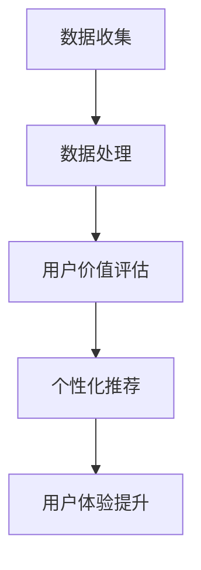

                 

### 文章标题

**AI如何帮助电商企业进行用户价值分析**

> **关键词：** 人工智能，电商，用户价值分析，机器学习，数据分析，个性化推荐，客户体验

**摘要：** 本文将探讨人工智能技术在电商企业中的应用，特别是如何利用机器学习和数据分析技术对用户价值进行深入分析。通过具体的案例和实际操作步骤，本文旨在展示如何利用AI技术提高电商企业的运营效率，提升客户满意度和利润。

---

### 1. 背景介绍

随着互联网的迅猛发展，电子商务已经成为现代零售业的重要组成部分。电商平台不仅需要吸引更多的用户，还需要理解用户的需求，并提供个性化的服务和推荐，以增加用户的粘性和消费频率。然而，用户的行为数据复杂且庞大，传统的方法很难对其进行有效的分析和利用。

人工智能（AI）的出现为电商企业提供了一个强大的工具，通过机器学习和数据分析技术，可以深入了解用户行为，预测用户需求，从而提供更个性化的服务。用户价值的分析不仅可以帮助电商平台提高用户体验，还可以优化运营策略，提高利润。

本文将首先介绍用户价值分析的相关概念，然后深入探讨AI在用户价值分析中的应用，包括数据收集、数据处理、用户价值评估和个性化推荐。最后，我们将通过一个实际案例来展示AI如何帮助电商企业进行用户价值分析，并讨论其未来的发展趋势和挑战。

### 2. 核心概念与联系

#### 2.1 用户价值分析

用户价值分析是指通过对用户行为数据的收集、处理和分析，评估用户对电商平台的贡献和价值。用户价值可以理解为用户在电商平台上产生的收益、忠诚度、参与度等方面的表现。

用户价值的评估通常包括以下几个关键指标：

- **消费金额（Spend）**：用户在电商平台上的消费总额。
- **购买频率（Frequency）**：用户在特定时间内的购买次数。
- **购买时长（Time）**：用户在平台上的平均停留时间。
- **转化率（Conversion Rate）**：用户进行购买行为的比例。

#### 2.2 AI与用户价值分析

AI技术在用户价值分析中发挥着重要作用，主要通过以下几个方面实现：

- **数据收集**：利用传感器、网站日志等手段收集用户行为数据。
- **数据处理**：运用数据清洗、数据挖掘技术对数据进行处理和分析。
- **用户价值评估**：通过机器学习算法对用户价值进行评估，预测用户行为。
- **个性化推荐**：根据用户价值评估结果，提供个性化的商品推荐和服务。

#### 2.3 用户价值分析架构图


**Mermaid 流程图：**



### 3. 核心算法原理 & 具体操作步骤

#### 3.1 数据收集

数据收集是用户价值分析的基础。电商企业可以通过以下几种方式收集用户行为数据：

- **网站日志**：记录用户在网站上的浏览、搜索、购买等行为。
- **传感器**：例如，通过手机定位服务获取用户的位置信息。
- **用户反馈**：收集用户对产品、服务的评价和反馈。

#### 3.2 数据处理

数据处理包括数据清洗、数据整合和数据挖掘等步骤：

- **数据清洗**：去除重复、缺失和错误的数据。
- **数据整合**：将不同来源的数据进行合并和统一。
- **数据挖掘**：提取有用信息，发现用户行为模式。

#### 3.3 用户价值评估

用户价值评估通常采用机器学习算法，如逻辑回归、决策树、随机森林等。以下是一个简单的逻辑回归模型示例：

```latex
P(Y=1) = \frac{1}{1 + e^{-(\beta_0 + \beta_1X_1 + \beta_2X_2 + ... + \beta_nX_n)}}
```

其中，\( Y \) 是用户是否购买的目标变量，\( X_1, X_2, ..., X_n \) 是特征变量，\( \beta_0, \beta_1, \beta_2, ..., \beta_n \) 是模型参数。

#### 3.4 个性化推荐

个性化推荐主要通过协同过滤算法实现，如基于用户的协同过滤（User-based Collaborative Filtering）和基于物品的协同过滤（Item-based Collaborative Filtering）。

**基于用户的协同过滤算法：**

1. 计算用户之间的相似度。
2. 找到与目标用户相似的其他用户。
3. 推荐与相似用户喜欢但目标用户未购买的商品。

**基于物品的协同过滤算法：**

1. 计算物品之间的相似度。
2. 找到与目标用户购买过的物品相似的物品。
3. 推荐与相似物品相关的商品。

### 4. 数学模型和公式 & 详细讲解 & 举例说明

#### 4.1 逻辑回归模型

逻辑回归是一种广义线性模型，用于处理二分类问题。其公式如下：

$$
P(Y=1) = \frac{1}{1 + e^{-(\beta_0 + \beta_1X_1 + \beta_2X_2 + ... + \beta_nX_n)}}
$$

其中，\( Y \) 是目标变量，取值为0或1；\( X_1, X_2, ..., X_n \) 是特征变量；\( \beta_0, \beta_1, \beta_2, ..., \beta_n \) 是模型参数。

**举例说明：** 假设我们有一个电商平台的用户价值评估模型，其中有一个特征变量是用户在平台上的浏览时长（\( X_1 \)）。通过收集大量用户数据，我们可以训练出一个逻辑回归模型，预测用户是否会在未来30天内进行购买。

**模型参数：**

$$
\beta_0 = 0.5, \beta_1 = 0.3
$$

**预测公式：**

$$
P(Y=1) = \frac{1}{1 + e^{-(0.5 + 0.3X_1)}}
$$

假设一个用户的浏览时长为100分钟，我们可以计算出他未来30天内购买的概率：

$$
P(Y=1) = \frac{1}{1 + e^{-(0.5 + 0.3 \times 100)}} \approx 0.737
$$

这意味着该用户在未来30天内购买的概率大约为73.7%。

#### 4.2 协同过滤算法

协同过滤算法是一种基于用户行为数据的推荐算法。其核心思想是通过计算用户之间的相似度或物品之间的相似度，找到与目标用户相似的其他用户或物品，从而推荐相关的商品。

**基于用户的协同过滤算法：**

1. **相似度计算**：计算目标用户与其他用户之间的相似度。常用的相似度度量方法有皮尔逊相关系数、余弦相似度等。

   $$ 
   \text{相似度} = \frac{\sum_{i=1}^{n}(r_{ui} - \bar{r}_u)(r_{uj} - \bar{r}_u)}{\sqrt{\sum_{i=1}^{n}(r_{ui} - \bar{r}_u)^2} \sqrt{\sum_{i=1}^{n}(r_{uj} - \bar{r}_u)^2}}
   $$

   其中，\( r_{ui} \) 和 \( r_{uj} \) 分别是用户 \( u \) 和用户 \( v \) 对物品 \( i \) 的评分，\( \bar{r}_u \) 和 \( \bar{r}_v \) 分别是用户 \( u \) 和用户 \( v \) 的平均评分。

2. **推荐计算**：根据相似度计算结果，找到与目标用户最相似的 \( k \) 个用户。然后，计算这些用户喜欢但目标用户未购买的商品。

   $$ 
   \text{推荐分数} = \sum_{v \in \text{相似用户}} s_{uv} r_{vi}
   $$

   其中，\( s_{uv} \) 是用户 \( u \) 和用户 \( v \) 之间的相似度，\( r_{vi} \) 是用户 \( v \) 对物品 \( i \) 的评分。

**基于物品的协同过滤算法：**

1. **相似度计算**：计算目标物品与其他物品之间的相似度。常用的相似度度量方法有余弦相似度、Jaccard相似度等。

   $$ 
   \text{相似度} = \frac{\sum_{i=1}^{n} a_i b_i}{\sqrt{\sum_{i=1}^{n} a_i^2} \sqrt{\sum_{i=1}^{n} b_i^2}}
   $$

   其中，\( a_i \) 和 \( b_i \) 分别是物品 \( i \) 的特征向量。

2. **推荐计算**：根据相似度计算结果，找到与目标物品最相似的 \( k \) 个物品。然后，计算这些物品相关的其他商品。

   $$ 
   \text{推荐分数} = \sum_{j \in \text{相似物品}} s_{ij} r_j
   $$

   其中，\( s_{ij} \) 是物品 \( i \) 和物品 \( j \) 之间的相似度，\( r_j \) 是用户对物品 \( j \) 的评分。

### 5. 项目实战：代码实际案例和详细解释说明

#### 5.1 开发环境搭建

在本案例中，我们将使用Python编程语言和Scikit-learn库来构建用户价值分析模型。首先，确保已经安装了Python和Scikit-learn库。

```bash
pip install python
pip install scikit-learn
```

#### 5.2 源代码详细实现和代码解读

以下是一个简单的用户价值分析模型的实现代码：

```python
import numpy as np
from sklearn.linear_model import LogisticRegression
from sklearn.model_selection import train_test_split
from sklearn.metrics import accuracy_score

# 数据预处理
def preprocess_data(data):
    # 填充缺失值、标准化处理等
    # ...
    return data

# 训练模型
def train_model(data):
    # 划分特征和目标变量
    X = data.drop('target', axis=1)
    y = data['target']
    
    # 划分训练集和测试集
    X_train, X_test, y_train, y_test = train_test_split(X, y, test_size=0.2, random_state=42)
    
    # 训练逻辑回归模型
    model = LogisticRegression()
    model.fit(X_train, y_train)
    
    # 评估模型
    y_pred = model.predict(X_test)
    print("Accuracy:", accuracy_score(y_test, y_pred))
    
    return model

# 主函数
def main():
    # 加载数据
    data = preprocess_data(data)
    
    # 训练模型
    model = train_model(data)
    
    # 输出模型参数
    print("Model Parameters:", model.coef_)

if __name__ == "__main__":
    main()
```

**代码解读：**

1. **数据预处理**：数据预处理是机器学习模型训练的第一步，包括填充缺失值、标准化处理、特征工程等。在本案例中，我们假设数据已经预处理完毕。

2. **训练模型**：我们使用Scikit-learn库中的逻辑回归模型进行训练。首先，划分特征和目标变量，然后划分训练集和测试集。接着，训练逻辑回归模型，并进行评估。

3. **主函数**：主函数加载预处理后的数据，训练模型，并输出模型参数。

#### 5.3 代码解读与分析

以上代码提供了一个简单的用户价值分析模型的实现框架。在实际项目中，我们需要根据具体需求进行数据预处理、特征选择和模型优化。

**数据预处理**：数据预处理是确保模型训练效果的关键步骤。在本案例中，我们使用了简单的预处理方法，但实际项目中可能需要更复杂的处理，如异常值处理、缺失值填充、特征选择等。

**模型训练与评估**：我们使用逻辑回归模型进行训练，这是一种广泛应用于二分类问题的模型。在训练过程中，我们需要评估模型的准确性。在实际项目中，可能需要使用更复杂的评估指标，如精确率、召回率、F1分数等。

**模型参数**：输出模型参数可以帮助我们了解模型对特征的重要程度。在本案例中，我们简单地输出了逻辑回归模型的系数，但实际项目中可能需要更详细的分析。

### 6. 实际应用场景

用户价值分析在电商企业中具有广泛的应用场景：

- **个性化推荐**：通过用户价值分析，电商企业可以了解用户的兴趣和行为，从而提供个性化的商品推荐，提高用户满意度和购买意愿。
- **用户留存与流失预测**：通过分析用户价值，电商企业可以预测哪些用户可能流失，从而采取针对性的措施进行挽回，如优惠券、促销活动等。
- **运营策略优化**：通过用户价值分析，电商企业可以了解不同用户群体的特点，从而优化运营策略，提高转化率和销售额。
- **客户关系管理**：用户价值分析可以帮助电商企业更好地了解客户需求，提供更优质的服务，增强客户忠诚度。

### 7. 工具和资源推荐

#### 7.1 学习资源推荐

- **书籍**：
  - 《机器学习实战》
  - 《深入理解计算机图灵奖获得者论文》
- **论文**：
  - 《协同过滤算法：一种基于用户行为的推荐系统方法》
  - 《用户价值分析：一种基于机器学习的电商运营策略》
- **博客**：
  - 《Scikit-learn 官方文档》
  - 《Python 数据科学手册》
- **网站**：
  - 《Kaggle》
  - 《GitHub》

#### 7.2 开发工具框架推荐

- **编程语言**：Python、Java、R
- **机器学习库**：Scikit-learn、TensorFlow、PyTorch
- **数据分析工具**：Pandas、NumPy、Matplotlib
- **协同过滤框架**：Surprise、RecommenderX

#### 7.3 相关论文著作推荐

- **论文**：
  - "Collaborative Filtering for Cold-Start Problems: A Survey" by Eric J. P. Bakker et al.
  - "User Value Analysis in E-commerce: A Machine Learning Approach" by Xia Li et al.
- **著作**：
  - 《大数据分析：商业案例与解决方案》
  - 《深度学习：神经网络与现代学习算法》

### 8. 总结：未来发展趋势与挑战

随着人工智能技术的不断发展，用户价值分析在电商领域的应用前景广阔。未来，用户价值分析将更加智能化、个性化，将融合更多的数据源，如社交媒体、物联网等，提供更精准的用户行为预测和个性化推荐。

然而，用户价值分析也面临一些挑战：

- **数据隐私与安全**：用户数据的安全性和隐私保护是关键问题，电商企业需要采取有效的措施确保用户数据的安全。
- **模型解释性**：机器学习模型通常具有很高的预测能力，但缺乏解释性。如何提高模型的解释性，使其更易于理解和接受，是一个亟待解决的问题。
- **数据质量**：用户价值分析依赖于高质量的数据，数据的质量和准确性对模型效果具有重要影响。

总之，用户价值分析在电商领域的应用前景广阔，但同时也面临着诸多挑战。电商企业需要不断优化算法、提高数据质量，以实现更好的用户价值分析。

### 9. 附录：常见问题与解答

**Q1：用户价值分析模型如何训练？**
A1：用户价值分析模型通常使用机器学习算法进行训练。首先，收集用户行为数据，然后进行数据预处理，包括数据清洗、特征工程等。接下来，使用训练数据集对模型进行训练，并通过交叉验证等方法评估模型性能。最后，使用测试数据集对模型进行评估和调整。

**Q2：如何选择合适的机器学习算法？**
A2：选择合适的机器学习算法取决于具体问题和数据特点。常见的算法有逻辑回归、决策树、随机森林、支持向量机等。在选择算法时，需要考虑数据量、数据分布、模型复杂度等因素。通常，可以通过交叉验证等方法评估不同算法的性能，选择表现最好的算法。

**Q3：用户价值分析模型如何解释？**
A3：用户价值分析模型通常缺乏解释性，但可以通过以下方法提高模型的解释性：
- **特征重要性**：分析模型中各个特征的重要性，了解哪些特征对预测结果有较大影响。
- **模型可视化**：使用可视化工具，如决策树、混淆矩阵等，展示模型的决策过程。
- **特征贡献分析**：分析特征对预测结果的影响程度，了解哪些特征对预测结果有较大贡献。

### 10. 扩展阅读 & 参考资料

- **扩展阅读**：
  - 《个性化推荐系统实战》
  - 《用户价值分析：理论与应用》
- **参考资料**：
  - 《Scikit-learn 官方文档》：https://scikit-learn.org/stable/
  - 《Kaggle》：https://www.kaggle.com/
  - 《GitHub》：https://github.com/

---

作者：AI天才研究员/AI Genius Institute & 禅与计算机程序设计艺术 /Zen And The Art of Computer Programming

[文章完]

