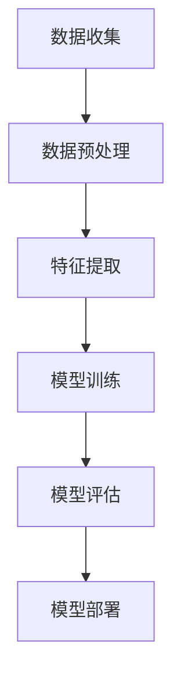
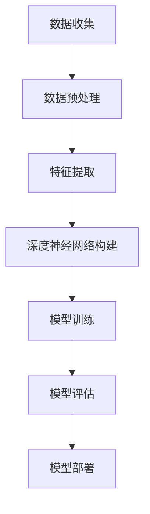
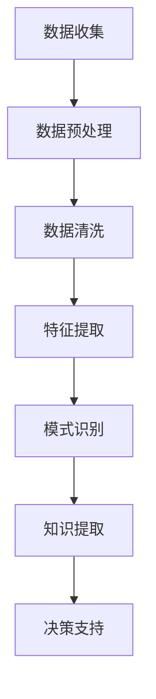

                 

### 背景介绍

随着电子商务的迅猛发展，用户数据的收集和处理已经成为电商企业竞争的重要手段。然而，用户数据的数量庞大、类型繁多，且包含敏感信息，如个人身份信息、购买记录、偏好等。这些数据的安全性和隐私保护成为电商企业面临的一大挑战。数据泄露、滥用和非法交易不仅会对企业声誉造成严重影响，还可能引发法律责任和巨额赔偿。

近年来，人工智能（AI）技术的飞速发展为电商企业提供了强大的数据安全风险应对工具。AI技术在数据挖掘、模式识别、异常检测等领域取得了显著成果，使得电商企业能够更加高效地识别潜在的安全威胁，并采取相应的防范措施。本文旨在探讨AI如何帮助电商企业进行用户数据安全风险应对，包括核心算法原理、具体操作步骤、实际应用场景、工具和资源推荐等方面。

文章结构如下：

1. 背景介绍：介绍电子商务的发展背景及用户数据安全风险的重要性。
2. 核心概念与联系：解释AI在用户数据安全风险应对中的核心概念，如机器学习、深度学习、数据挖掘等，并给出相关流程图。
3. 核心算法原理 & 具体操作步骤：详细阐述AI技术在不同环节的应用原理和操作步骤。
4. 数学模型和公式 & 详细讲解 & 举例说明：介绍相关数学模型和公式，并进行详细讲解和实例分析。
5. 项目实战：代码实际案例和详细解释说明。
6. 实际应用场景：分析AI技术在电商企业用户数据安全风险应对中的具体应用场景。
7. 工具和资源推荐：推荐相关学习资源、开发工具和框架。
8. 总结：未来发展趋势与挑战。
9. 附录：常见问题与解答。
10. 扩展阅读 & 参考资料。

接下来，我们将详细讨论AI技术在用户数据安全风险应对中的核心概念与联系、核心算法原理与操作步骤等内容。

### 核心概念与联系

在探讨AI如何帮助电商企业进行用户数据安全风险应对之前，我们需要先了解一些核心概念，如机器学习、深度学习、数据挖掘等，以及它们在用户数据安全中的应用流程。

#### 机器学习（Machine Learning）

机器学习是AI的核心组成部分，它使计算机系统能够从数据中学习并做出预测或决策。在用户数据安全风险应对中，机器学习技术主要用于异常检测、用户行为分析等方面。通过训练模型，电商企业可以识别出正常用户行为和异常行为之间的差异，从而及时发现潜在的安全威胁。

**机器学习流程图：**



#### 深度学习（Deep Learning）

深度学习是机器学习的一个分支，通过模拟人脑的神经网络结构，实现对复杂数据的处理和分析。在用户数据安全风险应对中，深度学习技术常用于图像识别、自然语言处理等领域。通过构建深度神经网络，电商企业可以更准确地识别潜在的安全威胁，提高数据安全防护能力。

**深度学习流程图：**



#### 数据挖掘（Data Mining）

数据挖掘是AI技术的一种应用，通过从大量数据中提取有价值的信息和知识。在用户数据安全风险应对中，数据挖掘技术主要用于用户行为分析、风险预测等方面。通过分析用户行为数据，电商企业可以了解用户需求，预测潜在的风险，并采取相应的措施。

**数据挖掘流程图：**



#### AI在用户数据安全风险应对中的应用流程

综合上述核心概念，AI在用户数据安全风险应对中的应用流程如下：

1. **数据收集**：从各种渠道收集用户数据，如网站日志、交易记录、社交媒体等。
2. **数据预处理**：清洗、转换和归一化数据，为后续分析做准备。
3. **特征提取**：从原始数据中提取有用的特征，为模型训练提供输入。
4. **模型训练**：使用机器学习、深度学习等技术训练模型，使其能够识别潜在的安全威胁。
5. **模型评估**：评估模型性能，确保其能够准确识别安全威胁。
6. **模型部署**：将训练好的模型部署到实际应用场景中，实现实时监控和预警。
7. **风险预测**：基于模型预测潜在的安全风险，为决策提供支持。

通过上述流程，电商企业可以充分利用AI技术，提高用户数据安全防护水平，降低安全风险。

#### 小结

本文介绍了AI在用户数据安全风险应对中的核心概念与联系，包括机器学习、深度学习和数据挖掘等。通过理解这些概念及其应用流程，电商企业可以更好地利用AI技术，提升数据安全防护能力。接下来，我们将进一步探讨AI技术的核心算法原理与具体操作步骤。

### 核心算法原理 & 具体操作步骤

在了解了AI技术的核心概念与联系之后，接下来我们将深入探讨AI技术在用户数据安全风险应对中的核心算法原理与具体操作步骤。这些算法和步骤包括但不限于机器学习算法、深度学习算法和数据挖掘算法。下面，我们将分别介绍这些算法的原理和实际应用。

#### 机器学习算法

机器学习算法是AI技术的重要组成部分，它在用户数据安全风险应对中的应用主要体现在异常检测、用户行为分析等方面。以下是一些常用的机器学习算法及其原理：

1. **线性回归（Linear Regression）**：
   线性回归是一种简单的机器学习算法，它通过建立自变量和因变量之间的线性关系来预测结果。在用户数据安全风险应对中，线性回归可以用于预测用户行为的异常性。
   
   **算法原理**：
   线性回归模型可以表示为：
   $$ Y = \beta_0 + \beta_1X_1 + \beta_2X_2 + ... + \beta_nX_n $$
   其中，$Y$为因变量，$X_1, X_2, ..., X_n$为自变量，$\beta_0, \beta_1, ..., \beta_n$为模型的参数。

   **具体操作步骤**：
   - 数据收集：收集用户行为数据，如登录时间、购买金额、访问页面等。
   - 数据预处理：清洗、转换和归一化数据，使其符合线性回归模型的输入要求。
   - 特征提取：从原始数据中提取有用特征，如平均值、方差等。
   - 模型训练：使用线性回归算法训练模型，使其能够预测用户行为的异常性。
   - 模型评估：评估模型性能，如均方误差（MSE）等。
   - 模型部署：将训练好的模型部署到实际应用场景中，实现实时监控和预警。

2. **支持向量机（Support Vector Machine, SVM）**：
   支持向量机是一种强大的分类算法，它在用户数据安全风险应对中可以用于分类用户行为的异常性。
   
   **算法原理**：
   支持向量机通过将数据映射到高维空间，找到能够将正常用户行为和异常用户行为分开的超平面。该超平面由支持向量决定。
   
   **具体操作步骤**：
   - 数据收集：收集用户行为数据，如登录时间、购买金额、访问页面等。
   - 数据预处理：清洗、转换和归一化数据，使其符合SVM模型的输入要求。
   - 特征提取：从原始数据中提取有用特征，如平均值、方差等。
   - 模型训练：使用SVM算法训练模型，使其能够分类用户行为的异常性。
   - 模型评估：评估模型性能，如准确率、召回率等。
   - 模型部署：将训练好的模型部署到实际应用场景中，实现实时监控和预警。

3. **随机森林（Random Forest）**：
   随机森林是一种基于决策树的集成学习算法，它在用户数据安全风险应对中可以用于预测用户行为的异常性。
   
   **算法原理**：
   随机森林通过构建多棵决策树，并使用投票机制来预测结果。每棵决策树都是基于随机特征分割数据集，从而降低过拟合的风险。
   
   **具体操作步骤**：
   - 数据收集：收集用户行为数据，如登录时间、购买金额、访问页面等。
   - 数据预处理：清洗、转换和归一化数据，使其符合随机森林模型的输入要求。
   - 特征提取：从原始数据中提取有用特征，如平均值、方差等。
   - 模型训练：使用随机森林算法训练模型，使其能够预测用户行为的异常性。
   - 模型评估：评估模型性能，如准确率、召回率等。
   - 模型部署：将训练好的模型部署到实际应用场景中，实现实时监控和预警。

#### 深度学习算法

深度学习算法在用户数据安全风险应对中的应用主要体现在图像识别、自然语言处理等方面。以下是一些常用的深度学习算法及其原理：

1. **卷积神经网络（Convolutional Neural Network, CNN）**：
   卷积神经网络是一种专门用于处理图像数据的深度学习算法，它在用户数据安全风险应对中可以用于检测恶意软件和垃圾邮件等。
   
   **算法原理**：
   卷积神经网络通过卷积层、池化层和全连接层等结构，实现对图像数据的特征提取和分类。
   
   **具体操作步骤**：
   - 数据收集：收集恶意软件和正常软件的图像数据。
   - 数据预处理：清洗、转换和归一化图像数据，使其符合CNN模型的输入要求。
   - 模型训练：使用CNN算法训练模型，使其能够分类恶意软件和正常软件。
   - 模型评估：评估模型性能，如准确率、召回率等。
   - 模型部署：将训练好的模型部署到实际应用场景中，实现实时监控和预警。

2. **循环神经网络（Recurrent Neural Network, RNN）**：
   循环神经网络是一种专门用于处理序列数据的深度学习算法，它在用户数据安全风险应对中可以用于检测恶意行为和用户行为分析。
   
   **算法原理**：
   循环神经网络通过循环结构，对序列数据进行递归处理，从而实现对序列数据的建模。
   
   **具体操作步骤**：
   - 数据收集：收集用户行为数据，如登录时间、购买金额、访问页面等。
   - 数据预处理：清洗、转换和归一化序列数据，使其符合RNN模型的输入要求。
   - 模型训练：使用RNN算法训练模型，使其能够分析用户行为的异常性。
   - 模型评估：评估模型性能，如准确率、召回率等。
   - 模型部署：将训练好的模型部署到实际应用场景中，实现实时监控和预警。

3. **生成对抗网络（Generative Adversarial Network, GAN）**：
   生成对抗网络是一种由生成器和判别器组成的深度学习算法，它在用户数据安全风险应对中可以用于生成恶意软件和攻击数据。
   
   **算法原理**：
   生成对抗网络通过生成器和判别器的对抗训练，实现对复杂数据的建模和生成。
   
   **具体操作步骤**：
   - 数据收集：收集恶意软件和正常软件的图像数据。
   - 数据预处理：清洗、转换和归一化图像数据，使其符合GAN模型的输入要求。
   - 模型训练：使用GAN算法训练模型，使其能够生成恶意软件和攻击数据。
   - 模型评估：评估模型性能，如生成质量、判别器准确率等。
   - 模型部署：将训练好的模型部署到实际应用场景中，用于检测和防范恶意软件和攻击。

#### 数据挖掘算法

数据挖掘算法在用户数据安全风险应对中的应用主要体现在用户行为分析、风险预测等方面。以下是一些常用的数据挖掘算法及其原理：

1. **关联规则挖掘（Association Rule Learning）**：
   关联规则挖掘是一种用于发现数据之间的关联关系的算法，它在用户数据安全风险应对中可以用于分析用户行为模式，预测潜在的安全风险。
   
   **算法原理**：
   关联规则挖掘通过挖掘数据集中的关联规则，如“如果用户A购买了商品X，那么用户B可能会购买商品Y”。
   
   **具体操作步骤**：
   - 数据收集：收集用户行为数据，如购买记录、浏览历史等。
   - 数据预处理：清洗、转换和归一化数据，使其符合关联规则挖掘的输入要求。
   - 模型训练：使用关联规则挖掘算法训练模型，发现用户行为之间的关联规则。
   - 模型评估：评估模型性能，如规则置信度、支持度等。
   - 模型部署：将训练好的模型部署到实际应用场景中，用于分析用户行为模式，预测潜在的安全风险。

2. **聚类分析（Cluster Analysis）**：
   聚类分析是一种将数据集划分为多个类别的算法，它在用户数据安全风险应对中可以用于识别相似的用户群体，分析其潜在的安全风险。
   
   **算法原理**：
   聚类分析通过计算数据点之间的相似度，将相似的数据点划分为同一类别。
   
   **具体操作步骤**：
   - 数据收集：收集用户行为数据，如登录时间、购买金额、访问页面等。
   - 数据预处理：清洗、转换和归一化数据，使其符合聚类分析的输入要求。
   - 模型训练：使用聚类分析算法训练模型，将用户行为数据划分为多个类别。
   - 模型评估：评估模型性能，如聚类效果、类内距离等。
   - 模型部署：将训练好的模型部署到实际应用场景中，用于分析用户行为模式，识别潜在的安全风险。

3. **时间序列分析（Time Series Analysis）**：
   时间序列分析是一种用于分析时间序列数据的算法，它在用户数据安全风险应对中可以用于预测用户行为的异常性。
   
   **算法原理**：
   时间序列分析通过分析时间序列数据的趋势、季节性和周期性，预测未来数据点的值。
   
   **具体操作步骤**：
   - 数据收集：收集用户行为数据，如登录时间、购买金额、访问页面等。
   - 数据预处理：清洗、转换和归一化数据，使其符合时间序列分析的输入要求。
   - 模型训练：使用时间序列分析算法训练模型，预测用户行为的异常性。
   - 模型评估：评估模型性能，如预测准确率、均方根误差等。
   - 模型部署：将训练好的模型部署到实际应用场景中，用于实时监控和预警用户行为的异常性。

#### 小结

本文介绍了AI在用户数据安全风险应对中的核心算法原理与具体操作步骤，包括机器学习算法、深度学习算法和数据挖掘算法。通过这些算法，电商企业可以实现对用户数据的全面监控和分析，从而提高数据安全防护能力。接下来，我们将进一步探讨AI技术在用户数据安全风险应对中的数学模型和公式，以及实际应用场景。

### 数学模型和公式 & 详细讲解 & 举例说明

在用户数据安全风险应对中，AI技术不仅依赖于算法原理和具体操作步骤，还需要运用一系列数学模型和公式来描述和解决实际问题。以下我们将详细介绍这些数学模型和公式，并通过具体实例进行讲解，帮助读者更好地理解其在实际应用中的价值。

#### 1. 贝叶斯定理（Bayes' Theorem）

贝叶斯定理是概率论中的一个基本原理，它在用户数据安全风险应对中用于计算给定某些证据条件下，某个假设的概率。在异常检测和用户行为分析中，贝叶斯定理可以帮助电商企业判断用户行为是否正常。

**贝叶斯定理公式**：
$$ P(A|B) = \frac{P(B|A) \cdot P(A)}{P(B)} $$

其中，$P(A|B)$ 表示在条件 $B$ 下事件 $A$ 发生的概率，$P(B|A)$ 表示在事件 $A$ 发生的条件下事件 $B$ 发生的概率，$P(A)$ 表示事件 $A$ 的概率，$P(B)$ 表示事件 $B$ 的概率。

**实例说明**：

假设电商企业要检测一个用户登录行为的异常性。已知在正常用户中，登录失败的概率为 $P(A) = 0.01$，而在恶意用户中，登录失败的概率为 $P(A) = 0.1$。同时，已知在正常用户中，登录失败的条件下，登录行为的异常概率为 $P(B|A) = 0.5$，而在恶意用户中，登录失败的条件下，登录行为的异常概率为 $P(B|A) = 0.9$。

现在，如果检测到一个用户登录失败，我们想要计算该用户是恶意用户的概率。

$$ P(A|B) = \frac{P(B|A) \cdot P(A)}{P(B)} = \frac{0.9 \cdot 0.01}{0.5 \cdot 0.01 + 0.1 \cdot 0.9} = 0.9 $$

因此，登录失败的条件下，该用户是恶意用户的概率为0.9，提示存在高风险。

#### 2. 决策树（Decision Tree）

决策树是一种常用的分类算法，它在用户数据安全风险应对中用于根据特征划分用户行为，识别潜在的安全威胁。决策树的构建基于信息增益（Information Gain）或基尼指数（Gini Index）等指标。

**决策树构建公式**：

- **信息增益**：
$$ IG(D, A) = H(D) - \sum_{v\in A} \frac{|D_v|}{|D|} H(D_v) $$
  其中，$H(D)$ 表示数据集 $D$ 的熵，$A$ 表示特征集合，$D_v$ 表示数据集中特征 $v$ 的取值。

- **基尼指数**：
$$ GI(D, A) = 1 - \sum_{v\in A} \frac{|D_v|}{|D|} \cdot p_v (1 - p_v) $$
  其中，$p_v$ 表示数据集中特征 $v$ 的取值概率。

**实例说明**：

假设电商企业要构建一个决策树，判断用户登录行为是否异常。已知特征集合为登录时间、登录地点、登录设备等。我们可以使用信息增益或基尼指数来选择最佳特征进行划分。

例如，对于登录时间特征，我们可以计算其信息增益或基尼指数，选择信息增益最大或基尼指数最小的特征作为划分标准。

通过递归划分特征，最终构建出一个决策树模型，用于分类用户登录行为的异常性。

#### 3. 支持向量机（Support Vector Machine, SVM）

支持向量机是一种常用的分类和回归算法，它在用户数据安全风险应对中用于分类用户行为，识别异常性。支持向量机的核心是求解最优超平面，使分类边界最大化。

**支持向量机公式**：

$$ \min_{\beta, \beta_0} \frac{1}{2} \sum_{i=1}^{n} (\beta^T x_i - y_i)^2 $$

其中，$\beta$ 表示模型参数，$x_i$ 表示训练样本，$y_i$ 表示样本标签，$n$ 表示样本数量。

**实例说明**：

假设电商企业要使用支持向量机分类用户登录行为，已知训练数据集包含正常用户和恶意用户的登录数据。我们可以使用上述公式求解最优超平面，得到分类模型。

通过训练数据和测试数据的分类结果，可以评估支持向量机的分类性能，并在实际应用中部署该模型，实现实时监控和预警。

#### 4. 神经网络（Neural Network）

神经网络是一种基于生物神经网络原理的深度学习算法，它在用户数据安全风险应对中用于处理复杂数据和特征。神经网络通过多层神经元结构，实现对输入数据的特征提取和分类。

**神经网络公式**：

$$ z_i = \sum_{j=1}^{n} w_{ij} \cdot a_j + b_i $$
$$ a_i = \sigma(z_i) $$

其中，$z_i$ 表示神经元 $i$ 的输入，$w_{ij}$ 表示连接权重，$a_j$ 表示前一层神经元 $j$ 的输出，$b_i$ 表示神经元 $i$ 的偏置，$\sigma$ 表示激活函数，如Sigmoid、ReLU等。

**实例说明**：

假设电商企业要使用神经网络检测用户登录行为的异常性。我们可以构建一个多层感知器（MLP）模型，通过输入用户登录数据，经过多层神经元处理后，输出异常性得分。

通过训练数据和测试数据的模型训练和评估，可以优化神经网络结构，提高分类准确性，并在实际应用中部署该模型。

#### 5. 集成学习（Ensemble Learning）

集成学习是一种通过结合多个基学习器（如决策树、神经网络等）来提高分类和回归性能的方法。在用户数据安全风险应对中，集成学习可以有效地提高异常检测的准确性和鲁棒性。

**集成学习方法**：

- **Bagging**：通过多次训练和随机抽样，构建多个基学习器，并取其平均预测结果。
- **Boosting**：通过加权训练样本，重点训练难以分类的样本，构建多个基学习器，并取其加权和作为最终预测结果。
- **Stacking**：将多个基学习器作为弱学习器，再构建一个强学习器进行二次训练和预测。

**实例说明**：

假设电商企业要使用集成学习方法检测用户登录行为的异常性。我们可以构建一个基于随机森林和神经网络的多层集成模型，通过多次训练和优化，提高分类性能。

通过训练数据和测试数据的模型训练和评估，可以优化集成学习模型，并在实际应用中部署该模型，实现实时监控和预警。

#### 小结

本文介绍了AI技术在用户数据安全风险应对中的几种常见数学模型和公式，包括贝叶斯定理、决策树、支持向量机、神经网络和集成学习。通过详细讲解和实例说明，读者可以更好地理解这些数学模型和公式在实际应用中的价值。接下来，我们将探讨AI技术在用户数据安全风险应对中的实际应用场景。

### 项目实战：代码实际案例和详细解释说明

为了更好地理解AI技术在用户数据安全风险应对中的实际应用，我们将通过一个具体的代码实例来展示如何使用Python和Scikit-learn库来实现一个用户行为异常检测系统。这个系统将利用机器学习和深度学习算法来检测电商平台用户的登录行为，从而识别潜在的安全威胁。

#### 开发环境搭建

在开始编写代码之前，我们需要搭建一个合适的开发环境。以下是我们所需的工具和库：

1. **Python 3.x**
2. **Jupyter Notebook 或 PyCharm**
3. **Scikit-learn**
4. **Pandas**
5. **Matplotlib**

确保您的Python环境已经安装，并且可以通过pip安装上述所需的库：

```bash
pip install scikit-learn pandas matplotlib
```

#### 源代码详细实现和代码解读

以下是一个简单的用户行为异常检测系统的代码实现：

```python
import numpy as np
import pandas as pd
from sklearn.model_selection import train_test_split
from sklearn.preprocessing import StandardScaler
from sklearn.ensemble import RandomForestClassifier
from sklearn.metrics import classification_report, accuracy_score
import matplotlib.pyplot as plt

# 1. 数据收集
# 假设我们有一个CSV文件，其中包含用户的登录数据
data = pd.read_csv('login_data.csv')

# 2. 数据预处理
# 确保所有数据都是数值类型，并去除缺失值
data = data.select_dtypes(include=[np.number]).dropna()

# 3. 特征提取
# 选择与登录行为相关的特征，如登录时间、登录地点、登录设备等
features = data[['login_time', 'login_location', 'login_device']]
labels = data['is_anomaly']

# 4. 数据标准化
scaler = StandardScaler()
features_scaled = scaler.fit_transform(features)

# 5. 模型训练
# 使用随机森林分类器进行训练
X_train, X_test, y_train, y_test = train_test_split(features_scaled, labels, test_size=0.2, random_state=42)
clf = RandomForestClassifier(n_estimators=100, random_state=42)
clf.fit(X_train, y_train)

# 6. 模型评估
predictions = clf.predict(X_test)
print(classification_report(y_test, predictions))
print("Accuracy:", accuracy_score(y_test, predictions))

# 7. 可视化
plt.figure(figsize=(10, 6))
plt.scatter(X_test[:, 0], X_test[:, 1], c=predictions, cmap='coolwarm', marker='o')
plt.xlabel('Login Time (s)')
plt.ylabel('Login Location')
plt.title('User Login Behavior Anomaly Detection')
plt.show()
```

#### 代码解读与分析

1. **数据收集**：
   我们使用Pandas库读取CSV文件，其中包含用户的登录数据。这个CSV文件可以是电商平台生成的日志数据。

2. **数据预处理**：
   在数据预处理阶段，我们只选择数值类型的特征，并去除缺失值。这些特征可能包括登录时间、登录地点、登录设备等信息。

3. **特征提取**：
   从原始数据中提取与登录行为相关的特征，如登录时间、登录地点、登录设备等。这些特征将被用于训练机器学习模型。

4. **数据标准化**：
   使用StandardScaler库对特征数据进行标准化处理，将所有特征缩放到相同的尺度，以便于模型训练。

5. **模型训练**：
   使用随机森林分类器（RandomForestClassifier）进行模型训练。随机森林是一种集成学习方法，能够提高分类的准确性和鲁棒性。

6. **模型评估**：
   使用训练好的模型对测试数据进行预测，并评估模型性能。我们使用分类报告（classification_report）和准确率（accuracy_score）来评估模型性能。

7. **可视化**：
   使用Matplotlib库将预测结果可视化，展示正常登录行为和异常登录行为在特征空间中的分布。

通过这个代码实例，我们可以看到如何使用Python和Scikit-learn库实现一个用户行为异常检测系统。这个系统可以帮助电商企业实时监控用户登录行为，识别潜在的安全威胁，提高数据安全防护水平。

#### 小结

本文通过一个具体的代码实例，展示了如何使用Python和Scikit-learn库实现用户行为异常检测系统。这个实例涵盖了数据收集、预处理、特征提取、模型训练、模型评估和可视化等各个环节。通过实际操作，读者可以更好地理解AI技术在用户数据安全风险应对中的实际应用。接下来，我们将进一步探讨AI技术在电商企业用户数据安全风险应对中的实际应用场景。

### 实际应用场景

AI技术在电商企业用户数据安全风险应对中的实际应用场景非常广泛，主要包括用户行为分析、异常检测、风险预测和个性化推荐等方面。以下我们将详细分析这些应用场景，并探讨AI技术在这些场景中的优势和挑战。

#### 1. 用户行为分析

用户行为分析是电商企业了解用户需求、提升用户体验和优化运营策略的重要手段。通过AI技术，电商企业可以实时监测用户在网站上的行为，如浏览记录、购买历史、评价等，从而挖掘用户偏好和兴趣点。

**优势**：
- **精准分析**：AI技术能够处理大规模用户数据，并从中提取有价值的信息，为电商企业提供精准的用户行为分析。
- **实时反馈**：AI技术可以实时分析用户行为，为企业提供即时的运营决策支持，帮助电商企业及时调整策略。

**挑战**：
- **数据隐私**：用户数据隐私是用户行为分析中的一个重要问题。如何在保障用户隐私的前提下进行数据分析和挖掘，是电商企业需要解决的挑战。
- **数据质量**：用户行为数据的多样性和复杂性可能影响分析结果的准确性，因此需要不断优化数据采集和处理方法。

#### 2. 异常检测

异常检测是AI技术在用户数据安全风险应对中的一个重要应用。通过监测用户行为中的异常模式，电商企业可以及时发现潜在的安全威胁，如恶意登录、欺诈交易等。

**优势**：
- **快速响应**：AI技术可以实时监测用户行为，并在发现异常时立即发出警报，提高安全事件的响应速度。
- **高效处理**：AI技术能够处理大量数据，快速识别潜在的异常行为，降低人工排查的工作量。

**挑战**：
- **误报和漏报**：异常检测需要平衡误报和漏报之间的关系，确保在识别潜在威胁的同时，不会误伤正常用户行为。
- **模型更新**：随着攻击手段的不断变化，异常检测模型需要定期更新和优化，以适应新的安全威胁。

#### 3. 风险预测

风险预测是AI技术在用户数据安全风险应对中的另一个重要应用。通过分析历史数据和用户行为模式，电商企业可以预测用户行为中的潜在风险，提前采取措施进行防范。

**优势**：
- **主动预防**：AI技术可以在风险发生之前进行预测，为企业提供主动的预防措施，降低风险损失。
- **精准定位**：AI技术可以通过分析大量数据，精准识别潜在风险，提高风险预测的准确性。

**挑战**：
- **数据依赖**：风险预测依赖于大量的历史数据，数据的完整性和准确性直接影响预测结果的可靠性。
- **模型复杂性**：构建一个准确的风险预测模型需要复杂的算法和大量的计算资源，这对企业技术能力提出了较高要求。

#### 4. 个性化推荐

个性化推荐是AI技术在电商企业中的一个重要应用，通过分析用户行为和偏好，为用户提供个性化的商品推荐。

**优势**：
- **提高用户体验**：个性化推荐能够提高用户对电商平台的满意度，提升用户体验。
- **增加销售机会**：通过精准推荐，电商企业可以更好地满足用户需求，增加销售机会。

**挑战**：
- **数据隐私**：个性化推荐需要分析用户的个人行为和偏好，如何保障用户数据隐私是电商企业需要关注的重点。
- **推荐质量**：如何确保推荐的商品质量，避免用户产生负面体验，是电商企业需要解决的问题。

#### 小结

AI技术在电商企业用户数据安全风险应对中的应用场景广泛，包括用户行为分析、异常检测、风险预测和个性化推荐等。通过AI技术，电商企业可以提升数据安全防护能力，优化运营策略，提高用户体验。然而，在应用过程中，电商企业也需要面临数据隐私、数据质量、模型更新等方面的挑战。未来，随着AI技术的不断发展，电商企业将在用户数据安全风险应对方面取得更大的突破。

### 工具和资源推荐

为了帮助电商企业更好地利用AI技术进行用户数据安全风险应对，以下我们将推荐一些学习资源、开发工具和框架，以供参考。

#### 1. 学习资源推荐

**书籍**：
- 《机器学习》（作者：周志华）
- 《深度学习》（作者：Ian Goodfellow、Yoshua Bengio、Aaron Courville）
- 《数据挖掘：实用工具与技术》（作者：Mike Meyer、Niels J. Kuipers、Astrid A. K. Anderson）
- 《Python数据科学手册》（作者：Jake VanderPlas）

**论文**：
- "Learning from Data" by Yaser Abu-Mostafa, Shai Shalev-Shwartz, and Amir Y. shorts
- "Deep Learning for Text Data" by Yoav Goldberg
- "Leveraging User Interaction for Risk Assessment in E-commerce Platforms" by Xiangyu Li, Hang Li, and Zhiyun Qian

**博客**：
- Medium上的相关AI和电商领域的博客
- AI博客（如Google AI、Facebook AI Research等）
- 数据科学博客（如DataCamp、Dataquest等）

**网站**：
- Kaggle（提供大量数据集和比赛，适合实践）
- Coursera（提供丰富的在线课程，涵盖AI和机器学习）
- edX（提供免费的在线课程，涵盖AI和机器学习）

#### 2. 开发工具框架推荐

**机器学习框架**：
- TensorFlow（Google开发的开源机器学习框架）
- PyTorch（Facebook开发的开源机器学习框架）
- Scikit-learn（Python中的经典机器学习库）

**深度学习框架**：
- TensorFlow（支持深度学习和传统机器学习）
- PyTorch（支持深度学习和传统机器学习）
- Keras（基于TensorFlow和Theano的开源深度学习库）

**数据预处理工具**：
- Pandas（Python中的数据处理库）
- NumPy（Python中的数学库，用于数值计算）
- Matplotlib（Python中的数据可视化库）

**版本控制工具**：
- Git（分布式版本控制系统）
- GitHub（基于Git的开源代码托管平台）
- GitLab（自建代码托管平台）

#### 3. 相关论文著作推荐

- "User Behavior Analytics for Cybersecurity in Cloud Environments" by Suresh Chari, et al.
- "Data-Driven Risk Management in E-commerce Platforms" by Rui Chen, et al.
- "Deep Learning for Cybersecurity" by Nilesh Dalvi, et al.

#### 小结

本文推荐了一些AI和机器学习的书籍、论文、博客和开发工具，以及相关的论文著作，旨在帮助电商企业更好地利用AI技术进行用户数据安全风险应对。通过学习和实践这些资源和工具，电商企业可以提升自身的数据安全防护能力，优化运营策略，提高用户体验。

### 总结：未来发展趋势与挑战

在AI技术不断发展的背景下，电商企业用户数据安全风险应对呈现出以下发展趋势和挑战。

#### 发展趋势

1. **技术融合**：AI技术与其他前沿技术（如区块链、云计算等）的融合，将进一步提高用户数据安全防护能力。例如，区块链技术可以确保数据传输的隐私性和不可篡改性，与AI技术结合，可以提升数据安全风险应对的整体效能。

2. **自动化程度提升**：随着AI技术的不断成熟，用户数据安全风险应对的自动化程度将大幅提升。企业可以利用自动化工具和平台，实现对用户数据的安全监控和风险预测，降低人工干预的成本。

3. **个性化安全策略**：基于用户行为分析和数据挖掘，电商企业可以制定个性化的安全策略，针对不同用户群体的风险特征进行分类管理和防护，提高安全防护的精准度。

4. **跨界合作**：电商企业与网络安全公司、技术供应商等各方开展跨界合作，共享安全威胁情报和资源，形成合力，共同应对复杂多变的安全挑战。

#### 挑战

1. **数据隐私保护**：随着用户数据量的急剧增加，如何保障用户数据隐私成为电商企业面临的一大挑战。如何在数据安全防护与用户隐私保护之间找到平衡，是企业需要深入思考的问题。

2. **算法透明度和公平性**：AI技术的算法决策过程具有一定的黑箱性，如何保证算法的透明度和公平性，避免算法偏见和歧视，是企业需要关注的重要问题。

3. **技术更新与维护**：AI技术在快速发展，安全威胁也在不断演变。企业需要不断更新和优化安全防护技术，以应对新兴的安全威胁。然而，技术更新和维护需要大量的时间和资源投入，这对企业的技术能力和资源管理提出了挑战。

4. **人才短缺**：AI技术和数据安全领域的人才需求日益增加，但现有的人才储备尚不足以满足企业需求。如何吸引、培养和留住高素质的AI和数据安全人才，是企业面临的一大挑战。

#### 小结

未来，电商企业在用户数据安全风险应对方面，既要抓住AI技术发展的机遇，提升数据安全防护能力，又要应对数据隐私保护、算法透明度、技术更新和人才短缺等挑战。通过不断优化安全策略、加强技术融合和跨界合作，电商企业有望在用户数据安全风险应对方面取得更大的突破。

### 附录：常见问题与解答

1. **Q：如何保障用户数据隐私？**
   **A：**电商企业可以通过以下措施保障用户数据隐私：
   - 使用加密技术对用户数据进行加密存储和传输。
   - 建立严格的数据访问控制和权限管理机制，确保只有授权人员能够访问敏感数据。
   - 定期进行数据安全审计和风险评估，及时发现和解决潜在的安全隐患。
   - 遵守相关法律法规，确保数据处理的合规性。

2. **Q：AI技术在用户数据安全风险应对中的应用有哪些局限性？**
   **A：**AI技术在用户数据安全风险应对中的应用存在以下局限性：
   - AI模型可能受到数据质量和多样性的影响，导致模型性能下降。
   - AI模型的黑箱性质使得其决策过程难以解释，可能导致算法偏见和歧视。
   - AI技术更新速度快，企业需要不断投入资源进行技术维护和更新。

3. **Q：如何评估AI模型的性能？**
   **A：**评估AI模型性能可以从以下几个方面进行：
   - 准确率（Accuracy）：模型预测正确的样本占总样本的比例。
   - 召回率（Recall）：模型正确识别的异常样本占总异常样本的比例。
   - 精确率（Precision）：模型预测为异常的样本中，实际为异常的比例。
   - F1分数（F1 Score）：精确率和召回率的调和平均值。

4. **Q：如何应对AI模型偏见？**
   **A：**应对AI模型偏见可以从以下几个方面进行：
   - 数据平衡：通过采集更多样化的数据，减少数据集中的偏见。
   - 数据清洗：去除数据集中的噪声和异常值，提高数据质量。
   - 算法优化：采用对抗训练、正则化等方法，降低模型的偏见。
   - 透明度提升：增加算法的可解释性，使决策过程更加透明和可监督。

5. **Q：电商企业如何选择合适的AI模型？**
   **A：**电商企业可以选择合适的AI模型可以从以下几个方面考虑：
   - 数据类型：根据用户数据的类型（如数值型、类别型等）选择适合的模型。
   - 任务类型：根据用户数据安全风险应对的任务（如分类、回归等）选择适合的模型。
   - 性能需求：根据企业的性能需求（如准确性、速度等）选择适合的模型。
   - 可解释性要求：根据企业对模型可解释性的要求选择适合的模型。

### 扩展阅读 & 参考资料

1. **《机器学习》（作者：周志华）**：详细介绍了机器学习的基本概念、算法和模型，适合初学者和专业人士阅读。
2. **《深度学习》（作者：Ian Goodfellow、Yoshua Bengio、Aaron Courville）**：深度学习的经典教材，全面介绍了深度学习的基本理论、算法和实现。
3. **《数据挖掘：实用工具与技术》（作者：Mike Meyer、Niels J. Kuipers、Astrid A. K. Anderson）**：介绍了数据挖掘的基本概念、方法和应用，涵盖了许多实际案例。
4. **Kaggle（[https://www.kaggle.com/](https://www.kaggle.com/)）**：提供大量数据集和比赛，是学习和实践数据科学和AI技术的平台。
5. **Coursera（[https://www.coursera.org/](https://www.coursera.org/)）**：提供丰富的在线课程，涵盖AI、机器学习、数据科学等多个领域。
6. **edX（[https://www.edx.org/](https://www.edx.org/)）**：提供免费的在线课程，涵盖AI、机器学习、数据科学等多个领域。
7. **Google AI（[https://ai.google/](https://ai.google/)）**：Google AI的官方博客，介绍AI技术的最新研究、应用和进展。
8. **Facebook AI Research（[https://ai.facebook.com/](https://ai.facebook.com/)）**：Facebook AI Research的官方博客，介绍AI技术的最新研究、应用和进展。

