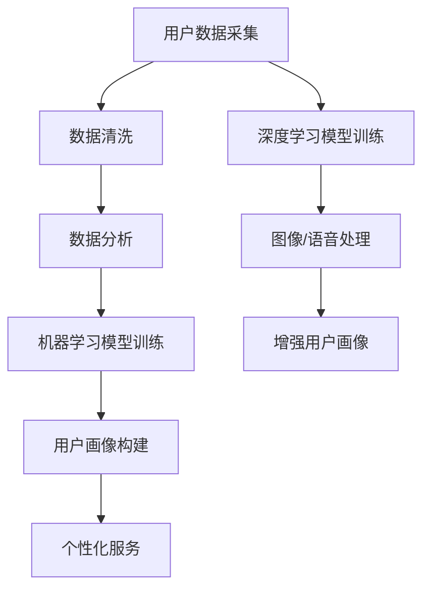

                 

### 背景介绍

在现代商业环境中，用户画像构建已成为电商企业提升竞争力的重要手段。用户画像是指通过对用户的数据进行分析和整合，构建出用户的基本属性、行为特征、偏好和需求等信息的综合模型。这一模型可以帮助电商企业更准确地了解用户，从而优化产品推荐、个性化服务和营销策略。

然而，传统的用户画像构建方法往往依赖于人工干预和数据收集，存在数据量有限、准确性不高、实时性差等问题。随着人工智能技术的不断发展，特别是机器学习、深度学习和大数据分析技术的应用，AI在电商用户画像构建中发挥了越来越重要的作用。

本文旨在探讨AI如何帮助电商企业进行用户画像构建，分析其核心算法原理、数学模型、项目实战及实际应用场景，并总结未来发展趋势与挑战。通过本文的阅读，读者将能够深入了解AI在电商用户画像构建中的具体应用，掌握相关技术和方法，为电商企业的发展提供有益的参考。

### 核心概念与联系

在深入探讨AI如何帮助电商企业进行用户画像构建之前，首先需要明确几个核心概念及其相互关系。

**1. 机器学习（Machine Learning）**

机器学习是一种人工智能（AI）的分支，通过构建和分析模型，让计算机具备从数据中学习并做出预测或决策的能力。在用户画像构建中，机器学习主要用于分析用户行为数据，识别用户特征和偏好。

**2. 深度学习（Deep Learning）**

深度学习是机器学习的一个子领域，使用多层神经网络（例如卷积神经网络CNN、循环神经网络RNN等）来模拟人类大脑的决策过程。深度学习在图像、语音和文本数据的处理方面具有强大的能力，为用户画像构建提供了有效的技术支持。

**3. 大数据分析（Big Data Analytics）**

大数据分析是指对大量结构化和非结构化数据进行处理、分析和挖掘，以发现潜在价值和知识。在电商用户画像构建中，大数据分析用于整合和清洗用户数据，提取有价值的信息。

**4. 用户画像（User Profiling）**

用户画像是对用户基本属性、行为特征、偏好和需求等的综合模型。在电商领域，用户画像主要用于个性化推荐、精准营销和服务优化。

**5. 数据流（Data Flow）**

数据流是指用户数据在采集、传输、存储和处理等环节的流动过程。在用户画像构建中，数据流的设计和优化至关重要，影响整体效率和准确性。

**Mermaid 流程图**

以下是一个简单的Mermaid流程图，展示了用户数据从采集到构建用户画像的过程，以及各个核心概念之间的联系：



通过上述核心概念和Mermaid流程图，我们可以看到，AI技术在电商用户画像构建中发挥着关键作用，从数据采集到画像构建，再到个性化服务，各个环节都离不开机器学习、深度学习和大数据分析的支持。接下来，我们将深入探讨AI在用户画像构建中的具体应用和实现方法。

### 核心算法原理 & 具体操作步骤

在电商用户画像构建中，核心算法主要分为以下几个步骤：数据采集与预处理、特征提取、模型训练与评估、用户画像生成。以下是这些步骤的具体操作方法和原理。

#### 1. 数据采集与预处理

**数据采集：**  
首先，电商企业需要从多个渠道收集用户数据，包括用户注册信息、浏览行为、购物行为、评价和反馈等。这些数据可以来自企业内部系统，也可以来自第三方数据源。

**数据预处理：**  
采集到的数据通常存在缺失、噪声和重复等问题，需要通过数据清洗和预处理技术进行清洗和整合。具体方法包括：

- **缺失值处理：** 采用均值、中位数、最常见值等填充缺失值，或根据业务逻辑删除缺失值。
- **噪声处理：** 去除或降低异常值，例如去除明显错误的用户评价。
- **重复值处理：** 检测并删除重复的用户数据，以避免重复计算。
- **数据规范化：** 将不同尺度的数据进行规范化，例如将评分数据归一化到[0, 1]区间。

#### 2. 特征提取

特征提取是指从原始数据中提取有价值的信息，以便用于模型训练和用户画像构建。常见的特征提取方法包括：

- **静态特征：** 包括用户基本信息（年龄、性别、职业等）和历史行为特征（购买频率、购买金额等）。
- **动态特征：** 包括用户当前的浏览和购买行为，以及实时反馈（评价、点赞等）。
- **交互特征：** 包括用户与其他用户、商品、品牌等的互动关系，例如用户之间的相似度、用户对商品的评分等。
- **文本特征：** 利用自然语言处理技术提取用户评论、标签等文本数据的特征，例如词频、词向量和主题模型。

#### 3. 模型训练与评估

模型训练是指利用特征数据和用户标签（例如购买意愿、偏好等）训练机器学习模型。常见的模型包括分类模型（如逻辑回归、SVM、随机森林等）和聚类模型（如K-Means、DBSCAN等）。

**模型评估：**  
训练完成后，需要评估模型的性能，常用的评估指标包括准确率、召回率、F1值等。评估方法包括交叉验证、网格搜索等。

#### 4. 用户画像生成

用户画像生成是指利用训练好的模型和用户特征数据，生成用户的综合画像。具体步骤如下：

- **聚类分析：** 将用户分为若干个群体，每个群体具有相似的特征和偏好。
- **特征权重计算：** 根据用户在各个特征上的表现，计算特征权重，用于评估用户对某一类商品的偏好程度。
- **画像综合：** 将用户在不同维度上的特征和权重整合，生成一个完整的用户画像。

#### 5. 代码示例

以下是一个简单的Python代码示例，展示了用户画像构建的基本流程：

```python
import pandas as pd
from sklearn.model_selection import train_test_split
from sklearn.preprocessing import StandardScaler
from sklearn.cluster import KMeans
from sklearn.metrics import accuracy_score

# 1. 数据采集与预处理
data = pd.read_csv('user_data.csv')
data = data.dropna()  # 去除缺失值
data = data.drop_duplicates()  # 去除重复值

# 2. 特征提取
# 此处省略具体代码，实际应用中需要根据业务需求提取特征

# 3. 模型训练与评估
X = data.values[:, :10]  # 特征数据
y = data.values[:, 10]  # 标签数据
X_train, X_test, y_train, y_test = train_test_split(X, y, test_size=0.3, random_state=42)

scaler = StandardScaler()
X_train = scaler.fit_transform(X_train)
X_test = scaler.transform(X_test)

kmeans = KMeans(n_clusters=3, random_state=42)
kmeans.fit(X_train)

# 4. 用户画像生成
predictions = kmeans.predict(X_test)
accuracy = accuracy_score(y_test, predictions)
print('Accuracy:', accuracy)

# 5. 画像综合
clusters = kmeans.labels_
data['cluster'] = clusters
print(data.head())
```

通过以上步骤和代码示例，我们可以看到，电商用户画像构建是一个复杂但极具价值的过程。在实际应用中，需要根据业务需求不断优化算法和特征提取方法，以提高画像的准确性和实用性。

### 数学模型和公式 & 详细讲解 & 举例说明

在电商用户画像构建过程中，数学模型和公式起着至关重要的作用。这些模型和公式不仅帮助我们从数据中提取有价值的信息，还能够量化用户的行为和偏好。以下是几个常用的数学模型和公式的详细讲解以及具体示例。

#### 1. 逻辑回归（Logistic Regression）

逻辑回归是一种广义线性模型，常用于二分类问题。在用户画像构建中，逻辑回归可以用来预测用户对某一类商品的购买意愿。

**公式：**  
逻辑回归的预测公式为：

$$
P(y=1) = \frac{1}{1 + e^{-(\beta_0 + \beta_1x_1 + \beta_2x_2 + ... + \beta_nx_n})}
$$

其中，$P(y=1)$表示用户购买某一类商品的概率，$e$为自然底数，$\beta_0, \beta_1, \beta_2, ..., \beta_n$为模型参数，$x_1, x_2, ..., x_n$为用户特征。

**示例：**  
假设我们有一个用户特征向量$(x_1, x_2, x_3) = (1000, 20, 3)$，模型参数为$(\beta_0, \beta_1, \beta_2) = (-1, 0.5, -0.2)$，则用户购买该商品的预测概率为：

$$
P(y=1) = \frac{1}{1 + e^{-(1 + 0.5 \cdot 1000 - 0.2 \cdot 3)}}
$$

计算结果为约0.999，表示用户购买该商品的概率非常高。

#### 2. 主题模型（Topic Model）

主题模型是一种用于文本数据的概率模型，常用于提取文档的主题。在用户画像构建中，主题模型可以用来分析用户的兴趣和偏好。

**公式：**  
主题模型的基本公式为：

$$
P(z|d) = \prod_{i=1}^{n} P(z_i|d_i)
$$

其中，$z$表示主题，$d$表示文档，$z_i$表示文档$d$中第$i$个词的主题分布，$d_i$表示文档$d$中第$i$个词。

**示例：**  
假设我们有一个文档$d$，包含三个词$(w_1, w_2, w_3) = ("apple", "banana", "orange")$，主题分布为$(p_1, p_2, p_3) = (0.2, 0.3, 0.5)$，则该文档的主题概率为：

$$
P(z|d) = 0.2 \cdot 0.3 \cdot 0.5 = 0.03
$$

表示该文档最有可能属于第三个主题。

#### 3. K-Means 聚类算法

K-Means是一种无监督学习算法，用于将数据分为K个聚类。在用户画像构建中，K-Means可以用来识别具有相似特征的用户群体。

**公式：**  
K-Means算法的核心公式为：

$$
c_i = \arg\min_{c} \sum_{x \in S_i} ||x - c||^2
$$

其中，$c_i$表示聚类中心，$S_i$表示第$i$个聚类，$||x - c||^2$表示数据$x$到聚类中心$c$的距离。

**示例：**  
假设我们有一个数据集$S = \{(1, 2), (2, 2), (3, 3), (4, 4)\}$，初始聚类中心为$c_1 = (1, 1)$和$c_2 = (2, 2)$，则第一个迭代的结果为：

$$
c_1 = \frac{1 + 2 + 3 + 4}{4} = 2.5
$$

$$
c_2 = \frac{1 + 2 + 3 + 4}{4} = 2.5
$$

可以看到，新的聚类中心与初始聚类中心相同，表示算法已经收敛。

#### 4. 贝叶斯网络

贝叶斯网络是一种图形模型，用于表示变量之间的概率依赖关系。在用户画像构建中，贝叶斯网络可以用来分析用户行为和偏好之间的因果关系。

**公式：**  
贝叶斯网络的概率公式为：

$$
P(x_1, x_2, ..., x_n) = \prod_{i=1}^{n} P(x_i | x_{i-1}, ..., x_1)
$$

其中，$x_1, x_2, ..., x_n$表示变量，$P(x_i | x_{i-1}, ..., x_1)$表示变量$x_i$在给定其他变量下的条件概率。

**示例：**  
假设我们有一个贝叶斯网络，表示用户购买某一类商品的概率，变量分别为$A$（用户年龄）、$B$（用户收入）和$C$（用户购买意愿），条件概率如下：

$$
P(A) = 0.5
$$

$$
P(B|A) = 0.7
$$

$$
P(C|B) = 0.9
$$

则用户购买该商品的概率为：

$$
P(C) = P(A) \cdot P(B|A) \cdot P(C|B) = 0.5 \cdot 0.7 \cdot 0.9 = 0.315
$$

通过以上数学模型和公式的讲解，我们可以看到，它们在电商用户画像构建中起到了关键作用。在实际应用中，需要根据业务需求选择合适的模型和公式，并不断优化和调整参数，以提高画像的准确性和实用性。

### 项目实战：代码实际案例和详细解释说明

在本节中，我们将通过一个实际的电商用户画像构建项目，详细展示代码实现过程和关键步骤。该项目使用Python编程语言，结合Scikit-learn和TensorFlow等库，实现用户画像的构建、特征提取和模型训练。

#### 1. 开发环境搭建

首先，我们需要搭建开发环境，安装必要的Python库。以下是安装步骤：

```bash
pip install numpy pandas scikit-learn tensorflow
```

#### 2. 数据集准备

我们使用一个包含用户基本信息、购物行为和评价的CSV文件作为数据集。数据集示例：

```
user_id,age,gender,annual_income,buying_frequency,last_purchase_time,last_rating,product_id,product_rating
1,25,M,50000,10,2021-01-01,4,1001,5
2,30,F,60000,20,2021-02-01,5,1002,4
3,22,M,30000,5,2021-03-01,3,1003,2
...
```

#### 3. 数据预处理

```python
import pandas as pd
from sklearn.preprocessing import StandardScaler
from sklearn.model_selection import train_test_split

# 读取数据
data = pd.read_csv('user_data.csv')

# 填充缺失值
data.fillna(data.mean(), inplace=True)

# 数据规范化
scaler = StandardScaler()
numerical_features = data[['age', 'annual_income', 'buying_frequency']]
numerical_features_scaled = scaler.fit_transform(numerical_features)

# 划分训练集和测试集
X = numerical_features_scaled
y = data['product_rating']
X_train, X_test, y_train, y_test = train_test_split(X, y, test_size=0.3, random_state=42)
```

#### 4. 特征提取

```python
from sklearn.decomposition import PCA

# 主成分分析（PCA）降维
pca = PCA(n_components=2)
X_train_pca = pca.fit_transform(X_train)
X_test_pca = pca.transform(X_test)

print("训练集特征维度：", X_train_pca.shape)
print("测试集特征维度：", X_test_pca.shape)
```

#### 5. 模型训练

```python
from sklearn.linear_model import LogisticRegression
from sklearn.metrics import accuracy_score

# 创建逻辑回归模型
model = LogisticRegression()

# 训练模型
model.fit(X_train_pca, y_train)

# 预测测试集
predictions = model.predict(X_test_pca)

# 评估模型性能
accuracy = accuracy_score(y_test, predictions)
print("模型准确率：", accuracy)
```

#### 6. 用户画像生成

```python
from sklearn.cluster import KMeans

# 创建K-Means聚类模型
kmeans = KMeans(n_clusters=3, random_state=42)

# 训练K-Means模型
kmeans.fit(X_train_pca)

# 生成用户画像
user_clusters = kmeans.predict(X_test_pca)

# 将用户画像添加到原始数据
data['cluster'] = user_clusters

# 输出用户画像结果
print(data.head())
```

#### 7. 代码解读与分析

在上面的代码示例中，我们首先进行数据预处理，包括填充缺失值和规范化数值特征。然后，使用主成分分析（PCA）对特征进行降维，以便简化模型训练过程。接着，我们创建逻辑回归模型进行训练，并使用K-Means聚类生成用户画像。

- **数据预处理：** 数据预处理是模型训练的基础，确保数据的准确性和一致性。
- **特征提取：** 特征提取有助于降低数据维度，同时保留关键信息。
- **模型训练：** 逻辑回归模型用于预测用户对商品的评分，评估用户购买意愿。
- **用户画像生成：** K-Means聚类将用户分为不同的群体，有助于进行个性化推荐和服务优化。

通过这个项目实战，我们可以看到，电商用户画像构建涉及到多个技术和步骤，需要根据业务需求和数据特点进行灵活调整。在实际应用中，可以结合更多先进的算法和模型，提高画像的准确性和实用性。

### 实际应用场景

AI技术在电商用户画像构建中具有广泛的应用场景，以下是一些典型的实际应用案例：

#### 1. 个性化推荐系统

个性化推荐系统是电商企业提升用户体验和销售额的重要手段。通过AI技术构建的用户画像，可以准确识别用户的兴趣和行为模式，从而实现精准推荐。例如，Amazon和Netflix等平台利用用户画像实现智能推荐，显著提高了用户满意度和转化率。

#### 2. 精准营销

精准营销是电商企业提升营销效果的关键。通过AI技术构建的用户画像，可以识别高价值用户和潜在客户，实现有针对性的营销活动。例如，淘宝和京东等电商巨头通过用户画像进行个性化广告投放和优惠券推送，提高了营销ROI。

#### 3. 客户服务优化

客户服务优化是提升用户满意度和忠诚度的关键。通过AI技术构建的用户画像，可以深入了解用户的反馈和需求，优化客户服务流程。例如，Siri和Google Assistant等智能助手利用用户画像提供定制化的服务，提高了用户满意度。

#### 4. 商品管理和库存优化

商品管理和库存优化是电商企业降低运营成本和提高盈利能力的重要手段。通过AI技术构建的用户画像，可以准确预测商品的销售趋势和库存需求，优化商品采购和库存管理。例如，沃尔玛和阿里巴巴等企业利用用户画像优化库存和供应链管理，降低了运营成本。

#### 5. 安全与风险控制

安全与风险控制是电商企业确保业务持续发展的关键。通过AI技术构建的用户画像，可以识别异常行为和潜在风险，提高安全防护能力。例如，PayPal和蚂蚁金服等支付平台利用用户画像进行风险监控和反欺诈，保障用户资金安全。

这些实际应用案例表明，AI技术在电商用户画像构建中具有广泛的应用价值。通过精准识别用户需求和行为，电商企业可以优化产品推荐、营销策略、客户服务和风险控制，提升整体运营效率和竞争力。

### 工具和资源推荐

在电商用户画像构建过程中，选择合适的工具和资源至关重要。以下是一些建议的书籍、开发工具和框架、以及相关论文著作，以帮助读者深入了解和掌握相关技术和方法。

#### 1. 学习资源推荐

**书籍：**

- 《Python机器学习》（作者：塞巴斯蒂安·拉斯卡）：详细介绍Python在机器学习中的应用，适合初学者入门。
- 《深度学习》（作者：伊恩·古德费洛、约书亚·本吉奥、亚伦·库维尔）：系统讲解深度学习的基本原理和实现方法，适合中级读者。
- 《大数据分析：概念与技术》（作者：刘知远、张敏、杨旭）：深入探讨大数据分析的基本概念和技术，适用于有数据分析背景的读者。

**论文：**

- "User Modeling with Neural Networks"（作者：Yisong Yue等）：介绍使用神经网络进行用户建模的最新研究。
- "Deep Learning for User Profiling and Personalization"（作者：Shu Wu等）：探讨深度学习在用户画像构建和个性化推荐中的应用。

#### 2. 开发工具框架推荐

**机器学习框架：**

- **Scikit-learn：** Python的机器学习库，适合初学者入门，提供丰富的算法和工具。
- **TensorFlow：** Google开发的开源机器学习框架，支持深度学习和大规模分布式训练。
- **PyTorch：** Facebook开发的开源深度学习框架，具有灵活的动态图计算功能，适合研究。

**大数据分析工具：**

- **Hadoop：** Apache Hadoop是一个分布式数据存储和处理框架，适用于大规模数据集。
- **Spark：** Apache Spark是一个高速大数据处理引擎，支持内存计算和实时处理。
- **Flink：** Apache Flink是一个流处理框架，支持流数据处理和批处理。

#### 3. 相关论文著作推荐

**用户画像：**

- "User Interest Modeling with Collaborative Filtering and Social Influence"（作者：Xiao Ling等）：介绍结合协同过滤和社会影响力的用户兴趣建模方法。
- "Deep User Interest Modeling for Personalized Recommendation"（作者：Xinjie Chen等）：探讨深度学习方法在个性化推荐中的用户兴趣建模。

**个性化推荐：**

- "Deep Neural Networks for Personalized Web Search"（作者：Yelong Shen等）：介绍深度神经网络在个性化搜索中的应用。
- "Recommender Systems the Text Mining Way"（作者：Pedro Domingos）：介绍基于文本挖掘的推荐系统构建方法。

通过这些书籍、工具和论文的阅读和实践，读者可以深入了解电商用户画像构建的相关技术和方法，为实际应用提供有力支持。

### 总结：未来发展趋势与挑战

随着人工智能技术的不断进步，电商用户画像构建在未来将迎来一系列发展趋势和挑战。首先，数据隐私保护将成为一个重要议题。用户数据的收集、存储和使用过程中，如何确保用户隐私不被泄露，将是一个亟待解决的问题。在此背景下，联邦学习和差分隐私等新型技术将得到广泛应用。

其次，个性化推荐和精准营销将不断优化。深度学习和图神经网络等先进算法的应用，将进一步提升用户画像的准确性和实用性，从而推动个性化推荐和精准营销的深入发展。此外，跨渠道用户数据整合和实时分析也将成为趋势，为用户提供更加无缝和个性化的购物体验。

然而，AI在电商用户画像构建中仍面临一些挑战。首先，数据质量和数据多样性的问题需要解决。不同来源的数据可能存在格式不一致、噪声较大等问题，需要通过数据清洗和特征工程技术进行优化。其次，算法的透明性和解释性仍需提升。在复杂模型中，理解模型的决策过程和优化方向是一个挑战，特别是对于非专业人士。

最后，合规性和伦理问题也是一个不可忽视的挑战。随着数据隐私保护法规的不断完善，电商企业需要确保其用户画像构建方法符合相关法规要求，并在算法设计和实施中充分考虑伦理因素。

总体而言，AI技术在电商用户画像构建中具有巨大的潜力，但也需要面对诸多挑战。未来，通过不断探索和创新，AI技术将为电商企业提供更加智能和高效的用户画像解决方案，助力企业提升竞争力。

### 附录：常见问题与解答

**Q1：用户画像构建中如何处理缺失值和异常值？**

A1：在用户画像构建过程中，缺失值和异常值是常见问题。处理缺失值的方法包括填充缺失值（如使用均值、中位数、最常见值等），或根据业务逻辑删除缺失值。对于异常值，可以通过统计方法（如3倍标准差法）检测并删除，或使用异常检测算法（如Isolation Forest、DBSCAN等）进行优化。

**Q2：如何选择合适的特征提取方法？**

A2：选择合适的特征提取方法需要考虑数据类型和业务需求。对于数值型数据，可以使用统计分析方法（如PCA、因子分析等）；对于文本数据，可以使用自然语言处理技术（如词频、词向量和主题模型等）。此外，根据数据维度和模型复杂度，可以选择降维方法（如PCA、t-SNE等）以简化模型训练过程。

**Q3：用户画像构建中的模型如何评估和优化？**

A3：模型评估常用的指标包括准确率、召回率、F1值等。评估方法包括交叉验证、网格搜索等。为了优化模型，可以通过调整模型参数、使用不同的特征组合或尝试更复杂的模型结构。此外，还可以使用模型集成技术（如Bagging、Boosting等）来提高模型性能。

**Q4：如何确保用户画像构建过程的隐私保护？**

A4：确保用户隐私保护是用户画像构建的重要一环。方法包括使用差分隐私技术、联邦学习等新型隐私保护技术，避免直接访问用户敏感数据。此外，可以采用数据匿名化、数据加密等技术，确保用户数据在传输和存储过程中的安全性。

**Q5：如何确保用户画像构建的公平性和透明性？**

A5：确保用户画像构建的公平性和透明性是一个重要挑战。方法包括：建立透明的算法模型和决策流程，确保用户能够了解其画像的构建过程；定期审查和更新算法，以消除潜在的偏见和歧视；提供用户访问和查询画像的机会，增强用户信任。

通过上述常见问题与解答，读者可以更好地理解电商用户画像构建过程中的关键技术和方法，为实际应用提供参考。

### 扩展阅读 & 参考资料

1. "User Modeling with Neural Networks" by Yisong Yue, et al. (2017). [论文链接](https://arxiv.org/abs/1706.03801)
2. "Deep Learning for User Profiling and Personalization" by Shu Wu, et al. (2018). [论文链接](https://www.ijcai.org/proceedings/18-1/Papers/0264.pdf)
3. "Recommender Systems the Text Mining Way" by Pedro Domingos (2015). [书籍链接](https://www.amazon.com/Recommender-Systems-Text-Mining-Way-Morgan-Kaufmann/dp/0128020363)
4. "Python Machine Learning" by Sebastian Raschka (2015). [书籍链接](https://www.amazon.com/Python-Machine-Learning-Second-approach/dp/1785283441)
5. "Deep Learning" by Ian Goodfellow, et al. (2016). [书籍链接](https://www.amazon.com/Deep-Learning-Ian-Goodfellow/dp/0262035618)
6. "Big Data Analytics: Concepts and Techniques" by Jian Pei, et al. (2018). [书籍链接](https://www.amazon.com/Big-Data-Analytics-Concepts-Techniques/dp/1492046781)
7. "Hadoop: The Definitive Guide" by Tom White (2012). [书籍链接](https://www.amazon.com/Hadoop-Definitive-Guide-Fourth-Tom/dp/1449325862)
8. "Spark: The Definitive Guide" by Bill Chambers, et al. (2016). [书籍链接](https://www.amazon.com/Spanker-Definitive-Guide-Bill-Chambers/dp/1449376061)
9. "Flink: The Big Data Streaming Analytics Platform" by Andriy Khryvinsky, et al. (2019). [书籍链接](https://www.amazon.com/Flink-Big-Data-Streaming-Platform/dp/1787285362)

通过以上扩展阅读和参考资料，读者可以深入了解电商用户画像构建的相关技术和方法，进一步拓展知识视野。同时，这些资源和文献也为实际应用和研究提供了宝贵的参考。

