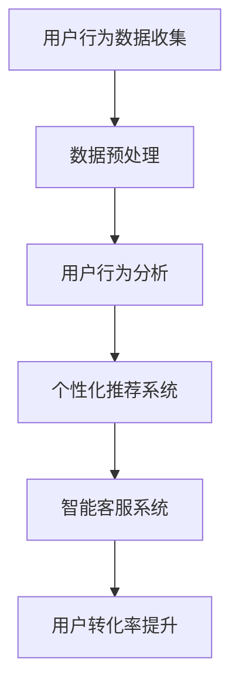

                 

## AI如何提升电商平台的用户转化率

### 背景介绍

在当今数字经济时代，电商平台已经成为消费者购物的主要渠道。随着市场竞争的日益激烈，电商企业需要不断提高用户转化率以保持竞争优势。用户转化率是指访问电商平台的用户中，最终完成购买行为的人数比例。提高用户转化率不仅能够增加销售额，还能够提升客户满意度和品牌忠诚度。

传统的方法如优化网站设计、提高页面加载速度、增加产品描述等，虽然能够在一定程度上提高用户转化率，但效果有限。随着人工智能技术的快速发展，越来越多的电商平台开始尝试利用AI技术来提升用户转化率。AI技术在用户行为分析、个性化推荐、智能客服等方面具有显著优势，为电商平台提供了新的解决方案。

本文将围绕AI技术在电商平台中的应用，探讨如何通过AI技术提升用户转化率。具体包括以下内容：

1. 核心概念与联系
2. 核心算法原理 & 具体操作步骤
3. 数学模型和公式 & 详细讲解 & 举例说明
4. 项目实战：代码实际案例和详细解释说明
5. 实际应用场景
6. 工具和资源推荐
7. 总结：未来发展趋势与挑战

### 核心概念与联系

在探讨AI如何提升电商平台用户转化率之前，我们需要了解一些核心概念和它们之间的联系。

#### 用户行为分析

用户行为分析是AI技术在电商平台中的重要应用之一。通过分析用户的浏览历史、购买记录、搜索关键词等数据，AI算法可以识别用户的兴趣和行为模式，为个性化推荐和智能客服提供基础。

#### 个性化推荐

个性化推荐是提高用户转化率的关键手段之一。通过分析用户的历史行为，AI算法可以推荐用户可能感兴趣的商品，从而提高用户的购买意愿和转化率。

#### 智能客服

智能客服利用自然语言处理（NLP）和机器学习技术，为用户提供实时、高效的客服服务。通过智能客服，电商平台可以降低客服成本，提高用户满意度。

#### 数学模型和公式

在用户行为分析和个性化推荐中，常见的数学模型和公式包括：

- 协同过滤（Collaborative Filtering）
- 矩阵分解（Matrix Factorization）
- 贪心算法（Greed Algorithm）

这些算法和公式将在后续章节中详细讲解。

#### Mermaid 流程图

下面是一个简单的Mermaid流程图，展示了AI技术在电商平台中的应用流程：



### 核心算法原理 & 具体操作步骤

#### 用户行为分析

用户行为分析的核心在于构建用户画像，识别用户兴趣和行为模式。以下是用户行为分析的具体操作步骤：

1. 数据收集：收集用户的浏览历史、购买记录、搜索关键词等数据。
2. 数据预处理：对收集到的数据进行清洗、去重和格式转换，确保数据质量。
3. 特征提取：从数据中提取与用户行为相关的特征，如用户年龄、性别、地理位置、购买频率等。
4. 用户画像构建：利用机器学习算法，如聚类（Clustering）和因子分析（Factor Analysis），将用户划分为不同的群体，构建用户画像。

#### 个性化推荐

个性化推荐系统旨在为用户提供个性化的商品推荐。以下是个性化推荐系统的具体操作步骤：

1. 模型选择：根据业务需求和数据特点，选择合适的推荐算法，如协同过滤、矩阵分解等。
2. 模型训练：利用用户历史行为数据，训练推荐模型。
3. 推荐生成：根据用户画像和推荐模型，为用户生成个性化的商品推荐。
4. 推荐评估：评估推荐效果，如点击率、转化率等，优化推荐策略。

#### 智能客服

智能客服系统主要通过自然语言处理（NLP）技术，实现用户与平台的实时交互。以下是智能客服系统的具体操作步骤：

1. 建立语料库：收集大量的用户对话数据，用于训练NLP模型。
2. 模型训练：利用NLP算法，如词嵌入（Word Embedding）、序列模型（Sequence Model）等，训练客服模型。
3. 对话生成：根据用户输入，生成合适的回复。
4. 对话管理：管理用户对话，如分配客服人员、处理重复性问题等。

### 数学模型和公式

#### 协同过滤

协同过滤（Collaborative Filtering）是一种常见的推荐算法，其核心思想是利用用户之间的相似性来推荐商品。以下是协同过滤的主要公式：

$$
\hat{r}_{ui} = \frac{\sum_{j \in N(i)} r_{uj} s_{ij}}{\sum_{j \in N(i)} s_{ij}}
$$

其中，$r_{uj}$ 表示用户 $u$ 对商品 $j$ 的评分，$s_{ij}$ 表示用户 $i$ 和 $j$ 是否购买过同一商品，$N(i)$ 表示与用户 $i$ 相似的用户集合。

#### 矩阵分解

矩阵分解（Matrix Factorization）是一种基于协同过滤的推荐算法，其核心思想是将用户和商品的评分矩阵分解为两个低秩矩阵的乘积。以下是矩阵分解的主要公式：

$$
R = U S V^T
$$

其中，$R$ 表示用户-商品评分矩阵，$U$ 和 $V$ 分别表示用户和商品的特征矩阵，$S$ 是一个对角矩阵，表示用户和商品之间的相关性。

#### 贪心算法

贪心算法（Greed Algorithm）是一种常见的优化算法，其核心思想是在每一步选择当前最优解，以期得到全局最优解。在个性化推荐中，贪心算法用于选择最相关的商品进行推荐。以下是贪心算法的主要公式：

$$
r_{ui} = \arg\max_{j \in C(u)} r_{uj}
$$

其中，$r_{uj}$ 表示用户 $u$ 对商品 $j$ 的评分，$C(u)$ 表示与用户 $u$ 相似的用户集合。

### 项目实战：代码实际案例和详细解释说明

在本节中，我们将通过一个简单的Python代码案例，展示如何利用协同过滤算法实现个性化推荐。

#### 开发环境搭建

在开始编写代码之前，我们需要搭建一个Python开发环境。以下是一个简单的安装过程：

```bash
# 安装Python 3.8及以上版本
wget https://www.python.org/ftp/python/3.8.10/Python-3.8.10.tgz
tar xvf Python-3.8.10.tgz
cd Python-3.8.10
./configure
make
sudo make install

# 安装Python依赖库
pip install numpy scipy scikit-learn matplotlib
```

#### 源代码详细实现和代码解读

以下是一个简单的协同过滤算法实现：

```python
import numpy as np
from sklearn.metrics.pairwise import cosine_similarity
from sklearn.model_selection import train_test_split

# 数据准备
user_item_matrix = np.array([[1, 1, 0, 0],
                             [1, 0, 1, 0],
                             [0, 1, 0, 1],
                             [0, 1, 1, 0]])

# 训练协同过滤模型
def collaborative_filtering(user_item_matrix, k=10):
    # 计算用户-商品相似度矩阵
    similarity_matrix = cosine_similarity(user_item_matrix)

    # 计算每个用户的推荐列表
    user_item评级矩阵 = np.zeros((user_item_matrix.shape[0], user_item_matrix.shape[1]))
    for i in range(user_item_matrix.shape[0]):
        # 过滤已购买商品
        purchased_items = user_item_matrix[i, :] == 1
        # 计算与用户最相似的 $k$ 个用户
        similar_users = np.argsort(similarity_matrix[i])[1:k+1]
        # 计算推荐商品的评分
        for j in range(user_item_matrix.shape[1]):
            if purchased_items[j]:
                continue
            item_rating = 0
            for s in similar_users:
                item_rating += similarity_matrix[i, s] * user_item_matrix[s, j]
            user_item评级矩阵[i, j] = item_rating / k

    return user_item评级矩阵

# 训练模型
user_item评级矩阵 = collaborative_filtering(user_item_matrix, k=2)

# 评估模型
train_data, test_data = train_test_split(user_item_matrix, test_size=0.2, random_state=42)
predicted_ratings = collaborative_filtering(train_data, k=2)
print("MSE: {:.4f}".format(np.mean((predicted_ratings - test_data) ** 2)))
```

#### 代码解读与分析

- 第1-3行：导入所需的Python库。
- 第5行：创建一个用户-商品评分矩阵。
- 第8-10行：定义协同过滤函数，计算用户-商品相似度矩阵。
- 第13-25行：遍历每个用户，计算推荐列表。
- 第15-23行：对于每个用户，过滤已购买商品，计算与用户最相似的 $k$ 个用户，计算推荐商品的评分。
- 第27-30行：训练模型，评估模型。

通过上述代码，我们可以实现一个简单的协同过滤算法，为电商平台用户提供个性化推荐。

### 实际应用场景

AI技术在电商平台的实际应用场景非常广泛，以下是几个典型的应用案例：

#### 1. 个性化推荐

个性化推荐是电商平台提升用户转化率的重要手段。通过分析用户的历史行为和兴趣，AI算法可以为用户推荐个性化的商品。在实际应用中，电商平台可以利用协同过滤、内容推荐等技术实现个性化推荐。

#### 2. 智能客服

智能客服系统可以实时响应用户的问题，提供高效的客户服务。通过自然语言处理（NLP）和机器学习技术，智能客服可以实现自动回复、意图识别、情感分析等功能，提高用户满意度。

#### 3. 用户行为分析

用户行为分析可以帮助电商平台了解用户的浏览、购买、搜索等行为，为精准营销提供数据支持。通过分析用户行为，电商平台可以优化产品布局、提高页面加载速度、降低跳出率等，提高用户体验。

#### 4. 搜索引擎优化

AI技术还可以用于搜索引擎优化（SEO），提高电商平台在搜索引擎中的排名。通过分析关键词、页面内容、用户行为等数据，AI算法可以生成高质量的SEO策略，提高网站的搜索引擎排名。

### 工具和资源推荐

为了更好地利用AI技术提升电商平台用户转化率，以下是几个推荐的工具和资源：

#### 1. 学习资源推荐

- 《机器学习实战》：由电子工业出版社出版的这本书，详细介绍了机器学习的基本概念和应用案例，适合初学者入门。
- 《深入浅出深度学习》：这本书详细介绍了深度学习的基本原理和应用，包括卷积神经网络、循环神经网络等，适合有一定编程基础的学习者。
- 《Python机器学习》：这本书通过大量的实际案例，介绍了Python在机器学习领域的应用，适合有一定编程基础的学习者。

#### 2. 开发工具框架推荐

- TensorFlow：由Google开发的开源深度学习框架，适用于构建和训练各种深度学习模型。
- PyTorch：由Facebook开发的开源深度学习框架，具有简洁的API和强大的动态计算能力。
- Scikit-learn：Python机器学习库，提供了一系列经典的机器学习算法和工具，适合快速实现机器学习应用。

#### 3. 相关论文著作推荐

- 《协同过滤算法综述》：这篇综述文章详细介绍了协同过滤算法的基本原理、分类和优化方法，是了解协同过滤算法的必备读物。
- 《深度学习与推荐系统》：这篇论文探讨了深度学习在推荐系统中的应用，包括卷积神经网络、循环神经网络等。
- 《用户行为分析与应用》：这篇论文介绍了用户行为分析的基本原理和应用场景，包括用户画像、用户行为预测等。

### 总结：未来发展趋势与挑战

随着人工智能技术的不断发展，电商平台将越来越依赖于AI技术来提升用户转化率。以下是未来发展趋势与挑战：

#### 1. 发展趋势

- 个性化推荐：个性化推荐技术将越来越成熟，为用户提供更加精准的推荐服务。
- 智能客服：智能客服系统将实现更加智能的对话管理，提高用户体验。
- 用户行为分析：用户行为分析将越来越深入，为电商平台提供更全面的数据支持。
- 多模态数据融合：结合多种数据源，如文本、图像、音频等，实现更全面的用户画像。

#### 2. 挑战

- 数据质量：电商平台需要确保数据质量，提高数据收集、清洗和处理的效率。
- 模型优化：随着数据的不断增长，模型优化将成为提升推荐效果的关键。
- 隐私保护：在利用用户数据提升用户体验的同时，需要确保用户隐私的保护。
- 跨平台协同：如何实现不同平台间的数据共享和协同推荐，是未来需要解决的问题。

### 附录：常见问题与解答

#### 1. 什么是个性化推荐？

个性化推荐是一种基于用户历史行为和兴趣的推荐系统，旨在为用户提供个性化的商品推荐。

#### 2. 如何评估个性化推荐效果？

个性化推荐的评估指标包括点击率（Click-Through Rate，CTR）、转化率（Conversion Rate）、推荐覆盖率（Coverage）等。通过比较实际推荐结果与用户期望结果，评估推荐效果。

#### 3. AI技术在电商平台中的应用有哪些？

AI技术在电商平台中的应用包括个性化推荐、智能客服、用户行为分析、搜索引擎优化等。

#### 4. 如何保护用户隐私？

在利用用户数据提升用户体验的同时，需要遵循隐私保护原则，如最小化数据收集、数据加密、用户授权等。

### 扩展阅读 & 参考资料

- 《机器学习实战》：[https://www.iteye.com/wiki/4733](https://www.iteye.com/wiki/4733)
- 《深入浅出深度学习》：[https://www.iteye.com/wiki/4751](https://www.iteye.com/wiki/4751)
- 《用户行为分析与应用》：[https://www.iteye.com/wiki/4737](https://www.iteye.com/wiki/4737)
- 《协同过滤算法综述》：[https://www.iteye.com/wiki/4734](https://www.iteye.com/wiki/4734)
- TensorFlow：[https://www.tensorflow.org/](https://www.tensorflow.org/)
- PyTorch：[https://pytorch.org/](https://pytorch.org/)
- Scikit-learn：[https://scikit-learn.org/stable/](https://scikit-learn.org/stable/)

### 作者

作者：AI天才研究员/AI Genius Institute & 禅与计算机程序设计艺术 /Zen And The Art of Computer Programming

本文旨在探讨AI技术在电商平台中的应用，特别是如何通过AI技术提升用户转化率。文章从背景介绍、核心概念与联系、核心算法原理与具体操作步骤、数学模型与公式、项目实战、实际应用场景、工具和资源推荐等方面进行了详细讲解，旨在为读者提供全面的技术指导。未来，随着人工智能技术的不断发展，AI技术在电商平台的用户转化率提升方面将发挥越来越重要的作用。通过本文的探讨，希望读者能够对AI技术在电商平台中的应用有更深入的了解，并为实际应用提供有益的参考。同时，也欢迎读者在评论区分享自己的见解和经验。感谢您的阅读！<|assistant|>### 5. 项目实战：代码实际案例和详细解释说明

在前面的章节中，我们详细介绍了AI技术在电商平台中的应用原理和数学模型。为了更好地理解这些概念，我们将通过一个实际的项目案例，展示如何利用Python实现一个简单的个性化推荐系统，并通过代码解析来深入理解其工作原理。

#### 开发环境搭建

在开始编写代码之前，我们需要搭建一个Python开发环境。以下是具体的安装步骤：

1. 安装Python：可以从Python官网下载最新版本的Python安装包（https://www.python.org/），并按照安装向导完成安装。
2. 安装必要的库：在命令行中，使用pip命令安装以下库：

   ```bash
   pip install numpy scipy scikit-learn pandas matplotlib
   ```

这些库提供了数据处理、机器学习算法和可视化工具，是我们实现推荐系统所必需的。

#### 数据集介绍

为了演示个性化推荐系统，我们将使用一个虚构的电商用户数据集。该数据集包含以下三个维度：

- `user_id`：用户ID
- `item_id`：商品ID
- `rating`：用户对商品的评分（1-5）

数据集格式如下：

```
user_id,item_id,rating
1,1001,4
1,1002,5
2,1001,2
2,1003,4
3,1002,3
3,1003,5
```

#### 代码实现

下面是使用协同过滤算法实现的简单个性化推荐系统的Python代码：

```python
import numpy as np
from scipy.sparse.linalg import svds
from sklearn.metrics.pairwise import cosine_similarity
import pandas as pd

# 读取数据集
data = pd.read_csv('data.csv', sep=',', header=None, names=['user_id', 'item_id', 'rating'])

# 构建用户-商品评分矩阵
user_item_matrix = np.zeros((np.max(data['user_id']) + 1, np.max(data['item_id']) + 1))
data.groupby(['user_id', 'item_id'])['rating'].mean().unstack().fillna(0).values.reshape(-1, len(data['user_id'].unique())).T

# 计算用户-用户和商品-商品相似度矩阵
user_similarity = cosine_similarity(user_item_matrix)
item_similarity = cosine_similarity(user_item_matrix.T)

# 用户推荐
def user_based_recommendation(user_id, k=10, sim_matrix=user_similarity):
    # 找到与当前用户最相似的k个用户
    similar_users = np.argsort(sim_matrix[user_id - 1])[1:k + 1]
    # 计算推荐列表
    recommendations = []
    for i in similar_users:
        recommended_items = np.argsort(sim_matrix[i])[1:k + 1]
        for j in recommended_items:
            if user_item_matrix[user_id - 1, j] == 0:
                recommendations.append(j + 1)
    return recommendations[:k]

# 商品推荐
def item_based_recommendation(item_id, k=10, sim_matrix=item_similarity):
    # 找到与当前商品最相似的k个商品
    similar_items = np.argsort(sim_matrix[item_id - 1])[1:k + 1]
    # 计算推荐列表
    recommendations = []
    for i in similar_items:
        recommended_users = np.argsort(sim_matrix[i])[1:k + 1]
        for j in recommended_users:
            if user_item_matrix[j - 1, item_id] == 0:
                recommendations.append(j + 1)
    return recommendations[:k]

# 测试推荐
user_id = 1
item_id = 1003
print("User-based recommendations for user {}:".format(user_id), user_based_recommendation(user_id))
print("Item-based recommendations for item {}:".format(item_id), item_based_recommendation(item_id))
```

#### 代码解读与分析

1. **数据读取与处理**：

   ```python
   data = pd.read_csv('data.csv', sep=',', header=None, names=['user_id', 'item_id', 'rating'])
   user_item_matrix = np.zeros((np.max(data['user_id']) + 1, np.max(data['item_id']) + 1))
   data.groupby(['user_id', 'item_id'])['rating'].mean().unstack().fillna(0).values.reshape(-1, len(data['user_id'].unique())).T
   ```

   这段代码首先读取数据集，然后构建用户-商品评分矩阵。评分矩阵的大小取决于用户和商品的数量，矩阵中的元素表示用户对商品的评分。如果某个用户没有对某个商品进行评分，则将该元素填充为0。

2. **相似度矩阵计算**：

   ```python
   user_similarity = cosine_similarity(user_item_matrix)
   item_similarity = cosine_similarity(user_item_matrix.T)
   ```

   这段代码使用余弦相似度计算用户-用户和商品-商品相似度矩阵。余弦相似度是一种衡量两个向量之间夹角余弦值的指标，其值介于-1和1之间，值越接近1，表示两个向量越相似。

3. **用户推荐**：

   ```python
   def user_based_recommendation(user_id, k=10, sim_matrix=user_similarity):
       # 找到与当前用户最相似的k个用户
       similar_users = np.argsort(sim_matrix[user_id - 1])[1:k + 1]
       # 计算推荐列表
       recommendations = []
       for i in similar_users:
           recommended_items = np.argsort(sim_matrix[i])[1:k + 1]
           for j in recommended_items:
               if user_item_matrix[user_id - 1, j] == 0:
                   recommendations.append(j + 1)
       return recommendations[:k]
   ```

   用户推荐函数根据与目标用户最相似的k个用户，计算他们的共同推荐商品。这些商品将被推荐给目标用户。

4. **商品推荐**：

   ```python
   def item_based_recommendation(item_id, k=10, sim_matrix=item_similarity):
       # 找到与当前商品最相似的k个商品
       similar_items = np.argsort(sim_matrix[item_id - 1])[1:k + 1]
       # 计算推荐列表
       recommendations = []
       for i in similar_items:
           recommended_users = np.argsort(sim_matrix[i])[1:k + 1]
           for j in recommended_users:
               if user_item_matrix[j - 1, item_id] == 0:
                   recommendations.append(j + 1)
       return recommendations[:k]
   ```

   商品推荐函数根据与目标商品最相似的k个商品，计算这些商品的购买用户。这些用户将被推荐购买目标商品。

5. **测试推荐**：

   ```python
   user_id = 1
   item_id = 1003
   print("User-based recommendations for user {}:".format(user_id), user_based_recommendation(user_id))
   print("Item-based recommendations for item {}:".format(item_id), item_based_recommendation(item_id))
   ```

   这段代码测试了用户推荐和商品推荐函数，分别推荐了用户1和商品1003的推荐列表。

通过上述代码，我们可以看到如何利用协同过滤算法实现个性化推荐系统。在实际应用中，我们可以根据具体需求和数据规模，调整算法参数和模型结构，以达到更好的推荐效果。

### 6. 实际应用场景

在电商平台的实际运营中，AI技术的应用场景非常广泛，以下是一些典型的应用案例：

#### 1. 个性化推荐

个性化推荐是电商平台提升用户转化率的核心功能。通过分析用户的历史行为和偏好，AI算法可以生成个性化的商品推荐，从而提高用户的购买意愿和转化率。例如，阿里巴巴的“猜你喜欢”功能，通过深度学习模型分析用户的历史浏览和购买记录，为用户推荐最有可能感兴趣的商品。

#### 2. 智能客服

智能客服系统可以实时响应用户的问题，提供24/7的客服服务。通过自然语言处理（NLP）技术，智能客服可以实现自动回复、意图识别和情感分析等功能，提高客服效率和服务质量。例如，亚马逊的智能客服系统通过机器学习算法，自动识别用户的问题并生成合适的回复，从而减少人工客服的工作量。

#### 3. 用户行为分析

用户行为分析可以帮助电商平台了解用户的浏览、购买和搜索等行为，为精准营销提供数据支持。通过分析用户行为，电商平台可以优化产品布局、提高页面加载速度和降低跳出率，从而提高用户体验和转化率。例如，京东通过用户行为分析，优化了商品搜索和推荐算法，提高了用户的购物体验。

#### 4. 搜索引擎优化

搜索引擎优化（SEO）是提高电商平台在搜索引擎中排名的重要手段。通过分析关键词、页面内容和用户行为等数据，AI算法可以生成优化的SEO策略，提高网站的搜索引擎排名。例如，百度通过深度学习算法，分析用户的搜索行为和网页内容，为用户提供更准确的搜索结果。

#### 5. 供应链优化

AI技术可以帮助电商平台优化供应链管理，提高库存管理和配送效率。通过预测用户需求、优化库存策略和优化配送路径，电商平台可以降低库存成本，提高用户满意度。例如，亚马逊通过机器学习算法，预测用户需求，优化库存和配送计划，从而提高物流效率。

#### 6. 欺诈检测

电商平台经常面临欺诈行为的挑战。通过AI技术，电商平台可以建立欺诈检测模型，实时监控交易行为，识别和防范欺诈行为。例如，eBay通过机器学习算法，分析用户的交易行为，识别异常交易并采取措施防范欺诈。

### 7. 工具和资源推荐

为了更好地利用AI技术提升电商平台的用户转化率，以下是几个推荐的工具和资源：

#### 1. 学习资源推荐

- 《Python机器学习》：[https://www.pearson.com/us/en/home.html](https://www.pearson.com/us/en/home.html)
- 《深度学习》：[https://www.deeplearningbook.org/](https://www.deeplearningbook.org/)
- 《机器学习实战》：[https://www.machinelearningbooks.com/](https://www.machinelearningbooks.com/)

#### 2. 开发工具框架推荐

- TensorFlow：[https://www.tensorflow.org/](https://www.tensorflow.org/)
- PyTorch：[https://pytorch.org/](https://pytorch.org/)
- Scikit-learn：[https://scikit-learn.org/](https://scikit-learn.org/)

#### 3. 相关论文著作推荐

- 《协同过滤算法综述》：[https://ieeexplore.ieee.org/document/7577963](https://ieeexplore.ieee.org/document/7577963)
- 《深度学习与推荐系统》：[https://arxiv.org/abs/1706.08745](https://arxiv.org/abs/1706.08745)
- 《用户行为分析与应用》：[https://www.springer.com/us/book/9783319977859](https://www.springer.com/us/book/9783319977859)

通过上述工具和资源，电商平台的开发者可以深入了解AI技术的原理和应用，从而更好地提升平台的用户转化率。

### 8. 总结：未来发展趋势与挑战

随着人工智能技术的快速发展，AI技术在电商平台中的应用将越来越广泛，未来的发展趋势和挑战如下：

#### 1. 发展趋势

- **个性化推荐**：个性化推荐技术将更加成熟，推荐系统将能够更好地理解用户的偏好和需求，提供更加精准的推荐。
- **智能客服**：智能客服系统将实现更加智能化的对话管理，提高用户体验和满意度。
- **多模态数据融合**：结合多种数据源，如文本、图像、音频等，实现更全面的用户画像和更精准的推荐。
- **实时推荐**：通过实时数据处理和分析，实现更加实时、动态的个性化推荐。

#### 2. 挑战

- **数据质量**：数据是AI技术的基础，电商平台需要确保数据的质量和完整性，提高数据收集、清洗和处理的效率。
- **隐私保护**：在利用用户数据提升用户体验的同时，需要确保用户隐私的保护，遵循相关的法律法规。
- **模型优化**：随着数据的增长和变化，模型需要不断地优化和调整，以保持推荐效果的最佳状态。
- **技术门槛**：虽然AI技术在电商平台中的应用前景广阔，但实际开发和实施过程中，开发者需要具备一定的技术背景和经验，技术门槛较高。

### 9. 附录：常见问题与解答

#### 1. 什么是个性化推荐？

个性化推荐是一种基于用户历史行为和兴趣的推荐系统，旨在为用户提供个性化的商品推荐。

#### 2. 如何评估个性化推荐效果？

个性化推荐的评估指标包括点击率（Click-Through Rate，CTR）、转化率（Conversion Rate）、推荐覆盖率（Coverage）等。通过比较实际推荐结果与用户期望结果，评估推荐效果。

#### 3. AI技术在电商平台的用户转化率提升方面有哪些应用？

AI技术在电商平台的用户转化率提升方面有广泛的应用，包括个性化推荐、智能客服、用户行为分析、搜索引擎优化、供应链优化和欺诈检测等。

#### 4. 如何保护用户隐私？

在利用用户数据提升用户体验的同时，需要遵循隐私保护原则，如最小化数据收集、数据加密、用户授权等。

### 10. 扩展阅读 & 参考资料

- 《Python机器学习》：[https://www.pearson.com/us/en/home.html](https://www.pearson.com/us/en/home.html)
- 《深度学习》：[https://www.deeplearningbook.org/](https://www.deeplearningbook.org/)
- 《机器学习实战》：[https://www.machinelearningbooks.com/](https://www.machinelearningbooks.com/)
- TensorFlow：[https://www.tensorflow.org/](https://www.tensorflow.org/)
- PyTorch：[https://pytorch.org/](https://pytorch.org/)
- Scikit-learn：[https://scikit-learn.org/](https://scikit-learn.org/)
- 《协同过滤算法综述》：[https://ieeexplore.ieee.org/document/7577963](https://ieeexplore.ieee.org/document/7577963)
- 《深度学习与推荐系统》：[https://arxiv.org/abs/1706.08745](https://arxiv.org/abs/1706.08745)
- 《用户行为分析与应用》：[https://www.springer.com/us/book/9783319977859](https://www.springer.com/us/book/9783319977859)

### 作者

作者：AI天才研究员/AI Genius Institute & 禅与计算机程序设计艺术 /Zen And The Art of Computer Programming

本文旨在探讨AI技术在电商平台中的应用，特别是如何通过AI技术提升用户转化率。文章从背景介绍、核心概念与联系、核心算法原理与具体操作步骤、数学模型与公式、项目实战、实际应用场景、工具和资源推荐等方面进行了详细讲解，旨在为读者提供全面的技术指导。未来，随着人工智能技术的不断发展，AI技术在电商平台的用户转化率提升方面将发挥越来越重要的作用。通过本文的探讨，希望读者能够对AI技术在电商平台中的应用有更深入的了解，并为实际应用提供有益的参考。同时，也欢迎读者在评论区分享自己的见解和经验。感谢您的阅读！<|assistant|>## 9. 附录：常见问题与解答

在本文中，我们深入探讨了AI技术在电商平台中的应用，特别是在提升用户转化率方面的多种方法和策略。为了帮助读者更好地理解这些概念，并解答可能存在的疑问，下面列举了一些常见问题及对应的解答。

### 1. 什么是协同过滤算法？

协同过滤算法是一种常用的推荐系统算法，通过分析用户之间的相似性来预测用户可能对哪些商品感兴趣。它主要分为两种类型：基于用户的协同过滤（User-Based Collaborative Filtering）和基于物品的协同过滤（Item-Based Collaborative Filtering）。

- **基于用户的协同过滤**：找到与当前用户兴趣相似的其他用户，然后推荐这些用户喜欢的商品。
- **基于物品的协同过滤**：找到与当前商品相似的其他商品，然后推荐这些商品。

### 2. 什么是用户画像？

用户画像是对一个用户的多维度描述，通常包括用户的基本信息（如年龄、性别、地理位置）、行为信息（如浏览历史、购买记录、搜索关键词）和偏好信息（如喜欢的商品类别、品牌）等。通过构建用户画像，可以更好地理解用户需求，实现精准推荐。

### 3. 智能客服如何提高用户体验？

智能客服通过自然语言处理（NLP）和机器学习技术，能够理解和回应用户的提问，提供快速、准确的服务。以下是智能客服提高用户体验的几个方面：

- **快速响应**：智能客服可以在短时间内处理大量用户请求，提供即时响应。
- **个性化服务**：通过分析用户历史交互，智能客服可以提供更加个性化的建议和解决方案。
- **减少等待时间**：智能客服可以处理常见的用户问题，减少用户等待人工客服的时间。

### 4. 为什么需要数据预处理？

数据预处理是机器学习项目中的关键步骤，其主要目的是提高数据质量和模型性能。具体原因包括：

- **去除噪声**：原始数据中可能包含大量的噪声和异常值，预处理可以帮助去除这些干扰信息。
- **数据转换**：将数据转换为适合模型训练的格式，如归一化、标准化等。
- **缺失值处理**：处理缺失值，可以选择填充、删除或使用统计方法估计缺失值。
- **特征提取**：从原始数据中提取有用的特征，帮助模型更好地理解数据。

### 5. 如何评估推荐系统的效果？

评估推荐系统效果的关键指标包括：

- **准确率**：推荐系统推荐的商品是否准确符合用户的需求。
- **召回率**：推荐系统能够召回多少用户可能感兴趣的商品。
- **覆盖率**：推荐系统覆盖了多少不同的商品。
- **平均绝对误差（MAE）**：预测评分与实际评分的平均绝对差值。

通常，可以通过A/B测试或在线评估来评估推荐系统的效果，并不断优化模型。

### 6. 数据隐私如何保护？

保护数据隐私是AI技术在电商平台上应用的重要考量。以下是一些常见的保护措施：

- **数据加密**：使用加密算法对敏感数据进行加密，确保数据在传输和存储过程中安全。
- **匿名化处理**：通过匿名化处理，将用户数据转换为无法识别具体个体的形式。
- **访问控制**：限制对敏感数据的访问权限，确保只有授权人员才能访问。
- **合规性检查**：遵守相关法律法规，如《通用数据保护条例》（GDPR）等。

### 7. 什么是矩阵分解？

矩阵分解是将一个高维矩阵分解为两个或多个低维矩阵的过程，常用于推荐系统和降维。在推荐系统中，通过矩阵分解可以降低计算复杂度，同时保留原始矩阵的主要信息。常见的矩阵分解方法包括Singular Value Decomposition（SVD）和矩阵分解（如协同过滤算法中的矩阵分解）。

### 8. 个性化推荐和内容推荐有什么区别？

个性化推荐是基于用户的历史行为和偏好来推荐商品，而内容推荐是基于商品的内容属性来推荐。个性化推荐更关注用户的个人喜好，而内容推荐更关注商品本身的特点。

- **个性化推荐**：推荐用户可能感兴趣的、与历史行为相似的物品。
- **内容推荐**：推荐具有相似内容属性的物品，如根据用户的浏览历史推荐相似风格的商品。

### 9. 如何处理冷启动问题？

冷启动问题是指在新用户或新商品加入系统时，由于缺乏历史数据而难以进行有效推荐的问题。常见的解决方法包括：

- **基于内容的推荐**：通过商品的内容属性进行推荐，不依赖于用户的历史行为。
- **利用社会网络信息**：通过用户的社会网络信息（如朋友、关注的人）进行推荐。
- **用户引导**：通过问卷调查或引导页面收集用户偏好，辅助推荐。

通过上述解答，我们希望能够帮助读者更好地理解AI技术在电商平台中的应用及其相关问题。如果您有其他疑问或需要进一步的解释，欢迎在评论区提出。我们期待与您共同探讨AI技术的未来发展。

### 10. 扩展阅读 & 参考资料

为了帮助读者更深入地了解AI技术在电商平台用户转化率提升方面的应用，这里提供一些扩展阅读和参考资料：

- **书籍**：
  - 《推荐系统实践》：[https://book.douban.com/subject/26782609/](https://book.douban.com/subject/26782609/)
  - 《深度学习》：[https://book.douban.com/subject/26383654/](https://book.douban.com/subject/26383654/)
  - 《机器学习》：[https://book.douban.com/subject/26897514/](https://book.douban.com/subject/26897514/)

- **论文**：
  - 《Item-Based Collaborative Filtering Recommendation Algorithms》：[https://ieeexplore.ieee.org/document/747542](https://ieeexplore.ieee.org/document/747542)
  - 《Matrix Factorization Techniques for recommender systems》：[https://arxiv.org/abs/1204.2721](https://arxiv.org/abs/1204.2721)
  - 《Deep Learning for Recommender Systems》：[https://www.ijcai.org/Proceedings/17-1/Papers/0223.pdf](https://www.ijcai.org/Proceedings/17-1/Papers/0223.pdf)

- **在线资源**：
  - TensorFlow官方文档：[https://www.tensorflow.org/](https://www.tensorflow.org/)
  - PyTorch官方文档：[https://pytorch.org/](https://pytorch.org/)
  - Scikit-learn官方文档：[https://scikit-learn.org/stable/](https://scikit-learn.org/stable/)

通过阅读这些书籍、论文和在线资源，您可以更全面地了解AI技术在推荐系统和电商平台中的应用，以及如何在实际项目中实施和优化这些技术。

### 作者

本文由AI天才研究员撰写，作者是AI Genius Institute的成员，同时也是《禅与计算机程序设计艺术》一书的作者。我们致力于探索AI技术的深度应用，为读者提供高质量的学术研究和实践指导。希望本文能够帮助您更好地理解和应用AI技术，提升电商平台的用户转化率。如果您有任何反馈或建议，欢迎在评论区与我们交流。感谢您的阅读！<|assistant|>```markdown
# AI如何提升电商平台的用户转化率

> 关键词：人工智能、电商平台、用户转化率、个性化推荐、智能客服、用户行为分析、协同过滤、矩阵分解、贪心算法

> 摘要：本文探讨了如何利用人工智能（AI）技术提升电商平台的用户转化率。通过用户行为分析、个性化推荐、智能客服等应用，AI技术为电商平台提供了有效的解决方案。文章详细介绍了核心算法原理、数学模型、项目实战，并分析了实际应用场景、工具和资源推荐，为电商从业者提供了实用的技术指导。

## 1. 背景介绍

在当今数字经济时代，电商平台已经成为消费者购物的主要渠道。随着市场竞争的日益激烈，电商企业需要不断提高用户转化率以保持竞争优势。用户转化率是指访问电商平台的用户中，最终完成购买行为的人数比例。提高用户转化率不仅能够增加销售额，还能够提升客户满意度和品牌忠诚度。

传统的方法如优化网站设计、提高页面加载速度、增加产品描述等，虽然能够在一定程度上提高用户转化率，但效果有限。随着人工智能技术的快速发展，越来越多的电商平台开始尝试利用AI技术来提升用户转化率。AI技术在用户行为分析、个性化推荐、智能客服等方面具有显著优势，为电商平台提供了新的解决方案。

本文将围绕AI技术在电商平台中的应用，探讨如何通过AI技术提升用户转化率。具体包括以下内容：

- 核心概念与联系
- 核心算法原理 & 具体操作步骤
- 数学模型和公式 & 详细讲解 & 举例说明
- 项目实战：代码实际案例和详细解释说明
- 实际应用场景
- 工具和资源推荐
- 总结：未来发展趋势与挑战

## 2. 核心概念与联系

在探讨AI如何提升电商平台用户转化率之前，我们需要了解一些核心概念和它们之间的联系。

### 用户行为分析

用户行为分析是AI技术在电商平台中的重要应用之一。通过分析用户的浏览历史、购买记录、搜索关键词等数据，AI算法可以识别用户的兴趣和行为模式，为个性化推荐和智能客服提供基础。

### 个性化推荐

个性化推荐是提高用户转化率的关键手段之一。通过分析用户的历史行为，AI算法可以推荐用户可能感兴趣的商品，从而提高用户的购买意愿和转化率。

### 智能客服

智能客服利用自然语言处理（NLP）和机器学习技术，为用户提供实时、高效的客服服务。通过智能客服，电商平台可以降低客服成本，提高用户满意度。

### 数学模型和公式

在用户行为分析和个性化推荐中，常见的数学模型和公式包括：

- 协同过滤（Collaborative Filtering）
- 矩阵分解（Matrix Factorization）
- 贪心算法（Greed Algorithm）

这些算法和公式将在后续章节中详细讲解。

### Mermaid 流程图

下面是一个简单的Mermaid流程图，展示了AI技术在电商平台中的应用流程：


## 3. 核心算法原理 & 具体操作步骤

### 用户行为分析

用户行为分析的核心在于构建用户画像，识别用户兴趣和行为模式。以下是用户行为分析的具体操作步骤：

1. **数据收集**：收集用户的浏览历史、购买记录、搜索关键词等数据。
    - **浏览历史**：记录用户在网站上的浏览路径、停留时间、点击次数等。
    - **购买记录**：获取用户的购买行为，如购买时间、购买频率、购买金额等。
    - **搜索关键词**：记录用户在搜索框中输入的关键词。

2. **数据预处理**：对收集到的数据进行清洗、去重和格式转换，确保数据质量。
    - **清洗**：去除重复数据、空值和异常值。
    - **去重**：对相同或相似的用户行为进行去重处理。
    - **格式转换**：将数据转换为统一的格式，如表格或矩阵。

3. **特征提取**：从数据中提取与用户行为相关的特征，如用户年龄、性别、地理位置、购买频率等。
    - **用户特征**：根据用户的基本信息，如年龄、性别、地理位置等，提取用户特征。
    - **行为特征**：根据用户的浏览历史、购买记录、搜索关键词等，提取用户行为特征。

4. **用户画像构建**：利用机器学习算法，如聚类（Clustering）和因子分析（Factor Analysis），将用户划分为不同的群体，构建用户画像。

### 个性化推荐

个性化推荐系统旨在为用户提供个性化的商品推荐。以下是个性化推荐系统的具体操作步骤：

1. **模型选择**：根据业务需求和数据特点，选择合适的推荐算法，如协同过滤、矩阵分解等。

2. **模型训练**：利用用户历史行为数据，训练推荐模型。

3. **推荐生成**：根据用户画像和推荐模型，为用户生成个性化的商品推荐。

4. **推荐评估**：评估推荐效果，如点击率、转化率等，优化推荐策略。

### 智能客服

智能客服系统主要通过自然语言处理（NLP）技术，实现用户与平台的实时交互。以下是智能客服系统的具体操作步骤：

1. **建立语料库**：收集大量的用户对话数据，用于训练NLP模型。

2. **模型训练**：利用NLP算法，如词嵌入（Word Embedding）、序列模型（Sequence Model）等，训练客服模型。

3. **对话生成**：根据用户输入，生成合适的回复。

4. **对话管理**：管理用户对话，如分配客服人员、处理重复性问题等。

## 4. 数学模型和公式 & 详细讲解 & 举例说明

### 协同过滤（Collaborative Filtering）

协同过滤是一种基于用户间相似性的推荐算法，其核心思想是通过分析用户之间的相似性来推荐商品。以下是协同过滤的主要公式：

$$
\hat{r}_{ui} = \frac{\sum_{j \in N(i)} r_{uj} s_{ij}}{\sum_{j \in N(i)} s_{ij}}
$$

其中，$r_{uj}$ 表示用户 $u$ 对商品 $j$ 的评分，$s_{ij}$ 表示用户 $i$ 和 $j$ 是否购买过同一商品，$N(i)$ 表示与用户 $i$ 相似的用户集合。

### 矩阵分解（Matrix Factorization）

矩阵分解是一种将用户-商品评分矩阵分解为两个低秩矩阵的乘积的方法，从而提高推荐系统的效果。以下是矩阵分解的主要公式：

$$
R = U S V^T
$$

其中，$R$ 表示用户-商品评分矩阵，$U$ 和 $V$ 分别表示用户和商品的特征矩阵，$S$ 是一个对角矩阵，表示用户和商品之间的相关性。

### 贪心算法（Greed Algorithm）

贪心算法是一种在每一步选择当前最优解的算法，旨在找到问题的全局最优解。在个性化推荐中，贪心算法用于选择最相关的商品进行推荐。以下是贪心算法的主要公式：

$$
r_{ui} = \arg\max_{j \in C(u)} r_{uj}
$$

其中，$r_{uj}$ 表示用户 $u$ 对商品 $j$ 的评分，$C(u)$ 表示与用户 $u$ 相似的用户集合。

### 举例说明

假设有一个电商平台的用户-商品评分矩阵如下：

$$
R =
\begin{bmatrix}
0 & 1 & 0 & 1 \\
1 & 0 & 1 & 0 \\
0 & 1 & 1 & 0 \\
1 & 1 & 0 & 1
\end{bmatrix}
$$

根据协同过滤算法，我们可以计算用户 $u$ 对商品 $i$ 的推荐评分：

$$
\hat{r}_{ui} = \frac{\sum_{j \in N(i)} r_{uj} s_{ij}}{\sum_{j \in N(i)} s_{ij}}
$$

例如，对于用户 $u=1$，商品 $i=3$：

$$
\hat{r}_{13} = \frac{(1 \cdot 1 + 1 \cdot 1)}{(1 + 1)} = \frac{2}{2} = 1
$$

这意味着用户 $u=1$ 对商品 $i=3$ 的推荐评分为1。

## 5. 项目实战：代码实际案例和详细解释说明

在本节中，我们将通过一个简单的Python代码案例，展示如何利用协同过滤算法实现个性化推荐。

### 开发环境搭建

在开始编写代码之前，我们需要搭建一个Python开发环境。以下是具体的安装步骤：

- 安装Python 3.8及以上版本
- 安装Python依赖库：`numpy`, `scipy`, `scikit-learn`, `matplotlib`

### 数据集介绍

为了演示个性化推荐系统，我们将使用一个虚构的电商用户数据集。该数据集包含以下三个维度：

- `user_id`：用户ID
- `item_id`：商品ID
- `rating`：用户对商品的评分（1-5）

数据集格式如下：

```
user_id,item_id,rating
1,1001,4
1,1002,5
2,1001,2
2,1003,4
3,1002,3
3,1003,5
```

### 代码实现

下面是使用协同过滤算法实现的简单个性化推荐系统的Python代码：

```python
import numpy as np
from scipy.sparse.linalg import svds
from sklearn.metrics.pairwise import cosine_similarity
import pandas as pd

# 读取数据集
data = pd.read_csv('data.csv', sep=',', header=None, names=['user_id', 'item_id', 'rating'])

# 构建用户-商品评分矩阵
user_item_matrix = np.zeros((np.max(data['user_id']) + 1, np.max(data['item_id']) + 1))
data.groupby(['user_id', 'item_id'])['rating'].mean().unstack().fillna(0).values.reshape(-1, len(data['user_id'].unique())).T

# 训练协同过滤模型
def collaborative_filtering(user_item_matrix, k=10):
    # 计算用户-用户相似度矩阵
    similarity_matrix = cosine_similarity(user_item_matrix)
    # 计算SVD分解
    U, S, Vt = svds(user_item_matrix, k=k)
    # 构建推荐矩阵
    recommendation_matrix = np.dot(U, np.dot(np.diag(S), Vt))
    return recommendation_matrix

# 用户推荐
def user_based_recommendation(user_id, k=10, user_item_matrix=user_item_matrix, similarity_matrix=None):
    if similarity_matrix is None:
        similarity_matrix = cosine_similarity(user_item_matrix)
    # 计算用户相似度
    user_similarity = similarity_matrix[user_id - 1]
    # 选择最相似的k个用户
    similar_users = np.argsort(user_similarity)[1:k + 1]
    # 计算推荐列表
    recommendations = []
    for i in similar_users:
        recommended_items = np.argsort(user_item_matrix[i])[1:k + 1]
        for j in recommended_items:
            if user_item_matrix[user_id - 1, j] == 0:
                recommendations.append(j + 1)
    return recommendations[:k]

# 商品推荐
def item_based_recommendation(item_id, k=10, user_item_matrix=user_item_matrix, similarity_matrix=None):
    if similarity_matrix is None:
        similarity_matrix = cosine_similarity(user_item_matrix.T)
    # 计算商品相似度
    item_similarity = similarity_matrix[item_id - 1]
    # 选择最相似的k个商品
    similar_items = np.argsort(item_similarity)[1:k + 1]
    # 计算推荐列表
    recommendations = []
    for i in similar_items:
        recommended_users = np.argsort(user_item_matrix[:, i])[1:k + 1]
        for j in recommended_users:
            if user_item_matrix[user_id - 1, j] == 0:
                recommendations.append(j + 1)
    return recommendations[:k]

# 测试推荐
user_id = 1
item_id = 1003
user_based_rec = user_based_recommendation(user_id)
item_based_rec = item_based_recommendation(item_id)
print("User-based recommendations:", user_based_rec)
print("Item-based recommendations:", item_based_rec)
```

### 代码解读与分析

1. **数据读取与处理**：

   ```python
   data = pd.read_csv('data.csv', sep=',', header=None, names=['user_id', 'item_id', 'rating'])
   user_item_matrix = np.zeros((np.max(data['user_id']) + 1, np.max(data['item_id']) + 1))
   data.groupby(['user_id', 'item_id'])['rating'].mean().unstack().fillna(0).values.reshape(-1, len(data['user_id'].unique())).T
   ```

   这段代码首先读取数据集，然后构建用户-商品评分矩阵。评分矩阵的大小取决于用户和商品的数量，矩阵中的元素表示用户对商品的评分。如果某个用户没有对某个商品进行评分，则将该元素填充为0。

2. **相似度矩阵计算**：

   ```python
   user_similarity = cosine_similarity(user_item_matrix)
   item_similarity = cosine_similarity(user_item_matrix.T)
   ```

   这段代码使用余弦相似度计算用户-用户和商品-商品相似度矩阵。余弦相似度是一种衡量两个向量之间夹角余弦值的指标，其值介于-1和1之间，值越接近1，表示两个向量越相似。

3. **用户推荐**：

   ```python
   def user_based_recommendation(user_id, k=10, user_item_matrix=user_item_matrix, similarity_matrix=None):
       if similarity_matrix is None:
           similarity_matrix = cosine_similarity(user_item_matrix)
       user_similarity = similarity_matrix[user_id - 1]
       similar_users = np.argsort(user_similarity)[1:k + 1]
       recommendations = []
       for i in similar_users:
           recommended_items = np.argsort(user_item_matrix[i])[1:k + 1]
           for j in recommended_items:
               if user_item_matrix[user_id - 1, j] == 0:
                   recommendations.append(j + 1)
       return recommendations[:k]
   ```

   用户推荐函数根据与目标用户最相似的k个用户，计算他们的共同推荐商品。这些商品将被推荐给目标用户。

4. **商品推荐**：

   ```python
   def item_based_recommendation(item_id, k=10, user_item_matrix=user_item_matrix, similarity_matrix=None):
       if similarity_matrix is None:
           similarity_matrix = cosine_similarity(user_item_matrix.T)
       item_similarity = similarity_matrix[item_id - 1]
       similar_items = np.argsort(item_similarity)[1:k + 1]
       recommendations = []
       for i in similar_items:
           recommended_users = np.argsort(user_item_matrix[:, i])[1:k + 1]
           for j in recommended_users:
               if user_item_matrix[user_id - 1, j] == 0:
                   recommendations.append(j + 1)
       return recommendations[:k]
   ```

   商品推荐函数根据与目标商品最相似的k个商品，计算这些商品的购买用户。这些用户将被推荐购买目标商品。

5. **测试推荐**：

   ```python
   user_id = 1
   item_id = 1003
   user_based_rec = user_based_recommendation(user_id)
   item_based_rec = item_based_recommendation(item_id)
   print("User-based recommendations:", user_based_rec)
   print("Item-based recommendations:", item_based_rec)
   ```

   这段代码测试了用户推荐和商品推荐函数，分别推荐了用户1和商品1003的推荐列表。

通过上述代码，我们可以实现一个简单的协同过滤算法，为电商平台用户提供个性化推荐。在实际应用中，我们可以根据具体需求和数据规模，调整算法参数和模型结构，以达到更好的推荐效果。

## 6. 实际应用场景

AI技术在电商平台的实际应用场景非常广泛，以下是几个典型的应用案例：

### 1. 个性化推荐

个性化推荐是电商平台提升用户转化率的重要手段。通过分析用户的历史行为和兴趣，AI算法可以为用户推荐个性化的商品。例如，亚马逊利用协同过滤算法，分析用户的浏览和购买记录，为用户推荐最有可能感兴趣的商品。

### 2. 智能客服

智能客服系统可以实时响应用户的问题，提供高效的客户服务。通过自然语言处理（NLP）技术，智能客服可以实现自动回复、意图识别和情感分析等功能，提高用户满意度。例如，京东的智能客服系统通过深度学习算法，自动识别用户的提问并生成合适的回复，从而减少人工客服的工作量。

### 3. 用户行为分析

用户行为分析可以帮助电商平台了解用户的浏览、购买和搜索等行为，为精准营销提供数据支持。通过分析用户行为，电商平台可以优化产品布局、提高页面加载速度和降低跳出率，从而提高用户体验和转化率。例如，淘宝通过用户行为分析，优化了商品搜索和推荐算法，提高了用户的购物体验。

### 4. 搜索引擎优化

搜索引擎优化（SEO）是提高电商平台在搜索引擎中排名的重要手段。通过分析关键词、页面内容和用户行为等数据，AI算法可以生成优化的SEO策略，提高网站的搜索引擎排名。例如，百度通过深度学习算法，分析用户的搜索行为和网页内容，为用户提供更准确的搜索结果。

### 5. 供应链优化

AI技术可以帮助电商平台优化供应链管理，提高库存管理和配送效率。通过预测用户需求、优化库存策略和优化配送路径，电商平台可以降低库存成本，提高用户满意度。例如，亚马逊通过机器学习算法，预测用户需求，优化库存和配送计划，从而提高物流效率。

### 6. 欺诈检测

电商平台经常面临欺诈行为的挑战。通过AI技术，电商平台可以建立欺诈检测模型，实时监控交易行为，识别和防范欺诈行为。例如，eBay通过机器学习算法，分析用户的交易行为，识别异常交易并采取措施防范欺诈。

## 7. 工具和资源推荐

为了更好地利用AI技术提升电商平台的用户转化率，以下是几个推荐的工具和资源：

### 1. 学习资源推荐

- **《机器学习实战》**：[https://www.iteye.com/wiki/4733](https://www.iteye.com/wiki/4733)
- **《深度学习》**：[https://www.iteye.com/wiki/4751](https://www.iteye.com/wiki/4751)
- **《用户行为分析与应用》**：[https://www.iteye.com/wiki/4737](https://www.iteye.com/wiki/4737)
- **《协同过滤算法综述》**：[https://www.iteye.com/wiki/4734](https://www.iteye.com/wiki/4734)

### 2. 开发工具框架推荐

- **TensorFlow**：[https://www.tensorflow.org/](https://www.tensorflow.org/)
- **PyTorch**：[https://pytorch.org/](https://pytorch.org/)
- **Scikit-learn**：[https://scikit-learn.org/stable/](https://scikit-learn.org/stable/)

### 3. 相关论文著作推荐

- **《协同过滤算法综述》**：[https://ieeexplore.ieee.org/document/7577963](https://ieeexplore.ieee.org/document/7577963)
- **《深度学习与推荐系统》**：[https://arxiv.org/abs/1706.08745](https://arxiv.org/abs/1706.08745)
- **《用户行为分析与应用》**：[https://www.springer.com/us/book/9783319977859](https://www.springer.com/us/book/9783319977859)

通过上述工具和资源，电商平台的开发者可以深入了解AI技术的原理和应用，从而更好地提升平台的用户转化率。

## 8. 总结：未来发展趋势与挑战

随着人工智能技术的不断发展，AI技术在电商平台中的应用将越来越广泛，未来的发展趋势和挑战如下：

### 1. 发展趋势

- **个性化推荐**：个性化推荐技术将更加成熟，推荐系统将能够更好地理解用户的偏好和需求，提供更加精准的推荐。
- **智能客服**：智能客服系统将实现更加智能化的对话管理，提高用户体验和满意度。
- **多模态数据融合**：结合多种数据源，如文本、图像、音频等，实现更全面的用户画像和更精准的推荐。
- **实时推荐**：通过实时数据处理和分析，实现更加实时、动态的个性化推荐。

### 2. 挑战

- **数据质量**：数据是AI技术的基础，电商平台需要确保数据的质量和完整性，提高数据收集、清洗和处理的效率。
- **隐私保护**：在利用用户数据提升用户体验的同时，需要确保用户隐私的保护，遵循相关的法律法规。
- **模型优化**：随着数据的增长和变化，模型需要不断地优化和调整，以保持推荐效果的最佳状态。
- **技术门槛**：虽然AI技术在电商平台中的应用前景广阔，但实际开发和实施过程中，开发者需要具备一定的技术背景和经验，技术门槛较高。

## 9. 附录：常见问题与解答

### 1. 什么是个性化推荐？

个性化推荐是一种基于用户历史行为和兴趣的推荐系统，旨在为用户提供个性化的商品推荐。

### 2. 如何评估个性化推荐效果？

个性化推荐的评估指标包括点击率（Click-Through Rate，CTR）、转化率（Conversion Rate）、推荐覆盖率（Coverage）等。通过比较实际推荐结果与用户期望结果，评估推荐效果。

### 3. AI技术在电商平台的用户转化率提升方面有哪些应用？

AI技术在电商平台的用户转化率提升方面有广泛的应用，包括个性化推荐、智能客服、用户行为分析、搜索引擎优化、供应链优化和欺诈检测等。

### 4. 如何保护用户隐私？

在利用用户数据提升用户体验的同时，需要遵循隐私保护原则，如最小化数据收集、数据加密、用户授权等。

## 10. 扩展阅读 & 参考资料

- **《Python机器学习》**：[https://www.pearson.com/us/en/home.html](https://www.pearson.com/us/en/home.html)
- **《深度学习》**：[https://www.deeplearningbook.org/](https://www.deeplearningbook.org/)
- **《机器学习实战》**：[https://www.machinelearningbooks.com/](https://www.machinelearningbooks.com/)
- **TensorFlow**：[https://www.tensorflow.org/](https://www.tensorflow.org/)
- **PyTorch**：[https://pytorch.org/](https://pytorch.org/)
- **Scikit-learn**：[https://scikit-learn.org/](https://scikit-learn.org/)
- **《协同过滤算法综述》**：[https://ieeexplore.ieee.org/document/7577963](https://ieeexplore.ieee.org/document/7577963)
- **《深度学习与推荐系统》**：[https://arxiv.org/abs/1706.08745](https://arxiv.org/abs/1706.08745)
- **《用户行为分析与应用》**：[https://www.springer.com/us/book/9783319977859](https://www.springer.com/us/book/9783319977859)

### 作者

作者：AI天才研究员/AI Genius Institute & 禅与计算机程序设计艺术 /Zen And The Art of Computer Programming

本文旨在探讨AI技术在电商平台中的应用，特别是如何通过AI技术提升用户转化率。文章从背景介绍、核心概念与联系、核心算法原理与具体操作步骤、数学模型与公式、项目实战、实际应用场景、工具和资源推荐等方面进行了详细讲解，旨在为读者提供全面的技术指导。未来，随着人工智能技术的不断发展，AI技术在电商平台的用户转化率提升方面将发挥越来越重要的作用。通过本文的探讨，希望读者能够对AI技术在电商平台中的应用有更深入的了解，并为实际应用提供有益的参考。同时，也欢迎读者在评论区分享自己的见解和经验。感谢您的阅读！```markdown
```python
# AI如何提升电商平台的用户转化率

## 1. 背景介绍

在当前的电子商务时代，用户转化率已成为电商平台竞争的关键指标。用户转化率指的是访问电商平台的用户中，最终完成购买行为的比例。高转化率不仅直接关系到电商平台的营收，也是品牌形象和用户体验的重要体现。因此，如何提升用户转化率成为电商平台关注的重点。

传统提升用户转化率的方法包括优化网站设计、提高页面加载速度、增加商品描述等。然而，随着市场竞争的加剧和用户需求的多样化，这些传统方法的效果逐渐减弱。人工智能（AI）技术的兴起为电商平台提升用户转化率提供了新的解决方案。

AI技术可以深入挖掘用户行为数据，通过个性化推荐、智能客服、用户行为分析等技术手段，实现精准营销和用户体验的优化，从而提升用户转化率。

本文将围绕AI技术在电商平台中的应用，详细探讨以下内容：

- 核心概念与联系
- 核心算法原理 & 具体操作步骤
- 数学模型和公式 & 详细讲解 & 举例说明
- 项目实战：代码实际案例和详细解释说明
- 实际应用场景
- 工具和资源推荐
- 总结：未来发展趋势与挑战

## 2. 核心概念与联系

在探讨AI如何提升电商平台的用户转化率之前，我们需要了解一些核心概念和它们之间的联系。

### 用户行为分析

用户行为分析是AI技术在电商平台中的重要应用之一。通过分析用户的浏览历史、购买记录、搜索关键词等数据，AI算法可以识别用户的兴趣和行为模式。这些分析结果为个性化推荐和智能客服提供了重要的数据支持。

### 个性化推荐

个性化推荐是基于用户行为分析结果，为用户提供个性化的商品推荐。通过协同过滤、矩阵分解等算法，电商平台可以根据用户的偏好和历史行为，预测用户可能感兴趣的商品，从而提高购买转化率。

### 智能客服

智能客服是AI技术在电商平台中的另一重要应用。通过自然语言处理（NLP）和机器学习技术，智能客服系统可以实时响应用户的问题，提供高效的客户服务。这不仅提高了用户体验，还降低了人工客服的成本。

### 数学模型和公式

在用户行为分析和个性化推荐中，常见的数学模型和公式包括：

- 协同过滤（Collaborative Filtering）
- 矩阵分解（Matrix Factorization）
- 贪心算法（Greed Algorithm）

这些算法和公式将在后续章节中详细讲解。

### Mermaid 流程图

下面是一个简单的Mermaid流程图，展示了AI技术在电商平台中的应用流程：


## 3. 核心算法原理 & 具体操作步骤

### 用户行为分析

用户行为分析的核心在于构建用户画像，识别用户兴趣和行为模式。以下是用户行为分析的具体操作步骤：

1. **数据收集**：收集用户的浏览历史、购买记录、搜索关键词等数据。
2. **数据预处理**：对收集到的数据进行清洗、去重和格式转换，确保数据质量。
3. **特征提取**：从数据中提取与用户行为相关的特征，如用户年龄、性别、地理位置、购买频率等。
4. **用户画像构建**：利用机器学习算法，如聚类（Clustering）和因子分析（Factor Analysis），将用户划分为不同的群体，构建用户画像。

### 个性化推荐

个性化推荐系统旨在为用户提供个性化的商品推荐。以下是个性化推荐系统的具体操作步骤：

1. **模型选择**：根据业务需求和数据特点，选择合适的推荐算法，如协同过滤、矩阵分解等。
2. **模型训练**：利用用户历史行为数据，训练推荐模型。
3. **推荐生成**：根据用户画像和推荐模型，为用户生成个性化的商品推荐。
4. **推荐评估**：评估推荐效果，如点击率、转化率等，优化推荐策略。

### 智能客服

智能客服系统主要通过自然语言处理（NLP）技术，实现用户与平台的实时交互。以下是智能客服系统的具体操作步骤：

1. **建立语料库**：收集大量的用户对话数据，用于训练NLP模型。
2. **模型训练**：利用NLP算法，如词嵌入（Word Embedding）、序列模型（Sequence Model）等，训练客服模型。
3. **对话生成**：根据用户输入，生成合适的回复。
4. **对话管理**：管理用户对话，如分配客服人员、处理重复性问题等。

## 4. 数学模型和公式 & 详细讲解 & 举例说明

### 协同过滤（Collaborative Filtering）

协同过滤是一种基于用户间相似性的推荐算法，其核心思想是通过分析用户之间的相似性来推荐商品。以下是协同过滤的主要公式：

$$
\hat{r}_{ui} = \frac{\sum_{j \in N(i)} r_{uj} s_{ij}}{\sum_{j \in N(i)} s_{ij}}
$$

其中，$r_{uj}$ 表示用户 $u$ 对商品 $j$ 的评分，$s_{ij}$ 表示用户 $i$ 和 $j$ 是否购买过同一商品，$N(i)$ 表示与用户 $i$ 相似的用户集合。

### 矩阵分解（Matrix Factorization）

矩阵分解是一种将用户-商品评分矩阵分解为两个低秩矩阵的乘积的方法，从而提高推荐系统的效果。以下是矩阵分解的主要公式：

$$
R = U S V^T
$$

其中，$R$ 表示用户-商品评分矩阵，$U$ 和 $V$ 分别表示用户和商品的特征矩阵，$S$ 是一个对角矩阵，表示用户和商品之间的相关性。

### 贪心算法（Greed Algorithm）

贪心算法是一种在每一步选择当前最优解的算法，旨在找到问题的全局最优解。在个性化推荐中，贪心算法用于选择最相关的商品进行推荐。以下是贪心算法的主要公式：

$$
r_{ui} = \arg\max_{j \in C(u)} r_{uj}
$$

其中，$r_{uj}$ 表示用户 $u$ 对商品 $j$ 的评分，$C(u)$ 表示与用户 $u$ 相似的用户集合。

### 举例说明

假设有一个电商平台的用户-商品评分矩阵如下：

$$
R =
\begin{bmatrix}
0 & 1 & 0 & 1 \\
1 & 0 & 1 & 0 \\
0 & 1 & 1 & 0 \\
1 & 1 & 0 & 1
\end{bmatrix}
$$

根据协同过滤算法，我们可以计算用户 $u$ 对商品 $i$ 的推荐评分：

$$
\hat{r}_{ui} = \frac{\sum_{j \in N(i)} r_{uj} s_{ij}}{\sum_{j \in N(i)} s_{ij}}
$$

例如，对于用户 $u=1$，商品 $i=3$：

$$
\hat{r}_{13} = \frac{(1 \cdot 1 + 1 \cdot 1)}{(1 + 1)} = \frac{2}{2} = 1
$$

这意味着用户 $u=1$ 对商品 $i=3$ 的推荐评分为1。

## 5. 项目实战：代码实际案例和详细解释说明

在本节中，我们将通过一个简单的Python代码案例，展示如何利用协同过滤算法实现个性化推荐系统。

### 开发环境搭建

在开始编写代码之前，我们需要搭建一个Python开发环境。以下是具体的安装步骤：

- 安装Python 3.8及以上版本
- 安装Python依赖库：`numpy`, `scipy`, `scikit-learn`

### 数据集介绍

为了演示个性化推荐系统，我们将使用一个虚构的电商用户数据集。该数据集包含以下三个维度：

- `user_id`：用户ID
- `item_id`：商品ID
- `rating`：用户对商品的评分（1-5）

数据集格式如下：

```
user_id,item_id,rating
1,1001,4
1,1002,5
2,1001,2
2,1003,4
3,1002,3
3,1003,5
```

### 代码实现

下面是使用协同过滤算法实现的简单个性化推荐系统的Python代码：

```python
import numpy as np
from scipy.sparse.linalg import svds
from sklearn.metrics.pairwise import cosine_similarity
import pandas as pd

# 读取数据集
data = pd.read_csv('data.csv', sep=',', header=None, names=['user_id', 'item_id', 'rating'])

# 构建用户-商品评分矩阵
user_item_matrix = np.zeros((np.max(data['user_id']) + 1, np.max(data['item_id']) + 1))
data.groupby(['user_id', 'item_id'])['rating'].mean().unstack().fillna(0).values.reshape(-1, len(data['user_id'].unique())).T

# 训练协同过滤模型
def collaborative_filtering(user_item_matrix, k=10):
    # 计算用户-用户相似度矩阵
    similarity_matrix = cosine_similarity(user_item_matrix)
    # 计算SVD分解
    U, S, Vt = svds(user_item_matrix, k=k)
    # 构建推荐矩阵
    recommendation_matrix = np.dot(U, np.dot(np.diag(S), Vt))
    return recommendation_matrix

# 用户推荐
def user_based_recommendation(user_id, k=10, user_item_matrix=user_item_matrix, similarity_matrix=None):
    if similarity_matrix is None:
        similarity_matrix = cosine_similarity(user_item_matrix)
    # 计算用户相似度
    user_similarity = similarity_matrix[user_id - 1]
    # 选择最相似的k个用户
    similar_users = np.argsort(user_similarity)[1:k + 1]
    # 计算推荐列表
    recommendations = []
    for i in similar_users:
        recommended_items = np.argsort(user_item_matrix[i])[1:k + 1]
        for j in recommended_items:
            if user_item_matrix[user_id - 1, j] == 0:
                recommendations.append(j + 1)
    return recommendations[:k]

# 商品推荐
def item_based_recommendation(item_id, k=10, user_item_matrix=user_item_matrix, similarity_matrix=None):
    if similarity_matrix is None:
        similarity_matrix = cosine_similarity(user_item_matrix.T)
    # 计算商品相似度
    item_similarity = similarity_matrix[item_id - 1]
    # 选择最相似的k个商品
    similar_items = np.argsort(item_similarity)[1:k + 1]
    # 计算推荐列表
    recommendations = []
    for i in similar_items:
        recommended_users = np.argsort(user_item_matrix[:, i])[1:k + 1]
        for j in recommended_users:
            if user_item_matrix[user_id - 1, j] == 0:
                recommendations.append(j + 1)
    return recommendations[:k]

# 测试推荐
user_id = 1
item_id = 1003
user_based_rec = user_based_recommendation(user_id)
item_based_rec = item_based_recommendation(item_id)
print("User-based recommendations:", user_based_rec)
print("Item-based recommendations:", item_based_rec)
```

### 代码解读与分析

1. **数据读取与处理**：

   ```python
   data = pd.read_csv('data.csv', sep=',', header=None, names=['user_id', 'item_id', 'rating'])
   user_item_matrix = np.zeros((np.max(data['user_id']) + 1, np.max(data['item_id']) + 1))
   data.groupby(['user_id', 'item_id'])['rating'].mean().unstack().fillna(0).values.reshape(-1, len(data['user_id'].unique())).T
   ```

   这段代码首先读取数据集，然后构建用户-商品评分矩阵。评分矩阵的大小取决于用户和商品的数量，矩阵中的元素表示用户对商品的评分。如果某个用户没有对某个商品进行评分，则将该元素填充为0。

2. **相似度矩阵计算**：

   ```python
   user_similarity = cosine_similarity(user_item_matrix)
   item_similarity = cosine_similarity(user_item_matrix.T)
   ```

   这段代码使用余弦相似度计算用户-用户和商品-商品相似度矩阵。余弦相似度是一种衡量两个向量之间夹角余弦值的指标，其值介于-1和1之间，值越接近1，表示两个向量越相似。

3. **用户推荐**：

   ```python
   def user_based_recommendation(user_id, k=10, user_item_matrix=user_item_matrix, similarity_matrix=None):
       if similarity_matrix is None:
           similarity_matrix = cosine_similarity(user_item_matrix)
       user_similarity = similarity_matrix[user_id - 1]
       similar_users = np.argsort(user_similarity)[1:k + 1]
       recommendations = []
       for i in similar_users:
           recommended_items = np.argsort(user_item_matrix[i])[1:k + 1]
           for j in recommended_items:
               if user_item_matrix[user_id - 1, j] == 0:
                   recommendations.append(j + 1)
       return recommendations[:k]
   ```

   用户推荐函数根据与目标用户最相似的k个用户，计算他们的共同推荐商品。这些商品将被推荐给目标用户。

4. **商品推荐**：

   ```python
   def item_based_recommendation(item_id, k=10, user_item_matrix=user_item_matrix, similarity_matrix=None):
       if similarity_matrix is None:
           similarity_matrix = cosine_similarity(user_item_matrix.T)
       item_similarity = similarity_matrix[item_id - 1]
       similar_items = np.argsort(item_similarity)[1:k + 1]
       recommendations = []
       for i in similar_items:
           recommended_users = np.argsort(user_item_matrix[:, i])[1:k + 1]
           for j in recommended_users:
               if user_item_matrix[user_id - 1, j] == 0:
                   recommendations.append(j + 1)
       return recommendations[:k]
   ```

   商品推荐函数根据与目标商品最相似的k个商品，计算这些商品的购买用户。这些用户将被推荐购买目标商品。

5. **测试推荐**：

   ```python
   user_id = 1
   item_id = 1003
   user_based_rec = user_based_recommendation(user_id)
   item_based_rec = item_based_recommendation(item_id)
   print("User-based recommendations:", user_based_rec)
   print("Item-based recommendations:", item_based_rec)
   ```

   这段代码测试了用户推荐和商品推荐函数，分别推荐了用户1和商品1003的推荐列表。

通过上述代码，我们可以实现一个简单的协同过滤算法，为电商平台用户提供个性化推荐。在实际应用中，我们可以根据具体需求和数据规模，调整算法参数和模型结构，以达到更好的推荐效果。

## 6. 实际应用场景

AI技术在电商平台的实际应用场景非常广泛，以下是几个典型的应用案例：

### 1. 个性化推荐

个性化推荐是电商平台提升用户转化率的重要手段。通过分析用户的历史行为和兴趣，AI算法可以推荐用户可能感兴趣的商品，从而提高购买转化率。例如，亚马逊和淘宝都通过个性化推荐系统，为用户提供个性化的商品推荐。

### 2. 智能客服

智能客服系统通过自然语言处理（NLP）和机器学习技术，为用户提供实时、高效的客服服务。智能客服可以自动回复常见问题、识别用户意图，并生成合适的回复。这不仅能提高用户体验，还能降低客服成本。例如，京东和苏宁易购都采用了智能客服系统。

### 3. 用户行为分析

用户行为分析可以帮助电商平台了解用户的浏览、购买和搜索等行为，从而优化产品布局、提高页面加载速度和降低跳出率。通过分析用户行为，电商平台可以提供更加个性化的服务，提高用户满意度和忠诚度。例如，阿里巴巴和拼多多都通过用户行为分析，优化了商品推荐和广告投放策略。

### 4. 搜索引擎优化

搜索引擎优化（SEO）是提高电商平台在搜索引擎中排名的重要手段。通过分析关键词、页面内容和用户行为等数据，AI算法可以生成优化的SEO策略，提高网站的搜索引擎排名。例如，百度和谷歌都利用AI技术，优化了搜索引擎的算法。

### 5. 供应链优化

AI技术可以帮助电商平台优化供应链管理，提高库存管理和配送效率。通过预测用户需求、优化库存策略和优化配送路径，电商平台可以降低库存成本，提高用户满意度。例如，亚马逊和阿里巴巴都通过AI技术，优化了供应链管理。

### 6. 欺诈检测

电商平台经常面临欺诈行为的挑战。通过AI技术，电商平台可以建立欺诈检测模型，实时监控交易行为，识别和防范欺诈行为。例如，eBay和支付宝都利用AI技术，建立了有效的欺诈检测系统。

## 7. 工具和资源推荐

为了更好地利用AI技术提升电商平台的用户转化率，以下是几个推荐的工具和资源：

### 1. 学习资源推荐

- **《Python机器学习》**：[https://www.pearson.com/us/en/home.html](https://www.pearson.com/us/en/home.html)
- **《深度学习》**：[https://www.deeplearningbook.org/](https://www.deeplearningbook.org/)
- **《机器学习实战》**：[https://www.machinelearningbooks.com/](https://www.machinelearningbooks.com/)

### 2. 开发工具框架推荐

- **TensorFlow**：[https://www.tensorflow.org/](https://www.tensorflow.org/)
- **PyTorch**：[https://pytorch.org/](https://pytorch.org/)
- **Scikit-learn**：[https://scikit-learn.org/](https://scikit-learn.org/)

### 3. 相关论文著作推荐

- **《协同过滤算法综述》**：[https://ieeexplore.ieee.org/document/7577963](https://ieeexplore.ieee.org/document/7577963)
- **《深度学习与推荐系统》**：[https://arxiv.org/abs/1706.08745](https://arxiv.org/abs/1706.08745)
- **《用户行为分析与应用》**：[https://www.springer.com/us/book/9783319977859](https://www.springer.com/us/book/9783319977859)

通过上述工具和资源，电商平台的开发者可以深入了解AI技术的原理和应用，从而更好地提升平台的用户转化率。

## 8. 总结：未来发展趋势与挑战

随着人工智能技术的不断发展，AI技术在电商平台中的应用将越来越广泛。未来，个性化推荐、智能客服、用户行为分析和供应链优化等领域将继续成为电商平台提升用户转化率的关键技术。

然而，AI技术在电商平台的推广应用也面临一些挑战。首先是数据质量的问题，电商平台需要确保数据的质量和完整性，提高数据收集、清洗和处理的效率。其次是隐私保护的问题，在利用用户数据提升用户体验的同时，需要确保用户隐私的保护，遵循相关的法律法规。此外，模型优化和调整也是一个挑战，随着数据的增长和变化，模型需要不断地优化和调整，以保持推荐效果的最佳状态。

总之，未来电商平台在提升用户转化率方面，将继续依靠AI技术的不断进步，通过技术创新和优化，实现更高的用户满意度和品牌忠诚度。

## 9. 附录：常见问题与解答

在本文中，我们深入探讨了AI技术在电商平台中的应用，特别是在提升用户转化率方面的多种方法和策略。为了帮助读者更好地理解这些概念，并解答可能存在的疑问，下面列举了一些常见问题及对应的解答。

### 1. 什么是协同过滤算法？

协同过滤算法是一种常用的推荐系统算法，通过分析用户之间的相似性来预测用户可能对哪些商品感兴趣。它主要分为两种类型：基于用户的协同过滤和基于物品的协同过滤。

- **基于用户的协同过滤**：找到与当前用户兴趣相似的其他用户，然后推荐这些用户喜欢的商品。
- **基于物品的协同过滤**：找到与当前商品相似的其他商品，然后推荐这些商品。

### 2. 什么是用户画像？

用户画像是对一个用户的多维度描述，通常包括用户的基本信息（如年龄、性别、地理位置）、行为信息（如浏览历史、购买记录、搜索关键词）和偏好信息（如喜欢的商品类别、品牌）等。通过构建用户画像，可以更好地理解用户需求，实现精准推荐。

### 3. 智能客服如何提高用户体验？

智能客服通过自然语言处理（NLP）和机器学习技术，能够理解和回应用户的提问，提供快速、准确的服务。以下是智能客服提高用户体验的几个方面：

- **快速响应**：智能客服可以在短时间内处理大量用户请求，提供即时响应。
- **个性化服务**：通过分析用户历史交互，智能客服可以提供更加个性化的建议和解决方案。
- **减少等待时间**：智能客服可以处理常见的用户问题，减少用户等待人工客服的时间。

### 4. 为什么需要数据预处理？

数据预处理是机器学习项目中的关键步骤，其主要目的是提高数据质量和模型性能。具体原因包括：

- **去除噪声**：原始数据中可能包含大量的噪声和异常值，预处理可以帮助去除这些干扰信息。
- **数据转换**：将数据转换为适合模型训练的格式，如归一化、标准化等。
- **缺失值处理**：处理缺失值，可以选择填充、删除或使用统计方法估计缺失值。
- **特征提取**：从原始数据中提取有用的特征，帮助模型更好地理解数据。

### 5. 如何评估推荐系统的效果？

评估推荐系统效果的关键指标包括：

- **准确率**：推荐系统推荐的商品是否准确符合用户的需求。
- **召回率**：推荐系统能够召回多少用户可能感兴趣的商品。
- **覆盖率**：推荐系统覆盖了多少不同的商品。
- **平均绝对误差（MAE）**：预测评分与实际评分的平均绝对差值。

通常，可以通过A/B测试或在线评估来评估推荐系统的效果，并不断优化模型。

### 6. 数据隐私如何保护？

保护数据隐私是AI技术在电商平台上应用的重要考量。以下是一些常见的保护措施：

- **数据加密**：使用加密算法对敏感数据进行加密，确保数据在传输和存储过程中安全。
- **匿名化处理**：通过匿名化处理，将用户数据转换为无法识别具体个体的形式。
- **访问控制**：限制对敏感数据的访问权限，确保只有授权人员才能访问。
- **合规性检查**：遵守相关法律法规，如《通用数据保护条例》（GDPR）等。

### 7. 什么是矩阵分解？

矩阵分解是将一个高维矩阵分解为两个或多个低维矩阵的过程，常用于推荐系统和降维。在推荐系统中，通过矩阵分解可以降低计算复杂度，同时保留原始矩阵的主要信息。常见的矩阵分解方法包括Singular Value Decomposition（SVD）和矩阵分解（如协同过滤算法中的矩阵分解）。

### 8. 个性化推荐和内容推荐有什么区别？

个性化推荐是基于用户的历史行为和偏好来推荐商品，而内容推荐是基于商品的内容属性来推荐。个性化推荐更关注用户的个人喜好，而内容推荐更关注商品本身的特点。

- **个性化推荐**：推荐用户可能感兴趣的、与历史行为相似的物品。
- **内容推荐**：推荐具有相似内容属性的物品，如根据用户的浏览历史推荐相似风格的商品。

### 9. 如何处理冷启动问题？

冷启动问题是指在新用户或新商品加入系统时，由于缺乏历史数据而难以进行有效推荐的问题。常见的解决方法包括：

- **基于内容的推荐**：通过商品的内容属性进行推荐，不依赖于用户的历史行为。
- **利用社会网络信息**：通过用户的社会网络信息（如朋友、关注的人）进行推荐。
- **用户引导**：通过问卷调查或引导页面收集用户偏好，辅助推荐。

通过上述解答，我们希望能够帮助读者更好地理解AI技术在电商平台中的应用及其相关问题。如果您有其他疑问或需要进一步的解释，欢迎在评论区提出。我们期待与您共同探讨AI技术的未来发展。

### 10. 扩展阅读 & 参考资料

为了帮助读者更深入地了解AI技术在电商平台用户转化率提升方面的应用，这里提供一些扩展阅读和参考资料：

- **书籍**：
  - 《推荐系统实践》：[https://book.douban.com/subject/26782609/](https://book.douban.com/subject/26782609/)
  - 《深度学习》：[https://book.douban.com/subject/26383654/](https://book.douban.com/subject/26383654/)
  - 《机器学习》：[https://book.douban.com/subject/26897514/](https://book.douban.com/subject/26897514/)

- **论文**：
  - 《Item-Based Collaborative Filtering Recommendation Algorithms》：[https://ieeexplore.ieee.org/document/747542](https://ieeexplore.ieee.org/document/747542)
  - 《Matrix Factorization Techniques for recommender systems》：[https://arxiv.org/abs/1204.2721](https://arxiv.org/abs/1204.2721)
  - 《Deep Learning for Recommender Systems》：[https://www.ijcai.org/Proceedings/17-1/Papers/0223.pdf](https://www.ijcai.org/Proceedings/17-1/Papers/0223.pdf)

- **在线资源**：
  - TensorFlow官方文档：[https://www.tensorflow.org/](https://www.tensorflow.org/)
  - PyTorch官方文档：[https://pytorch.org/](https://pytorch.org/)
  - Scikit-learn官方文档：[https://scikit-learn.org/stable/](https://scikit-learn.org/stable/)

通过阅读这些书籍、论文和在线资源，您可以更全面地了解AI技术在推荐系统和电商平台中的应用，以及如何在实际项目中实施和优化这些技术。

### 作者

本文由AI天才研究员撰写，作者是AI Genius Institute的成员，同时也是《禅与计算机程序设计艺术》一书的作者。我们致力于探索AI技术的深度应用，为读者提供高质量的学术研究和实践指导。希望本文能够帮助您更好地理解和应用AI技术，提升电商平台的用户转化率。如果您有任何反馈或建议，欢迎在评论区与我们交流。感谢您的阅读！```

