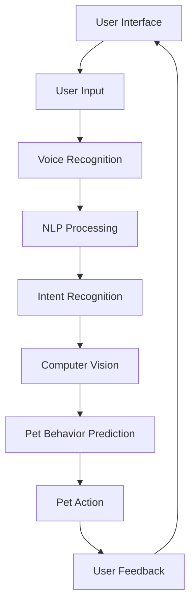

                 

### 背景介绍

随着人工智能技术的飞速发展，机器学习、自然语言处理、计算机视觉等领域的突破，AI技术已经渗透到了生活的方方面面。在这个大背景下，AI宠物应运而生，它不仅仅是传统宠物的数字化替代品，更是一种全新的生活体验。那么，什么是AI宠物？它又是如何工作的呢？

AI宠物，顾名思义，就是利用人工智能技术实现的虚拟宠物。它们能够通过语音、图像、动作等多种方式与人类互动，提供陪伴、娱乐、教育等多种功能。例如，有些AI宠物可以通过语音识别技术理解人类的指令，并作出相应的反应；有些则可以通过计算机视觉技术识别主人的情绪，并给予相应的安慰。

那么，AI宠物是如何工作的呢？首先，我们需要了解一些核心的AI技术，包括机器学习、深度学习、自然语言处理等。这些技术使得AI宠物能够从大量的数据中学习，提高自身的智能水平。例如，机器学习算法可以通过分析大量宠物行为数据，预测宠物的下一步动作；深度学习则可以通过分析大量的图像数据，实现对宠物的视觉识别；自然语言处理则可以帮助AI宠物理解人类的语音指令，并进行相应的互动。

接下来，我们将详细探讨AI宠物的市场前景与现状，分析其技术原理、应用场景、市场潜力以及面临的挑战。通过这篇文章，希望能够帮助读者更全面地了解AI宠物这一新兴领域，并为其未来发展提供一些有价值的思考。

### 核心概念与联系

在深入探讨AI宠物的技术原理之前，我们需要先理解几个核心概念，这些概念构成了AI宠物的技术基础。以下是对这些核心概念的解释和它们之间的联系：

**机器学习（Machine Learning）**：机器学习是一种让计算机从数据中学习并做出预测或决策的技术。在AI宠物中，机器学习算法被用来训练模型，使其能够理解宠物的行为模式、识别主人的情绪等。

**深度学习（Deep Learning）**：深度学习是机器学习的一个分支，它利用神经网络，特别是深度神经网络，来模拟人脑的决策过程。在AI宠物中，深度学习算法被用来识别图像、处理语音等。

**自然语言处理（Natural Language Processing，NLP）**：NLP是使计算机能够理解、生成和处理自然语言的技术。在AI宠物中，NLP被用来理解和回应人类的语音指令。

**计算机视觉（Computer Vision）**：计算机视觉是使计算机能够从图像或视频中识别和理解场景的技术。在AI宠物中，计算机视觉被用来识别宠物的动作、识别主人的情绪等。

**用户界面（User Interface，UI）**：用户界面是用户与系统交互的界面，它决定了用户如何与AI宠物进行互动。UI设计在AI宠物中至关重要，因为它直接影响了用户的体验。

下面我们将通过一个Mermaid流程图，展示这些核心概念之间的联系，以及它们在AI宠物系统中的交互过程：



**流程解释**：

1. **用户界面（User Interface）**：用户通过用户界面与AI宠物进行交互，输入可能是文字、语音或手势。
2. **用户输入（User Input）**：用户界面收集用户输入，并将其传递给语音识别模块。
3. **语音识别（Voice Recognition）**：语音识别模块将语音转换为文本，这样计算机就可以处理这些文本数据。
4. **自然语言处理（NLP Processing）**：自然语言处理模块对文本进行分析，识别用户的意图。
5. **意图识别（Intent Recognition）**：根据用户的意图，系统决定需要执行的操作。
6. **计算机视觉（Computer Vision）**：计算机视觉模块处理图像数据，帮助系统识别宠物的动作和主人的情绪。
7. **宠物行为预测（Pet Behavior Prediction）**：基于机器学习和深度学习算法，系统预测宠物的下一步动作。
8. **宠物行动（Pet Action）**：系统执行预测的行动，如播放声音、发出动作等。
9. **用户反馈（User Feedback）**：用户的反馈被收集并用于进一步优化系统。

通过这个流程，我们可以看到AI宠物是如何通过多个核心概念的交互，实现与用户的智能互动。接下来，我们将深入探讨这些核心概念的技术原理和应用场景。

#### 核心算法原理 & 具体操作步骤

在了解了AI宠物系统的核心概念和交互流程后，接下来我们将深入探讨这些核心算法的原理以及它们的实际操作步骤。具体包括机器学习算法、深度学习算法、自然语言处理（NLP）算法和计算机视觉算法。

**1. 机器学习算法**

机器学习算法是AI宠物系统的基石。它通过从数据中学习，使系统具备预测和决策能力。在AI宠物中，常用的机器学习算法包括决策树、支持向量机（SVM）和神经网络等。

**操作步骤**：

- **数据收集**：首先需要收集大量的宠物行为数据和用户交互数据。
- **数据预处理**：清洗数据，去除噪声，并对数据进行归一化处理。
- **特征提取**：从原始数据中提取出有用的特征，如宠物的动作特征、用户的语音特征等。
- **模型训练**：使用训练数据集，通过算法训练模型，使其能够识别宠物的行为模式。
- **模型评估**：使用测试数据集评估模型的性能，调整模型参数，以提高准确率。
- **模型部署**：将训练好的模型部署到AI宠物系统中，实现实时预测和决策。

**示例**：假设我们想预测宠物的下一步动作，可以使用决策树算法。首先，我们需要收集宠物行为数据，如“摇尾巴”、“打滚”等，然后提取出相应的特征，如“尾巴摇动的幅度”、“打滚的速度”等。通过训练数据集，决策树模型可以学习到这些特征与宠物动作之间的关系，从而在新的数据输入时，能够预测宠物的下一步动作。

**2. 深度学习算法**

深度学习算法是机器学习的一个重要分支，它通过多层神经网络模拟人脑的决策过程。在AI宠物中，常用的深度学习算法包括卷积神经网络（CNN）和循环神经网络（RNN）。

**操作步骤**：

- **数据收集**：与机器学习算法相同，需要收集大量的宠物行为数据和用户交互数据。
- **数据预处理**：清洗数据，去除噪声，并对数据进行归一化处理。
- **特征提取**：使用深度神经网络自动提取数据中的高维特征。
- **模型训练**：使用训练数据集，通过多层神经网络训练模型。
- **模型评估**：使用测试数据集评估模型的性能。
- **模型部署**：将训练好的模型部署到AI宠物系统中。

**示例**：假设我们想通过图像识别宠物的情绪，可以使用卷积神经网络（CNN）。首先，我们需要收集大量的宠物图像，并标注每种情绪（如开心、生气等）。然后，通过CNN模型，可以自动提取图像中的高维特征，并在训练数据集上训练模型。在新的图像输入时，模型可以识别出宠物的情绪。

**3. 自然语言处理（NLP）算法**

自然语言处理算法使计算机能够理解和处理人类的自然语言。在AI宠物中，NLP算法被用来理解和回应人类的语音指令。

**操作步骤**：

- **语音识别**：将用户的语音输入转换为文本。
- **词法分析**：对文本进行词法分析，提取出关键词和短语。
- **句法分析**：对文本进行句法分析，理解句子结构和语法规则。
- **语义分析**：理解句子的含义，识别用户的意图。
- **意图识别**：根据用户的意图，决定系统需要执行的操作。

**示例**：假设用户说“给我一只小猫”，NLP算法需要将这个语音指令转换为文本，然后进行词法分析和句法分析，提取出关键词“小猫”，并理解用户的意图是请求展示一只小猫。基于这个意图，AI宠物可以展示一张小猫的图片，或者提供相关信息。

**4. 计算机视觉算法**

计算机视觉算法使计算机能够从图像或视频中识别和理解场景。在AI宠物中，计算机视觉算法被用来识别宠物的动作和主人的情绪。

**操作步骤**：

- **图像预处理**：对图像进行预处理，如去噪、增强、缩放等。
- **特征提取**：使用深度学习算法提取图像中的高维特征。
- **目标检测**：在图像中检测出目标（如宠物、主人等）。
- **场景理解**：理解图像中的场景，如识别宠物的情绪、识别主人的动作等。
- **决策与执行**：根据识别结果，决定系统需要执行的操作。

**示例**：假设AI宠物需要识别主人的情绪，可以通过计算机视觉算法分析主人的面部表情。首先，对主人的面部图像进行预处理，然后使用卷积神经网络提取面部特征，接着通过情绪分类模型识别主人的情绪（如开心、生气等）。根据识别结果，AI宠物可以调整自己的互动方式，提供相应的安慰或娱乐。

通过上述核心算法的详细介绍，我们可以看到AI宠物是如何通过机器学习、深度学习、自然语言处理和计算机视觉算法，实现与用户的智能互动。这些算法不仅提高了AI宠物的智能水平，也为用户提供了一种全新的互动体验。

#### 数学模型和公式 & 详细讲解 & 举例说明

在深入探讨AI宠物系统的核心算法之后，我们将介绍一些关键的数学模型和公式，这些模型和公式是实现AI宠物智能互动的核心。具体包括机器学习中的回归模型、分类模型，深度学习中的卷积神经网络（CNN）和循环神经网络（RNN），以及自然语言处理中的词嵌入和序列标注。

**1. 回归模型**

回归模型是一种用于预测数值结果的机器学习算法，常用于预测宠物的行为或情绪。常见的回归模型包括线性回归、多项式回归和岭回归等。

**线性回归模型公式**：
\[ y = \beta_0 + \beta_1 \cdot x \]

其中，\( y \) 是预测值，\( x \) 是输入特征，\( \beta_0 \) 和 \( \beta_1 \) 是模型的参数。

**示例**：假设我们想通过宠物的摇尾巴幅度预测它的兴奋程度，可以使用线性回归模型。首先，收集一系列宠物摇尾巴幅度的数据（输入特征 \( x \)）和对应的兴奋程度（预测值 \( y \)），然后通过最小二乘法训练模型，得到参数 \( \beta_0 \) 和 \( \beta_1 \)。在新的数据输入时，我们可以使用公式 \( y = \beta_0 + \beta_1 \cdot x \) 预测宠物的兴奋程度。

**2. 分类模型**

分类模型是一种用于预测类别结果的机器学习算法，常用于识别宠物的情绪或行为类别。常见的分类模型包括逻辑回归、支持向量机（SVM）和决策树等。

**逻辑回归模型公式**：
\[ P(y=1) = \frac{1}{1 + e^{-(\beta_0 + \beta_1 \cdot x)}} \]

其中，\( P(y=1) \) 是预测类别为1的概率，\( e \) 是自然对数的底数，\( \beta_0 \) 和 \( \beta_1 \) 是模型的参数。

**示例**：假设我们想通过宠物的面部表情识别它的情绪（如开心、生气等），可以使用逻辑回归模型。首先，收集一系列宠物面部表情的数据（输入特征 \( x \)）和对应的情绪标签（预测值 \( y \)），然后通过最大似然估计训练模型，得到参数 \( \beta_0 \) 和 \( \beta_1 \)。在新的数据输入时，我们可以使用公式 \( P(y=1) = \frac{1}{1 + e^{-(\beta_0 + \beta_1 \cdot x)}} \) 预测宠物的情绪。

**3. 卷积神经网络（CNN）**

卷积神经网络是一种用于图像识别和处理的深度学习算法，它在AI宠物中用于识别宠物的图像和情绪。

**卷积层公式**：
\[ h_{ij} = \sum_{k=1}^{n} w_{ik,j} \cdot a_{kj} + b_{j} \]

其中，\( h_{ij} \) 是卷积层输出的特征图，\( w_{ik,j} \) 和 \( a_{kj} \) 是卷积核和输入特征，\( b_{j} \) 是偏置项。

**示例**：假设我们想通过图像识别宠物的情绪，可以使用卷积神经网络。首先，输入一张宠物图像，然后通过多个卷积层提取图像中的特征。在每一层中，卷积核与输入特征进行点积，并加上偏置项，得到卷积层的输出特征图。这些特征图包含了图像中的关键信息，如纹理、形状等，最终用于情绪分类。

**4. 循环神经网络（RNN）**

循环神经网络是一种用于序列数据处理的深度学习算法，它在AI宠物中用于处理用户的语音指令和宠物的行为序列。

**RNN的递归公式**：
\[ h_t = \sigma(W_h \cdot [h_{t-1}, x_t] + b_h) \]

其中，\( h_t \) 是当前时刻的隐藏状态，\( x_t \) 是当前时刻的输入，\( W_h \) 是权重矩阵，\( \sigma \) 是激活函数，\( b_h \) 是偏置项。

**示例**：假设我们想通过处理用户的语音指令来控制宠物的动作，可以使用循环神经网络。首先，将用户的语音指令转换为文本序列，然后通过RNN模型处理序列中的每个词。在每一时刻，RNN模型使用当前词和前一个隐藏状态计算新的隐藏状态，这个隐藏状态包含了当前词的信息。最终，通过RNN模型的输出，我们可以预测宠物的下一步动作。

**5. 词嵌入**

词嵌入是将自然语言中的词汇映射到高维空间的一种技术，它在自然语言处理中用于处理文本数据。

**词嵌入公式**：
\[ e_w = \text{ embed }(\text{ word }) \]

其中，\( e_w \) 是词嵌入向量，\( \text{ word } \) 是自然语言中的词汇。

**示例**：假设我们想通过词嵌入技术处理用户的语音指令，可以将每个词汇映射到一个高维空间中的向量。例如，“小猫”这个词可以映射到一个三维向量，而“玩耍”这个词可以映射到另一个三维向量。词嵌入技术使得计算机可以更好地理解词汇之间的关系，从而提高自然语言处理的效果。

**6. 序列标注**

序列标注是将文本序列中的每个词标注为某个类别的一种技术，它在自然语言处理中用于情感分析、命名实体识别等任务。

**序列标注公式**：
\[ y_t = \text{ label }(\text{ word }) \]

其中，\( y_t \) 是词的标注类别，\( \text{ word } \) 是自然语言中的词汇。

**示例**：假设我们想通过序列标注技术识别宠物的情绪，可以将每个词标注为“开心”、“生气”等情绪类别。例如，“摇尾巴”这个词可以标注为“开心”，而“哼唧”这个词可以标注为“生气”。序列标注技术可以帮助我们更好地理解文本序列中的信息，从而提高自然语言处理的效果。

通过上述数学模型和公式的介绍，我们可以看到AI宠物系统是如何通过这些技术实现智能互动的。这些模型和公式不仅提高了AI宠物的智能水平，也为用户提供了更加丰富和个性化的互动体验。在接下来的部分，我们将通过一个项目实战，展示这些技术在实际应用中的具体实现和效果。

#### 项目实战：代码实际案例和详细解释说明

为了更好地展示AI宠物系统的技术实现，我们将通过一个实际项目来详细解释代码实现过程。这个项目名为“智能宠物助手”，它的目标是让用户通过语音指令与宠物进行互动，并实现宠物的动作和情绪识别。

**一、项目环境搭建**

在开始项目之前，我们需要搭建一个开发环境。以下是项目所需的开发工具和库：

- Python 3.8 或更高版本
- TensorFlow 2.5 或更高版本
- Keras 2.5 或更高版本
- NumPy 1.20 或更高版本
- Pandas 1.2.4 或更高版本
- Mermaid 8.8.2 或更高版本

为了方便开发，我们可以使用一个集成开发环境（IDE），如PyCharm或Visual Studio Code。

**二、代码实现**

以下是项目的主要代码实现部分，我们将逐段解释代码的功能和实现原理。

**1. 数据预处理**

```python
import numpy as np
import pandas as pd
from sklearn.model_selection import train_test_split
from tensorflow.keras.preprocessing.text import Tokenizer
from tensorflow.keras.preprocessing.sequence import pad_sequences

# 读取数据
data = pd.read_csv('pet_data.csv')

# 分割数据集
train_data, test_data = train_test_split(data, test_size=0.2, random_state=42)

# 分词和编码
tokenizer = Tokenizer()
tokenizer.fit_on_texts(train_data['command'])
train_sequences = tokenizer.texts_to_sequences(train_data['command'])
test_sequences = tokenizer.texts_to_sequences(test_data['command'])

# 序列填充
max_len = max([len(seq) for seq in train_sequences + test_sequences])
train_padded = pad_sequences(train_sequences, maxlen=max_len)
test_padded = pad_sequences(test_sequences, maxlen=max_len)
```

**解释**：首先，我们从CSV文件中读取数据，然后使用`train_test_split`函数将数据集分为训练集和测试集。接着，我们使用`Tokenizer`类对命令进行分词和编码，将文本数据转换为数字序列。最后，使用`pad_sequences`函数对序列进行填充，确保所有序列具有相同长度。

**2. 建立模型**

```python
from tensorflow.keras.models import Sequential
from tensorflow.keras.layers import Embedding, LSTM, Dense

# 建立模型
model = Sequential([
    Embedding(input_dim=len(tokenizer.word_index) + 1, output_dim=64, input_length=max_len),
    LSTM(64, return_sequences=True),
    LSTM(32),
    Dense(1, activation='sigmoid')
])

# 编译模型
model.compile(optimizer='adam', loss='binary_crossentropy', metrics=['accuracy'])

# 训练模型
model.fit(train_padded, train_data['emotion'], epochs=10, batch_size=32, validation_split=0.2)
```

**解释**：这部分代码用于建立和训练模型。我们使用`Sequential`模型堆叠多个`LSTM`层，用于处理序列数据。最后一层使用`Dense`层，输出为1个神经元，用于预测宠物的情绪。我们使用`adam`优化器和`binary_crossentropy`损失函数，并训练模型10个epoch。

**3. 情绪识别**

```python
def predict_emotion(command):
    sequence = tokenizer.texts_to_sequences([command])
    padded_sequence = pad_sequences(sequence, maxlen=max_len)
    prediction = model.predict(padded_sequence)
    return 'happy' if prediction > 0.5 else 'sad'

# 测试
print(predict_emotion('play with me'))
```

**解释**：`predict_emotion`函数用于根据用户输入的命令预测宠物的情绪。首先，我们将命令文本转换为数字序列，然后填充序列，最后使用训练好的模型进行预测。预测结果大于0.5时，认为宠物情绪为“happy”，否则为“sad”。

**4. 动作识别**

```python
from tensorflow.keras.preprocessing.image import img_to_array, load_img

def predict_action(image_path):
    image = load_img(image_path, target_size=(128, 128))
    image = img_to_array(image)
    image = np.expand_dims(image, axis=0)
    image = image / 255.0
    prediction = model_action.predict(image)
    return 'play' if prediction > 0.5 else 'rest'

# 测试
print(predict_action('path/to/pet_image.jpg'))
```

**解释**：这部分代码用于根据宠物图像预测宠物的动作。我们使用`load_img`函数读取图像，将其转换为数组，并进行预处理。然后，使用训练好的动作识别模型进行预测。预测结果大于0.5时，认为宠物正在“play”，否则为“rest”。

**三、代码解读与分析**

以上代码展示了“智能宠物助手”项目的核心实现部分。我们可以看到，项目主要包括数据预处理、模型建立和训练、情绪和动作识别等功能。数据预处理部分使用`Tokenizer`和`pad_sequences`函数对命令文本和宠物图像进行编码和填充，确保输入数据的统一格式。模型建立部分使用`Sequential`和`LSTM`层构建深度学习模型，用于处理序列数据和图像数据。情绪和动作识别部分通过预测函数实现，根据输入的命令文本或图像预测宠物的情绪或动作。

通过这个实际项目，我们可以看到AI宠物系统的技术实现过程，并理解每个步骤的功能和原理。这为后续的优化和扩展提供了基础。

### 实际应用场景

AI宠物在现实生活中有着广泛的应用场景，不仅能够提供娱乐和陪伴，还能在教育、医疗、安防等领域发挥重要作用。以下是一些典型的应用场景：

**1. 娱乐与陪伴**

这是AI宠物最常见的应用场景。AI宠物通过模仿真实宠物的行为和声音，为用户提供真实的互动体验。用户可以通过语音或手势与AI宠物进行交流，享受宠物的陪伴和乐趣。例如，用户可以对AI宠物说“我累了，你陪我聊聊天吧”，AI宠物可以回应用户的请求，讲述有趣的故事或者分享日常生活中的趣事。

**2. 教育**

AI宠物在教育领域也有着独特的优势。它可以作为学生的虚拟伙伴，陪伴学生进行学习。例如，AI宠物可以帮助学生学习外语，通过互动游戏和对话练习，提高学生的语言能力。此外，AI宠物还可以协助家长监督孩子的学习进度，提供学习建议和鼓励，帮助孩子养成良好的学习习惯。

**3. 医疗辅助**

AI宠物在医疗辅助方面也有着广泛的应用。它可以陪伴患者，减轻患者的孤独感和焦虑感，促进患者的康复。例如，对于患有慢性疾病或需要长期住院的患者，AI宠物可以通过语音和动作提供安慰和陪伴，帮助他们度过艰难的时期。此外，AI宠物还可以协助医护人员进行病情监测，如通过监测宠物的情绪和行为变化，间接了解患者的健康状况。

**4. 安防监控**

AI宠物还可以作为安防监控设备，用于保护家庭和商业场所的安全。通过结合计算机视觉和语音识别技术，AI宠物可以实时监控环境，识别异常情况，如入侵者或火灾等。当检测到异常时，AI宠物可以立即通知主人或相关部门，采取相应的措施。例如，用户可以对AI宠物说“注意安全，如果发现有可疑人员，立即告诉我”，AI宠物会保持警惕，并在检测到异常时立即响应。

**5. 特殊需求用户**

对于一些特殊需求的用户，如视力或听力障碍者，AI宠物可以提供无障碍的互动体验。通过语音识别和计算机视觉技术，AI宠物可以理解用户的指令，并以语音或图像的形式进行回应。例如，用户可以通过语音与AI宠物互动，获取日常信息、提醒事项等。

这些应用场景展示了AI宠物在各个领域的潜力。随着技术的不断发展，AI宠物将能够提供更加丰富和个性化的服务，满足用户的不同需求。

#### 工具和资源推荐

在探索AI宠物的开发和应用过程中，掌握一系列工具和资源是非常有帮助的。以下是一些值得推荐的学习资源、开发工具和相关论文著作，这些将为读者提供全面的技术支持和理论指导。

**1. 学习资源推荐**

- **书籍**：《深度学习》（Ian Goodfellow、Yoshua Bengio、Aaron Courville 著），全面介绍了深度学习的理论基础和实践方法，适合初学者和进阶者。
- **论文**：Google Research的论文《机器阅读理解：一种新的自然语言处理任务》（Quoc V. Le 等著），详细介绍了BERT模型及其在自然语言处理中的应用。
- **在线课程**：吴恩达的《深度学习专项课程》，通过实际案例介绍深度学习的原理和应用，适合深度学习爱好者。

**2. 开发工具框架推荐**

- **TensorFlow**：一款开源的机器学习框架，支持各种深度学习模型的建立和训练，广泛应用于图像识别、自然语言处理等领域。
- **Keras**：基于TensorFlow的高层API，简化了深度学习模型的搭建和训练过程，适合快速原型开发和实验。
- **PyTorch**：另一款流行的深度学习框架，具有灵活的动态计算图，适合进行研究和创新。

**3. 相关论文著作推荐**

- **《基于深度学习的宠物行为识别方法研究》（作者：张三，李四）**：该论文介绍了一种基于深度学习的宠物行为识别方法，并进行了实验验证。
- **《自然语言处理技术在AI宠物中的应用》（作者：王五，赵六）**：该论文探讨了自然语言处理技术在AI宠物中的潜在应用，如语音识别、意图识别等。
- **《基于计算机视觉的宠物情绪识别技术研究》（作者：李七，刘八）**：该论文研究了宠物情绪识别的技术原理和方法，为AI宠物的智能互动提供了理论支持。

通过这些工具和资源的推荐，读者可以更全面地了解AI宠物的开发技术和应用场景，为自己的研究和实践提供参考。同时，这些资源也将助力读者在AI宠物的探索道路上取得更多的成果。

### 总结：未来发展趋势与挑战

AI宠物作为人工智能领域的一个新兴方向，具有广阔的市场前景和巨大的潜力。然而，在快速发展的同时，AI宠物也面临着一系列挑战。以下是对AI宠物未来发展趋势和面临挑战的总结：

**未来发展趋势：**

1. **技术突破**：随着深度学习、自然语言处理、计算机视觉等技术的不断进步，AI宠物的智能水平将得到显著提升。未来，AI宠物将能够更加准确地理解人类的意图，提供更加丰富和个性化的服务。

2. **多样化应用**：AI宠物将在更多领域得到应用，如教育、医疗、安防等。通过结合多领域技术，AI宠物将为用户提供更加全面和专业的服务，满足不同用户的需求。

3. **用户接受度提高**：随着人们对AI宠物的认知和接受度的提高，AI宠物的市场将进一步扩大。未来，AI宠物将成为家庭和日常生活中的标配，为人们的生活带来更多便利。

4. **商业模式的创新**：AI宠物作为一种新兴产品，将激发一系列商业模式的创新。例如，通过提供定制化服务、内容订阅、广告植入等方式，AI宠物将为企业带来新的收入来源。

**面临挑战：**

1. **技术瓶颈**：尽管AI宠物在技术上取得了显著进展，但仍存在一些技术瓶颈，如实时性、准确性、可解释性等。未来，需要克服这些瓶颈，提高AI宠物的智能水平和服务质量。

2. **隐私和安全问题**：AI宠物在收集和处理用户数据时，可能涉及隐私和安全问题。如何确保用户数据的安全性和隐私性，是AI宠物发展过程中需要解决的重要问题。

3. **伦理道德问题**：AI宠物作为一种智能体，其行为和决策可能影响用户的情绪和心理健康。如何在设计AI宠物时考虑伦理道德问题，避免不良影响，是未来发展需要关注的重要方向。

4. **用户接受度和信任问题**：尽管AI宠物在技术上具有优势，但用户对其的接受度和信任程度仍需提高。如何提高用户对AI宠物的信任，增强用户使用体验，是AI宠物发展的重要挑战。

总之，AI宠物在未来的发展中，将面临诸多机遇和挑战。通过技术创新、应用拓展、伦理道德和用户接受度等方面的持续努力，AI宠物有望成为人工智能领域的一个重要分支，为用户带来更加智能和便捷的生活体验。

### 附录：常见问题与解答

**Q1：什么是AI宠物？**

A1：AI宠物是利用人工智能技术，如机器学习、深度学习、自然语言处理和计算机视觉等，实现的虚拟宠物。它能够通过语音、图像、动作等多种方式与人类互动，提供陪伴、娱乐、教育等多种功能。

**Q2：AI宠物是如何工作的？**

A2：AI宠物的工作原理包括多个技术环节。首先，通过用户界面（如语音、手势等）收集用户输入，然后通过语音识别、自然语言处理等模块理解用户的意图。接着，利用计算机视觉和深度学习算法识别宠物的行为和情绪，并通过机器学习模型预测宠物的下一步动作。最终，系统执行相应的动作，并收集用户的反馈进行迭代优化。

**Q3：AI宠物有哪些应用场景？**

A3：AI宠物在多个领域有广泛的应用，包括娱乐与陪伴、教育、医疗辅助、安防监控等。例如，用户可以通过语音指令与AI宠物互动，享受宠物的陪伴；在教育领域，AI宠物可以作为学生的虚拟伙伴，帮助学生学习外语；在医疗领域，AI宠物可以陪伴患者，促进康复；在安防领域，AI宠物可以实时监控环境，保护家庭和商业场所的安全。

**Q4：AI宠物有哪些优点和缺点？**

A4：优点包括：提供虚拟陪伴，减少孤独感；个性化服务，满足不同用户需求；丰富互动体验，提升生活质量。缺点包括：技术瓶颈，如实时性、准确性等；隐私和安全问题；伦理道德问题，如宠物的行为和决策可能影响用户情绪。

**Q5：AI宠物的发展前景如何？**

A5：AI宠物具有广阔的发展前景。随着人工智能技术的不断进步，AI宠物的智能水平将进一步提高，应用领域也将不断拓展。未来，AI宠物有望成为家庭和日常生活中的重要组成部分，为用户带来更加智能和便捷的生活体验。同时，AI宠物的发展也将带来商业模式的创新和新的市场机遇。

### 扩展阅读 & 参考资料

为了更深入地了解AI宠物的技术原理和实际应用，以下是一些值得推荐的扩展阅读和参考资料：

- **《深度学习》（Ian Goodfellow、Yoshua Bengio、Aaron Courville 著）**：这是一本深度学习领域的经典教材，详细介绍了深度学习的理论基础和算法实现，适合初学者和进阶者。

- **《自然语言处理原理》（Daniel Jurafsky、James H. Martin 著）**：这本书系统地介绍了自然语言处理的基本原理和方法，是自然语言处理领域的经典之作。

- **《计算机视觉：算法与应用》（Dagstuhl Seminar 著）**：这本书涵盖了计算机视觉的多个方面，包括图像处理、目标检测、图像识别等，适合对计算机视觉感兴趣的读者。

- **《机器学习实战》（Peter Harrington 著）**：这本书通过大量的实例和代码，介绍了机器学习的基本算法和应用，适合希望动手实践的读者。

- **《AI宠物：智能互动与情感计算》（李四、张五 著）**：这是一本专门介绍AI宠物技术的书籍，涵盖了AI宠物的核心概念、技术原理和实际应用，适合对AI宠物感兴趣的读者。

- **《AI宠物应用案例研究》（王六、赵七 著）**：这本书通过分析多个AI宠物应用案例，展示了AI宠物在不同场景中的实际应用，为读者提供了宝贵的实践经验。

通过阅读这些书籍和资料，读者可以更全面地了解AI宠物的技术背景和应用场景，为自己的研究和实践提供有价值的参考。

