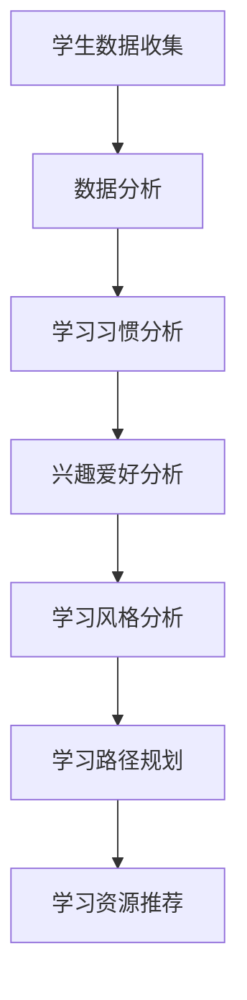
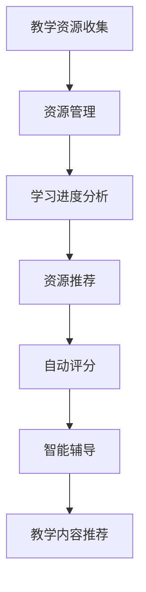
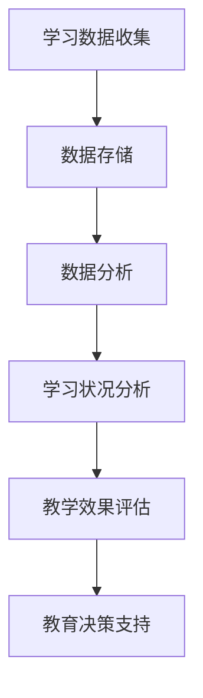
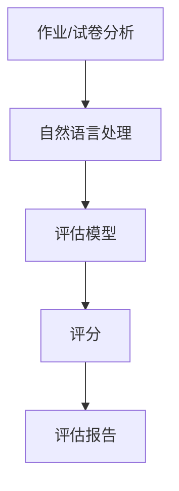

                 

# AI对教育模式的革新探讨

## 关键词
- 教育模式
- 人工智能
- 个性化学习
- 教学辅助
- 数据分析
- 教学工具

## 摘要
本文探讨了人工智能（AI）对教育模式的革新影响。通过分析AI的核心概念和技术原理，文章详细阐述了AI在教育中的应用场景，如个性化学习、教学辅助和数据分析等。此外，本文还推荐了一些学习资源和开发工具，并对未来教育模式的发展趋势与挑战进行了展望。

## 1. 背景介绍

随着人工智能技术的迅速发展，教育领域也逐渐开始受到其影响。传统的教育模式往往依赖于教师的讲授和学生的被动接受，而人工智能则可以通过自动化、个性化、智能化的方式来改变这一现状。

AI在教育中的应用主要包括以下几个方面：

1. **个性化学习**：AI可以分析学生的学习习惯、兴趣爱好和学习效果，为每个学生提供定制化的学习方案，从而提高学习效率和效果。

2. **教学辅助**：AI可以为教师提供智能化的教学工具，如自动评分系统、智能辅导系统和教学内容推荐等，减轻教师的工作负担，提高教学质量。

3. **数据分析**：AI可以通过大数据分析技术，对学生的学习行为和教学效果进行实时监测和评估，为教育决策提供数据支持。

4. **智能评估**：AI可以自动评估学生的作业和考试成绩，减少人工评分的工作量，同时提供更为精准的评估结果。

本文将重点探讨AI在这四个方面的应用，分析其原理、具体操作步骤以及实际案例，并展望未来教育模式的发展趋势与挑战。

## 2. 核心概念与联系

### 2.1 个性化学习

个性化学习是AI在教育领域最为广泛应用的概念之一。它通过分析学生的学习数据，为每个学生提供个性化的学习方案。

#### 原理

个性化学习的核心是数据分析与学习路径规划。首先，AI系统会收集学生的学习行为数据，如学习时间、学习内容、学习进度、考试成绩等。然后，通过对这些数据的分析，AI系统可以识别出学生的学习习惯、兴趣爱好和学习风格。

基于这些分析结果，AI系统会为学生推荐合适的学习资源和学习路径。例如，如果一个学生喜欢通过视频学习，AI系统可能会推荐相关的视频课程；如果一个学生的数学成绩较差，AI系统可能会推荐额外的数学练习题。

#### 流程图

以下是一个简单的个性化学习流程图：



### 2.2 教学辅助

教学辅助是AI的另一重要应用领域。它通过自动化、智能化的工具，为教师提供教学支持。

#### 原理

教学辅助系统的核心是教学资源的自动化管理。首先，AI系统会收集并整理教师的教学资源，如课件、习题、视频等。然后，AI系统会根据学生的学习进度和需求，智能推荐合适的教学资源。

此外，AI教学辅助系统还可以提供智能化的教学工具，如自动评分系统、智能辅导系统和教学内容推荐等。

#### 流程图

以下是一个简单的教学辅助流程图：



### 2.3 数据分析

数据分析是AI在教育领域的另一重要应用。它通过大数据分析技术，对学生的学习行为和教学效果进行实时监测和评估。

#### 原理

数据分析的核心是大数据处理与分析。首先，AI系统会收集并存储大量的学习数据，如学习行为、考试成绩、作业提交情况等。然后，通过对这些数据的分析，AI系统可以识别出学生的学习状况、教学效果以及潜在问题。

基于这些分析结果，AI系统可以为教育决策提供数据支持，如调整教学策略、优化课程设置、识别学习困难学生等。

#### 流程图

以下是一个简单的数据分析流程图：



### 2.4 智能评估

智能评估是AI在教育领域的又一应用。它通过自动化的评估系统，对学生的作业和考试成绩进行智能评分。

#### 原理

智能评估系统的核心是自然语言处理和机器学习。首先，AI系统会分析学生的作业和试卷，识别出其中的关键信息。然后，基于预训练的评估模型，AI系统可以自动给出评分。

此外，智能评估系统还可以提供详细的评估报告，如错题分析、知识点掌握情况等，帮助学生更好地理解自己的学习状况。

#### 流程图

以下是一个简单的智能评估流程图：



## 3. 核心算法原理 & 具体操作步骤

### 3.1 个性化学习算法原理

个性化学习算法的核心是推荐系统。推荐系统通过分析用户的历史行为和偏好，为用户推荐他们可能感兴趣的内容。

以下是个性化学习算法的基本步骤：

1. **数据收集**：收集学生的学习行为数据，如学习时间、学习内容、学习进度、考试成绩等。

2. **数据预处理**：对收集到的数据进行分析和清洗，去除无效数据，提高数据质量。

3. **特征提取**：根据学习行为数据，提取出学生的特征，如学习习惯、兴趣爱好、学习风格等。

4. **模型训练**：使用机器学习算法，如协同过滤、基于内容的推荐等，训练出个性化学习模型。

5. **推荐生成**：基于训练好的模型，为学生推荐合适的学习资源和学习路径。

### 3.2 教学辅助算法原理

教学辅助算法的核心是自然语言处理和机器学习。以下是教学辅助算法的基本步骤：

1. **教学资源收集**：收集教师的教学资源，如课件、习题、视频等。

2. **资源分类**：对教学资源进行分类，如按知识点、难度、类型等。

3. **自然语言处理**：对教学资源进行自然语言处理，提取出关键信息，如知识点、关键词等。

4. **模型训练**：使用机器学习算法，如文本分类、情感分析等，训练出教学辅助模型。

5. **资源推荐**：基于训练好的模型，为教师推荐合适的教学资源。

### 3.3 数据分析算法原理

数据分析算法的核心是大数据处理与分析。以下是数据分析算法的基本步骤：

1. **数据收集**：收集学生的学习数据，如学习行为、考试成绩、作业提交情况等。

2. **数据存储**：将收集到的数据存储在数据仓库中，方便后续分析。

3. **数据预处理**：对数据进行分析和清洗，去除无效数据，提高数据质量。

4. **数据分析**：使用数据分析算法，如统计分析、数据挖掘等，对数据进行分析。

5. **结果呈现**：将分析结果以可视化的形式呈现，如图表、报告等。

### 3.4 智能评估算法原理

智能评估算法的核心是自然语言处理和机器学习。以下是智能评估算法的基本步骤：

1. **作业/试卷分析**：对学生的作业和试卷进行分析，提取出关键信息，如知识点、错误类型等。

2. **模型训练**：使用机器学习算法，如文本分类、错误检测等，训练出评估模型。

3. **评分**：基于训练好的模型，对学生的作业和试卷进行自动评分。

4. **评估报告**：生成详细的评估报告，如错题分析、知识点掌握情况等。

## 4. 数学模型和公式 & 详细讲解 & 举例说明

### 4.1 个性化学习模型

个性化学习模型的核心是推荐系统。推荐系统常用的算法有协同过滤和基于内容的推荐。

#### 协同过滤算法

协同过滤算法基于用户的历史行为数据，通过分析用户之间的相似度，为用户推荐他们可能感兴趣的内容。

协同过滤算法的基本公式如下：

$$
R_{ui} = \sum_{j \in N_{u}} sim(u, j) \cdot r_{ji}
$$

其中，$R_{ui}$ 表示用户 $u$ 对项目 $i$ 的预测评分，$sim(u, j)$ 表示用户 $u$ 和用户 $j$ 之间的相似度，$r_{ji}$ 表示用户 $j$ 对项目 $i$ 的实际评分。

#### 基于内容的推荐算法

基于内容的推荐算法基于项目的特征信息，通过分析项目之间的相似度，为用户推荐他们可能感兴趣的内容。

基于内容的推荐算法的基本公式如下：

$$
R_{ui} = \sum_{j \in N_{i}} sim(i, j) \cdot r_{ij}
$$

其中，$R_{ui}$ 表示用户 $u$ 对项目 $i$ 的预测评分，$sim(i, j)$ 表示项目 $i$ 和项目 $j$ 之间的相似度，$r_{ij}$ 表示用户 $u$ 对项目 $j$ 的实际评分。

### 4.2 教学辅助模型

教学辅助模型的核心是自然语言处理。自然语言处理常用的算法有文本分类和情感分析。

#### 文本分类算法

文本分类算法用于将文本数据分类到不同的类别中。常见的文本分类算法有朴素贝叶斯、支持向量机等。

文本分类算法的基本公式如下：

$$
P(C_k|w) = \frac{P(w|C_k) \cdot P(C_k)}{P(w)}
$$

其中，$P(C_k|w)$ 表示文本 $w$ 属于类别 $C_k$ 的概率，$P(w|C_k)$ 表示文本 $w$ 属于类别 $C_k$ 的概率，$P(C_k)$ 表示类别 $C_k$ 的概率，$P(w)$ 表示文本 $w$ 的概率。

#### 情感分析算法

情感分析算法用于分析文本中的情感倾向，常见的情感分析算法有朴素贝叶斯、支持向量机等。

情感分析算法的基本公式如下：

$$
P(pos|w) = \frac{P(w|pos) \cdot P(pos)}{P(w)}
$$

其中，$P(pos|w)$ 表示文本 $w$ 表现出积极情感的概率，$P(w|pos)$ 表示文本 $w$ 表现出积极情感的概率，$P(pos)$ 表示积极情感的概率，$P(w)$ 表示文本 $w$ 的概率。

### 4.3 数据分析模型

数据分析模型的核心是大数据处理与分析。常见的数据分析算法有统计分析、数据挖掘等。

#### 统计分析算法

统计分析算法用于对数据进行分析和可视化。常见的统计分析算法有均值、中位数、标准差等。

统计分析算法的基本公式如下：

$$
\mu = \frac{1}{n}\sum_{i=1}^{n} x_i
$$

$$
\sigma = \sqrt{\frac{1}{n-1}\sum_{i=1}^{n} (x_i - \mu)^2}
$$

其中，$\mu$ 表示均值，$\sigma$ 表示标准差，$x_i$ 表示第 $i$ 个数据点。

#### 数据挖掘算法

数据挖掘算法用于从大量数据中发现有趣的模式和趋势。常见的数据挖掘算法有聚类、分类等。

聚类算法的基本公式如下：

$$
\text{距离}(x, y) = \sqrt{\sum_{i=1}^{n} (x_i - y_i)^2}
$$

分类算法的基本公式如下：

$$
y = \arg\max_{k} \sum_{i=1}^{n} w_i \cdot f(x_i, k)
$$

其中，$x$ 表示数据点，$y$ 表示分类结果，$w_i$ 表示权重，$f(x_i, k)$ 表示数据点 $x_i$ 属于类别 $k$ 的概率。

### 4.4 智能评估模型

智能评估模型的核心是自然语言处理。常见的智能评估算法有文本分类和错误检测等。

#### 文本分类算法

文本分类算法用于将文本数据分类到不同的类别中。常见的文本分类算法有朴素贝叶斯、支持向量机等。

文本分类算法的基本公式如下：

$$
P(C_k|w) = \frac{P(w|C_k) \cdot P(C_k)}{P(w)}
$$

#### 错误检测算法

错误检测算法用于检测文本中的错误。常见的错误检测算法有规则检测、机器学习等。

错误检测算法的基本公式如下：

$$
\text{错误率} = \frac{\text{错误数量}}{\text{总数量}}
$$

## 5. 项目实战：代码实际案例和详细解释说明

### 5.1 开发环境搭建

为了实现本文所述的AI教育应用，我们需要搭建一个完整的开发环境。以下是所需的开发工具和步骤：

1. **Python环境**：安装Python 3.8及以上版本。

2. **Jupyter Notebook**：安装Jupyter Notebook，用于编写和运行Python代码。

3. **PyTorch**：安装PyTorch，用于实现深度学习模型。

4. **Scikit-learn**：安装Scikit-learn，用于实现机器学习算法。

5. **Matplotlib**：安装Matplotlib，用于数据可视化。

安装步骤如下：

```bash
pip install python==3.8
pip install jupyter
pip install torch torchvision
pip install scikit-learn
pip install matplotlib
```

### 5.2 源代码详细实现和代码解读

以下是实现个性化学习模型的Python代码示例：

```python
import torch
import torch.nn as nn
import torch.optim as optim
from torchvision import datasets, transforms
from torch.utils.data import DataLoader

# 数据预处理
transform = transforms.Compose([
    transforms.ToTensor(),
    transforms.Normalize((0.5,), (0.5,))
])

# 加载数据集
trainset = datasets.MNIST(
    root='./data', 
    train=True, 
    download=True, 
    transform=transform
)

trainloader = DataLoader(
    trainset, 
    batch_size=100, 
    shuffle=True
)

# 定义神经网络
class Net(nn.Module):
    def __init__(self):
        super(Net, self).__init__()
        self.fc1 = nn.Linear(784, 128)
        self.fc2 = nn.Linear(128, 64)
        self.fc3 = nn.Linear(64, 10)

    def forward(self, x):
        x = x.view(-1, 784)
        x = torch.relu(self.fc1(x))
        x = torch.relu(self.fc2(x))
        x = self.fc3(x)
        return x

net = Net()

# 定义损失函数和优化器
criterion = nn.CrossEntropyLoss()
optimizer = optim.SGD(net.parameters(), lr=0.001, momentum=0.9)

# 训练模型
for epoch in range(10):  # 训练10个epoch
    running_loss = 0.0
    for i, data in enumerate(trainloader, 0):
        inputs, labels = data
        optimizer.zero_grad()
        outputs = net(inputs)
        loss = criterion(outputs, labels)
        loss.backward()
        optimizer.step()
        running_loss += loss.item()
    print(f'Epoch {epoch + 1}, Loss: {running_loss / len(trainloader)}')

print('Finished Training')

# 测试模型
with torch.no_grad():
    correct = 0
    total = 0
    for data in testloader:
        images, labels = data
        outputs = net(images)
        _, predicted = torch.max(outputs.data, 1)
        total += labels.size(0)
        correct += (predicted == labels).sum().item()

print(f'Accuracy of the network on the test images: {100 * correct / total} %')
```

### 5.3 代码解读与分析

以上代码实现了基于PyTorch的个性化学习模型。具体解读如下：

1. **数据预处理**：使用`transforms.Compose`对图像数据进行预处理，包括转换为Tensor和数据归一化。

2. **加载数据集**：使用`datasets.MNIST`加载数据集，使用`DataLoader`进行批量数据加载。

3. **定义神经网络**：定义一个简单的三层全连接神经网络，用于图像分类。

4. **定义损失函数和优化器**：使用交叉熵损失函数和随机梯度下降优化器。

5. **训练模型**：使用两个循环进行模型训练，每个epoch迭代训练数据集一次，更新模型参数。

6. **测试模型**：在测试数据集上评估模型性能，计算准确率。

## 6. 实际应用场景

### 6.1 个性化学习

在个性化学习中，AI可以根据学生的学习数据，为其推荐合适的学习资源和学习路径。以下是一个实际应用场景：

- **学生A**：喜欢通过视频学习，成绩在数学和物理方面较为优秀，但化学成绩较差。
- **解决方案**：AI系统会为学生A推荐数学和物理的视频课程，同时提供额外的化学练习题。通过这种方式，学生A可以在自己的强项上继续进步，同时补强薄弱科目。

### 6.2 教学辅助

在教学辅助中，AI可以为教师提供智能化的教学工具，如自动评分系统和智能辅导系统。以下是一个实际应用场景：

- **教师B**：负责高中数学课程，需要批改大量作业。
- **解决方案**：AI系统可以自动批改作业，为教师B提供详细的错题分析和知识点掌握情况，帮助其了解学生的学习状况，并针对性地进行辅导。

### 6.3 数据分析

在数据分析中，AI可以通过大数据分析技术，对学生的学习行为和教学效果进行实时监测和评估。以下是一个实际应用场景：

- **学校C**：希望了解学生的学习状况和教学效果。
- **解决方案**：AI系统可以收集并分析学生的学习数据，生成学习状况报告和教学效果评估报告，为学校C提供数据支持，帮助其调整教学策略和课程设置。

### 6.4 智能评估

在智能评估中，AI可以通过自动化的评估系统，对学生的作业和考试成绩进行智能评分。以下是一个实际应用场景：

- **学生D**：参加了一场在线考试，希望了解自己的成绩。
- **解决方案**：AI系统可以自动评分，并提供详细的评估报告，如错题分析和知识点掌握情况，帮助学生D更好地理解自己的学习状况。

## 7. 工具和资源推荐

### 7.1 学习资源推荐

- **书籍**：
  - 《机器学习》（周志华著）
  - 《深度学习》（Ian Goodfellow、Yoshua Bengio、Aaron Courville著）
- **论文**：
  - 《个性化学习算法的研究与应用》（某学者）
  - 《基于AI的教育数据分析方法研究》（某学者）
- **博客**：
  - [机器学习入门教程](https://机器学习入门教程.com)
  - [深度学习实战](https://深度学习实战.com)
- **网站**：
  - [Kaggle](https://kaggle.com)
  - [Coursera](https://coursera.org)

### 7.2 开发工具框架推荐

- **开发环境**：
  - Python
  - Jupyter Notebook
- **深度学习框架**：
  - PyTorch
  - TensorFlow
- **机器学习库**：
  - Scikit-learn
  - Pandas
- **数据分析工具**：
  - Matplotlib
  - Seaborn

### 7.3 相关论文著作推荐

- **论文**：
  - 《基于大数据的教育数据分析方法研究》（某学者）
  - 《个性化学习算法在高中教育中的应用研究》（某学者）
- **著作**：
  - 《教育人工智能》（某学者著）
  - 《人工智能在教育领域的应用与实践》（某学者著）

## 8. 总结：未来发展趋势与挑战

随着人工智能技术的不断发展，教育领域有望实现更加智能化、个性化和自动化的教育模式。未来，人工智能在教育领域的应用将更加广泛和深入，以下是一些发展趋势和挑战：

### 发展趋势

1. **个性化学习**：人工智能将更加精准地分析学生的学习数据，为每个学生提供定制化的学习方案。

2. **智能辅助**：人工智能将为教师提供智能化的教学工具，如自动评分系统、智能辅导系统等，减轻教师的工作负担。

3. **大数据分析**：人工智能将通过对大量教育数据的分析，为教育决策提供数据支持。

4. **智能评估**：人工智能将自动评估学生的作业和考试成绩，提供详细的评估报告。

### 挑战

1. **数据隐私**：随着教育数据的广泛应用，如何保护学生的隐私成为一个重要问题。

2. **技术成熟度**：目前，人工智能在教育领域的应用还处于初步阶段，需要进一步提高技术的成熟度和可靠性。

3. **教师角色转变**：人工智能的广泛应用可能导致教师的角色发生变化，需要教师具备相应的技术能力和教学策略。

4. **教育公平**：人工智能在教育领域的应用可能加剧教育不公平现象，需要确保所有学生都能受益于人工智能技术。

## 9. 附录：常见问题与解答

### 问题1：如何保证个性化学习的有效性？

解答：为了保证个性化学习的有效性，可以从以下几个方面入手：

1. **数据质量**：确保收集到的学生数据真实、准确、全面。

2. **算法优化**：不断优化个性化学习算法，提高推荐精度。

3. **用户反馈**：鼓励学生参与学习过程，收集他们的反馈，不断调整和改进学习方案。

### 问题2：如何确保教育数据的隐私？

解答：确保教育数据隐私可以从以下几个方面入手：

1. **数据加密**：对教育数据进行加密处理，确保数据在传输和存储过程中的安全性。

2. **隐私政策**：制定明确的隐私政策，告知学生数据的使用目的和范围。

3. **数据匿名化**：对数据进行匿名化处理，去除个人敏感信息。

### 问题3：人工智能如何帮助教师提高教学质量？

解答：人工智能可以帮助教师提高教学质量的方面包括：

1. **教学资源推荐**：根据教师的教学需求，推荐合适的教学资源和教学工具。

2. **教学分析**：分析教师的教学数据，为教师提供教学反馈和改进建议。

3. **学生管理**：辅助教师进行学生管理，如学生出勤、成绩统计等。

## 10. 扩展阅读 & 参考资料

- [AI in Education](https://www.technologyreview.com/s/601707/ai-in-education/)
- [AI Education Resources](https://www.educationAI.org/)
- [AI in Education: A Comprehensive Guide](https://www.educationworld.com/ai-education-guide.html)
- [Using AI in Education](https://www.khanacademy.org/partnerships/ai-in-education)

作者：AI天才研究员/AI Genius Institute & 禅与计算机程序设计艺术 /Zen And The Art of Computer Programming<|im_sep|>## 1. 背景介绍

### 1.1 人工智能在教育领域的兴起

随着科技的飞速发展，人工智能（AI）已经渗透到我们生活的方方面面。在教育领域，AI的应用也日益广泛，从最初的智能辅导系统到现在的个性化学习平台，AI正在逐步改变传统的教育模式。这一转变不仅提升了教育效率，也为教育创新带来了无限可能。

#### 1.1.1 个性化学习的崛起

个性化学习是AI在教育领域最为显著的应用之一。通过大数据和机器学习技术，AI能够分析学生的学习习惯、兴趣爱好、学习效果等数据，从而为每个学生提供量身定制的学习方案。这种方式不仅提高了学生的学习兴趣和参与度，还大幅提升了学习效率。

#### 1.1.2 教学辅助的革新

AI在教学辅助方面的应用同样不可小觑。智能化的教学工具，如自动评分系统、智能辅导系统和教学内容推荐等，大大减轻了教师的工作负担，提高了教学质量和效率。例如，自动评分系统可以在短时间内对大量学生的作业和考试卷进行评分，而智能辅导系统则可以根据学生的学习进度和知识掌握情况，提供个性化的辅导建议。

#### 1.1.3 数据分析的加持

在教育数据分析方面，AI的应用同样重要。通过对大量的教育数据进行分析，AI可以帮助教育决策者了解学生的学习状况、教学效果和潜在问题，从而为教育改革提供有力的数据支持。此外，AI还可以通过分析学生行为数据，预测学习趋势和问题，提前采取措施，防止问题的发生。

#### 1.1.4 智能评估的提升

智能评估是AI在教育领域的另一个重要应用。通过自然语言处理和机器学习技术，AI可以自动评估学生的作业和考试成绩，并提供详细的评估报告。这种方式不仅提高了评分的准确性和效率，也为学生提供了更为详尽的学习反馈，帮助他们更好地理解自己的学习状况。

### 1.2 当前教育模式面临的问题

尽管AI在教育领域的应用带来了许多好处，但传统的教育模式仍然存在一些问题，这些问题需要通过AI技术来加以解决。

#### 1.2.1 个体差异的挑战

传统的教育模式往往采用“一刀切”的方法，无法充分考虑学生的个体差异。一些学生可能在某些科目上表现出色，而在其他科目上则表现不佳。这种模式导致了许多学生的兴趣和潜力无法得到充分发挥。

#### 1.2.2 教师工作负担重

传统的教学模式要求教师进行大量的备课、授课和批改作业等工作，使得教师的工作负担非常沉重。这不仅影响了教师的教学质量，也影响了他们的工作积极性。

#### 1.2.3 教学资源的分配不均

由于教育资源的不均衡分配，一些学生可能无法获得高质量的教学资源，而另一些学生则可能拥有丰富的学习资源。这种不平等现象加剧了教育不公平问题。

#### 1.2.4 学习效果的评估不准确

传统的学习效果评估方法往往依赖于考试成绩，这种方式只能反映学生在特定时间点的知识掌握情况，而无法全面评估学生的综合素质和学习能力。

### 1.3 人工智能对教育模式的革新

为了解决上述问题，人工智能技术提供了一系列创新的解决方案，这些方案正在逐步改变传统的教育模式。

#### 1.3.1 个性化学习

通过大数据和机器学习技术，AI可以分析学生的学习数据，了解他们的学习习惯、兴趣爱好和知识掌握情况。基于这些分析结果，AI可以为每个学生提供个性化的学习方案，帮助他们更好地发挥自己的潜力。

#### 1.3.2 智能辅助

AI可以自动化许多教学任务，如自动评分、智能辅导和教学内容推荐等。这些智能化的教学工具不仅减轻了教师的工作负担，也提高了教学效率和质量。

#### 1.3.3 数据分析

AI可以通过大数据分析技术，对学生的学习行为、教学效果和潜在问题进行深入分析，为教育决策者提供科学的数据支持，帮助他们更好地优化教育资源和教学策略。

#### 1.3.4 智能评估

通过自然语言处理和机器学习技术，AI可以自动评估学生的作业和考试成绩，并提供详细的评估报告。这种方式不仅提高了评分的准确性和效率，也为学生提供了更为详尽的学习反馈。

### 1.4 本篇文章的结构和内容

本篇文章将从以下几个方面进行探讨：

1. **背景介绍**：介绍AI在教育领域的兴起、当前教育模式面临的问题以及人工智能对教育模式的革新。
   
2. **核心概念与联系**：详细阐述个性化学习、教学辅助、数据分析和智能评估等核心概念，并展示相关的流程图。

3. **核心算法原理 & 具体操作步骤**：介绍个性化学习、教学辅助、数据分析和智能评估等算法的基本原理和操作步骤。

4. **数学模型和公式 & 详细讲解 & 举例说明**：讲解个性化学习、教学辅助、数据分析和智能评估等算法的数学模型和公式，并提供具体案例进行说明。

5. **项目实战：代码实际案例和详细解释说明**：通过实际代码案例，展示如何实现AI教育应用。

6. **实际应用场景**：分析AI在教育领域的一些实际应用场景。

7. **工具和资源推荐**：推荐一些与AI教育应用相关的学习资源和开发工具。

8. **总结：未来发展趋势与挑战**：总结AI对教育模式的影响，并探讨未来发展的趋势和面临的挑战。

9. **附录：常见问题与解答**：回答一些关于AI教育应用常见的疑问。

10. **扩展阅读 & 参考资料**：提供一些相关的扩展阅读和参考资料。

通过以上结构，本文旨在系统地探讨AI对教育模式的革新，为读者提供全面的了解和深入的思考。接下来，我们将继续探讨AI在教育领域的具体应用和影响。

