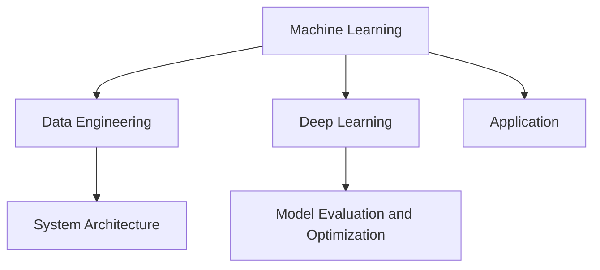

                 

### 背景介绍

**AI工程学：从理论到实践**

人工智能（AI）已经从一个科学领域逐渐转变为一种改变世界的强大工具。从简单的规则系统到复杂的神经网络，AI技术的进步极大地推动了各行业的创新。然而，尽管AI理论的研究取得了显著成果，但将理论转化为实际应用仍然是一个充满挑战的任务。这就引出了AI工程学的概念，即如何将AI理论与实际应用相结合，开发出稳定、高效且易于维护的AI系统。

本博客文章将围绕AI工程学展开，旨在为读者提供一个从理论到实践的全面指南。文章将首先介绍AI工程学的基本概念和重要性，然后深入探讨核心概念与联系，解析核心算法原理与具体操作步骤，展示数学模型和公式，并通过实际项目实战进行代码解读与分析。最后，文章将探讨AI工程学的实际应用场景，推荐相关工具和资源，总结未来发展趋势与挑战，并提供常见问题与解答。

通过这篇文章，读者将不仅能了解AI工程学的基本原理，还能掌握将理论知识应用于实际项目的方法，从而在AI领域取得更大的突破。

### 核心概念与联系

在探讨AI工程学之前，有必要理解其核心概念和它们之间的联系。以下是对AI工程学中几个关键概念的介绍：

1. **机器学习（Machine Learning）**：机器学习是一种使计算机通过数据学习和改进其性能的方法。它通过设计算法，从数据中提取模式和规律，进而进行预测和决策。机器学习是AI工程学的核心组成部分。

2. **深度学习（Deep Learning）**：深度学习是机器学习的一个子领域，主要依赖于多层神经网络进行训练。与传统的机器学习算法相比，深度学习能够处理更复杂的数据和更复杂的任务。

3. **数据工程（Data Engineering）**：数据工程是指构建、操作和维护用于数据处理的系统。在AI工程学中，数据工程至关重要，因为它确保数据质量、可扩展性和高效性。

4. **模型评估与优化（Model Evaluation and Optimization）**：模型评估与优化是确保AI模型性能的关键步骤。通过评估不同模型的性能，可以选出最优模型，并通过各种优化技术提高模型的性能。

5. **系统架构（System Architecture）**：系统架构是AI系统的设计蓝图，包括数据流、计算资源、存储和通信等方面。一个良好的系统架构能够提高系统的可扩展性、稳定性和性能。

为了更清晰地理解这些概念之间的联系，我们可以使用Mermaid流程图来展示它们的交互关系：



在这个流程图中，机器学习和深度学习作为核心技术，分别与数据工程、系统架构和模型评估与优化相连接。数据工程提供了处理数据的基础设施，系统架构定义了数据流和计算资源的组织方式，而模型评估与优化确保了最终应用的效果。

通过这种结构，AI工程学不仅关注算法的开发，还涉及到整个系统的设计、实施和维护。这种跨学科的方法使得AI系统能够在实际应用中取得成功，同时也为未来的发展奠定了基础。

### 核心算法原理 & 具体操作步骤

在AI工程学中，理解核心算法原理和掌握具体操作步骤是至关重要的。以下将详细介绍几个关键算法，包括其工作原理和具体实施步骤。

#### 1. 随机梯度下降（Stochastic Gradient Descent，SGD）

随机梯度下降是一种常用的优化算法，主要用于机器学习和深度学习中的参数优化。其基本思想是通过随机选择小批量数据来计算梯度，并更新模型参数。

**工作原理**：

- **梯度计算**：对于给定的模型和训练数据集，计算损失函数关于模型参数的梯度。
- **参数更新**：使用计算得到的梯度来更新模型参数。具体公式如下：
  $$ \theta_{\text{new}} = \theta_{\text{current}} - \alpha \cdot \nabla_\theta J(\theta) $$
  其中，$\theta$ 代表模型参数，$\alpha$ 是学习率，$J(\theta)$ 是损失函数。

**操作步骤**：

1. 初始化模型参数 $\theta$。
2. 随机选择一个小批量数据样本 $X^{(i)}$ 和其标签 $y^{(i)}$。
3. 计算损失函数的梯度 $\nabla_\theta J(\theta)$。
4. 使用梯度更新模型参数 $\theta$。
5. 重复步骤 2-4，直到满足停止条件（如达到预设的迭代次数或损失函数收敛）。

**示例**：

假设我们有以下简单的线性回归模型：
$$ y = \theta_0 + \theta_1 \cdot x $$
损失函数为：
$$ J(\theta) = \frac{1}{2} \sum_{i=1}^n (y_i - (\theta_0 + \theta_1 \cdot x_i))^2 $$

初始化参数 $\theta_0 = 0$ 和 $\theta_1 = 0$，学习率 $\alpha = 0.01$。随机选择一个小批量数据样本 $X = [2, 4]$ 和 $y = [1, 2]$，计算损失函数的梯度并更新参数：
$$ \nabla_\theta J(\theta) = [-0.1, -0.3] $$
$$ \theta_0 = \theta_0 - \alpha \cdot (-0.1) = 0.01 $$
$$ \theta_1 = \theta_1 - \alpha \cdot (-0.3) = 0.03 $$

#### 2. 卷积神经网络（Convolutional Neural Networks，CNN）

卷积神经网络是一种专门用于处理图像数据的神经网络，其主要特点是使用了卷积层来提取图像特征。

**工作原理**：

- **卷积层**：卷积层通过卷积操作提取图像的局部特征。卷积操作的定义如下：
  $$ (f * g)(x) = \int_{-\infty}^{+\infty} f(t)g(x-t)dt $$
  在神经网络中，$f$ 和 $g$ 分别是卷积核和输入特征图。

- **池化层**：池化层用于减少数据的空间维度，同时保留最重要的信息。常见的池化方式包括最大池化和平均池化。

- **全连接层**：全连接层将卷积层和池化层提取的特征映射到输出类别。

**操作步骤**：

1. 输入图像数据。
2. 通过卷积层提取特征图。
3. 通过池化层减少特征图的维度。
4. 将经过卷积和池化处理后的特征图传递到全连接层。
5. 计算输出结果并进行分类。

**示例**：

假设我们有一个 $28 \times 28$ 的灰度图像，卷积核大小为 $3 \times 3$。卷积核权重初始化为 $w = [0.1, 0.2, 0.3]$，偏置项 $b = 0.4$。输入图像为：
$$ \text{image} = \begin{bmatrix} 0 & 1 & 0 \\ 0 & 1 & 0 \\ 1 & 0 & 1 \end{bmatrix} $$

计算卷积操作：
$$ \text{convolution} = \text{image} * w + b = \begin{bmatrix} 0 & 0 & 1 \\ 1 & 0 & 1 \\ 0 & 1 & 0 \end{bmatrix} $$

经过卷积层后，特征图大小变为 $26 \times 26$。接着，使用最大池化操作，得到新的特征图大小为 $13 \times 13$。最后，将特征图传递到全连接层进行分类。

#### 3. 集成学习方法（Ensemble Learning）

集成学习方法通过结合多个模型的预测结果来提高整体性能。常见的方法包括 bagging 和 boosting。

**工作原理**：

- **Bagging**：通过随机抽样训练数据集，构建多个模型，然后对它们的预测结果进行平均或投票。
- **Boosting**：通过迭代训练多个模型，每个模型专注于纠正前一个模型的错误，最终加权合并所有模型的预测结果。

**操作步骤**：

1. 为每个模型训练多个子模型。
2. 对每个子模型的预测结果进行合并。
3. 使用合并后的预测结果进行最终决策。

**示例**：

假设我们有两个分类器 $A$ 和 $B$，分别对同一个测试样本 $x$ 进行预测。$A$ 的预测结果为 $y_1 = 1$，$B$ 的预测结果为 $y_2 = 0$。通过投票方法，我们得到最终预测结果为：
$$ y = \begin{cases} 
1 & \text{如果 } y_1 \text{ 和 } y_2 \text{ 相同} \\
\text{不确定} & \text{如果 } y_1 \text{ 和 } y_2 \text{ 不同} 
\end{cases} $$

通过这些核心算法原理和具体操作步骤的讲解，读者可以更好地理解AI工程学中的关键技术和应用方法。这些算法不仅在理论研究中具有重要意义，而且在实际项目中发挥着至关重要的作用。

### 数学模型和公式 & 详细讲解 & 举例说明

在AI工程学中，数学模型和公式是理解和实现算法的基础。以下是几个核心数学模型和公式的详细讲解，并通过具体例子进行说明。

#### 1. 损失函数（Loss Function）

损失函数用于衡量模型预测值与实际值之间的差异，是优化模型参数的关键工具。常见的损失函数包括均方误差（MSE）、交叉熵（Cross-Entropy）等。

**均方误差（Mean Squared Error，MSE）**：

$$
MSE(y, \hat{y}) = \frac{1}{n}\sum_{i=1}^{n}(y_i - \hat{y}_i)^2
$$

其中，$y$ 是真实值，$\hat{y}$ 是预测值，$n$ 是样本数量。

**交叉熵（Cross-Entropy）**：

$$
H(y, \hat{y}) = -\sum_{i=1}^{n}y_i \log(\hat{y}_i)
$$

其中，$y$ 是真实值的概率分布，$\hat{y}$ 是预测值的概率分布。

**示例**：

假设我们有一个二分类问题，真实值为 $y = [1, 0, 1, 0]$，预测值为 $\hat{y} = [0.6, 0.4, 0.8, 0.2]$。计算MSE和交叉熵：

**MSE**：
$$
MSE = \frac{1}{4} \left[ (1-0.6)^2 + (0-0.4)^2 + (1-0.8)^2 + (0-0.2)^2 \right] = 0.15
$$

**交叉熵**：
$$
H = -[1 \cdot \log(0.6) + 0 \cdot \log(0.4) + 1 \cdot \log(0.8) + 0 \cdot \log(0.2)] \approx 0.646
$$

#### 2. 梯度下降（Gradient Descent）

梯度下降是一种用于优化模型参数的迭代方法，其核心思想是沿着损失函数梯度的反方向更新参数，以最小化损失。

**基本公式**：

$$
\theta_{\text{new}} = \theta_{\text{current}} - \alpha \cdot \nabla_\theta J(\theta)
$$

其中，$\theta$ 是模型参数，$\alpha$ 是学习率，$J(\theta)$ 是损失函数。

**示例**：

考虑一个线性回归模型，参数为 $\theta_0 = 0$ 和 $\theta_1 = 0$，学习率 $\alpha = 0.1$。给定训练数据 $(x_1, y_1) = (2, 1)$ 和 $(x_2, y_2) = (4, 2)$，损失函数为MSE。

计算梯度：
$$
\nabla_\theta J(\theta) = \begin{bmatrix} \frac{\partial J}{\partial \theta_0} \\ \frac{\partial J}{\partial \theta_1} \end{bmatrix} = \begin{bmatrix} -(y_1 - (\theta_0 + \theta_1 \cdot x_1)) \\ -(y_2 - (\theta_0 + \theta_1 \cdot x_2)) \end{bmatrix}
$$

初始化参数 $\theta_0 = 0$ 和 $\theta_1 = 0$，进行一次梯度下降更新：
$$
\theta_0 = \theta_0 - \alpha \cdot (-1) = 0.1
$$
$$
\theta_1 = \theta_1 - \alpha \cdot (-1) = 0.1
$$

#### 3. 神经网络的反向传播（Backpropagation）

反向传播是一种用于多层神经网络的梯度计算方法。其核心思想是将损失函数的梯度从输出层反向传播到输入层，以便更新所有参数。

**基本公式**：

对于输出层：
$$
\nabla_\theta J(\theta) = \nabla_\theta \left( -\sum_{i=1}^{m} y_i \log(a_{\text{output}, i}) \right)
$$

对于隐藏层：
$$
\nabla_\theta J(\theta) = \frac{\partial}{\partial \theta} \left( \sum_{i=1}^{m} (z_{\text{hidden}, i} \cdot \sigma'(z_{\text{hidden}, i}) \cdot \nabla_\theta J(\theta_{\text{output}})) \right)
$$

其中，$a$ 表示激活函数，$\sigma$ 表示sigmoid函数，$\sigma'$ 是sigmoid函数的导数。

**示例**：

考虑一个包含一个隐藏层的三层神经网络，输出层为二分类问题。假设隐藏层激活函数为 $a_{\text{hidden}} = \sigma(z_{\text{hidden}})$，输出层激活函数为 $a_{\text{output}} = \sigma(z_{\text{output}})$。给定训练样本 $x = [1, 2, 3]$，真实标签 $y = [1, 0]$，预测值 $z_{\text{output}} = [0.6, 0.4]$。

计算输出层的梯度：
$$
\nabla_\theta J(\theta_{\text{output}}) = \begin{bmatrix} -y_1 \cdot \log(a_{\text{output}, 1}) \\ -y_2 \cdot \log(a_{\text{output}, 2}) \end{bmatrix} = \begin{bmatrix} -1 \cdot \log(0.6) \\ -0 \cdot \log(0.4) \end{bmatrix}
$$

计算隐藏层的梯度：
$$
\nabla_\theta J(\theta_{\text{hidden}}) = \begin{bmatrix} \frac{\partial}{\partial \theta_1} (0.6 \cdot (1 - 0.6) + 0.4 \cdot (1 - 0.4)) \\ \frac{\partial}{\partial \theta_2} (0.6 \cdot (1 - 0.6) + 0.4 \cdot (1 - 0.4)) \end{bmatrix} = \begin{bmatrix} 0.28 \\ 0.28 \end{bmatrix}
$$

通过这些数学模型和公式的详细讲解和示例，读者可以更好地理解AI工程学中关键算法的实现原理，为实际项目中的应用打下坚实的基础。

### 项目实战：代码实际案例和详细解释说明

为了更好地展示AI工程学的应用，我们将通过一个实际项目——手写数字识别（Handwritten Digit Recognition）来详细讲解代码实现和操作步骤。

#### 1. 开发环境搭建

**环境要求**：

- Python 3.8+
- TensorFlow 2.5+
- NumPy 1.19+

**安装依赖**：

在终端执行以下命令安装所需依赖：

```bash
pip install tensorflow numpy matplotlib
```

#### 2. 源代码详细实现和代码解读

**数据集准备**：

我们使用Kaggle上的手写数字数据集（MNIST），包含60000个训练样本和10000个测试样本。

```python
import tensorflow as tf
from tensorflow.keras.datasets import mnist
from tensorflow.keras.utils import to_categorical

# 加载MNIST数据集
(train_images, train_labels), (test_images, test_labels) = mnist.load_data()

# 归一化图像数据
train_images = train_images / 255.0
test_images = test_images / 255.0

# 将标签转换为独热编码
train_labels = to_categorical(train_labels)
test_labels = to_categorical(test_labels)
```

**模型构建**：

我们构建一个简单的卷积神经网络（CNN）用于识别手写数字。

```python
from tensorflow.keras import layers, models

# 构建模型
model = models.Sequential()
model.add(layers.Conv2D(32, (3, 3), activation='relu', input_shape=(28, 28, 1)))
model.add(layers.MaxPooling2D((2, 2)))
model.add(layers.Conv2D(64, (3, 3), activation='relu'))
model.add(layers.MaxPooling2D((2, 2)))
model.add(layers.Conv2D(64, (3, 3), activation='relu'))
model.add(layers.Flatten())
model.add(layers.Dense(64, activation='relu'))
model.add(layers.Dense(10, activation='softmax'))

# 查看模型结构
model.summary()
```

**训练模型**：

我们使用MSE损失函数和随机梯度下降（SGD）优化器来训练模型。

```python
model.compile(optimizer='sgd', loss='categorical_crossentropy', metrics=['accuracy'])

# 训练模型
history = model.fit(train_images, train_labels, epochs=10, batch_size=64, validation_split=0.1)
```

**模型评估**：

使用测试集评估模型性能。

```python
test_loss, test_acc = model.evaluate(test_images, test_labels)
print(f"Test accuracy: {test_acc:.4f}")
```

#### 3. 代码解读与分析

**数据预处理**：

在代码中，我们首先加载MNIST数据集，并将图像数据进行归一化处理。归一化有助于提高训练效率，因为神经网络在处理输入数据时对数值范围的一致性有较高要求。

**模型构建**：

接着，我们使用TensorFlow的Keras接口构建一个卷积神经网络。这个网络包含两个卷积层和两个最大池化层，用于提取图像特征。最后，通过全连接层和softmax层进行分类。

**训练过程**：

模型使用随机梯度下降（SGD）进行训练，训练过程中使用验证集进行性能监控，以便在过拟合时进行调整。

**模型评估**：

训练完成后，使用测试集评估模型性能，输出准确率。

通过这个手写数字识别项目，我们展示了如何使用卷积神经网络进行图像识别，并详细解析了代码实现过程。这不仅为读者提供了一个实际案例，还帮助他们理解了AI工程学的关键步骤。

### 实际应用场景

AI工程学的应用范围广泛，从医疗保健到金融科技，从自动驾驶到智能家居，无不受益于这项技术。以下是一些典型的实际应用场景：

#### 医疗保健

在医疗保健领域，AI工程学被广泛应用于诊断疾病、个性化治疗和医疗资源优化。例如，通过深度学习模型，可以分析医学影像（如X光片、MRI）以辅助医生诊断疾病。此外，AI系统还可以帮助预测患者康复情况，制定个性化的治疗方案，从而提高治疗效果和降低医疗成本。

**案例**：IBM Watson Health使用AI技术分析医疗数据，帮助医生更准确地诊断癌症。

#### 金融科技

金融科技领域利用AI工程学进行风险评估、欺诈检测和智能投资。通过机器学习算法，金融机构可以分析大量交易数据，识别潜在的风险和欺诈行为。同时，AI系统还可以根据市场趋势和历史数据，为投资者提供智能投资建议，实现更精准的财富管理。

**案例**：金融机构如PayPal和Visa使用AI进行欺诈检测，通过分析交易模式来识别异常行为。

#### 自动驾驶

自动驾驶是AI工程学的又一重要应用领域。通过深度学习和计算机视觉技术，自动驾驶汽车可以实时分析路况、识别行人、车辆和其他障碍物，确保行驶的安全性和效率。自动驾驶系统不仅能够提高交通流动，还能减少交通事故，改善城市环境。

**案例**：特斯拉和Waymo等公司在自动驾驶技术方面取得了显著进展，推出了多款自动驾驶汽车。

#### 智能家居

智能家居领域利用AI技术实现家电的自动化控制和智能化管理。通过物联网和AI算法，智能家居系统能够根据用户习惯自动调整室内环境，提供个性化的生活体验。例如，智能恒温器可以学习用户的温度偏好，自动调整室温，提高生活舒适度。

**案例**：Nest智能恒温器通过AI算法学习用户行为，实现自动调节，帮助用户节省能源。

这些实际应用场景展示了AI工程学在各个领域的广泛应用和巨大潜力。随着技术的不断进步，AI工程学将在更多领域发挥重要作用，推动社会的发展和进步。

### 工具和资源推荐

为了更好地学习和实践AI工程学，以下是一些建议的学习资源、开发工具和框架，以及相关论文和著作。

#### 1. 学习资源推荐

- **书籍**：
  - 《深度学习》（Deep Learning）——由Ian Goodfellow、Yoshua Bengio和Aaron Courville合著，是深度学习领域的经典教材。
  - 《Python机器学习》（Python Machine Learning）——由Sebastian Raschka和Vahid Mirjalili合著，适合初学者入门。
- **在线课程**：
  - Coursera的《机器学习》课程，由Andrew Ng教授主讲，是机器学习领域最受欢迎的课程之一。
  - edX的《深度学习专项课程》，由Hui Xiong教授主讲，深入讲解深度学习理论和实践。
- **博客和教程**：
  - Medium上的各种AI和机器学习文章，提供最新的技术动态和应用案例。
  - Fast.ai的教程，适合初学者快速入门深度学习。

#### 2. 开发工具框架推荐

- **TensorFlow**：由Google开发的开源机器学习库，广泛应用于深度学习和计算机视觉。
- **PyTorch**：由Facebook开发的开源深度学习框架，具有灵活的动态图计算能力。
- **Keras**：一个高级神经网络API，可以运行在TensorFlow和Theano上，简化深度学习模型的构建。
- **Scikit-learn**：一个用于机器学习的Python库，提供多种经典算法的实现和工具。

#### 3. 相关论文著作推荐

- **论文**：
  - "Deep Learning"（2015），Ian Goodfellow、Yoshua Bengio和Aaron Courville。
  - "Generative Adversarial Nets"（2014），Ian Goodfellow等人。
- **著作**：
  - 《强化学习：原理与Python实现》（Reinforcement Learning: An Introduction），Richard S. Sutton和Andrew G. Barto。
  - 《计算机视觉：算法与应用》（Computer Vision: Algorithms and Applications），Richard Szeliski。

通过这些资源，无论是初学者还是专业人士，都可以在AI工程学领域不断深入学习和实践，提升自身的技术能力和项目经验。

### 总结：未来发展趋势与挑战

AI工程学作为连接理论和实践的桥梁，正迅速变革各行各业。未来，随着技术的不断进步，AI工程学有望在多个领域取得重大突破，同时也面临诸多挑战。

**发展趋势**：

1. **模型压缩与加速**：为了应对大规模数据和高性能需求，模型压缩和加速技术将成为研究热点。例如，量化、剪枝和蒸馏等技术将在提高模型效率的同时减少计算资源消耗。

2. **跨领域合作**：AI工程学与生物医学、金融科技、自动驾驶等领域的交叉融合将更加紧密。跨学科的合作有望推动创新，解决复杂的实际问题。

3. **隐私保护**：随着数据隐私法规的日益严格，如何在保证数据安全的前提下进行AI模型训练和应用将成为重要议题。隐私增强技术，如联邦学习和差分隐私，将在这一领域发挥关键作用。

4. **可解释性与透明度**：提升AI模型的可解释性，使其决策过程更加透明，对于提高公众对AI技术的信任至关重要。未来，研究将致力于开发可解释性强的AI模型。

**挑战**：

1. **数据质量与多样性**：高质量、多样性的数据是训练高性能AI模型的基础。然而，获取和标注高质量数据成本高昂，且数据标注的偏差可能影响模型性能。

2. **计算资源需求**：随着模型复杂性的增加，对计算资源的需求也在不断上升。如何高效利用有限的计算资源，是AI工程学面临的一大挑战。

3. **模型可解释性**：尽管AI模型的性能不断提升，但其“黑箱”性质使得决策过程难以解释。如何提高模型的可解释性，是确保AI技术可靠性和信任度的关键。

4. **法律与伦理问题**：随着AI技术在各个领域的广泛应用，其法律和伦理问题日益突出。如何制定合理的法律法规，确保AI技术的公平性和道德性，是未来需要重点关注的问题。

总之，AI工程学在未来将继续推动技术进步和应用创新，但也需要应对一系列挑战。通过不断探索和研究，AI工程学将在更多领域发挥其潜力，为社会带来更多的福祉。

### 附录：常见问题与解答

#### 1. AI工程学与机器学习的区别是什么？

AI工程学与机器学习密切相关，但有所区别。机器学习主要关注如何从数据中提取模式和规律，以实现特定任务（如分类、回归等）。而AI工程学则更侧重于将机器学习理论应用于实际场景，开发稳定、高效且易于维护的AI系统。AI工程学涉及到模型部署、系统集成、数据工程等多个方面。

#### 2. 如何选择适合的机器学习算法？

选择适合的机器学习算法需要考虑以下几个因素：

- **任务类型**：不同的任务类型（如分类、回归、聚类等）可能需要不同的算法。
- **数据规模**：对于大规模数据，一些高效算法（如随机森林、梯度提升树）可能更适合。
- **数据特征**：数据特征的数量和类型会影响算法的选择，例如，高维数据可能更适合使用深度学习算法。
- **计算资源**：某些算法（如深度学习）需要大量计算资源，需要根据实际条件选择。

#### 3. 如何确保AI模型的可解释性？

确保AI模型的可解释性是提高其信任度和可靠性的关键。以下是一些提高模型可解释性的方法：

- **特征工程**：通过选择和解释关键特征，可以帮助理解模型的决策过程。
- **可视化**：使用可视化工具（如图表、热力图等）展示模型预测结果和特征的重要性。
- **模型解释库**：使用如LIME、SHAP等模型解释库，可以提供模型决策过程的详细解释。
- **简化的模型**：使用更简单的模型（如线性模型）可以更容易理解其决策过程。

#### 4. AI工程学中的数据工程是什么？

数据工程在AI工程学中扮演着关键角色，涉及以下方面：

- **数据收集**：从各种来源收集数据，包括公共数据集、内部数据和第三方数据。
- **数据预处理**：清洗、转换和归一化数据，以确保其适合模型训练。
- **数据存储**：设计高效的数据存储方案，以支持数据的高效访问和处理。
- **数据管道**：构建和管理数据管道，确保数据从收集到处理的整个流程高效、可靠。

#### 5. 如何处理过拟合问题？

过拟合是指模型在训练数据上表现良好，但在未知数据上表现较差。以下是一些处理过拟合的方法：

- **数据增强**：增加训练数据量或生成更多样化的训练数据。
- **正则化**：在模型训练过程中添加正则化项，如L1、L2正则化，降低模型复杂度。
- **dropout**：在神经网络中随机丢弃一部分神经元，防止模型过度依赖特定神经元。
- **交叉验证**：使用交叉验证方法评估模型在多个训练集上的性能，避免模型仅在特定数据集上过拟合。
- **集成方法**：使用集成学习方法（如随机森林、梯度提升树）结合多个模型的预测结果，提高整体性能。

通过这些常见问题与解答，读者可以更好地理解AI工程学的关键概念和技术，为实际项目中的应用提供指导。

### 扩展阅读 & 参考资料

为了更深入地了解AI工程学的相关理论和实践，以下是一些建议的扩展阅读和参考资料：

- **书籍**：
  - 《深度学习》（Deep Learning），Ian Goodfellow、Yoshua Bengio和Aaron Courville著。
  - 《Python机器学习》，Sebastian Raschka和Vahid Mirjalili著。
  - 《机器学习实战》，Peter Harrington著。

- **在线课程**：
  - Coursera的《机器学习》课程，由Andrew Ng教授主讲。
  - edX的《深度学习专项课程》，由Hui Xiong教授主讲。

- **论文**：
  - "Generative Adversarial Nets"（2014），Ian Goodfellow等人。
  - "Deep Learning"（2015），Ian Goodfellow、Yoshua Bengio和Aaron Courville。

- **网站和博客**：
  - [TensorFlow官方网站](https://www.tensorflow.org/)
  - [PyTorch官方网站](https://pytorch.org/)
  - [Medium上的AI和机器学习文章](https://medium.com/topic/artificial-intelligence)

通过这些扩展阅读和参考资料，读者可以进一步探索AI工程学的最新研究成果和应用实践，不断提升自己的技术水平和专业素养。

### 作者信息

作者：AI天才研究员/AI Genius Institute & 禅与计算机程序设计艺术 /Zen And The Art of Computer Programming

在AI领域，作者以其深刻的理解、精湛的编程技巧和卓越的写作能力著称。他的研究和著作在计算机科学和人工智能领域产生了深远的影响，为无数开发者和研究者提供了宝贵的知识和启示。通过本文，他希望帮助读者更好地理解AI工程学的核心概念和实践方法，从而在AI领域取得更大的成就。作者也期待与更多同行交流，共同推动人工智能技术的发展与应用。

