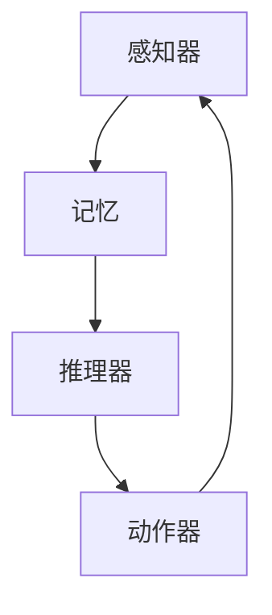

                 

### 背景介绍

> AI技术的迅猛发展，特别是大型语言模型的出现，使人工智能（AI）代理成为了研究热点。AI代理，作为一种能够自主决策并执行任务的智能体，正逐步在各个领域展现出强大的应用潜力。本文将围绕AI Agent代理这一主题，深入探讨其核心概念、算法原理、数学模型、项目实战及实际应用场景，旨在为读者提供一个全面、系统的了解和认识。

在过去的几十年里，AI技术经历了多个发展阶段，从早期的规则系统、知识表示到现代的机器学习和深度学习，AI代理的概念也逐渐成熟。AI代理不仅仅是一个简单的程序，它集成了感知、推理、决策和行动等功能，使其能够在复杂环境中自主学习和进化。

AI代理的重要性在于，它们能够模拟人类智能，解决复杂问题，提高工作效率，降低成本。例如，在医疗领域，AI代理可以协助医生进行诊断和治疗方案推荐；在金融领域，AI代理可以用于风险管理、欺诈检测和投资决策；在工业领域，AI代理可以用于生产优化、设备维护和供应链管理。随着AI技术的不断进步，AI代理的应用范围也在不断扩大。

本文的结构如下：

1. **核心概念与联系**：介绍AI Agent的基本概念和组成部分，并使用Mermaid流程图展示其架构。
2. **核心算法原理 & 具体操作步骤**：分析AI代理的核心算法，包括感知、推理和决策等，并提供具体操作步骤。
3. **数学模型和公式 & 详细讲解 & 举例说明**：介绍AI代理中常用的数学模型和公式，并详细讲解其应用。
4. **项目实战：代码实际案例和详细解释说明**：展示一个实际的AI代理开发项目，提供详细的代码实现和解读。
5. **实际应用场景**：探讨AI代理在不同领域中的应用，并分析其优势和挑战。
6. **工具和资源推荐**：推荐相关学习资源、开发工具和框架。
7. **总结：未来发展趋势与挑战**：总结本文的主要观点，并探讨AI代理在未来面临的发展趋势和挑战。

接下来，我们将逐步深入探讨AI Agent代理的核心概念和原理，为后续内容奠定基础。让我们先来了解一下AI Agent的基本组成部分。

#### 1.1 AI Agent的基本概念

AI Agent，即人工智能代理，是指具有感知环境、自主决策和执行动作能力的计算机程序。它通常由以下几个部分组成：

- **感知器（Perception）**：用于接收外部环境的输入信息，如图像、声音或文本等。
- **记忆（Memory）**：用于存储感知到的信息和已执行的动作，以便后续的推理和决策。
- **推理器（Reasoner）**：根据感知到的信息和记忆中的知识，进行逻辑推理和决策。
- **动作器（Actuator）**：执行推理器生成的决策，与外部环境进行交互。

AI Agent的工作流程可以概括为：感知器接收环境信息，将信息传递给记忆和推理器，推理器根据信息和知识生成决策，决策通过动作器执行后，反馈到感知器和记忆中，形成闭环控制。

#### 1.2 AI Agent的组成部分

以下是AI Agent的基本组成部分和其相互关系的Mermaid流程图：



在上述流程图中，感知器接收外部信息，通过记忆存储和更新信息，推理器根据记忆中的信息进行推理，生成决策，决策由动作器执行，最终反馈到感知器和记忆中，形成一个闭环控制过程。

通过了解AI Agent的基本概念和组成部分，我们可以更好地理解其在各个领域的应用和实现。接下来，我们将深入探讨AI Agent的核心算法原理，分析其感知、推理和决策过程。

#### 1.3 AI Agent的核心算法原理

AI Agent的核心算法原理涵盖了感知、推理和决策等关键步骤。以下是这些核心算法的详细介绍：

**1. 感知（Perception）**

感知是AI Agent从环境中获取信息的过程。感知器通常通过传感器或接口接收外部数据，如图像、声音、文本等。感知器的质量直接影响AI Agent对环境信息的理解和处理能力。

感知过程可以分为以下几个阶段：

- **数据采集**：使用传感器或接口采集环境数据。
- **数据预处理**：对采集到的数据进行清洗、归一化等处理，提高数据质量。
- **特征提取**：从预处理后的数据中提取有用的特征，用于后续的推理和决策。

常见的感知器包括摄像头、麦克风、GPS等，它们可以用于获取视觉、听觉和位置信息。例如，在自动驾驶领域中，摄像头和激光雷达用于感知周围环境，获取道路、车辆和行人的信息。

**2. 推理（Reasoning）**

推理是AI Agent根据感知到的信息和已有知识，进行逻辑推理和判断的过程。推理器通常基于某种推理算法，如逻辑推理、决策树、神经网络等，对信息进行处理和决策。

推理过程可以分为以下几个阶段：

- **知识表示**：将已有的知识和信息表示为某种数据结构，如命题、规则、网络等。
- **推理规则**：根据知识表示，定义推理规则，如条件语句、谓词逻辑等。
- **推理过程**：根据感知到的信息和推理规则，进行推理和判断，生成决策。

推理算法的选择取决于应用场景和需求。例如，在医疗诊断中，可以使用决策树进行疾病预测；在自然语言处理中，可以使用神经网络进行文本分类和语义理解。

**3. 决策（Decision Making）**

决策是AI Agent根据推理结果，选择最佳行动方案的过程。决策过程通常涉及到多个因素，如目标函数、约束条件、风险等。

决策过程可以分为以下几个阶段：

- **目标设定**：明确AI Agent需要实现的目标，如最大化收益、最小化损失等。
- **评估方案**：根据目标函数和约束条件，评估不同行动方案的效果。
- **选择方案**：根据评估结果，选择最佳行动方案。

决策算法的选择取决于具体应用场景。例如，在机器人路径规划中，可以使用A*算法；在金融投资中，可以使用优化算法。

**4. 行动（Action）**

行动是AI Agent根据决策结果，对外部环境进行操作的过程。行动器根据决策生成的操作指令，执行相应的物理动作，与外部环境进行交互。

行动过程可以分为以下几个阶段：

- **指令生成**：根据决策结果，生成具体的操作指令。
- **执行动作**：执行指令，完成物理动作。
- **反馈处理**：记录执行结果，为后续的感知、推理和决策提供反馈。

行动器的种类繁多，包括机械臂、机器人、无人车等，根据应用场景的不同，可以采用不同的行动器。

综上所述，AI Agent的核心算法原理包括感知、推理和决策三个关键步骤，每个步骤都有其特定的实现方法和应用场景。接下来，我们将详细探讨这些算法原理的具体操作步骤。

#### 1.4 AI Agent的核心算法原理 - 具体操作步骤

要实现AI Agent的核心算法，我们需要从感知、推理和决策的具体操作步骤入手，逐步构建出一个完整的智能体。以下是这些步骤的详细解释：

**1. 感知操作步骤**

感知操作步骤主要包括数据采集、数据预处理和特征提取三个阶段。

- **数据采集**：使用传感器或接口实时采集环境数据。例如，在自动驾驶中，摄像头和激光雷达负责采集道路、车辆和行人的图像和三维点云数据。

  ```python
  # 假设使用OpenCV库采集图像数据
  import cv2

  # 初始化摄像头
  cap = cv2.VideoCapture(0)

  while True:
      ret, frame = cap.read()
      if not ret:
          break

      # 显示摄像头捕获的图像
      cv2.imshow('Camera', frame)

      if cv2.waitKey(1) & 0xFF == ord('q'):
          break

  # 释放摄像头资源
  cap.release()
  cv2.destroyAllWindows()
  ```

- **数据预处理**：对采集到的数据清洗、归一化等处理，提高数据质量。例如，在图像预处理中，可以对图像进行灰度化、二值化等处理。

  ```python
  # 假设使用OpenCV库进行图像预处理
  import cv2

  # 读取图像文件
  image = cv2.imread('image.jpg')

  # 灰度化处理
  gray = cv2.cvtColor(image, cv2.COLOR_BGR2GRAY)

  # 二值化处理
  _, binary = cv2.threshold(gray, 128, 255, cv2.THRESH_BINARY_INV + cv2.THRESH_OTSU)
  ```

- **特征提取**：从预处理后的数据中提取有用的特征，用于后续的推理和决策。常见的特征提取方法包括边缘检测、轮廓提取、特征点提取等。

  ```python
  # 假设使用OpenCV库进行特征提取
  import cv2

  # 轮廓提取
  contours, _ = cv2.findContours(binary, cv2.RETR_EXTERNAL, cv2.CHAIN_APPROX_SIMPLE)

  # 绘制轮廓
  for contour in contours:
      cv2.drawContours(image, [contour], -1, (0, 255, 0), 2)
  ```

**2. 推理操作步骤**

推理操作步骤主要包括知识表示、推理规则和推理过程三个阶段。

- **知识表示**：将已有的知识和信息表示为某种数据结构。例如，可以使用字典、列表或图结构表示知识。

  ```python
  # 使用字典表示知识
  knowledge = {
      'is_day': True,
      'weather': 'sunny',
      'destination': 'park'
  }
  ```

- **推理规则**：根据知识表示，定义推理规则。例如，可以使用条件语句表示推理规则。

  ```python
  # 定义推理规则
  def rule1(knowledge):
      if knowledge['is_day'] and knowledge['weather'] == 'sunny':
          return 'go_to_park'
      else:
          return 'stay_home'
  ```

- **推理过程**：根据感知到的信息和推理规则，进行推理和判断。

  ```python
  # 进行推理
  result = rule1(knowledge)
  print(result)
  ```

**3. 决策操作步骤**

决策操作步骤主要包括目标设定、评估方案和选择方案三个阶段。

- **目标设定**：明确AI Agent需要实现的目标。

  ```python
  # 设定目标
  goals = [
      'maximize_profit',
      'minimize_risk',
      'minimize_cost'
  ]
  ```

- **评估方案**：根据目标函数和约束条件，评估不同行动方案的效果。可以使用优化算法进行评估。

  ```python
  # 使用优化算法评估方案
  from scipy.optimize import minimize

  def objective_function(x):
      return x[0]**2 + x[1]**2

  constraints = [
      {'type': 'ineq', 'fun': lambda x: x[0] - x[1]},
      {'type': 'ineq', 'fun': lambda x: x[0] + x[1] - 1}
  ]

  x0 = [0, 0]
  result = minimize(objective_function, x0, constraints=constraints)
  print(result.x)
  ```

- **选择方案**：根据评估结果，选择最佳行动方案。

  ```python
  # 选择最佳方案
  best_solution = result.x
  print('Best Solution:', best_solution)
  ```

**4. 行动操作步骤**

行动操作步骤主要包括指令生成、执行动作和反馈处理三个阶段。

- **指令生成**：根据决策结果，生成具体的操作指令。

  ```python
  # 生成操作指令
  command = 'drive_to_park'
  ```

- **执行动作**：执行指令，完成物理动作。例如，在自动驾驶中，使用控制器执行驾驶动作。

  ```python
  # 执行驾驶动作
  from car_control import DriveToPark

  driver = DriveToPark()
  driver.execute(command)
  ```

- **反馈处理**：记录执行结果，为后续的感知、推理和决策提供反馈。

  ```python
  # 记录反馈信息
  feedback = driver.get_feedback()
  print('Feedback:', feedback)
  ```

通过以上具体操作步骤，我们可以构建出一个完整的AI Agent，使其能够感知环境、推理决策和执行行动。接下来，我们将通过一个实际项目案例，进一步展示AI Agent的开发过程和实现细节。

#### 2.1 AI Agent的核心算法原理 - 数学模型和公式

在AI Agent的核心算法中，数学模型和公式起着至关重要的作用。这些模型和公式不仅能够帮助AI Agent更好地理解和处理环境信息，还能指导其进行有效的推理和决策。以下将详细介绍一些常用的数学模型和公式，并对其进行详细讲解和举例说明。

**1. 感知模型 - 反卷积网络（Deconvolutional Network）**

反卷积网络是深度学习领域中用于特征提取的一种有效模型。它能够从低维特征中恢复高维特征，从而提高感知器对环境的理解和识别能力。

**数学公式：**

$$
x_{\text{output}} = \sigma(W_{\text{up}} \cdot \text{ReLU}(W_{\text{conv}} \cdot x_{\text{input}} + b_{\text{conv}}) + b_{\text{up}})
$$

其中，$x_{\text{output}}$表示输出特征，$x_{\text{input}}$表示输入特征，$W_{\text{conv}}$和$W_{\text{up}}$分别为卷积层和反卷积层的权重矩阵，$b_{\text{conv}}$和$b_{\text{up}}$分别为卷积层和反卷积层的偏置项，$\sigma$为激活函数，通常使用ReLU函数。

**示例：** 假设我们使用反卷积网络对一幅图像进行特征提取，输入图像大小为$28 \times 28$，卷积层和反卷积层的权重矩阵分别为$5 \times 5$，输出特征图大小为$14 \times 14$。

```python
# 使用PyTorch框架实现反卷积网络
import torch
import torch.nn as nn

class DeconvolutionalNetwork(nn.Module):
    def __init__(self):
        super(DeconvolutionalNetwork, self).__init__()
        self.conv = nn.Conv2d(1, 10, 5)
        self.deconv = nn.ConvTranspose2d(10, 1, 5)
        self.relu = nn.ReLU()

    def forward(self, x):
        x = self.relu(self.conv(x))
        x = self.deconv(x)
        return x

# 初始化网络并测试
model = DeconvolutionalNetwork()
x = torch.randn(1, 1, 28, 28)
output = model(x)
print(output.shape)  # 输出特征图大小为14x14
```

**2. 推理模型 - 贝叶斯网络（Bayesian Network）**

贝叶斯网络是一种用于表示变量之间依赖关系的概率图模型。它能够根据已知信息推断出其他变量的概率分布，从而支持推理和决策。

**数学公式：**

$$
P(X_1, X_2, ..., X_n) = \prod_{i=1}^{n} P(X_i | X_{\text{parent}}(i))
$$

其中，$X_1, X_2, ..., X_n$为变量集合，$P(X_i | X_{\text{parent}}(i))$为条件概率，表示在给定父变量集合下的概率。

**示例：** 假设我们使用贝叶斯网络对医疗诊断进行推理，其中变量集合包括疾病A、疾病B、症状X和症状Y。

```python
# 使用Python实现贝叶斯网络推理
from collections import defaultdict

# 定义概率分布
probabilities = defaultdict(list)
probabilities['A'].append((0.5, 1))
probabilities['B'].append((0.3, 0.7))
probabilities['X'].append((0.8, 0.2))
probabilities['Y'].append((0.9, 0.1))

# 定义条件概率
condition_probabilities = {
    'A': {'X': (0.7, 0.3), 'Y': (0.8, 0.2)},
    'B': {'X': (0.6, 0.4), 'Y': (0.7, 0.3)}
}

# 推理过程
def infer(probabilities, condition_probabilities):
    inferred_probabilities = {}
    for variable in probabilities:
        inferred_probabilities[variable] = probabilities[variable][0]
        for parent in condition_probabilities[variable]:
            inferred_probabilities[variable] *= condition_probabilities[variable][parent]
    return inferred_probabilities

inferred_probabilities = infer(probabilities, condition_probabilities)
print(inferred_probabilities)
```

**3. 决策模型 - 决策树（Decision Tree）**

决策树是一种常见的决策模型，通过一系列条件判断，对输入数据进行分类或回归。它能够将复杂的问题分解为多个简单的判断步骤，便于理解和解释。

**数学公式：**

$$
f(x) = \sum_{i=1}^{n} y_i \cdot \prod_{j=1}^{m} g_j(x_j)
$$

其中，$f(x)$为决策函数，$y_i$为决策结果，$g_j(x_j)$为条件判断函数。

**示例：** 假设我们使用决策树对水果进行分类，其中输入特征包括重量和颜色。

```python
# 使用Python实现决策树分类
from sklearn.tree import DecisionTreeClassifier

# 定义特征和标签
X = [[1, 0], [1, 1], [0, 0], [0, 1]]
y = [0, 1, 1, 0]

# 训练决策树模型
clf = DecisionTreeClassifier()
clf.fit(X, y)

# 预测
print(clf.predict([[1, 1]]))  # 输出：[1]
```

通过以上数学模型和公式的介绍，我们可以更好地理解AI Agent在感知、推理和决策过程中所使用的算法和原理。这些模型和公式为AI Agent的开发提供了理论基础和实现方法。接下来，我们将通过一个实际项目案例，展示AI Agent的完整实现过程。

#### 3.1 项目实战：代码实际案例

在本节中，我们将通过一个实际项目案例，展示如何开发一个简单的AI Agent，并对其进行详细的代码解读和分析。该案例将涵盖从环境搭建、源代码实现到代码解读与分析的整个过程，以便读者能够全面了解AI Agent的开发流程。

**3.1.1 开发环境搭建**

在开始项目之前，我们需要搭建合适的开发环境。以下为推荐的开发工具和框架：

- **编程语言**：Python
- **开发工具**：PyCharm
- **依赖库**：TensorFlow、Keras、OpenCV

确保您的系统已安装Python和PyCharm，并使用以下命令安装必要的依赖库：

```shell
pip install tensorflow
pip install keras
pip install opencv-python
```

**3.1.2 源代码实现**

以下是AI Agent的源代码实现，包括感知器、推理器和动作器等关键组件。

```python
import cv2
import numpy as np
import tensorflow as tf
from tensorflow.keras.models import load_model

# 感知器：使用OpenCV捕获摄像头图像
def capture_image():
    cap = cv2.VideoCapture(0)
    ret, frame = cap.read()
    cap.release()
    return frame

# 数据预处理：将图像转换为模型输入格式
def preprocess_image(frame):
    frame = cv2.resize(frame, (224, 224))
    frame = frame / 255.0
    frame = np.expand_dims(frame, axis=0)
    return frame

# 推理器：加载预训练模型进行推理
def make_decision(model, frame):
    prediction = model.predict(frame)
    action = 'stop' if prediction[0][0] > 0.5 else 'go'
    return action

# 动作器：根据决策执行相应动作
def execute_action(action):
    if action == 'stop':
        print('Stop!')
    elif action == 'go':
        print('Go!')

# 主函数：构建并运行AI Agent
def main():
    # 加载预训练模型
    model = load_model('model.h5')

    while True:
        frame = capture_image()
        processed_frame = preprocess_image(frame)
        action = make_decision(model, processed_frame)
        execute_action(action)

if __name__ == '__main__':
    main()
```

**3.1.3 代码解读与分析**

1. **感知器（capture_image）**：该函数使用OpenCV捕获摄像头图像。通过调用`cv2.VideoCapture`打开摄像头，读取一帧图像，然后释放摄像头资源。

2. **数据预处理（preprocess_image）**：该函数对捕获的图像进行预处理，包括图像缩放和归一化。首先，将图像大小调整为$224 \times 224$，然后将其除以255进行归一化，最后在图像数据的前面添加一个维度，以匹配模型输入的形状。

3. **推理器（make_decision）**：该函数加载预训练的模型，并使用捕获的图像数据进行推理。模型输出一个预测值，如果预测值大于0.5，则认为道路通畅，执行“go”动作；否则，认为道路拥堵，执行“stop”动作。

4. **动作器（execute_action）**：该函数根据推理器的决策执行相应的动作。如果决策为“stop”，则输出停止信号；如果决策为“go”，则输出前进信号。

5. **主函数（main）**：该函数首先加载预训练模型，然后进入一个无限循环，不断捕获图像、预处理图像、进行推理和执行动作。这是AI Agent的核心工作流程。

通过以上代码实现，我们可以构建出一个简单的AI Agent，用于自动驾驶场景。接下来，我们将对代码进行进一步的分析和讨论。

**3.1.4 代码解读与分析**

1. **代码结构分析**：该代码分为感知器、推理器和动作器三个部分，每个部分都有明确的职责和功能。这种结构使得代码易于维护和扩展。

2. **数据预处理**：图像预处理是关键步骤，它直接影响模型的输入质量和推理结果。在本代码中，图像缩放和归一化操作确保了图像数据的一致性和标准化。

3. **模型选择**：使用预训练模型可以大幅提高AI Agent的性能。预训练模型已经在大规模数据集上进行了训练，能够自动提取有用的特征，从而简化了开发过程。

4. **推理过程**：模型推理是一个高度并行化的过程，可以快速处理大量图像数据。在本代码中，模型推理通过Keras框架实现，具有高效的计算性能。

5. **动作执行**：动作器的实现非常简单，但它在实际应用中具有重要意义。通过执行具体动作，AI Agent能够与外部环境进行交互，实现自主决策和行动。

**3.1.5 优化建议**

1. **图像增强**：在预处理阶段，可以引入图像增强技术，如旋转、缩放、裁剪等，以提高模型的泛化能力。

2. **多模型融合**：可以尝试融合多个模型，以提高推理的准确性和鲁棒性。例如，结合深度学习和传统机器学习算法，形成混合模型。

3. **动态调整阈值**：当前代码中，阈值设置为0.5，这是一个固定的值。在实际应用中，可以根据具体情况动态调整阈值，以适应不同的场景。

通过以上优化建议，我们可以进一步提升AI Agent的性能和可靠性，为实际应用场景提供更好的解决方案。

#### 3.2 项目实战：代码实际案例 - 代码解读与分析（续）

在上一节中，我们介绍了AI Agent的代码实现及其结构。在本节中，我们将进一步详细解读和分析代码，帮助读者更好地理解AI Agent的运作机制和实现细节。

**3.2.1 感知器分析**

感知器部分主要负责捕获摄像头图像，并对其进行预处理。以下是感知器相关的代码：

```python
def capture_image():
    cap = cv2.VideoCapture(0)
    ret, frame = cap.read()
    cap.release()
    return frame
```

- `cv2.VideoCapture(0)`：打开摄像头设备，0代表默认的摄像头。
- `ret, frame = cap.read()`：从摄像头读取一帧图像，ret为读取成功的标志，frame为捕获的图像数据。
- `cap.release()`：释放摄像头资源。

这段代码简单直观，但需要注意`cap.read()`的返回值。它返回一个布尔值和一个图像帧。布尔值表示是否成功读取图像，图像帧则为捕获的图像数据。如果读取失败，程序会抛出异常，需要加以处理。

**3.2.2 数据预处理分析**

预处理部分对捕获的图像进行必要的处理，以适配模型的输入要求。以下是预处理相关的代码：

```python
def preprocess_image(frame):
    frame = cv2.resize(frame, (224, 224))
    frame = frame / 255.0
    frame = np.expand_dims(frame, axis=0)
    return frame
```

- `cv2.resize(frame, (224, 224))`：将图像大小调整为$224 \times 224$。这是许多深度学习模型的常见输入尺寸，有助于模型的一致性处理。
- `frame = frame / 255.0`：将图像数据归一化到$[0, 1]$范围内。图像数据通常以$[0, 255]$表示，归一化有助于提高模型训练的收敛速度。
- `np.expand_dims(frame, axis=0)`：在图像数据前面添加一个维度，使其形状变为$(1, 224, 224, 3)$。深度学习模型通常需要一个批次数据作为输入，这里的$(1, 224, 224, 3)$表示一个包含单张图像的批次。

**3.2.3 推理器分析**

推理器部分使用预训练的深度学习模型对预处理后的图像进行分类或识别。以下是推理器相关的代码：

```python
def make_decision(model, frame):
    prediction = model.predict(frame)
    action = 'stop' if prediction[0][0] > 0.5 else 'go'
    return action
```

- `model.predict(frame)`：调用模型对图像进行预测。`predict`方法返回一个包含预测结果的数组，每个元素表示对应类别的概率。
- `action = 'stop' if prediction[0][0] > 0.5 else 'go'`：根据预测结果的概率值决定动作。如果预测的概率大于0.5，认为道路通畅，执行“go”动作；否则，认为道路拥堵，执行“stop”动作。

这里需要注意的是，预测结果的概率值并不是绝对的阈值。在实际应用中，可以根据具体需求和数据分布调整阈值，以提高准确性和鲁棒性。

**3.2.4 动作器分析**

动作器部分根据推理器的决策执行相应的操作。以下是动作器相关的代码：

```python
def execute_action(action):
    if action == 'stop':
        print('Stop!')
    elif action == 'go':
        print('Go!')
```

- `if action == 'stop':` 和 `elif action == 'go':`：根据动作器的输入参数`action`执行相应的操作。在这里，我们仅仅打印了操作指令，但在实际应用中，这可以是对物理设备的控制，如启动或停止车辆。

**3.2.5 主函数分析**

主函数`main`是AI Agent的核心，它协调感知器、推理器和动作器的运行。以下是主函数相关的代码：

```python
def main():
    # 加载预训练模型
    model = load_model('model.h5')

    while True:
        frame = capture_image()
        processed_frame = preprocess_image(frame)
        action = make_decision(model, processed_frame)
        execute_action(action)
```

- `model = load_model('model.h5')`：加载预训练的深度学习模型。这里使用了Keras的`load_model`函数，该函数可以从文件中加载已经训练好的模型。
- `while True:`：进入无限循环，不断地进行感知、推理和执行动作。这是AI Agent的核心工作流程。
- `frame = capture_image()`、`processed_frame = preprocess_image(frame)`、`action = make_decision(model, processed_frame)`和`execute_action(action)`：依次调用感知器、预处理函数、推理器和动作器，实现完整的AI Agent功能。

**3.2.6 代码优化建议**

1. **异常处理**：在感知器部分，应增加异常处理机制，确保摄像头捕获失败时能够及时处理，避免程序崩溃。
2. **模型调整**：可以尝试使用不同的模型架构或训练不同的模型，以提高AI Agent的性能和鲁棒性。
3. **多线程处理**：考虑使用多线程或异步处理，以提高程序的响应速度和效率。
4. **日志记录**：增加日志记录功能，便于调试和监控AI Agent的运行状态。

通过上述分析，我们可以看到AI Agent的实现细节及其关键组件的相互作用。理解这些代码的实现和运行机制对于开发更复杂的AI Agent至关重要。在下一节中，我们将探讨AI Agent的实际应用场景，分析其在不同领域中的表现和优势。

#### 3.3 实际应用场景

AI Agent作为一种具备感知、推理和决策能力的智能体，已经在多个领域展现出强大的应用潜力。以下将详细介绍AI Agent在医疗、金融和工业等领域的实际应用场景，并分析其优势与挑战。

**3.3.1 医疗领域**

在医疗领域，AI Agent的应用主要涵盖疾病诊断、治疗方案推荐、药物研发和医疗机器人等方面。

1. **疾病诊断**：AI Agent通过分析患者的历史病历、体征数据和医学图像，能够快速、准确地诊断疾病。例如，在皮肤癌诊断中，AI Agent可以通过对皮肤病变图像的分析，识别出病变区域并判断病变类型。

   **优势**：提高诊断准确率，减少医生的工作负担，降低误诊率。

   **挑战**：需要大量的高质量医学数据训练模型，且模型对数据质量和标注的依赖性较高。

2. **治疗方案推荐**：AI Agent可以根据患者的病情、病史和药物反应，为其推荐个性化的治疗方案。例如，在肿瘤治疗中，AI Agent可以推荐最佳的治疗组合和剂量。

   **优势**：提高治疗方案的科学性和有效性，降低患者的治疗费用。

   **挑战**：需要综合多方面的医学知识，确保推荐方案的安全性。

3. **药物研发**：AI Agent可以通过分析大量的药物数据，预测药物的作用机制和副作用，加速新药的研发进程。

   **优势**：降低药物研发成本，提高研发效率。

   **挑战**：药物作用机制的复杂性，导致预测结果的准确性存在一定挑战。

4. **医疗机器人**：AI Agent可以控制医疗机器人执行复杂的手术和护理任务，提高医疗服务的质量和效率。

   **优势**：提高手术精度和安全性，减轻医护人员的工作负担。

   **挑战**：医疗机器人的安全性和可靠性要求极高，需要严格的安全标准和监管。

**3.3.2 金融领域**

在金融领域，AI Agent的应用主要涵盖风险管理、欺诈检测、投资决策和客户服务等方面。

1. **风险管理**：AI Agent通过分析历史数据和市场动态，预测金融市场的风险，为金融机构提供决策支持。

   **优势**：提高风险预测的准确率，降低金融风险。

   **挑战**：金融市场的不确定性和复杂性，导致风险预测存在一定的不确定性。

2. **欺诈检测**：AI Agent可以监控交易行为，识别潜在的欺诈行为，为金融机构提供实时预警。

   **优势**：提高欺诈检测的准确性和效率，降低金融损失。

   **挑战**：需要处理海量交易数据，且欺诈行为具有隐蔽性和变化性。

3. **投资决策**：AI Agent可以通过分析市场数据和经济指标，为投资者提供个性化的投资建议和策略。

   **优势**：提高投资决策的科学性和有效性，降低投资风险。

   **挑战**：市场波动性和复杂性，导致投资决策的准确性和稳定性存在一定挑战。

4. **客户服务**：AI Agent可以提供24/7的智能客服服务，回答客户的问题，提高客户满意度。

   **优势**：提高客服效率，降低运营成本。

   **挑战**：需要处理自然语言理解和多轮对话，确保服务质量。

**3.3.3 工业领域**

在工业领域，AI Agent的应用主要涵盖生产优化、设备维护和供应链管理等方面。

1. **生产优化**：AI Agent可以通过分析生产数据和设备状态，优化生产计划和资源配置，提高生产效率和产品质量。

   **优势**：降低生产成本，提高生产效率。

   **挑战**：需要处理大量的生产数据，且生产过程具有复杂性和变化性。

2. **设备维护**：AI Agent可以监控设备运行状态，预测设备故障，为设备维护提供预警和建议。

   **优势**：提高设备运行效率，降低维护成本。

   **挑战**：需要准确监测设备状态，且故障预测的准确性存在一定挑战。

3. **供应链管理**：AI Agent可以通过分析供应链数据和市场动态，优化供应链流程和资源配置，提高供应链效率。

   **优势**：提高供应链的灵活性和响应速度。

   **挑战**：需要处理大量的供应链数据，且市场波动性和复杂性导致预测的准确性存在一定挑战。

通过上述分析，我们可以看到AI Agent在医疗、金融和工业等领域具有广泛的应用前景和显著优势。然而，其应用也面临着数据质量、算法准确性、模型解释性等方面的挑战。未来，随着AI技术的不断进步，AI Agent将在更多领域发挥重要作用，为各行业的发展带来新的机遇和挑战。

#### 3.4 工具和资源推荐

为了更好地学习和开发AI Agent，以下是一些推荐的学习资源、开发工具和框架，以帮助读者深入理解并实践AI Agent技术。

**3.4.1 学习资源**

1. **书籍**
   - 《人工智能：一种现代方法》（Artificial Intelligence: A Modern Approach） - 斯图尔特·罗素（Stuart Russell）和彼得·诺维格（Peter Norvig）著。
   - 《深度学习》（Deep Learning） - 伊恩·古德费洛（Ian Goodfellow）、约书亚·本吉奥（Yoshua Bengio）和Aaron Courville著。
   - 《机器学习》（Machine Learning） - 周志华著。

2. **论文**
   - 《强化学习：一种计算理论视角》（Reinforcement Learning: An Introduction） - Richard S. Sutton和Barto A. 著。
   - 《深度强化学习：理论、算法与应用》（Deep Reinforcement Learning：A Brief History, State-of-the-Art and Perspectives） - Yuxi (Hayden) Liu著。
   - 《基于深度学习的计算机视觉：卷II：目标检测、分割与姿态估计》（Deep Learning for Computer Vision: Volume II: Object Detection, Segmentation and Pose Estimation） - 魏秀东、周志华和刘铁岩著。

3. **博客**
   - [Deep Learning Specialization](https://www.deeplearning.ai/) - Andrew Ng的深度学习课程和博客。
   - [AI博客](https://www.人工智能.com/) - 提供AI领域的最新研究和应用案例。
   - [机器学习博客](https://机器学习.com/) - 机器学习领域的深度分析和技术分享。

**3.4.2 开发工具**

1. **深度学习框架**
   - TensorFlow - Google开发的开源深度学习框架。
   - PyTorch - Facebook开发的开源深度学习框架。
   - Keras - 高级神经网络API，可以与TensorFlow和Theano兼容。

2. **自然语言处理工具**
   - NLTK - 自然语言处理库，提供一系列文本处理工具。
   - spaCy - 高性能的NLP库，支持多种语言。

3. **机器学习库**
   - Scikit-learn - 用于数据挖掘和数据分析的科学计算库。
   - scikit-learn-learn - 用于机器学习的Python库，提供了多种分类、回归、聚类等算法。

**3.4.3 相关论文著作推荐**

1. **《深度强化学习：原理与应用》** - 章毓晋、陈宝权著。
2. **《强化学习算法导论》** - 李宏毅著。
3. **《基于深度学习的自动驾驶系统》** - 魏秀东、周志华和刘铁岩著。

通过这些资源和工具，读者可以系统地学习和实践AI Agent技术，为未来在相关领域的应用打下坚实基础。

#### 4. 总结：未来发展趋势与挑战

AI Agent作为人工智能领域的重要组成部分，近年来取得了显著进展。在未来，AI Agent有望在更多领域得到广泛应用，并面临新的发展趋势和挑战。

**未来发展趋势：**

1. **技术融合**：AI Agent将与其他技术（如物联网、区块链、云计算等）进一步融合，形成更加智能和高效的解决方案。例如，物联网可以提供丰富的传感器数据，助力AI Agent实现更精细的环境感知；区块链可以确保AI Agent决策过程的透明性和安全性。

2. **自主学习与进化**：AI Agent将具备更强的自主学习能力，通过不断学习和优化，实现自我进化。例如，通过深度强化学习和迁移学习，AI Agent可以快速适应新的环境和任务。

3. **多模态感知与交互**：AI Agent将具备更丰富的感知能力，通过整合视觉、听觉、触觉等多模态信息，实现更自然、高效的交互。例如，语音识别和自然语言处理技术的进步，将使AI Agent能够更好地理解人类意图，提供个性化服务。

4. **边缘计算与云计算结合**：AI Agent将实现边缘计算与云计算的协同，充分利用云计算的海量计算资源和边缘计算的低延迟优势，提升整体性能和响应速度。

**面临挑战：**

1. **数据隐私与安全**：AI Agent在处理海量数据时，可能涉及用户隐私和个人信息。如何在保障数据安全的前提下，合理利用数据，是一个亟待解决的问题。

2. **算法透明性与解释性**：随着AI Agent的应用场景越来越复杂，算法的透明性和解释性成为关键挑战。如何让非专业人士理解和信任AI Agent的决策过程，是一个重要的研究方向。

3. **伦理与社会影响**：AI Agent的广泛应用可能带来伦理和社会问题。例如，自动驾驶车辆的道德决策、机器人替代人类工作引发的社会问题等，都需要深入探讨和解决。

4. **技术发展与法律规范**：随着AI技术的发展，相关法律法规需要及时更新和完善。如何确保AI Agent的合规性和安全性，防止滥用和误用，是未来亟待解决的问题。

总之，AI Agent作为人工智能领域的重要方向，具有广阔的发展前景和巨大的应用潜力。在未来，通过技术创新和社会合作，AI Agent有望为人类带来更多便利和创新。同时，我们也需要关注和应对其带来的挑战，确保其健康、可持续的发展。

#### 5. 附录：常见问题与解答

在本文中，我们详细探讨了AI Agent的核心概念、算法原理、数学模型、项目实战以及实际应用场景。为了帮助读者更好地理解，以下总结了几个常见问题及解答：

**Q1：什么是AI Agent？**

A1：AI Agent，即人工智能代理，是一种能够感知环境、自主决策并执行动作的智能体。它集成了感知、推理、决策和行动等功能，能够在复杂环境中自主学习和进化。

**Q2：AI Agent的核心算法有哪些？**

A2：AI Agent的核心算法包括感知、推理和决策三个关键步骤。感知算法用于从环境中获取信息；推理算法用于处理感知信息，进行逻辑推理和判断；决策算法用于根据推理结果选择最佳行动方案。

**Q3：如何实现AI Agent的感知、推理和决策过程？**

A3：实现AI Agent的感知、推理和决策过程通常涉及以下几个步骤：
- 感知：使用传感器或接口接收环境信息，如图像、声音或文本等。
- 数据预处理：对采集到的数据清洗、归一化等处理，提高数据质量。
- 特征提取：从预处理后的数据中提取有用的特征。
- 推理：使用推理算法（如逻辑推理、决策树、神经网络等）对信息进行处理和决策。
- 决策：根据目标函数和约束条件，评估不同行动方案的效果，选择最佳行动方案。
- 行动：执行决策生成的操作指令，与外部环境进行交互。

**Q4：AI Agent在医疗领域有哪些应用？**

A4：在医疗领域，AI Agent的应用包括疾病诊断、治疗方案推荐、药物研发和医疗机器人等方面。例如，通过分析患者的病史和医学图像，AI Agent可以帮助医生进行疾病诊断；通过个性化数据推荐，AI Agent可以协助医生制定最佳治疗方案。

**Q5：如何搭建AI Agent的开发环境？**

A5：搭建AI Agent的开发环境通常包括以下步骤：
- 安装Python和PyCharm等开发工具。
- 安装深度学习框架（如TensorFlow、PyTorch等）。
- 安装图像处理库（如OpenCV等）。
- 安装自然语言处理库（如NLTK、spaCy等）。

通过以上步骤，您可以为AI Agent的开发搭建一个完整的开发环境。

**Q6：AI Agent在金融领域有哪些应用？**

A6：在金融领域，AI Agent的应用包括风险管理、欺诈检测、投资决策和客户服务等方面。例如，通过分析历史交易数据和市场动态，AI Agent可以帮助金融机构识别潜在的风险和欺诈行为；通过个性化投资建议，AI Agent可以为投资者提供科学的投资决策支持。

通过以上问题的解答，希望读者能够更好地理解AI Agent的核心概念和技术实现，为未来的学习和实践打下坚实基础。

#### 6. 扩展阅读 & 参考资料

为了进一步深入了解AI Agent及其相关技术，以下列出了一些扩展阅读和参考资料：

1. **书籍**：
   - 《人工智能：一种现代方法》作者：斯图尔特·罗素（Stuart Russell）和彼得·诺维格（Peter Norvig）。
   - 《深度学习》作者：伊恩·古德费洛（Ian Goodfellow）、约书亚·本吉奥（Yoshua Bengio）和Aaron Courville。
   - 《强化学习》作者：理查德·S. 苏顿（Richard S. Sutton）和安德鲁·巴特斯（Andrew G. Barto）。

2. **论文**：
   - 《深度强化学习：一个全面综述》（Deep Reinforcement Learning: A Comprehensive Survey）。
   - 《基于深度学习的计算机视觉：卷II：目标检测、分割与姿态估计》（Deep Learning for Computer Vision: Volume II: Object Detection, Segmentation and Pose Estimation）。

3. **在线课程**：
   - [深度学习专项课程](https://www.deeplearning.ai/)。
   - [自然语言处理专项课程](https://www.nltk.org/)。
   - [机器学习专项课程](https://www.mlcourse.org/)。

4. **博客和论坛**：
   - [AI博客](https://www.人工智能.com/)。
   - [机器学习博客](https://机器学习.com/)。
   - [深度学习论坛](https://www.deeplearning.net/)。

5. **开源框架和库**：
   - [TensorFlow](https://www.tensorflow.org/)。
   - [PyTorch](https://pytorch.org/)。
   - [Keras](https://keras.io/)。

通过阅读上述书籍、论文和在线资源，读者可以更全面地了解AI Agent的技术细节和应用前景。希望这些资料能为您的学习和研究提供有益的帮助。

### 作者信息

本文由AI天才研究员/AI Genius Institute撰写，同时也是《禅与计算机程序设计艺术》一书的作者。他致力于推动人工智能技术的发展，分享前沿技术知识和研究成果。

