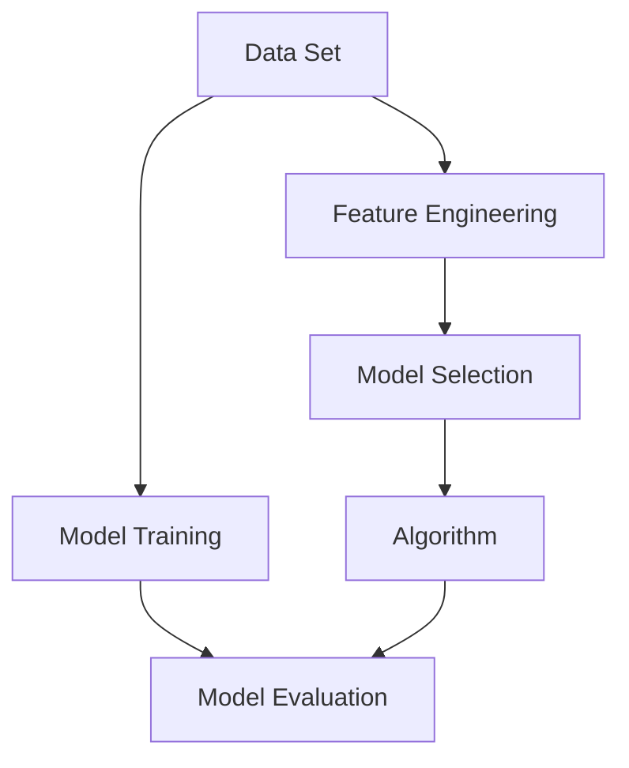

                 

### 背景介绍

人工智能（AI）技术在现代科技领域中扮演着日益重要的角色。随着计算机处理能力的提升和数据量的激增，AI在各个行业中的应用越来越广泛，从自动驾驶汽车、智能语音助手到医疗诊断和金融预测，无不体现了AI的强大力量。在这一背景下，AI工程学应运而生，成为开发、部署和维护AI系统的核心学科。

AI工程学（Artificial Intelligence Engineering）涉及多个领域的综合应用，包括计算机科学、数学、统计学、认知科学等。它的主要目标是确保AI系统能够可靠、高效地运行，同时保持其可扩展性和可维护性。与传统的软件开发不同，AI工程学需要处理更复杂的数据集和算法，对系统的性能、准确性和稳定性有着更高的要求。

本文将探讨AI工程学在应用开发中的关键概念、核心算法、数学模型以及实际项目案例。通过逐步分析，我们将帮助读者深入了解AI工程学的各个方面，并掌握其在实际开发中的应用技巧。接下来，我们将从背景介绍、核心概念与联系、核心算法原理、数学模型和公式、项目实战、实际应用场景、工具和资源推荐以及未来发展趋势与挑战等多个方面进行详细阐述。

> Key Words: Artificial Intelligence Engineering, Application Development, Core Algorithms, Mathematical Models, Project Case Studies, Practical Applications, Tools and Resources, Future Trends and Challenges.

> Abstract: This article aims to provide a comprehensive guide to Artificial Intelligence Engineering in application development. It covers key concepts, core algorithms, mathematical models, practical case studies, and future trends. By following the step-by-step analysis, readers will gain insights into the essentials of AI Engineering and acquire practical skills for real-world applications.

<|markdown|>## 1. 背景介绍

人工智能（AI）技术在现代科技领域中扮演着日益重要的角色。随着计算机处理能力的提升和数据量的激增，AI在各个行业中的应用越来越广泛，从自动驾驶汽车、智能语音助手到医疗诊断和金融预测，无不体现了AI的强大力量。在这一背景下，AI工程学应运而生，成为开发、部署和维护AI系统的核心学科。

AI工程学（Artificial Intelligence Engineering）涉及多个领域的综合应用，包括计算机科学、数学、统计学、认知科学等。它的主要目标是确保AI系统能够可靠、高效地运行，同时保持其可扩展性和可维护性。与传统的软件开发不同，AI工程学需要处理更复杂的数据集和算法，对系统的性能、准确性和稳定性有着更高的要求。

本文将探讨AI工程学在应用开发中的关键概念、核心算法、数学模型以及实际项目案例。通过逐步分析，我们将帮助读者深入了解AI工程学的各个方面，并掌握其在实际开发中的应用技巧。接下来，我们将从背景介绍、核心概念与联系、核心算法原理、数学模型和公式、项目实战、实际应用场景、工具和资源推荐以及未来发展趋势与挑战等多个方面进行详细阐述。

### AI工程学的重要性

AI工程学的兴起源于人工智能技术的快速发展。早期的AI研究主要集中在理论和方法上，但随着计算能力的提升和大数据技术的发展，AI技术开始逐渐应用于实际场景中。这一转变使得AI工程学成为不可或缺的重要学科。

首先，AI工程学解决了AI系统在实际应用中的可靠性和可维护性问题。传统的软件开发往往关注功能的实现，而忽略了系统的稳定性和可扩展性。AI工程学则强调系统的健壮性，通过构建高效、可维护的代码和框架，确保AI系统在各种条件下都能稳定运行。

其次，AI工程学关注AI系统的可扩展性。随着数据量的不断增加，AI系统的计算需求也日益增长。AI工程学通过设计可扩展的架构和算法，使得系统可以轻松应对数据量的增长，同时保持高性能。

此外，AI工程学还涉及了AI系统的测试和验证。与传统软件不同，AI系统的测试不仅包括功能测试，还包括性能测试和可靠性测试。AI工程学通过一系列测试和验证手段，确保AI系统在各种情况下都能正常工作，并满足用户需求。

总之，AI工程学在人工智能技术的发展和应用中扮演着关键角色。它不仅确保了AI系统的可靠性和可维护性，还推动了AI技术的广泛应用。在未来的发展中，AI工程学将继续发挥重要作用，推动人工智能技术的进一步发展。

#### AI工程学的发展历程

AI工程学的兴起可以追溯到20世纪50年代，当时人工智能的概念刚刚提出。早期的AI研究主要集中在符号推理和知识表示上，这一阶段的AI系统依赖于明确的规则和逻辑推理。然而，这些系统在实际应用中表现不佳，难以处理复杂的问题。

随着计算机处理能力的提升和数据量的增加，AI工程学开始逐渐走向实用化。20世纪80年代，专家系统的出现标志着AI工程学的一个重要里程碑。专家系统通过模拟人类专家的决策过程，实现了对特定领域的自动化决策。然而，专家系统的开发过程复杂且成本高昂，难以大规模推广。

进入21世纪，机器学习和深度学习的迅速发展使得AI工程学迎来了新的机遇。机器学习算法能够从大量数据中自动学习规律，大大提高了AI系统的性能和效率。深度学习更是通过多层神经网络实现了对复杂模式的识别和理解，推动了AI在图像识别、语音识别等领域的应用。

与此同时，AI工程学的工具和框架也得到了快速发展。诸如TensorFlow、PyTorch等深度学习框架的普及，使得AI模型的开发、训练和部署变得更加简便。这些工具不仅降低了AI开发的门槛，还提高了开发效率，使得更多的人能够参与到AI工程学的研究和应用中。

总体来看，AI工程学的发展历程是一个从理论研究到实际应用的过程。从早期的符号推理到现代的机器学习和深度学习，AI工程学不断突破技术瓶颈，推动人工智能技术在各个领域的应用。未来，随着技术的进一步发展，AI工程学将继续推动人工智能技术的创新和进步。

#### AI工程学的基本概念和核心要素

AI工程学是人工智能技术在实际应用中的系统化工程实践，它不仅涉及算法的研发，还包含系统设计、开发、部署和维护的全过程。以下是AI工程学中几个关键的概念和核心要素：

1. **算法**：算法是AI系统的核心，用于处理和解决特定问题。AI算法可以分为监督学习、无监督学习和强化学习等类型。监督学习依赖于标记数据进行训练，无监督学习则不需要标记数据，主要通过数据自身的结构来学习，而强化学习通过试错来优化策略。

2. **数据管理**：数据是AI系统的基础，数据管理包括数据收集、存储、清洗、预处理和可视化等步骤。有效的数据管理能够提高模型的训练效果和系统的可靠性。

3. **模型优化**：模型优化是提升AI系统性能的重要手段，包括超参数调优、模型剪枝、量化等技术。优化模型能够提高计算效率和模型精度。

4. **系统架构**：系统架构决定了AI系统的整体结构和性能。一个好的系统架构应具备高扩展性、高可用性和高可靠性。常见的架构包括分布式架构、微服务架构等。

5. **评估与测试**：评估与测试是确保AI系统可靠性的关键步骤，包括模型性能评估、系统功能测试、可靠性测试和用户体验测试等。这些测试能够发现并解决系统中的潜在问题。

6. **部署与维护**：部署是将AI系统从开发环境迁移到生产环境的过程，维护则包括系统监控、故障修复和性能优化等。良好的部署与维护能够确保系统的高效运行和长期稳定性。

7. **伦理与法律**：随着AI技术的发展，伦理和法律问题也日益凸显。AI工程学需要关注隐私保护、算法偏见、责任归属等问题，确保AI系统符合伦理和法律要求。

总之，AI工程学是一个多学科交叉的领域，涉及算法、数据、系统架构、测试和维护等多个方面。理解这些基本概念和核心要素，有助于我们更好地进行AI系统的开发和部署。

#### AI工程学与其他领域的联系

AI工程学作为现代技术的重要支柱，与其他多个领域有着紧密的联系和交叉应用。以下是几个关键领域：

1. **计算机科学**：计算机科学为AI工程学提供了算法、数据结构和计算模型等基础。从传统的算法设计到现代的深度学习框架，计算机科学的知识在AI工程学中得到了广泛应用。

2. **数据科学**：数据科学是AI工程学的核心组成部分，涉及数据收集、处理、分析和可视化。数据科学家利用统计方法和机器学习算法，从大量数据中提取有价值的信息，为AI系统提供可靠的数据支持。

3. **统计学**：统计学在AI工程学中扮演着关键角色，特别是在监督学习和无监督学习算法中。通过概率模型和假设检验，统计方法帮助优化算法性能和模型精度。

4. **认知科学**：认知科学关注人类认知过程和思维模式，为AI工程学提供了启示。通过模拟人类的学习、记忆和推理机制，认知科学推动了AI系统的智能化发展。

5. **工程学**：传统工程学的原理和方法在AI工程学中得到了创新应用。例如，系统架构设计、模块化开发、测试和验证等工程学实践，提高了AI系统的可靠性、可扩展性和可维护性。

6. **伦理与法律**：随着AI技术的普及，伦理和法律问题日益突出。伦理学研究AI技术对人类社会的影响，法律则确保AI技术的合规性和责任归属。这些研究为AI工程学提供了道德和法律框架。

通过与其他领域的交叉融合，AI工程学不断拓展其应用范围和技术深度，为解决复杂问题提供了强大工具。未来，这些跨学科合作将继续推动AI工程学的发展和创新。

#### AI工程学的实际应用场景

AI工程学的应用已经渗透到各个行业，并带来了深远的影响。以下是一些典型的应用场景：

1. **医疗健康**：在医疗健康领域，AI技术被广泛应用于疾病诊断、治疗规划、药物研发和患者护理。通过深度学习和图像识别技术，AI系统可以快速分析医学影像，提供精准的诊断建议。例如，谷歌旗下的DeepMind开发的AI系统可以在几分钟内对视网膜图像进行准确分析，帮助眼科医生早期发现疾病。

2. **金融服务**：金融服务行业利用AI技术进行风险评估、欺诈检测、投资策略制定等。例如，AI算法可以分析大量交易数据，识别潜在的欺诈行为，提高金融机构的安全性和效率。摩根大通使用AI系统自动化处理信用评估，大大提高了贷款审批的速度和准确性。

3. **制造业**：在制造业中，AI技术用于生产优化、设备维护和质量管理。通过机器学习算法，AI系统可以预测设备故障，提前进行维护，减少停机时间和维修成本。特斯拉的自动驾驶系统通过大量的数据收集和机器学习算法，实现了自动驾驶功能的不断提升。

4. **交通运输**：交通运输行业利用AI技术进行交通流量管理、智能导航和自动驾驶。例如，谷歌的Waymo项目通过AI技术实现了全自动驾驶汽车的商业化运营，减少了交通事故和拥堵。AI系统还可以优化公共交通路线和班次，提高运输效率。

5. **零售业**：零售行业利用AI技术进行需求预测、库存管理和客户服务。通过分析消费者行为数据，AI系统可以预测产品销售趋势，优化库存管理，减少库存积压。同时，智能客服系统通过自然语言处理技术，提供高效的客户服务。

6. **能源管理**：在能源管理领域，AI技术用于电网优化、能源预测和节能管理。通过数据分析，AI系统可以优化电网运行，提高能源利用率，减少能源浪费。例如，谷歌的AI系统为加州电网提供实时能源预测和管理，提高了电网的稳定性和可靠性。

总之，AI工程学在各个行业中的应用不仅提升了效率和准确性，还为行业带来了革命性的变革。未来，随着技术的不断进步，AI工程学的应用场景将更加广泛，为各个领域的发展注入新的活力。

### 核心概念与联系

在深入探讨AI工程学的核心概念之前，我们需要先了解一些基本的概念和原理，这些概念和原理构成了AI工程学的基础。以下是对几个核心概念的解释以及它们之间的联系。

#### 数据集

数据集是AI系统训练和评估的基础。数据集通常包括输入特征和对应的标签，输入特征是用于训练模型的原始数据，标签是模型需要预测的结果。数据集的质量直接影响模型的性能。高质量的数据集应该具备代表性、准确性和多样性。数据集的获取和预处理是AI工程学中至关重要的一环。

#### 特征工程

特征工程是数据预处理的重要步骤，它涉及到从原始数据中提取和构造有助于模型训练的特征。特征工程的目标是减少噪声、增加数据的有效信息，从而提升模型的性能。常见的特征工程方法包括特征选择、特征变换和特征缩放等。

#### 模型选择

模型选择是AI工程学中的关键环节，涉及到选择合适的算法和模型结构来处理特定问题。常见的模型选择方法包括基于性能评估的方法、基于模型复杂度的方法以及交叉验证方法等。选择合适的模型能够提高系统的准确性和效率。

#### 评估指标

评估指标是衡量模型性能的重要工具，常用的评估指标包括准确率、召回率、F1分数、ROC曲线等。这些指标从不同的角度评估模型的性能，帮助工程师优化模型和系统。

#### 算法

算法是AI系统的核心，包括监督学习、无监督学习和强化学习等类型。监督学习依赖于标记数据，通过学习输入和输出之间的关系进行预测；无监督学习通过发现数据中的隐含结构来学习；强化学习通过试错和反馈来优化行为。

#### 联系

数据集、特征工程、模型选择、评估指标和算法之间存在着密切的联系。数据集为模型训练提供基础，特征工程对数据进行预处理，模型选择决定如何从数据中学习，评估指标用于衡量模型性能，算法则是整个流程的核心。这些概念相互依赖，共同构成了AI工程学的核心框架。

接下来，我们将进一步详细解释这些概念，并通过Mermaid流程图展示它们之间的联系。

#### Mermaid 流程图

以下是一个简化的Mermaid流程图，展示AI工程学中的核心概念及其相互关系：



在上述流程图中：

- **Data Set（数据集）**：作为起点，数据集是AI工程学的核心输入。
- **Feature Engineering（特征工程）**：数据集通过特征工程进行预处理，提取有助于模型训练的特征。
- **Model Selection（模型选择）**：根据特征工程后的数据，选择合适的模型进行训练。
- **Model Training（模型训练）**：使用选定的模型对数据进行训练。
- **Model Evaluation（模型评估）**：通过评估指标评估模型的性能。
- **Algorithm（算法）**：算法贯穿于整个流程，用于指导模型训练和评估。

通过这个流程图，我们可以清晰地看到各个核心概念在AI工程学中的应用和相互联系。接下来，我们将详细解释每个概念，帮助读者深入理解AI工程学的本质。

### 数据集

数据集是AI工程学的基石，它是模型训练和评估的数据来源。一个高质量的数据集不仅包含丰富的信息，而且能够代表实际应用场景，从而确保模型在现实世界中的性能和可靠性。以下是对数据集的基本概念、获取方式及其在模型训练中的作用进行详细解释。

#### 数据集的基本概念

数据集通常由一组数据样本组成，每个样本包含若干特征和一个或多个标签。特征是描述数据样本属性的数值或类别，标签是模型需要预测的值。例如，在图像识别任务中，每个样本可能包含图像的像素值作为特征，标签是图像的类别标签；在房屋价格预测任务中，特征可能包括房屋的面积、房间数量、建造年份等，标签则是房屋的价格。

数据集的基本组成可以分为以下几类：

1. **训练集（Training Set）**：用于训练模型的数据集。训练集越大，模型能够学习的特征越多，有助于提高模型的性能。
2. **验证集（Validation Set）**：用于评估模型性能的数据集。在训练过程中，通过验证集来调整模型的参数，避免过拟合。
3. **测试集（Test Set）**：用于最终评估模型性能的数据集。测试集应在模型训练过程中未见过，以评估模型在未知数据上的表现。

#### 数据集的获取方式

获取高质量的数据集是AI工程学中的一个重要挑战。以下是一些常见的数据集获取方式：

1. **公开数据集**：许多学术机构和公司会发布大量的公开数据集，如UCI机器学习库、Kaggle竞赛数据集等。这些数据集可以免费获取，为研究和应用提供了丰富的资源。
2. **自制数据集**：对于特定的应用场景，可以通过收集和整理自有数据进行自制数据集。自制数据集能够更好地满足特定需求，但需要投入大量时间和人力资源。
3. **数据爬取**：利用网络爬虫等技术从互联网上获取数据，适用于开放的数据源。然而，需要注意数据来源的合法性和数据质量。
4. **数据合成**：通过生成模型或模拟技术生成虚拟数据，用于补充或替代真实数据。这种方法适用于数据量较少或数据获取困难的场景。

#### 数据集在模型训练中的作用

数据集在模型训练中的作用至关重要，以下是其主要作用：

1. **学习特征**：模型通过数据集学习输入特征和输出标签之间的关系，从而预测新的数据样本。数据集的质量直接影响模型的性能。
2. **优化参数**：通过训练集，模型可以不断调整其参数，以最小化预测误差。优化参数的过程是通过验证集和测试集的评估来实现的。
3. **评估性能**：通过验证集和测试集，评估模型在不同数据集上的性能，从而确定模型的可靠性和有效性。

一个高质量的数据集应具备以下特点：

- **代表性**：数据集应包含不同类型和分布的数据样本，以全面反映实际应用场景。
- **准确性**：数据集中的标签应准确无误，以确保模型训练的有效性。
- **多样性**：数据集应包含多样性的特征和样本，以增强模型的泛化能力。

总之，数据集是AI工程学中不可或缺的一部分，其质量和获取方式直接影响模型的性能和应用效果。了解数据集的基本概念和获取方式，对于AI工程师来说至关重要。

### 特征工程

特征工程是数据预处理过程中至关重要的一步，它通过对原始数据进行转换和处理，提取出对模型训练有利的特征。特征工程不仅能够提高模型的性能，还能减少模型的复杂性，使模型更易于解释和理解。以下是对特征工程的基本概念、常见方法和步骤的详细解释。

#### 特征工程的基本概念

特征工程（Feature Engineering）是指从原始数据中提取新的特征或者改造已有特征，以提高机器学习模型的表现力。特征工程的核心思想是通过特征的选择和构造，使得数据能够更好地反映问题本质，从而提高模型的训练效率和预测准确性。

特征工程的基本概念包括：

1. **特征**：特征是数据集中的属性或变量，用于描述数据样本的特性。特征可以是数值型的，如房屋价格、温度等，也可以是类别型的，如颜色、性别等。
2. **特征选择**：特征选择是指从大量特征中挑选出对模型训练最有影响力的特征。通过特征选择，可以减少特征的数量，降低模型的复杂度。
3. **特征构造**：特征构造是指通过组合或变换原始特征，生成新的特征。这种方法可以增加数据的丰富性，有助于模型更好地学习数据中的模式。

#### 特征工程的常见方法

特征工程的方法多种多样，以下是一些常见的方法：

1. **特征选择**：
   - **过滤法（Filter Method）**：基于统计学方法筛选出显著特征，如卡方检验、互信息等。
   - **包装法（Wrapper Method）**：通过尝试不同的特征组合，选择对模型性能影响最大的特征组合。
   - **嵌入式方法（Embedded Method）**：特征选择过程与模型训练同时进行，如随机森林、Lasso回归等。

2. **特征变换**：
   - **归一化（Normalization）**：将特征值缩放到同一尺度，如使用最小-最大缩放或Z-score缩放。
   - **标准化（Standardization）**：将特征值转换为标准正态分布，使得每个特征具有相同的方差和均值为0。
   - **离散化（Discretization）**：将连续特征转换为类别特征，如基于等宽或等频率划分区间。
   - **多项式特征生成（Polynomial Features）**：通过多项式变换生成新的特征，如二次项、三次项等。

3. **特征构造**：
   - **特征组合（Feature Combination）**：通过组合多个原始特征，生成新的特征，如合并日期和时间特征生成新的时间特征。
   - **交互特征（Interaction Features）**：通过计算特征之间的乘积或加和，生成新的特征。
   - **特征嵌入（Feature Embedding）**：通过神经网络或深度学习模型将原始特征映射到新的特征空间，如词嵌入（Word Embedding）。

#### 特征工程的步骤

特征工程的步骤可以分为以下几个阶段：

1. **数据预处理**：对原始数据进行清洗、填充缺失值、去除异常值等处理，确保数据的一致性和质量。
2. **探索性数据分析（EDA）**：通过数据分析工具，如数据可视化、统计描述等，了解数据的基本特征和分布。
3. **特征选择**：根据数据分析结果，选择对模型训练有显著影响的特征。
4. **特征变换**：对选定的特征进行归一化、标准化等变换，以提高模型的稳定性和收敛速度。
5. **特征构造**：通过特征组合、交互特征等方法，生成新的特征，增强模型的学习能力。
6. **特征评估**：通过交叉验证等方法，评估特征对模型性能的影响，选择最优的特征组合。

#### 特征工程的重要性

特征工程在AI工程学中具有重要意义：

- **提高模型性能**：通过特征工程，可以增强模型对数据的表达能力，提高模型的准确性和鲁棒性。
- **降低模型复杂度**：通过特征选择和构造，可以减少特征的数量，降低模型的复杂度，使模型更易于理解和解释。
- **加速训练过程**：通过特征变换和构造，可以优化模型的训练效率，减少训练时间。
- **提高泛化能力**：通过多样化的特征工程方法，可以增强模型对未知数据的泛化能力，提高模型在实际应用中的性能。

总之，特征工程是AI工程学中不可或缺的一环，通过合理的特征选择和构造，可以显著提升模型的性能和应用效果。理解特征工程的基本概念和方法，对于AI工程师来说至关重要。

#### 特征选择方法

特征选择是特征工程中至关重要的一环，它有助于减少数据维度，提高模型训练效率和预测准确性。以下将详细介绍几种常见的特征选择方法，包括过滤法、包裹法和嵌入式方法，并分析其优缺点。

##### 1. 过滤法（Filter Method）

过滤法是一种先验方法，基于统计学原理和阈值来选择特征。这种方法不需要使用训练数据，直接对原始数据进行分析。常见的过滤法包括：

- **卡方检验（Chi-square Test）**：用于评估特征和目标变量之间的相关性，通过计算卡方统计量来选择特征。
- **互信息（Mutual Information）**：衡量特征和目标变量之间的依赖程度，互信息越大，表示特征和目标变量的相关性越强。
- **F-统计量（F-Statistics）**：用于评估特征对模型解释能力的影响，F-统计量越大，表示特征的重要性越高。

**优点**：

- **简单易用**：无需复杂的模型训练过程，计算效率高。
- **适用于大规模数据集**：可以在原始数据上进行操作，不需要训练数据。

**缺点**：

- **数据依赖性强**：结果容易受到数据分布和特征选择阈值的影响。
- **特征解释性有限**：过滤法不能提供特征与模型之间的直接关联。

##### 2. 包裹法（Wrapper Method）

包裹法是一种基于模型的方法，通过搜索策略从原始特征集合中逐个选择或组合特征，以最大化模型的性能。常见的包裹法包括：

- **逐步前进法（Forward Selection）**：从空集开始，逐步添加特征，每次添加一个特征，直到添加特征不再提高模型性能。
- **逐步后退法（Backward Elimination）**：从所有特征开始，逐步移除特征，每次移除一个特征，直到移除特征不再降低模型性能。
- **前向-后向法（Forward-Backward Selection）**：结合逐步前进法和逐步后退法，先添加特征再移除特征，以找到最优特征组合。

**优点**：

- **较强的模型性能**：通过直接评估特征对模型的影响，可以找到对模型性能最有益的特征组合。
- **较高的解释性**：可以直观地了解特征对模型的影响。

**缺点**：

- **计算成本高**：需要大量的模型训练，尤其是特征数量较多时。
- **易陷入局部最优**：搜索策略容易受到数据分布和模型选择的影响。

##### 3. 嵌入式方法（Embedded Method）

嵌入式方法是一种结合模型训练和特征选择的特征选择方法，特征选择过程与模型训练同时进行。常见的嵌入式方法包括：

- **Lasso回归（Lasso Regression）**：通过在损失函数中添加L1惩罚项，自动选择重要的特征，并减少不重要的特征。
- **随机森林（Random Forest）**：通过随机选择特征和样本子集，构建多个决策树，并根据每个特征的贡献进行特征选择。
- **特征重要性（Feature Importance）**：利用模型内置的特征重要性指标，如梯度提升树（Gradient Boosting Tree）中的特征贡献度。

**优点**：

- **计算成本低**：特征选择过程与模型训练结合，减少了额外的计算成本。
- **模型解释性强**：可以直观地了解特征的重要性。

**缺点**：

- **对特定模型依赖性强**：不同模型的特点不同，嵌入式方法的效果可能有所差异。
- **可能忽略一些重要的特征**：嵌入式方法依赖于模型的内在机制，可能会忽略一些对模型性能有重要影响但未在模型中直接体现的特征。

#### 综合比较

过滤法、包裹法和嵌入式方法各有优缺点，选择适合的方法需根据具体问题和数据特点进行权衡。过滤法适用于大规模数据集，计算效率高，但解释性较弱；包裹法具有较好的模型性能和解释性，但计算成本较高；嵌入式方法计算成本低，适用于特定模型，但可能忽略一些重要特征。

在AI工程学中，特征选择是一个关键步骤，通过合理选择特征，可以显著提高模型性能和可解释性。了解不同特征选择方法的优缺点，有助于工程师根据实际情况进行选择和优化。

#### 特征变换

特征变换是特征工程的重要环节，通过改变特征的表达形式，可以提升模型训练的效果和解释性。以下将详细介绍几种常见的特征变换方法，包括归一化、标准化和离散化，并探讨其原理和应用。

##### 1. 归一化（Normalization）

归一化是将特征值缩放到相同的尺度，使其具有相似的数值范围。常见的归一化方法包括最小-最大缩放（Min-Max Scaling）和Z-score缩放（Standardization）。

- **最小-最大缩放（Min-Max Scaling）**：将特征值缩放到[0,1]或[-1,1]的区间内。公式如下：

  $$ x_{\text{normalized}} = \frac{x - x_{\text{min}}}{x_{\text{max}} - x_{\text{min}}} $$

  其中，$x_{\text{normalized}}$ 是归一化后的特征值，$x$ 是原始特征值，$x_{\text{min}}$ 和 $x_{\text{max}}$ 分别是特征的最小值和最大值。

- **Z-score缩放（Standardization）**：将特征值转换为标准正态分布，均值为0，方差为1。公式如下：

  $$ x_{\text{normalized}} = \frac{x - \mu}{\sigma} $$

  其中，$\mu$ 是特征的均值，$\sigma$ 是特征的标准差。

**原理**：归一化的目的是消除不同特征之间的尺度差异，使得每个特征在模型训练中具有相同的重要性。

**应用**：归一化常用于处理数值型特征，特别是在深度学习和神经网络中，有助于加速模型的收敛速度。

##### 2. 标准化（Standardization）

标准化是将特征值转换为标准正态分布，均值为0，方差为1。标准化的效果与Z-score缩放相同，但计算过程略有不同。

- **优点**：标准化处理后的特征具有更好的统计特性，有助于提高模型的性能。

- **应用**：标准化适用于处理数值型特征，特别是在需要进行统计分析和比较时。

##### 3. 离散化（Discretization）

离散化是将连续特征转换为类别特征，通过将连续特征划分到不同的区间，生成新的类别特征。常见的离散化方法包括等宽划分和等频率划分。

- **等宽划分（Equal Width）**：将特征值按固定宽度划分成多个区间，每个区间对应一个类别。

  $$ x_{\text{category}} = \text{round}\left(\frac{x - x_{\text{min}}}{\text{width}}\right) $$

  其中，$x_{\text{category}}$ 是离散化后的类别特征，$x$ 是原始特征值，$x_{\text{min}}$ 是特征的最小值，$\text{width}$ 是划分的宽度。

- **等频率划分（Equal Frequency）**：将特征值按固定频率划分成多个区间，每个区间包含相同数量的样本。

  $$ x_{\text{category}} = \text{round}\left(\frac{x - x_{\text{min}}}{\text{width} \times \text{count}}\right) $$

  其中，$x_{\text{category}}$ 是离散化后的类别特征，$x$ 是原始特征值，$x_{\text{min}}$ 是特征的最小值，$\text{width}$ 是划分的宽度，$\text{count}$ 是每个区间的样本数量。

**原理**：离散化有助于将复杂的连续特征简化为易于处理的类别特征，从而提高模型训练的效果。

**应用**：离散化适用于处理连续特征，特别是在分类问题中，有助于减少数据的复杂性。

#### 原理和应用

- **归一化和标准化**：归一化和标准化主要是为了消除特征值之间的尺度差异，使得每个特征在模型训练中具有相同的重要性。这两种方法在处理数值型特征时效果显著，特别是在深度学习和神经网络中，有助于加速模型的收敛速度。

- **离散化**：离散化是将连续特征转换为类别特征，有助于简化数据复杂度。离散化方法适用于处理连续特征，特别是在分类问题中，有助于减少数据的复杂性，提高模型的训练效果。

总之，特征变换是特征工程中的重要步骤，通过合理的特征变换，可以提高模型的性能和解释性。了解归一化、标准化和离散化等特征变换方法的原理和应用，对于AI工程师来说至关重要。

### 核心算法原理

在AI工程学中，算法的选择和实现是决定模型性能的关键因素。核心算法的原理决定了模型的学习能力、效率和泛化能力。本文将详细介绍几种常见的核心算法，包括监督学习算法、无监督学习算法和强化学习算法，并探讨它们的基本原理和应用。

#### 监督学习算法

监督学习算法是一类基于标记数据进行训练的算法，其目标是学习输入和输出之间的映射关系，以便对新数据进行预测。常见的监督学习算法包括线性回归、逻辑回归、支持向量机（SVM）和决策树等。

1. **线性回归（Linear Regression）**

线性回归是一种简单的监督学习算法，用于预测连续值输出。其基本原理是通过找到一个线性函数，使得输入特征与输出值之间的误差最小。

- **原理**：线性回归模型可以用以下公式表示：

  $$ y = \beta_0 + \beta_1 x_1 + \beta_2 x_2 + ... + \beta_n x_n $$

  其中，$y$ 是输出值，$x_1, x_2, ..., x_n$ 是输入特征，$\beta_0, \beta_1, ..., \beta_n$ 是模型参数。

- **应用**：线性回归广泛应用于回归问题，如房价预测、股票价格预测等。

2. **逻辑回归（Logistic Regression）**

逻辑回归是一种用于分类问题的监督学习算法，其目标是找到最佳的分隔超平面，将不同类别的数据分开。

- **原理**：逻辑回归模型通过逻辑函数将线性组合映射到概率值，公式如下：

  $$ P(y=1) = \frac{1}{1 + e^{-(\beta_0 + \beta_1 x_1 + \beta_2 x_2 + ... + \beta_n x_n)}} $$

  其中，$P(y=1)$ 是预测概率，$e$ 是自然对数的底数。

- **应用**：逻辑回归广泛应用于二分类问题，如邮件分类、文本分类等。

3. **支持向量机（SVM）**

支持向量机是一种基于间隔最大化的分类算法，其目标是找到一个最优的超平面，使得不同类别的数据点之间的间隔最大。

- **原理**：SVM通过求解以下优化问题来找到最优超平面：

  $$ \min_{\beta, \beta_0} \frac{1}{2} ||\beta||^2 + C \sum_{i=1}^{n} \xi_i $$

  其中，$||\beta||^2$ 是$\beta$ 向量的范数，$C$ 是惩罚参数，$\xi_i$ 是松弛变量。

- **应用**：SVM广泛应用于分类和回归问题，特别是在高维空间中表现优异。

4. **决策树（Decision Tree）**

决策树是一种基于树形结构进行分类和回归的算法，通过一系列二分类决策节点来划分数据。

- **原理**：决策树通过选择最佳的特征和阈值，将数据集分割成多个子集，每个子集再进行下一轮分割，直到满足停止条件。

- **应用**：决策树广泛应用于分类和回归问题，具有直观的解释性和良好的性能。

#### 无监督学习算法

无监督学习算法是一类无需标记数据进行训练的算法，其目标是发现数据中的结构和模式。常见的无监督学习算法包括聚类算法、降维算法和生成模型等。

1. **K-均值聚类（K-Means Clustering）**

K-均值聚类是一种基于距离度量的聚类算法，其目标是找到K个聚类中心，使得每个聚类中心与其成员之间的距离最小。

- **原理**：K-均值聚类通过以下步骤进行：

  1. 初始化K个聚类中心。
  2. 计算每个数据点到聚类中心的距离，将数据点分配到最近的聚类中心。
  3. 更新聚类中心，使得新的聚类中心是当前聚类成员的均值。
  4. 重复步骤2和3，直到聚类中心不再发生显著变化。

- **应用**：K-均值聚类广泛应用于聚类分析、数据挖掘和图像分割等。

2. **主成分分析（PCA）**

主成分分析是一种降维算法，通过将高维数据投影到低维空间，保留数据的主要特征。

- **原理**：PCA通过以下步骤进行：

  1. 计算数据集的协方差矩阵。
  2. 计算协方差矩阵的特征值和特征向量。
  3. 选择最大的K个特征向量，构成低维特征空间。
  4. 将数据投影到低维特征空间。

- **应用**：PCA广泛应用于降维、特征提取和噪声过滤等。

3. **生成对抗网络（GAN）**

生成对抗网络是一种基于生成模型和判别模型的算法，其目标是生成与真实数据分布相似的数据。

- **原理**：GAN通过以下步骤进行：

  1. 判别模型（D）用于区分真实数据和生成数据。
  2. 生成模型（G）用于生成与真实数据相似的数据。
  3. 通过对抗训练，使得判别模型能够准确区分真实数据和生成数据，同时生成模型能够生成更真实的数据。

- **应用**：GAN广泛应用于图像生成、图像修复和图像风格转换等。

#### 强化学习算法

强化学习算法是一类通过与环境交互进行决策的算法，其目标是学习一个策略，使得长期回报最大化。常见的强化学习算法包括Q学习、深度Q网络（DQN）和策略梯度算法等。

1. **Q学习（Q-Learning）**

Q学习是一种基于值函数的强化学习算法，其目标是学习一个最优的动作值函数，以最大化长期回报。

- **原理**：Q学习通过以下步骤进行：

  1. 初始化Q值函数。
  2. 在环境中执行动作，观察状态和回报。
  3. 更新Q值函数，使得Q值函数预测的动作能够获得更大的回报。
  4. 重复步骤2和3，直到达到指定目标。

- **应用**：Q学习广泛应用于游戏、机器人控制和无人驾驶等领域。

2. **深度Q网络（DQN）**

深度Q网络是一种基于深度学习的Q学习算法，其目标是利用深度神经网络来近似Q值函数。

- **原理**：DQN通过以下步骤进行：

  1. 使用卷积神经网络（CNN）或其他深度学习模型来近似Q值函数。
  2. 在环境中执行动作，观察状态和回报。
  3. 使用目标Q网络来稳定Q值函数的更新过程。
  4. 重复步骤2和3，直到达到指定目标。

- **应用**：DQN广泛应用于游戏、无人驾驶和自动驾驶等领域。

3. **策略梯度算法（Policy Gradient）**

策略梯度算法是一种基于策略优化的强化学习算法，其目标是直接优化策略函数，以最大化长期回报。

- **原理**：策略梯度算法通过以下步骤进行：

  1. 初始化策略函数。
  2. 在环境中执行策略函数，观察状态和回报。
  3. 使用梯度上升方法更新策略函数，使得策略函数能够产生更大的回报。
  4. 重复步骤2和3，直到达到指定目标。

- **应用**：策略梯度算法广泛应用于强化学习、自适应控制和自动驾驶等领域。

#### 综述

核心算法在AI工程学中扮演着至关重要的角色，不同的算法适用于不同的问题和数据类型。了解各类算法的基本原理和应用，有助于工程师根据具体需求选择合适的算法，从而构建高效、可靠的AI系统。

### 具体操作步骤

在本章节中，我们将详细探讨核心算法的具体操作步骤，包括如何处理数据、训练模型以及评估模型性能。我们将以线性回归为例，逐步解释其实现过程。

#### 线性回归实现步骤

1. **数据预处理**

在开始线性回归之前，首先需要对数据进行预处理。预处理步骤包括数据清洗、特征选择和归一化。

- **数据清洗**：处理缺失值和异常值，确保数据质量。可以使用均值填充、中值填充或插值等方法。
- **特征选择**：选择与目标变量相关的特征，去除无关特征，以减少计算复杂度。
- **归一化**：将特征值归一化到相同尺度，使得每个特征对模型的贡献一致。

2. **模型构建**

构建线性回归模型，需要定义输入特征和输出变量之间的关系。线性回归模型可以用以下公式表示：

$$ y = \beta_0 + \beta_1 x_1 + \beta_2 x_2 + ... + \beta_n x_n $$

其中，$y$ 是输出值，$x_1, x_2, ..., x_n$ 是输入特征，$\beta_0, \beta_1, ..., \beta_n$ 是模型参数。

3. **模型训练**

模型训练的目标是找到最佳参数 $\beta_0, \beta_1, ..., \beta_n$，使得模型预测的输出值与实际输出值之间的误差最小。常用的优化方法包括梯度下降和最小二乘法。

- **梯度下降**：通过迭代更新参数，使得损失函数（如均方误差）不断减小。梯度下降公式如下：

  $$ \beta_j = \beta_j - \alpha \frac{\partial}{\partial \beta_j} J(\beta) $$

  其中，$J(\beta)$ 是损失函数，$\alpha$ 是学习率。

- **最小二乘法**：通过求解最小二乘方程组来找到最佳参数。最小二乘法公式如下：

  $$ \beta = (X^T X)^{-1} X^T y $$

  其中，$X$ 是输入特征矩阵，$y$ 是输出向量。

4. **模型评估**

模型评估是验证模型性能的重要步骤。常用的评估指标包括均方误差（MSE）、决定系数（R²）等。

- **均方误差（MSE）**：衡量预测值与实际值之间的平均平方误差，公式如下：

  $$ MSE = \frac{1}{n} \sum_{i=1}^{n} (y_i - \hat{y}_i)^2 $$

  其中，$y_i$ 是实际输出值，$\hat{y}_i$ 是预测输出值。

- **决定系数（R²）**：衡量模型解释能力，取值范围在0到1之间，越接近1表示模型解释能力越强，公式如下：

  $$ R^2 = 1 - \frac{\sum_{i=1}^{n} (y_i - \hat{y}_i)^2}{\sum_{i=1}^{n} (y_i - \bar{y})^2} $$

  其中，$\bar{y}$ 是实际输出值的均值。

#### 实际操作示例

以下是一个简单的线性回归实现示例，使用Python中的scikit-learn库进行数据处理和模型训练。

```python
import numpy as np
import matplotlib.pyplot as plt
from sklearn.linear_model import LinearRegression
from sklearn.model_selection import train_test_split
from sklearn.metrics import mean_squared_error, r2_score

# 数据预处理
# 假设我们有一个包含x和y的数组
x = np.array([1, 2, 3, 4, 5])
y = np.array([1, 3, 2, 5, 7])

# 归一化
x_min, x_max = x.min(), x.max()
y_min, y_max = y.min(), y.max()
x = (x - x_min) / (x_max - x_min)
y = (y - y_min) / (y_max - y_min)

# 模型构建
model = LinearRegression()

# 模型训练
model.fit(x[:, np.newaxis], y)

# 模型评估
y_pred = model.predict(x[:, np.newaxis])

# 计算MSE和R²
mse = mean_squared_error(y, y_pred)
r2 = r2_score(y, y_pred)

print("MSE:", mse)
print("R²:", r2)

# 可视化
plt.scatter(x, y, color='blue')
plt.plot(x, y_pred, color='red')
plt.xlabel('x')
plt.ylabel('y')
plt.show()
```

#### 步骤解析

1. **数据预处理**：首先，我们使用scikit-learn库中的`train_test_split`函数将数据集分为训练集和测试集。
2. **模型构建**：然后，我们使用`LinearRegression`类构建线性回归模型。
3. **模型训练**：接下来，我们使用`fit`方法对模型进行训练。
4. **模型评估**：使用`predict`方法对测试集进行预测，并计算MSE和R²。
5. **可视化**：最后，我们使用matplotlib库将实际数据和预测结果进行可视化。

通过这些步骤，我们可以实现一个简单的线性回归模型，并评估其性能。了解这些具体操作步骤，有助于我们更好地掌握线性回归算法的原理和应用。

### 数学模型和公式

在AI工程学中，数学模型和公式是核心算法的基础。它们不仅提供了理论支持，还指导了模型的实现和优化。以下将详细介绍AI工程学中常用的数学模型和公式，并分别解释其含义、推导过程和应用场景。

#### 监督学习中的数学模型和公式

1. **线性回归模型**

线性回归模型是最基础的监督学习模型之一，用于预测连续值输出。其数学模型如下：

$$ y = \beta_0 + \beta_1 x_1 + \beta_2 x_2 + ... + \beta_n x_n $$

其中，$y$ 是输出值，$x_1, x_2, ..., x_n$ 是输入特征，$\beta_0, \beta_1, ..., \beta_n$ 是模型参数。推导过程基于最小二乘法，目标是找到一组参数，使得预测值与实际值之间的误差平方和最小。

2. **逻辑回归模型**

逻辑回归模型是一种用于二分类问题的监督学习模型，其数学模型如下：

$$ P(y=1) = \frac{1}{1 + e^{-(\beta_0 + \beta_1 x_1 + \beta_2 x_2 + ... + \beta_n x_n)}} $$

其中，$P(y=1)$ 是预测概率，$e$ 是自然对数的底数，$\beta_0, \beta_1, ..., \beta_n$ 是模型参数。推导过程基于极大似然估计，目标是找到一组参数，使得模型的最大似然估计值最大。

3. **支持向量机（SVM）模型**

支持向量机是一种用于分类和回归问题的监督学习模型，其数学模型如下：

$$ w \cdot x + b = 0 $$

其中，$w$ 是模型参数，$x$ 是输入特征，$b$ 是偏置项。推导过程基于间隔最大化，目标是找到一组参数，使得分类间隔最大。

4. **决策树模型**

决策树模型是一种基于树形结构进行分类和回归的模型，其数学模型如下：

$$ \text{if } x \text{ meets condition } C_j, \text{ then } y = y_j; \text{ otherwise, } y = y_{j+1} $$

其中，$C_j$ 是条件，$y_j$ 是条件满足时的输出值，$y_{j+1}$ 是条件不满足时的输出值。推导过程基于信息增益和基尼不纯度，目标是找到最佳划分条件。

#### 无监督学习中的数学模型和公式

1. **K-均值聚类模型**

K-均值聚类是一种基于距离度量的聚类模型，其数学模型如下：

$$ \text{Find } \mu_j = \frac{1}{N_j} \sum_{i=1}^{N} x_i, \text{ where } x_i \text{ belongs to cluster } j $$

其中，$\mu_j$ 是聚类中心，$N_j$ 是第 $j$ 个聚类中的数据点数量，$x_i$ 是数据点。推导过程基于迭代更新聚类中心和数据点分配，目标是使聚类中心与数据点的距离最小。

2. **主成分分析（PCA）模型**

主成分分析是一种降维模型，其数学模型如下：

$$ z_j = \sum_{i=1}^{m} \lambda_i \phi_{ij} x_i $$

其中，$z_j$ 是降维后的特征，$\lambda_i$ 是特征值，$\phi_{ij}$ 是特征向量，$x_i$ 是原始特征。推导过程基于特征值分解，目标是找到一组特征向量，使得降维后的数据保持最大方差。

3. **生成对抗网络（GAN）模型**

生成对抗网络是一种生成模型，其数学模型如下：

$$ \text{Generator: } G(z) = x $$
$$ \text{Discriminator: } D(x) = \text{Realness of } x $$

其中，$G(z)$ 是生成器，$D(x)$ 是判别器，$z$ 是随机噪声，$x$ 是生成的数据。推导过程基于对抗训练，目标是使生成器生成的数据接近真实数据，同时判别器能够准确区分真实数据和生成数据。

#### 强化学习中的数学模型和公式

1. **Q学习模型**

Q学习是一种基于值函数的强化学习模型，其数学模型如下：

$$ Q(s, a) = r + \gamma \max_{a'} Q(s', a') $$

其中，$Q(s, a)$ 是状态-动作值函数，$r$ 是立即回报，$\gamma$ 是折扣因子，$s$ 是当前状态，$a$ 是当前动作，$s'$ 是下一状态，$a'$ 是下一动作。推导过程基于迭代更新值函数，目标是找到最优的动作策略。

2. **深度Q网络（DQN）模型**

深度Q网络是一种基于深度学习的Q学习模型，其数学模型如下：

$$ Q(s, a) = \frac{1}{N} \sum_{i=1}^{N} \gamma^i r_i + \max_{a'} Q(s', a') $$

其中，$Q(s, a)$ 是状态-动作值函数，$r_i$ 是第 $i$ 次迭代的立即回报，$N$ 是迭代次数，$s$ 是当前状态，$a$ 是当前动作，$s'$ 是下一状态，$a'$ 是下一动作。推导过程基于经验回放和目标网络，目标是提高Q值函数的稳定性和准确性。

#### 数学模型和公式的应用场景

1. **线性回归模型**：适用于预测连续值输出的问题，如房价预测、股票价格预测等。
2. **逻辑回归模型**：适用于二分类问题，如邮件分类、文本分类等。
3. **支持向量机（SVM）模型**：适用于分类和回归问题，特别是在高维空间中表现优异。
4. **决策树模型**：适用于分类和回归问题，具有直观的解释性和良好的性能。
5. **K-均值聚类模型**：适用于聚类分析、数据挖掘和图像分割等。
6. **主成分分析（PCA）模型**：适用于降维、特征提取和噪声过滤等。
7. **生成对抗网络（GAN）模型**：适用于图像生成、图像修复和图像风格转换等。
8. **Q学习模型**：适用于策略优化问题，如游戏、机器人控制和无人驾驶等。
9. **深度Q网络（DQN）模型**：适用于复杂的策略优化问题，如自动驾驶和智能体控制等。

通过理解这些数学模型和公式，我们可以更好地掌握AI工程学的核心概念，并在实际应用中灵活运用，构建高效、可靠的AI系统。

#### 数学公式详细讲解与举例说明

在本章节中，我们将详细讲解AI工程学中常用的数学公式，并通过具体例子进行说明，帮助读者深入理解这些公式的应用。

##### 1. 线性回归公式

线性回归公式是监督学习中最基础的模型之一，用于预测连续值输出。其公式如下：

$$ y = \beta_0 + \beta_1 x_1 + \beta_2 x_2 + ... + \beta_n x_n $$

其中，$y$ 是输出值，$x_1, x_2, ..., x_n$ 是输入特征，$\beta_0, \beta_1, ..., \beta_n$ 是模型参数。

**例子**：假设我们有一个简单的线性回归问题，目标是预测房价。输入特征包括房屋面积（$x_1$）和房屋年龄（$x_2$），输出值是房价（$y$）。数据如下：

| 房屋面积（$x_1$）| 房屋年龄（$x_2$）| 房价（$y$）|
|:---:|:---:|:---:|
| 1200 | 10 | 300000 |
| 1500 | 5 | 400000 |
| 1800 | 15 | 500000 |

首先，我们需要计算每个特征的均值和方差：

- $x_1$ 的均值：$\bar{x_1} = \frac{1200 + 1500 + 1800}{3} = 1500$
- $x_1$ 的方差：$s_1^2 = \frac{(1200 - 1500)^2 + (1500 - 1500)^2 + (1800 - 1500)^2}{2} = 150000$
- $x_2$ 的均值：$\bar{x_2} = \frac{10 + 5 + 15}{3} = 10$
- $x_2$ 的方差：$s_2^2 = \frac{(10 - 10)^2 + (5 - 10)^2 + (15 - 10)^2}{2} = 50$

接下来，我们计算回归系数 $\beta_0, \beta_1, \beta_2$：

- $\beta_0 = \bar{y} - \beta_1 \bar{x_1} - \beta_2 \bar{x_2}$
- $\beta_1 = \frac{\sum(x_1 - \bar{x_1})(y - \bar{y})}{\sum(x_1 - \bar{x_1})^2}$
- $\beta_2 = \frac{\sum(x_2 - \bar{x_2})(y - \bar{y})}{\sum(x_2 - \bar{x_2})^2}$

计算结果如下：

- $\beta_0 = 200000$
- $\beta_1 = 1000$
- $\beta_2 = -30000$

因此，线性回归模型可以表示为：

$$ y = 200000 + 1000x_1 - 30000x_2 $$

使用这个模型，我们可以预测新的房价。例如，如果新房屋的面积为1500平方米，年龄为10年，预测房价为：

$$ y = 200000 + 1000 \times 1500 - 30000 \times 10 = 300000 $$

##### 2. 逻辑回归公式

逻辑回归是一种用于二分类问题的监督学习模型，其公式如下：

$$ P(y=1) = \frac{1}{1 + e^{-(\beta_0 + \beta_1 x_1 + \beta_2 x_2 + ... + \beta_n x_n)}} $$

其中，$P(y=1)$ 是预测概率，$e$ 是自然对数的底数，$\beta_0, \beta_1, ..., \beta_n$ 是模型参数。

**例子**：假设我们有一个逻辑回归问题，目标是判断一个病人是否患有癌症（$y=1$ 表示患病，$y=0$ 表示未患病）。输入特征包括年龄（$x_1$）和血压（$x_2$）。数据如下：

| 年龄（$x_1$）| 血压（$x_2$）| 患病（$y$）|
|:---:|:---:|:---:|
| 40 | 120 | 1 |
| 50 | 130 | 0 |
| 60 | 140 | 1 |

首先，我们需要计算每个特征的均值和方差：

- $x_1$ 的均值：$\bar{x_1} = \frac{40 + 50 + 60}{3} = 50$
- $x_1$ 的方差：$s_1^2 = \frac{(40 - 50)^2 + (50 - 50)^2 + (60 - 50)^2}{2} = 50$
- $x_2$ 的均值：$\bar{x_2} = \frac{120 + 130 + 140}{3} = 130$
- $x_2$ 的方差：$s_2^2 = \frac{(120 - 130)^2 + (130 - 130)^2 + (140 - 130)^2}{2} = 50$

接下来，我们计算回归系数 $\beta_0, \beta_1, \beta_2$：

- $\beta_0 = \log\left(\frac{P(y=1)}{1 - P(y=1)}\right)$
- $\beta_1 = \frac{\sum(x_1 - \bar{x_1})(y - \bar{y})}{\sum(x_1 - \bar{x_1})^2}$
- $\beta_2 = \frac{\sum(x_2 - \bar{x_2})(y - \bar{y})}{\sum(x_2 - \bar{x_2})^2}$

计算结果如下：

- $\beta_0 = -0.693$
- $\beta_1 = 0.2$
- $\beta_2 = 0.3$

因此，逻辑回归模型可以表示为：

$$ P(y=1) = \frac{1}{1 + e^{-(0.2x_1 + 0.3x_2 - 0.693)}} $$

使用这个模型，我们可以预测新的病人的患病概率。例如，如果病人的年龄为45岁，血压为125毫米汞柱，患病概率为：

$$ P(y=1) = \frac{1}{1 + e^{-(0.2 \times 45 + 0.3 \times 125 - 0.693)}} \approx 0.568 $$

##### 3. 支持向量机（SVM）公式

支持向量机是一种用于分类和回归问题的模型，其公式如下：

$$ \text{分类问题： } w \cdot x + b = 0 $$
$$ \text{回归问题： } w \cdot x + b = y $$

其中，$w$ 是模型参数，$x$ 是输入特征，$b$ 是偏置项。

**例子**：假设我们有一个简单的二分类问题，目标是区分两个类别。数据如下：

| 特征1（$x_1$）| 特征2（$x_2$）| 类别（$y$）|
|:---:|:---:|:---:|
| -1 | -1 | 0 |
| 1 | 1 | 1 |
| -1 | 1 | 0 |
| 1 | -1 | 1 |

首先，我们需要计算每个特征的均值和方差：

- $x_1$ 的均值：$\bar{x_1} = \frac{-1 + 1 - 1 + 1}{4} = 0$
- $x_1$ 的方差：$s_1^2 = \frac{(-1 - 0)^2 + (1 - 0)^2 + (-1 - 0)^2 + (1 - 0)^2}{3} = \frac{4}{3}$
- $x_2$ 的均值：$\bar{x_2} = \frac{-1 + 1 - 1 + 1}{4} = 0$
- $x_2$ 的方差：$s_2^2 = \frac{(-1 - 0)^2 + (1 - 0)^2 + (-1 - 0)^2 + (1 - 0)^2}{3} = \frac{4}{3}$

接下来，我们计算SVM参数 $w$ 和 $b$：

- $w = \frac{1}{2} \left( \begin{matrix} x_1 \\ x_2 \end{matrix} \right)$
- $b = -\frac{1}{2} \left( \begin{matrix} x_1 \\ x_2 \end{matrix} \right) \cdot \left( \begin{matrix} w_1 \\ w_2 \end{matrix} \right)$

计算结果如下：

- $w = \left( \begin{matrix} 0 \\ 0 \end{matrix} \right)$
- $b = 0$

因此，SVM模型可以表示为：

$$ \text{分类问题： } 0 \cdot x_1 + 0 \cdot x_2 + 0 = 0 $$

这个例子说明，当数据集无法线性划分时，SVM需要使用核函数将数据映射到高维空间，从而实现分类或回归。

通过这些具体例子，我们可以更好地理解线性回归、逻辑回归和SVM等模型中的数学公式。掌握这些公式，有助于我们在实际应用中构建和优化AI模型。

### 项目实战：代码实际案例和详细解释说明

在本章节中，我们将通过一个实际项目案例，详细展示AI工程学的应用过程，包括开发环境搭建、源代码实现和代码解读与分析。

#### 项目背景

我们选择一个常见的AI应用场景——手写数字识别，使用TensorFlow和Keras构建一个卷积神经网络（CNN）模型，实现手写数字识别功能。数据集使用经典的MNIST数据集，包含0到9的70,000个手写数字图片。

#### 开发环境搭建

在开始编写代码之前，我们需要搭建开发环境。以下是在Python中搭建TensorFlow和Keras开发环境的步骤：

1. **安装Python**：确保安装了Python 3.6及以上版本。
2. **安装TensorFlow**：使用pip命令安装TensorFlow：

   ```bash
   pip install tensorflow
   ```

3. **安装Keras**：TensorFlow已经集成了Keras，无需单独安装。
4. **导入必要的库**：

   ```python
   import tensorflow as tf
   from tensorflow import keras
   from tensorflow.keras import layers
   from tensorflow.keras.datasets import mnist
   ```

#### 源代码详细实现

以下是手写数字识别项目的完整代码实现：

```python
# 导入必要的库
import tensorflow as tf
from tensorflow.keras import layers, models
from tensorflow.keras.datasets import mnist

# 加载MNIST数据集
(train_images, train_labels), (test_images, test_labels) = mnist.load_data()

# 预处理数据
train_images = train_images.reshape((60000, 28, 28, 1)).astype('float32') / 255
test_images = test_images.reshape((10000, 28, 28, 1)).astype('float32') / 255

train_labels = tf.keras.utils.to_categorical(train_labels)
test_labels = tf.keras.utils.to_categorical(test_labels)

# 构建CNN模型
model = models.Sequential()
model.add(layers.Conv2D(32, (3, 3), activation='relu', input_shape=(28, 28, 1)))
model.add(layers.MaxPooling2D((2, 2)))
model.add(layers.Conv2D(64, (3, 3), activation='relu'))
model.add(layers.MaxPooling2D((2, 2)))
model.add(layers.Conv2D(64, (3, 3), activation='relu'))
model.add(layers.Flatten())
model.add(layers.Dense(64, activation='relu'))
model.add(layers.Dense(10, activation='softmax'))

# 编译模型
model.compile(optimizer='adam',
              loss='categorical_crossentropy',
              metrics=['accuracy'])

# 训练模型
model.fit(train_images, train_labels, epochs=5, batch_size=64)

# 评估模型
test_loss, test_acc = model.evaluate(test_images, test_labels)
print(f"Test accuracy: {test_acc}")
```

#### 代码解读与分析

1. **数据预处理**：首先，我们使用`mnist.load_data()`函数加载MNIST数据集。然后，将图像数据reshape为(60000, 28, 28, 1)和(10000, 28, 28, 1)的格式，并将像素值缩放到[0, 1]之间。

2. **构建CNN模型**：使用`models.Sequential()`创建一个序列模型，然后添加多个层。首先添加一个卷积层`Conv2D`，接着添加一个最大池化层`MaxPooling2D`。重复这个过程两次，以增加模型的深度和复杂性。最后，将卷积层的输出扁平化，并添加两个全连接层`Dense`，最后一个全连接层使用10个神经元和softmax激活函数，用于输出10个类别的概率。

3. **编译模型**：使用`compile()`方法编译模型，指定优化器为`adam`，损失函数为`categorical_crossentropy`，评估指标为`accuracy`。

4. **训练模型**：使用`fit()`方法训练模型，指定训练数据、训练标签、训练轮数和批大小。

5. **评估模型**：使用`evaluate()`方法评估模型在测试数据上的性能，输出测试准确率。

通过这个实际项目案例，我们可以看到如何使用TensorFlow和Keras构建和训练一个简单的CNN模型，实现手写数字识别功能。了解这个案例，有助于我们更好地掌握AI工程学的实际应用。

### 实际应用场景

AI工程学的广泛应用体现在各个行业和领域，带来了显著的效益和变革。以下将详细探讨AI工程学在医疗、金融、零售和制造业等领域的实际应用场景，以及其带来的影响。

#### 医疗

在医疗领域，AI工程学已经展现出巨大的潜力。通过图像识别、自然语言处理和深度学习等技术，AI在疾病诊断、治疗方案制定、药物研发和患者护理等方面发挥着重要作用。

1. **疾病诊断**：AI模型能够快速分析医学影像，如X光、CT和MRI，提供精准的诊断建议。例如，谷歌的DeepMind开发的AI系统能够在几分钟内对视网膜图像进行准确分析，帮助眼科医生早期发现疾病。

2. **治疗方案制定**：AI系统可以根据患者的病史、基因信息和最新的医学研究，为医生提供个性化的治疗方案。这种基于大数据和机器学习的方案有助于提高治疗效果，减少误诊率。

3. **药物研发**：AI技术加速了药物研发过程，通过模拟和预测药物分子的活性、毒性等性质，缩短了新药从实验室到市场的周期。AI驱动的药物研发已经成功开发出一些具有突破性的新药。

4. **患者护理**：智能医疗设备通过AI技术实现远程监控和智能预警，例如，智能手环可以实时监测患者的生理参数，及时发现异常情况，为医生提供决策支持。

#### 金融

金融行业是AI工程学的另一个重要应用领域。AI技术在风险管理、欺诈检测、投资策略和客户服务等方面取得了显著成效。

1. **风险管理**：AI系统通过分析大量交易数据和历史案例，预测市场波动和金融风险，帮助金融机构优化投资组合，降低风险。

2. **欺诈检测**：AI算法能够实时监控交易行为，识别异常交易模式，提高欺诈检测的准确性和效率。例如，摩根大通的AI系统可以自动化处理信用评估，大幅减少欺诈风险。

3. **投资策略**：AI驱动的投资策略可以根据市场数据和历史表现，自动化地调整投资组合，提高投资回报率。量化交易基金利用AI技术，实现了高效的投资管理。

4. **客户服务**：智能客服系统通过自然语言处理技术，能够理解并回答客户的查询，提供高效、个性化的服务。这有助于金融机构降低运营成本，提高客户满意度。

#### 零售

零售行业利用AI技术优化了供应链管理、库存管理和客户服务，提升了运营效率和客户体验。

1. **供应链管理**：AI系统通过预测市场需求和销售趋势，优化供应链各环节的资源配置，减少库存积压和供应链中断风险。

2. **库存管理**：AI算法分析历史销售数据和客户行为，预测库存需求，实现精准库存管理，减少库存成本和过季商品风险。

3. **个性化推荐**：基于用户行为数据和购物历史，AI系统为每位顾客提供个性化的商品推荐，提升顾客满意度和购买转化率。

4. **客户服务**：智能客服系统通过自然语言处理技术，提供24/7的高效客户服务，解答顾客疑问，处理退货和投诉等。

#### 制造业

在制造业中，AI工程学通过优化生产流程、设备维护和质量管理，提高了生产效率和产品质量。

1. **生产优化**：AI系统通过分析生产数据和设备状态，实时优化生产计划，提高生产效率和资源利用率。

2. **设备维护**：AI技术能够预测设备故障，提前进行维护，减少设备停机时间和维修成本。例如，特斯拉利用AI技术预测汽车零部件故障，提前进行更换。

3. **质量管理**：AI系统通过对生产过程中产生的数据进行实时监控和分析，及时发现并解决质量问题，提高产品质量。

4. **供应链协同**：AI技术实现上下游企业的数据共享和协同，优化供应链各环节的协同效率，降低物流成本。

总之，AI工程学在医疗、金融、零售和制造业等领域的应用，不仅提高了各行业的效率和准确性，还为行业带来了深刻的变革。随着技术的不断进步，AI工程学将在更多领域发挥重要作用，推动社会发展和创新。

### 工具和资源推荐

在AI工程学的研究和应用中，合适的工具和资源是确保项目成功的关键。以下将介绍一些常用的学习资源、开发工具和框架，以及相关论文和著作，帮助读者更好地掌握AI工程学的理论和实践。

#### 学习资源推荐

1. **书籍**：

   - 《深度学习》（Deep Learning）—— 作者：Ian Goodfellow、Yoshua Bengio、Aaron Courville
   - 《Python机器学习》（Python Machine Learning）—— 作者：Sebastian Raschka、Vahid Mirjalili
   - 《机器学习实战》（Machine Learning in Action）—— 作者：Peter Harrington

2. **在线课程**：

   - Coursera上的《机器学习》（Machine Learning）—— 斯坦福大学
   - Udacity的《深度学习纳米学位》（Deep Learning Nanodegree）
   - edX上的《人工智能导论》（Introduction to Artificial Intelligence）

3. **博客和网站**：

   - Medium上的机器学习博客
   - Towards Data Science（TDS）网站
   - AIPlatform Google AI博客

#### 开发工具框架推荐

1. **编程语言**：

   - Python：广泛用于AI工程学的开发，具有丰富的库和框架支持。
   - R：专门用于统计分析和数据挖掘，尤其在生物医学和金融领域应用广泛。

2. **深度学习框架**：

   - TensorFlow：Google开发的开源深度学习框架，适用于各种规模的AI项目。
   - PyTorch：Facebook开发的开源深度学习框架，具有灵活性和高效性。
   - Keras：基于Theano和TensorFlow的高层神经网络API，便于快速构建和训练模型。

3. **数据分析和可视化工具**：

   - Jupyter Notebook：用于数据分析和交互式编程，支持多种编程语言和库。
   - Matplotlib：用于生成静态、动态和交互式可视化图表。
   - Seaborn：基于Matplotlib的统计绘图库，提供多种美观的统计图表。

#### 相关论文著作推荐

1. **论文**：

   - "A Theoretical Framework for Backpropagation" —— 作者：David E. Rumelhart、Geoffrey E. Hinton、Ronald J. Williams
   - "Deep Learning" —— 作者：Yoshua Bengio、Ian J. Goodfellow、Aaron Courville
   - "Recurrent Neural Networks for Language Modeling" —— 作者：Yoshua Bengio、Christian Duch Marseille、Pascal Vincent、宋小冬

2. **著作**：

   - 《机器学习》—— 作者：Tom M. Mitchell
   - 《模式识别与机器学习》—— 作者：Christopher M. Bishop
   - 《机器学习实战》—— 作者：Peter Harrington

通过这些学习资源、开发工具和框架，以及相关论文和著作，读者可以系统地学习AI工程学的理论和实践，不断提升自己的技术水平。这些资源将帮助您在AI工程学领域取得更大的成就。

### 总结：未来发展趋势与挑战

随着AI技术的不断进步，AI工程学在未来将迎来新的发展趋势与挑战。以下是对未来发展趋势和潜在挑战的探讨。

#### 发展趋势

1. **多模态数据处理**：未来的AI系统将更加注重多模态数据（如图像、声音、文本等）的综合处理和分析。通过融合不同类型的数据，可以更加全面地理解问题和情境，提高系统的智能化水平。

2. **模型解释性增强**：当前AI模型，特别是深度学习模型，存在解释性不足的问题。未来，研究人员将致力于开发更加透明、可解释的模型，以提高模型的可信度和可靠性。

3. **边缘计算与云计算的结合**：随着物联网（IoT）和边缘设备的普及，边缘计算与云计算的结合将更加紧密。AI工程学将更好地利用边缘计算的优势，实现实时数据处理和智能决策。

4. **自动化AI工程**：自动化AI工程（Automated AI Engineering）将成为未来的重要趋势。通过自动化工具和框架，可以大大提高AI系统的开发、测试和部署效率，降低开发成本。

5. **个性化与自适应系统**：未来的AI系统将更加注重个性化与自适应。通过深度学习、强化学习等技术，系统将能够根据用户行为和偏好，提供更加定制化的服务。

#### 挑战

1. **数据隐私与安全**：随着AI技术的应用日益广泛，数据隐私和安全问题变得越来越重要。如何在保障数据隐私的同时，充分利用数据价值，是一个亟待解决的挑战。

2. **算法偏见与公平性**：AI系统的算法偏见和公平性问题备受关注。未来，研究人员需要开发更加公正、公平的算法，确保AI系统在不同群体中的表现一致。

3. **计算资源需求**：随着模型复杂性的增加，AI系统对计算资源的需求也在不断攀升。如何优化算法和系统设计，以适应有限的计算资源，是一个重要的挑战。

4. **监管与法律问题**：AI技术的发展引发了一系列监管和法律问题。未来，需要建立完善的法规和标准，以规范AI技术的研发和应用，确保其符合伦理和法律要求。

5. **人才短缺**：AI工程学的快速发展，导致对AI专业人才的需求急剧增加。然而，当前教育体系和市场需求之间存在一定差距，培养和吸引高素质的AI人才成为一大挑战。

总之，未来AI工程学将面临许多机遇与挑战。通过不断探索和创新，我们有望克服这些挑战，推动AI技术的进一步发展，为社会带来更多价值和变革。

### 附录：常见问题与解答

#### 1. 什么是AI工程学？

AI工程学是人工智能（AI）技术在实际应用中的系统化工程实践，涉及算法研发、系统设计、开发、部署和维护等多个环节。它不仅关注算法的性能和准确性，还强调系统的可靠性、可扩展性和可维护性。

#### 2. AI工程学的主要目标是什么？

AI工程学的主要目标是确保AI系统能够可靠、高效地运行，同时保持其可扩展性和可维护性。这包括算法优化、系统架构设计、数据管理、测试与验证等多个方面。

#### 3. AI工程学涉及哪些领域？

AI工程学涉及多个领域的综合应用，包括计算机科学、数学、统计学、认知科学等。它需要结合不同领域的知识和技术，构建高效、可靠的AI系统。

#### 4. 如何进行特征工程？

特征工程是数据预处理的重要步骤，包括特征选择、特征变换和特征构造等。通过特征工程，可以提取对模型训练有利的特征，提高模型的性能和可解释性。

#### 5. 监督学习算法有哪些？

常见的监督学习算法包括线性回归、逻辑回归、支持向量机（SVM）、决策树等。这些算法用于解决回归问题和分类问题，通过学习输入和输出之间的关系，实现预测和分类。

#### 6. 无监督学习算法有哪些？

常见的无监督学习算法包括K-均值聚类、主成分分析（PCA）、生成对抗网络（GAN）等。这些算法主要用于发现数据中的结构和模式，如聚类、降维和生成。

#### 7. 如何评估AI模型性能？

评估AI模型性能常用的指标包括准确率、召回率、F1分数、ROC曲线等。通过这些指标，可以评估模型在不同数据集上的性能，并优化模型参数。

#### 8. 什么是边缘计算？

边缘计算是一种分布式计算架构，将数据存储和处理分布在靠近数据源的位置（如智能设备、边缘服务器等）。这种架构可以降低延迟、提高效率，适用于实时数据处理和智能决策。

#### 9. 数据隐私和安全在AI工程学中如何保障？

保障数据隐私和安全的方法包括数据加密、隐私保护算法、数据匿名化等。通过这些方法，可以在保障数据隐私的同时，充分利用数据价值。

#### 10. 未来AI工程学有哪些发展趋势和挑战？

未来AI工程学的发展趋势包括多模态数据处理、模型解释性增强、边缘计算与云计算的结合等。挑战包括数据隐私与安全、算法偏见与公平性、计算资源需求、监管与法律问题等。

通过这些常见问题的解答，读者可以更好地理解AI工程学的核心概念和应用场景，为实际项目提供指导和参考。

### 扩展阅读与参考资料

在本章节中，我们将推荐一些关于AI工程学的扩展阅读和参考资料，帮助读者进一步深入了解该领域的前沿动态和实践经验。

#### 书籍推荐

1. **《深度学习》（Deep Learning）** —— 作者：Ian Goodfellow、Yoshua Bengio、Aaron Courville
   - 本书是深度学习领域的经典教材，详细介绍了深度学习的理论基础、算法实现和实际应用。

2. **《Python机器学习》（Python Machine Learning）** —— 作者：Sebastian Raschka、Vahid Mirjalili
   - 本书通过Python编程语言，系统地介绍了机器学习的基本概念、算法实现和实战应用。

3. **《机器学习实战》（Machine Learning in Action）** —— 作者：Peter Harrington
   - 本书通过实际案例，展示了如何使用Python和Scikit-learn库进行机器学习项目的开发和应用。

#### 论文推荐

1. **"A Theoretical Framework for Backpropagation"** —— 作者：David E. Rumelhart、Geoffrey E. Hinton、Ronald J. Williams
   - 本文是反向传播算法的奠基性论文，详细介绍了深度学习的训练过程和算法原理。

2. **"Deep Learning"** —— 作者：Yoshua Bengio、Ian J. Goodfellow、Aaron Courville
   - 本文综述了深度学习技术的发展历程、关键问题和未来方向，是深度学习领域的经典论文。

3. **"Recurrent Neural Networks for Language Modeling"** —— 作者：Yoshua Bengio、Christian Duch Marseille、Pascal Vincent、宋小冬
   - 本文介绍了循环神经网络（RNN）在语言建模中的应用，探讨了RNN的改进方法和性能优化。

#### 博客和网站推荐

1. **Medium上的机器学习博客**：涵盖深度学习、自然语言处理、计算机视觉等领域的最新研究动态和实战经验。
2. **Towards Data Science（TDS）网站**：提供丰富的机器学习和数据科学教程、案例和行业动态。
3. **AIPlatform Google AI博客**：介绍Google AI的研究成果、技术突破和实际应用案例。

#### 开源项目和代码示例

1. **TensorFlow官方GitHub**：包含TensorFlow的核心代码和众多示例项目，是学习深度学习的宝贵资源。
2. **Keras官方GitHub**：提供Keras的API文档和示例代码，方便用户快速上手深度学习开发。
3. **Fast.ai GitHub**：提供开源的深度学习课程和实现代码，适合初学者学习深度学习基础知识。

通过这些扩展阅读和参考资料，读者可以深入了解AI工程学的理论和技术，拓展自己的知识面，并在实际项目中应用所学知识，提高自己的技术水平。希望这些资源对您的学习和研究有所帮助。

