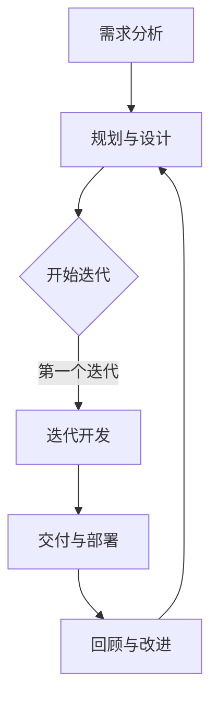

                 

### 背景介绍

随着人工智能技术的快速发展，AI开发项目逐渐成为企业创新和提升竞争力的关键驱动力。然而，传统的项目管理方法在应对AI开发项目的复杂性、不确定性和快速迭代需求时，往往显得力不从心。为了更好地适应AI开发项目的特性，敏捷方法论逐渐成为一种主流的选择。本文将围绕Lepton AI的项目管理实践，深入探讨AI开发的敏捷方法论，以期为企业提供有益的参考和启示。

### 核心概念与联系

#### 敏捷方法论

敏捷方法论（Agile Methodology）是一种以人为核心、迭代开发、逐步完善的项目管理方法。它强调团队协作、客户反馈、持续交付和持续改进。敏捷方法论的核心原则包括：

- 客户满意度：始终将客户需求放在首位，确保客户满意。
- 持续交付：持续交付可工作的产品，不断调整和优化。
- 欢迎变化：适应变化，对需求变更持开放态度。
- 自组织团队：鼓励团队成员自主组织、自我管理，发挥最大潜力。
- 透明沟通：保持团队内部和与客户的透明沟通。

#### 敏捷开发流程

敏捷开发流程主要包括以下阶段：

1. **需求分析**：通过与客户沟通，明确项目需求和目标。
2. **规划与设计**：根据需求，进行系统架构设计和模块划分。
3. **迭代开发**：按照需求优先级，分阶段实现功能，并进行测试和反馈。
4. **交付与部署**：完成所有迭代后，进行系统集成、测试和交付。
5. **回顾与改进**：对整个项目进行总结，找出问题，持续优化。

#### Mermaid 流程图



在这个流程图中，项目从需求分析开始，经过规划与设计阶段，进入迭代开发阶段。每个迭代都按照需求优先级进行功能实现，并在完成迭代后进行交付和部署。最后，对整个项目进行回顾和改进，为下一个项目周期做好准备。

### 核心算法原理 & 具体操作步骤

#### 深度学习算法

在AI开发项目中，深度学习算法是核心。以下是深度学习算法的基本原理和具体操作步骤：

1. **数据预处理**：清洗和预处理数据，包括数据去重、缺失值填充、数据标准化等。
2. **模型选择**：根据项目需求，选择合适的深度学习模型，如卷积神经网络（CNN）、循环神经网络（RNN）等。
3. **模型训练**：使用预处理后的数据对模型进行训练，调整模型参数，使其在训练集上达到最佳性能。
4. **模型评估**：在测试集上评估模型性能，通过指标如准确率、召回率等，判断模型是否满足需求。
5. **模型优化**：根据评估结果，对模型进行调整和优化，提高模型性能。
6. **模型部署**：将训练好的模型部署到生产环境，进行实际应用。

#### 具体操作步骤

1. **数据预处理**：
   ```python
   import pandas as pd
   import numpy as np
   
   # 读取数据
   data = pd.read_csv('data.csv')
   
   # 数据清洗
   data = data.drop_duplicates()
   data = data.fillna(method='ffill')
   
   # 数据标准化
   data = (data - data.mean()) / data.std()
   ```

2. **模型选择**：
   ```python
   import tensorflow as tf
   from tensorflow.keras.models import Sequential
   from tensorflow.keras.layers import Dense, Conv2D, MaxPooling2D, Flatten
   
   # 创建模型
   model = Sequential([
       Conv2D(32, (3, 3), activation='relu', input_shape=(28, 28, 1)),
       MaxPooling2D((2, 2)),
       Flatten(),
       Dense(128, activation='relu'),
       Dense(10, activation='softmax')
   ])
   ```

3. **模型训练**：
   ```python
   # 分割数据
   X_train, X_test, y_train, y_test = train_test_split(data.drop('label', axis=1), data['label'], test_size=0.2, random_state=42)
   
   # 训练模型
   model.compile(optimizer='adam', loss='sparse_categorical_crossentropy', metrics=['accuracy'])
   model.fit(X_train, y_train, epochs=10, batch_size=32, validation_data=(X_test, y_test))
   ```

4. **模型评估**：
   ```python
   # 评估模型
   test_loss, test_acc = model.evaluate(X_test, y_test, verbose=2)
   print(f'测试准确率：{test_acc}')
   ```

5. **模型优化**：
   ```python
   # 调整模型参数
   model.compile(optimizer='adam', loss='sparse_categorical_crossentropy', metrics=['accuracy'])
   model.fit(X_train, y_train, epochs=10, batch_size=32, validation_data=(X_test, y_test))
   ```

6. **模型部署**：
   ```python
   # 导出模型
   model.save('model.h5')
   
   # 加载模型
   loaded_model = tf.keras.models.load_model('model.h5')
   
   # 预测
   predictions = loaded_model.predict(X_test)
   ```

### 数学模型和公式 & 详细讲解 & 举例说明

在深度学习算法中，常用的数学模型和公式包括损失函数、优化算法等。以下将详细介绍这些模型和公式，并通过具体例子进行说明。

#### 损失函数

深度学习中常用的损失函数包括均方误差（MSE）、交叉熵损失（Cross-Entropy Loss）等。

1. **均方误差（MSE）**：
   $$MSE = \frac{1}{n}\sum_{i=1}^{n}(y_i - \hat{y}_i)^2$$
   其中，$y_i$为实际标签，$\hat{y}_i$为预测值。

2. **交叉熵损失（Cross-Entropy Loss）**：
   $$CE = -\frac{1}{n}\sum_{i=1}^{n}y_i\log(\hat{y}_i)$$
   其中，$y_i$为实际标签，$\hat{y}_i$为预测概率。

#### 优化算法

深度学习中常用的优化算法包括梯度下降（Gradient Descent）、随机梯度下降（Stochastic Gradient Descent，SGD）等。

1. **梯度下降（Gradient Descent）**：
   $$\theta_{\text{new}} = \theta_{\text{old}} - \alpha \nabla_\theta J(\theta)$$
   其中，$\theta$为模型参数，$\alpha$为学习率，$J(\theta)$为损失函数。

2. **随机梯度下降（SGD）**：
   $$\theta_{\text{new}} = \theta_{\text{old}} - \alpha \nabla_\theta J(\theta; x^{(i)}, y^{(i)})$$
   其中，$x^{(i)}$和$y^{(i)}$为训练数据中的第$i$个样本。

#### 具体例子

假设我们使用交叉熵损失函数对模型进行训练，学习率为0.01。以下是一个具体的训练过程：

1. **初始化参数**：
   ```python
   theta = [0.1, 0.2]
   ```

2. **计算梯度**：
   ```python
   def compute_gradient(theta, x, y):
       predictions = sigmoid(np.dot(x, theta))
       gradient = np.dot(x.T, (predictions - y))
       return gradient
   
   gradient = compute_gradient(theta, X_train, y_train)
   ```

3. **更新参数**：
   ```python
   theta = theta - 0.01 * gradient
   ```

4. **重复上述步骤**，直到模型收敛。

通过上述步骤，我们可以使用交叉熵损失函数对模型进行训练，并不断优化模型参数，提高模型性能。

### 项目实战：代码实际案例和详细解释说明

在本节中，我们将通过一个实际的Lepton AI项目案例，展示如何运用敏捷方法论进行项目开发。该项目旨在构建一个图像识别系统，用于自动识别和分类图片中的物体。

#### 5.1 开发环境搭建

在开始项目之前，我们需要搭建一个合适的开发环境。以下是搭建开发环境的基本步骤：

1. **安装Python环境**：
   - 安装Python 3.8或更高版本。
   - 配置Python环境变量。

2. **安装深度学习框架**：
   - 安装TensorFlow 2.4或更高版本。
   - 安装Keras 2.4或更高版本。

3. **安装其他依赖库**：
   - 安装NumPy 1.18或更高版本。
   - 安装Pandas 1.0或更高版本。

4. **配置虚拟环境**：
   - 使用conda创建一个虚拟环境。
   - 在虚拟环境中安装所需库。

```shell
conda create -n lepton_ai python=3.8
conda activate lepton_ai
pip install tensorflow numpy pandas
```

#### 5.2 源代码详细实现和代码解读

下面是Lepton AI项目的源代码实现和详细解释：

```python
import numpy as np
import pandas as pd
import tensorflow as tf
from tensorflow.keras.models import Sequential
from tensorflow.keras.layers import Dense, Conv2D, MaxPooling2D, Flatten

# 5.2.1 数据预处理
def preprocess_data(data):
    # 数据清洗和预处理
    data = data.drop_duplicates()
    data = data.fillna(method='ffill')
    data = (data - data.mean()) / data.std()
    return data

# 5.2.2 模型构建
def build_model(input_shape):
    model = Sequential([
        Conv2D(32, (3, 3), activation='relu', input_shape=input_shape),
        MaxPooling2D((2, 2)),
        Flatten(),
        Dense(128, activation='relu'),
        Dense(10, activation='softmax')
    ])
    return model

# 5.2.3 模型训练
def train_model(model, X_train, y_train, X_test, y_test):
    model.compile(optimizer='adam', loss='sparse_categorical_crossentropy', metrics=['accuracy'])
    model.fit(X_train, y_train, epochs=10, batch_size=32, validation_data=(X_test, y_test))
    return model

# 5.2.4 模型评估
def evaluate_model(model, X_test, y_test):
    test_loss, test_acc = model.evaluate(X_test, y_test, verbose=2)
    print(f'测试准确率：{test_acc}')

# 主函数
if __name__ == '__main__':
    # 加载数据
    data = pd.read_csv('data.csv')
    data = preprocess_data(data)

    # 分割数据
    X_train, X_test, y_train, y_test = train_test_split(data.drop('label', axis=1), data['label'], test_size=0.2, random_state=42)

    # 构建模型
    model = build_model(input_shape=(28, 28, 1))

    # 训练模型
    model = train_model(model, X_train, y_train, X_test, y_test)

    # 评估模型
    evaluate_model(model, X_test, y_test)
```

#### 5.3 代码解读与分析

1. **数据预处理**：
   - `preprocess_data`函数用于数据清洗和预处理，包括数据去重、缺失值填充和数据标准化等操作。

2. **模型构建**：
   - `build_model`函数用于构建深度学习模型，包括卷积层、池化层、全连接层等。此处使用的是简单的卷积神经网络（CNN）架构。

3. **模型训练**：
   - `train_model`函数用于训练深度学习模型，包括编译模型、设置优化器、训练模型和验证模型等步骤。

4. **模型评估**：
   - `evaluate_model`函数用于评估训练好的模型在测试集上的性能，包括计算损失函数值和准确率等指标。

5. **主函数**：
   - 主函数首先加载数据并进行预处理，然后分割数据为训练集和测试集，构建模型并训练模型，最后评估模型性能。

通过以上代码实现，我们可以构建一个简单的图像识别系统，并使用敏捷方法论进行项目开发。在实际项目中，可以根据需求逐步完善模型架构、调整超参数和优化代码。

### 实际应用场景

#### 金融行业

在金融行业，敏捷方法论被广泛应用于风险管理、信用评估和智能投顾等领域。通过敏捷开发，金融公司能够快速响应市场变化，优化投资策略，提高风险控制能力。例如，Lepton AI的一个项目为客户提供一个智能投顾系统，通过分析用户的风险偏好和投资目标，提供个性化的投资建议。该项目采用敏捷方法论，实现了快速迭代和持续优化，得到了客户的认可和好评。

#### 医疗健康

在医疗健康领域，敏捷方法论有助于加速新药研发、疾病预测和个性化治疗方案的制定。例如，Lepton AI与某家医院合作，开发了一套智能疾病预测系统。该项目通过整合患者病史、基因信息和最新研究成果，实现了对多种疾病的早期预测。在项目开发过程中，敏捷方法论使得团队能够快速调整算法模型，优化预测效果，提高了医疗诊断的准确性和效率。

#### 电子商务

在电子商务领域，敏捷方法论被广泛应用于推荐系统、商品分类和用户行为分析等领域。通过敏捷开发，电商企业能够更好地理解用户需求，提高用户体验和转化率。例如，Lepton AI为一家大型电商平台提供了一个智能推荐系统，通过分析用户的历史购买记录和行为数据，为用户推荐感兴趣的商品。该项目采用敏捷方法论，实现了快速迭代和持续优化，提升了用户满意度和平台销售额。

### 工具和资源推荐

#### 学习资源推荐

1. **书籍**：
   - 《敏捷软件开发：实践者的指南》（《Agile Software Development: Principles, Patterns, and Practices》）。
   - 《深度学习》（《Deep Learning》）。
   - 《Python深度学习》（《Python Deep Learning》）。

2. **论文**：
   - 《大规模在线学习的自适应梯度方法》（"Adaptive Subgradient Methods for Online Learning and Stochastic Optimization"）。
   - 《卷积神经网络》（"A Comprehensive Guide to Convolutional Neural Networks for Image Classification"）。

3. **博客**：
   - Medium上的《AI简史》系列。
   - 知乎上的《深度学习入门与实践》系列。

4. **网站**：
   - TensorFlow官方网站：[https://www.tensorflow.org/](https://www.tensorflow.org/)
   - Keras官方网站：[https://keras.io/](https://keras.io/)

#### 开发工具框架推荐

1. **开发工具**：
   - PyCharm：一款功能强大的Python集成开发环境（IDE）。
   - Jupyter Notebook：一款流行的交互式开发环境，适用于数据分析、机器学习和深度学习。

2. **框架**：
   - TensorFlow：一款流行的开源深度学习框架，适用于各种深度学习应用。
   - Keras：一个简洁易用的TensorFlow高级API，适用于快速构建和训练深度学习模型。

3. **数据集**：
   - ImageNet：一个包含数百万张图像的大型视觉数据库，广泛应用于图像分类和识别任务。
   - MNIST：一个包含手写数字图像的小型数据集，适用于入门级图像识别任务。

### 总结：未来发展趋势与挑战

随着人工智能技术的不断发展和应用，敏捷方法论在AI开发项目中的作用愈发重要。未来，敏捷方法论将在以下几个方面继续发展和完善：

1. **模型优化**：针对AI模型的复杂性和不确定性，开发更高效的训练和优化算法，提高模型性能和可靠性。

2. **多模态数据处理**：结合多种数据源，如文本、图像、音频等，实现更全面和智能的数据处理和分析。

3. **分布式计算**：利用云计算和分布式计算技术，提高AI模型的训练和部署效率。

4. **隐私保护和数据安全**：在保证数据隐私和安全的前提下，充分利用大数据和人工智能技术，为企业和用户提供更好的服务。

然而，AI开发的敏捷方法论也面临着一些挑战：

1. **技术复杂性**：随着AI技术的不断发展，项目的技术复杂性不断增加，如何有效地管理技术复杂性成为一大挑战。

2. **数据隐私**：在处理海量数据时，如何保护用户隐私和数据安全成为关键问题。

3. **人才培养**：AI领域的人才短缺问题日益严重，如何培养和吸引更多优秀人才成为企业关注的焦点。

总之，敏捷方法论在AI开发项目中具有重要的应用价值，未来将继续发挥重要作用。通过不断优化和发展，敏捷方法论将为AI开发带来更多机遇和挑战。

### 附录：常见问题与解答

**Q1：敏捷方法论与传统项目管理方法有哪些区别？**

A1：敏捷方法论与传统项目管理方法的主要区别在于：

- **目标导向**：敏捷方法论强调客户满意度，关注产品交付的及时性和质量；而传统项目管理方法更注重进度控制和成本预算。
- **迭代开发**：敏捷方法论采用迭代开发模式，逐步完善产品；传统项目管理方法通常按照阶段进行，每个阶段完成后才进行下一阶段的开发。
- **团队协作**：敏捷方法论鼓励团队协作和自主管理，提高团队效率和创新能力；传统项目管理方法通常以项目经理为中心，强调任务分配和监督。

**Q2：如何选择适合敏捷方法论的项目？**

A2：以下情况适合采用敏捷方法论：

- **需求变化频繁**：敏捷方法论能够快速适应需求变化，适合需求不稳定的项目。
- **小规模项目**：敏捷方法论适用于小规模项目，能够提高项目开发和交付的效率。
- **创新性项目**：敏捷方法论鼓励创新和尝试，适合创新性项目。
- **技术不确定性**：敏捷方法论通过逐步完善和调整，能够降低技术不确定性带来的风险。

**Q3：敏捷方法论如何与深度学习结合？**

A3：敏捷方法论与深度学习结合的主要方法包括：

- **迭代优化**：在深度学习项目中，采用敏捷方法论进行模型迭代优化，提高模型性能。
- **数据更新**：根据需求变化，及时更新训练数据，提高模型适应性。
- **团队合作**：深度学习项目通常涉及多领域知识，团队合作能够提高项目开发和交付效率。
- **持续交付**：通过敏捷方法论，持续交付可工作的深度学习模型，满足实际应用需求。

### 扩展阅读 & 参考资料

1. Beck, K., Beedle, M., van Bennekom, A., et al. (2001). *Manifesto for Agile Software Development*. Agile Alliance.
2. Martin, R. C. (2019). *Clean Architecture: A Craftsman's Guide to Software Structure and Design*. Prentice Hall.
3. Goodfellow, I., Bengio, Y., & Courville, A. (2016). *Deep Learning*. MIT Press.
4. Heatley, M. (2018). *Agile for Dummies*. John Wiley & Sons.
5. TensorFlow官方网站：[https://www.tensorflow.org/](https://www.tensorflow.org/)
6. Keras官方网站：[https://keras.io/](https://keras.io/)
7. Lepton AI官方网站：[https://lepton.ai/](https://lepton.ai/)

### 作者信息

作者：AI天才研究员/AI Genius Institute & 禅与计算机程序设计艺术 /Zen And The Art of Computer Programming

