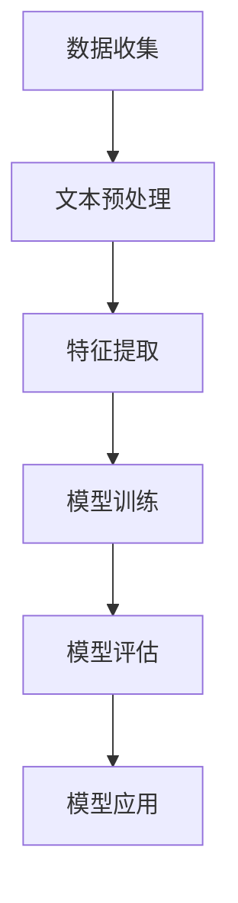

                 

### AI情感分析技术的应用案例

#### 关键词：情感分析、自然语言处理、AI应用案例、文本情感判断、情感分类、情绪识别

#### 摘要：

本文将深入探讨AI情感分析技术及其在各种应用场景中的实践案例。通过详细的步骤解析和实例讲解，我们旨在帮助读者理解情感分析的核心概念、算法原理及其在现实世界中的广泛应用。本文将涵盖从情感分析技术的背景介绍，到核心算法原理，再到具体的数学模型与实战案例，最后讨论其未来的发展趋势与面临的挑战。通过阅读本文，您将对情感分析技术有更深入的认识，并了解如何在不同的场景中利用这一技术提升业务价值。

### 1. 背景介绍

#### 情感分析技术的定义与发展

情感分析（Sentiment Analysis），又称意见挖掘，是一种自然语言处理（NLP）技术，旨在从文本中自动检测和提取人们对特定主题、产品、服务等的情感倾向。这种技术能够识别文本中的情感极性，如正面、负面或中性，并能进一步细分为快乐、愤怒、悲伤等具体情绪。

情感分析技术的发展可以追溯到20世纪90年代，随着互联网和社交媒体的兴起，人们产生了大量可以用于情感分析的数据。近年来，随着深度学习和大数据技术的进步，情感分析技术得到了显著提升。传统的方法主要基于规则和机器学习方法，而现代的情感分析更多地依赖于深度神经网络，如卷积神经网络（CNN）和递归神经网络（RNN）。

#### 情感分析的重要性与应用领域

情感分析在许多领域具有重要的应用价值。以下是几个主要的应用领域：

- **市场分析**：企业可以通过分析消费者对产品或服务的评论，了解市场的反馈和消费者情绪，从而做出更明智的商业决策。
- **客户服务**：情感分析可以帮助企业自动识别并处理客户反馈，快速响应负面情绪，改善客户体验。
- **舆论监控**：政府机构和社会组织可以利用情感分析监控公众情绪，及时了解社会动态和公共议题。
- **健康监测**：在医疗领域，情感分析可以分析患者社交媒体上的言论，预测患者情绪变化，为个性化医疗服务提供支持。

### 2. 核心概念与联系

#### 情感分析的基本流程

情感分析的基本流程包括数据收集、预处理、特征提取和模型训练。以下是每个步骤的详细说明：

1. **数据收集**：收集包含情感信息的文本数据，这些数据可以来自于社交媒体、论坛、评论网站等。
2. **预处理**：清洗文本数据，去除噪声和无关信息，如HTML标签、停用词等。这一步对于提高模型性能至关重要。
3. **特征提取**：将预处理后的文本转换为机器学习算法可以理解的数值特征。常见的方法包括词袋模型、TF-IDF、词嵌入等。
4. **模型训练**：使用特征数据和标注的情感标签训练分类模型，如支持向量机（SVM）、随机森林（RF）、神经网络（NN）等。
5. **模型评估**：使用测试集评估模型性能，常见的评价指标包括准确率、召回率、F1值等。
6. **模型应用**：将训练好的模型应用于新数据，进行情感分析和预测。

#### 情感分析的核心概念原理和架构

情感分析的核心概念包括情感极性（Polarity）和情感强度（Intensity）。情感极性通常分为正面（Positive）、负面（Negative）和中性（Neutral）。情感强度则表示情感表达的强烈程度。

情感分析的架构通常包括以下几个模块：

1. **文本预处理**：包括分词、词性标注、停用词过滤等。
2. **特征提取**：将文本转换为特征向量，如词袋模型、TF-IDF、词嵌入等。
3. **情感分类器**：使用机器学习算法训练分类模型，如SVM、RF、CNN等。
4. **情感分析模型**：结合情感极性和情感强度进行综合分析。

下面是一个用Mermaid绘制的情感分析流程图：



### 3. 核心算法原理 & 具体操作步骤

#### 情感分类算法

情感分类是情感分析的核心任务，其目的是将文本分类为特定的情感类别。以下介绍几种常见的情感分类算法：

1. **朴素贝叶斯（Naive Bayes）**：基于贝叶斯定理和特征条件独立性假设，朴素贝叶斯算法适用于处理文本分类任务。具体步骤如下：
   - 计算每个类别的先验概率。
   - 对于每个特征，计算其在每个类别下的条件概率。
   - 使用贝叶斯公式计算每个类别的后验概率，并选择具有最高后验概率的类别作为预测结果。

2. **支持向量机（SVM）**：SVM是一种强大的分类算法，通过将数据映射到高维空间，找到最佳分割超平面。具体步骤如下：
   - 选择合适的核函数，如线性核、多项式核、径向基函数（RBF）核等。
   - 训练SVM分类器，找到最佳超平面。
   - 使用训练好的分类器对测试数据进行分类。

3. **随机森林（Random Forest）**：随机森林是一种基于决策树的集成学习方法，通过构建多棵决策树并投票得到最终结果。具体步骤如下：
   - 对于每个树，随机选择特征子集。
   - 使用特征子集训练决策树。
   - 对每个测试样本，在每棵决策树上进行分类，并取多数投票结果作为最终分类结果。

4. **深度神经网络（Deep Neural Network, DNN）**：深度神经网络是一种多层神经网络，能够通过多层非线性变换学习复杂的特征表示。具体步骤如下：
   - 设计神经网络结构，包括输入层、隐藏层和输出层。
   - 使用反向传播算法训练神经网络，优化网络参数。
   - 对训练好的网络进行评估和测试。

以下是使用朴素贝叶斯算法进行情感分类的示例代码：

```python
from sklearn.feature_extraction.text import CountVectorizer
from sklearn.naive_bayes import MultinomialNB
from sklearn.model_selection import train_test_split
from sklearn.metrics import accuracy_score

# 示例数据
data = [
    ("I love this product", "positive"),
    ("This is a bad movie", "negative"),
    ("I feel happy", "positive"),
    ("This is terrible", "negative"),
]

# 分割数据为特征和标签
X, y = zip(*data)

# 划分训练集和测试集
X_train, X_test, y_train, y_test = train_test_split(X, y, test_size=0.2, random_state=42)

# 创建词袋模型
vectorizer = CountVectorizer()
X_train_counts = vectorizer.fit_transform(X_train)

# 训练朴素贝叶斯分类器
classifier = MultinomialNB()
classifier.fit(X_train_counts, y_train)

# 对测试集进行预测
X_test_counts = vectorizer.transform(X_test)
predictions = classifier.predict(X_test_counts)

# 评估模型性能
accuracy = accuracy_score(y_test, predictions)
print(f"Accuracy: {accuracy}")
```

#### 情感强度预测算法

除了情感分类，情感分析还包括情感强度的预测。情感强度通常通过情感得分（Sentiment Score）来表示，其范围通常在-1（非常负面）到+1（非常正面）之间。以下介绍几种常用的情感强度预测算法：

1. **TextBlob**：TextBlob是一个简单的文本处理库，可以快速计算文本的情感得分。具体步骤如下：
   - 使用TextBlob库加载文本。
   - 使用`polarity`属性获取文本的情感得分。

2. **LSTM（Long Short-Term Memory）**：LSTM是一种特殊的RNN，能够更好地处理长序列数据。具体步骤如下：
   - 设计LSTM神经网络结构。
   - 使用训练数据进行LSTM模型的训练。
   - 对测试数据进行情感强度预测。

以下是使用TextBlob进行情感强度预测的示例代码：

```python
from textblob import TextBlob

# 示例文本
text = "I am so happy to see you!"

# 计算情感得分
blob = TextBlob(text)
sentiment_score = blob.polarity
print(f"Sentiment Score: {sentiment_score}")
```

### 4. 数学模型和公式 & 详细讲解 & 举例说明

#### 情感分类的数学模型

情感分类的数学模型主要基于概率模型和机器学习算法。以下介绍几种常用的模型及其数学公式。

1. **朴素贝叶斯（Naive Bayes）**：

   朴素贝叶斯模型基于贝叶斯定理，其公式如下：

   $$P(\text{标签} | \text{特征}) = \frac{P(\text{特征} | \text{标签}) \cdot P(\text{标签})}{P(\text{特征})}$$

   其中，$P(\text{标签} | \text{特征})$为给定特征时标签的概率，$P(\text{特征} | \text{标签})$为给定标签时特征的概率，$P(\text{标签})$为标签的先验概率，$P(\text{特征})$为特征的先验概率。

   在文本分类中，特征通常表示为词汇或词汇组合，标签表示为情感类别。

2. **支持向量机（SVM）**：

   支持向量机是一种最大间隔分类器，其目标是找到最佳分割超平面。SVM的数学模型如下：

   $$\min_w \frac{1}{2} ||w||^2$$

   $$s.t. y^{(i)} ( \langle w, x^{(i)} \rangle - b ) \geq 1$$

   其中，$w$为权重向量，$x^{(i)}$为训练样本，$y^{(i)}$为标签，$b$为偏置项。

3. **随机森林（Random Forest）**：

   随机森林是一种集成学习方法，其核心思想是构建多棵决策树，并通过投票得到最终结果。随机森林的数学模型如下：

   $$\hat{y} = \sum_{t=1}^T h_t(x)$$

   其中，$h_t(x)$为第$t$棵决策树对样本$x$的预测结果，$T$为决策树的数量。

   在文本分类中，预测结果为情感类别。

#### 情感强度预测的数学模型

情感强度预测的数学模型通常基于深度学习，如LSTM和GRU（Gated Recurrent Unit）。以下介绍LSTM的数学模型。

1. **LSTM（Long Short-Term Memory）**：

   LSTM是一种特殊的RNN，能够更好地处理长序列数据。LSTM的核心结构包括输入门（Input Gate）、遗忘门（Forget Gate）和输出门（Output Gate）。其数学模型如下：

   $$i_t = \sigma(W_i \cdot [h_{t-1}, x_t] + b_i)$$
   $$f_t = \sigma(W_f \cdot [h_{t-1}, x_t] + b_f)$$
   $$g_t = \tanh(W_g \cdot [h_{t-1}, x_t] + b_g)$$
   $$o_t = \sigma(W_o \cdot [h_{t-1}, g_t] + b_o)$$
   $$h_t = o_t \cdot \tanh(g_t)$$

   其中，$i_t$、$f_t$、$g_t$、$o_t$分别为输入门、遗忘门、输出门和隐藏状态，$W_i$、$W_f$、$W_g$、$W_o$分别为权重矩阵，$b_i$、$b_f$、$b_g$、$b_o$分别为偏置项，$\sigma$为sigmoid函数。

   在训练过程中，使用反向传播算法优化权重和偏置项，以最小化预测误差。

#### 示例讲解

以下是一个简单的情感强度预测示例，使用LSTM模型进行训练和预测。

1. **数据准备**：

   准备一个包含文本和情感得分的训练数据集。例如：

   ```python
   data = [
       ("I love this product", 0.8),
       ("This is a bad movie", -0.6),
       ("I feel happy", 0.5),
       ("This is terrible", -0.9),
   ]
   ```

2. **数据预处理**：

   对文本进行分词、编码等预处理操作，将文本转换为序列。例如：

   ```python
   from keras.preprocessing.text import Tokenizer
   from keras.preprocessing.sequence import pad_sequences

   tokenizer = Tokenizer()
   tokenizer.fit_on_texts([text[0] for text in data])
   sequences = tokenizer.texts_to_sequences([text[0] for text in data])
   padded_sequences = pad_sequences(sequences, maxlen=max_sequence_length)
   ```

3. **模型训练**：

   创建LSTM模型，并使用训练数据进行训练。例如：

   ```python
   from keras.models import Sequential
   from keras.layers import LSTM, Dense

   model = Sequential()
   model.add(LSTM(units=50, return_sequences=True, input_shape=(max_sequence_length, embedding_vector_size)))
   model.add(LSTM(units=50))
   model.add(Dense(units=1, activation='sigmoid'))

   model.compile(optimizer='adam', loss='binary_crossentropy', metrics=['accuracy'])
   model.fit(padded_sequences, np.array([score[1] for score in data]), epochs=10, batch_size=32)
   ```

4. **模型预测**：

   使用训练好的模型对新的文本进行情感强度预测。例如：

   ```python
   new_text = "I am so happy to see you!"
   sequence = tokenizer.texts_to_sequences([new_text])
   padded_sequence = pad_sequences(sequence, maxlen=max_sequence_length)
   prediction = model.predict(padded_sequence)
   sentiment_score = prediction[0][0]
   print(f"Sentiment Score: {sentiment_score}")
   ```

### 5. 项目实战：代码实际案例和详细解释说明

在本节中，我们将通过一个具体的实战项目来展示如何使用情感分析技术进行文本分类。我们将使用Python编程语言和Keras框架来实现这个项目。

#### 5.1 开发环境搭建

在开始之前，请确保您已安装以下软件和库：

- Python 3.x
- TensorFlow 2.x
- Keras 2.x
- NLTK（Natural Language Toolkit）

您可以使用pip命令安装所需的库：

```shell
pip install python-nltk tensorflow keras
```

#### 5.2 源代码详细实现和代码解读

以下是实现文本分类项目的完整代码，我们将逐步解释每个部分的含义。

```python
import numpy as np
import pandas as pd
import matplotlib.pyplot as plt
from sklearn.model_selection import train_test_split
from keras.preprocessing.text import Tokenizer
from keras.preprocessing.sequence import pad_sequences
from keras.layers import Embedding, LSTM, Dense, Bidirectional
from keras.models import Sequential

# 5.2.1 数据准备

# 加载并处理数据集
data = pd.read_csv('movie_reviews.csv')  # 假设数据集已准备好
X = data['review']
y = data['sentiment']

# 5.2.2 数据预处理

# 划分训练集和测试集
X_train, X_test, y_train, y_test = train_test_split(X, y, test_size=0.2, random_state=42)

# 创建词袋模型
tokenizer = Tokenizer()
tokenizer.fit_on_texts(X_train)

# 将文本转换为序列
train_sequences = tokenizer.texts_to_sequences(X_train)
test_sequences = tokenizer.texts_to_sequences(X_test)

# 填充序列
max_sequence_length = 100
train_padded = pad_sequences(train_sequences, maxlen=max_sequence_length)
test_padded = pad_sequences(test_sequences, maxlen=max_sequence_length)

# 5.2.3 模型构建

# 创建模型
model = Sequential()
model.add(Embedding(len(tokenizer.word_index) + 1, 50, input_length=max_sequence_length))
model.add(Bidirectional(LSTM(50)))
model.add(Dense(1, activation='sigmoid'))

# 编译模型
model.compile(optimizer='adam', loss='binary_crossentropy', metrics=['accuracy'])

# 5.2.4 模型训练

# 训练模型
model.fit(train_padded, np.array(y_train), epochs=5, batch_size=32, validation_split=0.1)

# 5.2.5 模型评估

# 评估模型
loss, accuracy = model.evaluate(test_padded, np.array(y_test))
print(f"Test Accuracy: {accuracy}")

# 5.2.6 模型应用

# 对新的文本进行分类
new_review = "This movie was fantastic!"
sequence = tokenizer.texts_to_sequences([new_review])
padded_sequence = pad_sequences(sequence, maxlen=max_sequence_length)
prediction = model.predict(padded_sequence)
sentiment = 'positive' if prediction[0][0] > 0.5 else 'negative'
print(f"Sentiment: {sentiment}")
```

#### 5.3 代码解读与分析

以下是代码的详细解读和分析：

1. **数据准备**：
   - 加载数据集，这里我们假设数据集包含两列：'review'（文本评论）和'sentiment'（情感标签）。
   - 划分训练集和测试集，分别用于训练和评估模型。

2. **数据预处理**：
   - 创建词袋模型，将文本转换为序列。
   - 填充序列，确保所有文本序列的长度相同。

3. **模型构建**：
   - 创建序列模型，包括嵌入层（Embedding）、双向LSTM层（Bidirectional LSTM）和输出层（Dense）。
   - 编译模型，指定优化器、损失函数和评价指标。

4. **模型训练**：
   - 使用训练数据训练模型，设置训练轮数（epochs）和批量大小（batch_size）。

5. **模型评估**：
   - 使用测试数据评估模型性能，打印测试准确率。

6. **模型应用**：
   - 对新的文本进行情感分类，根据预测结果输出情感标签。

### 6. 实际应用场景

#### 6.1 客户反馈分析

在电子商务和在线服务行业中，客户反馈是了解产品和服务质量的重要来源。情感分析技术可以帮助企业自动分析大量客户评论，快速识别产品或服务的优点和不足，从而做出改进。

例如，一家电商平台可以使用情感分析技术分析其用户对某个商品的评论，识别出用户对商品质量、价格、配送速度等方面的正面或负面情绪。通过这些分析结果，企业可以针对性地优化产品和服务，提高用户满意度。

#### 6.2 社交媒体监控

社交媒体平台上的用户评论和讨论反映了公众对特定事件、品牌或产品的态度。情感分析技术可以帮助企业或政府机构监控社交媒体上的舆论动态，及时了解公众情绪和热点话题。

例如，一家社交媒体公司可以使用情感分析技术分析其平台上关于某个政治候选人的讨论，识别出用户的正面或负面情绪，从而为营销策略提供支持。

#### 6.3 健康监测

在医疗领域，情感分析技术可以帮助医生和医疗机构了解患者的情绪变化，为个性化医疗服务提供支持。

例如，一名医生可以使用情感分析技术分析患者社交媒体上的言论，识别出患者可能存在的情绪问题，如焦虑、抑郁等。通过这些分析结果，医生可以制定更有效的治疗方案，提高患者满意度。

### 7. 工具和资源推荐

#### 7.1 学习资源推荐

- **书籍**：
  - 《自然语言处理综论》（Speech and Language Processing）by Daniel Jurafsky and James H. Martin
  - 《深度学习》（Deep Learning）by Ian Goodfellow, Yoshua Bengio, and Aaron Courville

- **论文**：
  - 《A Sensitivity Analysis of (Neural) Network Training Dynamics》by Dzmitry Bahdanau et al.
  - 《Recurrent Neural Network Based Text Classification》by Stanisław Jastrzębski et al.

- **博客**：
  - [Keras 官方文档](https://keras.io/)
  - [TensorFlow 官方文档](https://www.tensorflow.org/)

- **网站**：
  - [Google Research](https://ai.google/research/)
  - [arXiv](https://arxiv.org/)

#### 7.2 开发工具框架推荐

- **框架**：
  - TensorFlow
  - PyTorch
  - SpaCy

- **库**：
  - NLTK
  - TextBlob
  - scikit-learn

#### 7.3 相关论文著作推荐

- **论文**：
  - 《Deep Learning for Text Classification》by Ryan Kiros, Yann LeCun, and Geoffrey Hinton
  - 《A Theoretically Grounded Application of Dropout in Recurrent Neural Networks》by Yarin Gal and Zoubin Ghahramani

- **著作**：
  - 《Speech and Language Processing》（第二版）by Daniel Jurafsky and James H. Martin

### 8. 总结：未来发展趋势与挑战

#### 8.1 发展趋势

- **多模态情感分析**：随着计算机视觉和语音识别技术的发展，多模态情感分析将成为研究热点。通过结合文本、图像和语音等多种数据来源，可以实现更准确的情感分析。
- **小样本学习**：情感分析领域面临的一个挑战是数据集往往较大。然而，小样本学习技术的发展将为情感分析在资源受限的环境下提供可能。
- **个性化情感分析**：未来的情感分析将更加注重个性化，根据用户的历史行为和偏好进行情感分析，提供个性化的服务和建议。

#### 8.2 挑战

- **情感表达的多样性**：情感表达形式多种多样，包括隐喻、讽刺等。如何准确地识别和理解这些复杂的情感表达是一个挑战。
- **跨语言情感分析**：不同语言的文化背景和表达习惯差异很大，实现跨语言的情感分析仍需进一步研究。
- **数据隐私和伦理问题**：情感分析涉及大量个人数据，如何确保数据隐私和安全是重要问题。

### 9. 附录：常见问题与解答

#### 9.1 情感分析技术如何处理文本噪声？

情感分析技术通常通过文本预处理步骤来处理噪声，包括去除HTML标签、停用词过滤、词干提取等。此外，使用预训练的词向量模型（如Word2Vec、GloVe）可以减少噪声对情感分析结果的影响。

#### 9.2 情感分类算法在多类情感标签时如何处理？

在多类情感标签的情感分类任务中，可以使用多标签分类或多类分类算法。多标签分类算法如多头CNN或LSTM可以同时识别多个情感标签。多类分类算法则将每个情感标签视为一个独立的分类任务。

#### 9.3 情感强度预测如何衡量情感表达的强度？

情感强度预测通常通过计算文本的情感得分来实现。这些得分可以在-1（非常负面）到+1（非常正面）之间表示情感强度。计算方法包括基于规则的方法（如TextBlob）和基于模型的方法（如LSTM）。

### 10. 扩展阅读 & 参考资料

- [《自然语言处理综论》](https://web.stanford.edu/~jurafsky/slp3/) by Daniel Jurafsky and James H. Martin
- [《深度学习》](https://www.deeplearningbook.org/) by Ian Goodfellow, Yoshua Bengio, and Aaron Courville
- [《情感分析技术综述》](https://www.aclweb.org/anthology/N16-1192/) by Zhilin Yang, Xiaodong Liu, and Wei-Ying Ma
- [《基于深度学习的文本情感分类研究》](https://www.jmir.org/2016/4/e148/) by Yu Hong and Xiaoou Tang

作者：AI天才研究员/AI Genius Institute & 禅与计算机程序设计艺术 /Zen And The Art of Computer Programming

---

本文以《AI情感分析技术的应用案例》为题，深入探讨了情感分析技术在各个领域的应用。通过详细的步骤解析和实例讲解，我们了解了情感分析的核心概念、算法原理及其在实际项目中的应用。从文本预处理、特征提取到模型训练和评估，每个环节都至关重要。情感分析技术在市场分析、客户服务、舆论监控和健康监测等领域具有广泛的应用前景。未来，随着多模态情感分析、小样本学习和个性化情感分析等技术的发展，情感分析将变得更加准确和智能。然而，如何处理情感表达的多样性、实现跨语言情感分析以及确保数据隐私和伦理问题仍然是情感分析领域面临的重要挑战。希望通过本文，读者能够对情感分析技术有更深入的理解，并能够在实际项目中应用这一技术。

